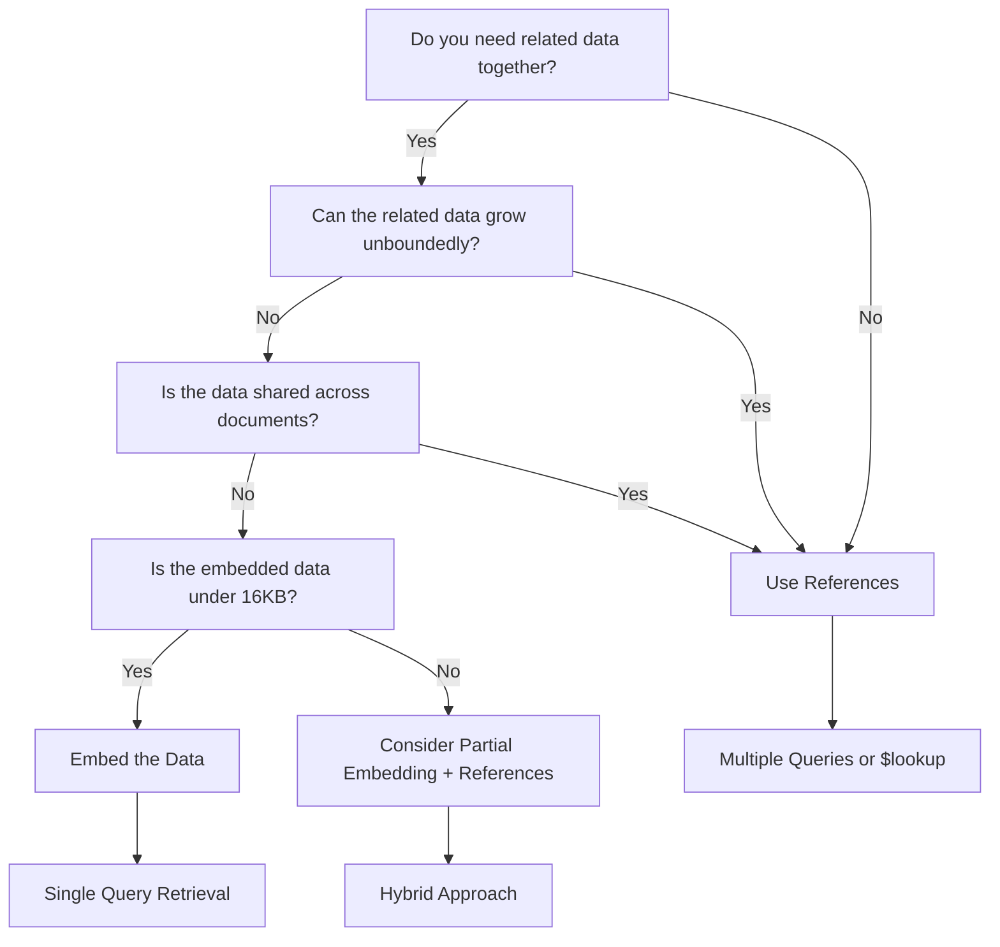

# How to Design MongoDB Schemas for Performance

Author: [nawazdhandala](https://www.github.com/nawazdhandala)

Tags: MongoDB, Schema Design, NoSQL, Performance, Database

Description: Learn how to design MongoDB schemas for performance with embedding vs referencing patterns, indexing strategies, and query optimization.

---

MongoDB gives you flexibility in how you structure your data, but that flexibility can be a double-edged sword. A poorly designed schema can lead to slow queries, bloated documents, and scaling headaches. This guide covers practical patterns for designing MongoDB schemas that perform well under real workloads.

## Understanding MongoDB Document Model

Before diving into patterns, let's understand how MongoDB stores and retrieves data.


MongoDB stores documents in BSON format. Each document can be up to 16MB and can contain nested objects and arrays. The way you structure these documents directly impacts query performance.

## Embedding vs Referencing: The Core Decision

The most fundamental schema design decision is whether to embed related data within a document or reference it from another collection.

### When to Embed

Embed data when:
- You always need the related data together
- The embedded data belongs exclusively to the parent
- The embedded array has a bounded size (won't grow indefinitely)

```javascript
// Good: Embedding an address within a user document
// The address is always needed with user data and belongs only to this user
const userSchema = {
  _id: ObjectId("507f1f77bcf86cd799439011"),
  name: "Alice Johnson",
  email: "alice@example.com",

  // Embedded address - retrieved in the same read operation
  address: {
    street: "123 Main St",
    city: "Seattle",
    state: "WA",
    zip: "98101"
  },

  // Embedded array with bounded size - users have limited payment methods
  paymentMethods: [
    { type: "credit", last4: "4242", brand: "visa" },
    { type: "credit", last4: "1234", brand: "mastercard" }
  ]
};
```

### When to Reference

Use references when:
- Related data is accessed independently
- Related data is shared across multiple documents
- The related collection could grow unboundedly

```javascript
// Good: Referencing orders from users
// Orders are queried independently and can grow without limit
const userSchema = {
  _id: ObjectId("507f1f77bcf86cd799439011"),
  name: "Alice Johnson",
  email: "alice@example.com"
  // No embedded orders - they're in a separate collection
};

const orderSchema = {
  _id: ObjectId("507f191e810c19729de860ea"),

  // Reference to the user - just store the ID
  userId: ObjectId("507f1f77bcf86cd799439011"),

  orderDate: ISODate("2026-01-15T10:30:00Z"),
  total: 149.99,
  items: [
    { productId: ObjectId("..."), name: "Widget", quantity: 2, price: 49.99 },
    { productId: ObjectId("..."), name: "Gadget", quantity: 1, price: 50.01 }
  ]
};
```

### Decision Flowchart



## Indexing Strategies for Performance

Indexes are critical for query performance. Without proper indexes, MongoDB must scan every document in a collection.

### Single Field Indexes

Create indexes on fields you frequently query or sort by:

```javascript
// Create an index on the email field for user lookups
db.users.createIndex({ email: 1 });

// Query that uses this index efficiently
db.users.findOne({ email: "alice@example.com" });
```

### Compound Indexes

For queries that filter on multiple fields, compound indexes are more efficient than multiple single-field indexes:

```javascript
// Compound index for queries filtering by status and date
// Index order matters: put equality matches first, then range/sort fields
db.orders.createIndex({
  status: 1,      // Equality match field first
  orderDate: -1   // Range/sort field second (descending for recent-first)
});

// This query uses the compound index efficiently
db.orders.find({
  status: "pending"
}).sort({ orderDate: -1 });

// This query also benefits from the index (uses prefix)
db.orders.find({ status: "shipped" });

// This query CANNOT use the index efficiently (missing the prefix)
db.orders.find({ orderDate: { $gte: ISODate("2026-01-01") } });
```

### Index for Embedded Fields

You can index fields within embedded documents:

```javascript
// Index on a nested field
db.users.createIndex({ "address.city": 1 });

// Query that uses the nested index
db.users.find({ "address.city": "Seattle" });
```

### Covered Queries

A covered query is one where all requested fields are in the index itself. MongoDB can return results directly from the index without reading the actual documents:

```javascript
// Create a compound index that covers common queries
db.products.createIndex({
  category: 1,
  price: 1,
  name: 1
});

// Covered query - only requests indexed fields
// Use projection to include only indexed fields (exclude _id)
db.products.find(
  { category: "electronics", price: { $lt: 100 } },
  { _id: 0, category: 1, price: 1, name: 1 }  // Projection matches index
);
```

## Schema Patterns for Common Use Cases

### Pattern 1: Extended Reference

Store frequently accessed fields from related documents to avoid joins:

```javascript
// Instead of just storing the author ID, embed commonly needed fields
const blogPostSchema = {
  _id: ObjectId("..."),
  title: "MongoDB Schema Design",
  content: "...",

  // Extended reference - embed fields you need for display
  author: {
    _id: ObjectId("507f1f77bcf86cd799439011"),
    name: "Alice Johnson",        // Duplicated for quick access
    avatarUrl: "/avatars/alice.jpg"  // Duplicated for quick access
  },

  publishedAt: ISODate("2026-01-20T14:00:00Z")
};

// Now you can display posts with author info in a single query
db.posts.find({ publishedAt: { $gte: ISODate("2026-01-01") } });
```

The tradeoff is that you need to update duplicated data when it changes:

```javascript
// When user updates their name, update all their posts
db.posts.updateMany(
  { "author._id": ObjectId("507f1f77bcf86cd799439011") },
  { $set: { "author.name": "Alice Smith" } }
);
```

### Pattern 2: Subset Pattern

For documents with large arrays, store only the most relevant subset:

```javascript
// Product with reviews - only embed recent/top reviews
const productSchema = {
  _id: ObjectId("..."),
  name: "Wireless Headphones",
  price: 79.99,

  // Subset: only the 10 most recent/helpful reviews
  topReviews: [
    {
      userId: ObjectId("..."),
      userName: "Bob",
      rating: 5,
      text: "Great sound quality!",
      helpful: 42,
      date: ISODate("2026-01-15")
    }
    // ... up to 10 reviews
  ],

  // Store aggregate stats instead of computing from all reviews
  reviewStats: {
    count: 1523,
    averageRating: 4.3
  }
};

// Full reviews are in a separate collection for detailed view
const reviewSchema = {
  _id: ObjectId("..."),
  productId: ObjectId("..."),
  userId: ObjectId("..."),
  userName: "Bob",
  rating: 5,
  text: "Great sound quality!",
  helpful: 42,
  date: ISODate("2026-01-15")
};
```

### Pattern 3: Bucket Pattern

Group time-series or sequential data into buckets to reduce document count and improve query performance:


```javascript
// Bucket pattern for IoT sensor data
// Instead of one document per reading, group readings by time period
const sensorBucketSchema = {
  _id: ObjectId("..."),
  sensorId: "sensor-001",

  // Bucket boundaries
  startTime: ISODate("2026-01-20T00:00:00Z"),
  endTime: ISODate("2026-01-20T23:59:59Z"),

  // Pre-computed aggregates for fast queries
  dayStats: {
    count: 1440,        // Number of readings in bucket
    avgTemp: 72.5,
    minTemp: 68.2,
    maxTemp: 76.8
  },

  // Array of readings within this bucket
  readings: [
    { time: ISODate("2026-01-20T00:00:00Z"), temp: 71.2, humidity: 45 },
    { time: ISODate("2026-01-20T00:01:00Z"), temp: 71.3, humidity: 44 },
    // ... more readings
  ]
};

// Index for efficient bucket retrieval
db.sensorData.createIndex({ sensorId: 1, startTime: -1 });

// Query daily stats without scanning individual readings
db.sensorData.find(
  {
    sensorId: "sensor-001",
    startTime: { $gte: ISODate("2026-01-01"), $lt: ISODate("2026-02-01") }
  },
  { dayStats: 1, startTime: 1 }  // Only return aggregates
);
```

### Pattern 4: Computed Pattern

Pre-compute values that would be expensive to calculate at query time:

```javascript
// E-commerce product with computed fields
const productSchema = {
  _id: ObjectId("..."),
  name: "Running Shoes",
  basePrice: 120.00,

  // Computed fields - updated when relevant data changes
  computed: {
    // Calculated from inventory collection
    totalStock: 245,
    lowStock: false,

    // Calculated from orders collection
    totalSold: 1823,
    lastSoldAt: ISODate("2026-01-20T15:30:00Z"),

    // Calculated from reviews collection
    reviewCount: 342,
    averageRating: 4.6,

    // Calculated based on sales velocity
    popularityScore: 87.5,

    // Last time computed fields were updated
    updatedAt: ISODate("2026-01-20T16:00:00Z")
  }
};

// Update computed fields periodically or on relevant events
async function updateProductStats(productId) {
  const [stockAgg, salesAgg, reviewAgg] = await Promise.all([
    // Calculate total stock
    db.inventory.aggregate([
      { $match: { productId } },
      { $group: { _id: null, total: { $sum: "$quantity" } } }
    ]).toArray(),

    // Calculate sales stats
    db.orders.aggregate([
      { $unwind: "$items" },
      { $match: { "items.productId": productId } },
      { $group: {
        _id: null,
        totalSold: { $sum: "$items.quantity" },
        lastSold: { $max: "$orderDate" }
      }}
    ]).toArray(),

    // Calculate review stats
    db.reviews.aggregate([
      { $match: { productId } },
      { $group: {
        _id: null,
        count: { $sum: 1 },
        avgRating: { $avg: "$rating" }
      }}
    ]).toArray()
  ]);

  // Update the product document with computed values
  await db.products.updateOne(
    { _id: productId },
    { $set: {
      "computed.totalStock": stockAgg[0]?.total || 0,
      "computed.lowStock": (stockAgg[0]?.total || 0) < 50,
      "computed.totalSold": salesAgg[0]?.totalSold || 0,
      "computed.lastSoldAt": salesAgg[0]?.lastSold,
      "computed.reviewCount": reviewAgg[0]?.count || 0,
      "computed.averageRating": reviewAgg[0]?.avgRating || 0,
      "computed.updatedAt": new Date()
    }}
  );
}
```

## Query Optimization Techniques

### Use Projections to Limit Returned Data

Only request the fields you need:

```javascript
// Bad: Returns entire document including large arrays
db.products.findOne({ _id: productId });

// Good: Returns only needed fields
db.products.findOne(
  { _id: productId },
  { name: 1, price: 1, "computed.averageRating": 1 }
);
```

### Avoid Large Skip Values

Pagination with large skip values is inefficient:

```javascript
// Bad: MongoDB must scan and discard 10000 documents
db.products.find().sort({ createdAt: -1 }).skip(10000).limit(20);

// Good: Use range-based pagination with an indexed field
// Store the last seen value and query from there
db.products.find({
  createdAt: { $lt: lastSeenCreatedAt }
}).sort({ createdAt: -1 }).limit(20);
```

### Use Explain to Analyze Queries

Always check query execution plans for slow queries:

```javascript
// Check how MongoDB executes your query
db.orders.find({
  status: "pending",
  orderDate: { $gte: ISODate("2026-01-01") }
}).explain("executionStats");

// Look for these in the output:
// - stage: "IXSCAN" (good) vs "COLLSCAN" (bad - full collection scan)
// - executionTimeMillis: query time in milliseconds
// - totalDocsExamined: how many documents MongoDB read
// - nReturned: how many documents matched
```

### Optimize Aggregation Pipelines

Order pipeline stages to reduce work early:

```javascript
// Good: Filter early, then transform
db.orders.aggregate([
  // $match early to reduce documents in pipeline
  { $match: {
    status: "completed",
    orderDate: { $gte: ISODate("2026-01-01") }
  }},

  // $project early to reduce document size
  { $project: {
    userId: 1,
    total: 1,
    orderDate: 1
  }},

  // Now group the reduced dataset
  { $group: {
    _id: "$userId",
    orderCount: { $sum: 1 },
    totalSpent: { $sum: "$total" }
  }},

  // Sort and limit last
  { $sort: { totalSpent: -1 }},
  { $limit: 100 }
]);
```

## Common Anti-Patterns to Avoid

### Unbounded Arrays

Arrays that grow without limit will eventually hit the 16MB document limit and degrade performance:

```javascript
// Bad: Comments array will grow forever
const postSchema = {
  _id: ObjectId("..."),
  title: "Popular Post",
  comments: [
    // This array could contain thousands of comments
  ]
};

// Good: Store comments in separate collection
const commentSchema = {
  _id: ObjectId("..."),
  postId: ObjectId("..."),  // Reference to parent post
  authorId: ObjectId("..."),
  text: "Great post!",
  createdAt: ISODate("2026-01-20T10:00:00Z")
};

// Create index for efficient comment retrieval
db.comments.createIndex({ postId: 1, createdAt: -1 });
```

### Over-Normalization

Splitting data into too many collections requires expensive joins:

```javascript
// Bad: Over-normalized - requires multiple queries or $lookup
const orderSchema = { _id: "...", customerId: "..." };
const orderItemSchema = { _id: "...", orderId: "...", productId: "..." };
const orderShippingSchema = { _id: "...", orderId: "...", address: "..." };
const orderPaymentSchema = { _id: "...", orderId: "...", method: "..." };

// Good: Keep related data together when it's always accessed together
const orderSchema = {
  _id: ObjectId("..."),
  customerId: ObjectId("..."),

  // Embed items - they belong to this order only
  items: [
    { productId: ObjectId("..."), name: "Widget", quantity: 2, price: 25.00 }
  ],

  // Embed shipping - one shipping per order
  shipping: {
    address: "123 Main St",
    city: "Seattle",
    method: "express",
    trackingNumber: "1Z999AA10123456784"
  },

  // Embed payment - one payment per order
  payment: {
    method: "credit",
    last4: "4242",
    amount: 50.00
  }
};
```

### Missing Indexes on Frequently Queried Fields

```javascript
// Check for queries doing collection scans
db.setProfilingLevel(1, { slowms: 100 });  // Log queries over 100ms

// Later, check the profile collection
db.system.profile.find({
  "planSummary": "COLLSCAN",
  ns: "mydb.orders"
}).sort({ millis: -1 });

// Create missing indexes based on slow query patterns
db.orders.createIndex({ customerId: 1, orderDate: -1 });
```

## Performance Monitoring

Set up monitoring to catch performance issues early:

```javascript
// Create a simple query performance logger
async function monitoredQuery(collection, operation, ...args) {
  const start = Date.now();

  try {
    const result = await collection[operation](...args);
    const duration = Date.now() - start;

    // Log slow queries
    if (duration > 100) {
      console.warn(`Slow query: ${collection.collectionName}.${operation}`, {
        duration: `${duration}ms`,
        args: JSON.stringify(args).slice(0, 200)
      });
    }

    return result;
  } catch (error) {
    console.error(`Query failed: ${collection.collectionName}.${operation}`, error);
    throw error;
  }
}

// Usage
const users = await monitoredQuery(db.users, 'find', { status: 'active' });
```

## Summary

Designing MongoDB schemas for performance comes down to a few key principles:

1. **Model for your queries**: Structure documents based on how you access data, not how it's logically organized
2. **Embed when data is accessed together**: Reduce network round trips by keeping related data in the same document
3. **Reference when data is independent**: Use separate collections for data that grows unboundedly or is accessed separately
4. **Index strategically**: Create compound indexes that match your query patterns, with equality fields first
5. **Pre-compute expensive calculations**: Store computed values to avoid aggregations at read time
6. **Monitor and iterate**: Use explain plans and profiling to identify and fix performance bottlenecks

The best schema design balances read performance, write performance, and storage efficiency based on your specific access patterns.
