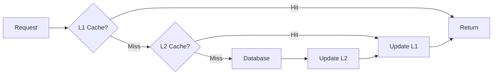

# How to Implement Multi-Level Caching in .NET

Author: [nawazdhandala](https://www.github.com/nawazdhandala)

Tags: .NET, C#, Caching, Redis, Performance, Distributed Systems

Description: Learn how to implement multi-level caching in .NET applications using in-memory and distributed caches together. This guide covers cache strategies, invalidation patterns, and production best practices.

---

Caching is one of the most effective ways to improve application performance, but a single cache layer often is not enough. Multi-level caching combines the speed of in-memory caching with the scalability of distributed caching. The local cache handles most requests with sub-millisecond latency, while the distributed cache provides consistency across multiple application instances.

## The Multi-Level Caching Pattern

The idea is simple: check the fastest cache first, then fall back to slower caches, and finally hit the database. Each level has different characteristics:

- **L1 (In-Memory)**: Fastest access (nanoseconds), but limited to a single instance
- **L2 (Distributed)**: Slower than L1 (milliseconds), but shared across instances
- **L3 (Database)**: Slowest but authoritative source of truth



## Setting Up the Cache Infrastructure

First, install the required packages:

```bash
dotnet add package Microsoft.Extensions.Caching.Memory
dotnet add package Microsoft.Extensions.Caching.StackExchangeRedis
```

Configure both caches in `Program.cs`:

```csharp
var builder = WebApplication.CreateBuilder(args);

// L1: In-memory cache
builder.Services.AddMemoryCache(options =>
{
    // Set size limit to prevent unbounded growth
    options.SizeLimit = 10000;
});

// L2: Redis distributed cache
builder.Services.AddStackExchangeRedisCache(options =>
{
    options.Configuration = builder.Configuration.GetConnectionString("Redis");
    options.InstanceName = "MyApp:";
});

// Register our multi-level cache
builder.Services.AddSingleton<IMultiLevelCache, MultiLevelCache>();
```

## Building the Multi-Level Cache

Create the abstraction and implementation:

```csharp
// Interfaces/IMultiLevelCache.cs
public interface IMultiLevelCache
{
    Task<T?> GetAsync<T>(string key, CancellationToken cancellationToken = default);

    Task SetAsync<T>(
        string key,
        T value,
        TimeSpan? l1Expiration = null,
        TimeSpan? l2Expiration = null,
        CancellationToken cancellationToken = default);

    Task<T> GetOrSetAsync<T>(
        string key,
        Func<CancellationToken, Task<T>> factory,
        TimeSpan? l1Expiration = null,
        TimeSpan? l2Expiration = null,
        CancellationToken cancellationToken = default);

    Task RemoveAsync(string key, CancellationToken cancellationToken = default);
}

// Services/MultiLevelCache.cs
using Microsoft.Extensions.Caching.Distributed;
using Microsoft.Extensions.Caching.Memory;
using System.Text.Json;

public class MultiLevelCache : IMultiLevelCache
{
    private readonly IMemoryCache _l1Cache;
    private readonly IDistributedCache _l2Cache;
    private readonly ILogger<MultiLevelCache> _logger;

    // Default expirations
    private readonly TimeSpan _defaultL1Expiration = TimeSpan.FromMinutes(5);
    private readonly TimeSpan _defaultL2Expiration = TimeSpan.FromMinutes(30);

    public MultiLevelCache(
        IMemoryCache l1Cache,
        IDistributedCache l2Cache,
        ILogger<MultiLevelCache> logger)
    {
        _l1Cache = l1Cache;
        _l2Cache = l2Cache;
        _logger = logger;
    }

    public async Task<T?> GetAsync<T>(string key, CancellationToken cancellationToken = default)
    {
        // Try L1 first (in-memory)
        if (_l1Cache.TryGetValue(key, out T? cachedValue))
        {
            _logger.LogDebug("L1 cache hit for {Key}", key);
            return cachedValue;
        }

        // Try L2 (distributed/Redis)
        var l2Value = await _l2Cache.GetStringAsync(key, cancellationToken);
        if (l2Value != null)
        {
            _logger.LogDebug("L2 cache hit for {Key}", key);

            var deserialized = JsonSerializer.Deserialize<T>(l2Value);

            // Populate L1 from L2
            _l1Cache.Set(key, deserialized, new MemoryCacheEntryOptions
            {
                AbsoluteExpirationRelativeToNow = _defaultL1Expiration,
                Size = 1  // For size-limited cache
            });

            return deserialized;
        }

        _logger.LogDebug("Cache miss for {Key}", key);
        return default;
    }

    public async Task SetAsync<T>(
        string key,
        T value,
        TimeSpan? l1Expiration = null,
        TimeSpan? l2Expiration = null,
        CancellationToken cancellationToken = default)
    {
        var l1Exp = l1Expiration ?? _defaultL1Expiration;
        var l2Exp = l2Expiration ?? _defaultL2Expiration;

        // Set L1 (in-memory)
        _l1Cache.Set(key, value, new MemoryCacheEntryOptions
        {
            AbsoluteExpirationRelativeToNow = l1Exp,
            Size = 1
        });

        // Set L2 (distributed)
        var serialized = JsonSerializer.Serialize(value);
        await _l2Cache.SetStringAsync(key, serialized, new DistributedCacheEntryOptions
        {
            AbsoluteExpirationRelativeToNow = l2Exp
        }, cancellationToken);

        _logger.LogDebug("Cached {Key} with L1={L1Exp}, L2={L2Exp}", key, l1Exp, l2Exp);
    }

    public async Task<T> GetOrSetAsync<T>(
        string key,
        Func<CancellationToken, Task<T>> factory,
        TimeSpan? l1Expiration = null,
        TimeSpan? l2Expiration = null,
        CancellationToken cancellationToken = default)
    {
        // Try to get from cache
        var cached = await GetAsync<T>(key, cancellationToken);
        if (cached != null)
        {
            return cached;
        }

        // Cache miss - fetch from source
        var value = await factory(cancellationToken);

        // Store in both cache levels
        await SetAsync(key, value, l1Expiration, l2Expiration, cancellationToken);

        return value;
    }

    public async Task RemoveAsync(string key, CancellationToken cancellationToken = default)
    {
        // Remove from both levels
        _l1Cache.Remove(key);
        await _l2Cache.RemoveAsync(key, cancellationToken);

        _logger.LogDebug("Removed {Key} from all cache levels", key);
    }
}
```

## Using the Multi-Level Cache

Integrate the cache into your services:

```csharp
public class ProductService
{
    private readonly IMultiLevelCache _cache;
    private readonly IProductRepository _repository;
    private readonly ILogger<ProductService> _logger;

    public ProductService(
        IMultiLevelCache cache,
        IProductRepository repository,
        ILogger<ProductService> logger)
    {
        _cache = cache;
        _repository = repository;
        _logger = logger;
    }

    public async Task<Product?> GetProductAsync(string productId, CancellationToken cancellationToken = default)
    {
        var cacheKey = $"product:{productId}";

        return await _cache.GetOrSetAsync(
            cacheKey,
            async ct => await _repository.GetByIdAsync(productId, ct),
            l1Expiration: TimeSpan.FromMinutes(5),    // Short L1 TTL
            l2Expiration: TimeSpan.FromMinutes(60),   // Longer L2 TTL
            cancellationToken);
    }

    public async Task<IEnumerable<Product>> GetProductsByCategoryAsync(
        string category,
        CancellationToken cancellationToken = default)
    {
        var cacheKey = $"products:category:{category}";

        return await _cache.GetOrSetAsync(
            cacheKey,
            async ct => await _repository.GetByCategoryAsync(category, ct),
            l1Expiration: TimeSpan.FromMinutes(2),
            l2Expiration: TimeSpan.FromMinutes(15),
            cancellationToken) ?? Enumerable.Empty<Product>();
    }

    public async Task<Product> UpdateProductAsync(
        string productId,
        UpdateProductRequest request,
        CancellationToken cancellationToken = default)
    {
        // Update in database
        var updated = await _repository.UpdateAsync(productId, request, cancellationToken);

        // Invalidate caches
        await _cache.RemoveAsync($"product:{productId}", cancellationToken);
        await _cache.RemoveAsync($"products:category:{updated.Category}", cancellationToken);

        return updated;
    }
}
```

## Handling Cache Stampede

When a popular cache entry expires, many requests might simultaneously try to regenerate it. This is the "cache stampede" or "thundering herd" problem. Use locking to prevent it:

```csharp
public class StampedeProtectedCache : IMultiLevelCache
{
    private readonly IMultiLevelCache _innerCache;
    private readonly ConcurrentDictionary<string, SemaphoreSlim> _locks = new();

    public StampedeProtectedCache(IMultiLevelCache innerCache)
    {
        _innerCache = innerCache;
    }

    public async Task<T> GetOrSetAsync<T>(
        string key,
        Func<CancellationToken, Task<T>> factory,
        TimeSpan? l1Expiration = null,
        TimeSpan? l2Expiration = null,
        CancellationToken cancellationToken = default)
    {
        // First, try to get without lock
        var cached = await _innerCache.GetAsync<T>(key, cancellationToken);
        if (cached != null)
        {
            return cached;
        }

        // Get or create a lock for this key
        var keyLock = _locks.GetOrAdd(key, _ => new SemaphoreSlim(1, 1));

        await keyLock.WaitAsync(cancellationToken);
        try
        {
            // Double-check after acquiring lock
            cached = await _innerCache.GetAsync<T>(key, cancellationToken);
            if (cached != null)
            {
                return cached;
            }

            // Only one request will reach here
            var value = await factory(cancellationToken);
            await _innerCache.SetAsync(key, value, l1Expiration, l2Expiration, cancellationToken);
            return value;
        }
        finally
        {
            keyLock.Release();

            // Clean up the lock if no one is waiting
            if (keyLock.CurrentCount == 1)
            {
                _locks.TryRemove(key, out _);
            }
        }
    }

    // Delegate other methods to inner cache
    public Task<T?> GetAsync<T>(string key, CancellationToken cancellationToken = default)
        => _innerCache.GetAsync<T>(key, cancellationToken);

    public Task SetAsync<T>(string key, T value, TimeSpan? l1Expiration = null,
        TimeSpan? l2Expiration = null, CancellationToken cancellationToken = default)
        => _innerCache.SetAsync(key, value, l1Expiration, l2Expiration, cancellationToken);

    public Task RemoveAsync(string key, CancellationToken cancellationToken = default)
        => _innerCache.RemoveAsync(key, cancellationToken);
}
```

## Cache Invalidation Strategies

### Pattern-Based Invalidation

Invalidate multiple related keys:

```csharp
public class CacheInvalidator
{
    private readonly IConnectionMultiplexer _redis;
    private readonly IMemoryCache _memoryCache;

    public async Task InvalidatePatternAsync(string pattern)
    {
        // For Redis, use SCAN to find matching keys
        var server = _redis.GetServer(_redis.GetEndPoints().First());
        var database = _redis.GetDatabase();

        await foreach (var key in server.KeysAsync(pattern: $"MyApp:{pattern}*"))
        {
            await database.KeyDeleteAsync(key);

            // Also remove from local memory cache
            // Note: pattern removal in MemoryCache requires tracking keys
            var localKey = key.ToString().Replace("MyApp:", "");
            _memoryCache.Remove(localKey);
        }
    }
}

// Usage
await invalidator.InvalidatePatternAsync("products:category:Electronics");
```

### Pub/Sub for Cross-Instance Invalidation

When running multiple application instances, you need to invalidate L1 caches across all instances:

```csharp
public class DistributedCacheInvalidator : IHostedService
{
    private readonly IConnectionMultiplexer _redis;
    private readonly IMemoryCache _memoryCache;
    private readonly ILogger<DistributedCacheInvalidator> _logger;
    private ISubscriber? _subscriber;

    private const string InvalidationChannel = "cache:invalidation";

    public DistributedCacheInvalidator(
        IConnectionMultiplexer redis,
        IMemoryCache memoryCache,
        ILogger<DistributedCacheInvalidator> logger)
    {
        _redis = redis;
        _memoryCache = memoryCache;
        _logger = logger;
    }

    public async Task StartAsync(CancellationToken cancellationToken)
    {
        _subscriber = _redis.GetSubscriber();

        // Subscribe to invalidation messages
        await _subscriber.SubscribeAsync(InvalidationChannel, (channel, message) =>
        {
            var key = message.ToString();
            _memoryCache.Remove(key);
            _logger.LogDebug("Invalidated L1 cache for {Key} via pub/sub", key);
        });
    }

    public async Task InvalidateAsync(string key)
    {
        // Remove from local cache
        _memoryCache.Remove(key);

        // Notify other instances
        await _subscriber!.PublishAsync(InvalidationChannel, key);
    }

    public Task StopAsync(CancellationToken cancellationToken)
    {
        _subscriber?.UnsubscribeAll();
        return Task.CompletedTask;
    }
}
```

## Cache Metrics and Monitoring

Track cache performance:

```csharp
public class InstrumentedCache : IMultiLevelCache
{
    private readonly IMultiLevelCache _innerCache;
    private readonly ILogger<InstrumentedCache> _logger;

    // Metrics counters
    private long _l1Hits;
    private long _l2Hits;
    private long _misses;

    public InstrumentedCache(IMultiLevelCache innerCache, ILogger<InstrumentedCache> logger)
    {
        _innerCache = innerCache;
        _logger = logger;
    }

    public async Task<T?> GetAsync<T>(string key, CancellationToken cancellationToken = default)
    {
        var stopwatch = Stopwatch.StartNew();
        var result = await _innerCache.GetAsync<T>(key, cancellationToken);
        stopwatch.Stop();

        if (result != null)
        {
            // We don't know if it was L1 or L2 here
            // This would need modification to track properly
            _logger.LogDebug("Cache hit for {Key} in {Elapsed}ms", key, stopwatch.ElapsedMilliseconds);
        }
        else
        {
            Interlocked.Increment(ref _misses);
            _logger.LogDebug("Cache miss for {Key}", key);
        }

        return result;
    }

    public CacheStats GetStats()
    {
        var total = _l1Hits + _l2Hits + _misses;
        return new CacheStats
        {
            L1Hits = _l1Hits,
            L2Hits = _l2Hits,
            Misses = _misses,
            HitRate = total > 0 ? (double)(_l1Hits + _l2Hits) / total : 0
        };
    }

    // Other interface methods delegate to inner cache...
    public Task SetAsync<T>(string key, T value, TimeSpan? l1Expiration = null,
        TimeSpan? l2Expiration = null, CancellationToken cancellationToken = default)
        => _innerCache.SetAsync(key, value, l1Expiration, l2Expiration, cancellationToken);

    public Task<T> GetOrSetAsync<T>(string key, Func<CancellationToken, Task<T>> factory,
        TimeSpan? l1Expiration = null, TimeSpan? l2Expiration = null,
        CancellationToken cancellationToken = default)
        => _innerCache.GetOrSetAsync(key, factory, l1Expiration, l2Expiration, cancellationToken);

    public Task RemoveAsync(string key, CancellationToken cancellationToken = default)
        => _innerCache.RemoveAsync(key, cancellationToken);
}

public record CacheStats
{
    public long L1Hits { get; init; }
    public long L2Hits { get; init; }
    public long Misses { get; init; }
    public double HitRate { get; init; }
}
```

## Health Check for Cache

Add a health check to monitor cache availability:

```csharp
public class CacheHealthCheck : IHealthCheck
{
    private readonly IDistributedCache _distributedCache;
    private readonly IMemoryCache _memoryCache;

    public CacheHealthCheck(IDistributedCache distributedCache, IMemoryCache memoryCache)
    {
        _distributedCache = distributedCache;
        _memoryCache = memoryCache;
    }

    public async Task<HealthCheckResult> CheckHealthAsync(
        HealthCheckContext context,
        CancellationToken cancellationToken = default)
    {
        try
        {
            // Test L1
            var testKey = $"health-check-{Guid.NewGuid()}";
            _memoryCache.Set(testKey, "test", TimeSpan.FromSeconds(5));
            var l1Result = _memoryCache.TryGetValue(testKey, out _);
            _memoryCache.Remove(testKey);

            // Test L2 (Redis)
            var redisKey = $"health-check-{Guid.NewGuid()}";
            await _distributedCache.SetStringAsync(redisKey, "test",
                new DistributedCacheEntryOptions { AbsoluteExpirationRelativeToNow = TimeSpan.FromSeconds(5) },
                cancellationToken);
            var l2Result = await _distributedCache.GetStringAsync(redisKey, cancellationToken);
            await _distributedCache.RemoveAsync(redisKey, cancellationToken);

            if (l1Result && l2Result != null)
            {
                return HealthCheckResult.Healthy("All cache levels operational");
            }

            return HealthCheckResult.Degraded(
                $"Cache degraded - L1: {(l1Result ? "OK" : "FAIL")}, L2: {(l2Result != null ? "OK" : "FAIL")}");
        }
        catch (Exception ex)
        {
            return HealthCheckResult.Unhealthy("Cache health check failed", ex);
        }
    }
}
```

## Summary

Multi-level caching combines the best of both worlds: the speed of in-memory caching with the consistency of distributed caching. Here are the key points:

| Level | Speed | Scope | Best For |
|-------|-------|-------|----------|
| **L1 (Memory)** | ~100ns | Single instance | Frequently accessed data |
| **L2 (Redis)** | ~1-5ms | All instances | Shared data, session state |
| **Database** | ~10-50ms | Persistent | Source of truth |

Remember these best practices:
- Always set size limits on in-memory caches to prevent memory issues
- Use shorter TTLs for L1 than L2 to balance freshness and performance
- Implement cache stampede protection for high-traffic keys
- Use pub/sub for cross-instance L1 invalidation
- Monitor cache hit rates to tune TTLs and identify issues

With proper implementation, multi-level caching can dramatically reduce database load and improve response times while maintaining data consistency across your application instances.
