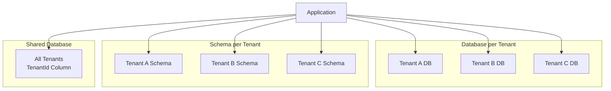

# How to Build Multi-Tenant Apps in .NET

Author: [nawazdhandala](https://www.github.com/nawazdhandala)

Tags: .NET, C#, Multi-Tenancy, SaaS, Architecture

Description: Learn how to build multi-tenant applications in .NET with different isolation strategies, tenant resolution, data partitioning, and best practices for SaaS applications.

---

Multi-tenancy is the foundation of Software as a Service (SaaS) applications. A single application instance serves multiple customers (tenants) while keeping their data and configurations isolated. This guide covers the patterns and implementation details you need to build secure, scalable multi-tenant applications in .NET.

## Multi-Tenancy Strategies

There are three main approaches to multi-tenancy, each with different tradeoffs between isolation, cost, and complexity.



| Strategy | Isolation | Cost | Complexity |
|----------|-----------|------|------------|
| Database per tenant | Highest | Highest | Medium |
| Schema per tenant | High | Medium | High |
| Shared database | Lowest | Lowest | Low |

## Tenant Resolution

Before you can serve a tenant, you need to identify which tenant is making the request. Common approaches include subdomain, header, or path-based resolution.

```csharp
// ITenantResolver.cs
public interface ITenantResolver
{
    Task<Tenant?> ResolveAsync(HttpContext context);
}

// SubdomainTenantResolver.cs
// Resolves tenant from subdomain: acme.yourapp.com
public class SubdomainTenantResolver : ITenantResolver
{
    private readonly ITenantRepository _tenantRepository;

    public SubdomainTenantResolver(ITenantRepository tenantRepository)
    {
        _tenantRepository = tenantRepository;
    }

    public async Task<Tenant?> ResolveAsync(HttpContext context)
    {
        var host = context.Request.Host.Host;

        // Extract subdomain from host
        // Example: "acme.yourapp.com" -> "acme"
        var parts = host.Split('.');

        if (parts.Length < 3)
        {
            // No subdomain present (e.g., "yourapp.com")
            return null;
        }

        var subdomain = parts[0];

        // Look up tenant by subdomain
        return await _tenantRepository.GetBySubdomainAsync(subdomain);
    }
}

// HeaderTenantResolver.cs
// Resolves tenant from X-Tenant-Id header (useful for APIs)
public class HeaderTenantResolver : ITenantResolver
{
    private readonly ITenantRepository _tenantRepository;

    public HeaderTenantResolver(ITenantRepository tenantRepository)
    {
        _tenantRepository = tenantRepository;
    }

    public async Task<Tenant?> ResolveAsync(HttpContext context)
    {
        if (!context.Request.Headers.TryGetValue("X-Tenant-Id", out var tenantId))
        {
            return null;
        }

        return await _tenantRepository.GetByIdAsync(tenantId.ToString());
    }
}

// CompositeTenantResolver.cs
// Tries multiple resolvers in order
public class CompositeTenantResolver : ITenantResolver
{
    private readonly IEnumerable<ITenantResolver> _resolvers;

    public CompositeTenantResolver(IEnumerable<ITenantResolver> resolvers)
    {
        _resolvers = resolvers;
    }

    public async Task<Tenant?> ResolveAsync(HttpContext context)
    {
        foreach (var resolver in _resolvers)
        {
            var tenant = await resolver.ResolveAsync(context);
            if (tenant != null)
            {
                return tenant;
            }
        }

        return null;
    }
}
```

## Tenant Context

Store the current tenant information in a scoped service that other components can access.

```csharp
// Tenant.cs
public class Tenant
{
    public string Id { get; set; } = string.Empty;
    public string Name { get; set; } = string.Empty;
    public string Subdomain { get; set; } = string.Empty;
    public string ConnectionString { get; set; } = string.Empty;
    public TenantPlan Plan { get; set; }
    public Dictionary<string, string> Settings { get; set; } = new();
}

public enum TenantPlan
{
    Free,
    Basic,
    Professional,
    Enterprise
}

// ITenantContext.cs
public interface ITenantContext
{
    Tenant? CurrentTenant { get; }
    void SetTenant(Tenant tenant);
}

// TenantContext.cs
public class TenantContext : ITenantContext
{
    public Tenant? CurrentTenant { get; private set; }

    public void SetTenant(Tenant tenant)
    {
        CurrentTenant = tenant;
    }
}
```

## Tenant Resolution Middleware

The middleware runs early in the pipeline to resolve and set the current tenant.

```csharp
// TenantMiddleware.cs
public class TenantMiddleware
{
    private readonly RequestDelegate _next;
    private readonly ILogger<TenantMiddleware> _logger;

    public TenantMiddleware(
        RequestDelegate next,
        ILogger<TenantMiddleware> logger)
    {
        _next = next;
        _logger = logger;
    }

    public async Task InvokeAsync(
        HttpContext context,
        ITenantResolver tenantResolver,
        ITenantContext tenantContext)
    {
        // Skip tenant resolution for certain paths
        if (ShouldSkipTenantResolution(context.Request.Path))
        {
            await _next(context);
            return;
        }

        var tenant = await tenantResolver.ResolveAsync(context);

        if (tenant == null)
        {
            _logger.LogWarning(
                "Could not resolve tenant for request: {Path}",
                context.Request.Path);

            context.Response.StatusCode = 404;
            await context.Response.WriteAsJsonAsync(new
            {
                error = "Tenant not found"
            });
            return;
        }

        // Set the tenant for this request
        tenantContext.SetTenant(tenant);

        // Add tenant info to logging context
        using (_logger.BeginScope(new Dictionary<string, object>
        {
            ["TenantId"] = tenant.Id,
            ["TenantName"] = tenant.Name
        }))
        {
            _logger.LogDebug("Request for tenant: {TenantName}", tenant.Name);
            await _next(context);
        }
    }

    private bool ShouldSkipTenantResolution(PathString path)
    {
        var skipPaths = new[]
        {
            "/health",
            "/metrics",
            "/.well-known"
        };

        return skipPaths.Any(p => path.StartsWithSegments(p));
    }
}

// Extension method for cleaner registration
public static class TenantMiddlewareExtensions
{
    public static IApplicationBuilder UseTenantResolution(
        this IApplicationBuilder app)
    {
        return app.UseMiddleware<TenantMiddleware>();
    }
}
```

## Database per Tenant

With database-per-tenant strategy, each tenant has their own database. This provides the strongest isolation but requires managing multiple database connections.

```csharp
// TenantDbContextFactory.cs
public class TenantDbContextFactory<TContext> where TContext : DbContext
{
    private readonly ITenantContext _tenantContext;
    private readonly IServiceProvider _serviceProvider;
    private readonly IConfiguration _configuration;

    public TenantDbContextFactory(
        ITenantContext tenantContext,
        IServiceProvider serviceProvider,
        IConfiguration configuration)
    {
        _tenantContext = tenantContext;
        _serviceProvider = serviceProvider;
        _configuration = configuration;
    }

    public TContext CreateDbContext()
    {
        var tenant = _tenantContext.CurrentTenant
            ?? throw new InvalidOperationException("No tenant context");

        // Build connection string for this tenant
        var connectionString = GetConnectionString(tenant);

        var optionsBuilder = new DbContextOptionsBuilder<TContext>();
        optionsBuilder.UseSqlServer(connectionString);

        // Create context with tenant-specific options
        return (TContext)Activator.CreateInstance(
            typeof(TContext),
            optionsBuilder.Options)!;
    }

    private string GetConnectionString(Tenant tenant)
    {
        // Option 1: Tenant stores its own connection string
        if (!string.IsNullOrEmpty(tenant.ConnectionString))
        {
            return tenant.ConnectionString;
        }

        // Option 2: Build connection string from template
        var template = _configuration.GetConnectionString("TenantTemplate");
        return template!.Replace("{TenantId}", tenant.Id);
    }
}
```

## Shared Database with Tenant ID

For cost-effective multi-tenancy, use a shared database with a TenantId column on every table.

```csharp
// ITenantEntity.cs
public interface ITenantEntity
{
    string TenantId { get; set; }
}

// Example entity
public class Product : ITenantEntity
{
    public int Id { get; set; }
    public string TenantId { get; set; } = string.Empty;
    public string Name { get; set; } = string.Empty;
    public decimal Price { get; set; }
}

// MultiTenantDbContext.cs
public class MultiTenantDbContext : DbContext
{
    private readonly ITenantContext _tenantContext;

    public MultiTenantDbContext(
        DbContextOptions<MultiTenantDbContext> options,
        ITenantContext tenantContext)
        : base(options)
    {
        _tenantContext = tenantContext;
    }

    public DbSet<Product> Products => Set<Product>();

    protected override void OnModelCreating(ModelBuilder modelBuilder)
    {
        base.OnModelCreating(modelBuilder);

        // Apply tenant filter to all entities implementing ITenantEntity
        foreach (var entityType in modelBuilder.Model.GetEntityTypes())
        {
            if (typeof(ITenantEntity).IsAssignableFrom(entityType.ClrType))
            {
                var method = typeof(MultiTenantDbContext)
                    .GetMethod(nameof(SetTenantQueryFilter),
                        BindingFlags.NonPublic | BindingFlags.Static)!
                    .MakeGenericMethod(entityType.ClrType);

                method.Invoke(null, new object[] { modelBuilder, this });
            }
        }
    }

    private static void SetTenantQueryFilter<TEntity>(
        ModelBuilder modelBuilder,
        MultiTenantDbContext context)
        where TEntity : class, ITenantEntity
    {
        modelBuilder.Entity<TEntity>()
            .HasQueryFilter(e => e.TenantId == context.CurrentTenantId);
    }

    private string CurrentTenantId =>
        _tenantContext.CurrentTenant?.Id ?? throw new InvalidOperationException();

    public override int SaveChanges()
    {
        SetTenantIdOnNewEntities();
        return base.SaveChanges();
    }

    public override Task<int> SaveChangesAsync(
        CancellationToken cancellationToken = default)
    {
        SetTenantIdOnNewEntities();
        return base.SaveChangesAsync(cancellationToken);
    }

    private void SetTenantIdOnNewEntities()
    {
        var tenantId = _tenantContext.CurrentTenant?.Id
            ?? throw new InvalidOperationException("No tenant context");

        foreach (var entry in ChangeTracker.Entries<ITenantEntity>())
        {
            if (entry.State == EntityState.Added)
            {
                entry.Entity.TenantId = tenantId;
            }
            else if (entry.State == EntityState.Modified)
            {
                // Prevent changing TenantId on updates
                entry.Property(e => e.TenantId).IsModified = false;
            }
        }
    }
}
```

## Tenant-Specific Configuration

Allow tenants to customize their experience through configuration.

```csharp
// TenantSettings.cs
public class TenantSettings
{
    public string Theme { get; set; } = "default";
    public string LogoUrl { get; set; } = string.Empty;
    public int MaxUsers { get; set; } = 10;
    public bool FeatureXEnabled { get; set; }
    public Dictionary<string, string> CustomSettings { get; set; } = new();
}

// ITenantSettingsService.cs
public interface ITenantSettingsService
{
    Task<TenantSettings> GetSettingsAsync();
    Task UpdateSettingsAsync(TenantSettings settings);
}

// TenantSettingsService.cs
public class TenantSettingsService : ITenantSettingsService
{
    private readonly ITenantContext _tenantContext;
    private readonly IDistributedCache _cache;
    private readonly ITenantRepository _repository;

    public TenantSettingsService(
        ITenantContext tenantContext,
        IDistributedCache cache,
        ITenantRepository repository)
    {
        _tenantContext = tenantContext;
        _cache = cache;
        _repository = repository;
    }

    public async Task<TenantSettings> GetSettingsAsync()
    {
        var tenant = _tenantContext.CurrentTenant
            ?? throw new InvalidOperationException("No tenant context");

        var cacheKey = $"tenant:{tenant.Id}:settings";

        // Try cache first
        var cached = await _cache.GetStringAsync(cacheKey);
        if (cached != null)
        {
            return JsonSerializer.Deserialize<TenantSettings>(cached)!;
        }

        // Load from database
        var settings = await _repository.GetSettingsAsync(tenant.Id);

        // Cache for 5 minutes
        await _cache.SetStringAsync(
            cacheKey,
            JsonSerializer.Serialize(settings),
            new DistributedCacheEntryOptions
            {
                AbsoluteExpirationRelativeToNow = TimeSpan.FromMinutes(5)
            });

        return settings;
    }

    public async Task UpdateSettingsAsync(TenantSettings settings)
    {
        var tenant = _tenantContext.CurrentTenant
            ?? throw new InvalidOperationException("No tenant context");

        await _repository.UpdateSettingsAsync(tenant.Id, settings);

        // Invalidate cache
        var cacheKey = $"tenant:{tenant.Id}:settings";
        await _cache.RemoveAsync(cacheKey);
    }
}
```

## Feature Flags by Tenant Plan

Restrict features based on tenant subscription plan.

```csharp
// TenantFeatureService.cs
public class TenantFeatureService
{
    private readonly ITenantContext _tenantContext;

    public TenantFeatureService(ITenantContext tenantContext)
    {
        _tenantContext = tenantContext;
    }

    // Define which features are available for each plan
    private static readonly Dictionary<TenantPlan, HashSet<string>> PlanFeatures = new()
    {
        [TenantPlan.Free] = new HashSet<string>
        {
            "basic-reports",
            "email-support"
        },
        [TenantPlan.Basic] = new HashSet<string>
        {
            "basic-reports",
            "email-support",
            "api-access",
            "csv-export"
        },
        [TenantPlan.Professional] = new HashSet<string>
        {
            "basic-reports",
            "email-support",
            "api-access",
            "csv-export",
            "advanced-reports",
            "webhook-integrations",
            "priority-support"
        },
        [TenantPlan.Enterprise] = new HashSet<string>
        {
            "basic-reports",
            "email-support",
            "api-access",
            "csv-export",
            "advanced-reports",
            "webhook-integrations",
            "priority-support",
            "sso",
            "audit-logs",
            "custom-branding",
            "dedicated-support"
        }
    };

    public bool IsFeatureEnabled(string featureName)
    {
        var tenant = _tenantContext.CurrentTenant;

        if (tenant == null)
        {
            return false;
        }

        if (!PlanFeatures.TryGetValue(tenant.Plan, out var features))
        {
            return false;
        }

        return features.Contains(featureName);
    }

    public void RequireFeature(string featureName)
    {
        if (!IsFeatureEnabled(featureName))
        {
            throw new FeatureNotAvailableException(
                $"Feature '{featureName}' is not available on your plan. " +
                "Please upgrade to access this feature.");
        }
    }
}

// Usage in a controller
[ApiController]
[Route("api/[controller]")]
public class ReportsController : ControllerBase
{
    private readonly TenantFeatureService _featureService;

    public ReportsController(TenantFeatureService featureService)
    {
        _featureService = featureService;
    }

    [HttpGet("advanced")]
    public IActionResult GetAdvancedReports()
    {
        // Check if tenant has access to this feature
        _featureService.RequireFeature("advanced-reports");

        // Generate advanced reports...
        return Ok(new { report = "Advanced report data" });
    }
}
```

## Service Registration

Register all multi-tenancy services in Program.cs.

```csharp
// Program.cs
var builder = WebApplication.CreateBuilder(args);

// Tenant services
builder.Services.AddScoped<ITenantContext, TenantContext>();
builder.Services.AddScoped<ITenantResolver, SubdomainTenantResolver>();
builder.Services.AddScoped<ITenantSettingsService, TenantSettingsService>();
builder.Services.AddScoped<TenantFeatureService>();

// Database context with tenant filtering
builder.Services.AddDbContext<MultiTenantDbContext>(options =>
{
    options.UseSqlServer(builder.Configuration.GetConnectionString("Default"));
});

// Caching for tenant settings
builder.Services.AddStackExchangeRedisCache(options =>
{
    options.Configuration = builder.Configuration.GetConnectionString("Redis");
});

var app = builder.Build();

// Add tenant middleware early in the pipeline
app.UseTenantResolution();

app.UseAuthentication();
app.UseAuthorization();

app.MapControllers();

app.Run();
```

## Summary

Building multi-tenant applications in .NET requires careful consideration of several factors:

| Concern | Solution |
|---------|----------|
| Tenant identification | ITenantResolver with subdomain/header strategies |
| Data isolation | Query filters or separate databases |
| Configuration | Tenant-specific settings with caching |
| Feature access | Plan-based feature flags |
| Security | Automatic TenantId assignment, prevent cross-tenant access |

The shared database approach with global query filters works well for most SaaS applications, providing a good balance between isolation and operational simplicity. For highly regulated industries or tenants with strict data residency requirements, database-per-tenant offers the strongest guarantees. Choose the strategy that matches your security requirements and operational capacity.
