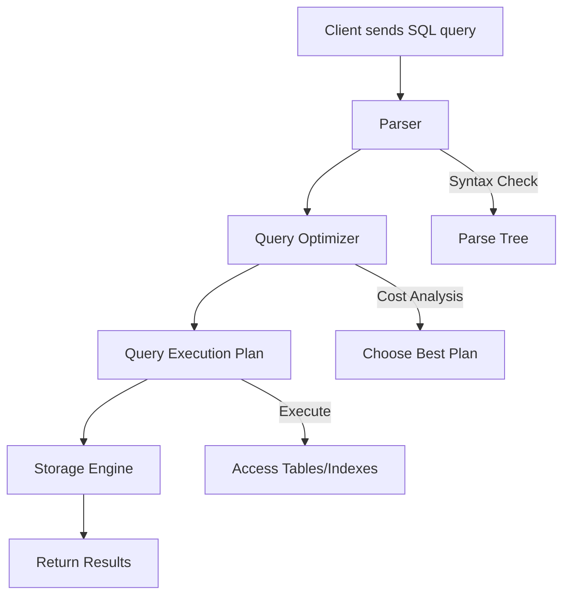
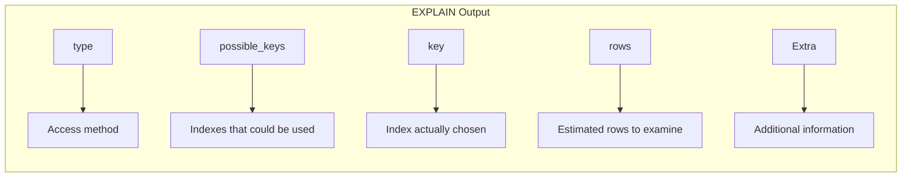
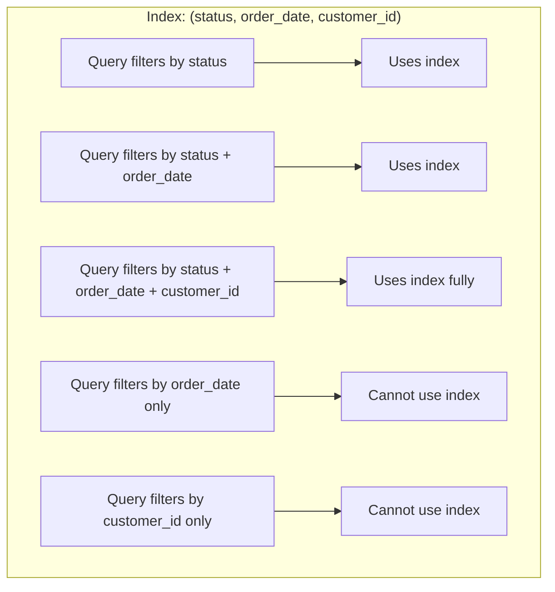
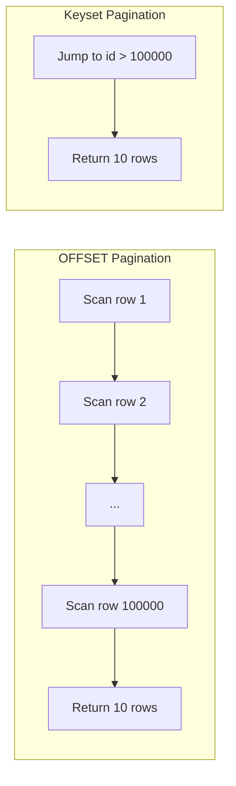
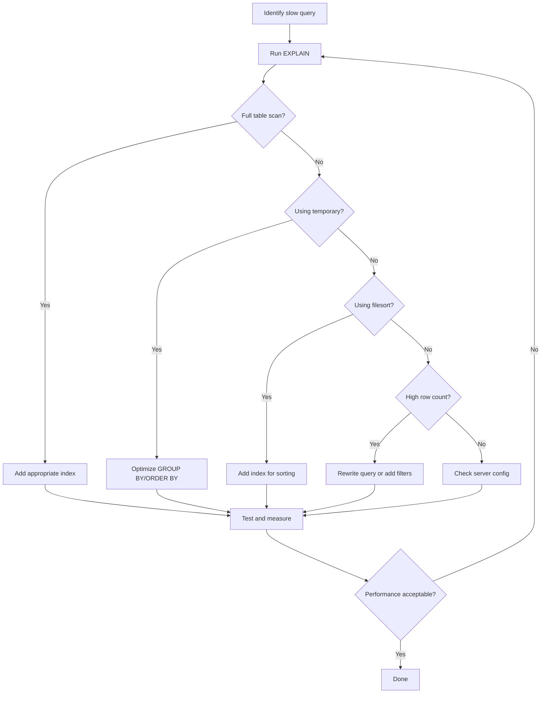

# How to Optimize MySQL Query Performance

Author: [nawazdhandala](https://www.github.com/nawazdhandala)

Tags: MySQL, Database, Performance, Query Optimization, Backend Development

Description: Learn how to optimize MySQL query performance with indexing, EXPLAIN analysis, query rewriting, and server configuration tuning.

---

MySQL is one of the most popular relational database management systems in the world. As your application grows and data volumes increase, query performance becomes critical. Slow queries can bring your application to a crawl, frustrate users, and increase infrastructure costs. This guide covers practical techniques to identify and fix performance bottlenecks in your MySQL queries.

## Understanding Query Execution

Before diving into optimization techniques, it helps to understand how MySQL processes a query. When you send a SQL statement to MySQL, it goes through several stages before returning results.



The query optimizer is where MySQL decides how to execute your query most efficiently. It considers available indexes, table statistics, and join orders to create an execution plan. Understanding this process helps you write queries that work with the optimizer rather than against it.

## Using EXPLAIN to Analyze Queries

The `EXPLAIN` statement is your primary tool for understanding query performance. It shows how MySQL plans to execute a query without actually running it.

```sql
-- Basic EXPLAIN usage
-- This shows the execution plan for a simple SELECT query
EXPLAIN SELECT * FROM orders WHERE customer_id = 12345;

-- EXPLAIN with FORMAT=JSON provides more detailed information
-- Including cost estimates and optimizer decisions
EXPLAIN FORMAT=JSON
SELECT o.order_id, o.order_date, c.customer_name
FROM orders o
JOIN customers c ON o.customer_id = c.customer_id
WHERE o.order_date > '2025-01-01';

-- EXPLAIN ANALYZE actually runs the query and shows real execution times
-- Use this for accurate timing information (MySQL 8.0.18+)
EXPLAIN ANALYZE
SELECT product_id, SUM(quantity) as total_sold
FROM order_items
GROUP BY product_id
ORDER BY total_sold DESC
LIMIT 10;
```

Here is what the key columns in EXPLAIN output mean:



The `type` column is particularly important. Here are the access types from best to worst:

| Type | Description | Performance |
|------|-------------|-------------|
| system | Table has only one row | Best |
| const | At most one matching row (primary key lookup) | Excellent |
| eq_ref | One row per row from previous table (join on unique key) | Very Good |
| ref | Multiple rows possible using index | Good |
| range | Index range scan | Acceptable |
| index | Full index scan | Poor |
| ALL | Full table scan | Worst |

## Creating Effective Indexes

Indexes are the most powerful tool for query optimization. They allow MySQL to find rows without scanning the entire table.

### Single Column Indexes

```sql
-- Create an index on a frequently filtered column
-- This speeds up queries that filter by customer_id
CREATE INDEX idx_orders_customer_id ON orders(customer_id);

-- Now this query can use the index instead of scanning all rows
SELECT * FROM orders WHERE customer_id = 12345;

-- Verify the index is being used
EXPLAIN SELECT * FROM orders WHERE customer_id = 12345;
-- Should show: key = idx_orders_customer_id
```

### Composite Indexes

When queries filter or sort by multiple columns, composite indexes can dramatically improve performance. The column order matters.

```sql
-- Create a composite index for queries that filter by status and date
-- Column order should match your most common query patterns
CREATE INDEX idx_orders_status_date ON orders(status, order_date);

-- This query can fully use the composite index
-- It filters by status first, then by order_date
SELECT * FROM orders
WHERE status = 'pending'
AND order_date > '2025-06-01';

-- This query can only use the first column of the index
-- Because order_date comes second in the index
SELECT * FROM orders
WHERE order_date > '2025-06-01';
```

The leftmost prefix rule determines how composite indexes work:



### Covering Indexes

A covering index contains all columns needed by a query, eliminating the need to access the table data.

```sql
-- Create a covering index for a common reporting query
-- Includes all columns that the query needs to retrieve
CREATE INDEX idx_orders_covering ON orders(status, order_date, total_amount);

-- This query is fully satisfied by the index
-- MySQL does not need to read the actual table rows
SELECT status, order_date, total_amount
FROM orders
WHERE status = 'completed'
AND order_date BETWEEN '2025-01-01' AND '2025-12-31';

-- EXPLAIN will show "Using index" in the Extra column
-- This indicates a covering index is being used
```

## Query Rewriting Techniques

Sometimes the best optimization is rewriting the query itself. Here are common patterns and their optimized versions.

### Avoid SELECT *

```sql
-- Bad: Fetches all columns, even ones you do not need
-- This wastes memory and network bandwidth
SELECT * FROM customers WHERE country = 'USA';

-- Good: Only fetch the columns you actually use
-- Reduces data transfer and may enable covering index usage
SELECT customer_id, customer_name, email
FROM customers
WHERE country = 'USA';
```

### Use EXISTS Instead of IN for Subqueries

```sql
-- Potentially slow: IN with a subquery
-- MySQL may execute the subquery for each row in the outer query
SELECT * FROM products
WHERE product_id IN (
    SELECT product_id FROM order_items WHERE quantity > 100
);

-- Often faster: EXISTS stops as soon as it finds a match
-- Better performance when the subquery returns many rows
SELECT * FROM products p
WHERE EXISTS (
    SELECT 1 FROM order_items oi
    WHERE oi.product_id = p.product_id
    AND oi.quantity > 100
);
```

### Optimize JOINs

```sql
-- Make sure JOIN columns are indexed on both tables
-- Create indexes if they do not exist
CREATE INDEX idx_order_items_order_id ON order_items(order_id);
CREATE INDEX idx_orders_order_id ON orders(order_id);

-- Join on indexed columns for best performance
-- The smaller table should typically be the driving table
SELECT o.order_id, o.order_date, oi.product_id, oi.quantity
FROM orders o
INNER JOIN order_items oi ON o.order_id = oi.order_id
WHERE o.order_date > '2025-01-01';

-- Avoid functions on JOIN columns - they prevent index usage
-- Bad:
SELECT * FROM orders o
JOIN customers c ON LOWER(o.customer_email) = LOWER(c.email);

-- Good: Store normalized data or use generated columns
SELECT * FROM orders o
JOIN customers c ON o.customer_email = c.email;
```

### Pagination Optimization

```sql
-- Slow for large offsets: MySQL must scan and discard many rows
-- Gets progressively slower as page number increases
SELECT * FROM products
ORDER BY product_id
LIMIT 10 OFFSET 100000;

-- Faster: Use keyset pagination (also called cursor pagination)
-- Requires the last seen value from the previous page
SELECT * FROM products
WHERE product_id > 100000  -- Last product_id from previous page
ORDER BY product_id
LIMIT 10;
```

The performance difference with large offsets is significant:



## Server Configuration Tuning

While query-level optimizations have the biggest impact, server configuration also affects performance.

### Buffer Pool Size

The InnoDB buffer pool caches table and index data in memory. For dedicated database servers, set this to 70-80% of available RAM.

```sql
-- Check current buffer pool size
SHOW VARIABLES LIKE 'innodb_buffer_pool_size';

-- Check buffer pool usage efficiency
-- A high hit ratio (>99%) indicates good caching
SELECT
    (1 - (Innodb_buffer_pool_reads / Innodb_buffer_pool_read_requests)) * 100
    AS buffer_pool_hit_ratio
FROM (
    SELECT
        (SELECT VARIABLE_VALUE FROM performance_schema.global_status
         WHERE VARIABLE_NAME = 'Innodb_buffer_pool_reads') AS Innodb_buffer_pool_reads,
        (SELECT VARIABLE_VALUE FROM performance_schema.global_status
         WHERE VARIABLE_NAME = 'Innodb_buffer_pool_read_requests') AS Innodb_buffer_pool_read_requests
) AS stats;
```

### Query Cache Considerations

Note that MySQL 8.0 removed the query cache. If you are using MySQL 5.7 or earlier, be aware that the query cache can actually hurt performance on write-heavy workloads. For modern MySQL versions, consider application-level caching with Redis or Memcached instead.

### Connection and Thread Settings

```sql
-- Check current connection usage
SHOW STATUS LIKE 'Threads_connected';
SHOW STATUS LIKE 'Max_used_connections';

-- View connection-related settings
SHOW VARIABLES LIKE 'max_connections';
SHOW VARIABLES LIKE 'thread_cache_size';
```

## Identifying Slow Queries

Enable the slow query log to find queries that need optimization.

```sql
-- Enable slow query logging
SET GLOBAL slow_query_log = 'ON';

-- Log queries taking longer than 1 second
SET GLOBAL long_query_time = 1;

-- Also log queries not using indexes
SET GLOBAL log_queries_not_using_indexes = 'ON';

-- Check where the slow query log is stored
SHOW VARIABLES LIKE 'slow_query_log_file';
```

You can analyze the slow query log with `mysqldumpslow`:

```bash
# Show top 10 slowest queries sorted by average time
mysqldumpslow -s at -t 10 /var/log/mysql/slow-query.log

# Show queries sorted by count (most frequent slow queries)
mysqldumpslow -s c -t 10 /var/log/mysql/slow-query.log
```

## Performance Optimization Workflow

Here is a systematic approach to optimizing query performance:



## Common Anti-Patterns to Avoid

### Functions on Indexed Columns

```sql
-- Bad: Function on column prevents index usage
SELECT * FROM orders WHERE YEAR(order_date) = 2025;

-- Good: Use range conditions that can use the index
SELECT * FROM orders
WHERE order_date >= '2025-01-01'
AND order_date < '2026-01-01';
```

### Implicit Type Conversions

```sql
-- Bad: customer_id is INT but compared to string
-- This can prevent index usage on some database versions
SELECT * FROM orders WHERE customer_id = '12345';

-- Good: Use matching data types
SELECT * FROM orders WHERE customer_id = 12345;
```

### OR Conditions on Different Columns

```sql
-- Potentially slow: OR across different columns
SELECT * FROM products
WHERE category_id = 5 OR supplier_id = 10;

-- Often faster: UNION of two indexed queries
SELECT * FROM products WHERE category_id = 5
UNION
SELECT * FROM products WHERE supplier_id = 10;
```

## Monitoring and Maintenance

Regular maintenance keeps your database performing well.

```sql
-- Update table statistics for better query planning
-- Run periodically or after major data changes
ANALYZE TABLE orders;

-- Check for fragmentation
SELECT
    TABLE_NAME,
    DATA_LENGTH,
    INDEX_LENGTH,
    DATA_FREE,
    (DATA_FREE / (DATA_LENGTH + INDEX_LENGTH)) * 100 AS fragmentation_percent
FROM information_schema.TABLES
WHERE TABLE_SCHEMA = 'your_database'
AND DATA_FREE > 0;

-- Rebuild fragmented tables (locks the table)
OPTIMIZE TABLE orders;

-- For large tables, use ALTER TABLE to rebuild online
ALTER TABLE orders ENGINE=InnoDB;
```

## Summary

Optimizing MySQL query performance requires a combination of techniques:

1. Use `EXPLAIN` to understand how queries execute
2. Create indexes that match your query patterns
3. Write queries that can take advantage of indexes
4. Configure server settings appropriately for your workload
5. Monitor and identify slow queries regularly
6. Maintain tables with regular statistics updates

Start with the queries that have the biggest impact on your application. Often, fixing just a few problematic queries can dramatically improve overall performance. Always measure before and after changes to verify improvements, and test optimizations with realistic data volumes.
