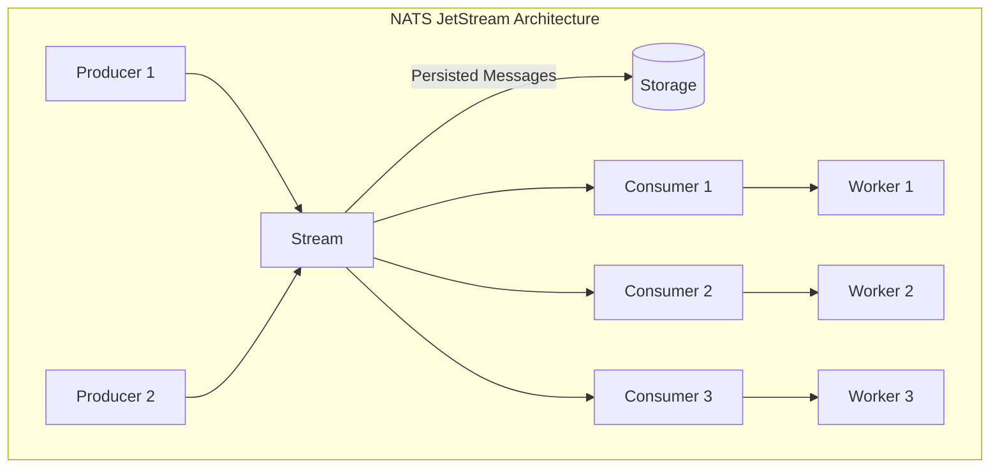
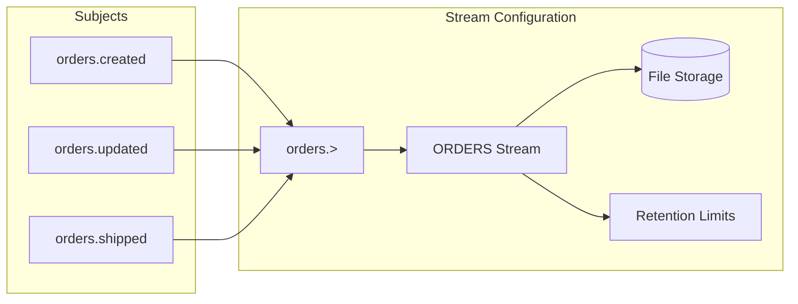
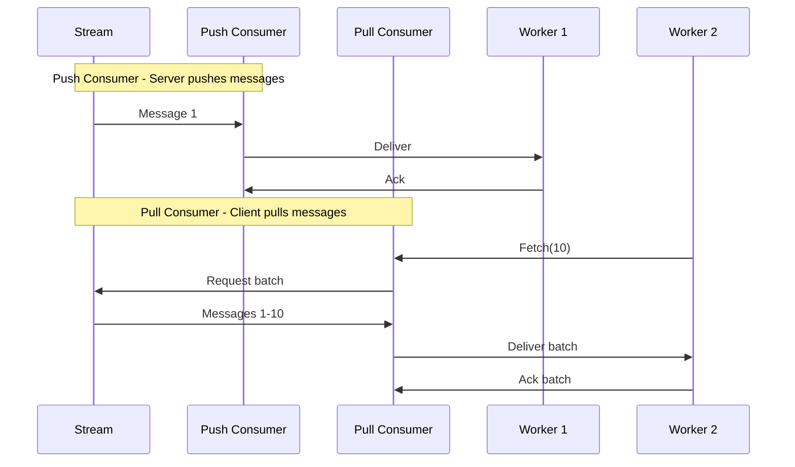
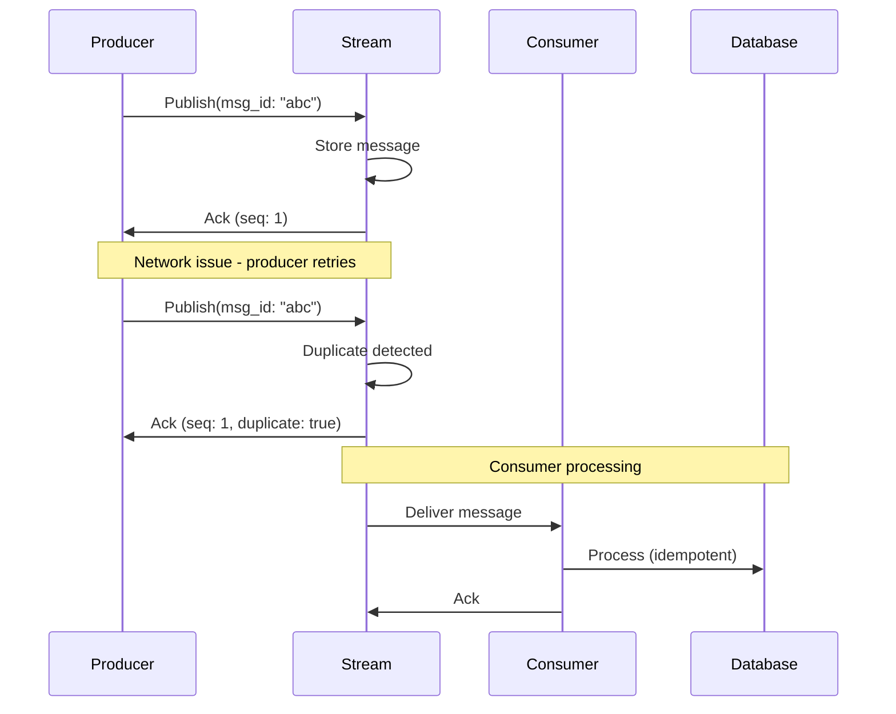
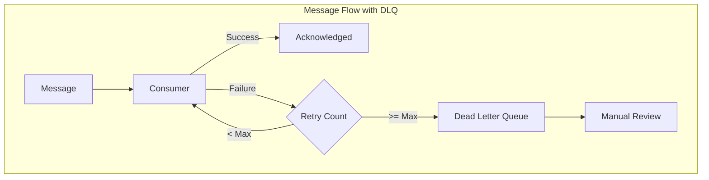

# How to Use NATS JetStream for Persistence

Author: [nawazdhandala](https://www.github.com/nawazdhandala)

Tags: NATS, JetStream, Message Queue, Persistence, Distributed Systems

Description: Learn how to use NATS JetStream for persistent messaging with streams, consumers, and exactly-once delivery semantics.

---

> NATS is fast. Really fast. But core NATS is fire-and-forget. Messages disappear if no subscriber is listening. JetStream changes that by adding persistence, replay, and exactly-once delivery to NATS. It turns NATS from a simple pub/sub system into a full-featured streaming platform.

JetStream is built into NATS Server 2.2+ and provides durable message storage, acknowledgments, and consumer groups. Think of it as Kafka-lite with the simplicity of NATS.

---

## Architecture Overview

Before diving into code, let's understand how JetStream works.



Key concepts:
- **Stream**: A message store that persists messages to disk or memory
- **Consumer**: A view into a stream that tracks delivery and acknowledgment
- **Subject**: The topic messages are published to (supports wildcards)

---

## Getting Started

### Installation

Start a NATS server with JetStream enabled:

```bash
# Using Docker
docker run -p 4222:4222 nats:latest -js

# Or download and run directly
nats-server -js
```

Install the Go client:

```bash
go get github.com/nats-io/nats.go
```

### Connecting to JetStream

```go
package main

import (
    "log"
    "time"

    "github.com/nats-io/nats.go"
)

func main() {
    // Connect to NATS server
    nc, err := nats.Connect(
        nats.DefaultURL,
        nats.RetryOnFailedConnect(true),    // Keep trying if server is down
        nats.MaxReconnects(-1),              // Unlimited reconnect attempts
        nats.ReconnectWait(time.Second),     // Wait 1 second between attempts
        nats.DisconnectErrHandler(func(nc *nats.Conn, err error) {
            log.Printf("Disconnected: %v", err)
        }),
        nats.ReconnectHandler(func(nc *nats.Conn) {
            log.Printf("Reconnected to %s", nc.ConnectedUrl())
        }),
    )
    if err != nil {
        log.Fatal(err)
    }
    defer nc.Close()

    // Get JetStream context - this is your entry point for all JetStream operations
    js, err := nc.JetStream(
        nats.PublishAsyncMaxPending(256), // Buffer up to 256 async publishes
    )
    if err != nil {
        log.Fatal(err)
    }

    log.Println("Connected to JetStream")
    _ = js // Use js for stream and consumer operations
}
```

---

## Creating Streams

Streams define how messages are stored and retained.



### Basic Stream Creation

```go
package main

import (
    "log"
    "time"

    "github.com/nats-io/nats.go"
)

func createStream(js nats.JetStreamContext) error {
    // Define stream configuration
    streamConfig := &nats.StreamConfig{
        Name:     "ORDERS",           // Unique stream name (uppercase convention)
        Subjects: []string{"orders.>"}, // Subjects this stream captures (wildcard)

        // Storage type: FileStorage (durable) or MemoryStorage (fast but volatile)
        Storage: nats.FileStorage,

        // Retention policy
        Retention: nats.LimitsPolicy, // Delete old messages based on limits
        MaxAge:    24 * time.Hour,    // Keep messages for 24 hours
        MaxBytes:  1024 * 1024 * 100, // 100MB max storage
        MaxMsgs:   1000000,           // 1 million messages max

        // Replication for high availability (requires clustered NATS)
        Replicas: 1,

        // Message deduplication window
        Duplicates: 2 * time.Minute,
    }

    // Create or update the stream
    // AddStream fails if stream exists, UpdateStream updates if it exists
    stream, err := js.AddStream(streamConfig)
    if err != nil {
        // Check if stream already exists
        if err == nats.ErrStreamNameAlreadyInUse {
            // Update existing stream
            stream, err = js.UpdateStream(streamConfig)
            if err != nil {
                return err
            }
        } else {
            return err
        }
    }

    log.Printf("Stream created: %s with %d messages", stream.Config.Name, stream.State.Msgs)
    return nil
}
```

### Retention Policies

JetStream offers different retention strategies:

```go
// LimitsPolicy - Delete messages based on age, size, or count limits
// This is the default and most common choice
limitsStream := &nats.StreamConfig{
    Name:      "LOGS",
    Subjects:  []string{"logs.>"},
    Retention: nats.LimitsPolicy,
    MaxAge:    7 * 24 * time.Hour, // Keep logs for 7 days
    MaxBytes:  1024 * 1024 * 1024, // 1GB max
}

// WorkQueuePolicy - Delete messages once acknowledged by ANY consumer
// Perfect for job queues where each message should be processed once
workQueueStream := &nats.StreamConfig{
    Name:      "JOBS",
    Subjects:  []string{"jobs.>"},
    Retention: nats.WorkQueuePolicy, // Message deleted after first ack
}

// InterestPolicy - Delete messages when no consumers are interested
// Useful for ephemeral data that only matters if someone is listening
interestStream := &nats.StreamConfig{
    Name:      "EVENTS",
    Subjects:  []string{"events.>"},
    Retention: nats.InterestPolicy, // Delete when all consumers ack
}
```

---

## Publishing Messages

### Synchronous Publishing

```go
package main

import (
    "encoding/json"
    "log"
    "time"

    "github.com/nats-io/nats.go"
)

type Order struct {
    ID        string    `json:"id"`
    Customer  string    `json:"customer"`
    Amount    float64   `json:"amount"`
    Status    string    `json:"status"`
    CreatedAt time.Time `json:"created_at"`
}

func publishOrder(js nats.JetStreamContext, order Order) error {
    // Serialize order to JSON
    data, err := json.Marshal(order)
    if err != nil {
        return err
    }

    // Publish with acknowledgment - blocks until server confirms persistence
    pubAck, err := js.Publish(
        "orders.created", // Subject
        data,             // Payload
        nats.MsgId(order.ID), // Deduplication ID - prevents duplicate messages
    )
    if err != nil {
        return err
    }

    // pubAck contains confirmation details
    log.Printf("Published order %s to stream %s, sequence %d",
        order.ID, pubAck.Stream, pubAck.Sequence)

    return nil
}

func main() {
    nc, _ := nats.Connect(nats.DefaultURL)
    defer nc.Close()

    js, _ := nc.JetStream()

    order := Order{
        ID:        "ord-12345",
        Customer:  "customer-1",
        Amount:    99.99,
        Status:    "created",
        CreatedAt: time.Now(),
    }

    if err := publishOrder(js, order); err != nil {
        log.Fatal(err)
    }
}
```

### Asynchronous Publishing

For high-throughput scenarios, use async publishing:

```go
func publishOrdersAsync(js nats.JetStreamContext, orders []Order) error {
    // Track pending publishes
    var futures []nats.PubAckFuture

    for _, order := range orders {
        data, err := json.Marshal(order)
        if err != nil {
            return err
        }

        // PublishAsync returns immediately with a future
        future, err := js.PublishAsync(
            "orders.created",
            data,
            nats.MsgId(order.ID),
        )
        if err != nil {
            return err
        }
        futures = append(futures, future)
    }

    // Wait for all publishes to complete
    // This is more efficient than waiting after each publish
    for i, future := range futures {
        select {
        case pubAck := <-future.Ok():
            log.Printf("Order %d published: seq %d", i, pubAck.Sequence)
        case err := <-future.Err():
            log.Printf("Order %d failed: %v", i, err)
        }
    }

    return nil
}
```

### Message Headers

Add metadata without modifying the payload:

```go
func publishWithHeaders(js nats.JetStreamContext, order Order) error {
    data, _ := json.Marshal(order)

    // Create message with headers
    msg := &nats.Msg{
        Subject: "orders.created",
        Data:    data,
        Header:  nats.Header{},
    }

    // Add custom headers for routing, tracing, etc.
    msg.Header.Set("X-Correlation-ID", "trace-abc123")
    msg.Header.Set("X-Source", "checkout-service")
    msg.Header.Set("X-Priority", "high")
    msg.Header.Set("Content-Type", "application/json")

    _, err := js.PublishMsg(msg, nats.MsgId(order.ID))
    return err
}
```

---

## Consuming Messages

JetStream consumers come in two flavors: push and pull.



### Push Consumer

The server pushes messages to your subscriber:

```go
func createPushConsumer(js nats.JetStreamContext) error {
    // Subscribe creates a push consumer automatically
    sub, err := js.Subscribe(
        "orders.>",  // Subject filter
        func(msg *nats.Msg) {
            // Process message
            var order Order
            if err := json.Unmarshal(msg.Data, &order); err != nil {
                log.Printf("Invalid message: %v", err)
                // Negative ack - message will be redelivered
                msg.Nak()
                return
            }

            log.Printf("Processing order: %s", order.ID)

            // Simulate processing
            if err := processOrder(order); err != nil {
                log.Printf("Processing failed: %v", err)
                // Nak with delay - wait before redelivery
                msg.NakWithDelay(5 * time.Second)
                return
            }

            // Acknowledge successful processing
            msg.Ack()
        },
        // Consumer configuration
        nats.Durable("order-processor"),     // Durable name for persistence
        nats.ManualAck(),                    // Require explicit acks
        nats.AckWait(30*time.Second),        // Time before message is redelivered
        nats.MaxDeliver(5),                  // Max redelivery attempts
        nats.DeliverNew(),                   // Start with new messages only
    )
    if err != nil {
        return err
    }

    log.Printf("Push consumer created: %s", sub.ConsumerInfo().Name)
    return nil
}

func processOrder(order Order) error {
    // Your business logic here
    return nil
}
```

### Pull Consumer

You control when to fetch messages:

```go
func createPullConsumer(js nats.JetStreamContext) error {
    // Create a durable pull consumer
    consumerConfig := &nats.ConsumerConfig{
        Durable:       "order-batch-processor",
        AckPolicy:     nats.AckExplicitPolicy, // Require explicit acks
        AckWait:       30 * time.Second,
        MaxDeliver:    5,
        FilterSubject: "orders.>",

        // Replay policy - how to handle existing messages
        DeliverPolicy: nats.DeliverAllPolicy, // Start from beginning
    }

    _, err := js.AddConsumer("ORDERS", consumerConfig)
    if err != nil {
        return err
    }

    // Create pull subscription
    sub, err := js.PullSubscribe(
        "orders.>",
        "order-batch-processor",
        nats.Bind("ORDERS", "order-batch-processor"),
    )
    if err != nil {
        return err
    }

    // Fetch messages in batches
    for {
        // Fetch up to 10 messages, wait up to 5 seconds
        msgs, err := sub.Fetch(10, nats.MaxWait(5*time.Second))
        if err != nil {
            if err == nats.ErrTimeout {
                // No messages available, continue polling
                continue
            }
            return err
        }

        // Process batch
        for _, msg := range msgs {
            var order Order
            json.Unmarshal(msg.Data, &order)

            log.Printf("Processing order: %s", order.ID)

            // Process and acknowledge
            if err := processOrder(order); err != nil {
                msg.Nak()
                continue
            }
            msg.Ack()
        }
    }
}
```

### Consumer Groups (Queue Groups)

Distribute work across multiple workers:

```go
func createQueueConsumer(js nats.JetStreamContext, workerID string) error {
    // Multiple workers with the same queue group share the work
    // Each message goes to exactly one worker in the group
    sub, err := js.QueueSubscribe(
        "orders.>",
        "order-workers", // Queue group name
        func(msg *nats.Msg) {
            var order Order
            json.Unmarshal(msg.Data, &order)

            log.Printf("[Worker %s] Processing order: %s", workerID, order.ID)

            // Process and ack
            processOrder(order)
            msg.Ack()
        },
        nats.Durable("order-workers"),
        nats.ManualAck(),
        nats.AckWait(30*time.Second),
    )
    if err != nil {
        return err
    }

    log.Printf("Worker %s joined queue group", workerID)
    _ = sub
    return nil
}
```

---

## Exactly-Once Delivery

JetStream provides exactly-once semantics through message deduplication and idempotent consumers.



### Publisher Deduplication

```go
func publishIdempotent(js nats.JetStreamContext, order Order) error {
    data, _ := json.Marshal(order)

    // Use a deterministic message ID for deduplication
    // The server tracks IDs within the deduplication window
    msgID := fmt.Sprintf("order-%s-%d", order.ID, order.CreatedAt.Unix())

    pubAck, err := js.Publish(
        "orders.created",
        data,
        nats.MsgId(msgID), // Server deduplicates based on this ID
    )
    if err != nil {
        return err
    }

    if pubAck.Duplicate {
        log.Printf("Message was a duplicate, original seq: %d", pubAck.Sequence)
    }

    return nil
}
```

### Idempotent Consumer

```go
type OrderProcessor struct {
    db *sql.DB
}

func (p *OrderProcessor) ProcessMessage(msg *nats.Msg) error {
    var order Order
    if err := json.Unmarshal(msg.Data, &order); err != nil {
        // Invalid message - ack to prevent redelivery
        msg.Ack()
        return err
    }

    // Use database transaction for exactly-once processing
    tx, err := p.db.Begin()
    if err != nil {
        msg.Nak()
        return err
    }
    defer tx.Rollback()

    // Check if already processed using message metadata
    meta, _ := msg.Metadata()
    processedKey := fmt.Sprintf("%s-%d", meta.Stream, meta.Sequence.Stream)

    var exists bool
    err = tx.QueryRow(
        "SELECT EXISTS(SELECT 1 FROM processed_messages WHERE id = $1)",
        processedKey,
    ).Scan(&exists)
    if err != nil {
        msg.Nak()
        return err
    }

    if exists {
        // Already processed - just ack
        log.Printf("Message already processed: %s", processedKey)
        msg.Ack()
        return nil
    }

    // Process the order
    _, err = tx.Exec(
        "INSERT INTO orders (id, customer, amount, status) VALUES ($1, $2, $3, $4)",
        order.ID, order.Customer, order.Amount, order.Status,
    )
    if err != nil {
        msg.Nak()
        return err
    }

    // Mark as processed
    _, err = tx.Exec(
        "INSERT INTO processed_messages (id, processed_at) VALUES ($1, NOW())",
        processedKey,
    )
    if err != nil {
        msg.Nak()
        return err
    }

    // Commit transaction
    if err := tx.Commit(); err != nil {
        msg.Nak()
        return err
    }

    // Now safe to acknowledge
    msg.Ack()
    return nil
}
```

---

## Stream Operations

### Replay Historical Messages

```go
func replayFromTime(js nats.JetStreamContext, startTime time.Time) error {
    // Create a consumer that starts from a specific time
    sub, err := js.Subscribe(
        "orders.>",
        func(msg *nats.Msg) {
            meta, _ := msg.Metadata()
            log.Printf("Message from %v: %s", meta.Timestamp, string(msg.Data))
            msg.Ack()
        },
        nats.DeliverByStartTime(startTime), // Start from this timestamp
        nats.Durable("replay-consumer"),
        nats.ManualAck(),
    )
    if err != nil {
        return err
    }

    _ = sub
    return nil
}

func replayFromSequence(js nats.JetStreamContext, startSeq uint64) error {
    // Start from a specific sequence number
    sub, err := js.Subscribe(
        "orders.>",
        func(msg *nats.Msg) {
            meta, _ := msg.Metadata()
            log.Printf("Sequence %d: %s", meta.Sequence.Stream, string(msg.Data))
            msg.Ack()
        },
        nats.DeliverByStartSequence(startSeq),
        nats.Durable("sequence-replay"),
        nats.ManualAck(),
    )
    if err != nil {
        return err
    }

    _ = sub
    return nil
}
```

### Get Specific Message

```go
func getMessage(js nats.JetStreamContext, streamName string, seq uint64) (*nats.RawStreamMsg, error) {
    // Get a specific message by sequence number
    msg, err := js.GetMsg(streamName, seq)
    if err != nil {
        return nil, err
    }

    log.Printf("Message seq %d: subject=%s, data=%s",
        msg.Sequence, msg.Subject, string(msg.Data))

    return msg, nil
}

func getLastMessage(js nats.JetStreamContext, streamName, subject string) (*nats.RawStreamMsg, error) {
    // Get the last message for a subject
    msg, err := js.GetLastMsg(streamName, subject)
    if err != nil {
        return nil, err
    }

    return msg, nil
}
```

### Stream Mirroring and Sourcing

```go
// Mirror: Read-only copy of another stream
func createMirrorStream(js nats.JetStreamContext) error {
    _, err := js.AddStream(&nats.StreamConfig{
        Name: "ORDERS_MIRROR",
        Mirror: &nats.StreamSource{
            Name: "ORDERS", // Source stream to mirror
        },
        Storage: nats.FileStorage,
    })
    return err
}

// Source: Aggregate multiple streams into one
func createAggregateStream(js nats.JetStreamContext) error {
    _, err := js.AddStream(&nats.StreamConfig{
        Name: "ALL_EVENTS",
        Sources: []*nats.StreamSource{
            {Name: "ORDERS"},
            {Name: "INVENTORY"},
            {Name: "SHIPPING"},
        },
        Storage: nats.FileStorage,
    })
    return err
}
```

---

## Error Handling and Dead Letter Queue



### Implementing a Dead Letter Queue

```go
const maxRetries = 5

func processWithDLQ(js nats.JetStreamContext) error {
    // Create main stream
    js.AddStream(&nats.StreamConfig{
        Name:     "ORDERS",
        Subjects: []string{"orders.>"},
    })

    // Create dead letter stream
    js.AddStream(&nats.StreamConfig{
        Name:     "ORDERS_DLQ",
        Subjects: []string{"orders.dlq.>"},
    })

    // Subscribe with retry handling
    _, err := js.Subscribe(
        "orders.>",
        func(msg *nats.Msg) {
            meta, _ := msg.Metadata()

            var order Order
            if err := json.Unmarshal(msg.Data, &order); err != nil {
                // Invalid message - send to DLQ immediately
                sendToDLQ(js, msg, "invalid_json", err.Error())
                msg.Ack() // Ack original to prevent redelivery
                return
            }

            // Process the message
            if err := processOrder(order); err != nil {
                if meta.NumDelivered >= maxRetries {
                    // Max retries exceeded - send to DLQ
                    log.Printf("Order %s failed after %d attempts, sending to DLQ",
                        order.ID, meta.NumDelivered)
                    sendToDLQ(js, msg, "max_retries_exceeded", err.Error())
                    msg.Ack()
                    return
                }

                // Retry with exponential backoff
                delay := time.Duration(meta.NumDelivered*meta.NumDelivered) * time.Second
                msg.NakWithDelay(delay)
                return
            }

            msg.Ack()
        },
        nats.Durable("order-processor"),
        nats.ManualAck(),
        nats.MaxDeliver(maxRetries + 1), // Allow maxRetries redeliveries
    )

    return err
}

func sendToDLQ(js nats.JetStreamContext, originalMsg *nats.Msg, reason, errorMsg string) {
    meta, _ := originalMsg.Metadata()

    // Create DLQ message with original data and metadata
    dlqMsg := &nats.Msg{
        Subject: "orders.dlq." + originalMsg.Subject,
        Data:    originalMsg.Data,
        Header:  nats.Header{},
    }

    // Preserve original headers
    for k, v := range originalMsg.Header {
        dlqMsg.Header[k] = v
    }

    // Add DLQ metadata
    dlqMsg.Header.Set("X-DLQ-Reason", reason)
    dlqMsg.Header.Set("X-DLQ-Error", errorMsg)
    dlqMsg.Header.Set("X-DLQ-Original-Subject", originalMsg.Subject)
    dlqMsg.Header.Set("X-DLQ-Original-Stream", meta.Stream)
    dlqMsg.Header.Set("X-DLQ-Original-Sequence", fmt.Sprintf("%d", meta.Sequence.Stream))
    dlqMsg.Header.Set("X-DLQ-Delivery-Count", fmt.Sprintf("%d", meta.NumDelivered))
    dlqMsg.Header.Set("X-DLQ-Timestamp", time.Now().Format(time.RFC3339))

    js.PublishMsg(dlqMsg)
}
```

### DLQ Consumer for Manual Review

```go
func processDLQ(js nats.JetStreamContext) error {
    _, err := js.Subscribe(
        "orders.dlq.>",
        func(msg *nats.Msg) {
            // Log detailed information for debugging
            log.Printf("DLQ Message:")
            log.Printf("  Reason: %s", msg.Header.Get("X-DLQ-Reason"))
            log.Printf("  Error: %s", msg.Header.Get("X-DLQ-Error"))
            log.Printf("  Original Subject: %s", msg.Header.Get("X-DLQ-Original-Subject"))
            log.Printf("  Delivery Count: %s", msg.Header.Get("X-DLQ-Delivery-Count"))
            log.Printf("  Data: %s", string(msg.Data))

            // Store in database for review
            // Alert on-call team
            // etc.

            msg.Ack()
        },
        nats.Durable("dlq-processor"),
        nats.ManualAck(),
    )
    return err
}
```

---

## Monitoring and Observability

### Stream and Consumer Stats

```go
func printStreamStats(js nats.JetStreamContext, streamName string) error {
    info, err := js.StreamInfo(streamName)
    if err != nil {
        return err
    }

    state := info.State
    log.Printf("Stream: %s", streamName)
    log.Printf("  Messages: %d", state.Msgs)
    log.Printf("  Bytes: %d", state.Bytes)
    log.Printf("  First Seq: %d", state.FirstSeq)
    log.Printf("  Last Seq: %d", state.LastSeq)
    log.Printf("  Consumer Count: %d", state.Consumers)

    return nil
}

func printConsumerStats(js nats.JetStreamContext, streamName, consumerName string) error {
    info, err := js.ConsumerInfo(streamName, consumerName)
    if err != nil {
        return err
    }

    log.Printf("Consumer: %s", consumerName)
    log.Printf("  Pending: %d", info.NumPending)
    log.Printf("  Waiting: %d", info.NumWaiting)
    log.Printf("  Ack Pending: %d", info.NumAckPending)
    log.Printf("  Redelivered: %d", info.NumRedelivered)
    log.Printf("  Last Delivered: %d", info.Delivered.Stream)

    return nil
}
```

### Prometheus Metrics

```go
package metrics

import (
    "github.com/nats-io/nats.go"
    "github.com/prometheus/client_golang/prometheus"
)

var (
    messagesPublished = prometheus.NewCounterVec(
        prometheus.CounterOpts{
            Name: "jetstream_messages_published_total",
            Help: "Total messages published to JetStream",
        },
        []string{"stream", "subject"},
    )

    messagesConsumed = prometheus.NewCounterVec(
        prometheus.CounterOpts{
            Name: "jetstream_messages_consumed_total",
            Help: "Total messages consumed from JetStream",
        },
        []string{"stream", "consumer", "status"},
    )

    processingDuration = prometheus.NewHistogramVec(
        prometheus.HistogramOpts{
            Name:    "jetstream_message_processing_seconds",
            Help:    "Message processing duration",
            Buckets: prometheus.DefBuckets,
        },
        []string{"stream", "consumer"},
    )

    streamMessages = prometheus.NewGaugeVec(
        prometheus.GaugeOpts{
            Name: "jetstream_stream_messages",
            Help: "Current message count in stream",
        },
        []string{"stream"},
    )

    consumerPending = prometheus.NewGaugeVec(
        prometheus.GaugeOpts{
            Name: "jetstream_consumer_pending_messages",
            Help: "Pending messages for consumer",
        },
        []string{"stream", "consumer"},
    )
)

func init() {
    prometheus.MustRegister(
        messagesPublished,
        messagesConsumed,
        processingDuration,
        streamMessages,
        consumerPending,
    )
}

// Call periodically to update gauge metrics
func UpdateMetrics(js nats.JetStreamContext, streams []string) {
    for _, streamName := range streams {
        info, err := js.StreamInfo(streamName)
        if err != nil {
            continue
        }

        streamMessages.WithLabelValues(streamName).Set(float64(info.State.Msgs))

        // Get all consumers for this stream
        for consumer := range js.Consumers(streamName) {
            consumerPending.WithLabelValues(streamName, consumer.Name).
                Set(float64(consumer.NumPending))
        }
    }
}
```

---

## Production Best Practices

### Configuration for Production

```go
func createProductionStream(js nats.JetStreamContext) error {
    _, err := js.AddStream(&nats.StreamConfig{
        Name:     "ORDERS",
        Subjects: []string{"orders.>"},

        // Storage
        Storage:  nats.FileStorage,
        Replicas: 3, // For high availability in a cluster

        // Retention
        Retention:    nats.LimitsPolicy,
        MaxAge:       7 * 24 * time.Hour,      // 7 days
        MaxBytes:     10 * 1024 * 1024 * 1024, // 10GB
        MaxMsgs:      -1,                       // Unlimited by count
        MaxMsgSize:   1024 * 1024,              // 1MB max message size

        // Deduplication
        Duplicates: 2 * time.Minute,

        // Discard policy when limits reached
        Discard: nats.DiscardOld, // Remove oldest messages

        // Deny delete and purge for audit compliance
        DenyDelete: true,
        DenyPurge:  true,
    })
    return err
}

func createProductionConsumer(js nats.JetStreamContext) error {
    _, err := js.AddConsumer("ORDERS", &nats.ConsumerConfig{
        Durable:   "order-processor",
        AckPolicy: nats.AckExplicitPolicy,
        AckWait:   30 * time.Second,

        // Redelivery
        MaxDeliver: 5,

        // Backoff for redeliveries
        BackOff: []time.Duration{
            10 * time.Second,
            30 * time.Second,
            1 * time.Minute,
            5 * time.Minute,
        },

        // Rate limiting
        RateLimit: 1000, // Messages per second

        // Batching
        MaxAckPending: 1000, // Max unacked messages

        // Flow control
        FlowControl: true,

        // Heartbeat for detecting stalled consumers
        Heartbeat: 5 * time.Second,
    })
    return err
}
```

### Graceful Shutdown

```go
func main() {
    nc, _ := nats.Connect(nats.DefaultURL)
    js, _ := nc.JetStream()

    // Create subscription
    sub, _ := js.Subscribe("orders.>", handler,
        nats.Durable("processor"),
        nats.ManualAck(),
    )

    // Handle shutdown signals
    sigChan := make(chan os.Signal, 1)
    signal.Notify(sigChan, syscall.SIGINT, syscall.SIGTERM)

    <-sigChan
    log.Println("Shutting down...")

    // Drain subscription - process remaining messages then stop
    if err := sub.Drain(); err != nil {
        log.Printf("Error draining subscription: %v", err)
    }

    // Close connection gracefully
    nc.Drain()

    log.Println("Shutdown complete")
}
```

---

## Conclusion

NATS JetStream provides a powerful persistence layer that turns NATS into a full-featured streaming platform. Key takeaways:

- **Streams** store messages with configurable retention policies
- **Consumers** track delivery state and support multiple delivery patterns
- **Deduplication** at the publisher level prevents duplicate messages
- **Idempotent processing** at the consumer level ensures exactly-once semantics
- **Dead letter queues** handle permanently failed messages

JetStream strikes a good balance between simplicity and features. It is simpler than Kafka but more capable than Redis Streams. For many applications, it hits the sweet spot.

---

*Need to monitor your NATS JetStream deployment? [OneUptime](https://oneuptime.com) provides comprehensive monitoring for message queues with consumer lag tracking, dead letter queue alerting, and stream health metrics.*
