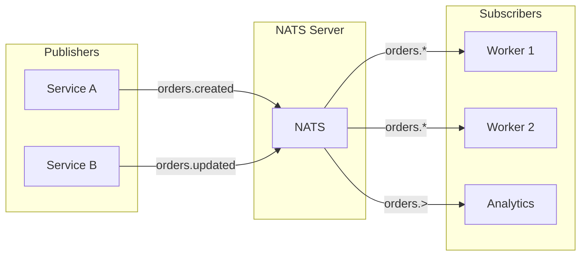
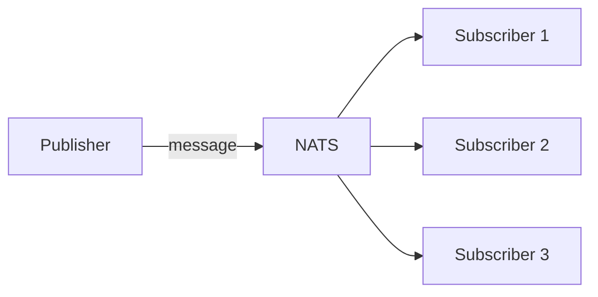
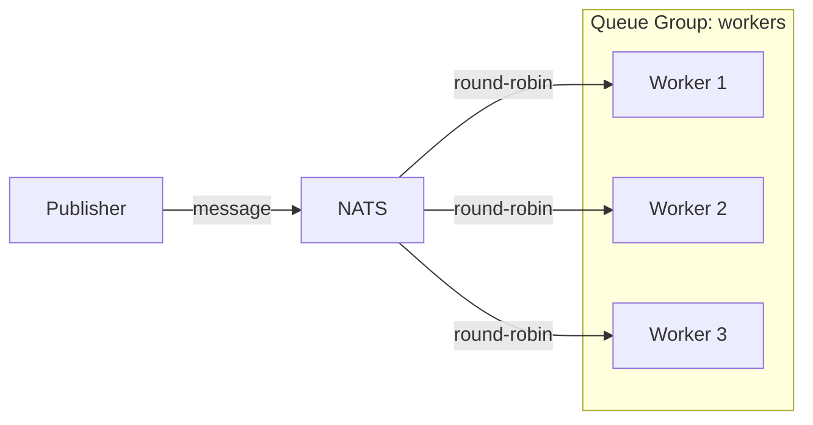

# How to Get Started with NATS Messaging

Author: [nawazdhandala](https://www.github.com/nawazdhandala)

Tags: NATS, Messaging, Distributed Systems, Microservices, Pub/Sub, Event-Driven Architecture

Description: A beginner-friendly guide to NATS messaging. Learn what NATS is, why it matters for modern applications, and how to implement common messaging patterns with practical code examples.

---

If you're building microservices or any distributed system, you'll eventually need a way for your services to talk to each other. HTTP works fine for request-response patterns, but what about when you need to broadcast events, decouple producers from consumers, or build event-driven architectures?

That's where NATS comes in. It's a lightweight, high-performance messaging system that's surprisingly easy to get started with. In this guide, we'll cover the fundamentals and get you sending messages in minutes.

---

## What is NATS?

NATS is an open-source messaging system written in Go. It was created by Derek Collison, who previously worked on messaging systems at TIBCO. The name stands for "Neural Autonomic Transport System," though most people just call it NATS.

What makes NATS different from other messaging systems like RabbitMQ or Kafka?

- **Simplicity**: NATS has a minimal API and straightforward concepts. No complex configuration files or steep learning curves.
- **Performance**: It can handle millions of messages per second with sub-millisecond latency.
- **Small footprint**: The server binary is around 20MB and uses minimal memory.
- **Cloud-native**: Built for modern infrastructure with first-class Kubernetes support.

Think of NATS as the nervous system for your distributed applications - it handles the communication so your services can focus on their actual work.

---

## Core Concepts

Before we write any code, let's understand the building blocks of NATS.

### Subjects

Subjects are like addresses for messages. Publishers send messages to subjects, and subscribers listen to subjects. A subject is just a string like `orders.created` or `users.signup`.

NATS supports wildcards for flexible subscriptions:
- `*` matches a single token: `orders.*` matches `orders.created` and `orders.updated`
- `>` matches one or more tokens: `orders.>` matches `orders.created`, `orders.us.created`, etc.

### Messages

Messages in NATS are simple - they have a subject and a payload (just bytes). No complex headers or metadata. This simplicity is intentional and contributes to NATS's performance.

### Connection Model

NATS uses persistent TCP connections. Clients connect once and maintain that connection for publishing and subscribing. The server handles all the routing.

Here's a visual overview of how NATS connects publishers and subscribers:



---

## Setting Up NATS

Let's get a NATS server running. You have several options.

### Using Docker

The quickest way to get started:

```bash
# Start a NATS server with monitoring enabled
docker run -d --name nats-server -p 4222:4222 -p 8222:8222 nats:latest
```

Port 4222 is for client connections, and 8222 provides a monitoring endpoint.

### Using the Binary

Download from the [NATS releases page](https://github.com/nats-io/nats-server/releases):

```bash
# On macOS with Homebrew
brew install nats-server

# Start the server
nats-server
```

### Verifying the Server

Once running, you can check the server status:

```bash
# Check if the server is responding
curl http://localhost:8222/varz
```

You should see JSON output with server statistics.

---

## Publishing and Subscribing

Now let's write some code. I'll show examples in multiple languages since NATS has clients for most popular languages.

### Node.js Example

First, install the NATS client:

```bash
npm install nats
```

Here's a simple publisher:

```javascript
// publisher.js
const { connect } = require('nats');

async function main() {
    // Connect to the NATS server
    const nc = await connect({ servers: 'localhost:4222' });
    console.log('Connected to NATS');

    // Publish a message to the "orders.created" subject
    // The payload must be a Uint8Array or string
    nc.publish('orders.created', JSON.stringify({
        orderId: '12345',
        customer: 'john@example.com',
        total: 99.99
    }));

    console.log('Message published');

    // Always drain connections when done
    // This ensures all pending messages are flushed
    await nc.drain();
}

main().catch(console.error);
```

And a subscriber:

```javascript
// subscriber.js
const { connect, StringCodec } = require('nats');

async function main() {
    // Connect to the NATS server
    const nc = await connect({ servers: 'localhost:4222' });
    console.log('Connected to NATS');

    // Create a string codec for encoding/decoding messages
    const sc = StringCodec();

    // Subscribe to all order events using wildcard
    const sub = nc.subscribe('orders.*');
    console.log('Subscribed to orders.*');

    // Process messages as they arrive
    for await (const msg of sub) {
        // msg.subject tells us the exact subject
        // msg.data contains the raw bytes
        const data = JSON.parse(sc.decode(msg.data));
        console.log(`Received on ${msg.subject}:`, data);
    }
}

main().catch(console.error);
```

### Python Example

Install the NATS client:

```bash
pip install nats-py
```

Publisher:

```python
# publisher.py
import asyncio
import json
from nats.aio.client import Client as NATS

async def main():
    # Create a NATS client instance
    nc = NATS()

    # Connect to the server
    await nc.connect("nats://localhost:4222")
    print("Connected to NATS")

    # Publish a message
    # The payload must be bytes, so we encode our JSON string
    message = json.dumps({
        "orderId": "12345",
        "customer": "john@example.com",
        "total": 99.99
    })
    await nc.publish("orders.created", message.encode())
    print("Message published")

    # Flush pending messages and close
    await nc.drain()

asyncio.run(main())
```

Subscriber:

```python
# subscriber.py
import asyncio
import json
from nats.aio.client import Client as NATS

async def main():
    nc = NATS()
    await nc.connect("nats://localhost:4222")
    print("Connected to NATS")

    # Define a message handler function
    async def message_handler(msg):
        subject = msg.subject
        data = json.loads(msg.data.decode())
        print(f"Received on {subject}: {data}")

    # Subscribe with the handler
    # The wildcard * matches any single token
    await nc.subscribe("orders.*", cb=message_handler)
    print("Subscribed to orders.*")

    # Keep the script running to receive messages
    while True:
        await asyncio.sleep(1)

asyncio.run(main())
```

### Go Example

Go has excellent NATS support since NATS itself is written in Go:

```bash
go get github.com/nats-io/nats.go
```

Publisher:

```go
// publisher.go
package main

import (
    "encoding/json"
    "log"

    "github.com/nats-io/nats.go"
)

type Order struct {
    OrderID  string  `json:"orderId"`
    Customer string  `json:"customer"`
    Total    float64 `json:"total"`
}

func main() {
    // Connect to NATS server
    nc, err := nats.Connect(nats.DefaultURL)
    if err != nil {
        log.Fatal(err)
    }
    defer nc.Close()

    log.Println("Connected to NATS")

    // Create our message payload
    order := Order{
        OrderID:  "12345",
        Customer: "john@example.com",
        Total:    99.99,
    }

    // Serialize to JSON
    data, err := json.Marshal(order)
    if err != nil {
        log.Fatal(err)
    }

    // Publish the message
    err = nc.Publish("orders.created", data)
    if err != nil {
        log.Fatal(err)
    }

    // Flush to ensure the message is sent
    nc.Flush()
    log.Println("Message published")
}
```

Subscriber:

```go
// subscriber.go
package main

import (
    "encoding/json"
    "log"
    "runtime"

    "github.com/nats-io/nats.go"
)

type Order struct {
    OrderID  string  `json:"orderId"`
    Customer string  `json:"customer"`
    Total    float64 `json:"total"`
}

func main() {
    // Connect to NATS server
    nc, err := nats.Connect(nats.DefaultURL)
    if err != nil {
        log.Fatal(err)
    }
    defer nc.Close()

    log.Println("Connected to NATS")

    // Subscribe with a callback function
    // The wildcard * matches any single token after "orders."
    _, err = nc.Subscribe("orders.*", func(msg *nats.Msg) {
        var order Order
        if err := json.Unmarshal(msg.Data, &order); err != nil {
            log.Printf("Error parsing message: %v", err)
            return
        }
        log.Printf("Received on %s: %+v", msg.Subject, order)
    })
    if err != nil {
        log.Fatal(err)
    }

    log.Println("Subscribed to orders.*")

    // Keep the program running
    runtime.Goexit()
}
```

---

## Common Messaging Patterns

NATS supports several messaging patterns out of the box.

### Publish-Subscribe (Fan-out)

This is what we've been doing - one publisher, multiple subscribers. Every subscriber receives every message. Great for broadcasting events.



### Queue Groups (Load Balancing)

When you have multiple instances of a service, you probably want only one instance to process each message. Queue groups handle this automatically.

```javascript
// worker.js - run multiple instances of this
const { connect, StringCodec } = require('nats');

async function main() {
    const nc = await connect({ servers: 'localhost:4222' });
    const sc = StringCodec();

    // The second argument is the queue group name
    // NATS will load-balance messages across all subscribers in the same group
    const sub = nc.subscribe('tasks.process', { queue: 'workers' });

    console.log(`Worker started, waiting for tasks...`);

    for await (const msg of sub) {
        const task = JSON.parse(sc.decode(msg.data));
        console.log(`Processing task: ${task.id}`);
        // Do the actual work here
    }
}

main().catch(console.error);
```



### Request-Reply

Sometimes you need to send a request and wait for a response. NATS handles this elegantly:

```javascript
// service.js - responds to requests
const { connect, StringCodec } = require('nats');

async function main() {
    const nc = await connect({ servers: 'localhost:4222' });
    const sc = StringCodec();

    // Subscribe to handle incoming requests
    const sub = nc.subscribe('users.lookup');

    for await (const msg of sub) {
        const request = JSON.parse(sc.decode(msg.data));
        console.log(`Looking up user: ${request.userId}`);

        // Simulate database lookup
        const user = {
            id: request.userId,
            name: 'John Doe',
            email: 'john@example.com'
        };

        // Reply to the request
        // msg.respond sends the reply back to the requester
        msg.respond(sc.encode(JSON.stringify(user)));
    }
}

main().catch(console.error);
```

```javascript
// client.js - makes requests
const { connect, StringCodec } = require('nats');

async function main() {
    const nc = await connect({ servers: 'localhost:4222' });
    const sc = StringCodec();

    // Send a request and wait for a reply
    // The timeout is in milliseconds
    const response = await nc.request(
        'users.lookup',
        sc.encode(JSON.stringify({ userId: '123' })),
        { timeout: 5000 }
    );

    const user = JSON.parse(sc.decode(response.data));
    console.log('Got user:', user);

    await nc.drain();
}

main().catch(console.error);
```

---

## JetStream: When You Need Persistence

Core NATS is fire-and-forget - if no one is listening when you publish, the message is gone. For many use cases that's fine, but sometimes you need:

- Message persistence
- At-least-once delivery guarantees
- Message replay
- Consumer acknowledgments

That's what JetStream provides. It's built into NATS and adds a persistence layer.

```javascript
// jetstream-example.js
const { connect, StringCodec } = require('nats');

async function main() {
    const nc = await connect({ servers: 'localhost:4222' });
    const sc = StringCodec();

    // Get JetStream context
    const js = nc.jetstream();
    const jsm = await nc.jetstreamManager();

    // Create a stream to store messages
    // Streams are like topics with persistence
    await jsm.streams.add({
        name: 'ORDERS',
        subjects: ['orders.>'],  // Store all order-related messages
        retention: 'limits',      // Keep messages based on limits
        max_msgs: 100000,         // Maximum number of messages
        max_age: 24 * 60 * 60 * 1e9  // 24 hours in nanoseconds
    });

    console.log('Stream created');

    // Publish a message (it will be persisted)
    await js.publish('orders.created', sc.encode(JSON.stringify({
        orderId: '12345',
        timestamp: new Date().toISOString()
    })));

    console.log('Message published to stream');

    // Create a consumer to read messages
    // Consumers track their position in the stream
    const consumer = await jsm.consumers.add('ORDERS', {
        durable_name: 'order-processor',
        ack_policy: 'explicit'  // We must acknowledge each message
    });

    // Pull messages from the consumer
    const messages = await js.fetch('ORDERS', 'order-processor', { max_messages: 10 });

    for await (const msg of messages) {
        const data = JSON.parse(sc.decode(msg.data));
        console.log('Processing:', data);

        // Acknowledge the message so it won't be redelivered
        msg.ack();
    }

    await nc.drain();
}

main().catch(console.error);
```

---

## Best Practices

Here are some things I've learned from using NATS in production:

### Design Your Subjects Carefully

Use a hierarchical naming scheme. This makes wildcards useful and keeps things organized:

```
# Good - hierarchical and descriptive
orders.created
orders.updated
orders.us.created
orders.eu.created

# Bad - flat and hard to filter
order_created
new_order
orderUpdate
```

### Handle Disconnections

Networks fail. Your client should handle reconnection gracefully:

```javascript
const nc = await connect({
    servers: 'localhost:4222',
    reconnect: true,
    maxReconnectAttempts: -1,  // Keep trying forever
    reconnectTimeWait: 2000,    // Wait 2 seconds between attempts
});

// Listen for connection events
nc.status().then(async (s) => {
    for await (const status of s) {
        console.log(`Connection status: ${status.type}`);
    }
});
```

### Use Queue Groups for Services

If you're running multiple instances of a service, always use queue groups. Otherwise every instance processes every message, which is rarely what you want.

### Keep Messages Small

NATS is optimized for small messages (under 1MB). If you need to transfer large files, store them elsewhere and send a reference in the message.

### Monitor Your Server

NATS provides excellent monitoring endpoints. Check `/varz` for server stats, `/connz` for connection info, and `/subsz` for subscription details.

---

## When to Use NATS vs Other Systems

NATS isn't the right choice for everything. Here's a quick comparison:

| Use Case | NATS | Kafka | RabbitMQ |
|----------|------|-------|----------|
| High throughput events | Great | Great | Good |
| Long-term message storage | JetStream | Native | Plugin |
| Complex routing | Basic | No | Excellent |
| Operational simplicity | Excellent | Complex | Moderate |
| Request-reply | Native | Manual | Plugin |
| Exactly-once delivery | No | Yes | No |

Choose NATS when you value simplicity and performance. Choose Kafka when you need a permanent event log. Choose RabbitMQ when you need sophisticated routing.

---

## What's Next?

We've covered the basics, but there's more to explore:

- **Clustering**: Running multiple NATS servers for high availability
- **Authentication**: Securing your NATS deployment with tokens, NKeys, or JWTs
- **Leaf Nodes**: Connecting NATS clusters across regions or clouds
- **NATS CLI**: The `nats` command-line tool for debugging and administration

The [official NATS documentation](https://docs.nats.io/) is excellent and worth reading through as you build more complex systems.

NATS has become a core part of many cloud-native architectures, and for good reason. It's simple enough to get started in an afternoon, yet powerful enough to run in production at scale. Give it a try - your services will thank you for the clean separation of concerns.

---

*Building event-driven microservices? Consider adding observability from the start. OneUptime helps you monitor, trace, and debug distributed systems - including those using NATS for messaging.*
