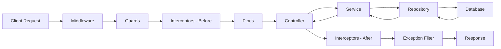

# How to Use NestJS for Enterprise Applications

Author: [nawazdhandala](https://www.github.com/nawazdhandala)

Tags: NestJS, TypeScript, NodeJS, Enterprise, Architecture, Backend

Description: A practical guide to building enterprise-grade applications with NestJS. Learn about modular architecture, dependency injection, configuration management, testing strategies, and production patterns used in large-scale systems.

---

NestJS has become a go-to framework for building enterprise Node.js applications. Its opinionated structure, TypeScript support, and built-in patterns make it well-suited for large teams working on complex systems. This guide covers the practical patterns and techniques you need to build maintainable, scalable enterprise applications with NestJS.

## Why NestJS Works for Enterprise

Enterprise applications have specific requirements that differ from smaller projects. You need:

- Clear code organization across multiple teams
- Testable components that can be verified independently
- Consistent patterns that new developers can learn quickly
- Built-in support for common enterprise integrations

NestJS provides these through its modular architecture and dependency injection system. Rather than letting each team invent their own patterns, NestJS gives you a solid foundation.

| Requirement | NestJS Solution |
|-------------|-----------------|
| Code organization | Module system with clear boundaries |
| Testability | Dependency injection and mocking support |
| Consistency | Decorators and standard patterns |
| Integration | Built-in support for databases, queues, auth |

## Project Structure for Large Teams

A well-organized project structure is critical when multiple teams work on the same codebase. Here is a structure that scales well:

```
src/
├── common/                 # Shared utilities and base classes
│   ├── decorators/
│   ├── filters/
│   ├── guards/
│   ├── interceptors/
│   └── pipes/
├── config/                 # Configuration management
│   ├── database.config.ts
│   ├── app.config.ts
│   └── config.module.ts
├── core/                   # Core business logic
│   ├── domain/            # Domain entities
│   ├── repositories/      # Data access interfaces
│   └── services/          # Core business services
├── infrastructure/         # External integrations
│   ├── database/
│   ├── messaging/
│   └── external-apis/
├── modules/               # Feature modules
│   ├── users/
│   ├── orders/
│   └── payments/
└── main.ts
```

Each feature module contains its own controllers, services, and DTOs. This keeps related code together and makes it easier for teams to work independently.

## Configuration Management

Enterprise applications run in multiple environments - development, staging, production, and often several regional deployments. NestJS ConfigModule with validation ensures you catch configuration errors early.

```typescript
// config/app.config.ts
import { registerAs } from '@nestjs/config';

// Register configuration namespaces to organize settings
export const appConfig = registerAs('app', () => ({
  nodeEnv: process.env.NODE_ENV || 'development',
  port: parseInt(process.env.PORT, 10) || 3000,
  apiPrefix: process.env.API_PREFIX || 'api',
  fallbackLanguage: process.env.FALLBACK_LANGUAGE || 'en',
}));

export const databaseConfig = registerAs('database', () => ({
  host: process.env.DATABASE_HOST,
  port: parseInt(process.env.DATABASE_PORT, 10) || 5432,
  name: process.env.DATABASE_NAME,
  username: process.env.DATABASE_USERNAME,
  password: process.env.DATABASE_PASSWORD,
  synchronize: process.env.NODE_ENV !== 'production',
  logging: process.env.DATABASE_LOGGING === 'true',
}));
```

Now add validation to catch missing configuration at startup:

```typescript
// config/env.validation.ts
import { plainToInstance } from 'class-transformer';
import { IsEnum, IsNumber, IsString, validateSync } from 'class-validator';

enum Environment {
  Development = 'development',
  Staging = 'staging',
  Production = 'production',
}

class EnvironmentVariables {
  @IsEnum(Environment)
  NODE_ENV: Environment;

  @IsNumber()
  PORT: number;

  @IsString()
  DATABASE_HOST: string;

  @IsNumber()
  DATABASE_PORT: number;

  @IsString()
  DATABASE_NAME: string;

  @IsString()
  DATABASE_USERNAME: string;

  @IsString()
  DATABASE_PASSWORD: string;
}

// This function runs at startup and fails fast if config is invalid
export function validate(config: Record<string, unknown>) {
  const validatedConfig = plainToInstance(EnvironmentVariables, config, {
    enableImplicitConversion: true,
  });

  const errors = validateSync(validatedConfig, {
    skipMissingProperties: false,
  });

  if (errors.length > 0) {
    throw new Error(errors.toString());
  }

  return validatedConfig;
}
```

Register everything in a configuration module:

```typescript
// config/config.module.ts
import { Module } from '@nestjs/common';
import { ConfigModule } from '@nestjs/config';
import { appConfig, databaseConfig } from './app.config';
import { validate } from './env.validation';

@Module({
  imports: [
    ConfigModule.forRoot({
      isGlobal: true,
      load: [appConfig, databaseConfig],
      validate,
      // Load environment-specific files
      envFilePath: [
        `.env.${process.env.NODE_ENV}.local`,
        `.env.${process.env.NODE_ENV}`,
        '.env.local',
        '.env',
      ],
    }),
  ],
})
export class AppConfigModule {}
```

## Domain-Driven Module Design

In enterprise applications, organizing code around business domains keeps complexity manageable. Here is how a typical feature module looks:

```typescript
// modules/orders/orders.module.ts
import { Module } from '@nestjs/common';
import { TypeOrmModule } from '@nestjs/typeorm';
import { OrdersController } from './controllers/orders.controller';
import { OrdersService } from './services/orders.service';
import { OrderRepository } from './repositories/order.repository';
import { Order } from './entities/order.entity';
import { OrderItem } from './entities/order-item.entity';
import { PaymentsModule } from '../payments/payments.module';
import { InventoryModule } from '../inventory/inventory.module';

@Module({
  imports: [
    // Register entities for this module
    TypeOrmModule.forFeature([Order, OrderItem]),
    // Import modules this feature depends on
    PaymentsModule,
    InventoryModule,
  ],
  controllers: [OrdersController],
  providers: [OrdersService, OrderRepository],
  // Export services that other modules need
  exports: [OrdersService],
})
export class OrdersModule {}
```

The service encapsulates business logic and coordinates between repositories:

```typescript
// modules/orders/services/orders.service.ts
import { Injectable, NotFoundException } from '@nestjs/common';
import { InjectRepository } from '@nestjs/typeorm';
import { Repository, DataSource } from 'typeorm';
import { Order, OrderStatus } from '../entities/order.entity';
import { CreateOrderDto } from '../dto/create-order.dto';
import { PaymentsService } from '../../payments/services/payments.service';
import { InventoryService } from '../../inventory/services/inventory.service';

@Injectable()
export class OrdersService {
  constructor(
    @InjectRepository(Order)
    private orderRepository: Repository<Order>,
    private paymentsService: PaymentsService,
    private inventoryService: InventoryService,
    private dataSource: DataSource,
  ) {}

  async createOrder(userId: string, dto: CreateOrderDto): Promise<Order> {
    // Use a transaction for operations that must succeed or fail together
    const queryRunner = this.dataSource.createQueryRunner();
    await queryRunner.connect();
    await queryRunner.startTransaction();

    try {
      // Check inventory availability
      await this.inventoryService.reserveItems(dto.items);

      // Create the order
      const order = this.orderRepository.create({
        userId,
        items: dto.items,
        status: OrderStatus.PENDING,
        totalAmount: this.calculateTotal(dto.items),
      });

      const savedOrder = await queryRunner.manager.save(order);

      // Process payment
      await this.paymentsService.processPayment({
        orderId: savedOrder.id,
        amount: savedOrder.totalAmount,
        paymentMethod: dto.paymentMethod,
      });

      // Update order status
      savedOrder.status = OrderStatus.CONFIRMED;
      await queryRunner.manager.save(savedOrder);

      await queryRunner.commitTransaction();
      return savedOrder;
    } catch (error) {
      // Roll back all changes if anything fails
      await queryRunner.rollbackTransaction();
      throw error;
    } finally {
      await queryRunner.release();
    }
  }

  private calculateTotal(items: Array<{ price: number; quantity: number }>): number {
    return items.reduce((sum, item) => sum + item.price * item.quantity, 0);
  }
}
```

## Request Flow in Enterprise NestJS

Understanding how requests flow through a NestJS application helps you place logic in the right layer:



Each layer has a specific responsibility:

- **Middleware**: Request logging, CORS, body parsing
- **Guards**: Authentication and authorization checks
- **Interceptors**: Request/response transformation, caching, logging
- **Pipes**: Input validation and transformation
- **Controllers**: HTTP handling and routing
- **Services**: Business logic
- **Repositories**: Data access

## Custom Exception Handling

Enterprise applications need consistent error responses across all endpoints. Create a global exception filter:

```typescript
// common/filters/http-exception.filter.ts
import {
  ExceptionFilter,
  Catch,
  ArgumentsHost,
  HttpException,
  HttpStatus,
  Logger,
} from '@nestjs/common';
import { Request, Response } from 'express';

interface ErrorResponse {
  statusCode: number;
  timestamp: string;
  path: string;
  method: string;
  message: string;
  details?: any;
  correlationId?: string;
}

@Catch()
export class GlobalExceptionFilter implements ExceptionFilter {
  private readonly logger = new Logger(GlobalExceptionFilter.name);

  catch(exception: unknown, host: ArgumentsHost) {
    const ctx = host.switchToHttp();
    const response = ctx.getResponse<Response>();
    const request = ctx.getRequest<Request>();

    // Extract correlation ID from headers for distributed tracing
    const correlationId = request.headers['x-correlation-id'] as string;

    let status = HttpStatus.INTERNAL_SERVER_ERROR;
    let message = 'Internal server error';
    let details = null;

    if (exception instanceof HttpException) {
      status = exception.getStatus();
      const exceptionResponse = exception.getResponse();

      if (typeof exceptionResponse === 'object') {
        message = (exceptionResponse as any).message || exception.message;
        details = (exceptionResponse as any).details;
      } else {
        message = exceptionResponse;
      }
    }

    const errorResponse: ErrorResponse = {
      statusCode: status,
      timestamp: new Date().toISOString(),
      path: request.url,
      method: request.method,
      message,
      details,
      correlationId,
    };

    // Log errors with context for debugging
    this.logger.error(
      `${request.method} ${request.url} - ${status} - ${message}`,
      exception instanceof Error ? exception.stack : undefined,
      { correlationId },
    );

    response.status(status).json(errorResponse);
  }
}
```

## Health Checks for Production

Production deployments need health endpoints for load balancers and orchestration systems. NestJS has built-in support:

```typescript
// health/health.module.ts
import { Module } from '@nestjs/common';
import { TerminusModule } from '@nestjs/terminus';
import { HttpModule } from '@nestjs/axios';
import { HealthController } from './health.controller';
import { DatabaseHealthIndicator } from './indicators/database.health';
import { RedisHealthIndicator } from './indicators/redis.health';

@Module({
  imports: [TerminusModule, HttpModule],
  controllers: [HealthController],
  providers: [DatabaseHealthIndicator, RedisHealthIndicator],
})
export class HealthModule {}
```

```typescript
// health/health.controller.ts
import { Controller, Get } from '@nestjs/common';
import {
  HealthCheck,
  HealthCheckService,
  TypeOrmHealthIndicator,
  MemoryHealthIndicator,
  DiskHealthIndicator,
} from '@nestjs/terminus';
import { DatabaseHealthIndicator } from './indicators/database.health';

@Controller('health')
export class HealthController {
  constructor(
    private health: HealthCheckService,
    private db: TypeOrmHealthIndicator,
    private memory: MemoryHealthIndicator,
    private disk: DiskHealthIndicator,
    private customDb: DatabaseHealthIndicator,
  ) {}

  // Basic liveness check - is the app running?
  @Get('live')
  @HealthCheck()
  checkLive() {
    return this.health.check([]);
  }

  // Readiness check - is the app ready to receive traffic?
  @Get('ready')
  @HealthCheck()
  checkReady() {
    return this.health.check([
      // Check database connection
      () => this.db.pingCheck('database'),
      // Check memory usage stays under 300MB heap
      () => this.memory.checkHeap('memory_heap', 300 * 1024 * 1024),
      // Check disk usage stays under 90%
      () =>
        this.disk.checkStorage('disk', {
          path: '/',
          thresholdPercent: 0.9,
        }),
    ]);
  }
}
```

## Testing Strategy for Enterprise Apps

Enterprise applications need thorough testing at multiple levels. Here is how to structure tests for a service:

```typescript
// modules/orders/services/orders.service.spec.ts
import { Test, TestingModule } from '@nestjs/testing';
import { getRepositoryToken } from '@nestjs/typeorm';
import { DataSource, Repository } from 'typeorm';
import { OrdersService } from './orders.service';
import { Order, OrderStatus } from '../entities/order.entity';
import { PaymentsService } from '../../payments/services/payments.service';
import { InventoryService } from '../../inventory/services/inventory.service';

describe('OrdersService', () => {
  let service: OrdersService;
  let orderRepository: jest.Mocked<Repository<Order>>;
  let paymentsService: jest.Mocked<PaymentsService>;
  let inventoryService: jest.Mocked<InventoryService>;

  // Create mock query runner for transaction testing
  const mockQueryRunner = {
    connect: jest.fn(),
    startTransaction: jest.fn(),
    commitTransaction: jest.fn(),
    rollbackTransaction: jest.fn(),
    release: jest.fn(),
    manager: {
      save: jest.fn(),
    },
  };

  beforeEach(async () => {
    const module: TestingModule = await Test.createTestingModule({
      providers: [
        OrdersService,
        {
          provide: getRepositoryToken(Order),
          useValue: {
            create: jest.fn(),
            save: jest.fn(),
            findOne: jest.fn(),
          },
        },
        {
          provide: PaymentsService,
          useValue: {
            processPayment: jest.fn(),
          },
        },
        {
          provide: InventoryService,
          useValue: {
            reserveItems: jest.fn(),
          },
        },
        {
          provide: DataSource,
          useValue: {
            createQueryRunner: jest.fn().mockReturnValue(mockQueryRunner),
          },
        },
      ],
    }).compile();

    service = module.get<OrdersService>(OrdersService);
    orderRepository = module.get(getRepositoryToken(Order));
    paymentsService = module.get(PaymentsService);
    inventoryService = module.get(InventoryService);
  });

  describe('createOrder', () => {
    const userId = 'user-123';
    const createOrderDto = {
      items: [{ productId: 'prod-1', quantity: 2, price: 50 }],
      paymentMethod: 'credit_card',
    };

    it('should create order successfully', async () => {
      const mockOrder = {
        id: 'order-123',
        userId,
        status: OrderStatus.PENDING,
        totalAmount: 100,
      };

      orderRepository.create.mockReturnValue(mockOrder as Order);
      mockQueryRunner.manager.save.mockResolvedValue(mockOrder);
      inventoryService.reserveItems.mockResolvedValue(undefined);
      paymentsService.processPayment.mockResolvedValue(undefined);

      const result = await service.createOrder(userId, createOrderDto);

      expect(inventoryService.reserveItems).toHaveBeenCalledWith(createOrderDto.items);
      expect(paymentsService.processPayment).toHaveBeenCalled();
      expect(mockQueryRunner.commitTransaction).toHaveBeenCalled();
      expect(result.status).toBe(OrderStatus.CONFIRMED);
    });

    it('should rollback transaction on payment failure', async () => {
      orderRepository.create.mockReturnValue({ id: 'order-123' } as Order);
      mockQueryRunner.manager.save.mockResolvedValue({ id: 'order-123' });
      inventoryService.reserveItems.mockResolvedValue(undefined);
      paymentsService.processPayment.mockRejectedValue(new Error('Payment failed'));

      await expect(service.createOrder(userId, createOrderDto)).rejects.toThrow('Payment failed');
      expect(mockQueryRunner.rollbackTransaction).toHaveBeenCalled();
    });
  });
});
```

## Caching for Performance

Caching is essential for enterprise performance. NestJS integrates with Redis for distributed caching:

```typescript
// common/interceptors/cache.interceptor.ts
import {
  Injectable,
  NestInterceptor,
  ExecutionContext,
  CallHandler,
  Inject,
} from '@nestjs/common';
import { Observable, of } from 'rxjs';
import { tap } from 'rxjs/operators';
import { CACHE_MANAGER } from '@nestjs/cache-manager';
import { Cache } from 'cache-manager';

@Injectable()
export class HttpCacheInterceptor implements NestInterceptor {
  constructor(@Inject(CACHE_MANAGER) private cacheManager: Cache) {}

  async intercept(
    context: ExecutionContext,
    next: CallHandler,
  ): Promise<Observable<any>> {
    const request = context.switchToHttp().getRequest();

    // Only cache GET requests
    if (request.method !== 'GET') {
      return next.handle();
    }

    // Build cache key from URL and query params
    const cacheKey = `http:${request.url}`;

    // Check cache first
    const cachedResponse = await this.cacheManager.get(cacheKey);
    if (cachedResponse) {
      return of(cachedResponse);
    }

    // Execute handler and cache result
    return next.handle().pipe(
      tap(async (response) => {
        // Cache for 5 minutes
        await this.cacheManager.set(cacheKey, response, 300000);
      }),
    );
  }
}
```

## Logging for Observability

Structured logging is critical for debugging production issues. Here is a logging setup that works well with log aggregation tools:

```typescript
// common/logger/logger.service.ts
import { Injectable, LoggerService, Scope } from '@nestjs/common';
import { ConfigService } from '@nestjs/config';

interface LogContext {
  correlationId?: string;
  userId?: string;
  [key: string]: any;
}

@Injectable({ scope: Scope.TRANSIENT })
export class AppLogger implements LoggerService {
  private context: string;
  private isProduction: boolean;

  constructor(private configService: ConfigService) {
    this.isProduction = configService.get('NODE_ENV') === 'production';
  }

  setContext(context: string) {
    this.context = context;
  }

  log(message: string, context?: LogContext) {
    this.writeLog('info', message, context);
  }

  error(message: string, trace?: string, context?: LogContext) {
    this.writeLog('error', message, { ...context, trace });
  }

  warn(message: string, context?: LogContext) {
    this.writeLog('warn', message, context);
  }

  debug(message: string, context?: LogContext) {
    if (!this.isProduction) {
      this.writeLog('debug', message, context);
    }
  }

  private writeLog(level: string, message: string, context?: LogContext) {
    const logEntry = {
      timestamp: new Date().toISOString(),
      level,
      context: this.context,
      message,
      ...context,
    };

    // Output JSON in production for log aggregation tools
    if (this.isProduction) {
      console.log(JSON.stringify(logEntry));
    } else {
      console.log(`[${logEntry.timestamp}] ${level.toUpperCase()} [${this.context}] ${message}`);
    }
  }
}
```

## Graceful Shutdown

Enterprise applications need to shut down cleanly, finishing in-progress requests and closing connections:

```typescript
// main.ts
import { NestFactory } from '@nestjs/core';
import { AppModule } from './app.module';
import { Logger } from '@nestjs/common';

async function bootstrap() {
  const app = await NestFactory.create(AppModule);
  const logger = new Logger('Bootstrap');

  // Enable graceful shutdown hooks
  app.enableShutdownHooks();

  const port = process.env.PORT || 3000;
  await app.listen(port);

  logger.log(`Application running on port ${port}`);
}

bootstrap();
```

```typescript
// app.module.ts
import { Module, OnModuleDestroy, OnApplicationShutdown } from '@nestjs/common';
import { Logger } from '@nestjs/common';

@Module({
  // ... imports and providers
})
export class AppModule implements OnModuleDestroy, OnApplicationShutdown {
  private readonly logger = new Logger(AppModule.name);

  async onModuleDestroy() {
    this.logger.log('Module destroying - cleaning up resources');
    // Close database connections, flush caches, etc.
  }

  async onApplicationShutdown(signal?: string) {
    this.logger.log(`Application shutting down due to ${signal}`);
    // Final cleanup before process exits
  }
}
```

## Summary

Building enterprise applications with NestJS requires thinking about:

1. **Project structure** - Organize by domain, keep modules focused
2. **Configuration** - Validate early, support multiple environments
3. **Error handling** - Consistent responses, proper logging
4. **Testing** - Unit tests with mocks, integration tests for critical paths
5. **Observability** - Structured logging, health checks, metrics
6. **Production concerns** - Graceful shutdown, caching, connection management

NestJS provides solid building blocks for all of these concerns. The key is using them consistently across your codebase so that every team follows the same patterns. Start with a good project template, enforce it through code review, and your enterprise application will stay maintainable as it grows.

The patterns shown here have worked well in production systems handling millions of requests. Adapt them to your specific needs, but keep the core principles: clear boundaries, explicit dependencies, and consistent error handling throughout.
