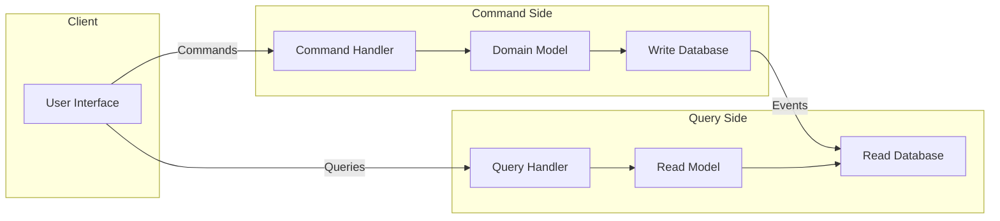

# How to Implement CQRS Pattern in Node.js

Author: [nawazdhandala](https://github.com/nawazdhandala)

Tags: Node.js, CQRS, Architecture, Design Patterns, Event-Driven Architecture

Description: A practical guide to implementing the Command Query Responsibility Segregation (CQRS) pattern in Node.js. Learn how to separate read and write operations with working code examples for building scalable, maintainable applications.

---

CQRS stands for Command Query Responsibility Segregation, a pattern that separates read and write operations into different models. Instead of using the same data model for both retrieving and modifying data, you split them apart. Commands handle writes, queries handle reads, and each side can be optimized independently.

This might sound like unnecessary complexity at first, but consider what happens as your application grows. Your read operations need different optimizations than your writes. Users might need to search, filter, and aggregate data in ways that conflict with how you need to validate and store it. CQRS lets you handle these concerns separately.

In this guide, we will build a complete CQRS implementation in Node.js, starting from basic concepts and working up to a production-ready structure.

## Understanding CQRS

Before diving into code, let's understand the core idea. In a traditional CRUD application, you might have a service that looks like this:

```javascript
// Traditional approach - same model for reads and writes
class OrderService {
  async createOrder(orderData) {
    // Validate and create order
    const order = await Order.create(orderData);
    return order;
  }

  async getOrderById(id) {
    // Read order using the same model
    return Order.findById(id);
  }

  async getOrdersForDashboard(filters) {
    // Complex read with joins, aggregations
    // Often requires different data shape than what we store
    return Order.aggregate([...]);
  }
}
```

The problem is that `getOrdersForDashboard` often needs a completely different data structure than what makes sense for writing. You end up with complex joins, computed fields, and transformations that slow down your reads.

With CQRS, you split this into two distinct paths:



Commands mutate state through a domain model optimized for business rules. Queries read from a model optimized for display. The read side can use denormalized data, pre-computed aggregates, or even a completely different database.

## Setting Up the Project

Let's build a practical example - an e-commerce order system. First, set up the project structure:

```
src/
  commands/
    createOrder.js
    updateOrderStatus.js
    handlers/
      orderCommandHandler.js
  queries/
    getOrder.js
    getOrdersByCustomer.js
    handlers/
      orderQueryHandler.js
  domain/
    order.js
    orderEvents.js
  infrastructure/
    commandBus.js
    queryBus.js
    eventStore.js
    readModelProjection.js
  repositories/
    orderWriteRepository.js
    orderReadRepository.js
  app.js
```

Start by installing dependencies:

```bash
npm init -y
npm install express uuid
npm install --save-dev jest
```

## Implementing Commands

Commands represent intentions to change state. They should be named as imperatives - CreateOrder, UpdateOrderStatus, CancelOrder. Let's define our command structure:

```javascript
// src/commands/createOrder.js

// Command is a simple object describing the intent
class CreateOrderCommand {
  constructor({ customerId, items, shippingAddress }) {
    this.type = 'CREATE_ORDER';
    this.customerId = customerId;
    this.items = items;
    this.shippingAddress = shippingAddress;
    this.timestamp = new Date().toISOString();
  }

  // Validate the command before processing
  validate() {
    const errors = [];

    if (!this.customerId) {
      errors.push('Customer ID is required');
    }

    if (!this.items || this.items.length === 0) {
      errors.push('At least one item is required');
    }

    if (this.items) {
      this.items.forEach((item, index) => {
        if (!item.productId) {
          errors.push(`Item ${index}: Product ID is required`);
        }
        if (!item.quantity || item.quantity < 1) {
          errors.push(`Item ${index}: Quantity must be at least 1`);
        }
        if (!item.price || item.price <= 0) {
          errors.push(`Item ${index}: Price must be positive`);
        }
      });
    }

    if (!this.shippingAddress) {
      errors.push('Shipping address is required');
    }

    return errors;
  }
}

module.exports = CreateOrderCommand;
```

```javascript
// src/commands/updateOrderStatus.js

class UpdateOrderStatusCommand {
  constructor({ orderId, newStatus, reason }) {
    this.type = 'UPDATE_ORDER_STATUS';
    this.orderId = orderId;
    this.newStatus = newStatus;
    this.reason = reason;
    this.timestamp = new Date().toISOString();
  }

  validate() {
    const errors = [];
    const validStatuses = ['pending', 'confirmed', 'shipped', 'delivered', 'cancelled'];

    if (!this.orderId) {
      errors.push('Order ID is required');
    }

    if (!validStatuses.includes(this.newStatus)) {
      errors.push(`Status must be one of: ${validStatuses.join(', ')}`);
    }

    return errors;
  }
}

module.exports = UpdateOrderStatusCommand;
```

## The Command Bus

The command bus routes commands to their handlers. This decouples the sender from the handler:

```javascript
// src/infrastructure/commandBus.js

class CommandBus {
  constructor() {
    // Map of command types to their handlers
    this.handlers = new Map();
  }

  // Register a handler for a command type
  register(commandType, handler) {
    if (this.handlers.has(commandType)) {
      throw new Error(`Handler already registered for ${commandType}`);
    }
    this.handlers.set(commandType, handler);
  }

  // Send a command to its handler
  async send(command) {
    // Validate the command first
    if (command.validate) {
      const errors = command.validate();
      if (errors.length > 0) {
        throw new ValidationError(errors);
      }
    }

    const handler = this.handlers.get(command.type);

    if (!handler) {
      throw new Error(`No handler registered for command: ${command.type}`);
    }

    // Execute the handler and return the result
    return handler.handle(command);
  }
}

class ValidationError extends Error {
  constructor(errors) {
    super(`Validation failed: ${errors.join(', ')}`);
    this.name = 'ValidationError';
    this.errors = errors;
  }
}

module.exports = { CommandBus, ValidationError };
```

## Domain Model and Events

The domain model contains your business logic. When state changes, it produces events:

```javascript
// src/domain/orderEvents.js

// Events represent things that have happened
const OrderEvents = {
  ORDER_CREATED: 'ORDER_CREATED',
  ORDER_STATUS_UPDATED: 'ORDER_STATUS_UPDATED',
  ORDER_CANCELLED: 'ORDER_CANCELLED'
};

function createEvent(type, data) {
  return {
    type,
    data,
    timestamp: new Date().toISOString(),
    id: require('uuid').v4()
  };
}

module.exports = { OrderEvents, createEvent };
```

```javascript
// src/domain/order.js

const { v4: uuidv4 } = require('uuid');
const { OrderEvents, createEvent } = require('./orderEvents');

class Order {
  constructor() {
    // Internal state
    this.id = null;
    this.customerId = null;
    this.items = [];
    this.shippingAddress = null;
    this.status = null;
    this.totalAmount = 0;
    this.createdAt = null;
    this.updatedAt = null;

    // Track events produced by this aggregate
    this.uncommittedEvents = [];
  }

  // Factory method to create a new order
  static create({ customerId, items, shippingAddress }) {
    const order = new Order();

    // Calculate total
    const totalAmount = items.reduce(
      (sum, item) => sum + item.price * item.quantity,
      0
    );

    // Apply the creation event
    order.apply(
      createEvent(OrderEvents.ORDER_CREATED, {
        orderId: uuidv4(),
        customerId,
        items,
        shippingAddress,
        totalAmount,
        status: 'pending'
      })
    );

    return order;
  }

  // Rebuild state from events (event sourcing)
  static fromEvents(events) {
    const order = new Order();
    events.forEach((event) => order.applyEvent(event));
    return order;
  }

  // Business logic for updating status
  updateStatus(newStatus, reason) {
    // Validate state transitions
    const allowedTransitions = {
      pending: ['confirmed', 'cancelled'],
      confirmed: ['shipped', 'cancelled'],
      shipped: ['delivered'],
      delivered: [],
      cancelled: []
    };

    if (!allowedTransitions[this.status]?.includes(newStatus)) {
      throw new Error(
        `Cannot transition from ${this.status} to ${newStatus}`
      );
    }

    this.apply(
      createEvent(OrderEvents.ORDER_STATUS_UPDATED, {
        orderId: this.id,
        previousStatus: this.status,
        newStatus,
        reason
      })
    );
  }

  // Apply an event and track it as uncommitted
  apply(event) {
    this.applyEvent(event);
    this.uncommittedEvents.push(event);
  }

  // Apply an event to update internal state
  applyEvent(event) {
    switch (event.type) {
      case OrderEvents.ORDER_CREATED:
        this.id = event.data.orderId;
        this.customerId = event.data.customerId;
        this.items = event.data.items;
        this.shippingAddress = event.data.shippingAddress;
        this.totalAmount = event.data.totalAmount;
        this.status = event.data.status;
        this.createdAt = event.timestamp;
        this.updatedAt = event.timestamp;
        break;

      case OrderEvents.ORDER_STATUS_UPDATED:
        this.status = event.data.newStatus;
        this.updatedAt = event.timestamp;
        break;

      default:
        // Unknown event type - ignore
        break;
    }
  }

  // Get events that need to be persisted
  getUncommittedEvents() {
    return [...this.uncommittedEvents];
  }

  // Clear uncommitted events after persistence
  clearUncommittedEvents() {
    this.uncommittedEvents = [];
  }
}

module.exports = Order;
```

## Command Handlers

Command handlers coordinate between commands and the domain:

```javascript
// src/commands/handlers/orderCommandHandler.js

const Order = require('../../domain/order');

class OrderCommandHandler {
  constructor({ writeRepository, eventStore, eventPublisher }) {
    this.writeRepository = writeRepository;
    this.eventStore = eventStore;
    this.eventPublisher = eventPublisher;
  }

  async handle(command) {
    switch (command.type) {
      case 'CREATE_ORDER':
        return this.handleCreateOrder(command);
      case 'UPDATE_ORDER_STATUS':
        return this.handleUpdateStatus(command);
      default:
        throw new Error(`Unknown command type: ${command.type}`);
    }
  }

  async handleCreateOrder(command) {
    // Create the order through the domain model
    const order = Order.create({
      customerId: command.customerId,
      items: command.items,
      shippingAddress: command.shippingAddress
    });

    // Get the events produced
    const events = order.getUncommittedEvents();

    // Persist events to event store
    await this.eventStore.append(order.id, events);

    // Save current state to write repository
    await this.writeRepository.save(order);

    // Publish events for the read side to consume
    for (const event of events) {
      await this.eventPublisher.publish(event);
    }

    order.clearUncommittedEvents();

    // Return the order ID
    return { orderId: order.id };
  }

  async handleUpdateStatus(command) {
    // Load the order from events
    const events = await this.eventStore.getEvents(command.orderId);

    if (events.length === 0) {
      throw new Error(`Order not found: ${command.orderId}`);
    }

    // Rebuild the order from events
    const order = Order.fromEvents(events);

    // Apply the business logic
    order.updateStatus(command.newStatus, command.reason);

    // Get new events
    const newEvents = order.getUncommittedEvents();

    // Persist new events
    await this.eventStore.append(order.id, newEvents);

    // Update write repository
    await this.writeRepository.save(order);

    // Publish events
    for (const event of newEvents) {
      await this.eventPublisher.publish(event);
    }

    order.clearUncommittedEvents();

    return { orderId: order.id, status: order.status };
  }
}

module.exports = OrderCommandHandler;
```

## Implementing Queries

Queries retrieve data without modifying state. They read from optimized read models:

```javascript
// src/queries/getOrder.js

class GetOrderQuery {
  constructor({ orderId }) {
    this.type = 'GET_ORDER';
    this.orderId = orderId;
  }
}

module.exports = GetOrderQuery;
```

```javascript
// src/queries/getOrdersByCustomer.js

class GetOrdersByCustomerQuery {
  constructor({ customerId, status, page = 1, limit = 20 }) {
    this.type = 'GET_ORDERS_BY_CUSTOMER';
    this.customerId = customerId;
    this.status = status;
    this.page = page;
    this.limit = limit;
  }
}

module.exports = GetOrdersByCustomerQuery;
```

## The Query Bus

Similar to commands, queries go through a bus:

```javascript
// src/infrastructure/queryBus.js

class QueryBus {
  constructor() {
    this.handlers = new Map();
  }

  register(queryType, handler) {
    if (this.handlers.has(queryType)) {
      throw new Error(`Handler already registered for ${queryType}`);
    }
    this.handlers.set(queryType, handler);
  }

  async send(query) {
    const handler = this.handlers.get(query.type);

    if (!handler) {
      throw new Error(`No handler registered for query: ${query.type}`);
    }

    return handler.handle(query);
  }
}

module.exports = QueryBus;
```

## Query Handlers and Read Models

The query handler reads from a denormalized read model:

```javascript
// src/queries/handlers/orderQueryHandler.js

class OrderQueryHandler {
  constructor({ readRepository }) {
    this.readRepository = readRepository;
  }

  async handle(query) {
    switch (query.type) {
      case 'GET_ORDER':
        return this.handleGetOrder(query);
      case 'GET_ORDERS_BY_CUSTOMER':
        return this.handleGetOrdersByCustomer(query);
      default:
        throw new Error(`Unknown query type: ${query.type}`);
    }
  }

  async handleGetOrder(query) {
    const order = await this.readRepository.findById(query.orderId);

    if (!order) {
      return null;
    }

    // Read model is already optimized for display
    return order;
  }

  async handleGetOrdersByCustomer(query) {
    const { customerId, status, page, limit } = query;

    const orders = await this.readRepository.findByCustomer(
      customerId,
      { status, page, limit }
    );

    return {
      orders,
      page,
      limit,
      // Read repository can efficiently count
      total: await this.readRepository.countByCustomer(customerId, { status })
    };
  }
}

module.exports = OrderQueryHandler;
```

## Read Model Projections

Projections listen to events and update the read model:

```javascript
// src/infrastructure/readModelProjection.js

const { OrderEvents } = require('../domain/orderEvents');

class OrderReadModelProjection {
  constructor({ readRepository }) {
    this.readRepository = readRepository;
  }

  // Process an event and update the read model
  async project(event) {
    switch (event.type) {
      case OrderEvents.ORDER_CREATED:
        return this.handleOrderCreated(event);
      case OrderEvents.ORDER_STATUS_UPDATED:
        return this.handleOrderStatusUpdated(event);
      default:
        // Ignore unknown events
        return;
    }
  }

  async handleOrderCreated(event) {
    const { orderId, customerId, items, shippingAddress, totalAmount, status } =
      event.data;

    // Build denormalized read model optimized for queries
    const readModel = {
      id: orderId,
      customerId,
      items: items.map((item) => ({
        productId: item.productId,
        productName: item.productName || 'Unknown Product',
        quantity: item.quantity,
        price: item.price,
        subtotal: item.price * item.quantity
      })),
      itemCount: items.reduce((sum, item) => sum + item.quantity, 0),
      shippingAddress,
      totalAmount,
      status,
      statusHistory: [
        {
          status,
          timestamp: event.timestamp,
          reason: 'Order created'
        }
      ],
      createdAt: event.timestamp,
      updatedAt: event.timestamp
    };

    await this.readRepository.create(readModel);
  }

  async handleOrderStatusUpdated(event) {
    const { orderId, newStatus, reason } = event.data;

    // Update only the fields that changed
    await this.readRepository.updateStatus(orderId, {
      status: newStatus,
      updatedAt: event.timestamp,
      statusHistoryEntry: {
        status: newStatus,
        timestamp: event.timestamp,
        reason: reason || 'Status updated'
      }
    });
  }
}

module.exports = OrderReadModelProjection;
```

## Repositories

Separate repositories for read and write sides:

```javascript
// src/repositories/orderWriteRepository.js

// In-memory implementation for demonstration
// Replace with your actual database in production
class OrderWriteRepository {
  constructor() {
    this.orders = new Map();
  }

  async save(order) {
    this.orders.set(order.id, {
      id: order.id,
      customerId: order.customerId,
      items: order.items,
      shippingAddress: order.shippingAddress,
      totalAmount: order.totalAmount,
      status: order.status,
      createdAt: order.createdAt,
      updatedAt: order.updatedAt
    });
  }

  async findById(id) {
    return this.orders.get(id) || null;
  }
}

module.exports = OrderWriteRepository;
```

```javascript
// src/repositories/orderReadRepository.js

// Read repository with denormalized data
class OrderReadRepository {
  constructor() {
    this.orders = new Map();
    // Additional indexes for fast queries
    this.byCustomer = new Map();
  }

  async create(orderReadModel) {
    this.orders.set(orderReadModel.id, orderReadModel);

    // Maintain customer index
    const customerOrders = this.byCustomer.get(orderReadModel.customerId) || [];
    customerOrders.push(orderReadModel.id);
    this.byCustomer.set(orderReadModel.customerId, customerOrders);
  }

  async findById(id) {
    return this.orders.get(id) || null;
  }

  async findByCustomer(customerId, { status, page, limit }) {
    const orderIds = this.byCustomer.get(customerId) || [];

    let orders = orderIds
      .map((id) => this.orders.get(id))
      .filter((order) => order !== undefined);

    // Filter by status if provided
    if (status) {
      orders = orders.filter((order) => order.status === status);
    }

    // Sort by creation date descending
    orders.sort((a, b) => new Date(b.createdAt) - new Date(a.createdAt));

    // Paginate
    const start = (page - 1) * limit;
    return orders.slice(start, start + limit);
  }

  async countByCustomer(customerId, { status }) {
    const orderIds = this.byCustomer.get(customerId) || [];

    if (!status) {
      return orderIds.length;
    }

    return orderIds
      .map((id) => this.orders.get(id))
      .filter((order) => order && order.status === status).length;
  }

  async updateStatus(orderId, { status, updatedAt, statusHistoryEntry }) {
    const order = this.orders.get(orderId);

    if (!order) {
      throw new Error(`Order not found: ${orderId}`);
    }

    order.status = status;
    order.updatedAt = updatedAt;
    order.statusHistory.push(statusHistoryEntry);
  }
}

module.exports = OrderReadRepository;
```

## Event Store and Publisher

The event store persists all events. The publisher notifies projections:

```javascript
// src/infrastructure/eventStore.js

// Simple in-memory event store
// Use EventStoreDB, Apache Kafka, or a database in production
class EventStore {
  constructor() {
    this.events = new Map(); // aggregateId -> events[]
  }

  async append(aggregateId, newEvents) {
    const existingEvents = this.events.get(aggregateId) || [];
    this.events.set(aggregateId, [...existingEvents, ...newEvents]);
  }

  async getEvents(aggregateId) {
    return this.events.get(aggregateId) || [];
  }

  async getAllEvents() {
    const allEvents = [];
    for (const events of this.events.values()) {
      allEvents.push(...events);
    }
    // Sort by timestamp
    return allEvents.sort(
      (a, b) => new Date(a.timestamp) - new Date(b.timestamp)
    );
  }
}

module.exports = EventStore;
```

```javascript
// src/infrastructure/eventPublisher.js

class EventPublisher {
  constructor() {
    this.subscribers = [];
  }

  subscribe(handler) {
    this.subscribers.push(handler);
  }

  async publish(event) {
    // Notify all subscribers
    for (const subscriber of this.subscribers) {
      try {
        await subscriber.project(event);
      } catch (error) {
        console.error('Error in event subscriber:', error);
        // In production, you might want to retry or dead-letter
      }
    }
  }
}

module.exports = EventPublisher;
```

## Wiring It All Together

Now let's create the Express application that uses all these components:

```javascript
// src/app.js

const express = require('express');
const { CommandBus, ValidationError } = require('./infrastructure/commandBus');
const QueryBus = require('./infrastructure/queryBus');
const EventStore = require('./infrastructure/eventStore');
const EventPublisher = require('./infrastructure/eventPublisher');
const OrderWriteRepository = require('./repositories/orderWriteRepository');
const OrderReadRepository = require('./repositories/orderReadRepository');
const OrderCommandHandler = require('./commands/handlers/orderCommandHandler');
const OrderQueryHandler = require('./queries/handlers/orderQueryHandler');
const OrderReadModelProjection = require('./infrastructure/readModelProjection');
const CreateOrderCommand = require('./commands/createOrder');
const UpdateOrderStatusCommand = require('./commands/updateOrderStatus');
const GetOrderQuery = require('./queries/getOrder');
const GetOrdersByCustomerQuery = require('./queries/getOrdersByCustomer');

function createApp() {
  const app = express();
  app.use(express.json());

  // Initialize infrastructure
  const eventStore = new EventStore();
  const eventPublisher = new EventPublisher();
  const writeRepository = new OrderWriteRepository();
  const readRepository = new OrderReadRepository();

  // Set up projections
  const orderProjection = new OrderReadModelProjection({ readRepository });
  eventPublisher.subscribe(orderProjection);

  // Set up command handling
  const commandBus = new CommandBus();
  const orderCommandHandler = new OrderCommandHandler({
    writeRepository,
    eventStore,
    eventPublisher
  });
  commandBus.register('CREATE_ORDER', orderCommandHandler);
  commandBus.register('UPDATE_ORDER_STATUS', orderCommandHandler);

  // Set up query handling
  const queryBus = new QueryBus();
  const orderQueryHandler = new OrderQueryHandler({ readRepository });
  queryBus.register('GET_ORDER', orderQueryHandler);
  queryBus.register('GET_ORDERS_BY_CUSTOMER', orderQueryHandler);

  // Command endpoints
  app.post('/orders', async (req, res, next) => {
    try {
      const command = new CreateOrderCommand({
        customerId: req.body.customerId,
        items: req.body.items,
        shippingAddress: req.body.shippingAddress
      });

      const result = await commandBus.send(command);
      res.status(201).json(result);
    } catch (error) {
      next(error);
    }
  });

  app.patch('/orders/:orderId/status', async (req, res, next) => {
    try {
      const command = new UpdateOrderStatusCommand({
        orderId: req.params.orderId,
        newStatus: req.body.status,
        reason: req.body.reason
      });

      const result = await commandBus.send(command);
      res.json(result);
    } catch (error) {
      next(error);
    }
  });

  // Query endpoints
  app.get('/orders/:orderId', async (req, res, next) => {
    try {
      const query = new GetOrderQuery({ orderId: req.params.orderId });
      const order = await queryBus.send(query);

      if (!order) {
        return res.status(404).json({ error: 'Order not found' });
      }

      res.json(order);
    } catch (error) {
      next(error);
    }
  });

  app.get('/customers/:customerId/orders', async (req, res, next) => {
    try {
      const query = new GetOrdersByCustomerQuery({
        customerId: req.params.customerId,
        status: req.query.status,
        page: parseInt(req.query.page) || 1,
        limit: parseInt(req.query.limit) || 20
      });

      const result = await queryBus.send(query);
      res.json(result);
    } catch (error) {
      next(error);
    }
  });

  // Error handling middleware
  app.use((error, req, res, next) => {
    if (error instanceof ValidationError) {
      return res.status(400).json({
        error: 'Validation failed',
        details: error.errors
      });
    }

    console.error('Unhandled error:', error);
    res.status(500).json({ error: 'Internal server error' });
  });

  return app;
}

// Start server
const app = createApp();
const PORT = process.env.PORT || 3000;

app.listen(PORT, () => {
  console.log(`Server running on port ${PORT}`);
});

module.exports = { createApp };
```

## Testing CQRS Components

Testing is straightforward because components are decoupled:

```javascript
// tests/orderCommandHandler.test.js

const OrderCommandHandler = require('../src/commands/handlers/orderCommandHandler');
const CreateOrderCommand = require('../src/commands/createOrder');

describe('OrderCommandHandler', () => {
  let handler;
  let mockWriteRepository;
  let mockEventStore;
  let mockEventPublisher;

  beforeEach(() => {
    mockWriteRepository = { save: jest.fn() };
    mockEventStore = {
      append: jest.fn(),
      getEvents: jest.fn()
    };
    mockEventPublisher = { publish: jest.fn() };

    handler = new OrderCommandHandler({
      writeRepository: mockWriteRepository,
      eventStore: mockEventStore,
      eventPublisher: mockEventPublisher
    });
  });

  describe('handleCreateOrder', () => {
    it('should create order and publish events', async () => {
      const command = new CreateOrderCommand({
        customerId: 'customer-123',
        items: [{ productId: 'prod-1', quantity: 2, price: 25.00 }],
        shippingAddress: { street: '123 Main St', city: 'Boston' }
      });

      const result = await handler.handle(command);

      expect(result.orderId).toBeDefined();
      expect(mockEventStore.append).toHaveBeenCalled();
      expect(mockWriteRepository.save).toHaveBeenCalled();
      expect(mockEventPublisher.publish).toHaveBeenCalled();
    });
  });
});
```

## When to Use CQRS

CQRS adds complexity, so use it when you actually need it:

**Good use cases:**
- High read-to-write ratio (most apps read far more than they write)
- Complex queries that don't match your write model
- Different scaling requirements for reads and writes
- Collaboration features where multiple users modify the same data
- Audit requirements where you need a complete history of changes

**Skip CQRS when:**
- Building a simple CRUD application
- Your team is unfamiliar with the pattern
- Read and write models are nearly identical
- You don't have performance issues to solve

## Summary

CQRS separates your application into command and query sides, each optimized for its purpose. The key components are:

| Component | Responsibility |
|-----------|---------------|
| Commands | Describe intent to change state |
| Command Bus | Routes commands to handlers |
| Command Handler | Executes business logic via domain model |
| Domain Model | Contains business rules, produces events |
| Event Store | Persists all events |
| Events | Record what happened |
| Projections | Update read models from events |
| Read Model | Denormalized data optimized for queries |
| Queries | Describe what data is needed |
| Query Bus | Routes queries to handlers |
| Query Handler | Reads from read model |

Start simple. You don't need all components from day one. Begin with command/query separation, then add event sourcing and projections as your needs grow. The pattern scales with your requirements.

The code in this guide uses in-memory storage to focus on the CQRS pattern itself. In production, you would swap the repositories and event store for actual database implementations. The beauty of this architecture is that those infrastructure changes don't affect your business logic.
