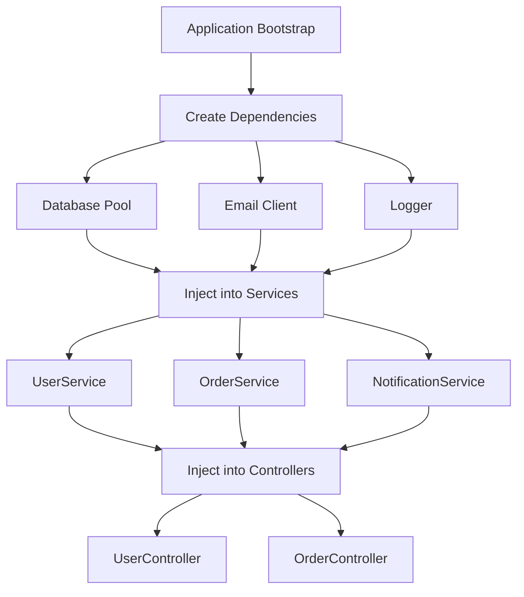

# How to Implement Dependency Injection in Node.js

Author: [nawazdhandala](https://github.com/nawazdhandala)

Tags: NodeJS, Dependency Injection, Architecture, Testing, TypeScript

Description: Learn how to implement dependency injection in Node.js applications to build testable, maintainable code. This guide covers manual DI patterns, containers, and practical examples with Express and TypeScript.

---

Dependency injection is one of those patterns that separates hobby projects from production-ready applications. When you hardcode database connections, API clients, and services directly into your code, you end up with tightly coupled modules that are difficult to test and even harder to maintain. Dependency injection flips this around - instead of creating dependencies inside your modules, you pass them in from the outside.

In this guide, we will build dependency injection patterns in Node.js from scratch, starting with simple manual injection and working up to using a DI container. By the end, you will have the tools to write cleaner, more testable code.

## Why Dependency Injection Matters

Before diving into implementation, let's see what problem we are solving. Here is a typical tightly coupled service:

```javascript
// services/userService.js - The wrong way
const mysql = require('mysql2/promise');
const axios = require('axios');

class UserService {
  constructor() {
    // Direct dependency creation - hard to test
    this.db = mysql.createPool({
      host: 'localhost',
      user: 'root',
      database: 'myapp'
    });
    this.emailClient = axios.create({
      baseURL: 'https://api.sendgrid.com'
    });
  }

  async createUser(userData) {
    const [result] = await this.db.execute(
      'INSERT INTO users (email, name) VALUES (?, ?)',
      [userData.email, userData.name]
    );

    await this.emailClient.post('/v3/mail/send', {
      to: userData.email,
      subject: 'Welcome!'
    });

    return { id: result.insertId, ...userData };
  }
}
```

Testing this is painful. You cannot swap out the database or email client without modifying the class itself. Your tests would hit a real database and send actual emails.

With dependency injection, the same service becomes testable:

```javascript
// services/userService.js - The right way
class UserService {
  constructor(database, emailClient) {
    // Dependencies passed in from outside
    this.db = database;
    this.emailClient = emailClient;
  }

  async createUser(userData) {
    const [result] = await this.db.execute(
      'INSERT INTO users (email, name) VALUES (?, ?)',
      [userData.email, userData.name]
    );

    await this.emailClient.sendEmail({
      to: userData.email,
      subject: 'Welcome!'
    });

    return { id: result.insertId, ...userData };
  }
}

module.exports = UserService;
```

Now in tests, you can inject mock dependencies:

```javascript
// tests/userService.test.js
const UserService = require('../services/userService');

describe('UserService', () => {
  it('should create user and send welcome email', async () => {
    // Create mock dependencies
    const mockDb = {
      execute: jest.fn().mockResolvedValue([{ insertId: 1 }])
    };
    const mockEmailClient = {
      sendEmail: jest.fn().mockResolvedValue(true)
    };

    // Inject mocks
    const userService = new UserService(mockDb, mockEmailClient);

    const result = await userService.createUser({
      email: 'test@example.com',
      name: 'Test User'
    });

    expect(result.id).toBe(1);
    expect(mockDb.execute).toHaveBeenCalledWith(
      'INSERT INTO users (email, name) VALUES (?, ?)',
      ['test@example.com', 'Test User']
    );
    expect(mockEmailClient.sendEmail).toHaveBeenCalledWith({
      to: 'test@example.com',
      subject: 'Welcome!'
    });
  });
});
```

## The Dependency Injection Flow

Here is how dependency injection works in a typical application:



## Manual Dependency Injection

Let's build a complete example with manual dependency injection. This approach works well for small to medium applications.

### Setting Up the Project Structure

```
src/
  config/
    index.js
  services/
    database.js
    emailClient.js
    userService.js
    orderService.js
  controllers/
    userController.js
  middleware/
    errorHandler.js
  container.js      # Our DI composition root
  app.js
```

### Creating the Dependencies

First, create the low-level services that other parts of the app will depend on:

```javascript
// src/services/database.js
const mysql = require('mysql2/promise');

// Factory function that creates a database pool
function createDatabase(config) {
  const pool = mysql.createPool({
    host: config.host,
    user: config.user,
    password: config.password,
    database: config.database,
    waitForConnections: true,
    connectionLimit: 10
  });

  return {
    // Wrap pool methods for easier mocking
    async query(sql, params) {
      const [rows] = await pool.execute(sql, params);
      return rows;
    },

    async execute(sql, params) {
      return pool.execute(sql, params);
    },

    async transaction(callback) {
      const connection = await pool.getConnection();
      await connection.beginTransaction();

      try {
        const result = await callback(connection);
        await connection.commit();
        return result;
      } catch (error) {
        await connection.rollback();
        throw error;
      } finally {
        connection.release();
      }
    },

    async close() {
      await pool.end();
    }
  };
}

module.exports = { createDatabase };
```

```javascript
// src/services/emailClient.js
const nodemailer = require('nodemailer');

function createEmailClient(config) {
  const transporter = nodemailer.createTransport({
    host: config.smtpHost,
    port: config.smtpPort,
    secure: config.smtpSecure,
    auth: {
      user: config.smtpUser,
      pass: config.smtpPass
    }
  });

  return {
    async sendEmail({ to, subject, html, text }) {
      const info = await transporter.sendMail({
        from: config.fromEmail,
        to,
        subject,
        html,
        text
      });
      return info.messageId;
    },

    async verifyConnection() {
      return transporter.verify();
    }
  };
}

module.exports = { createEmailClient };
```

### Creating Services with Injected Dependencies

```javascript
// src/services/userService.js
class UserService {
  constructor({ database, emailClient, logger }) {
    this.db = database;
    this.emailClient = emailClient;
    this.logger = logger;
  }

  async findById(id) {
    const users = await this.db.query(
      'SELECT id, email, name, created_at FROM users WHERE id = ?',
      [id]
    );
    return users[0] || null;
  }

  async findByEmail(email) {
    const users = await this.db.query(
      'SELECT id, email, name, created_at FROM users WHERE email = ?',
      [email]
    );
    return users[0] || null;
  }

  async create(userData) {
    this.logger.info('Creating user', { email: userData.email });

    // Check if user already exists
    const existing = await this.findByEmail(userData.email);
    if (existing) {
      throw new Error('User with this email already exists');
    }

    const [result] = await this.db.execute(
      'INSERT INTO users (email, name, password_hash) VALUES (?, ?, ?)',
      [userData.email, userData.name, userData.passwordHash]
    );

    const userId = result.insertId;

    // Send welcome email
    try {
      await this.emailClient.sendEmail({
        to: userData.email,
        subject: 'Welcome to Our App!',
        html: `<h1>Welcome ${userData.name}!</h1><p>We're excited to have you.</p>`
      });
    } catch (error) {
      // Log but don't fail user creation if email fails
      this.logger.error('Failed to send welcome email', {
        userId,
        error: error.message
      });
    }

    this.logger.info('User created successfully', { userId });
    return this.findById(userId);
  }

  async update(id, updates) {
    const fields = [];
    const values = [];

    if (updates.name) {
      fields.push('name = ?');
      values.push(updates.name);
    }
    if (updates.email) {
      fields.push('email = ?');
      values.push(updates.email);
    }

    if (fields.length === 0) {
      return this.findById(id);
    }

    values.push(id);
    await this.db.execute(
      `UPDATE users SET ${fields.join(', ')} WHERE id = ?`,
      values
    );

    return this.findById(id);
  }

  async delete(id) {
    await this.db.execute('DELETE FROM users WHERE id = ?', [id]);
    this.logger.info('User deleted', { userId: id });
  }
}

module.exports = UserService;
```

### The Composition Root

The composition root is where all dependencies are created and wired together. This is the only place in your application that knows about the concrete implementations:

```javascript
// src/container.js
const config = require('./config');
const { createDatabase } = require('./services/database');
const { createEmailClient } = require('./services/emailClient');
const UserService = require('./services/userService');
const OrderService = require('./services/orderService');

// Simple logger implementation
const logger = {
  info: (message, meta = {}) => {
    console.log(JSON.stringify({ level: 'info', message, ...meta, timestamp: new Date().toISOString() }));
  },
  error: (message, meta = {}) => {
    console.error(JSON.stringify({ level: 'error', message, ...meta, timestamp: new Date().toISOString() }));
  },
  warn: (message, meta = {}) => {
    console.warn(JSON.stringify({ level: 'warn', message, ...meta, timestamp: new Date().toISOString() }));
  }
};

// Container that holds all our dependencies
let container = null;

async function createContainer() {
  // Create low-level dependencies first
  const database = createDatabase({
    host: config.db.host,
    user: config.db.user,
    password: config.db.password,
    database: config.db.name
  });

  const emailClient = createEmailClient({
    smtpHost: config.email.host,
    smtpPort: config.email.port,
    smtpSecure: config.email.secure,
    smtpUser: config.email.user,
    smtpPass: config.email.pass,
    fromEmail: config.email.from
  });

  // Create services with their dependencies
  const userService = new UserService({ database, emailClient, logger });
  const orderService = new OrderService({ database, userService, logger });

  container = {
    // Low-level dependencies
    database,
    emailClient,
    logger,

    // Services
    userService,
    orderService,

    // Cleanup function for graceful shutdown
    async close() {
      logger.info('Closing container resources');
      await database.close();
    }
  };

  return container;
}

function getContainer() {
  if (!container) {
    throw new Error('Container not initialized. Call createContainer() first.');
  }
  return container;
}

module.exports = { createContainer, getContainer };
```

### Using the Container in Express

```javascript
// src/app.js
const express = require('express');
const { createContainer, getContainer } = require('./container');

async function createApp() {
  // Initialize the DI container
  await createContainer();
  const container = getContainer();

  const app = express();
  app.use(express.json());

  // Make container available to routes via middleware
  app.use((req, res, next) => {
    req.container = container;
    next();
  });

  // Routes
  app.post('/users', async (req, res, next) => {
    try {
      const { userService } = req.container;
      const user = await userService.create(req.body);
      res.status(201).json(user);
    } catch (error) {
      next(error);
    }
  });

  app.get('/users/:id', async (req, res, next) => {
    try {
      const { userService } = req.container;
      const user = await userService.findById(req.params.id);

      if (!user) {
        return res.status(404).json({ error: 'User not found' });
      }

      res.json(user);
    } catch (error) {
      next(error);
    }
  });

  // Error handling middleware
  app.use((error, req, res, next) => {
    container.logger.error('Request error', {
      error: error.message,
      stack: error.stack
    });
    res.status(500).json({ error: 'Internal server error' });
  });

  return app;
}

module.exports = { createApp };
```

## Using a DI Container Library

For larger applications, manual wiring becomes tedious. Libraries like `awilix` or `tsyringe` (for TypeScript) can automate dependency resolution.

### Using Awilix

```javascript
// src/container.js with Awilix
const awilix = require('awilix');
const config = require('./config');
const { createDatabase } = require('./services/database');
const { createEmailClient } = require('./services/emailClient');
const UserService = require('./services/userService');
const OrderService = require('./services/orderService');
const createLogger = require('./services/logger');

function createContainer() {
  const container = awilix.createContainer({
    injectionMode: awilix.InjectionMode.PROXY
  });

  // Register dependencies
  container.register({
    // Configuration
    config: awilix.asValue(config),

    // Infrastructure
    logger: awilix.asFunction(createLogger).singleton(),
    database: awilix.asFunction(({ config }) =>
      createDatabase(config.db)
    ).singleton(),
    emailClient: awilix.asFunction(({ config }) =>
      createEmailClient(config.email)
    ).singleton(),

    // Services - use asClass for automatic constructor injection
    userService: awilix.asClass(UserService).singleton(),
    orderService: awilix.asClass(OrderService).singleton()
  });

  return container;
}

module.exports = { createContainer };
```

With Awilix, services automatically receive their dependencies based on constructor parameter names:

```javascript
// src/services/userService.js - Works with Awilix
class UserService {
  // Awilix will inject database, emailClient, and logger
  // by matching parameter names to registered dependencies
  constructor({ database, emailClient, logger }) {
    this.db = database;
    this.emailClient = emailClient;
    this.logger = logger;
  }

  // ... methods
}
```

### Express Integration with Awilix

```javascript
// src/app.js with Awilix
const express = require('express');
const { scopePerRequest } = require('awilix-express');
const { createContainer } = require('./container');

function createApp() {
  const container = createContainer();
  const app = express();

  app.use(express.json());

  // Create a scoped container per request
  // This allows request-scoped dependencies
  app.use(scopePerRequest(container));

  // Routes can now access container via req.container
  app.post('/users', async (req, res, next) => {
    try {
      const userService = req.container.resolve('userService');
      const user = await userService.create(req.body);
      res.status(201).json(user);
    } catch (error) {
      next(error);
    }
  });

  return app;
}
```

## TypeScript and Dependency Injection

TypeScript makes DI even better with interfaces and decorators. Here is an example using `tsyringe`:

```typescript
// src/interfaces/IUserService.ts
export interface IUserService {
  findById(id: number): Promise<User | null>;
  create(userData: CreateUserDto): Promise<User>;
  update(id: number, updates: UpdateUserDto): Promise<User>;
  delete(id: number): Promise<void>;
}

// src/interfaces/IDatabase.ts
export interface IDatabase {
  query<T>(sql: string, params?: any[]): Promise<T[]>;
  execute(sql: string, params?: any[]): Promise<[any, any]>;
  transaction<T>(callback: (conn: any) => Promise<T>): Promise<T>;
  close(): Promise<void>;
}

// src/interfaces/IEmailClient.ts
export interface IEmailClient {
  sendEmail(options: EmailOptions): Promise<string>;
}
```

```typescript
// src/services/userService.ts
import { injectable, inject } from 'tsyringe';
import { IUserService } from '../interfaces/IUserService';
import { IDatabase } from '../interfaces/IDatabase';
import { IEmailClient } from '../interfaces/IEmailClient';
import { ILogger } from '../interfaces/ILogger';

@injectable()
export class UserService implements IUserService {
  constructor(
    @inject('Database') private db: IDatabase,
    @inject('EmailClient') private emailClient: IEmailClient,
    @inject('Logger') private logger: ILogger
  ) {}

  async findById(id: number): Promise<User | null> {
    const users = await this.db.query<User>(
      'SELECT * FROM users WHERE id = ?',
      [id]
    );
    return users[0] || null;
  }

  async create(userData: CreateUserDto): Promise<User> {
    this.logger.info('Creating user', { email: userData.email });

    const [result] = await this.db.execute(
      'INSERT INTO users (email, name) VALUES (?, ?)',
      [userData.email, userData.name]
    );

    await this.emailClient.sendEmail({
      to: userData.email,
      subject: 'Welcome!',
      html: `<h1>Welcome ${userData.name}!</h1>`
    });

    return this.findById(result.insertId);
  }

  // ... other methods
}
```

```typescript
// src/container.ts
import 'reflect-metadata';
import { container } from 'tsyringe';
import { UserService } from './services/userService';
import { createDatabase } from './services/database';
import { createEmailClient } from './services/emailClient';
import { createLogger } from './services/logger';
import config from './config';

// Register dependencies
container.register('Config', { useValue: config });
container.register('Logger', { useValue: createLogger() });
container.register('Database', { useValue: createDatabase(config.db) });
container.register('EmailClient', { useValue: createEmailClient(config.email) });

// Register services
container.register('UserService', { useClass: UserService });

export { container };
```

## Testing with Dependency Injection

One of the biggest benefits of DI is testability. Here is a complete test example:

```javascript
// tests/userService.test.js
const UserService = require('../src/services/userService');

describe('UserService', () => {
  let userService;
  let mockDb;
  let mockEmailClient;
  let mockLogger;

  beforeEach(() => {
    // Create fresh mocks for each test
    mockDb = {
      query: jest.fn(),
      execute: jest.fn()
    };

    mockEmailClient = {
      sendEmail: jest.fn()
    };

    mockLogger = {
      info: jest.fn(),
      error: jest.fn(),
      warn: jest.fn()
    };

    // Inject mocks
    userService = new UserService({
      database: mockDb,
      emailClient: mockEmailClient,
      logger: mockLogger
    });
  });

  describe('create', () => {
    it('should create user and send welcome email', async () => {
      // Arrange
      mockDb.query.mockResolvedValue([]); // No existing user
      mockDb.execute.mockResolvedValue([{ insertId: 42 }]);
      mockDb.query.mockResolvedValueOnce([]).mockResolvedValueOnce([{
        id: 42,
        email: 'test@example.com',
        name: 'Test User'
      }]);
      mockEmailClient.sendEmail.mockResolvedValue('message-id');

      // Act
      const result = await userService.create({
        email: 'test@example.com',
        name: 'Test User',
        passwordHash: 'hashed'
      });

      // Assert
      expect(result.id).toBe(42);
      expect(mockEmailClient.sendEmail).toHaveBeenCalledWith({
        to: 'test@example.com',
        subject: 'Welcome to Our App!',
        html: expect.stringContaining('Test User')
      });
      expect(mockLogger.info).toHaveBeenCalledWith(
        'User created successfully',
        { userId: 42 }
      );
    });

    it('should still create user if email sending fails', async () => {
      // Arrange
      mockDb.query.mockResolvedValue([]);
      mockDb.execute.mockResolvedValue([{ insertId: 42 }]);
      mockDb.query
        .mockResolvedValueOnce([])
        .mockResolvedValueOnce([{ id: 42, email: 'test@example.com', name: 'Test' }]);
      mockEmailClient.sendEmail.mockRejectedValue(new Error('SMTP error'));

      // Act
      const result = await userService.create({
        email: 'test@example.com',
        name: 'Test',
        passwordHash: 'hashed'
      });

      // Assert
      expect(result.id).toBe(42);
      expect(mockLogger.error).toHaveBeenCalledWith(
        'Failed to send welcome email',
        expect.objectContaining({ userId: 42 })
      );
    });

    it('should throw if user already exists', async () => {
      // Arrange
      mockDb.query.mockResolvedValue([{ id: 1, email: 'test@example.com' }]);

      // Act and Assert
      await expect(userService.create({
        email: 'test@example.com',
        name: 'Test',
        passwordHash: 'hashed'
      })).rejects.toThrow('User with this email already exists');
    });
  });
});
```

## Best Practices

Here are some guidelines that will help you get the most out of dependency injection:

### 1. Depend on Abstractions, Not Implementations

When possible, define interfaces for your dependencies. This makes it easy to swap implementations.

### 2. Keep the Composition Root Separate

All the wiring should happen in one place - your composition root. The rest of your code should not know or care about how dependencies are created.

### 3. Prefer Constructor Injection

Constructor injection makes dependencies explicit and ensures objects are fully initialized when created:

```javascript
// Good - dependencies are clear
class UserService {
  constructor({ database, emailClient, logger }) {
    this.db = database;
    this.emailClient = emailClient;
    this.logger = logger;
  }
}

// Avoid - hidden dependencies
class UserService {
  setDatabase(db) { this.db = db; }
  setEmailClient(client) { this.emailClient = client; }
}
```

### 4. Avoid Service Locator Pattern

Injecting the entire container and resolving dependencies inside your class is an anti-pattern:

```javascript
// Bad - service locator
class UserService {
  constructor(container) {
    this.db = container.resolve('database');
    this.email = container.resolve('emailClient');
  }
}

// Good - explicit dependencies
class UserService {
  constructor({ database, emailClient }) {
    this.db = database;
    this.emailClient = emailClient;
  }
}
```

### 5. Use Factory Functions for Complex Setup

When a dependency needs complex initialization, wrap it in a factory function:

```javascript
// Factory function handles complex setup
function createPaymentProcessor(config, logger) {
  const stripe = new Stripe(config.stripeKey);

  return {
    async charge(amount, token) {
      logger.info('Processing payment', { amount });
      return stripe.charges.create({ amount, source: token });
    }
  };
}
```

## Summary

| Pattern | Best For | Complexity |
|---------|----------|------------|
| Manual DI | Small apps, learning | Low |
| Awilix | Medium to large JS apps | Medium |
| tsyringe | TypeScript applications | Medium |
| Custom container | Specific requirements | High |

Dependency injection is not about frameworks or libraries - it is about structuring your code so that modules receive their dependencies rather than creating them. Start with manual injection to understand the pattern, then consider a container as your application grows.

The extra effort of setting up DI pays off quickly. Your code becomes easier to test, easier to change, and easier for other developers to understand. When you need to swap out a database driver, add logging to a service, or mock an external API in tests, you will appreciate having dependencies injected rather than hardcoded.

Build the habit of asking "where does this dependency come from?" every time you reach for `require()` or `import`. If the answer is "I create it right here," consider whether passing it in would make your code more flexible.
