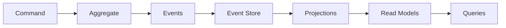

# How to Build Event Sourcing Systems in Node.js

Author: [nawazdhandala](https://github.com/nawazdhandala)

Tags: Node.js, Event Sourcing, TypeScript, CQRS, Architecture, Backend, Design Patterns

Description: Learn how to build event sourcing systems in Node.js from scratch. This guide covers event stores, aggregates, projections, snapshots, and CQRS patterns with practical TypeScript examples.

---

Event sourcing is an architectural pattern where you store every state change as an immutable event instead of just the current state. This gives you a complete audit trail, the ability to replay events to rebuild state, and a foundation for building complex domain-driven applications.

In this guide, we will build an event sourcing system from scratch in Node.js using TypeScript. We will cover all the core components: events, event stores, aggregates, projections, snapshots, and the CQRS pattern. By the end, you will have a working implementation you can adapt for your own projects.

## Why Event Sourcing?

Traditional CRUD applications store only the current state. When you update a user's email, the old value is lost. Event sourcing takes a different approach - instead of storing "email is john@new.com", you store "user changed email from john@old.com to john@new.com".

This gives you several benefits:

1. **Complete audit trail** - Every change is recorded with timestamp and context
2. **Temporal queries** - Query the state of your system at any point in time
3. **Event replay** - Rebuild state or fix bugs by replaying events
4. **Better debugging** - Understand exactly how the system reached its current state
5. **Scalability** - Pairs naturally with CQRS for read/write optimization
6. **Domain alignment** - Events capture business intent, not just data changes

## Core Concepts

Before diving into code, let's understand the key components:



- **Event** - An immutable record of something that happened
- **Event Store** - Storage optimized for appending and retrieving events
- **Aggregate** - A domain object that enforces business rules and emits events
- **Projection** - A read-optimized view built by processing events
- **Command** - An intent to change state
- **Query** - A request to read data from projections

## Setting Up the Project

Let's start with a new TypeScript project.

```bash
# Create project directory
mkdir event-sourcing-nodejs
cd event-sourcing-nodejs

# Initialize npm and install dependencies
npm init -y
npm install uuid
npm install -D typescript @types/node @types/uuid ts-node

# Initialize TypeScript
npx tsc --init
```

Configure TypeScript for modern Node.js in `tsconfig.json`:

```json
{
  "compilerOptions": {
    "target": "ES2022",
    "module": "commonjs",
    "lib": ["ES2022"],
    "outDir": "./dist",
    "rootDir": "./src",
    "strict": true,
    "esModuleInterop": true,
    "skipLibCheck": true,
    "forceConsistentCasingInFileNames": true,
    "resolveJsonModule": true,
    "declaration": true
  },
  "include": ["src/**/*"],
  "exclude": ["node_modules", "dist"]
}
```

## Defining the Event Interface

Events are the foundation of event sourcing. Every event needs an identifier, type, timestamp, and the aggregate it belongs to.

```typescript
// src/core/event.ts
import { v4 as uuidv4 } from 'uuid';

// Base interface that all events must implement
export interface DomainEvent {
  eventId: string;          // Unique identifier for this event
  aggregateId: string;      // Which aggregate this event belongs to
  eventType: string;        // The type of event (e.g., "OrderCreated")
  timestamp: Date;          // When the event occurred
  version: number;          // Position in the aggregate's event stream
  payload: unknown;         // Event-specific data
  metadata?: EventMetadata; // Optional context about the event
}

// Metadata provides context about why and how the event occurred
export interface EventMetadata {
  correlationId?: string;   // Links related events across services
  causationId?: string;     // The event that caused this one
  userId?: string;          // Who triggered this event
}

// Factory function to create events with defaults
export function createEvent<T>(
  aggregateId: string,
  eventType: string,
  payload: T,
  metadata?: EventMetadata
): DomainEvent {
  return {
    eventId: uuidv4(),
    aggregateId,
    eventType,
    timestamp: new Date(),
    version: 0, // Will be set by the event store
    payload,
    metadata,
  };
}
```

## Building the Event Store

The event store is responsible for persisting events and loading them back. It must support optimistic concurrency to prevent conflicting updates.

```typescript
// src/core/event-store.ts
import { DomainEvent } from './event';

// Errors specific to event store operations
export class ConcurrencyError extends Error {
  constructor(aggregateId: string, expected: number, actual: number) {
    super(
      `Concurrency conflict for aggregate ${aggregateId}: ` +
      `expected version ${expected}, but found ${actual}`
    );
    this.name = 'ConcurrencyError';
  }
}

export class AggregateNotFoundError extends Error {
  constructor(aggregateId: string) {
    super(`Aggregate not found: ${aggregateId}`);
    this.name = 'AggregateNotFoundError';
  }
}

// Interface for event store implementations
export interface EventStore {
  // Append new events with optimistic concurrency control
  append(
    aggregateId: string,
    events: DomainEvent[],
    expectedVersion: number
  ): Promise<void>;

  // Load all events for an aggregate
  load(aggregateId: string): Promise<DomainEvent[]>;

  // Load events starting from a specific version (for snapshots)
  loadFromVersion(
    aggregateId: string,
    fromVersion: number
  ): Promise<DomainEvent[]>;

  // Load all events across all aggregates (for projections)
  loadAll(fromPosition?: number): Promise<DomainEvent[]>;
}

// In-memory implementation for development and testing
export class InMemoryEventStore implements EventStore {
  // Events organized by aggregate ID
  private streams: Map<string, DomainEvent[]> = new Map();
  // Global event log for projections
  private globalStream: DomainEvent[] = [];

  async append(
    aggregateId: string,
    events: DomainEvent[],
    expectedVersion: number
  ): Promise<void> {
    const stream = this.streams.get(aggregateId) || [];
    const currentVersion = stream.length;

    // Optimistic concurrency check
    // If another process added events since we loaded, reject the write
    if (currentVersion !== expectedVersion) {
      throw new ConcurrencyError(aggregateId, expectedVersion, currentVersion);
    }

    // Assign version numbers to each event
    const versionedEvents = events.map((event, index) => ({
      ...event,
      version: currentVersion + index + 1,
    }));

    // Append to aggregate stream
    this.streams.set(aggregateId, [...stream, ...versionedEvents]);

    // Append to global stream for projections
    this.globalStream.push(...versionedEvents);
  }

  async load(aggregateId: string): Promise<DomainEvent[]> {
    const stream = this.streams.get(aggregateId);
    if (!stream || stream.length === 0) {
      return [];
    }
    // Return a copy to prevent external modification
    return [...stream];
  }

  async loadFromVersion(
    aggregateId: string,
    fromVersion: number
  ): Promise<DomainEvent[]> {
    const stream = this.streams.get(aggregateId);
    if (!stream) {
      return [];
    }
    // Return events after the specified version
    return stream.filter(e => e.version > fromVersion);
  }

  async loadAll(fromPosition: number = 0): Promise<DomainEvent[]> {
    return this.globalStream.slice(fromPosition);
  }

  // Helper to get current version of an aggregate
  async getVersion(aggregateId: string): Promise<number> {
    const stream = this.streams.get(aggregateId);
    return stream ? stream.length : 0;
  }
}
```

## Creating the Aggregate Base Class

Aggregates are domain objects that enforce business rules and emit events. They maintain state by applying events and track uncommitted changes.

```typescript
// src/core/aggregate.ts
import { DomainEvent, createEvent, EventMetadata } from './event';

// Base class for all aggregates
export abstract class AggregateRoot {
  private _id: string;
  private _version: number = 0;
  private _uncommittedEvents: DomainEvent[] = [];

  constructor(id: string) {
    this._id = id;
  }

  get id(): string {
    return this._id;
  }

  get version(): number {
    return this._version;
  }

  // Get events that have not been persisted yet
  getUncommittedEvents(): DomainEvent[] {
    return [...this._uncommittedEvents];
  }

  // Clear uncommitted events after they are saved
  clearUncommittedEvents(): void {
    this._uncommittedEvents = [];
  }

  // Apply an event and track it as uncommitted
  protected addEvent<T>(
    eventType: string,
    payload: T,
    metadata?: EventMetadata
  ): void {
    const event = createEvent(this._id, eventType, payload, metadata);
    this.applyEvent(event);
    this._uncommittedEvents.push(event);
  }

  // Load aggregate state from event history
  loadFromHistory(events: DomainEvent[]): void {
    for (const event of events) {
      this.applyEvent(event);
      this._version = event.version;
    }
  }

  // Apply a single event to update state
  private applyEvent(event: DomainEvent): void {
    // Call the appropriate handler based on event type
    this.apply(event);
    this._version++;
  }

  // Subclasses must implement this to handle specific event types
  protected abstract apply(event: DomainEvent): void;
}
```

## Building a Domain Example: Shopping Cart

Let's build a shopping cart aggregate to see how event sourcing works in practice.

```typescript
// src/domain/cart/events.ts

// Event types as constants for type safety
export const CartEventTypes = {
  CART_CREATED: 'CartCreated',
  ITEM_ADDED: 'ItemAdded',
  ITEM_REMOVED: 'ItemRemoved',
  ITEM_QUANTITY_CHANGED: 'ItemQuantityChanged',
  CART_CHECKED_OUT: 'CartCheckedOut',
} as const;

// Payload types for each event
export interface CartCreatedPayload {
  customerId: string;
}

export interface ItemAddedPayload {
  productId: string;
  productName: string;
  quantity: number;
  unitPrice: number;
}

export interface ItemRemovedPayload {
  productId: string;
}

export interface ItemQuantityChangedPayload {
  productId: string;
  newQuantity: number;
}

export interface CartCheckedOutPayload {
  orderId: string;
  totalAmount: number;
  checkedOutAt: Date;
}
```

Now the aggregate implementation:

```typescript
// src/domain/cart/cart.ts
import { AggregateRoot } from '../../core/aggregate';
import { DomainEvent, EventMetadata } from '../../core/event';
import {
  CartEventTypes,
  CartCreatedPayload,
  ItemAddedPayload,
  ItemRemovedPayload,
  ItemQuantityChangedPayload,
  CartCheckedOutPayload,
} from './events';

// Cart item representation
interface CartItem {
  productId: string;
  productName: string;
  quantity: number;
  unitPrice: number;
}

// Cart status
type CartStatus = 'active' | 'checked_out';

export class ShoppingCart extends AggregateRoot {
  private customerId: string = '';
  private items: Map<string, CartItem> = new Map();
  private status: CartStatus = 'active';

  // Factory method to create a new cart
  static create(
    cartId: string,
    customerId: string,
    metadata?: EventMetadata
  ): ShoppingCart {
    const cart = new ShoppingCart(cartId);

    // Emit creation event
    const payload: CartCreatedPayload = { customerId };
    cart.addEvent(CartEventTypes.CART_CREATED, payload, metadata);

    return cart;
  }

  // Reconstruct cart from event history
  static fromEvents(cartId: string, events: DomainEvent[]): ShoppingCart {
    const cart = new ShoppingCart(cartId);
    cart.loadFromHistory(events);
    return cart;
  }

  // Command: Add an item to the cart
  addItem(
    productId: string,
    productName: string,
    quantity: number,
    unitPrice: number,
    metadata?: EventMetadata
  ): void {
    // Enforce business rules
    if (this.status !== 'active') {
      throw new Error('Cannot modify a checked out cart');
    }

    if (quantity <= 0) {
      throw new Error('Quantity must be positive');
    }

    if (unitPrice < 0) {
      throw new Error('Price cannot be negative');
    }

    // Check if item already exists
    const existingItem = this.items.get(productId);
    if (existingItem) {
      // If item exists, update quantity instead
      this.changeItemQuantity(
        productId,
        existingItem.quantity + quantity,
        metadata
      );
      return;
    }

    // Emit event for new item
    const payload: ItemAddedPayload = {
      productId,
      productName,
      quantity,
      unitPrice,
    };
    this.addEvent(CartEventTypes.ITEM_ADDED, payload, metadata);
  }

  // Command: Remove an item from the cart
  removeItem(productId: string, metadata?: EventMetadata): void {
    if (this.status !== 'active') {
      throw new Error('Cannot modify a checked out cart');
    }

    if (!this.items.has(productId)) {
      throw new Error(`Item ${productId} not found in cart`);
    }

    const payload: ItemRemovedPayload = { productId };
    this.addEvent(CartEventTypes.ITEM_REMOVED, payload, metadata);
  }

  // Command: Change quantity of an item
  changeItemQuantity(
    productId: string,
    newQuantity: number,
    metadata?: EventMetadata
  ): void {
    if (this.status !== 'active') {
      throw new Error('Cannot modify a checked out cart');
    }

    if (!this.items.has(productId)) {
      throw new Error(`Item ${productId} not found in cart`);
    }

    if (newQuantity <= 0) {
      // Remove item if quantity is zero or negative
      this.removeItem(productId, metadata);
      return;
    }

    const payload: ItemQuantityChangedPayload = { productId, newQuantity };
    this.addEvent(CartEventTypes.ITEM_QUANTITY_CHANGED, payload, metadata);
  }

  // Command: Check out the cart
  checkout(orderId: string, metadata?: EventMetadata): void {
    if (this.status !== 'active') {
      throw new Error('Cart is already checked out');
    }

    if (this.items.size === 0) {
      throw new Error('Cannot checkout an empty cart');
    }

    const payload: CartCheckedOutPayload = {
      orderId,
      totalAmount: this.calculateTotal(),
      checkedOutAt: new Date(),
    };
    this.addEvent(CartEventTypes.CART_CHECKED_OUT, payload, metadata);
  }

  // Calculate total cart value
  calculateTotal(): number {
    let total = 0;
    for (const item of this.items.values()) {
      total += item.quantity * item.unitPrice;
    }
    return Math.round(total * 100) / 100; // Round to 2 decimal places
  }

  // Get cart items as array
  getItems(): CartItem[] {
    return Array.from(this.items.values());
  }

  // Get cart status
  getStatus(): CartStatus {
    return this.status;
  }

  // Apply events to update state
  // This is called for both new events and when replaying history
  protected apply(event: DomainEvent): void {
    switch (event.eventType) {
      case CartEventTypes.CART_CREATED: {
        const payload = event.payload as CartCreatedPayload;
        this.customerId = payload.customerId;
        this.status = 'active';
        break;
      }

      case CartEventTypes.ITEM_ADDED: {
        const payload = event.payload as ItemAddedPayload;
        this.items.set(payload.productId, {
          productId: payload.productId,
          productName: payload.productName,
          quantity: payload.quantity,
          unitPrice: payload.unitPrice,
        });
        break;
      }

      case CartEventTypes.ITEM_REMOVED: {
        const payload = event.payload as ItemRemovedPayload;
        this.items.delete(payload.productId);
        break;
      }

      case CartEventTypes.ITEM_QUANTITY_CHANGED: {
        const payload = event.payload as ItemQuantityChangedPayload;
        const item = this.items.get(payload.productId);
        if (item) {
          item.quantity = payload.newQuantity;
        }
        break;
      }

      case CartEventTypes.CART_CHECKED_OUT: {
        this.status = 'checked_out';
        break;
      }
    }
  }
}
```

## Creating the Repository

The repository provides a clean interface for loading and saving aggregates.

```typescript
// src/core/repository.ts
import { AggregateRoot } from './aggregate';
import { EventStore, ConcurrencyError } from './event-store';
import { DomainEvent } from './event';

// Generic repository interface
export interface Repository<T extends AggregateRoot> {
  load(id: string): Promise<T | null>;
  save(aggregate: T): Promise<void>;
}

// Shopping cart repository implementation
import { ShoppingCart } from '../domain/cart/cart';

export class ShoppingCartRepository implements Repository<ShoppingCart> {
  constructor(private eventStore: EventStore) {}

  async load(cartId: string): Promise<ShoppingCart | null> {
    const events = await this.eventStore.load(cartId);

    if (events.length === 0) {
      return null;
    }

    return ShoppingCart.fromEvents(cartId, events);
  }

  async save(cart: ShoppingCart): Promise<void> {
    const uncommittedEvents = cart.getUncommittedEvents();

    if (uncommittedEvents.length === 0) {
      return; // Nothing to save
    }

    // Calculate expected version
    // Current version minus uncommitted events gives us the version before changes
    const expectedVersion = cart.version - uncommittedEvents.length;

    try {
      await this.eventStore.append(cart.id, uncommittedEvents, expectedVersion);
      cart.clearUncommittedEvents();
    } catch (error) {
      if (error instanceof ConcurrencyError) {
        // Handle concurrency conflict
        // In production, you might want to reload and retry
        throw error;
      }
      throw error;
    }
  }
}
```

## Building Projections for Read Models

Projections process events to build read-optimized views. They run asynchronously and can be rebuilt from scratch at any time.

```typescript
// src/projections/cart-summary.ts
import { DomainEvent } from '../core/event';
import {
  CartEventTypes,
  CartCreatedPayload,
  ItemAddedPayload,
  ItemRemovedPayload,
  ItemQuantityChangedPayload,
  CartCheckedOutPayload,
} from '../domain/cart/events';

// Read model optimized for cart queries
export interface CartSummary {
  cartId: string;
  customerId: string;
  itemCount: number;
  totalAmount: number;
  status: 'active' | 'checked_out';
  lastUpdated: Date;
}

// Projection handler interface
export interface Projection {
  handle(event: DomainEvent): Promise<void>;
  reset(): Promise<void>;
}

// Cart summary projection
export class CartSummaryProjection implements Projection {
  // In production, use a database instead of in-memory storage
  private summaries: Map<string, CartSummary> = new Map();
  private itemPrices: Map<string, Map<string, { quantity: number; price: number }>> = new Map();

  async handle(event: DomainEvent): Promise<void> {
    switch (event.eventType) {
      case CartEventTypes.CART_CREATED: {
        const payload = event.payload as CartCreatedPayload;
        this.summaries.set(event.aggregateId, {
          cartId: event.aggregateId,
          customerId: payload.customerId,
          itemCount: 0,
          totalAmount: 0,
          status: 'active',
          lastUpdated: event.timestamp,
        });
        this.itemPrices.set(event.aggregateId, new Map());
        break;
      }

      case CartEventTypes.ITEM_ADDED: {
        const payload = event.payload as ItemAddedPayload;
        const summary = this.summaries.get(event.aggregateId);
        const prices = this.itemPrices.get(event.aggregateId);

        if (summary && prices) {
          prices.set(payload.productId, {
            quantity: payload.quantity,
            price: payload.unitPrice,
          });
          this.recalculateSummary(summary, prices, event.timestamp);
        }
        break;
      }

      case CartEventTypes.ITEM_REMOVED: {
        const payload = event.payload as ItemRemovedPayload;
        const summary = this.summaries.get(event.aggregateId);
        const prices = this.itemPrices.get(event.aggregateId);

        if (summary && prices) {
          prices.delete(payload.productId);
          this.recalculateSummary(summary, prices, event.timestamp);
        }
        break;
      }

      case CartEventTypes.ITEM_QUANTITY_CHANGED: {
        const payload = event.payload as ItemQuantityChangedPayload;
        const summary = this.summaries.get(event.aggregateId);
        const prices = this.itemPrices.get(event.aggregateId);

        if (summary && prices) {
          const item = prices.get(payload.productId);
          if (item) {
            item.quantity = payload.newQuantity;
            this.recalculateSummary(summary, prices, event.timestamp);
          }
        }
        break;
      }

      case CartEventTypes.CART_CHECKED_OUT: {
        const summary = this.summaries.get(event.aggregateId);
        if (summary) {
          summary.status = 'checked_out';
          summary.lastUpdated = event.timestamp;
        }
        break;
      }
    }
  }

  private recalculateSummary(
    summary: CartSummary,
    prices: Map<string, { quantity: number; price: number }>,
    timestamp: Date
  ): void {
    let total = 0;
    let count = 0;

    for (const item of prices.values()) {
      total += item.quantity * item.price;
      count += item.quantity;
    }

    summary.totalAmount = Math.round(total * 100) / 100;
    summary.itemCount = count;
    summary.lastUpdated = timestamp;
  }

  async reset(): Promise<void> {
    this.summaries.clear();
    this.itemPrices.clear();
  }

  // Query methods
  getCart(cartId: string): CartSummary | undefined {
    return this.summaries.get(cartId);
  }

  getCartsByCustomer(customerId: string): CartSummary[] {
    return Array.from(this.summaries.values())
      .filter(s => s.customerId === customerId);
  }

  getActiveCarts(): CartSummary[] {
    return Array.from(this.summaries.values())
      .filter(s => s.status === 'active');
  }
}
```

## Projection Runner

The projection runner subscribes to the event store and keeps projections up to date.

```typescript
// src/projections/runner.ts
import { EventStore } from '../core/event-store';
import { Projection } from './cart-summary';

export class ProjectionRunner {
  private position: number = 0;
  private running: boolean = false;

  constructor(
    private eventStore: EventStore,
    private projections: Projection[]
  ) {}

  // Process all events from the beginning
  async catchUp(): Promise<void> {
    const events = await this.eventStore.loadAll(this.position);

    for (const event of events) {
      for (const projection of this.projections) {
        await projection.handle(event);
      }
      this.position++;
    }
  }

  // Rebuild all projections from scratch
  async rebuild(): Promise<void> {
    // Reset all projections
    for (const projection of this.projections) {
      await projection.reset();
    }

    // Reset position and catch up
    this.position = 0;
    await this.catchUp();
  }

  // Start continuous processing (for real-time updates)
  async start(pollIntervalMs: number = 100): Promise<void> {
    this.running = true;

    while (this.running) {
      await this.catchUp();
      await this.sleep(pollIntervalMs);
    }
  }

  stop(): void {
    this.running = false;
  }

  private sleep(ms: number): Promise<void> {
    return new Promise(resolve => setTimeout(resolve, ms));
  }
}
```

## Implementing Snapshots

For aggregates with many events, loading becomes slow. Snapshots capture state at a point in time to speed up loading.

```typescript
// src/core/snapshot.ts

export interface Snapshot {
  aggregateId: string;
  version: number;
  state: unknown;
  createdAt: Date;
}

export interface SnapshotStore {
  save(snapshot: Snapshot): Promise<void>;
  load(aggregateId: string): Promise<Snapshot | null>;
}

// In-memory snapshot store
export class InMemorySnapshotStore implements SnapshotStore {
  private snapshots: Map<string, Snapshot> = new Map();

  async save(snapshot: Snapshot): Promise<void> {
    this.snapshots.set(snapshot.aggregateId, snapshot);
  }

  async load(aggregateId: string): Promise<Snapshot | null> {
    return this.snapshots.get(aggregateId) || null;
  }
}
```

Now update the cart to support snapshots:

```typescript
// src/domain/cart/cart-snapshot.ts
import { Snapshot } from '../../core/snapshot';
import { ShoppingCart } from './cart';

interface CartSnapshotState {
  customerId: string;
  items: Array<{
    productId: string;
    productName: string;
    quantity: number;
    unitPrice: number;
  }>;
  status: 'active' | 'checked_out';
}

// Create a snapshot from a cart
export function createCartSnapshot(cart: ShoppingCart): Snapshot {
  const state: CartSnapshotState = {
    customerId: (cart as any).customerId,
    items: cart.getItems(),
    status: cart.getStatus(),
  };

  return {
    aggregateId: cart.id,
    version: cart.version,
    state,
    createdAt: new Date(),
  };
}

// Restore cart state from a snapshot
export function applyCartSnapshot(cart: ShoppingCart, snapshot: Snapshot): void {
  const state = snapshot.state as CartSnapshotState;

  // Access private fields (in production, use proper encapsulation)
  (cart as any).customerId = state.customerId;
  (cart as any).status = state.status;
  (cart as any)._version = snapshot.version;

  const items = (cart as any).items as Map<string, any>;
  items.clear();

  for (const item of state.items) {
    items.set(item.productId, { ...item });
  }
}
```

Repository with snapshot support:

```typescript
// src/core/repository-with-snapshots.ts
import { EventStore } from './event-store';
import { SnapshotStore, Snapshot } from './snapshot';
import { ShoppingCart } from '../domain/cart/cart';
import { createCartSnapshot, applyCartSnapshot } from '../domain/cart/cart-snapshot';

export class SnapshotShoppingCartRepository {
  private snapshotFrequency: number;

  constructor(
    private eventStore: EventStore,
    private snapshotStore: SnapshotStore,
    snapshotFrequency: number = 10 // Take snapshot every N events
  ) {
    this.snapshotFrequency = snapshotFrequency;
  }

  async load(cartId: string): Promise<ShoppingCart | null> {
    // Try to load from snapshot first
    const snapshot = await this.snapshotStore.load(cartId);

    let cart: ShoppingCart;
    let fromVersion = 0;

    if (snapshot) {
      // Start from snapshot
      cart = new (ShoppingCart as any)(cartId);
      applyCartSnapshot(cart, snapshot);
      fromVersion = snapshot.version;
    } else {
      cart = new (ShoppingCart as any)(cartId);
    }

    // Load events after the snapshot
    const events = await this.eventStore.loadFromVersion(cartId, fromVersion);

    if (events.length === 0 && !snapshot) {
      return null; // Cart does not exist
    }

    // Apply remaining events
    cart.loadFromHistory(events);

    return cart;
  }

  async save(cart: ShoppingCart): Promise<void> {
    const uncommittedEvents = cart.getUncommittedEvents();

    if (uncommittedEvents.length === 0) {
      return;
    }

    const expectedVersion = cart.version - uncommittedEvents.length;

    await this.eventStore.append(cart.id, uncommittedEvents, expectedVersion);
    cart.clearUncommittedEvents();

    // Check if we should take a snapshot
    if (cart.version % this.snapshotFrequency === 0) {
      const snapshot = createCartSnapshot(cart);
      await this.snapshotStore.save(snapshot);
    }
  }
}
```

## Putting It All Together

Here is a complete example that demonstrates all the components working together.

```typescript
// src/main.ts
import { v4 as uuidv4 } from 'uuid';
import { InMemoryEventStore } from './core/event-store';
import { InMemorySnapshotStore } from './core/snapshot';
import { ShoppingCart } from './domain/cart/cart';
import { SnapshotShoppingCartRepository } from './core/repository-with-snapshots';
import { CartSummaryProjection } from './projections/cart-summary';
import { ProjectionRunner } from './projections/runner';

async function main() {
  // Initialize stores
  const eventStore = new InMemoryEventStore();
  const snapshotStore = new InMemorySnapshotStore();

  // Create repository with snapshot support
  const cartRepository = new SnapshotShoppingCartRepository(
    eventStore,
    snapshotStore,
    5 // Snapshot every 5 events
  );

  // Initialize projections
  const cartSummaryProjection = new CartSummaryProjection();
  const projectionRunner = new ProjectionRunner(eventStore, [cartSummaryProjection]);

  // Generate IDs
  const cartId = uuidv4();
  const customerId = 'customer-123';

  console.log('--- Creating Shopping Cart ---');

  // Create a new cart
  const cart = ShoppingCart.create(cartId, customerId, {
    correlationId: uuidv4(),
    userId: 'user-456',
  });

  // Add some items
  cart.addItem('prod-1', 'Mechanical Keyboard', 1, 149.99);
  cart.addItem('prod-2', 'USB-C Cable', 3, 12.99);
  cart.addItem('prod-3', 'Mouse Pad', 1, 24.99);

  // Save the cart
  await cartRepository.save(cart);

  console.log(`Created cart ${cartId}`);
  console.log(`Items: ${cart.getItems().length}`);
  console.log(`Total: $${cart.calculateTotal()}`);

  // Update projection
  await projectionRunner.catchUp();

  // Query from read model
  const summary = cartSummaryProjection.getCart(cartId);
  console.log('\n--- Read Model Summary ---');
  console.log(`Item count: ${summary?.itemCount}`);
  console.log(`Total amount: $${summary?.totalAmount}`);

  // Modify the cart
  console.log('\n--- Modifying Cart ---');

  // Reload from store to simulate different request
  const reloadedCart = await cartRepository.load(cartId);
  if (!reloadedCart) {
    throw new Error('Cart not found');
  }

  reloadedCart.changeItemQuantity('prod-2', 5);
  reloadedCart.removeItem('prod-3');

  await cartRepository.save(reloadedCart);

  console.log(`Updated total: $${reloadedCart.calculateTotal()}`);

  // Update projection again
  await projectionRunner.catchUp();

  const updatedSummary = cartSummaryProjection.getCart(cartId);
  console.log(`Updated read model total: $${updatedSummary?.totalAmount}`);

  // View event history
  console.log('\n--- Event History ---');
  const events = await eventStore.load(cartId);
  events.forEach((event, index) => {
    console.log(`${index + 1}. ${event.eventType} (v${event.version})`);
  });

  // Checkout
  console.log('\n--- Checkout ---');
  const finalCart = await cartRepository.load(cartId);
  if (finalCart) {
    const orderId = uuidv4();
    finalCart.checkout(orderId);
    await cartRepository.save(finalCart);

    await projectionRunner.catchUp();

    const finalSummary = cartSummaryProjection.getCart(cartId);
    console.log(`Status: ${finalSummary?.status}`);
    console.log(`Final total: $${finalSummary?.totalAmount}`);
  }
}

main().catch(console.error);
```

Run with:

```bash
npx ts-node src/main.ts
```

## Best Practices

When building event sourcing systems, keep these guidelines in mind:

### Event Design

- Name events in past tense (CartCreated, not CreateCart)
- Include all necessary context in the payload
- Keep events focused and small
- Avoid breaking changes - use event versioning instead

### Aggregate Design

- Keep aggregates small and focused on one consistency boundary
- Validate all business rules before emitting events
- Never query external services inside aggregates

### Performance Considerations

- Use snapshots for aggregates with many events
- Consider event caching for frequently accessed aggregates
- Run projections asynchronously to avoid blocking writes

### Production Considerations

- Use a durable event store like PostgreSQL or EventStoreDB
- Implement event versioning and migration strategies
- Monitor projection lag in real-time
- Plan for event store backups and disaster recovery

## Conclusion

Event sourcing provides a solid foundation for applications that need complete audit trails, temporal queries, and complex domain logic. The pattern requires more initial setup than traditional CRUD, but the benefits become clear as your system grows in complexity.

The implementation we built covers all the core components: events, event stores, aggregates, repositories, projections, and snapshots. While we used in-memory storage for simplicity, the interfaces are designed to be easily swapped for production databases.

Start simple with one aggregate and expand as you learn the patterns. The key is to keep events immutable, aggregates focused on business rules, and projections optimized for their specific queries.

---

*Building event-sourced applications? [OneUptime](https://oneuptime.com) helps you monitor your event processing pipelines and catch issues before they affect users. Track event store latency, projection lag, and aggregate health in real-time.*
