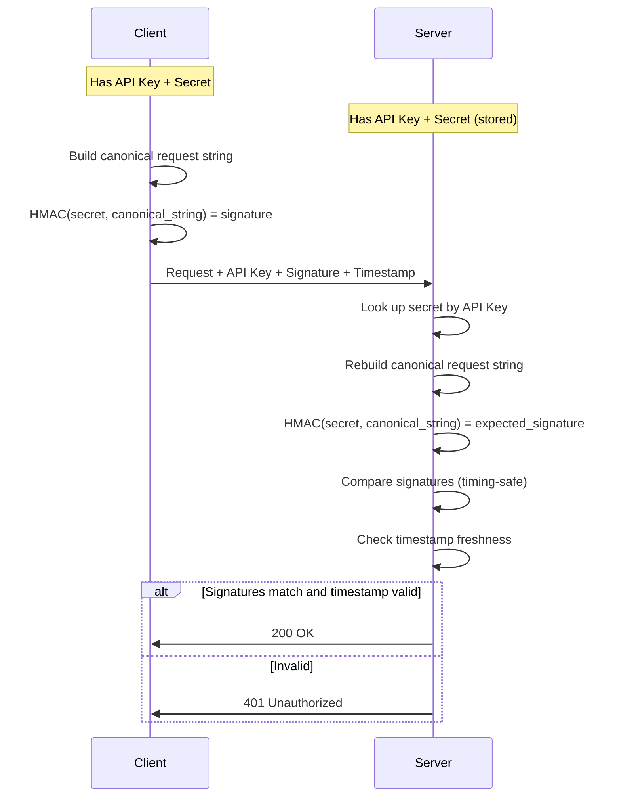

# How to Secure APIs with HMAC Signing in Node.js

Author: [nawazdhandala](https://www.github.com/nawazdhandala)

Tags: NodeJS, Security, HMAC, API, Authentication, Backend

Description: Learn how to implement HMAC request signing for secure API authentication in Node.js, including signature generation, verification, replay attack prevention, and middleware integration.

---

API keys alone provide weak security. Anyone who intercepts a request can extract the key and impersonate the client. HMAC (Hash-based Message Authentication Code) signing solves this by creating a unique signature for each request using a secret key that never travels over the network.

Major platforms like AWS, Stripe, and GitHub use HMAC signing for their APIs. This guide shows you how to implement it properly in Node.js, covering both client and server sides.

## How HMAC Signing Works

The client creates a signature by hashing the request details (method, path, body, timestamp) with a secret key. The server recreates the same hash using its copy of the secret. If the signatures match, the request is authentic.



## Basic HMAC Implementation

Start with a simple signing function that hashes the request components:

```typescript
// hmac-signer.ts
import crypto from 'crypto';

interface SignatureComponents {
  method: string;
  path: string;
  timestamp: string;
  body?: string;
}

// Create HMAC signature from request components
export function createSignature(
  secret: string,
  components: SignatureComponents
): string {
  // Build canonical string with consistent ordering
  // This ensures client and server produce the same hash
  const canonicalParts = [
    components.method.toUpperCase(),
    components.path,
    components.timestamp,
  ];

  // Include body hash if present (handles large payloads efficiently)
  if (components.body) {
    const bodyHash = crypto
      .createHash('sha256')
      .update(components.body)
      .digest('hex');
    canonicalParts.push(bodyHash);
  }

  const canonicalString = canonicalParts.join('\n');

  // Generate HMAC using SHA-256
  const signature = crypto
    .createHmac('sha256', secret)
    .update(canonicalString)
    .digest('hex');

  return signature;
}

// Verify signature using timing-safe comparison
// Regular string comparison leaks timing information
export function verifySignature(
  secret: string,
  components: SignatureComponents,
  providedSignature: string
): boolean {
  const expectedSignature = createSignature(secret, components);

  // Convert to buffers for timing-safe comparison
  const expected = Buffer.from(expectedSignature, 'hex');
  const provided = Buffer.from(providedSignature, 'hex');

  // Length must match before comparison
  if (expected.length !== provided.length) {
    return false;
  }

  return crypto.timingSafeEqual(expected, provided);
}
```

## Client-Side Request Signing

The client signs every request before sending. Here is a complete signing client:

```typescript
// hmac-client.ts
import crypto from 'crypto';

interface HmacClientConfig {
  apiKey: string;
  apiSecret: string;
  baseUrl: string;
}

interface RequestOptions {
  method: 'GET' | 'POST' | 'PUT' | 'DELETE' | 'PATCH';
  path: string;
  body?: object;
  headers?: Record<string, string>;
}

class HmacApiClient {
  private config: HmacClientConfig;

  constructor(config: HmacClientConfig) {
    this.config = config;
  }

  private createCanonicalString(
    method: string,
    path: string,
    timestamp: string,
    bodyHash: string
  ): string {
    // Order matters - must match server implementation exactly
    return [
      method.toUpperCase(),
      path,
      timestamp,
      bodyHash,
    ].join('\n');
  }

  private sign(canonicalString: string): string {
    return crypto
      .createHmac('sha256', this.config.apiSecret)
      .update(canonicalString)
      .digest('hex');
  }

  async request<T>(options: RequestOptions): Promise<T> {
    const timestamp = Date.now().toString();
    const bodyString = options.body ? JSON.stringify(options.body) : '';

    // Hash the body (empty string produces consistent hash for GET requests)
    const bodyHash = crypto
      .createHash('sha256')
      .update(bodyString)
      .digest('hex');

    // Create canonical string for signing
    const canonicalString = this.createCanonicalString(
      options.method,
      options.path,
      timestamp,
      bodyHash
    );

    const signature = this.sign(canonicalString);

    // Build request headers
    const headers: Record<string, string> = {
      'Content-Type': 'application/json',
      'X-API-Key': this.config.apiKey,
      'X-Timestamp': timestamp,
      'X-Signature': signature,
      ...options.headers,
    };

    const response = await fetch(`${this.config.baseUrl}${options.path}`, {
      method: options.method,
      headers,
      body: bodyString || undefined,
    });

    if (!response.ok) {
      const error = await response.text();
      throw new Error(`API error ${response.status}: ${error}`);
    }

    return response.json();
  }

  // Convenience methods
  async get<T>(path: string): Promise<T> {
    return this.request({ method: 'GET', path });
  }

  async post<T>(path: string, body: object): Promise<T> {
    return this.request({ method: 'POST', path, body });
  }

  async put<T>(path: string, body: object): Promise<T> {
    return this.request({ method: 'PUT', path, body });
  }

  async delete<T>(path: string): Promise<T> {
    return this.request({ method: 'DELETE', path });
  }
}

// Usage
const client = new HmacApiClient({
  apiKey: 'your-api-key',
  apiSecret: 'your-secret-key',
  baseUrl: 'https://api.example.com',
});

const users = await client.get('/users');
const newUser = await client.post('/users', { name: 'John', email: 'john@example.com' });
```

## Server-Side Verification Middleware

The server middleware extracts the signature components, regenerates the expected signature, and compares them:

```typescript
// hmac-middleware.ts
import { Request, Response, NextFunction } from 'express';
import crypto from 'crypto';

interface ApiCredential {
  apiKey: string;
  apiSecret: string;
  clientName: string;
  permissions: string[];
}

// In production, load from database
const credentials: Map<string, ApiCredential> = new Map([
  ['test-api-key', {
    apiKey: 'test-api-key',
    apiSecret: 'super-secret-key-12345',
    clientName: 'Test Client',
    permissions: ['read', 'write'],
  }],
]);

interface HmacMiddlewareConfig {
  timestampTolerance: number;  // Max age in milliseconds
  requiredHeaders: string[];
}

const defaultConfig: HmacMiddlewareConfig = {
  timestampTolerance: 5 * 60 * 1000,  // 5 minutes
  requiredHeaders: ['x-api-key', 'x-timestamp', 'x-signature'],
};

export function hmacAuthMiddleware(config: Partial<HmacMiddlewareConfig> = {}) {
  const finalConfig = { ...defaultConfig, ...config };

  return async (req: Request, res: Response, next: NextFunction) => {
    try {
      // Check required headers
      for (const header of finalConfig.requiredHeaders) {
        if (!req.headers[header]) {
          return res.status(401).json({
            error: 'Missing required header',
            header,
          });
        }
      }

      const apiKey = req.headers['x-api-key'] as string;
      const timestamp = req.headers['x-timestamp'] as string;
      const providedSignature = req.headers['x-signature'] as string;

      // Look up credentials
      const cred = credentials.get(apiKey);
      if (!cred) {
        return res.status(401).json({ error: 'Invalid API key' });
      }

      // Check timestamp to prevent replay attacks
      const requestTime = parseInt(timestamp, 10);
      const now = Date.now();

      if (isNaN(requestTime)) {
        return res.status(401).json({ error: 'Invalid timestamp format' });
      }

      if (Math.abs(now - requestTime) > finalConfig.timestampTolerance) {
        return res.status(401).json({
          error: 'Request timestamp too old or too far in future',
          serverTime: now,
          requestTime,
          toleranceMs: finalConfig.timestampTolerance,
        });
      }

      // Get raw body for signature verification
      // Note: This requires express.raw() or similar middleware
      const bodyString = req.body ? JSON.stringify(req.body) : '';
      const bodyHash = crypto
        .createHash('sha256')
        .update(bodyString)
        .digest('hex');

      // Rebuild canonical string
      const canonicalString = [
        req.method.toUpperCase(),
        req.path,
        timestamp,
        bodyHash,
      ].join('\n');

      // Generate expected signature
      const expectedSignature = crypto
        .createHmac('sha256', cred.apiSecret)
        .update(canonicalString)
        .digest('hex');

      // Timing-safe comparison
      const expected = Buffer.from(expectedSignature, 'hex');
      const provided = Buffer.from(providedSignature, 'hex');

      if (expected.length !== provided.length) {
        return res.status(401).json({ error: 'Invalid signature' });
      }

      if (!crypto.timingSafeEqual(expected, provided)) {
        return res.status(401).json({ error: 'Invalid signature' });
      }

      // Attach client info to request for later use
      (req as any).apiClient = {
        apiKey: cred.apiKey,
        clientName: cred.clientName,
        permissions: cred.permissions,
      };

      next();
    } catch (error) {
      console.error('HMAC verification error:', error);
      return res.status(500).json({ error: 'Authentication error' });
    }
  };
}
```

## Preventing Replay Attacks

Timestamps help, but a determined attacker could replay requests within the tolerance window. Add nonce tracking to prevent any request from being used twice:

```typescript
// nonce-store.ts

interface NonceEntry {
  timestamp: number;
  used: boolean;
}

class NonceStore {
  private nonces: Map<string, NonceEntry> = new Map();
  private cleanupInterval: NodeJS.Timeout;
  private maxAge: number;

  constructor(maxAgeMs: number = 5 * 60 * 1000) {
    this.maxAge = maxAgeMs;

    // Clean up expired nonces periodically
    this.cleanupInterval = setInterval(
      () => this.cleanup(),
      60 * 1000  // Every minute
    );
  }

  // Check if nonce is valid and mark as used
  useNonce(nonce: string): boolean {
    // Check if already used
    if (this.nonces.has(nonce)) {
      return false;
    }

    // Mark as used
    this.nonces.set(nonce, {
      timestamp: Date.now(),
      used: true,
    });

    return true;
  }

  private cleanup() {
    const cutoff = Date.now() - this.maxAge;

    for (const [nonce, entry] of this.nonces.entries()) {
      if (entry.timestamp < cutoff) {
        this.nonces.delete(nonce);
      }
    }
  }

  stop() {
    clearInterval(this.cleanupInterval);
  }
}

// Enhanced middleware with nonce support
export function hmacAuthWithNonce(nonceStore: NonceStore) {
  return async (req: Request, res: Response, next: NextFunction) => {
    const nonce = req.headers['x-nonce'] as string;

    if (!nonce) {
      return res.status(401).json({ error: 'Missing nonce header' });
    }

    // Check nonce has not been used
    if (!nonceStore.useNonce(nonce)) {
      return res.status(401).json({ error: 'Nonce already used (replay attack detected)' });
    }

    // Include nonce in canonical string for signing
    // ... rest of verification logic

    next();
  };
}
```

Update the client to include a unique nonce:

```typescript
// In HmacApiClient.request()
const nonce = crypto.randomUUID();

const canonicalString = [
  method,
  path,
  timestamp,
  nonce,
  bodyHash,
].join('\n');

const headers = {
  // ... other headers
  'X-Nonce': nonce,
};
```

## Complete Express Application

Here is a full working example with all the pieces together:

```typescript
// app.ts
import express from 'express';
import crypto from 'crypto';

const app = express();

// Parse JSON bodies
app.use(express.json());

// Store for API credentials (use database in production)
const apiCredentials = new Map<string, { secret: string; name: string }>();
apiCredentials.set('demo-key', { secret: 'demo-secret-12345', name: 'Demo Client' });

// Nonce tracking for replay prevention
const usedNonces = new Map<string, number>();

// Clean up old nonces every minute
setInterval(() => {
  const fiveMinutesAgo = Date.now() - 5 * 60 * 1000;
  for (const [nonce, timestamp] of usedNonces.entries()) {
    if (timestamp < fiveMinutesAgo) {
      usedNonces.delete(nonce);
    }
  }
}, 60 * 1000);

// HMAC verification middleware
function verifyHmac(req: express.Request, res: express.Response, next: express.NextFunction) {
  const apiKey = req.headers['x-api-key'] as string;
  const timestamp = req.headers['x-timestamp'] as string;
  const nonce = req.headers['x-nonce'] as string;
  const signature = req.headers['x-signature'] as string;

  // Validate required headers
  if (!apiKey || !timestamp || !nonce || !signature) {
    return res.status(401).json({ error: 'Missing authentication headers' });
  }

  // Look up credentials
  const cred = apiCredentials.get(apiKey);
  if (!cred) {
    return res.status(401).json({ error: 'Invalid API key' });
  }

  // Check timestamp (5 minute window)
  const requestTime = parseInt(timestamp, 10);
  if (isNaN(requestTime) || Math.abs(Date.now() - requestTime) > 5 * 60 * 1000) {
    return res.status(401).json({ error: 'Invalid or expired timestamp' });
  }

  // Check nonce for replay attack
  if (usedNonces.has(nonce)) {
    return res.status(401).json({ error: 'Duplicate nonce - possible replay attack' });
  }
  usedNonces.set(nonce, Date.now());

  // Hash request body
  const bodyString = JSON.stringify(req.body) || '';
  const bodyHash = crypto.createHash('sha256').update(bodyString).digest('hex');

  // Build canonical string
  const canonical = [
    req.method.toUpperCase(),
    req.path,
    timestamp,
    nonce,
    bodyHash,
  ].join('\n');

  // Calculate expected signature
  const expected = crypto
    .createHmac('sha256', cred.secret)
    .update(canonical)
    .digest('hex');

  // Timing-safe comparison
  const expectedBuf = Buffer.from(expected, 'hex');
  const signatureBuf = Buffer.from(signature, 'hex');

  if (expectedBuf.length !== signatureBuf.length ||
      !crypto.timingSafeEqual(expectedBuf, signatureBuf)) {
    return res.status(401).json({ error: 'Invalid signature' });
  }

  // Attach client info to request
  (req as any).client = { apiKey, name: cred.name };
  next();
}

// Public endpoint (no auth)
app.get('/health', (req, res) => {
  res.json({ status: 'ok' });
});

// Protected endpoints
app.use('/api', verifyHmac);

app.get('/api/users', (req, res) => {
  res.json({
    users: [{ id: 1, name: 'Alice' }, { id: 2, name: 'Bob' }],
    requestedBy: (req as any).client.name,
  });
});

app.post('/api/users', (req, res) => {
  const { name, email } = req.body;
  res.status(201).json({
    id: 3,
    name,
    email,
    createdBy: (req as any).client.name,
  });
});

app.listen(3000, () => {
  console.log('Server running on port 3000');
});
```

## Testing Your Implementation

Here is how to test HMAC signing manually:

```typescript
// test-client.ts
import crypto from 'crypto';

const API_KEY = 'demo-key';
const API_SECRET = 'demo-secret-12345';
const BASE_URL = 'http://localhost:3000';

async function testRequest() {
  const method = 'POST';
  const path = '/api/users';
  const body = { name: 'Test User', email: 'test@example.com' };
  const bodyString = JSON.stringify(body);

  const timestamp = Date.now().toString();
  const nonce = crypto.randomUUID();

  const bodyHash = crypto.createHash('sha256').update(bodyString).digest('hex');

  const canonical = [method, path, timestamp, nonce, bodyHash].join('\n');

  const signature = crypto
    .createHmac('sha256', API_SECRET)
    .update(canonical)
    .digest('hex');

  console.log('Request details:');
  console.log('  Canonical string:', canonical.replace(/\n/g, '\\n'));
  console.log('  Signature:', signature);

  const response = await fetch(`${BASE_URL}${path}`, {
    method,
    headers: {
      'Content-Type': 'application/json',
      'X-API-Key': API_KEY,
      'X-Timestamp': timestamp,
      'X-Nonce': nonce,
      'X-Signature': signature,
    },
    body: bodyString,
  });

  console.log('Response status:', response.status);
  console.log('Response body:', await response.json());
}

testRequest().catch(console.error);
```

## Summary

HMAC signing provides strong API authentication by proving the client knows the secret without transmitting it. Key implementation points:

| Component | Purpose |
|-----------|---------|
| Canonical string | Consistent ordering of request elements |
| Body hash | Handles large payloads efficiently |
| Timestamp | Prevents replay of old requests |
| Nonce | Prevents replay within time window |
| Timing-safe comparison | Prevents timing attacks |

This approach is battle-tested by companies like AWS and Stripe. The extra complexity over simple API keys pays off with significantly stronger security, especially for APIs handling sensitive operations.
