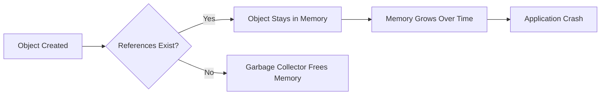
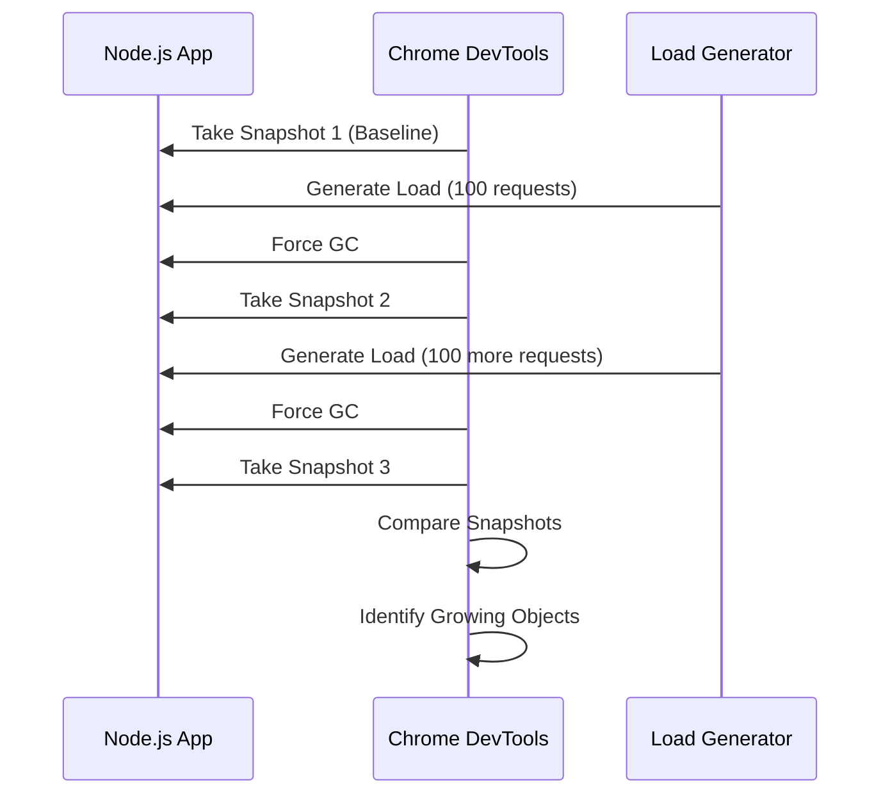
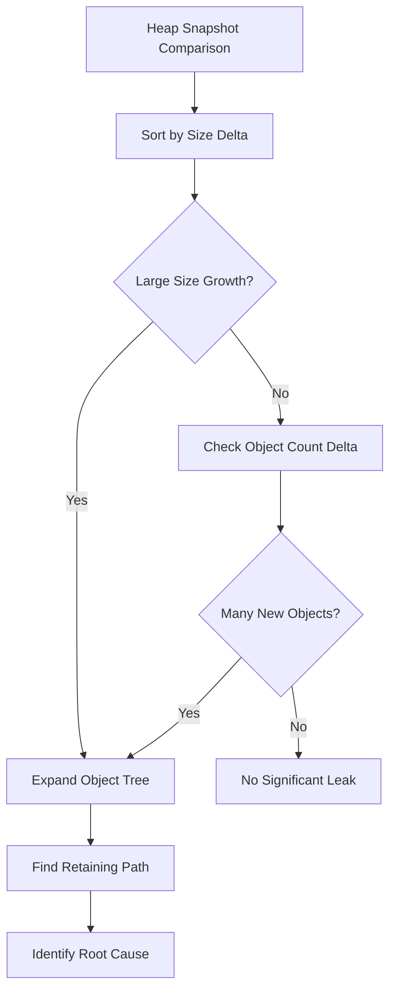
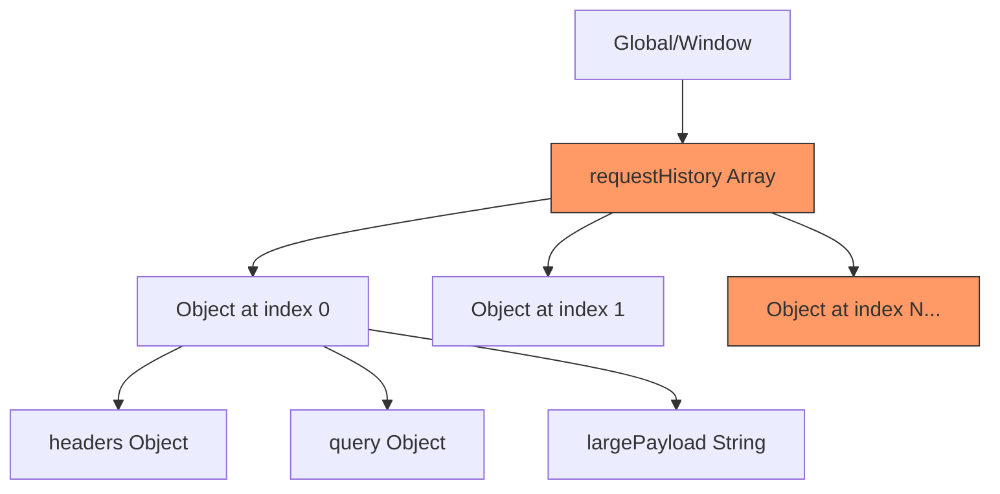
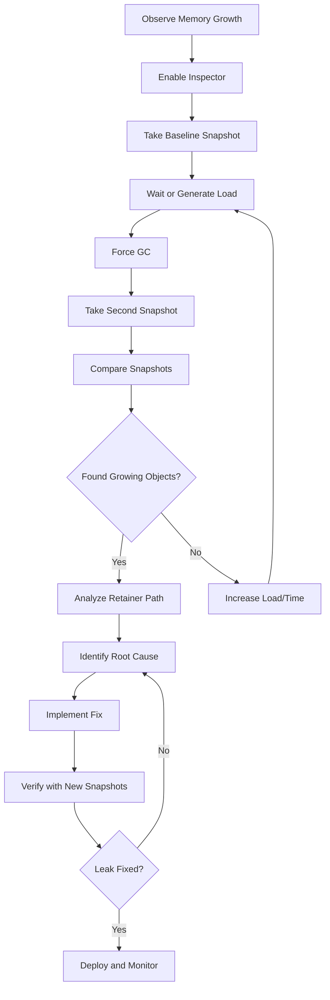

# How to Profile Node.js Applications for Memory Leaks

Author: [nawazdhandala](https://www.github.com/nawazdhandala)

Tags: Node.js, Memory Leaks, Profiling, Heap Snapshots, Chrome DevTools, Performance, Debugging

Description: A hands-on guide to profiling Node.js applications for memory leaks using heap snapshots, allocation timelines, and systematic comparison techniques.

---

Memory leaks in Node.js applications can be subtle and frustrating. Your server runs fine for hours, then suddenly starts slowing down, consuming more memory until it crashes or gets killed by the OS. This guide walks you through practical profiling techniques to find and fix these leaks before they become production incidents.

## Understanding Memory Leaks in Node.js

A memory leak occurs when your application allocates memory but never releases it back to the system. In Node.js, the V8 garbage collector handles memory management automatically, but it can only free memory that's no longer referenced. If your code maintains references to objects that are no longer needed, those objects stay in memory forever.



Common sources of memory leaks include:

- Event listeners that are never removed
- Closures that capture large objects
- Global variables accumulating data
- Caches without size limits or eviction policies
- Timers and intervals that hold references

## Setting Up Your Profiling Environment

Before diving into profiling, let's set up a simple Express application with an intentional memory leak that we'll use throughout this guide.

```javascript
// server.js - Example application with a memory leak
const express = require('express');
const app = express();

// This array will grow indefinitely - a classic memory leak
const requestHistory = [];

app.get('/api/data', (req, res) => {
    // Store entire request object - this is the leak
    requestHistory.push({
        timestamp: Date.now(),
        headers: req.headers,
        query: req.query,
        // In real apps, this might be user data, session info, etc.
        largePayload: Buffer.alloc(1024).fill('x').toString()
    });

    res.json({
        message: 'Data processed',
        historySize: requestHistory.length
    });
});

app.get('/api/stats', (req, res) => {
    // Return current memory usage
    const memUsage = process.memoryUsage();
    res.json({
        heapUsed: Math.round(memUsage.heapUsed / 1024 / 1024) + ' MB',
        heapTotal: Math.round(memUsage.heapTotal / 1024 / 1024) + ' MB',
        external: Math.round(memUsage.external / 1024 / 1024) + ' MB',
        requestCount: requestHistory.length
    });
});

const PORT = 3000;
app.listen(PORT, () => {
    console.log(`Server running on port ${PORT}`);
    console.log(`Inspect with: node --inspect server.js`);
});
```

## Method 1: Using Chrome DevTools with Node.js Inspector

The most powerful way to profile memory leaks is using Chrome DevTools connected to your Node.js process.

### Starting the Inspector

Launch your application with the `--inspect` flag:

```bash
# Start with inspector enabled
node --inspect server.js

# Or attach to a running process
kill -USR1 <PID>  # Enables inspector on running Node process
```

You'll see output like:

```
Debugger listening on ws://127.0.0.1:9229/abc-123-def
For help, see: https://nodejs.org/en/docs/inspector
```

### Connecting Chrome DevTools

1. Open Chrome and navigate to `chrome://inspect`
2. Click "Open dedicated DevTools for Node"
3. Select the "Memory" tab

### Taking Heap Snapshots

Heap snapshots capture the entire memory state of your application at a specific moment. The key technique for finding leaks is comparing multiple snapshots over time.



Here's a script to generate load for testing:

```javascript
// load-test.js - Generate requests to trigger the leak
const http = require('http');

async function makeRequest() {
    return new Promise((resolve, reject) => {
        const req = http.get('http://localhost:3000/api/data', (res) => {
            let data = '';
            res.on('data', chunk => data += chunk);
            res.on('end', () => resolve(JSON.parse(data)));
        });
        req.on('error', reject);
    });
}

async function runLoadTest(requestCount) {
    console.log(`Making ${requestCount} requests...`);

    for (let i = 0; i < requestCount; i++) {
        await makeRequest();

        // Log progress every 100 requests
        if ((i + 1) % 100 === 0) {
            console.log(`Completed ${i + 1} requests`);
        }
    }

    // Check memory stats
    const statsRes = await new Promise((resolve) => {
        http.get('http://localhost:3000/api/stats', (res) => {
            let data = '';
            res.on('data', chunk => data += chunk);
            res.on('end', () => resolve(JSON.parse(data)));
        });
    });

    console.log('Memory stats:', statsRes);
}

// Run the load test
runLoadTest(500).then(() => console.log('Load test complete'));
```

### Analyzing the Comparison View

When comparing snapshots in DevTools:

1. Take Snapshot 1 (baseline after app starts)
2. Run your load test
3. Click the trash can icon to force garbage collection
4. Take Snapshot 2
5. Run more load
6. Force GC again
7. Take Snapshot 3
8. Select Snapshot 3 and change view to "Comparison" with Snapshot 1

Look for objects where:
- **Delta** (change in count) is positive and growing
- **Size Delta** shows significant memory increase
- Objects appear repeatedly with each snapshot



## Method 2: Programmatic Heap Snapshots

For production environments, you can capture heap snapshots programmatically:

```javascript
// heap-snapshot.js - Capture heap snapshots from code
const v8 = require('v8');
const fs = require('fs');
const path = require('path');

function captureHeapSnapshot(filename) {
    // Create snapshots directory if it doesn't exist
    const snapshotDir = path.join(__dirname, 'snapshots');
    if (!fs.existsSync(snapshotDir)) {
        fs.mkdirSync(snapshotDir, { recursive: true });
    }

    const snapshotPath = path.join(snapshotDir, filename);

    // Write heap snapshot to file
    const snapshotStream = v8.writeHeapSnapshot(snapshotPath);

    console.log(`Heap snapshot written to: ${snapshotStream}`);
    return snapshotStream;
}

// Expose endpoint to trigger snapshots
function addSnapshotEndpoint(app) {
    app.get('/debug/heap-snapshot', (req, res) => {
        try {
            // Force garbage collection first (requires --expose-gc flag)
            if (global.gc) {
                global.gc();
            }

            const timestamp = new Date().toISOString().replace(/[:.]/g, '-');
            const filename = `heap-${timestamp}.heapsnapshot`;
            const snapshotPath = captureHeapSnapshot(filename);

            res.json({
                success: true,
                path: snapshotPath,
                memoryUsage: process.memoryUsage()
            });
        } catch (error) {
            res.status(500).json({
                success: false,
                error: error.message
            });
        }
    });
}

module.exports = { captureHeapSnapshot, addSnapshotEndpoint };
```

Start your app with garbage collection exposed:

```bash
node --expose-gc --inspect server.js
```

## Method 3: Using the Allocation Timeline

The Allocation Timeline in Chrome DevTools shows memory allocations in real-time. This helps you see exactly when and where allocations happen.

```javascript
// allocation-tracking-example.js
// This example shows a leak pattern that's visible in the allocation timeline

const EventEmitter = require('events');

class LeakyService extends EventEmitter {
    constructor() {
        super();
        this.cache = new Map();
        this.listeners = [];
    }

    // This method leaks because listeners are never removed
    processData(data) {
        const handler = (result) => {
            // Closure captures 'data' which might be large
            console.log(`Processed: ${data.id}`);
            this.cache.set(data.id, result);
        };

        // Adding listener without ever removing it
        this.on('complete', handler);
        this.listeners.push(handler);

        // Simulate async processing
        setTimeout(() => {
            this.emit('complete', { processed: true, data });
        }, 100);
    }

    // Fixed version - properly manages listeners
    processDataFixed(data) {
        const handler = (result) => {
            console.log(`Processed: ${data.id}`);
            // Remove listener after use
            this.removeListener('complete', handler);
        };

        this.once('complete', handler);  // Use 'once' instead of 'on'

        setTimeout(() => {
            this.emit('complete', { processed: true, data });
        }, 100);
    }
}

module.exports = LeakyService;
```

To use the Allocation Timeline:

1. Go to Memory tab in DevTools
2. Select "Allocation instrumentation on timeline"
3. Click "Start"
4. Perform the actions you want to profile
5. Click "Stop"

The timeline shows blue bars for allocations. Tall bars that persist indicate potential leaks.

## Method 4: Using heapdump Module

For production debugging, the `heapdump` module provides a simple way to capture snapshots:

```javascript
// Using heapdump for production debugging
const heapdump = require('heapdump');
const path = require('path');

// Capture snapshot on SIGUSR2 signal
process.on('SIGUSR2', () => {
    const filename = path.join(
        __dirname,
        `heapdump-${process.pid}-${Date.now()}.heapsnapshot`
    );

    heapdump.writeSnapshot(filename, (err, filename) => {
        if (err) {
            console.error('Failed to write heap snapshot:', err);
        } else {
            console.log('Heap snapshot written to', filename);
        }
    });
});

// Also capture when memory exceeds threshold
const MEMORY_THRESHOLD = 500 * 1024 * 1024; // 500MB

setInterval(() => {
    const memUsage = process.memoryUsage();

    if (memUsage.heapUsed > MEMORY_THRESHOLD) {
        console.warn(`Memory threshold exceeded: ${memUsage.heapUsed}`);

        const filename = path.join(
            __dirname,
            `heapdump-threshold-${Date.now()}.heapsnapshot`
        );

        heapdump.writeSnapshot(filename, (err) => {
            if (err) {
                console.error('Snapshot failed:', err);
            }
        });
    }
}, 30000); // Check every 30 seconds
```

Trigger a snapshot from the terminal:

```bash
kill -USR2 <node-process-pid>
```

## Method 5: Memory Profiling with clinic.js

The clinic.js toolkit provides automated memory leak detection:

```bash
# Install clinic globally
npm install -g clinic

# Run heap profiler
clinic heapprofiler -- node server.js
```

After running your load test and stopping the process, clinic generates an interactive HTML report showing:

- Memory growth over time
- Object allocation patterns
- Potential leak locations

## Analyzing Retainer Paths

When you find a growing object in a heap snapshot, the key to fixing the leak is understanding the retainer path - the chain of references keeping the object alive.



In Chrome DevTools:

1. Find the growing object
2. Right-click and select "Show in Summary view"
3. Expand the object to see its retainers
4. Trace back to the root reference

Common retainer patterns:

```javascript
// Pattern 1: Growing arrays/maps without bounds
const unboundedCache = new Map();  // Never cleared

// Fix: Add size limits and eviction
class BoundedCache {
    constructor(maxSize = 1000) {
        this.maxSize = maxSize;
        this.cache = new Map();
    }

    set(key, value) {
        // Evict oldest entries when at capacity
        if (this.cache.size >= this.maxSize) {
            const firstKey = this.cache.keys().next().value;
            this.cache.delete(firstKey);
        }
        this.cache.set(key, value);
    }

    get(key) {
        return this.cache.get(key);
    }
}


// Pattern 2: Event listeners not removed
class Component {
    constructor(emitter) {
        this.handler = this.onEvent.bind(this);
        emitter.on('event', this.handler);
    }

    onEvent(data) {
        // Handle event
    }

    // Fix: Always provide cleanup method
    destroy() {
        emitter.removeListener('event', this.handler);
    }
}


// Pattern 3: Closures capturing large scope
function processLargeData(largeData) {
    // Bad: closure captures entire largeData
    return function callback() {
        console.log(largeData.length);
    };
}

// Fix: Extract only what you need
function processLargeDataFixed(largeData) {
    const length = largeData.length;  // Extract needed value
    return function callback() {
        console.log(length);  // Closure only captures primitive
    };
}
```

## Automating Memory Leak Detection in CI/CD

Add memory profiling to your test suite:

```javascript
// memory-leak-test.js
const { test, expect } = require('@jest/globals');

test('should not leak memory during request processing', async () => {
    // Force GC before test
    if (global.gc) {
        global.gc();
    }

    const initialMemory = process.memoryUsage().heapUsed;

    // Simulate workload
    for (let i = 0; i < 1000; i++) {
        await processRequest({ id: i, data: 'test' });
    }

    // Force GC after test
    if (global.gc) {
        global.gc();
    }

    // Wait for async cleanup
    await new Promise(resolve => setTimeout(resolve, 100));

    const finalMemory = process.memoryUsage().heapUsed;
    const memoryGrowth = finalMemory - initialMemory;

    // Allow some growth but flag significant leaks
    // Threshold depends on your application
    const maxAllowedGrowth = 10 * 1024 * 1024; // 10MB

    expect(memoryGrowth).toBeLessThan(maxAllowedGrowth);

    console.log(`Memory growth: ${(memoryGrowth / 1024 / 1024).toFixed(2)} MB`);
});
```

Run with garbage collection exposed:

```bash
node --expose-gc node_modules/.bin/jest memory-leak-test.js
```

## Real-World Debugging Workflow

Here's a systematic approach for production memory leak investigations:



### Step-by-Step Example

1. **Identify the symptom**: Memory usage grows from 100MB to 500MB over 24 hours

2. **Reproduce locally**: Run load tests to accelerate the leak

3. **Capture snapshots**:
```bash
# Terminal 1: Start app
node --inspect --expose-gc server.js

# Terminal 2: Generate load
node load-test.js
```

4. **In Chrome DevTools**:
   - Take Snapshot 1
   - Run 500 requests
   - Force GC (click trash icon)
   - Take Snapshot 2
   - Compare: Snapshot 2 vs Snapshot 1

5. **Analyze growing objects**:
   - Sort by "Size Delta" descending
   - Look for arrays, maps, or custom objects with large growth
   - Examine retaining paths

6. **Fix and verify**:
   - Implement the fix
   - Repeat profiling to confirm memory is stable

## Key Takeaways

- Always compare multiple heap snapshots rather than looking at a single snapshot
- Force garbage collection before taking snapshots to get accurate data
- Focus on objects with growing counts and sizes between snapshots
- Trace retainer paths to find the root cause of leaks
- Common culprits are unbounded caches, event listeners, and closures
- Automate memory profiling in your test suite to catch regressions early
- Use tools like clinic.js for automated analysis in development

Memory leaks in Node.js are fixable once you know how to find them. The techniques in this guide will help you systematically track down leaks and keep your applications running smoothly in production.
