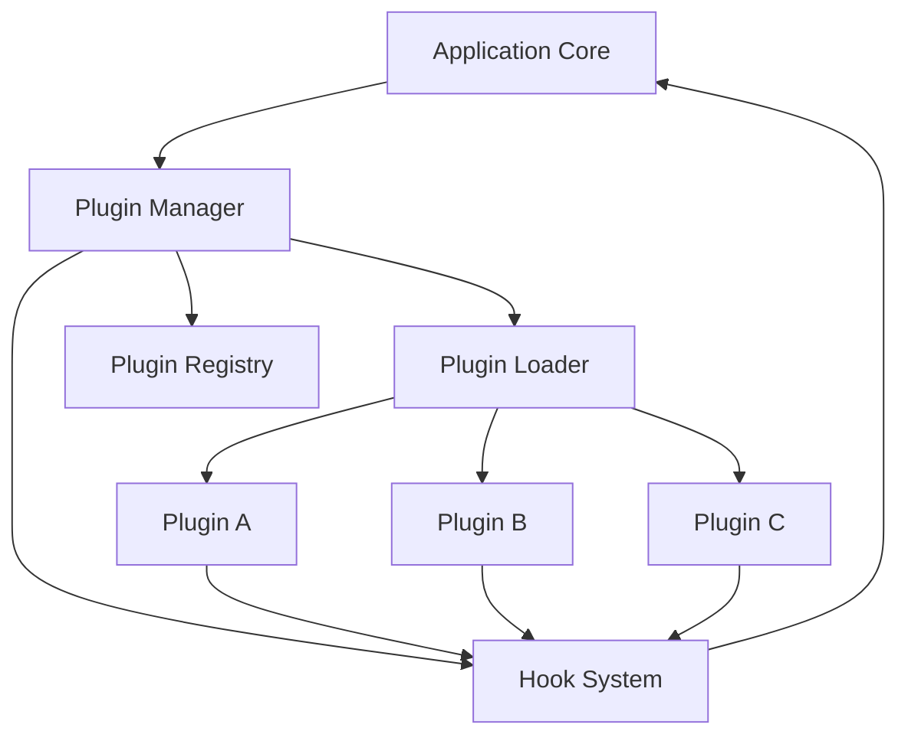
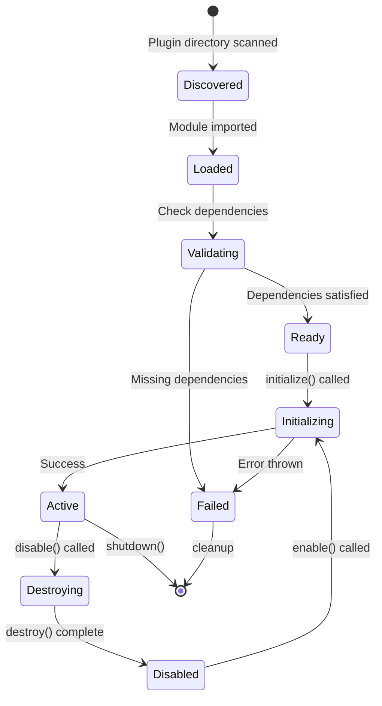

# How to Build Plugin Architecture in Node.js

Author: [nawazdhandala](https://www.github.com/nawazdhandala)

Tags: NodeJS, Plugin Architecture, Software Design, Extensibility, Modular Design, TypeScript, Backend Development

Description: Learn how to design and implement a flexible plugin architecture in Node.js that allows third-party extensions without modifying core application code.

---

Applications that scale often need to support extensions without requiring changes to the core codebase. A plugin architecture lets you add new features, integrations, and behaviors by simply dropping in new modules. Think of how VS Code extensions, Webpack plugins, or Express middleware work. They all follow the same principle: define a contract, let plugins implement it, and load them dynamically.

This guide covers practical patterns for building plugin systems in Node.js, from simple hook-based designs to full-featured plugin managers with lifecycle support.

## Why Use a Plugin Architecture?

Before diving into implementation, consider when a plugin system makes sense:

| Scenario | Plugin Architecture? | Why |
|----------|---------------------|-----|
| Third-party integrations | Yes | External developers can add features |
| Feature flags for clients | Yes | Enable/disable features per deployment |
| Small internal tool | No | Overhead exceeds benefit |
| Monolithic application | Maybe | Can help with modularity |
| Platform product | Yes | Core business requirement |
| Microservices | No | Service boundaries provide extensibility |

## Core Concepts

A plugin architecture consists of several key components that work together:



The application core exposes extension points through hooks. The plugin manager handles loading, registration, and lifecycle management. Each plugin implements the required interface and registers callbacks for hooks it cares about.

## Basic Plugin Interface

Start with a simple interface that all plugins must implement. This contract defines what the application expects from plugins and what plugins can expect from the application.

```typescript
// types/plugin.ts

/**
 * Metadata that identifies and describes a plugin.
 * This information is used for dependency resolution,
 * version compatibility checks, and display in admin interfaces.
 */
interface PluginMetadata {
  name: string;           // Unique identifier for the plugin
  version: string;        // Semantic version (e.g., "1.2.3")
  description?: string;   // Human-readable description
  author?: string;        // Plugin author name or organization
  dependencies?: {        // Other plugins this one requires
    [pluginName: string]: string;  // Plugin name -> version range
  };
}

/**
 * Context object passed to plugins during initialization.
 * Provides access to application services without coupling
 * plugins directly to implementation details.
 */
interface PluginContext {
  logger: Logger;         // Logging service
  config: Config;         // Application configuration
  hooks: HookRegistry;    // Hook registration system
  services: ServiceContainer;  // Dependency injection container
}

/**
 * The main plugin interface that all plugins must implement.
 * Defines the lifecycle methods the application will call.
 */
interface Plugin {
  metadata: PluginMetadata;

  /**
   * Called when the plugin is loaded. Use this for setup tasks
   * like registering hooks, initializing state, or connecting
   * to external services.
   */
  initialize(context: PluginContext): Promise<void>;

  /**
   * Called when the plugin is being unloaded. Clean up resources,
   * close connections, and remove any registered hooks.
   */
  destroy?(): Promise<void>;
}

export { Plugin, PluginMetadata, PluginContext };
```

## Building the Hook System

Hooks are the extension points where plugins inject their behavior. A hook-based system lets the core application emit events at key points, allowing plugins to react or modify data as it flows through the system.

```typescript
// hooks/HookRegistry.ts

type HookCallback<T = unknown> = (data: T) => T | Promise<T>;

/**
 * Registry for managing hooks and their callbacks.
 * Hooks can be either "filter" style (modify and return data)
 * or "action" style (side effects only).
 */
class HookRegistry {
  // Map of hook names to arrays of registered callbacks
  private hooks: Map<string, HookCallback[]> = new Map();

  // Priority ordering for callbacks (lower runs first)
  private priorities: Map<string, Map<HookCallback, number>> = new Map();

  /**
   * Register a callback for a specific hook.
   * @param hookName - The name of the hook to listen to
   * @param callback - Function to call when hook is triggered
   * @param priority - Execution order (default 10, lower runs first)
   */
  register<T>(
    hookName: string,
    callback: HookCallback<T>,
    priority: number = 10
  ): void {
    // Initialize hook array if this is the first registration
    if (!this.hooks.has(hookName)) {
      this.hooks.set(hookName, []);
      this.priorities.set(hookName, new Map());
    }

    const callbacks = this.hooks.get(hookName)!;
    const priorityMap = this.priorities.get(hookName)!;

    // Add callback and store its priority
    callbacks.push(callback as HookCallback);
    priorityMap.set(callback as HookCallback, priority);

    // Sort callbacks by priority (stable sort maintains registration order for same priority)
    callbacks.sort((a, b) => {
      return (priorityMap.get(a) || 10) - (priorityMap.get(b) || 10);
    });
  }

  /**
   * Remove a previously registered callback.
   * @param hookName - The hook to unregister from
   * @param callback - The specific callback to remove
   */
  unregister<T>(hookName: string, callback: HookCallback<T>): void {
    const callbacks = this.hooks.get(hookName);
    if (!callbacks) return;

    const index = callbacks.indexOf(callback as HookCallback);
    if (index > -1) {
      callbacks.splice(index, 1);
      this.priorities.get(hookName)?.delete(callback as HookCallback);
    }
  }

  /**
   * Trigger a hook, passing data through all registered callbacks.
   * Each callback receives the output of the previous one, allowing
   * plugins to transform data as it flows through the chain.
   *
   * @param hookName - The hook to trigger
   * @param data - Initial data to pass to the first callback
   * @returns The data after all callbacks have processed it
   */
  async trigger<T>(hookName: string, data: T): Promise<T> {
    const callbacks = this.hooks.get(hookName);

    // No callbacks registered, return data unchanged
    if (!callbacks || callbacks.length === 0) {
      return data;
    }

    // Run each callback in sequence, passing data through the chain
    let result = data;
    for (const callback of callbacks) {
      result = await callback(result) as T;
    }

    return result;
  }

  /**
   * Trigger a hook without modifying data (action-style).
   * All callbacks run with the same input data.
   *
   * @param hookName - The hook to trigger
   * @param data - Data to pass to all callbacks
   */
  async broadcast<T>(hookName: string, data: T): Promise<void> {
    const callbacks = this.hooks.get(hookName);
    if (!callbacks) return;

    // Run all callbacks in parallel since they do not chain
    await Promise.all(
      callbacks.map(callback => callback(data))
    );
  }
}

export { HookRegistry, HookCallback };
```

## The Plugin Manager

The plugin manager coordinates loading, initialization, and lifecycle management for all plugins. It handles dependency resolution, ensures plugins initialize in the correct order, and provides methods for enabling or disabling plugins at runtime.

```typescript
// plugins/PluginManager.ts

import { Plugin, PluginContext, PluginMetadata } from '../types/plugin';
import { HookRegistry } from '../hooks/HookRegistry';
import * as path from 'path';
import * as fs from 'fs/promises';

interface LoadedPlugin {
  instance: Plugin;
  metadata: PluginMetadata;
  enabled: boolean;
  initialized: boolean;
}

/**
 * Central manager for all plugin operations.
 * Handles discovery, loading, initialization, and lifecycle management.
 */
class PluginManager {
  private plugins: Map<string, LoadedPlugin> = new Map();
  private hooks: HookRegistry;
  private context: PluginContext;
  private pluginDirectory: string;

  constructor(options: {
    pluginDirectory: string;
    context: Omit<PluginContext, 'hooks'>;
  }) {
    this.pluginDirectory = options.pluginDirectory;
    this.hooks = new HookRegistry();

    // Build the context that gets passed to each plugin
    this.context = {
      ...options.context,
      hooks: this.hooks,
    };
  }

  /**
   * Discover and load all plugins from the plugin directory.
   * Each plugin should be in its own subdirectory with an index.js entry point.
   */
  async discoverPlugins(): Promise<void> {
    const entries = await fs.readdir(this.pluginDirectory, {
      withFileTypes: true
    });

    // Look for directories that contain plugin modules
    const pluginDirs = entries.filter(entry => entry.isDirectory());

    for (const dir of pluginDirs) {
      const pluginPath = path.join(this.pluginDirectory, dir.name);
      await this.loadPlugin(pluginPath);
    }
  }

  /**
   * Load a single plugin from a directory path.
   * The directory should contain an index.js that exports a Plugin.
   */
  async loadPlugin(pluginPath: string): Promise<void> {
    try {
      // Dynamic import of the plugin module
      const pluginModule = await import(pluginPath);

      // Support both default exports and named 'plugin' exports
      const PluginClass = pluginModule.default || pluginModule.plugin;

      if (!PluginClass) {
        console.warn(`No plugin export found in ${pluginPath}`);
        return;
      }

      // Instantiate the plugin
      const instance: Plugin = new PluginClass();
      const { metadata } = instance;

      // Check if plugin with same name already exists
      if (this.plugins.has(metadata.name)) {
        console.warn(`Plugin ${metadata.name} already loaded, skipping`);
        return;
      }

      // Register the plugin (not yet initialized)
      this.plugins.set(metadata.name, {
        instance,
        metadata,
        enabled: true,
        initialized: false,
      });

      console.log(`Loaded plugin: ${metadata.name}@${metadata.version}`);
    } catch (error) {
      console.error(`Failed to load plugin from ${pluginPath}:`, error);
    }
  }

  /**
   * Initialize all loaded plugins in dependency order.
   * Plugins with dependencies wait for their dependencies to initialize first.
   */
  async initializeAll(): Promise<void> {
    // Build dependency graph and get initialization order
    const order = this.resolveDependencyOrder();

    for (const pluginName of order) {
      await this.initializePlugin(pluginName);
    }

    // Trigger hook to notify that all plugins are ready
    await this.hooks.broadcast('plugins:ready', {
      plugins: Array.from(this.plugins.keys()),
    });
  }

  /**
   * Initialize a single plugin by name.
   */
  private async initializePlugin(name: string): Promise<void> {
    const plugin = this.plugins.get(name);
    if (!plugin || plugin.initialized || !plugin.enabled) {
      return;
    }

    try {
      // Call the plugin's initialize method with context
      await plugin.instance.initialize(this.context);
      plugin.initialized = true;

      console.log(`Initialized plugin: ${name}`);
    } catch (error) {
      console.error(`Failed to initialize plugin ${name}:`, error);
      plugin.enabled = false;
    }
  }

  /**
   * Resolve the order in which plugins should initialize based on dependencies.
   * Uses topological sort to ensure dependencies initialize before dependents.
   */
  private resolveDependencyOrder(): string[] {
    const order: string[] = [];
    const visited = new Set<string>();
    const visiting = new Set<string>();

    // Depth-first traversal with cycle detection
    const visit = (name: string) => {
      if (visited.has(name)) return;
      if (visiting.has(name)) {
        throw new Error(`Circular dependency detected involving ${name}`);
      }

      visiting.add(name);

      const plugin = this.plugins.get(name);
      if (plugin?.metadata.dependencies) {
        // Visit all dependencies first
        for (const depName of Object.keys(plugin.metadata.dependencies)) {
          if (this.plugins.has(depName)) {
            visit(depName);
          } else {
            console.warn(`Missing dependency: ${name} requires ${depName}`);
          }
        }
      }

      visiting.delete(name);
      visited.add(name);
      order.push(name);
    };

    // Visit all plugins
    for (const name of this.plugins.keys()) {
      visit(name);
    }

    return order;
  }

  /**
   * Disable a plugin at runtime.
   * Calls the plugin's destroy method and marks it as disabled.
   */
  async disablePlugin(name: string): Promise<void> {
    const plugin = this.plugins.get(name);
    if (!plugin || !plugin.enabled) return;

    // Call destroy if the plugin implements it
    if (plugin.instance.destroy) {
      await plugin.instance.destroy();
    }

    plugin.enabled = false;
    plugin.initialized = false;

    console.log(`Disabled plugin: ${name}`);
  }

  /**
   * Re-enable a previously disabled plugin.
   */
  async enablePlugin(name: string): Promise<void> {
    const plugin = this.plugins.get(name);
    if (!plugin || plugin.enabled) return;

    plugin.enabled = true;
    await this.initializePlugin(name);

    console.log(`Enabled plugin: ${name}`);
  }

  /**
   * Get the hook registry for triggering hooks from application code.
   */
  getHooks(): HookRegistry {
    return this.hooks;
  }

  /**
   * Get list of all registered plugins with their status.
   */
  listPlugins(): Array<PluginMetadata & { enabled: boolean }> {
    return Array.from(this.plugins.values()).map(p => ({
      ...p.metadata,
      enabled: p.enabled,
    }));
  }

  /**
   * Gracefully shut down all plugins.
   */
  async shutdown(): Promise<void> {
    // Shut down in reverse initialization order
    const order = this.resolveDependencyOrder().reverse();

    for (const name of order) {
      const plugin = this.plugins.get(name);
      if (plugin?.enabled && plugin.instance.destroy) {
        await plugin.instance.destroy();
      }
    }

    this.plugins.clear();
  }
}

export { PluginManager };
```

## Plugin Lifecycle Flow

Understanding how plugins move through their lifecycle helps when debugging issues or implementing advanced features:



## Creating a Plugin

Now let us create an example plugin that adds logging capabilities. This demonstrates the standard plugin structure and how to interact with hooks.

```typescript
// plugins/audit-logger/index.ts

import { Plugin, PluginContext } from '../../types/plugin';

/**
 * Audit Logger Plugin
 *
 * Logs all user actions to an audit trail. Demonstrates how to:
 * - Implement the Plugin interface
 * - Register hooks during initialization
 * - Clean up resources on destroy
 */
class AuditLoggerPlugin implements Plugin {
  metadata = {
    name: 'audit-logger',
    version: '1.0.0',
    description: 'Logs all user actions to an audit trail',
    author: 'Your Team',
  };

  private context: PluginContext | null = null;
  private logBuffer: Array<{ timestamp: Date; action: string; data: unknown }> = [];
  private flushInterval: NodeJS.Timeout | null = null;

  async initialize(context: PluginContext): Promise<void> {
    this.context = context;
    const { hooks, logger, config } = context;

    // Register for user action hooks
    // Priority 1 ensures this runs before other plugins that might modify data
    hooks.register('user:action', this.handleUserAction.bind(this), 1);

    // Register for request lifecycle hooks
    hooks.register('request:complete', this.handleRequestComplete.bind(this), 100);

    // Set up periodic flush of log buffer
    const flushIntervalMs = config.get('auditLogger.flushInterval', 5000);
    this.flushInterval = setInterval(() => {
      this.flushLogs();
    }, flushIntervalMs);

    logger.info('Audit logger plugin initialized');
  }

  /**
   * Handle user action events.
   * This is a filter-style hook, so we return the data unchanged
   * after logging it.
   */
  private handleUserAction(data: { userId: string; action: string; payload: unknown }) {
    this.logBuffer.push({
      timestamp: new Date(),
      action: `user:${data.action}`,
      data: {
        userId: data.userId,
        payload: data.payload,
      },
    });

    // Return data unchanged for next hook in chain
    return data;
  }

  /**
   * Handle request completion events.
   */
  private handleRequestComplete(data: {
    requestId: string;
    method: string;
    path: string;
    statusCode: number;
    duration: number;
  }) {
    this.logBuffer.push({
      timestamp: new Date(),
      action: 'request:complete',
      data,
    });

    return data;
  }

  /**
   * Flush buffered logs to storage.
   * In production, this would write to a database or log service.
   */
  private async flushLogs(): Promise<void> {
    if (this.logBuffer.length === 0) return;

    const logsToFlush = [...this.logBuffer];
    this.logBuffer = [];

    try {
      // In production: write to database, send to log aggregator, etc.
      this.context?.logger.debug(`Flushing ${logsToFlush.length} audit log entries`);

      // Example: write to file (replace with your storage mechanism)
      // await fs.appendFile('audit.log', JSON.stringify(logsToFlush) + '\n');
    } catch (error) {
      // On failure, put logs back in buffer to retry
      this.logBuffer = [...logsToFlush, ...this.logBuffer];
      this.context?.logger.error('Failed to flush audit logs', error);
    }
  }

  async destroy(): Promise<void> {
    // Clear the flush interval
    if (this.flushInterval) {
      clearInterval(this.flushInterval);
      this.flushInterval = null;
    }

    // Final flush of any remaining logs
    await this.flushLogs();

    // Unregister hooks
    if (this.context) {
      this.context.hooks.unregister('user:action', this.handleUserAction.bind(this));
      this.context.hooks.unregister('request:complete', this.handleRequestComplete.bind(this));
    }

    this.context?.logger.info('Audit logger plugin destroyed');
  }
}

// Export the plugin class as default
export default AuditLoggerPlugin;
```

## Integration with Express

Here is how to integrate the plugin system with an Express application. The pattern works similarly for other frameworks like Fastify or Koa.

```typescript
// app.ts

import express from 'express';
import { PluginManager } from './plugins/PluginManager';
import { createLogger } from './utils/logger';
import { Config } from './utils/config';
import { ServiceContainer } from './utils/container';

async function createApp() {
  const app = express();

  // Set up application services
  const logger = createLogger();
  const config = new Config();
  const services = new ServiceContainer();

  // Initialize the plugin manager
  const pluginManager = new PluginManager({
    pluginDirectory: './plugins',
    context: { logger, config, services },
  });

  // Discover and initialize all plugins
  await pluginManager.discoverPlugins();
  await pluginManager.initializeAll();

  // Get hook registry for use in middleware
  const hooks = pluginManager.getHooks();

  // Middleware to trigger hooks on each request
  app.use(async (req, res, next) => {
    const startTime = Date.now();

    // Trigger request:start hook
    await hooks.broadcast('request:start', {
      requestId: req.headers['x-request-id'] || generateId(),
      method: req.method,
      path: req.path,
    });

    // Capture response completion
    res.on('finish', async () => {
      await hooks.broadcast('request:complete', {
        requestId: req.headers['x-request-id'],
        method: req.method,
        path: req.path,
        statusCode: res.statusCode,
        duration: Date.now() - startTime,
      });
    });

    next();
  });

  // Example route that triggers a user action hook
  app.post('/api/users/:id/action', async (req, res) => {
    const { id } = req.params;
    const { action, payload } = req.body;

    // Trigger hook, allowing plugins to observe or modify the action
    const processedData = await hooks.trigger('user:action', {
      userId: id,
      action,
      payload,
    });

    // Process the action with potentially modified data
    const result = await processUserAction(processedData);

    res.json(result);
  });

  // Admin endpoint to list plugins
  app.get('/api/admin/plugins', (req, res) => {
    res.json(pluginManager.listPlugins());
  });

  // Admin endpoint to enable/disable plugins
  app.post('/api/admin/plugins/:name/toggle', async (req, res) => {
    const { name } = req.params;
    const { enabled } = req.body;

    if (enabled) {
      await pluginManager.enablePlugin(name);
    } else {
      await pluginManager.disablePlugin(name);
    }

    res.json({ success: true });
  });

  // Graceful shutdown
  process.on('SIGTERM', async () => {
    await pluginManager.shutdown();
    process.exit(0);
  });

  return app;
}

function generateId(): string {
  return Math.random().toString(36).substring(2, 15);
}

async function processUserAction(data: unknown): Promise<unknown> {
  // Your business logic here
  return { processed: true, data };
}

// Start the application
createApp().then(app => {
  app.listen(3000, () => {
    console.log('Server running on port 3000');
  });
});
```

## Advanced: Plugin Communication

Sometimes plugins need to communicate with each other. Rather than direct coupling, use a message bus pattern that maintains loose coupling between plugins.

```typescript
// plugins/MessageBus.ts

type MessageHandler<T = unknown> = (message: T) => void | Promise<void>;

/**
 * Simple message bus for inter-plugin communication.
 * Plugins can publish messages and subscribe to message types
 * without knowing about each other directly.
 */
class MessageBus {
  private subscribers: Map<string, Set<MessageHandler>> = new Map();

  /**
   * Subscribe to messages of a specific type.
   * @param messageType - The type of message to listen for
   * @param handler - Function to call when message is received
   * @returns Unsubscribe function
   */
  subscribe<T>(messageType: string, handler: MessageHandler<T>): () => void {
    if (!this.subscribers.has(messageType)) {
      this.subscribers.set(messageType, new Set());
    }

    this.subscribers.get(messageType)!.add(handler as MessageHandler);

    // Return unsubscribe function for cleanup
    return () => {
      this.subscribers.get(messageType)?.delete(handler as MessageHandler);
    };
  }

  /**
   * Publish a message to all subscribers of the given type.
   * @param messageType - The type of message being sent
   * @param message - The message payload
   */
  async publish<T>(messageType: string, message: T): Promise<void> {
    const handlers = this.subscribers.get(messageType);
    if (!handlers) return;

    // Run all handlers, collecting any errors
    const errors: Error[] = [];

    await Promise.all(
      Array.from(handlers).map(async handler => {
        try {
          await handler(message);
        } catch (error) {
          errors.push(error as Error);
        }
      })
    );

    // Log errors but do not fail the publish operation
    if (errors.length > 0) {
      console.error(`Errors publishing message ${messageType}:`, errors);
    }
  }
}

export { MessageBus };
```

Here is how plugins use the message bus to communicate:

```typescript
// In PluginContext, add the message bus
interface PluginContext {
  // ... existing properties
  messageBus: MessageBus;
}

// Plugin A: Publishes user events
class UserActivityPlugin implements Plugin {
  metadata = { name: 'user-activity', version: '1.0.0' };

  async initialize(context: PluginContext): Promise<void> {
    context.hooks.register('user:login', async (data) => {
      // Publish message that other plugins can react to
      await context.messageBus.publish('user:logged-in', {
        userId: data.userId,
        timestamp: new Date(),
        source: 'user-activity-plugin',
      });
      return data;
    });
  }
}

// Plugin B: Reacts to user events
class WelcomeEmailPlugin implements Plugin {
  metadata = { name: 'welcome-email', version: '1.0.0' };
  private unsubscribe: (() => void) | null = null;

  async initialize(context: PluginContext): Promise<void> {
    // Subscribe to user login messages
    this.unsubscribe = context.messageBus.subscribe(
      'user:logged-in',
      async (message: { userId: string; timestamp: Date }) => {
        // Check if this is a new user and send welcome email
        await this.checkAndSendWelcome(message.userId);
      }
    );
  }

  async destroy(): Promise<void> {
    // Clean up subscription
    this.unsubscribe?.();
  }

  private async checkAndSendWelcome(userId: string): Promise<void> {
    // Implementation here
  }
}
```

## Plugin Configuration

Plugins often need their own configuration. Here is a pattern for plugin-specific settings:

```typescript
// types/plugin.ts - Extended with config schema

interface PluginMetadata {
  name: string;
  version: string;
  description?: string;
  author?: string;
  dependencies?: Record<string, string>;

  // Schema for plugin configuration (JSON Schema format)
  configSchema?: {
    type: 'object';
    properties: Record<string, unknown>;
    required?: string[];
  };
}

// plugins/rate-limiter/index.ts

import { Plugin, PluginContext } from '../../types/plugin';

interface RateLimiterConfig {
  windowMs: number;
  maxRequests: number;
  keyGenerator: 'ip' | 'user' | 'custom';
}

class RateLimiterPlugin implements Plugin {
  metadata = {
    name: 'rate-limiter',
    version: '1.0.0',
    description: 'Request rate limiting',
    configSchema: {
      type: 'object' as const,
      properties: {
        windowMs: {
          type: 'number',
          default: 60000,
          description: 'Time window in milliseconds',
        },
        maxRequests: {
          type: 'number',
          default: 100,
          description: 'Maximum requests per window',
        },
        keyGenerator: {
          type: 'string',
          enum: ['ip', 'user', 'custom'],
          default: 'ip',
        },
      },
      required: ['windowMs', 'maxRequests'],
    },
  };

  private config: RateLimiterConfig | null = null;
  private requestCounts: Map<string, { count: number; resetAt: number }> = new Map();

  async initialize(context: PluginContext): Promise<void> {
    // Get plugin-specific configuration
    // Config is namespaced by plugin name
    this.config = context.config.get<RateLimiterConfig>(
      `plugins.${this.metadata.name}`,
      {
        windowMs: 60000,
        maxRequests: 100,
        keyGenerator: 'ip',
      }
    );

    // Register rate limiting hook
    context.hooks.register('request:start', async (data) => {
      const key = this.getKey(data);
      const allowed = this.checkLimit(key);

      if (!allowed) {
        // Modify data to indicate rate limit exceeded
        return { ...data, rateLimited: true };
      }

      return data;
    }, 0); // Priority 0: run before other plugins
  }

  private getKey(data: { ip?: string; userId?: string }): string {
    switch (this.config?.keyGenerator) {
      case 'user':
        return data.userId || data.ip || 'anonymous';
      case 'ip':
      default:
        return data.ip || 'unknown';
    }
  }

  private checkLimit(key: string): boolean {
    const now = Date.now();
    const record = this.requestCounts.get(key);

    if (!record || record.resetAt < now) {
      // First request or window expired, start new window
      this.requestCounts.set(key, {
        count: 1,
        resetAt: now + (this.config?.windowMs || 60000),
      });
      return true;
    }

    if (record.count >= (this.config?.maxRequests || 100)) {
      return false;
    }

    record.count++;
    return true;
  }
}

export default RateLimiterPlugin;
```

## Testing Plugins

Testable plugins require proper isolation. Here is a pattern for unit testing plugins:

```typescript
// plugins/rate-limiter/index.test.ts

import RateLimiterPlugin from './index';
import { PluginContext } from '../../types/plugin';
import { HookRegistry } from '../../hooks/HookRegistry';

describe('RateLimiterPlugin', () => {
  let plugin: RateLimiterPlugin;
  let mockContext: PluginContext;
  let hooks: HookRegistry;

  beforeEach(() => {
    plugin = new RateLimiterPlugin();
    hooks = new HookRegistry();

    // Create mock context with minimal implementations
    mockContext = {
      logger: {
        info: jest.fn(),
        error: jest.fn(),
        debug: jest.fn(),
        warn: jest.fn(),
      },
      config: {
        get: jest.fn().mockReturnValue({
          windowMs: 1000,
          maxRequests: 2,
          keyGenerator: 'ip',
        }),
      },
      hooks,
      services: {} as any,
      messageBus: {
        subscribe: jest.fn(),
        publish: jest.fn(),
      },
    };
  });

  it('should allow requests under the limit', async () => {
    await plugin.initialize(mockContext);

    const result1 = await hooks.trigger('request:start', { ip: '127.0.0.1' });
    const result2 = await hooks.trigger('request:start', { ip: '127.0.0.1' });

    expect(result1.rateLimited).toBeUndefined();
    expect(result2.rateLimited).toBeUndefined();
  });

  it('should block requests over the limit', async () => {
    await plugin.initialize(mockContext);

    await hooks.trigger('request:start', { ip: '127.0.0.1' });
    await hooks.trigger('request:start', { ip: '127.0.0.1' });
    const result3 = await hooks.trigger('request:start', { ip: '127.0.0.1' });

    expect(result3.rateLimited).toBe(true);
  });

  it('should track different IPs separately', async () => {
    await plugin.initialize(mockContext);

    await hooks.trigger('request:start', { ip: '127.0.0.1' });
    await hooks.trigger('request:start', { ip: '127.0.0.1' });

    // Different IP should not be rate limited
    const result = await hooks.trigger('request:start', { ip: '192.168.1.1' });

    expect(result.rateLimited).toBeUndefined();
  });
});
```

## Security Considerations

When building a plugin architecture, security is important. Consider these patterns:

```typescript
// plugins/PluginSandbox.ts

import * as vm from 'vm';

/**
 * Sandbox for running untrusted plugin code.
 * Limits what APIs the plugin can access.
 *
 * Note: This provides basic isolation but is not a complete
 * security solution for running untrusted code.
 */
class PluginSandbox {
  private allowedGlobals: Set<string>;

  constructor(allowedGlobals: string[] = []) {
    // Default safe globals
    this.allowedGlobals = new Set([
      'console',
      'setTimeout',
      'clearTimeout',
      'setInterval',
      'clearInterval',
      'Promise',
      'JSON',
      'Math',
      'Date',
      'Array',
      'Object',
      'String',
      'Number',
      'Boolean',
      'Map',
      'Set',
      'WeakMap',
      'WeakSet',
      ...allowedGlobals,
    ]);
  }

  /**
   * Create a sandboxed context for plugin execution.
   * Only exposes allowed globals and passed-in APIs.
   */
  createContext(apis: Record<string, unknown>): vm.Context {
    const sandbox: Record<string, unknown> = {};

    // Add allowed globals
    for (const name of this.allowedGlobals) {
      if (name in global) {
        sandbox[name] = (global as any)[name];
      }
    }

    // Add provided APIs
    for (const [name, api] of Object.entries(apis)) {
      sandbox[name] = api;
    }

    return vm.createContext(sandbox);
  }

  /**
   * Run code in the sandbox with timeout protection.
   */
  run(code: string, context: vm.Context, timeout: number = 5000): unknown {
    const script = new vm.Script(code);
    return script.runInContext(context, { timeout });
  }
}

export { PluginSandbox };
```

Additional security practices include:

1. **Validate plugin sources**: Only load plugins from trusted directories
2. **Schema validation**: Validate plugin metadata and configuration against schemas
3. **Permission system**: Plugins request permissions, users approve them
4. **Resource limits**: Limit memory, CPU, and network access per plugin
5. **Audit logging**: Log all plugin actions for security review

## Summary

| Component | Purpose |
|-----------|---------|
| Plugin Interface | Contract defining required methods and metadata |
| Hook Registry | Extension points for plugins to inject behavior |
| Plugin Manager | Loading, initialization, and lifecycle management |
| Message Bus | Loose coupling for inter-plugin communication |
| Configuration | Plugin-specific settings with schema validation |
| Sandbox | Security isolation for untrusted plugins |

A well-designed plugin architecture transforms a monolithic application into an extensible platform. Start simple with hooks and a basic loader, then add features like dependency resolution, configuration schemas, and security sandboxing as your needs grow.

The key principles to remember:

- Define clear contracts (interfaces) that plugins must follow
- Use hooks for extension points rather than direct modification
- Handle plugin lifecycle properly (initialize, destroy)
- Keep plugins loosely coupled through message passing
- Test plugins in isolation with mock contexts

With these patterns, your Node.js application can support a rich ecosystem of extensions while maintaining a stable, maintainable core.
