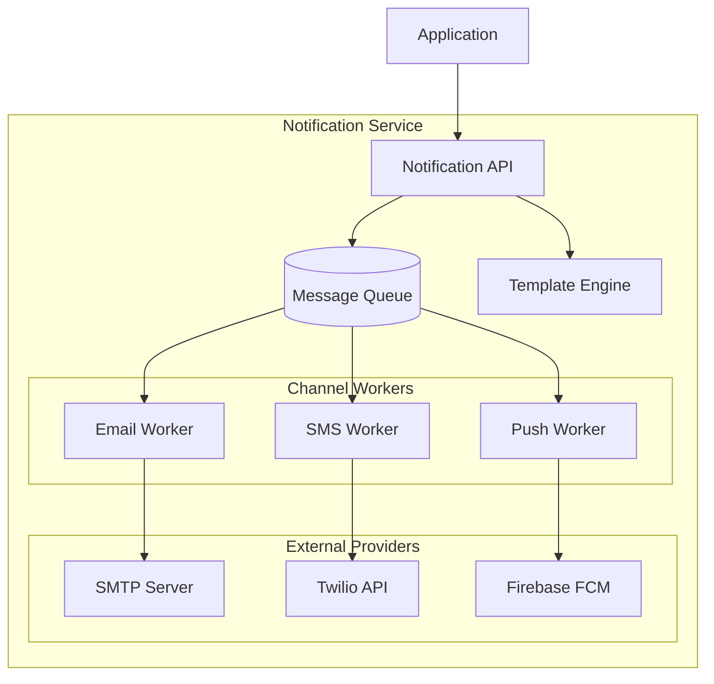

# How to Build a Notification Service in .NET

Author: [nawazdhandala](https://www.github.com/nawazdhandala)

Tags: .NET, C#, Notifications, Background Services, Email, SMS, Push Notifications, Microservices

Description: Learn how to build a scalable notification service in .NET that handles email, SMS, and push notifications with templating, rate limiting, and delivery tracking.

---

A notification service is a core component of most modern applications. Users expect timely alerts through their preferred channels, whether email, SMS, or push notifications. Building a reliable notification service requires handling multiple delivery channels, managing templates, respecting rate limits, and tracking delivery status.

## Architecture Overview

A well-designed notification service separates concerns: an API receives notification requests, a dispatcher routes them to the appropriate channel, and channel-specific workers handle delivery.



## Project Setup

Create the project and add required packages.

```bash
dotnet new webapi -n NotificationService
cd NotificationService
dotnet add package MailKit
dotnet add package FirebaseAdmin
dotnet add package Twilio
dotnet add package Scriban
dotnet add package StackExchange.Redis
```

## Core Models

Define the notification types and delivery channels.

```csharp
// Models/Notification.cs
public class NotificationRequest
{
    public string Id { get; set; } = Guid.NewGuid().ToString();
    public string UserId { get; set; } = string.Empty;
    public NotificationType Type { get; set; }
    public NotificationChannel Channel { get; set; }
    public string TemplateId { get; set; } = string.Empty;
    public Dictionary<string, object> TemplateData { get; set; } = new();
    public NotificationPriority Priority { get; set; } = NotificationPriority.Normal;
    public DateTime? ScheduledAt { get; set; }
    public Dictionary<string, string> Metadata { get; set; } = new();
}

public enum NotificationType
{
    Transactional,  // Order confirmations, password resets
    Marketing,      // Promotional content
    Alert,          // System alerts, warnings
    Reminder        // Scheduled reminders
}

public enum NotificationChannel
{
    Email,
    Sms,
    Push,
    All
}

public enum NotificationPriority
{
    Low,
    Normal,
    High,
    Critical
}

public class NotificationResult
{
    public string NotificationId { get; set; } = string.Empty;
    public NotificationChannel Channel { get; set; }
    public DeliveryStatus Status { get; set; }
    public string? ExternalId { get; set; }
    public string? ErrorMessage { get; set; }
    public DateTime ProcessedAt { get; set; }
}

public enum DeliveryStatus
{
    Pending,
    Sent,
    Delivered,
    Failed,
    Bounced,
    Unsubscribed
}
```

## Template Engine

Use Scriban for flexible, secure templates that support both email and SMS.

```csharp
// Services/TemplateService.cs
using Scriban;
using Scriban.Runtime;

public interface ITemplateService
{
    Task<RenderedTemplate> RenderAsync(
        string templateId,
        Dictionary<string, object> data);
}

public class TemplateService : ITemplateService
{
    private readonly ITemplateRepository _repository;
    private readonly ILogger<TemplateService> _logger;

    public TemplateService(
        ITemplateRepository repository,
        ILogger<TemplateService> logger)
    {
        _repository = repository;
        _logger = logger;
    }

    public async Task<RenderedTemplate> RenderAsync(
        string templateId,
        Dictionary<string, object> data)
    {
        var template = await _repository.GetByIdAsync(templateId);
        if (template == null)
        {
            throw new TemplateNotFoundException(templateId);
        }

        // Create a script object with the template data
        var scriptObject = new ScriptObject();
        foreach (var kvp in data)
        {
            scriptObject.Add(kvp.Key, kvp.Value);
        }

        // Add helper functions
        scriptObject.Import("format_currency",
            new Func<decimal, string, string>(FormatCurrency));
        scriptObject.Import("format_date",
            new Func<DateTime, string, string>(FormatDate));

        var context = new TemplateContext();
        context.PushGlobal(scriptObject);

        // Render subject and body
        var subjectTemplate = Template.Parse(template.Subject);
        var bodyTemplate = Template.Parse(template.Body);

        var renderedSubject = await subjectTemplate.RenderAsync(context);
        var renderedBody = await bodyTemplate.RenderAsync(context);

        return new RenderedTemplate
        {
            Subject = renderedSubject,
            Body = renderedBody,
            IsHtml = template.IsHtml
        };
    }

    private string FormatCurrency(decimal amount, string currency)
    {
        return currency.ToUpper() switch
        {
            "USD" => $"${amount:N2}",
            "EUR" => $"{amount:N2} EUR",
            "GBP" => $"{amount:N2} GBP",
            _ => $"{amount:N2} {currency}"
        };
    }

    private string FormatDate(DateTime date, string format)
    {
        return date.ToString(format);
    }
}

public class RenderedTemplate
{
    public string Subject { get; set; } = string.Empty;
    public string Body { get; set; } = string.Empty;
    public bool IsHtml { get; set; }
}
```

## Email Channel

Implement email delivery using MailKit for SMTP support.

```csharp
// Channels/EmailChannel.cs
using MailKit.Net.Smtp;
using MimeKit;

public interface INotificationChannel
{
    NotificationChannel ChannelType { get; }
    Task<NotificationResult> SendAsync(
        NotificationRequest request,
        RenderedTemplate template,
        UserContact contact);
}

public class EmailChannel : INotificationChannel
{
    private readonly EmailSettings _settings;
    private readonly ILogger<EmailChannel> _logger;

    public NotificationChannel ChannelType => NotificationChannel.Email;

    public EmailChannel(
        IOptions<EmailSettings> settings,
        ILogger<EmailChannel> logger)
    {
        _settings = settings.Value;
        _logger = logger;
    }

    public async Task<NotificationResult> SendAsync(
        NotificationRequest request,
        RenderedTemplate template,
        UserContact contact)
    {
        if (string.IsNullOrEmpty(contact.Email))
        {
            return new NotificationResult
            {
                NotificationId = request.Id,
                Channel = ChannelType,
                Status = DeliveryStatus.Failed,
                ErrorMessage = "No email address provided"
            };
        }

        try
        {
            var message = new MimeMessage();
            message.From.Add(new MailboxAddress(
                _settings.FromName, _settings.FromAddress));
            message.To.Add(new MailboxAddress(contact.Name, contact.Email));
            message.Subject = template.Subject;

            // Create the body with both HTML and plain text
            var builder = new BodyBuilder();
            if (template.IsHtml)
            {
                builder.HtmlBody = template.Body;
                builder.TextBody = StripHtml(template.Body);
            }
            else
            {
                builder.TextBody = template.Body;
            }
            message.Body = builder.ToMessageBody();

            // Add tracking headers
            message.Headers.Add("X-Notification-Id", request.Id);
            message.Headers.Add("X-Notification-Type", request.Type.ToString());

            using var client = new SmtpClient();
            await client.ConnectAsync(
                _settings.SmtpHost,
                _settings.SmtpPort,
                _settings.UseSsl);

            if (!string.IsNullOrEmpty(_settings.Username))
            {
                await client.AuthenticateAsync(
                    _settings.Username, _settings.Password);
            }

            var response = await client.SendAsync(message);
            await client.DisconnectAsync(true);

            _logger.LogInformation(
                "Email sent to {Email} for notification {NotificationId}",
                contact.Email, request.Id);

            return new NotificationResult
            {
                NotificationId = request.Id,
                Channel = ChannelType,
                Status = DeliveryStatus.Sent,
                ExternalId = response,
                ProcessedAt = DateTime.UtcNow
            };
        }
        catch (Exception ex)
        {
            _logger.LogError(ex,
                "Failed to send email for notification {NotificationId}",
                request.Id);

            return new NotificationResult
            {
                NotificationId = request.Id,
                Channel = ChannelType,
                Status = DeliveryStatus.Failed,
                ErrorMessage = ex.Message,
                ProcessedAt = DateTime.UtcNow
            };
        }
    }

    private string StripHtml(string html)
    {
        return System.Text.RegularExpressions.Regex.Replace(
            html, "<[^>]*>", string.Empty);
    }
}

public class EmailSettings
{
    public string SmtpHost { get; set; } = string.Empty;
    public int SmtpPort { get; set; } = 587;
    public bool UseSsl { get; set; } = true;
    public string Username { get; set; } = string.Empty;
    public string Password { get; set; } = string.Empty;
    public string FromAddress { get; set; } = string.Empty;
    public string FromName { get; set; } = string.Empty;
}
```

## SMS Channel

Implement SMS delivery using Twilio.

```csharp
// Channels/SmsChannel.cs
using Twilio;
using Twilio.Rest.Api.V2010.Account;

public class SmsChannel : INotificationChannel
{
    private readonly SmsSettings _settings;
    private readonly ILogger<SmsChannel> _logger;

    public NotificationChannel ChannelType => NotificationChannel.Sms;

    public SmsChannel(
        IOptions<SmsSettings> settings,
        ILogger<SmsChannel> logger)
    {
        _settings = settings.Value;
        _logger = logger;

        TwilioClient.Init(_settings.AccountSid, _settings.AuthToken);
    }

    public async Task<NotificationResult> SendAsync(
        NotificationRequest request,
        RenderedTemplate template,
        UserContact contact)
    {
        if (string.IsNullOrEmpty(contact.PhoneNumber))
        {
            return new NotificationResult
            {
                NotificationId = request.Id,
                Channel = ChannelType,
                Status = DeliveryStatus.Failed,
                ErrorMessage = "No phone number provided"
            };
        }

        try
        {
            // SMS messages should be plain text and concise
            var body = template.Body;
            if (body.Length > 1600)
            {
                body = body.Substring(0, 1597) + "...";
            }

            var message = await MessageResource.CreateAsync(
                to: new Twilio.Types.PhoneNumber(contact.PhoneNumber),
                from: new Twilio.Types.PhoneNumber(_settings.FromNumber),
                body: body);

            _logger.LogInformation(
                "SMS sent to {Phone} for notification {NotificationId}, SID: {Sid}",
                MaskPhoneNumber(contact.PhoneNumber), request.Id, message.Sid);

            return new NotificationResult
            {
                NotificationId = request.Id,
                Channel = ChannelType,
                Status = MapTwilioStatus(message.Status),
                ExternalId = message.Sid,
                ProcessedAt = DateTime.UtcNow
            };
        }
        catch (Exception ex)
        {
            _logger.LogError(ex,
                "Failed to send SMS for notification {NotificationId}",
                request.Id);

            return new NotificationResult
            {
                NotificationId = request.Id,
                Channel = ChannelType,
                Status = DeliveryStatus.Failed,
                ErrorMessage = ex.Message,
                ProcessedAt = DateTime.UtcNow
            };
        }
    }

    private DeliveryStatus MapTwilioStatus(MessageResource.StatusEnum? status)
    {
        return status switch
        {
            MessageResource.StatusEnum.Queued => DeliveryStatus.Pending,
            MessageResource.StatusEnum.Sent => DeliveryStatus.Sent,
            MessageResource.StatusEnum.Delivered => DeliveryStatus.Delivered,
            MessageResource.StatusEnum.Failed => DeliveryStatus.Failed,
            MessageResource.StatusEnum.Undelivered => DeliveryStatus.Failed,
            _ => DeliveryStatus.Pending
        };
    }

    private string MaskPhoneNumber(string phone)
    {
        if (phone.Length <= 4) return "****";
        return new string('*', phone.Length - 4) + phone[^4..];
    }
}

public class SmsSettings
{
    public string AccountSid { get; set; } = string.Empty;
    public string AuthToken { get; set; } = string.Empty;
    public string FromNumber { get; set; } = string.Empty;
}
```

## Push Notification Channel

Implement push notifications using Firebase Cloud Messaging.

```csharp
// Channels/PushChannel.cs
using FirebaseAdmin;
using FirebaseAdmin.Messaging;
using Google.Apis.Auth.OAuth2;

public class PushChannel : INotificationChannel
{
    private readonly ILogger<PushChannel> _logger;

    public NotificationChannel ChannelType => NotificationChannel.Push;

    public PushChannel(
        IConfiguration configuration,
        ILogger<PushChannel> logger)
    {
        _logger = logger;

        // Initialize Firebase if not already done
        if (FirebaseApp.DefaultInstance == null)
        {
            var credentialPath = configuration["Firebase:CredentialPath"];
            FirebaseApp.Create(new AppOptions
            {
                Credential = GoogleCredential.FromFile(credentialPath)
            });
        }
    }

    public async Task<NotificationResult> SendAsync(
        NotificationRequest request,
        RenderedTemplate template,
        UserContact contact)
    {
        if (string.IsNullOrEmpty(contact.DeviceToken))
        {
            return new NotificationResult
            {
                NotificationId = request.Id,
                Channel = ChannelType,
                Status = DeliveryStatus.Failed,
                ErrorMessage = "No device token provided"
            };
        }

        try
        {
            var message = new Message
            {
                Token = contact.DeviceToken,
                Notification = new Notification
                {
                    Title = template.Subject,
                    Body = StripHtml(template.Body)
                },
                Data = new Dictionary<string, string>
                {
                    ["notificationId"] = request.Id,
                    ["type"] = request.Type.ToString()
                },
                // Platform-specific configuration
                Android = new AndroidConfig
                {
                    Priority = request.Priority == NotificationPriority.Critical
                        ? Priority.High
                        : Priority.Normal,
                    Notification = new AndroidNotification
                    {
                        ClickAction = "OPEN_NOTIFICATION"
                    }
                },
                Apns = new ApnsConfig
                {
                    Aps = new Aps
                    {
                        Sound = "default",
                        Badge = 1
                    }
                }
            };

            var response = await FirebaseMessaging.DefaultInstance
                .SendAsync(message);

            _logger.LogInformation(
                "Push notification sent for {NotificationId}, MessageId: {MessageId}",
                request.Id, response);

            return new NotificationResult
            {
                NotificationId = request.Id,
                Channel = ChannelType,
                Status = DeliveryStatus.Sent,
                ExternalId = response,
                ProcessedAt = DateTime.UtcNow
            };
        }
        catch (FirebaseMessagingException ex) when (
            ex.MessagingErrorCode == MessagingErrorCode.Unregistered)
        {
            // Device token is invalid, mark for cleanup
            _logger.LogWarning(
                "Invalid device token for notification {NotificationId}",
                request.Id);

            return new NotificationResult
            {
                NotificationId = request.Id,
                Channel = ChannelType,
                Status = DeliveryStatus.Unsubscribed,
                ErrorMessage = "Device token unregistered",
                ProcessedAt = DateTime.UtcNow
            };
        }
        catch (Exception ex)
        {
            _logger.LogError(ex,
                "Failed to send push notification {NotificationId}",
                request.Id);

            return new NotificationResult
            {
                NotificationId = request.Id,
                Channel = ChannelType,
                Status = DeliveryStatus.Failed,
                ErrorMessage = ex.Message,
                ProcessedAt = DateTime.UtcNow
            };
        }
    }

    private string StripHtml(string html)
    {
        return System.Text.RegularExpressions.Regex.Replace(
            html, "<[^>]*>", string.Empty);
    }
}
```

## Rate Limiting

Protect external providers and respect their rate limits.

```csharp
// Services/RateLimiter.cs
using System.Collections.Concurrent;

public interface IRateLimiter
{
    Task<bool> TryAcquireAsync(string key, int maxRequests, TimeSpan window);
}

public class SlidingWindowRateLimiter : IRateLimiter
{
    private readonly ConcurrentDictionary<string, SlidingWindow> _windows = new();

    public Task<bool> TryAcquireAsync(string key, int maxRequests, TimeSpan window)
    {
        var slidingWindow = _windows.GetOrAdd(key, _ => new SlidingWindow(window));
        return Task.FromResult(slidingWindow.TryAcquire(maxRequests));
    }

    private class SlidingWindow
    {
        private readonly TimeSpan _windowSize;
        private readonly Queue<DateTime> _timestamps = new();
        private readonly object _lock = new();

        public SlidingWindow(TimeSpan windowSize)
        {
            _windowSize = windowSize;
        }

        public bool TryAcquire(int maxRequests)
        {
            lock (_lock)
            {
                var now = DateTime.UtcNow;
                var windowStart = now - _windowSize;

                // Remove expired timestamps
                while (_timestamps.Count > 0 && _timestamps.Peek() < windowStart)
                {
                    _timestamps.Dequeue();
                }

                if (_timestamps.Count >= maxRequests)
                {
                    return false;
                }

                _timestamps.Enqueue(now);
                return true;
            }
        }
    }
}
```

## Notification Dispatcher

The dispatcher coordinates template rendering, channel selection, and delivery.

```csharp
// Services/NotificationDispatcher.cs
public class NotificationDispatcher
{
    private readonly ITemplateService _templateService;
    private readonly IUserContactService _contactService;
    private readonly IEnumerable<INotificationChannel> _channels;
    private readonly IRateLimiter _rateLimiter;
    private readonly INotificationRepository _repository;
    private readonly ILogger<NotificationDispatcher> _logger;

    public NotificationDispatcher(
        ITemplateService templateService,
        IUserContactService contactService,
        IEnumerable<INotificationChannel> channels,
        IRateLimiter rateLimiter,
        INotificationRepository repository,
        ILogger<NotificationDispatcher> logger)
    {
        _templateService = templateService;
        _contactService = contactService;
        _channels = channels;
        _rateLimiter = rateLimiter;
        _repository = repository;
        _logger = logger;
    }

    public async Task<List<NotificationResult>> DispatchAsync(
        NotificationRequest request)
    {
        var results = new List<NotificationResult>();

        // Get user contact information
        var contact = await _contactService.GetContactAsync(request.UserId);
        if (contact == null)
        {
            _logger.LogWarning(
                "User {UserId} not found for notification {NotificationId}",
                request.UserId, request.Id);
            return results;
        }

        // Render the template
        var template = await _templateService.RenderAsync(
            request.TemplateId, request.TemplateData);

        // Determine which channels to use
        var channelsToUse = request.Channel == NotificationChannel.All
            ? _channels
            : _channels.Where(c => c.ChannelType == request.Channel);

        foreach (var channel in channelsToUse)
        {
            // Check rate limit for user + channel combination
            var rateLimitKey = $"{request.UserId}:{channel.ChannelType}";
            if (!await _rateLimiter.TryAcquireAsync(rateLimitKey, 10, TimeSpan.FromMinutes(1)))
            {
                _logger.LogWarning(
                    "Rate limit exceeded for {Key}, skipping notification",
                    rateLimitKey);
                continue;
            }

            var result = await channel.SendAsync(request, template, contact);
            results.Add(result);

            // Store the result for tracking
            await _repository.SaveResultAsync(result);
        }

        return results;
    }
}
```

## API Controller

Expose the notification service through a REST API.

```csharp
// Controllers/NotificationController.cs
[ApiController]
[Route("api/[controller]")]
public class NotificationController : ControllerBase
{
    private readonly NotificationDispatcher _dispatcher;
    private readonly INotificationRepository _repository;

    public NotificationController(
        NotificationDispatcher dispatcher,
        INotificationRepository repository)
    {
        _dispatcher = dispatcher;
        _repository = repository;
    }

    [HttpPost]
    public async Task<IActionResult> Send(NotificationRequest request)
    {
        var results = await _dispatcher.DispatchAsync(request);
        return Ok(new
        {
            NotificationId = request.Id,
            Results = results
        });
    }

    [HttpGet("{id}/status")]
    public async Task<IActionResult> GetStatus(string id)
    {
        var results = await _repository.GetResultsAsync(id);
        if (!results.Any())
        {
            return NotFound();
        }
        return Ok(results);
    }
}
```

## Summary

| Component | Responsibility |
|-----------|----------------|
| Template Service | Render dynamic content with Scriban |
| Email Channel | SMTP delivery with MailKit |
| SMS Channel | Twilio integration for text messages |
| Push Channel | Firebase FCM for mobile notifications |
| Rate Limiter | Protect providers and users |
| Dispatcher | Coordinate delivery across channels |

A notification service centralizes all user communications, making it easier to maintain templates, track delivery, and respect user preferences. The patterns shown here scale from simple email alerts to complex multi-channel notification strategies.
