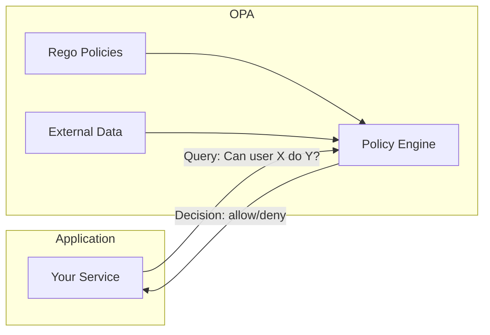
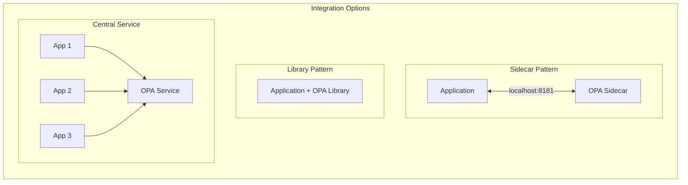

# How to Get Started with Open Policy Agent

Author: [nawazdhandala](https://www.github.com/nawazdhandala)

Tags: Open Policy Agent, OPA, Rego, Policy as Code, Authorization, Security, DevOps

Description: A beginner-friendly guide to Open Policy Agent (OPA) covering installation, Rego policy language basics, and practical examples for building authorization and validation logic.

---

Open Policy Agent (OPA) is a general-purpose policy engine that lets you define rules as code. Instead of scattering authorization logic across your application, you write policies in a declarative language called Rego, and OPA evaluates them consistently. This guide walks you through installing OPA, understanding Rego basics, and building practical policies you can use immediately.

## What is Open Policy Agent?

OPA decouples policy decisions from your application code. Your application asks OPA "is this allowed?" and OPA responds with a decision based on the policies you've defined.



This separation brings several benefits:

| Traditional Approach | OPA Approach |
|---------------------|--------------|
| Authorization scattered across codebase | Centralized policy definitions |
| Changes require code deployment | Policy updates without redeployment |
| Hard to audit who can do what | Policies are readable and auditable |
| Inconsistent enforcement | Single source of truth |

OPA is used for API authorization, Kubernetes admission control, infrastructure validation, and anywhere you need consistent policy enforcement.

## Installing OPA

OPA runs as a standalone binary. Here are the installation options for different platforms.

### macOS

```bash
# Install using Homebrew
brew install opa

# Verify the installation
opa version
```

### Linux

```bash
# Download the latest binary
curl -L -o opa https://openpolicyagent.org/downloads/latest/opa_linux_amd64_static

# Make it executable
chmod 755 opa

# Move to a directory in your PATH
sudo mv opa /usr/local/bin/

# Verify installation
opa version
```

### Docker

```bash
# Run OPA in a container
docker run --rm openpolicyagent/opa:latest version

# Run OPA as a server
docker run -p 8181:8181 openpolicyagent/opa:latest run --server
```

### Windows

```powershell
# Download using PowerShell
Invoke-WebRequest -Uri "https://openpolicyagent.org/downloads/latest/opa_windows_amd64.exe" -OutFile "opa.exe"

# Verify installation
.\opa.exe version
```

## Understanding Rego - The Policy Language

Rego is a declarative language designed specifically for expressing policies. It takes some getting used to if you're coming from imperative languages, but once it clicks, you'll appreciate its expressiveness.

### Basic Concepts

Rego policies consist of rules that produce values. Here's a simple example.

```rego
# policy.rego
# This package groups related rules together
package example

# A simple rule that always returns true
allow := true
```

Save this to a file and evaluate it:

```bash
# Run OPA eval to test the policy
opa eval -d policy.rego "data.example.allow"

# Output:
# {
#   "result": [
#     {
#       "expressions": [
#         {
#           "value": true,
#           "text": "data.example.allow"
#         }
#       ]
#     }
#   ]
# }
```

### Working with Input

Policies become useful when they evaluate input data. OPA receives input as JSON and your policies can reference it.

```rego
# authz.rego
package authz

# Import the 'input' keyword - this represents the data sent to OPA
# The input might look like: {"user": "alice", "action": "read", "resource": "document"}

# Default deny - if no rules match, deny access
default allow := false

# Allow if the user is an admin
allow {
    # Check if the user's role is "admin"
    input.user.role == "admin"
}

# Allow read access for any authenticated user
allow {
    input.action == "read"
    input.user.authenticated == true
}
```

Test this policy with sample input:

```bash
# Create input.json
cat > input.json << 'EOF'
{
    "user": {
        "name": "alice",
        "role": "viewer",
        "authenticated": true
    },
    "action": "read",
    "resource": "document"
}
EOF

# Evaluate the policy with input
opa eval -d authz.rego -i input.json "data.authz.allow"

# Output shows allow = true because:
# - action is "read" AND user.authenticated is true
```

### Understanding Rule Evaluation

Rego rules use implicit AND within a rule body. Every statement must be true for the rule to succeed.

```rego
package authz

# This rule requires ALL conditions to be true
allow {
    input.user.role == "editor"        # Condition 1: user must be an editor
    input.action == "write"             # Condition 2: action must be write
    input.resource.owner == input.user.name  # Condition 3: user must own the resource
}
```

Multiple rules with the same name create an OR relationship - if any rule succeeds, the value is true.

```rego
package authz

default allow := false

# Rule 1: Admins can do anything
allow {
    input.user.role == "admin"
}

# Rule 2: Users can read their own data
allow {
    input.action == "read"
    input.resource.owner == input.user.name
}

# Rule 3: Editors can write to shared resources
allow {
    input.user.role == "editor"
    input.action == "write"
    input.resource.shared == true
}

# If ANY of these rules is satisfied, allow = true
```

### Working with Collections

Rego provides powerful iteration over arrays and objects.

```rego
package example

# Sample input:
# {
#   "user": "alice",
#   "permissions": ["read", "write", "delete"],
#   "requested_action": "write"
# }

# Check if user has the requested permission
allowed {
    # Iterate over permissions array
    # This reads as: "for some permission in input.permissions"
    some permission in input.permissions
    permission == input.requested_action
}

# Alternative syntax using comprehension index
allowed_v2 {
    # The underscore iterates through all indices
    input.permissions[_] == input.requested_action
}
```

Test collection iteration:

```bash
# Create test input
cat > perms.json << 'EOF'
{
    "user": "alice",
    "permissions": ["read", "write"],
    "requested_action": "write"
}
EOF

# Run the policy
opa eval -d example.rego -i perms.json "data.example.allowed"
# Result: true
```

### Generating Values

Rules can produce values beyond just true/false. This is useful for generating lists of violations or computing derived data.

```rego
package validation

# Input: a list of users
# {
#   "users": [
#     {"name": "alice", "age": 25, "email": "alice@example.com"},
#     {"name": "bob", "age": 17, "email": ""},
#     {"name": "charlie", "age": 30, "email": "invalid-email"}
#   ]
# }

# Collect all validation errors using a set comprehension
errors[msg] {
    some user in input.users
    user.age < 18
    msg := sprintf("User %s is under 18 years old", [user.name])
}

errors[msg] {
    some user in input.users
    user.email == ""
    msg := sprintf("User %s has no email address", [user.name])
}

# Check if input is valid (no errors)
valid {
    count(errors) == 0
}
```

## Running OPA as a Server

For production use, OPA typically runs as a server that your applications query via HTTP.

```bash
# Start OPA server with a policy file
opa run --server authz.rego

# OPA now listens on port 8181
```

Query the server from your application:

```bash
# Query the policy via HTTP POST
curl -X POST http://localhost:8181/v1/data/authz/allow \
    -H "Content-Type: application/json" \
    -d '{
        "input": {
            "user": {"name": "alice", "role": "admin", "authenticated": true},
            "action": "delete",
            "resource": "important-doc"
        }
    }'

# Response:
# {"result": true}
```

### Loading External Data

OPA can use external data alongside input for policy decisions. This is useful for role definitions, resource metadata, or any data that doesn't come with each request.

```rego
# rbac.rego
package rbac

# External data loaded into OPA defines roles and their permissions
# data.roles = {
#   "admin": ["read", "write", "delete", "admin"],
#   "editor": ["read", "write"],
#   "viewer": ["read"]
# }

default allow := false

# Get permissions for the user's role from external data
user_permissions := data.roles[input.user.role]

# Check if the requested action is in the user's permissions
allow {
    some permission in user_permissions
    permission == input.action
}
```

Load data when starting OPA:

```bash
# Create roles data file
cat > roles.json << 'EOF'
{
    "roles": {
        "admin": ["read", "write", "delete", "admin"],
        "editor": ["read", "write"],
        "viewer": ["read"]
    }
}
EOF

# Start OPA with both policy and data
opa run --server rbac.rego roles.json
```

## Practical Example - API Authorization

Let's build a complete API authorization policy. This example demonstrates patterns you'll use in real applications.

```rego
# api_authz.rego
package api.authz

import rego.v1

# Default deny all requests
default allow := false

# Define which HTTP methods map to which actions
method_to_action := {
    "GET": "read",
    "HEAD": "read",
    "POST": "create",
    "PUT": "update",
    "PATCH": "update",
    "DELETE": "delete"
}

# Extract the action from the HTTP method
action := method_to_action[input.method]

# Define resource patterns and required permissions
# Format: {path_pattern: {action: required_role}}
resource_permissions := {
    "/api/users": {
        "read": ["viewer", "editor", "admin"],
        "create": ["admin"]
    },
    "/api/documents": {
        "read": ["viewer", "editor", "admin"],
        "create": ["editor", "admin"],
        "update": ["editor", "admin"],
        "delete": ["admin"]
    },
    "/api/settings": {
        "read": ["admin"],
        "update": ["admin"]
    }
}

# Check if user's role is in the allowed roles for this resource and action
allow if {
    # Get the allowed roles for this path and action
    allowed_roles := resource_permissions[input.path][action]

    # Check if user's role is in the allowed list
    some role in allowed_roles
    role == input.user.role
}

# Always allow health check endpoints
allow if {
    input.path == "/health"
}

allow if {
    input.path == "/ready"
}

# Generate a reason for denial (useful for debugging)
reason := msg if {
    not allow
    msg := sprintf(
        "User with role '%s' cannot perform '%s' on '%s'",
        [input.user.role, action, input.path]
    )
}
```

Test the policy:

```bash
# Test an admin deleting a document (should be allowed)
curl -X POST http://localhost:8181/v1/data/api/authz \
    -H "Content-Type: application/json" \
    -d '{
        "input": {
            "method": "DELETE",
            "path": "/api/documents",
            "user": {"role": "admin"}
        }
    }'
# {"result": {"allow": true}}

# Test a viewer trying to delete (should be denied with reason)
curl -X POST http://localhost:8181/v1/data/api/authz \
    -H "Content-Type: application/json" \
    -d '{
        "input": {
            "method": "DELETE",
            "path": "/api/documents",
            "user": {"role": "viewer"}
        }
    }'
# {"result": {"allow": false, "reason": "User with role 'viewer' cannot perform 'delete' on '/api/documents'"}}
```

## Testing Policies

OPA has built-in testing support. Write tests alongside your policies to catch regressions.

```rego
# api_authz_test.rego
package api.authz

import rego.v1

# Test that admins can delete documents
test_admin_can_delete_documents if {
    allow with input as {
        "method": "DELETE",
        "path": "/api/documents",
        "user": {"role": "admin"}
    }
}

# Test that viewers cannot delete documents
test_viewer_cannot_delete_documents if {
    not allow with input as {
        "method": "DELETE",
        "path": "/api/documents",
        "user": {"role": "viewer"}
    }
}

# Test that viewers can read documents
test_viewer_can_read_documents if {
    allow with input as {
        "method": "GET",
        "path": "/api/documents",
        "user": {"role": "viewer"}
    }
}

# Test that health endpoint is always accessible
test_health_endpoint_always_allowed if {
    allow with input as {
        "method": "GET",
        "path": "/health",
        "user": {"role": "anonymous"}
    }
}

# Test the denial reason message
test_denial_reason_message if {
    reason == "User with role 'viewer' cannot perform 'delete' on '/api/documents'" with input as {
        "method": "DELETE",
        "path": "/api/documents",
        "user": {"role": "viewer"}
    }
}
```

Run tests:

```bash
# Run all tests in the current directory
opa test . -v

# Output:
# api_authz_test.rego:
# data.api.authz.test_admin_can_delete_documents: PASS
# data.api.authz.test_viewer_cannot_delete_documents: PASS
# data.api.authz.test_viewer_can_read_documents: PASS
# data.api.authz.test_health_endpoint_always_allowed: PASS
# data.api.authz.test_denial_reason_message: PASS
```

## Integration Patterns

Here's how OPA typically integrates with applications.



**Sidecar Pattern**: OPA runs alongside your application, typically in the same pod in Kubernetes. Low latency, simple deployment.

**Library Pattern**: Embed OPA as a Go library directly in your application. Lowest latency, but only works for Go applications.

**Central Service**: Run OPA as a shared service. Simpler management but adds network latency.

## Where to Go Next

Now that you understand OPA basics, explore these integrations:

- **Kubernetes Admission Control**: Use OPA Gatekeeper to enforce policies on Kubernetes resources before they're created
- **CI/CD Validation**: Use Conftest to validate configurations in your pipelines
- **Service Mesh Authorization**: Integrate OPA with Istio or Envoy for request-level authorization
- **Terraform Validation**: Check infrastructure-as-code against policies before applying

OPA's flexibility means you can apply it wherever you need consistent policy enforcement. Start with simple policies and expand as you become comfortable with Rego. The key insight is that OPA separates the "what is allowed" question from your application code, making policies easier to understand, test, and audit.

## Summary

Open Policy Agent provides a clean way to externalize authorization and validation logic from your applications. The Rego language takes practice, but its declarative nature makes policies readable and testable. Start by running `opa eval` locally to experiment with policies, then graduate to running OPA as a server when you're ready to integrate with your applications.
