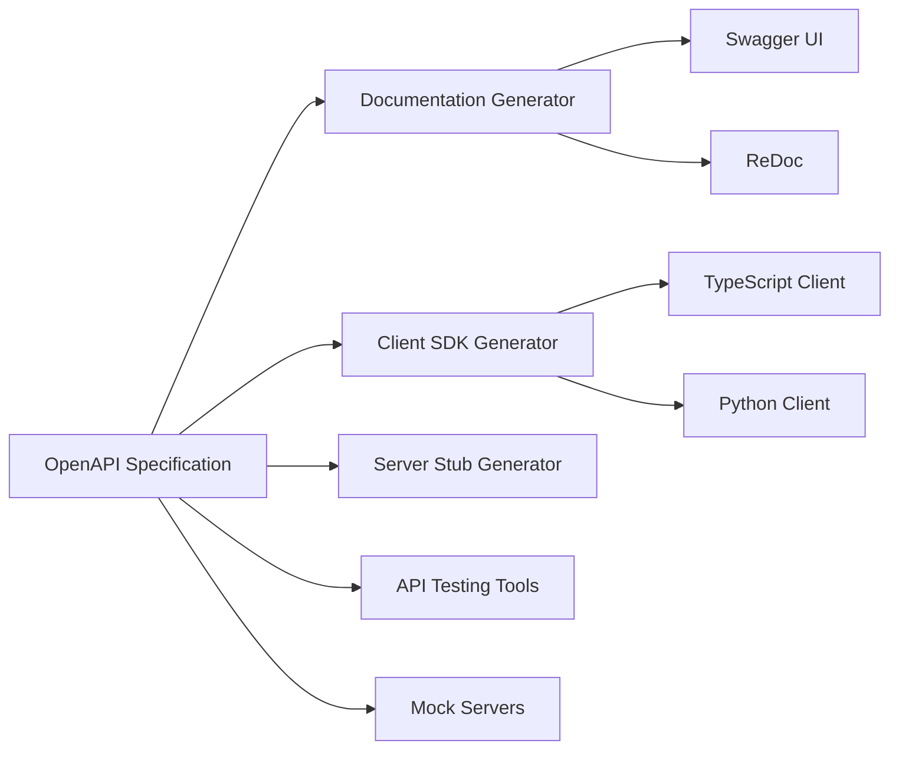
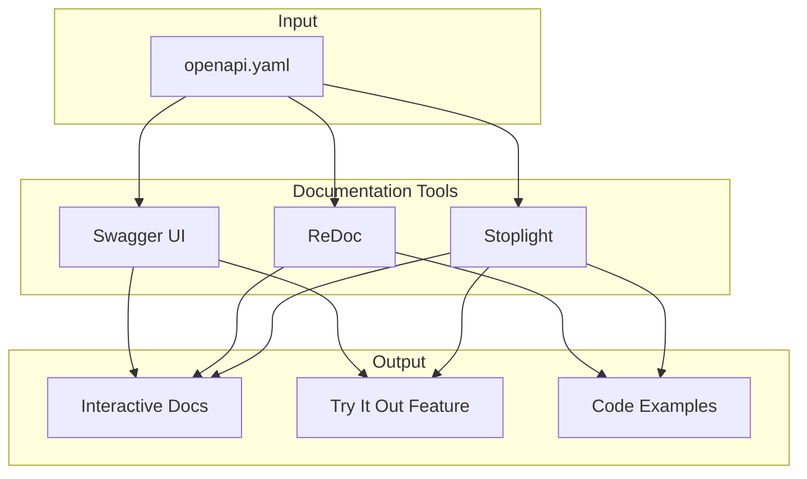
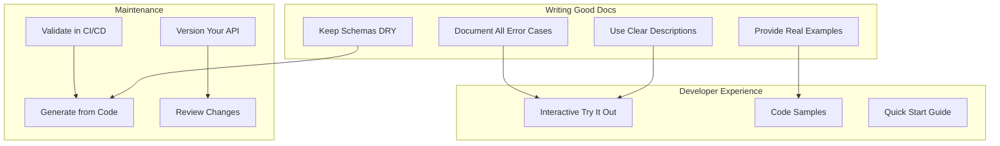

# How to Document REST APIs with OpenAPI

Author: [nawazdhandala](https://www.github.com/nawazdhandala)

Tags: OpenAPI, Swagger, API Documentation, REST API, Developer Experience

Description: Learn how to document REST APIs with OpenAPI specification including schemas, examples, authentication, and generating interactive documentation.

---

OpenAPI (formerly known as Swagger) is the industry standard for describing REST APIs. A well-documented API saves developers hours of guesswork and reduces support requests. This guide covers how to write OpenAPI specifications from scratch and generate useful documentation from them.

## What is OpenAPI?

OpenAPI is a specification format for describing REST APIs. It defines endpoints, request/response formats, authentication methods, and more in a machine-readable format (YAML or JSON). Tools can then use this specification to generate documentation, client SDKs, and server stubs.



## Basic OpenAPI Structure

An OpenAPI document has several main sections. Here is a minimal example:

```yaml
# openapi.yaml
# This is the root of your OpenAPI specification

openapi: 3.0.3  # Specifies the OpenAPI version

# General information about your API
info:
  title: Task Manager API
  description: A simple API for managing tasks and projects
  version: 1.0.0
  contact:
    name: API Support
    email: support@example.com
  license:
    name: MIT
    url: https://opensource.org/licenses/MIT

# Server URLs where the API is hosted
servers:
  - url: https://api.example.com/v1
    description: Production server
  - url: https://staging-api.example.com/v1
    description: Staging server
  - url: http://localhost:3000/v1
    description: Local development

# API endpoints are defined here
paths: {}

# Reusable components (schemas, parameters, etc.)
components: {}
```

## Defining Endpoints

The `paths` section contains all your API endpoints. Each path can have multiple HTTP methods:

```yaml
paths:
  # Endpoint for listing and creating tasks
  /tasks:
    get:
      summary: List all tasks
      description: Returns a paginated list of tasks for the authenticated user
      operationId: listTasks  # Unique identifier for code generation
      tags:
        - Tasks  # Group endpoints by tag
      parameters:
        # Query parameters for filtering and pagination
        - name: status
          in: query
          description: Filter tasks by status
          required: false
          schema:
            type: string
            enum: [pending, in_progress, completed]
        - name: page
          in: query
          description: Page number for pagination
          schema:
            type: integer
            minimum: 1
            default: 1
        - name: limit
          in: query
          description: Number of items per page
          schema:
            type: integer
            minimum: 1
            maximum: 100
            default: 20
      responses:
        '200':
          description: Successful response
          content:
            application/json:
              schema:
                type: object
                properties:
                  data:
                    type: array
                    items:
                      $ref: '#/components/schemas/Task'
                  pagination:
                    $ref: '#/components/schemas/Pagination'
        '401':
          $ref: '#/components/responses/Unauthorized'

    post:
      summary: Create a new task
      description: Creates a new task with the provided details
      operationId: createTask
      tags:
        - Tasks
      requestBody:
        required: true
        content:
          application/json:
            schema:
              $ref: '#/components/schemas/CreateTask'
            # Include an example for better documentation
            example:
              title: Review pull request
              description: Review the authentication module changes
              priority: high
              dueDate: '2024-02-15'
      responses:
        '201':
          description: Task created successfully
          content:
            application/json:
              schema:
                $ref: '#/components/schemas/Task'
        '400':
          $ref: '#/components/responses/BadRequest'
        '401':
          $ref: '#/components/responses/Unauthorized'

  # Endpoint for single task operations
  /tasks/{taskId}:
    parameters:
      # Path parameter shared by all methods on this path
      - name: taskId
        in: path
        required: true
        description: Unique task identifier
        schema:
          type: string
          format: uuid
          example: 550e8400-e29b-41d4-a716-446655440000

    get:
      summary: Get task by ID
      operationId: getTask
      tags:
        - Tasks
      responses:
        '200':
          description: Task details
          content:
            application/json:
              schema:
                $ref: '#/components/schemas/Task'
        '404':
          $ref: '#/components/responses/NotFound'

    put:
      summary: Update a task
      operationId: updateTask
      tags:
        - Tasks
      requestBody:
        required: true
        content:
          application/json:
            schema:
              $ref: '#/components/schemas/UpdateTask'
      responses:
        '200':
          description: Task updated
          content:
            application/json:
              schema:
                $ref: '#/components/schemas/Task'
        '404':
          $ref: '#/components/responses/NotFound'

    delete:
      summary: Delete a task
      operationId: deleteTask
      tags:
        - Tasks
      responses:
        '204':
          description: Task deleted successfully
        '404':
          $ref: '#/components/responses/NotFound'
```

## Defining Schemas

Schemas describe the structure of your data. Put them in the `components/schemas` section for reuse:

```yaml
components:
  schemas:
    # Base task schema with all fields
    Task:
      type: object
      required:
        - id
        - title
        - status
        - createdAt
      properties:
        id:
          type: string
          format: uuid
          description: Unique task identifier
          readOnly: true  # Only in responses, not requests
          example: 550e8400-e29b-41d4-a716-446655440000
        title:
          type: string
          minLength: 1
          maxLength: 200
          description: Task title
          example: Review documentation
        description:
          type: string
          maxLength: 2000
          description: Detailed task description
          nullable: true  # Can be null
        status:
          type: string
          enum: [pending, in_progress, completed]
          description: Current task status
          example: pending
        priority:
          type: string
          enum: [low, medium, high]
          default: medium
          description: Task priority level
        dueDate:
          type: string
          format: date
          description: Due date for the task
          nullable: true
          example: '2024-02-15'
        assignee:
          $ref: '#/components/schemas/UserSummary'
        tags:
          type: array
          items:
            type: string
          description: Labels for categorization
          example: [backend, urgent]
        createdAt:
          type: string
          format: date-time
          readOnly: true
          example: '2024-01-15T10:30:00Z'
        updatedAt:
          type: string
          format: date-time
          readOnly: true

    # Schema for creating tasks (subset of fields)
    CreateTask:
      type: object
      required:
        - title
      properties:
        title:
          type: string
          minLength: 1
          maxLength: 200
        description:
          type: string
          maxLength: 2000
        priority:
          type: string
          enum: [low, medium, high]
          default: medium
        dueDate:
          type: string
          format: date
        assigneeId:
          type: string
          format: uuid
        tags:
          type: array
          items:
            type: string

    # Schema for updating tasks (all fields optional)
    UpdateTask:
      type: object
      properties:
        title:
          type: string
          minLength: 1
          maxLength: 200
        description:
          type: string
          maxLength: 2000
          nullable: true
        status:
          type: string
          enum: [pending, in_progress, completed]
        priority:
          type: string
          enum: [low, medium, high]
        dueDate:
          type: string
          format: date
          nullable: true
        assigneeId:
          type: string
          format: uuid
          nullable: true
        tags:
          type: array
          items:
            type: string

    # Embedded user information
    UserSummary:
      type: object
      properties:
        id:
          type: string
          format: uuid
        name:
          type: string
        email:
          type: string
          format: email

    # Pagination metadata
    Pagination:
      type: object
      properties:
        page:
          type: integer
          example: 1
        limit:
          type: integer
          example: 20
        total:
          type: integer
          description: Total number of items
          example: 150
        totalPages:
          type: integer
          example: 8

    # Standard error response
    Error:
      type: object
      required:
        - code
        - message
      properties:
        code:
          type: string
          description: Error code for programmatic handling
          example: VALIDATION_ERROR
        message:
          type: string
          description: Human-readable error message
          example: The title field is required
        details:
          type: array
          items:
            type: object
            properties:
              field:
                type: string
              message:
                type: string
          description: Field-level error details
```

## Documenting Authentication

OpenAPI supports multiple authentication schemes. Define them in `components/securitySchemes`:

```yaml
components:
  securitySchemes:
    # JWT Bearer token authentication
    bearerAuth:
      type: http
      scheme: bearer
      bearerFormat: JWT
      description: |
        JWT token obtained from the /auth/login endpoint.
        Include in the Authorization header: `Bearer <token>`

    # API Key authentication
    apiKeyAuth:
      type: apiKey
      in: header
      name: X-API-Key
      description: API key for server-to-server communication

    # OAuth 2.0 with authorization code flow
    oauth2:
      type: oauth2
      flows:
        authorizationCode:
          authorizationUrl: https://auth.example.com/oauth/authorize
          tokenUrl: https://auth.example.com/oauth/token
          scopes:
            read:tasks: Read tasks
            write:tasks: Create and update tasks
            delete:tasks: Delete tasks

# Apply authentication globally to all endpoints
security:
  - bearerAuth: []

# Or apply to specific endpoints
paths:
  /tasks:
    get:
      security:
        - bearerAuth: []
        - oauth2: [read:tasks]
      # ... rest of endpoint definition

  # Public endpoint with no authentication
  /health:
    get:
      security: []  # Override global security
      summary: Health check
      responses:
        '200':
          description: Service is healthy
```

## Reusable Response Definitions

Define common responses to avoid repetition:

```yaml
components:
  responses:
    # 400 Bad Request
    BadRequest:
      description: Invalid request parameters or body
      content:
        application/json:
          schema:
            $ref: '#/components/schemas/Error'
          example:
            code: VALIDATION_ERROR
            message: Request validation failed
            details:
              - field: title
                message: Title is required
              - field: priority
                message: Must be one of: low, medium, high

    # 401 Unauthorized
    Unauthorized:
      description: Authentication required or token invalid
      content:
        application/json:
          schema:
            $ref: '#/components/schemas/Error'
          example:
            code: UNAUTHORIZED
            message: Invalid or expired authentication token

    # 403 Forbidden
    Forbidden:
      description: Insufficient permissions
      content:
        application/json:
          schema:
            $ref: '#/components/schemas/Error'
          example:
            code: FORBIDDEN
            message: You do not have permission to access this resource

    # 404 Not Found
    NotFound:
      description: Resource not found
      content:
        application/json:
          schema:
            $ref: '#/components/schemas/Error'
          example:
            code: NOT_FOUND
            message: The requested resource was not found

    # 429 Rate Limited
    RateLimited:
      description: Too many requests
      headers:
        Retry-After:
          schema:
            type: integer
          description: Seconds to wait before retrying
      content:
        application/json:
          schema:
            $ref: '#/components/schemas/Error'
          example:
            code: RATE_LIMITED
            message: Too many requests. Please retry after 60 seconds.

    # 500 Internal Server Error
    InternalError:
      description: Internal server error
      content:
        application/json:
          schema:
            $ref: '#/components/schemas/Error'
          example:
            code: INTERNAL_ERROR
            message: An unexpected error occurred
```

## Adding Examples

Good examples make documentation much more useful. OpenAPI supports multiple example formats:

```yaml
paths:
  /tasks:
    post:
      requestBody:
        content:
          application/json:
            schema:
              $ref: '#/components/schemas/CreateTask'
            # Multiple named examples
            examples:
              simpleTask:
                summary: Simple task
                description: A basic task with just a title
                value:
                  title: Fix login bug
              detailedTask:
                summary: Detailed task
                description: Task with all fields populated
                value:
                  title: Implement user authentication
                  description: |
                    Add JWT-based authentication to the API.
                    Include refresh token support.
                  priority: high
                  dueDate: '2024-02-28'
                  assigneeId: 550e8400-e29b-41d4-a716-446655440000
                  tags:
                    - security
                    - backend
                    - urgent
      responses:
        '201':
          content:
            application/json:
              examples:
                created:
                  summary: Newly created task
                  value:
                    id: 7c9e6679-7425-40de-944b-e07fc1f90ae7
                    title: Implement user authentication
                    description: Add JWT-based authentication to the API.
                    status: pending
                    priority: high
                    dueDate: '2024-02-28'
                    tags:
                      - security
                      - backend
                    createdAt: '2024-01-20T14:30:00Z'
```

## File Upload Documentation

Documenting file uploads requires the `multipart/form-data` content type:

```yaml
paths:
  /tasks/{taskId}/attachments:
    post:
      summary: Upload attachment
      description: Upload a file attachment to a task
      tags:
        - Attachments
      parameters:
        - name: taskId
          in: path
          required: true
          schema:
            type: string
            format: uuid
      requestBody:
        required: true
        content:
          multipart/form-data:
            schema:
              type: object
              required:
                - file
              properties:
                file:
                  type: string
                  format: binary
                  description: File to upload (max 10MB)
                description:
                  type: string
                  description: Optional description for the attachment
            encoding:
              file:
                contentType: application/pdf, image/png, image/jpeg
      responses:
        '201':
          description: File uploaded successfully
          content:
            application/json:
              schema:
                type: object
                properties:
                  id:
                    type: string
                    format: uuid
                  filename:
                    type: string
                  size:
                    type: integer
                    description: File size in bytes
                  url:
                    type: string
                    format: uri
        '413':
          description: File too large
```

## Generating Interactive Documentation

Once you have your OpenAPI specification, you can generate interactive documentation using tools like Swagger UI or ReDoc.



### Serving Swagger UI with Node.js

```javascript
// server.js
// Serve OpenAPI documentation using Swagger UI

const express = require('express');
const swaggerUi = require('swagger-ui-express');
const YAML = require('yamljs');
const path = require('path');

const app = express();

// Load the OpenAPI specification from YAML file
const openapiSpec = YAML.load(path.join(__dirname, 'openapi.yaml'));

// Configure Swagger UI options
const swaggerOptions = {
    // Show the "Try it out" button by default
    swaggerOptions: {
        tryItOutEnabled: true,
        // Persist authorization across page refreshes
        persistAuthorization: true,
        // Show request duration in responses
        displayRequestDuration: true,
        // Enable deep linking for sharing specific endpoints
        deepLinking: true,
        // Sort endpoints alphabetically
        operationsSorter: 'alpha',
        // Sort tags alphabetically
        tagsSorter: 'alpha'
    },
    // Custom page title
    customSiteTitle: 'Task Manager API Documentation',
    // Hide the Swagger UI top bar
    customCss: '.swagger-ui .topbar { display: none }'
};

// Serve Swagger UI at /docs
app.use('/docs', swaggerUi.serve, swaggerUi.setup(openapiSpec, swaggerOptions));

// Serve raw OpenAPI spec as JSON
app.get('/openapi.json', (req, res) => {
    res.json(openapiSpec);
});

// Serve raw OpenAPI spec as YAML
app.get('/openapi.yaml', (req, res) => {
    res.type('text/yaml');
    res.sendFile(path.join(__dirname, 'openapi.yaml'));
});

app.listen(3000, () => {
    console.log('API docs available at http://localhost:3000/docs');
});
```

### Serving ReDoc

ReDoc provides a cleaner, more readable documentation format:

```html
<!-- redoc.html -->
<!DOCTYPE html>
<html>
<head>
    <title>Task Manager API Documentation</title>
    <meta charset="utf-8"/>
    <meta name="viewport" content="width=device-width, initial-scale=1">
    <!-- ReDoc styles -->
    <link href="https://fonts.googleapis.com/css?family=Montserrat:300,400,700|Roboto:300,400,700" rel="stylesheet">
    <style>
        body { margin: 0; padding: 0; }
    </style>
</head>
<body>
    <!-- ReDoc element pointing to OpenAPI spec -->
    <redoc spec-url='/openapi.yaml'
           hide-download-button="false"
           theme='{
               "colors": {
                   "primary": { "main": "#0066cc" }
               },
               "typography": {
                   "fontSize": "15px",
                   "headings": { "fontFamily": "Montserrat, sans-serif" }
               }
           }'>
    </redoc>
    <script src="https://cdn.redoc.ly/redoc/latest/bundles/redoc.standalone.js"></script>
</body>
</html>
```

## Validating Your OpenAPI Specification

Always validate your OpenAPI spec to catch errors early:

```bash
# Install the OpenAPI CLI validator
npm install -g @apidevtools/swagger-cli

# Validate the specification
swagger-cli validate openapi.yaml

# Bundle multiple files into one (if using $ref to external files)
swagger-cli bundle openapi.yaml -o bundled-openapi.yaml
```

You can also validate programmatically:

```javascript
// validate-spec.js
// Validate OpenAPI specification before deployment

const SwaggerParser = require('@apidevtools/swagger-parser');

async function validateSpec() {
    try {
        // Parse and validate the OpenAPI specification
        const api = await SwaggerParser.validate('openapi.yaml');

        console.log('API name:', api.info.title);
        console.log('Version:', api.info.version);
        console.log('Validation passed!');

        // List all endpoints
        console.log('\nEndpoints:');
        for (const [path, methods] of Object.entries(api.paths)) {
            for (const method of Object.keys(methods)) {
                if (['get', 'post', 'put', 'patch', 'delete'].includes(method)) {
                    console.log(`  ${method.toUpperCase()} ${path}`);
                }
            }
        }

        return true;
    } catch (error) {
        console.error('Validation failed:', error.message);
        return false;
    }
}

validateSpec();
```

## Generating Client SDKs

One major benefit of OpenAPI is automatic client generation. OpenAPI Generator supports many languages:

```bash
# Install OpenAPI Generator
npm install -g @openapitools/openapi-generator-cli

# Generate TypeScript client
openapi-generator-cli generate \
    -i openapi.yaml \
    -g typescript-fetch \
    -o ./generated/typescript-client

# Generate Python client
openapi-generator-cli generate \
    -i openapi.yaml \
    -g python \
    -o ./generated/python-client

# Generate Go client
openapi-generator-cli generate \
    -i openapi.yaml \
    -g go \
    -o ./generated/go-client
```

The generated TypeScript client can be used like this:

```typescript
// Using the generated TypeScript client
import { TasksApi, Configuration } from './generated/typescript-client';

// Configure the API client with authentication
const config = new Configuration({
    basePath: 'https://api.example.com/v1',
    accessToken: 'your-jwt-token'
});

const tasksApi = new TasksApi(config);

// List tasks with type safety
async function listTasks() {
    const response = await tasksApi.listTasks({
        status: 'pending',
        page: 1,
        limit: 20
    });

    // TypeScript knows the exact shape of the response
    for (const task of response.data) {
        console.log(`${task.title} - ${task.status}`);
    }
}

// Create a task with full type checking
async function createTask() {
    const newTask = await tasksApi.createTask({
        createTask: {
            title: 'Review documentation',
            priority: 'high',
            dueDate: '2024-02-15'
        }
    });

    console.log('Created task:', newTask.id);
}
```

## Best Practices

Here are recommendations for maintaining high-quality API documentation:



1. **Write descriptions for everything** - Include descriptions for endpoints, parameters, schemas, and enum values
2. **Use consistent naming** - Follow a naming convention for operationIds and schema names
3. **Provide realistic examples** - Use examples that developers can copy and modify
4. **Document error responses** - Include all possible error codes and their meanings
5. **Version your API** - Use URL versioning (/v1/) or header versioning
6. **Validate in CI/CD** - Catch specification errors before deployment
7. **Keep docs in sync** - Generate from code annotations or validate against tests

## Summary

OpenAPI provides a standard way to document REST APIs that both humans and machines can understand. Start with the basic structure including info, servers, and paths. Define reusable schemas in components for request/response bodies. Document authentication schemes and apply them globally or per-endpoint. Use examples liberally to help developers understand expected formats. Generate interactive documentation with Swagger UI or ReDoc, and generate client SDKs to save integration time. Validate your specification in CI/CD to catch errors early.
