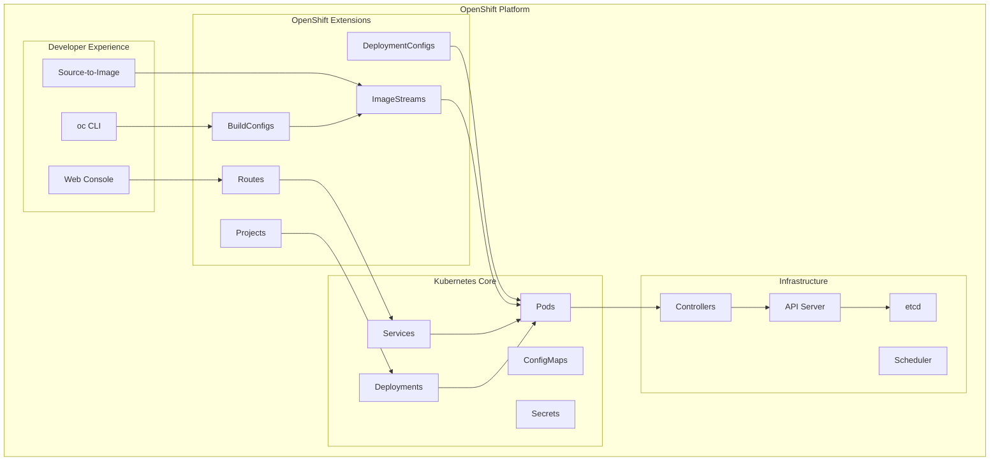
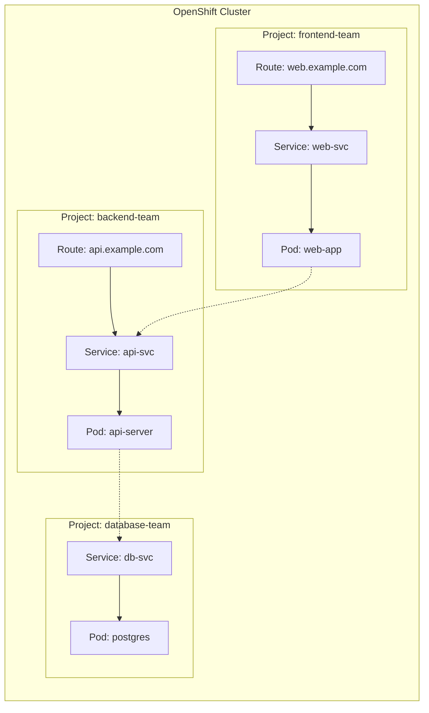
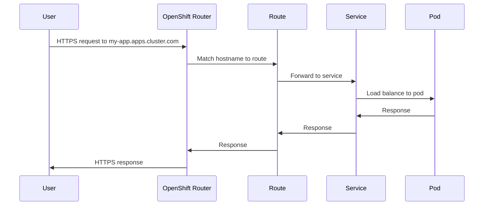
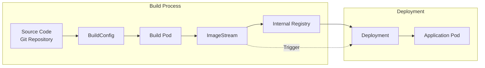
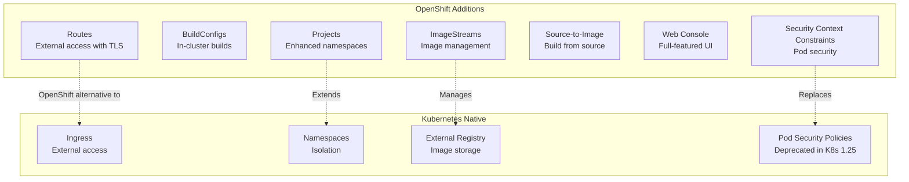

# How to Get Started with OpenShift

Author: [nawazdhandala](https://www.github.com/nawazdhandala)

Tags: OpenShift, Kubernetes, Red Hat, Container Platform, DevOps

Description: A beginner's guide to OpenShift covering projects, deployments, routes, builds, and the differences from vanilla Kubernetes.

---

OpenShift is Red Hat's enterprise Kubernetes platform that adds developer-friendly features, built-in CI/CD, and enhanced security on top of vanilla Kubernetes. If you have worked with Kubernetes before, you will find OpenShift familiar but with several additional concepts and tools that make deploying applications easier.

This guide will walk you through the fundamentals of OpenShift, including projects, deployments, routes, builds, and how it differs from standard Kubernetes.

## OpenShift Architecture Overview

Before diving into the hands-on work, let's understand how OpenShift extends Kubernetes:



## Installing the OpenShift CLI (oc)

The `oc` command-line tool is your primary interface for interacting with OpenShift. It extends `kubectl` with OpenShift-specific commands.

### Installing on macOS

```bash
# Using Homebrew
brew install openshift-cli

# Verify the installation
oc version
```

### Installing on Linux

```bash
# Download the latest release
curl -LO https://mirror.openshift.com/pub/openshift-v4/clients/ocp/latest/openshift-client-linux.tar.gz

# Extract the archive
tar -xvf openshift-client-linux.tar.gz

# Move the binary to your PATH
sudo mv oc /usr/local/bin/

# Verify the installation
oc version
```

### Installing on Windows

```powershell
# Download from the OpenShift mirror and extract
# Then add to your PATH environment variable

# Verify the installation
oc version
```

## Logging into OpenShift

Once you have the CLI installed, you need to authenticate with your OpenShift cluster:

```bash
# Login using username and password
oc login https://api.your-cluster.example.com:6443 -u your-username -p your-password

# Login using a token (preferred for automation)
# Get your token from the web console: User menu > Copy login command
oc login --token=sha256~your-token-here --server=https://api.your-cluster.example.com:6443
```

## Understanding Projects

Projects in OpenShift are namespaces with additional features like resource quotas and role-based access control (RBAC) policies applied by default. They provide isolation between different applications or teams.



### Working with Projects

```bash
# Create a new project
oc new-project my-application --description="My first OpenShift app" --display-name="My Application"

# List all projects you have access to
oc get projects

# Switch to a different project
oc project my-application

# View current project
oc project

# Delete a project (be careful - this deletes everything in it)
oc delete project my-application
```

## Deploying Your First Application

OpenShift provides multiple ways to deploy applications. Let's explore the most common methods.

### Method 1: Deploy from Container Image

The simplest way to deploy is using an existing container image:

```bash
# Deploy nginx from Docker Hub
# The --name flag sets the application name
# The --port flag specifies which port the container listens on
oc new-app --name=my-nginx --docker-image=nginx:latest --port=80

# Check the deployment status
oc get pods

# Watch the pods as they start up
oc get pods -w
```

### Method 2: Deploy from Source Code (Source-to-Image)

OpenShift's Source-to-Image (S2I) feature builds container images directly from your source code:

```bash
# Deploy a Python application from GitHub
# OpenShift automatically detects the language and uses the appropriate builder image
oc new-app python~https://github.com/example/python-app.git --name=python-api

# Deploy a Node.js application
oc new-app nodejs~https://github.com/example/nodejs-app.git --name=node-web

# Check build progress
oc logs -f buildconfig/python-api
```

### Method 3: Deploy from YAML Manifests

For production workloads, you will typically use YAML manifests:

```yaml
# deployment.yaml
# This creates a standard Kubernetes Deployment in OpenShift
apiVersion: apps/v1
kind: Deployment
metadata:
  name: my-web-app
  labels:
    app: my-web-app
spec:
  replicas: 3  # Run 3 instances for high availability
  selector:
    matchLabels:
      app: my-web-app
  template:
    metadata:
      labels:
        app: my-web-app
    spec:
      containers:
      - name: web
        image: nginx:1.21
        ports:
        - containerPort: 80
        resources:
          # Always set resource limits in OpenShift
          # This prevents any single pod from consuming all cluster resources
          limits:
            memory: "128Mi"
            cpu: "500m"
          requests:
            memory: "64Mi"
            cpu: "250m"
        # Health checks ensure traffic only goes to healthy pods
        readinessProbe:
          httpGet:
            path: /
            port: 80
          initialDelaySeconds: 5
          periodSeconds: 10
        livenessProbe:
          httpGet:
            path: /
            port: 80
          initialDelaySeconds: 15
          periodSeconds: 20
```

Apply the manifest:

```bash
# Create resources from the YAML file
oc apply -f deployment.yaml

# Verify the deployment
oc get deployment my-web-app

# Check the pods
oc get pods -l app=my-web-app
```

## Exposing Applications with Services and Routes

### Creating a Service

Services provide stable networking for your pods:

```yaml
# service.yaml
# Services give pods a stable DNS name and load balance traffic
apiVersion: v1
kind: Service
metadata:
  name: my-web-app
spec:
  selector:
    app: my-web-app  # Must match the pod labels
  ports:
  - port: 80         # Port the service listens on
    targetPort: 80   # Port on the container to forward to
  type: ClusterIP    # Only accessible within the cluster
```

```bash
# Apply the service
oc apply -f service.yaml

# Or create it imperatively
oc expose deployment/my-web-app --port=80
```

### Creating a Route

Routes are an OpenShift-specific resource that expose services externally with automatic TLS termination:



```yaml
# route.yaml
# Routes provide external access with automatic TLS
apiVersion: route.openshift.io/v1
kind: Route
metadata:
  name: my-web-app
spec:
  # The hostname will be: my-web-app-projectname.apps.cluster.example.com
  # You can also specify a custom hostname with: host: custom.example.com
  to:
    kind: Service
    name: my-web-app
  port:
    targetPort: 80
  tls:
    # edge termination means TLS is terminated at the router
    # and traffic to pods is unencrypted (internal cluster network)
    termination: edge
    insecureEdgeTerminationPolicy: Redirect  # Redirect HTTP to HTTPS
```

```bash
# Apply the route
oc apply -f route.yaml

# Or create it imperatively
oc expose service/my-web-app

# Get the route URL
oc get route my-web-app

# Test the route
curl https://my-web-app-myproject.apps.cluster.example.com
```

## Working with BuildConfigs

BuildConfigs define how to build your application images within OpenShift:



```yaml
# buildconfig.yaml
# BuildConfig defines how to build container images from source
apiVersion: build.openshift.io/v1
kind: BuildConfig
metadata:
  name: my-python-app
spec:
  # How many builds to keep for debugging
  successfulBuildsHistoryLimit: 5
  failedBuildsHistoryLimit: 5

  source:
    type: Git
    git:
      uri: https://github.com/your-org/your-repo.git
      ref: main  # Branch to build from
    # Optional: specify a subdirectory containing the code
    contextDir: /app

  strategy:
    type: Source
    sourceStrategy:
      # Use the Python 3.9 builder image from Red Hat
      from:
        kind: ImageStreamTag
        namespace: openshift
        name: python:3.9-ubi8
      # Environment variables available during the build
      env:
      - name: PIP_INDEX_URL
        value: "https://pypi.org/simple"

  output:
    # Push the built image to this ImageStream
    to:
      kind: ImageStreamTag
      name: my-python-app:latest

  triggers:
  # Automatically rebuild when the builder image updates
  - type: ImageChange
  # Allow manual builds via oc start-build
  - type: ConfigChange
  # Webhook for GitHub integration
  - type: GitHub
    github:
      secretReference:
        name: github-webhook-secret
```

### Managing Builds

```bash
# Start a new build
oc start-build my-python-app

# Start a build and follow the logs
oc start-build my-python-app --follow

# Start a build from local source code (useful for testing)
oc start-build my-python-app --from-dir=./my-app

# List all builds
oc get builds

# View build logs
oc logs build/my-python-app-1

# Cancel a running build
oc cancel-build my-python-app-1
```

## ImageStreams

ImageStreams are an OpenShift abstraction that track container images and trigger deployments when images change:

```yaml
# imagestream.yaml
# ImageStreams track images and can trigger rebuilds/redeploys
apiVersion: image.openshift.io/v1
kind: ImageStream
metadata:
  name: my-python-app
spec:
  lookupPolicy:
    # If true, pods can reference this imagestream directly
    local: true
  tags:
  - name: latest
    from:
      kind: DockerImage
      name: my-registry.example.com/my-python-app:latest
    importPolicy:
      # Periodically check for updates
      scheduled: true
    referencePolicy:
      type: Local
```

```bash
# List image streams
oc get imagestreams

# Describe an imagestream to see all tags and their history
oc describe imagestream my-python-app

# Import an external image into an imagestream
oc import-image my-app:v1.0 --from=docker.io/myorg/myapp:v1.0 --confirm

# Tag an image within the imagestream
oc tag my-app:latest my-app:production
```

## DeploymentConfigs vs Deployments

OpenShift originally used DeploymentConfigs before Kubernetes had mature Deployment support. Today, you should use standard Kubernetes Deployments, but you may encounter DeploymentConfigs in older projects:

| Feature | Deployment (Kubernetes) | DeploymentConfig (OpenShift) |
|---------|------------------------|------------------------------|
| Origin | Kubernetes native | OpenShift specific |
| Triggers | Manual or external tools | Built-in ImageChange triggers |
| Rollback | `kubectl rollout undo` | `oc rollback` |
| Hooks | No native support | Lifecycle hooks (pre, mid, post) |
| Recommendation | Use for new projects | Legacy, avoid for new projects |

```yaml
# Modern approach: Use Kubernetes Deployment with ImageStream
apiVersion: apps/v1
kind: Deployment
metadata:
  name: my-app
  annotations:
    # This annotation enables automatic rollout when the imagestream updates
    image.openshift.io/triggers: |
      [{"from":{"kind":"ImageStreamTag","name":"my-app:latest"},"fieldPath":"spec.template.spec.containers[?(@.name==\"my-app\")].image"}]
spec:
  replicas: 2
  selector:
    matchLabels:
      app: my-app
  template:
    metadata:
      labels:
        app: my-app
    spec:
      containers:
      - name: my-app
        # Reference the imagestream
        image: my-app:latest
        ports:
        - containerPort: 8080
```

## OpenShift vs Kubernetes: Key Differences



### Security Context Constraints (SCCs)

OpenShift has stricter security defaults than vanilla Kubernetes:

```bash
# List available SCCs
oc get scc

# Check which SCC a pod is using
oc get pod my-pod -o yaml | grep scc

# Grant a service account permission to use a specific SCC
# (Only do this if you understand the security implications)
oc adm policy add-scc-to-user anyuid -z my-service-account
```

By default, OpenShift:
- Runs containers as a random, non-root UID
- Prevents privileged containers
- Drops all Linux capabilities
- Uses SELinux for additional isolation

## Useful Commands Reference

```bash
# Cluster information
oc cluster-info
oc get nodes
oc describe node <node-name>

# Project/namespace operations
oc new-project <name>
oc project <name>
oc delete project <name>

# Application deployment
oc new-app <image>
oc new-app <builder>~<git-url>
oc expose svc/<name>

# Viewing resources
oc get all                    # Get all resources in current project
oc get pods -o wide           # Get pods with additional info
oc describe pod <name>        # Detailed pod information
oc logs <pod-name>            # View pod logs
oc logs -f <pod-name>         # Stream pod logs

# Debugging
oc debug deployment/<name>    # Start debug pod with deployment config
oc rsh <pod-name>             # Remote shell into a pod
oc exec <pod-name> -- <cmd>   # Execute command in pod
oc port-forward <pod> 8080:80 # Forward local port to pod

# Scaling
oc scale deployment/<name> --replicas=3

# Updates and rollbacks
oc rollout status deployment/<name>
oc rollout history deployment/<name>
oc rollout undo deployment/<name>

# Resource management
oc delete pod <name>
oc delete all -l app=<label>  # Delete all resources with label
```

## Complete Example: Deploying a Python Flask Application

Let's put everything together with a complete example:

```bash
# 1. Create a new project
oc new-project flask-demo

# 2. Deploy directly from GitHub using S2I
oc new-app python:3.9-ubi8~https://github.com/sclorg/django-ex.git --name=flask-app

# 3. Watch the build progress
oc logs -f buildconfig/flask-app

# 4. Once built, expose the application
oc expose service/flask-app

# 5. Get the route URL
oc get route flask-app -o jsonpath='{.spec.host}'

# 6. Add TLS to the route
oc patch route flask-app -p '{"spec":{"tls":{"termination":"edge"}}}'

# 7. Scale up the application
oc scale deployment/flask-app --replicas=3

# 8. Set up autoscaling based on CPU
oc autoscale deployment/flask-app --min=2 --max=10 --cpu-percent=80
```

## Summary

OpenShift provides a production-ready Kubernetes platform with additional features that simplify the developer experience:

- **Projects** provide namespace isolation with built-in RBAC
- **Routes** handle external traffic with automatic TLS termination
- **BuildConfigs** enable in-cluster image builds from source code
- **ImageStreams** manage container images and trigger deployments
- **Security Context Constraints** enforce pod security by default

While OpenShift adds complexity, it also adds value for enterprise environments that need integrated CI/CD, enhanced security, and a polished web console. Start with the basics covered in this guide, and explore more advanced features like Operators and GitOps as you become comfortable with the platform.
