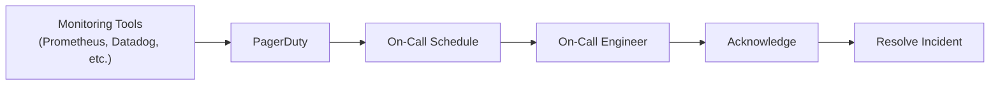
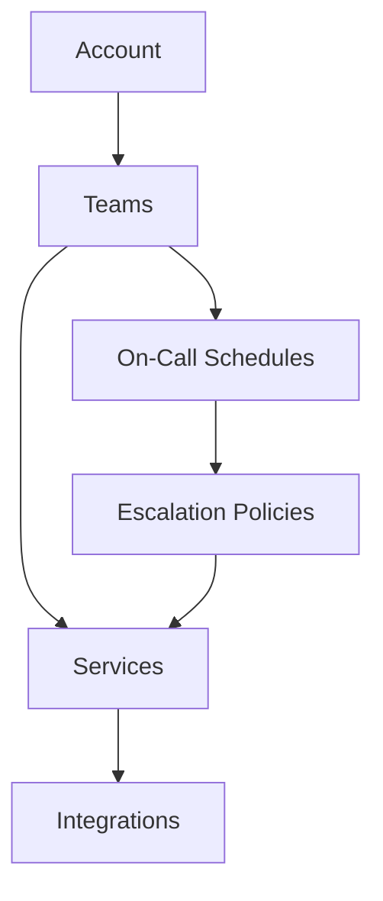
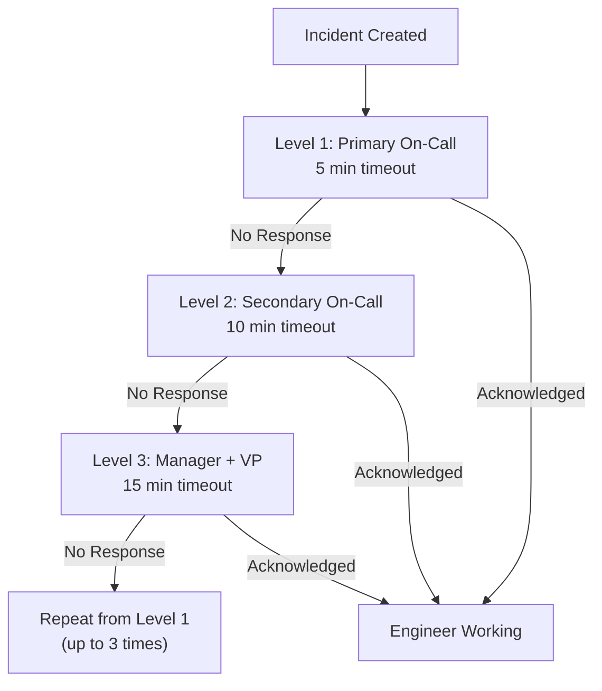

# How to Set Up PagerDuty for Incident Management

Author: [nawazdhandala](https://www.github.com/nawazdhandala)

Tags: PagerDuty, Incident Management, On-Call, Alerting, DevOps, SRE, Monitoring, Escalation Policies

Description: Learn how to set up PagerDuty for incident management from scratch. This guide covers service configuration, escalation policies, on-call schedules, integrations with monitoring tools, and best practices for effective incident response.

---

> When production goes down at 3 AM, every second counts. PagerDuty bridges the gap between your monitoring tools and the right engineer. A well-configured incident management system can mean the difference between a 5-minute fix and hours of downtime.

Proper incident management is not about getting more alerts - it is about getting the right alerts to the right people at the right time.

---

## What is PagerDuty?

PagerDuty is an incident management platform that connects monitoring systems to on-call engineers. When something breaks, PagerDuty ensures someone qualified gets notified immediately through phone calls, SMS, push notifications, or email.



The platform handles alert deduplication, escalation when someone does not respond, and provides a central dashboard for tracking all incidents.

---

## Creating Your PagerDuty Account

Start by signing up at [pagerduty.com](https://www.pagerduty.com). PagerDuty offers a free tier for small teams with up to 5 users, which is enough to get started.

After signing up:

1. Verify your email address
2. Set up your profile with contact methods (phone, SMS, email)
3. Download the PagerDuty mobile app for iOS or Android
4. Test your notification preferences to ensure alerts reach you

Your contact methods determine how PagerDuty reaches you. Configure multiple methods for redundancy - if your phone is on silent, SMS might still come through, or vice versa.

---

## Understanding the PagerDuty Hierarchy

Before configuring anything, understand how PagerDuty organizes things:



- **Account**: Your organization's PagerDuty instance
- **Teams**: Groups of users (e.g., Platform Team, Backend Team)
- **Services**: Represent components you monitor (e.g., Payment API, User Database)
- **Integrations**: Connect monitoring tools to services
- **Schedules**: Define who is on-call and when
- **Escalation Policies**: Define what happens when someone does not respond

---

## Setting Up Your First Service

Services represent the systems or components that can trigger incidents. Create one service per logical component of your infrastructure.

### Create a Service

1. Navigate to **Services** in the left sidebar
2. Click **New Service**
3. Fill in the details:

```
Name: Payment Processing API
Description: Handles all payment transactions for the e-commerce platform
```

4. Select an escalation policy (we will create one shortly)
5. Choose your integration type

### Configure Service Settings

Each service has settings that affect how incidents are handled:

```yaml
# Service Configuration Options
Alert Creation: Create alerts and incidents
Incident Urgency:
  - High: Critical production issues
  - Low: Non-critical warnings
  - Dynamic: Based on support hours

Alert Grouping:
  Type: Time-based
  Duration: 2 minutes  # Group alerts within 2-minute windows

Auto-Resolution:
  Enabled: true
  Timeout: 4 hours  # Auto-resolve if no updates
```

Alert grouping is essential. Without it, a cascading failure can generate hundreds of duplicate alerts. Time-based grouping collects related alerts into a single incident.

---

## Creating On-Call Schedules

Schedules define who is available to respond to incidents at any given time. A good schedule distributes the on-call burden fairly and ensures coverage 24/7.

### Basic Weekly Rotation

Navigate to **People > Schedules** and create a new schedule:

```yaml
Schedule Name: Backend Team Primary
Timezone: America/New_York
Rotation Type: Weekly
Handoff Time: Monday 09:00

Participants:
  - alice@company.com
  - bob@company.com
  - carol@company.com
  - dave@company.com
```

With four engineers rotating weekly, each person is on-call for one week every month.

### Multi-Layer Schedule

For critical services, create multiple schedule layers:

```yaml
Schedule: Backend Team On-Call

Layer 1 - Business Hours (Primary):
  Rotation: Daily
  Hours: 09:00 - 18:00 (Monday - Friday)
  Participants: [Full team rotation]

Layer 2 - After Hours:
  Rotation: Weekly
  Hours: 18:00 - 09:00 (Weekdays) + Weekends
  Participants: [Volunteers or rotating subset]

Layer 3 - Holiday Coverage:
  Override layer for specific dates
```

This structure acknowledges that overnight and weekend on-call is more disruptive than business hours coverage.

---

## Building Escalation Policies

Escalation policies define what happens when the primary on-call does not respond. They are your safety net.

### Create an Escalation Policy

Navigate to **People > Escalation Policies**:

```yaml
Policy Name: Backend Team Escalation
Repeat Policy: 3 times

Level 1:
  Notify: Backend Team Primary Schedule
  Timeout: 5 minutes

Level 2:
  Notify: Backend Team Secondary Schedule
  Timeout: 10 minutes

Level 3:
  Notify:
    - engineering-manager@company.com
    - vp-engineering@company.com
  Timeout: 15 minutes
```

### Escalation Policy Best Practices



Key principles:
- Keep Level 1 timeout short (5 minutes) - if someone is asleep, waiting longer will not help
- Include a secondary on-call for redundancy
- Escalate to management as a last resort, not first
- Set a repeat limit to avoid infinite escalation loops

---

## Integrating Monitoring Tools

PagerDuty's value comes from connecting it to your monitoring stack. Here are common integrations:

### Prometheus Alertmanager

Configure Alertmanager to send alerts to PagerDuty:

```yaml
# alertmanager.yml
global:
  resolve_timeout: 5m

route:
  receiver: 'pagerduty-critical'
  routes:
    - match:
        severity: critical
      receiver: 'pagerduty-critical'
    - match:
        severity: warning
      receiver: 'pagerduty-warning'

receivers:
  - name: 'pagerduty-critical'
    pagerduty_configs:
      - service_key: '<YOUR_PAGERDUTY_INTEGRATION_KEY>'
        severity: critical
        description: '{{ .CommonAnnotations.summary }}'
        details:
          firing: '{{ .Alerts.Firing | len }}'
          resolved: '{{ .Alerts.Resolved | len }}'

  - name: 'pagerduty-warning'
    pagerduty_configs:
      - service_key: '<YOUR_WARNING_SERVICE_KEY>'
        severity: warning
```

### Datadog Integration

In Datadog, create a PagerDuty integration:

1. Go to **Integrations > PagerDuty**
2. Add your PagerDuty API key
3. Map Datadog services to PagerDuty services

Then reference PagerDuty in your monitor definitions:

```json
{
  "name": "High API Latency",
  "type": "metric alert",
  "query": "avg(last_5m):avg:api.latency{service:payment} > 500",
  "message": "API latency is above 500ms @pagerduty-payment-api",
  "options": {
    "thresholds": {
      "critical": 500,
      "warning": 300
    }
  }
}
```

### Custom Webhook Integration

For tools without native PagerDuty support, use the Events API v2:

```python
import requests
import json

def trigger_pagerduty_incident(
    routing_key: str,
    summary: str,
    severity: str = "critical",
    source: str = "custom-monitor",
    dedup_key: str = None
):
    """
    Trigger a PagerDuty incident via Events API v2

    Args:
        routing_key: PagerDuty integration key
        summary: Brief description of the issue
        severity: critical, error, warning, or info
        source: System that detected the issue
        dedup_key: Unique key for deduplication
    """
    payload = {
        "routing_key": routing_key,
        "event_action": "trigger",
        "dedup_key": dedup_key,
        "payload": {
            "summary": summary,
            "severity": severity,
            "source": source,
            "custom_details": {
                "environment": "production",
                "region": "us-east-1"
            }
        }
    }

    response = requests.post(
        "https://events.pagerduty.com/v2/enqueue",
        json=payload,
        headers={"Content-Type": "application/json"}
    )

    return response.json()

# Example usage
trigger_pagerduty_incident(
    routing_key="YOUR_INTEGRATION_KEY",
    summary="Database connection pool exhausted",
    severity="critical",
    source="db-monitor",
    dedup_key="db-pool-exhausted-prod-us-east"
)
```

---

## Configuring Incident Priority

Not all incidents are equal. PagerDuty supports priority levels to distinguish between a complete outage and a degraded service.

### Set Up Priorities

Navigate to **Settings > Incident Priorities**:

```yaml
P1 - Critical:
  Description: Complete service outage affecting all customers
  Color: Red

P2 - High:
  Description: Major functionality impacted, significant customer impact
  Color: Orange

P3 - Medium:
  Description: Partial functionality degraded, limited customer impact
  Color: Yellow

P4 - Low:
  Description: Minor issue, no immediate customer impact
  Color: Blue
```

### Priority-Based Routing

Use Event Rules to set priority based on alert content:

```yaml
Event Rule: Database Outage
Conditions:
  - Field: payload.summary
    Contains: "database down"
Actions:
  - Set Priority: P1
  - Route to Service: Database Operations

Event Rule: High Memory Usage
Conditions:
  - Field: payload.severity
    Equals: "warning"
  - Field: payload.summary
    Contains: "memory"
Actions:
  - Set Priority: P3
  - Route to Service: Infrastructure
```

---

## Setting Up Response Plays

Response Plays automate common incident response actions. When triggered, they can add responders, start a conference call, or post to Slack.

### Create a Major Incident Response Play

```yaml
Response Play: Major Incident
Trigger: Manual or P1 incidents

Actions:
  1. Add Responders:
     - Backend Team On-Call
     - Database Team On-Call
     - Engineering Manager

  2. Create Conference Bridge:
     Type: Zoom

  3. Post to Slack:
     Channel: #incident-response
     Message: |
       :rotating_light: Major Incident Declared
       Incident: {{incident.title}}
       Priority: {{incident.priority}}
       Conference: {{conference.url}}

  4. Create Status Page Incident:
     Component: All Systems
     Status: Major Outage
```

Response Plays ensure consistent response regardless of who is on-call. A junior engineer at 3 AM follows the same process as a senior engineer at noon.

---

## Notification Rules and Preferences

Individual users configure how they want to be notified. Encourage your team to set up redundant contact methods.

### Recommended User Setup

```yaml
Contact Methods:
  - Phone: +1-555-123-4567
  - SMS: +1-555-123-4567
  - Email: engineer@company.com
  - Push: PagerDuty Mobile App

Notification Rules:
  High Urgency:
    - Immediately: Push notification
    - After 1 minute: Phone call
    - After 3 minutes: SMS

  Low Urgency:
    - Immediately: Email
    - After 30 minutes: Push notification
```

Phone calls are harder to sleep through than push notifications. The escalating notification pattern ensures critical alerts get attention.

---

## Analytics and Reporting

PagerDuty provides analytics to help you improve your incident response process.

### Key Metrics to Track

```yaml
Response Metrics:
  - Mean Time to Acknowledge (MTTA): How fast are incidents acknowledged?
  - Mean Time to Resolve (MTTR): How long until incidents are resolved?
  - Escalation Rate: How often do incidents escalate past Level 1?

Volume Metrics:
  - Incidents per Service: Which services generate the most incidents?
  - Incidents by Time: When do most incidents occur?
  - Noise Level: How many incidents are not actionable?

Team Metrics:
  - On-Call Load: Is on-call burden distributed fairly?
  - Interrupt Frequency: How often is on-call sleep disrupted?
```

### Using Analytics for Improvement

Review these metrics monthly:

1. **High MTTA for specific responders** - Check their notification settings
2. **High escalation rate** - Primary on-call may need more training or tooling
3. **One service dominates incidents** - Invest in reliability for that service
4. **3 AM incidents spike** - Consider batch processing schedules

---

## Best Practices for PagerDuty Success

### Do

- **Test your on-call setup regularly** - Run fire drills to verify escalations work
- **Document runbooks** - Link runbooks in service descriptions
- **Set up maintenance windows** - Suppress alerts during planned maintenance
- **Review incidents weekly** - Learn from every incident
- **Keep services granular** - One service per logical component

### Avoid

- **Alert fatigue** - If a team ignores alerts, reduce volume first
- **Missing dedup keys** - Always provide deduplication keys to prevent alert storms
- **Single points of failure** - Always have backup on-call coverage
- **Unclear ownership** - Every service needs a clear owning team
- **Ignoring low priority incidents** - They pile up and cause real problems

---

## Common Pitfalls and Solutions

### Problem: Too Many Alerts

Symptoms: Team ignores PagerDuty, high incident volume, low acknowledgment rate

Solutions:
- Audit alert thresholds - are they based on actual customer impact?
- Implement better alert grouping
- Delete alerts that never result in action
- Move informational alerts to a dashboard instead

### Problem: Slow Response Times

Symptoms: High MTTA, frequent escalations

Solutions:
- Verify contact methods are correct
- Shorten escalation timeouts
- Add a secondary on-call
- Review notification preferences

### Problem: Unclear Incident Ownership

Symptoms: Incidents bounce between teams, long resolution times

Solutions:
- Create clear service boundaries
- Document which team owns which service
- Use event rules to route automatically
- Hold incident reviews to clarify ownership

---

## Conclusion

Setting up PagerDuty effectively requires thought about your team structure, services, and response processes. The key points to remember:

- **Services** represent what you monitor
- **Schedules** define who is available when
- **Escalation policies** ensure incidents never get lost
- **Integrations** connect your monitoring tools
- **Analytics** help you continuously improve

A well-configured PagerDuty setup means incidents reach the right engineer quickly, context is available immediately, and resolution is faster. Your customers experience less downtime, and your engineers sleep better knowing the system has their back.

Start simple with one service and one schedule. Expand as you learn what works for your team.

---

*Looking for a complete monitoring solution that integrates with PagerDuty? [OneUptime](https://oneuptime.com) provides uptime monitoring, status pages, and incident management with native PagerDuty integration for seamless alerting workflows.*
