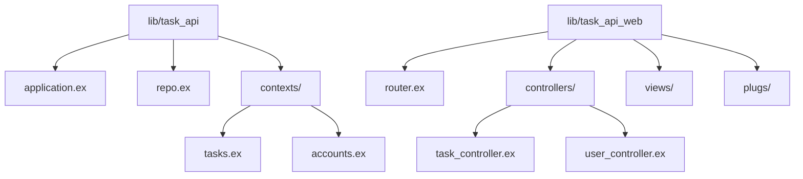

# How to Build a REST API with Phoenix Framework

Author: [nawazdhandala](https://www.github.com/nawazdhandala)

Tags: Elixir, Phoenix Framework, REST API, Backend Development, Functional Programming, Web Development

Description: Learn how to build a production-ready REST API with Phoenix Framework and Elixir. This guide covers project setup, database configuration with Ecto, context modules, controllers, authentication, error handling, and testing.

---

> Phoenix Framework brings the power of Elixir and the Erlang VM to web development. Built for high concurrency and fault tolerance, Phoenix is an excellent choice for APIs that need to handle thousands of simultaneous connections without breaking a sweat.

If you have worked with Ruby on Rails, Phoenix will feel familiar. It borrows many conventions from Rails but adds the benefits of functional programming and the battle-tested Erlang runtime. Let us build a complete REST API from scratch.

---

## Why Phoenix for REST APIs?

Before diving into code, here is why Phoenix stands out:

| Feature | Benefit |
|---------|---------|
| **Erlang VM (BEAM)** | Handles millions of concurrent connections |
| **Fault Tolerance** | Processes crash independently without bringing down the system |
| **Hot Code Reloading** | Deploy updates without downtime |
| **Functional Programming** | Predictable, testable code with immutable data |
| **Built-in PubSub** | Real-time features out of the box |

---

## Project Setup

First, make sure you have Elixir and Phoenix installed. Then create a new Phoenix project configured for API-only development.

```bash
# Install the Phoenix project generator
mix archive.install hex phx_new

# Create a new API-only Phoenix project
# --no-html removes browser-related dependencies
# --no-assets skips JavaScript bundling
# --binary-id uses UUIDs instead of auto-increment IDs
mix phx.new task_api --no-html --no-assets --binary-id

# Navigate to the project directory
cd task_api

# Create the database
mix ecto.create
```

### Project Structure

Phoenix organizes code into a clear structure that separates concerns.



The key directories are:
- `lib/task_api` - Business logic, contexts, and schemas
- `lib/task_api_web` - Web layer with controllers, views, and routing

---

## Database Configuration

Phoenix uses Ecto as its database wrapper. Configure your database connection in `config/dev.exs`.

```elixir
# config/dev.exs
# Database configuration for development environment
config :task_api, TaskApi.Repo,
  username: "postgres",
  password: "postgres",
  hostname: "localhost",
  database: "task_api_dev",
  stacktrace: true,  # Show full stacktraces for debugging
  show_sensitive_data_on_connection_error: true,
  pool_size: 10  # Number of database connections in the pool
```

---

## Creating the Schema and Migration

Let us create a Task schema with a migration. Phoenix generators do the heavy lifting.

```bash
# Generate a Task schema with migration
# This creates the schema file and migration in one command
mix phx.gen.schema Tasks.Task tasks \
  title:string \
  description:text \
  status:string \
  priority:integer \
  due_date:date \
  user_id:references:users
```

Now edit the generated migration to add constraints and defaults.

```elixir
# priv/repo/migrations/20260126000001_create_tasks.exs
defmodule TaskApi.Repo.Migrations.CreateTasks do
  use Ecto.Migration

  def change do
    create table(:tasks, primary_key: false) do
      # Use UUID as primary key for better distribution
      add :id, :binary_id, primary_key: true
      add :title, :string, null: false
      add :description, :text
      # Default status is "pending" for new tasks
      add :status, :string, null: false, default: "pending"
      # Priority from 1 (low) to 5 (critical)
      add :priority, :integer, default: 3
      add :due_date, :date
      # Foreign key to users table with cascade delete
      add :user_id, references(:users, on_delete: :delete_all, type: :binary_id)

      timestamps(type: :utc_datetime)
    end

    # Index for faster queries by user
    create index(:tasks, [:user_id])
    # Index for filtering by status
    create index(:tasks, [:status])
  end
end
```

Update the schema to add validations and changesets.

```elixir
# lib/task_api/tasks/task.ex
defmodule TaskApi.Tasks.Task do
  use Ecto.Schema
  import Ecto.Changeset

  # Use UUIDs as primary keys
  @primary_key {:id, :binary_id, autogenerate: true}
  @foreign_key_type :binary_id

  # Valid status values for tasks
  @valid_statuses ["pending", "in_progress", "completed", "cancelled"]

  schema "tasks" do
    field :title, :string
    field :description, :string
    field :status, :string, default: "pending"
    field :priority, :integer, default: 3
    field :due_date, :date

    # Association to the User who owns this task
    belongs_to :user, TaskApi.Accounts.User

    timestamps(type: :utc_datetime)
  end

  @doc """
  Changeset for creating a new task.
  Validates required fields and constraints.
  """
  def changeset(task, attrs) do
    task
    |> cast(attrs, [:title, :description, :status, :priority, :due_date, :user_id])
    |> validate_required([:title, :user_id])
    |> validate_length(:title, min: 1, max: 255)
    |> validate_inclusion(:status, @valid_statuses)
    |> validate_number(:priority, greater_than_or_equal_to: 1, less_than_or_equal_to: 5)
    |> foreign_key_constraint(:user_id)
  end

  @doc """
  Changeset for updating task status only.
  Useful for status transitions without modifying other fields.
  """
  def status_changeset(task, attrs) do
    task
    |> cast(attrs, [:status])
    |> validate_required([:status])
    |> validate_inclusion(:status, @valid_statuses)
  end
end
```

Run the migration to create the table.

```bash
mix ecto.migrate
```

---

## Building the Context Module

Phoenix uses context modules to encapsulate business logic. This keeps controllers thin and makes code easier to test.

```elixir
# lib/task_api/tasks.ex
defmodule TaskApi.Tasks do
  @moduledoc """
  The Tasks context handles all business logic for task management.
  This module is the public API for task operations.
  """

  import Ecto.Query, warn: false
  alias TaskApi.Repo
  alias TaskApi.Tasks.Task

  @doc """
  Returns all tasks for a specific user.
  Supports optional filtering by status.
  """
  def list_tasks(user_id, filters \\ %{}) do
    Task
    |> where(user_id: ^user_id)
    |> apply_filters(filters)
    |> order_by([t], desc: t.inserted_at)
    |> Repo.all()
  end

  # Apply optional filters to the query
  defp apply_filters(query, filters) do
    Enum.reduce(filters, query, fn
      {:status, status}, query when is_binary(status) ->
        where(query, [t], t.status == ^status)

      {:priority, priority}, query when is_integer(priority) ->
        where(query, [t], t.priority == ^priority)

      {:due_before, date}, query ->
        where(query, [t], t.due_date <= ^date)

      # Ignore unknown filters
      _, query ->
        query
    end)
  end

  @doc """
  Gets a single task by ID.
  Returns nil if the task does not exist or belongs to another user.
  """
  def get_task(id, user_id) do
    Task
    |> where(id: ^id, user_id: ^user_id)
    |> Repo.one()
  end

  @doc """
  Gets a task by ID or raises Ecto.NoResultsError.
  Use this when you expect the task to exist.
  """
  def get_task!(id, user_id) do
    Task
    |> where(id: ^id, user_id: ^user_id)
    |> Repo.one!()
  end

  @doc """
  Creates a new task for a user.
  Returns {:ok, task} or {:error, changeset}.
  """
  def create_task(attrs \\ %{}) do
    %Task{}
    |> Task.changeset(attrs)
    |> Repo.insert()
  end

  @doc """
  Updates an existing task.
  Only the owner can update their tasks.
  """
  def update_task(%Task{} = task, attrs) do
    task
    |> Task.changeset(attrs)
    |> Repo.update()
  end

  @doc """
  Updates only the status of a task.
  Useful for quick status transitions.
  """
  def update_task_status(%Task{} = task, status) do
    task
    |> Task.status_changeset(%{status: status})
    |> Repo.update()
  end

  @doc """
  Deletes a task.
  Returns {:ok, task} or {:error, changeset}.
  """
  def delete_task(%Task{} = task) do
    Repo.delete(task)
  end

  @doc """
  Returns an empty changeset for a task.
  Useful for building forms or validating input.
  """
  def change_task(%Task{} = task, attrs \\ %{}) do
    Task.changeset(task, attrs)
  end
end
```

---

## Setting Up the Router

Define your API routes in the router. Phoenix provides a clean DSL for organizing endpoints.

```elixir
# lib/task_api_web/router.ex
defmodule TaskApiWeb.Router do
  use TaskApiWeb, :router

  # Pipeline for API requests
  # These plugs run for every API request
  pipeline :api do
    plug :accepts, ["json"]
  end

  # Pipeline for authenticated requests
  # Verifies the JWT token before processing
  pipeline :authenticated do
    plug TaskApiWeb.Plugs.Authenticate
  end

  # Public routes - no authentication required
  scope "/api", TaskApiWeb do
    pipe_through :api

    # User registration and login
    post "/users/register", UserController, :register
    post "/users/login", UserController, :login

    # Health check endpoint for load balancers
    get "/health", HealthController, :index
  end

  # Protected routes - require valid JWT token
  scope "/api", TaskApiWeb do
    pipe_through [:api, :authenticated]

    # RESTful task endpoints
    resources "/tasks", TaskController, except: [:new, :edit]

    # Additional task actions
    post "/tasks/:id/complete", TaskController, :complete

    # User profile management
    get "/users/me", UserController, :me
    put "/users/me", UserController, :update_profile
  end
end
```

---

## Building the Controller

Controllers handle HTTP requests, delegate to contexts, and return responses.

```elixir
# lib/task_api_web/controllers/task_controller.ex
defmodule TaskApiWeb.TaskController do
  use TaskApiWeb, :controller

  alias TaskApi.Tasks
  alias TaskApi.Tasks.Task

  # Plug to load task for show, update, and delete actions
  # This avoids duplicating the fetch logic in each action
  plug :load_task when action in [:show, :update, :delete, :complete]

  @doc """
  GET /api/tasks
  Lists all tasks for the authenticated user.
  Supports query params: status, priority
  """
  def index(conn, params) do
    # Get current user from connection (set by auth plug)
    user_id = conn.assigns.current_user.id

    # Build filters from query params
    filters = build_filters(params)

    tasks = Tasks.list_tasks(user_id, filters)
    render(conn, :index, tasks: tasks)
  end

  @doc """
  POST /api/tasks
  Creates a new task for the authenticated user.
  """
  def create(conn, %{"task" => task_params}) do
    user_id = conn.assigns.current_user.id

    # Merge user_id into params to associate task with user
    attrs = Map.put(task_params, "user_id", user_id)

    case Tasks.create_task(attrs) do
      {:ok, task} ->
        conn
        |> put_status(:created)
        |> put_resp_header("location", ~p"/api/tasks/#{task}")
        |> render(:show, task: task)

      {:error, changeset} ->
        conn
        |> put_status(:unprocessable_entity)
        |> put_view(json: TaskApiWeb.ChangesetJSON)
        |> render(:error, changeset: changeset)
    end
  end

  @doc """
  GET /api/tasks/:id
  Shows a single task.
  """
  def show(conn, _params) do
    # Task is loaded by the plug
    render(conn, :show, task: conn.assigns.task)
  end

  @doc """
  PUT /api/tasks/:id
  Updates an existing task.
  """
  def update(conn, %{"task" => task_params}) do
    task = conn.assigns.task

    case Tasks.update_task(task, task_params) do
      {:ok, task} ->
        render(conn, :show, task: task)

      {:error, changeset} ->
        conn
        |> put_status(:unprocessable_entity)
        |> put_view(json: TaskApiWeb.ChangesetJSON)
        |> render(:error, changeset: changeset)
    end
  end

  @doc """
  DELETE /api/tasks/:id
  Deletes a task.
  """
  def delete(conn, _params) do
    task = conn.assigns.task

    case Tasks.delete_task(task) do
      {:ok, _task} ->
        send_resp(conn, :no_content, "")

      {:error, _changeset} ->
        conn
        |> put_status(:internal_server_error)
        |> json(%{error: "Failed to delete task"})
    end
  end

  @doc """
  POST /api/tasks/:id/complete
  Marks a task as completed.
  """
  def complete(conn, _params) do
    task = conn.assigns.task

    case Tasks.update_task_status(task, "completed") do
      {:ok, task} ->
        render(conn, :show, task: task)

      {:error, changeset} ->
        conn
        |> put_status(:unprocessable_entity)
        |> put_view(json: TaskApiWeb.ChangesetJSON)
        |> render(:error, changeset: changeset)
    end
  end

  # Private helper to load task and verify ownership
  defp load_task(conn, _opts) do
    user_id = conn.assigns.current_user.id
    task_id = conn.params["id"]

    case Tasks.get_task(task_id, user_id) do
      nil ->
        conn
        |> put_status(:not_found)
        |> put_view(json: TaskApiWeb.ErrorJSON)
        |> render(:"404")
        |> halt()

      task ->
        assign(conn, :task, task)
    end
  end

  # Build filter map from query params
  defp build_filters(params) do
    %{}
    |> maybe_add_filter(:status, params["status"])
    |> maybe_add_filter(:priority, parse_integer(params["priority"]))
  end

  defp maybe_add_filter(filters, _key, nil), do: filters
  defp maybe_add_filter(filters, key, value), do: Map.put(filters, key, value)

  defp parse_integer(nil), do: nil
  defp parse_integer(str) when is_binary(str) do
    case Integer.parse(str) do
      {num, ""} -> num
      _ -> nil
    end
  end
end
```

---

## JSON Rendering with Views

Phoenix uses views (or JSON modules in newer versions) to render responses.

```elixir
# lib/task_api_web/controllers/task_json.ex
defmodule TaskApiWeb.TaskJSON do
  alias TaskApi.Tasks.Task

  @doc """
  Renders a list of tasks.
  """
  def index(%{tasks: tasks}) do
    %{data: for(task <- tasks, do: data(task))}
  end

  @doc """
  Renders a single task.
  """
  def show(%{task: task}) do
    %{data: data(task)}
  end

  # Transform a task struct into a JSON-friendly map
  defp data(%Task{} = task) do
    %{
      id: task.id,
      title: task.title,
      description: task.description,
      status: task.status,
      priority: task.priority,
      due_date: task.due_date,
      created_at: task.inserted_at,
      updated_at: task.updated_at
    }
  end
end
```

Add a module for rendering changeset errors consistently.

```elixir
# lib/task_api_web/controllers/changeset_json.ex
defmodule TaskApiWeb.ChangesetJSON do
  @doc """
  Renders changeset errors as a structured JSON response.
  """
  def error(%{changeset: changeset}) do
    %{
      errors: Ecto.Changeset.traverse_errors(changeset, &translate_error/1)
    }
  end

  # Translate error messages with interpolation
  defp translate_error({msg, opts}) do
    Enum.reduce(opts, msg, fn {key, value}, acc ->
      String.replace(acc, "%{#{key}}", fn _ -> to_string(value) end)
    end)
  end
end
```

---

## Authentication with JWT

Implement token-based authentication using the Guardian library.

```elixir
# mix.exs - Add Guardian to dependencies
defp deps do
  [
    # ... other deps
    {:guardian, "~> 2.3"},
    {:bcrypt_elixir, "~> 3.0"}
  ]
end
```

Configure Guardian with your secret key.

```elixir
# config/config.exs
config :task_api, TaskApiWeb.Guardian,
  issuer: "task_api",
  # Generate a secure secret: mix guardian.gen.secret
  secret_key: System.get_env("GUARDIAN_SECRET_KEY") || "your-secret-key"
```

Create the Guardian module.

```elixir
# lib/task_api_web/guardian.ex
defmodule TaskApiWeb.Guardian do
  use Guardian, otp_app: :task_api

  alias TaskApi.Accounts

  @doc """
  Encodes the user ID into the JWT subject claim.
  """
  def subject_for_token(user, _claims) do
    {:ok, to_string(user.id)}
  end

  @doc """
  Decodes the JWT subject claim back into a user.
  """
  def resource_from_claims(claims) do
    user_id = claims["sub"]

    case Accounts.get_user(user_id) do
      nil -> {:error, :user_not_found}
      user -> {:ok, user}
    end
  end
end
```

Create the authentication plug.

```elixir
# lib/task_api_web/plugs/authenticate.ex
defmodule TaskApiWeb.Plugs.Authenticate do
  @moduledoc """
  Plug that verifies JWT tokens and loads the current user.
  """

  import Plug.Conn
  import Phoenix.Controller

  alias TaskApiWeb.Guardian

  def init(opts), do: opts

  def call(conn, _opts) do
    # Extract token from Authorization header
    case get_token(conn) do
      nil ->
        unauthorized(conn, "Missing authentication token")

      token ->
        # Verify the token and load the user
        case Guardian.resource_from_token(token) do
          {:ok, user, _claims} ->
            assign(conn, :current_user, user)

          {:error, reason} ->
            unauthorized(conn, "Invalid token: #{inspect(reason)}")
        end
    end
  end

  # Extract Bearer token from Authorization header
  defp get_token(conn) do
    case get_req_header(conn, "authorization") do
      ["Bearer " <> token] -> token
      _ -> nil
    end
  end

  # Return 401 Unauthorized response
  defp unauthorized(conn, message) do
    conn
    |> put_status(:unauthorized)
    |> put_view(json: TaskApiWeb.ErrorJSON)
    |> render(:"401", message: message)
    |> halt()
  end
end
```

---

## Error Handling

Create a centralized error view for consistent error responses.

```elixir
# lib/task_api_web/controllers/error_json.ex
defmodule TaskApiWeb.ErrorJSON do
  @moduledoc """
  Renders error responses in a consistent JSON format.
  """

  def render("401.json", %{message: message}) do
    %{error: %{status: 401, message: message}}
  end

  def render("404.json", _assigns) do
    %{error: %{status: 404, message: "Resource not found"}}
  end

  def render("422.json", %{changeset: changeset}) do
    %{
      error: %{
        status: 422,
        message: "Validation failed",
        details: format_changeset_errors(changeset)
      }
    }
  end

  def render("500.json", _assigns) do
    %{error: %{status: 500, message: "Internal server error"}}
  end

  # Fallback for any other error
  def render(template, _assigns) do
    %{error: %{message: Phoenix.Controller.status_message_from_template(template)}}
  end

  defp format_changeset_errors(changeset) do
    Ecto.Changeset.traverse_errors(changeset, fn {msg, opts} ->
      Enum.reduce(opts, msg, fn {key, value}, acc ->
        String.replace(acc, "%{#{key}}", to_string(value))
      end)
    end)
  end
end
```

Add a fallback controller for handling errors from action clauses.

```elixir
# lib/task_api_web/controllers/fallback_controller.ex
defmodule TaskApiWeb.FallbackController do
  use TaskApiWeb, :controller

  # Handle Ecto changeset errors
  def call(conn, {:error, %Ecto.Changeset{} = changeset}) do
    conn
    |> put_status(:unprocessable_entity)
    |> put_view(json: TaskApiWeb.ChangesetJSON)
    |> render(:error, changeset: changeset)
  end

  # Handle not found errors
  def call(conn, {:error, :not_found}) do
    conn
    |> put_status(:not_found)
    |> put_view(json: TaskApiWeb.ErrorJSON)
    |> render(:"404")
  end

  # Handle unauthorized errors
  def call(conn, {:error, :unauthorized}) do
    conn
    |> put_status(:unauthorized)
    |> put_view(json: TaskApiWeb.ErrorJSON)
    |> render(:"401", message: "Unauthorized")
  end
end
```

---

## Testing Your API

Phoenix includes excellent testing tools. Write tests for your context and controller.

```elixir
# test/task_api/tasks_test.exs
defmodule TaskApi.TasksTest do
  use TaskApi.DataCase

  alias TaskApi.Tasks
  alias TaskApi.Tasks.Task

  # Create a user for testing task ownership
  setup do
    user = insert(:user)
    {:ok, user: user}
  end

  describe "list_tasks/2" do
    test "returns all tasks for a user", %{user: user} do
      task1 = insert(:task, user_id: user.id, title: "Task 1")
      task2 = insert(:task, user_id: user.id, title: "Task 2")
      # Task belonging to another user
      other_user = insert(:user)
      _other_task = insert(:task, user_id: other_user.id)

      tasks = Tasks.list_tasks(user.id)

      assert length(tasks) == 2
      assert Enum.map(tasks, & &1.id) |> Enum.sort() ==
             [task1.id, task2.id] |> Enum.sort()
    end

    test "filters tasks by status", %{user: user} do
      insert(:task, user_id: user.id, status: "pending")
      insert(:task, user_id: user.id, status: "completed")

      tasks = Tasks.list_tasks(user.id, %{status: "pending"})

      assert length(tasks) == 1
      assert hd(tasks).status == "pending"
    end
  end

  describe "create_task/1" do
    test "creates task with valid attributes", %{user: user} do
      attrs = %{
        title: "New Task",
        description: "A test task",
        user_id: user.id
      }

      assert {:ok, %Task{} = task} = Tasks.create_task(attrs)
      assert task.title == "New Task"
      assert task.status == "pending"
    end

    test "returns error with invalid attributes" do
      # Missing required title
      assert {:error, changeset} = Tasks.create_task(%{})
      assert "can't be blank" in errors_on(changeset).title
    end
  end

  describe "update_task/2" do
    test "updates task with valid attributes", %{user: user} do
      task = insert(:task, user_id: user.id, title: "Original")

      assert {:ok, updated} = Tasks.update_task(task, %{title: "Updated"})
      assert updated.title == "Updated"
    end
  end

  describe "delete_task/1" do
    test "deletes the task", %{user: user} do
      task = insert(:task, user_id: user.id)

      assert {:ok, %Task{}} = Tasks.delete_task(task)
      assert Tasks.get_task(task.id, user.id) == nil
    end
  end
end
```

Write controller tests using ConnCase.

```elixir
# test/task_api_web/controllers/task_controller_test.exs
defmodule TaskApiWeb.TaskControllerTest do
  use TaskApiWeb.ConnCase

  alias TaskApi.Accounts

  setup %{conn: conn} do
    # Create a user and authenticate
    {:ok, user} = Accounts.create_user(%{
      email: "test@example.com",
      password: "password123"
    })

    # Generate a token for the user
    {:ok, token, _claims} = TaskApiWeb.Guardian.encode_and_sign(user)

    # Add auth header to connection
    conn =
      conn
      |> put_req_header("accept", "application/json")
      |> put_req_header("authorization", "Bearer #{token}")

    {:ok, conn: conn, user: user}
  end

  describe "GET /api/tasks" do
    test "lists all tasks for authenticated user", %{conn: conn, user: user} do
      insert(:task, user_id: user.id, title: "My Task")

      conn = get(conn, ~p"/api/tasks")

      assert %{"data" => [task]} = json_response(conn, 200)
      assert task["title"] == "My Task"
    end

    test "returns empty list when no tasks exist", %{conn: conn} do
      conn = get(conn, ~p"/api/tasks")

      assert %{"data" => []} = json_response(conn, 200)
    end
  end

  describe "POST /api/tasks" do
    test "creates task with valid params", %{conn: conn} do
      params = %{task: %{title: "New Task", priority: 4}}

      conn = post(conn, ~p"/api/tasks", params)

      assert %{"data" => task} = json_response(conn, 201)
      assert task["title"] == "New Task"
      assert task["priority"] == 4
    end

    test "returns errors with invalid params", %{conn: conn} do
      params = %{task: %{title: ""}}

      conn = post(conn, ~p"/api/tasks", params)

      assert %{"errors" => errors} = json_response(conn, 422)
      assert errors["title"] != nil
    end
  end

  describe "PUT /api/tasks/:id" do
    test "updates existing task", %{conn: conn, user: user} do
      task = insert(:task, user_id: user.id, title: "Original")

      params = %{task: %{title: "Updated"}}
      conn = put(conn, ~p"/api/tasks/#{task.id}", params)

      assert %{"data" => updated} = json_response(conn, 200)
      assert updated["title"] == "Updated"
    end

    test "returns 404 for non-existent task", %{conn: conn} do
      fake_id = Ecto.UUID.generate()
      params = %{task: %{title: "Updated"}}

      conn = put(conn, ~p"/api/tasks/#{fake_id}", params)

      assert json_response(conn, 404)
    end
  end

  describe "DELETE /api/tasks/:id" do
    test "deletes existing task", %{conn: conn, user: user} do
      task = insert(:task, user_id: user.id)

      conn = delete(conn, ~p"/api/tasks/#{task.id}")

      assert response(conn, 204)
    end
  end
end
```

Run your tests with:

```bash
# Run all tests
mix test

# Run with coverage report
mix test --cover

# Run specific test file
mix test test/task_api/tasks_test.exs
```

---

## Running the Server

Start your Phoenix server and test the API.

```bash
# Start the development server
mix phx.server

# Or start in interactive mode for debugging
iex -S mix phx.server
```

Test your endpoints with curl:

```bash
# Register a new user
curl -X POST http://localhost:4000/api/users/register \
  -H "Content-Type: application/json" \
  -d '{"user": {"email": "demo@example.com", "password": "secret123"}}'

# Login to get a token
curl -X POST http://localhost:4000/api/users/login \
  -H "Content-Type: application/json" \
  -d '{"email": "demo@example.com", "password": "secret123"}'

# Create a task (use the token from login response)
curl -X POST http://localhost:4000/api/tasks \
  -H "Content-Type: application/json" \
  -H "Authorization: Bearer YOUR_TOKEN_HERE" \
  -d '{"task": {"title": "Learn Phoenix", "priority": 5}}'

# List all tasks
curl http://localhost:4000/api/tasks \
  -H "Authorization: Bearer YOUR_TOKEN_HERE"
```

---

## Conclusion

You now have a fully functional REST API built with Phoenix Framework. The key concepts covered:

- **Project setup** with API-only configuration
- **Ecto schemas** with validations and changesets
- **Context modules** for clean business logic
- **Controllers** that handle HTTP requests
- **JSON views** for consistent response formatting
- **Authentication** with JWT tokens
- **Testing** with ExUnit and ConnCase

Phoenix gives you the performance of the Erlang VM with the productivity of a well-designed web framework. The functional approach leads to code that is predictable and easy to test.

---

*Building reliable APIs? [OneUptime](https://oneuptime.com) provides comprehensive monitoring, alerting, and status pages to keep your Phoenix applications running smoothly.*

**Related Reading:**
- [How to Build Health Checks and Readiness Probes in Python for Kubernetes](https://oneuptime.com/blog/post/2025-01-06-python-health-checks-kubernetes/view)
- [How to Build a REST API with Django REST Framework](https://oneuptime.com/blog/post/2026-01-26-django-rest-framework-api/view)
