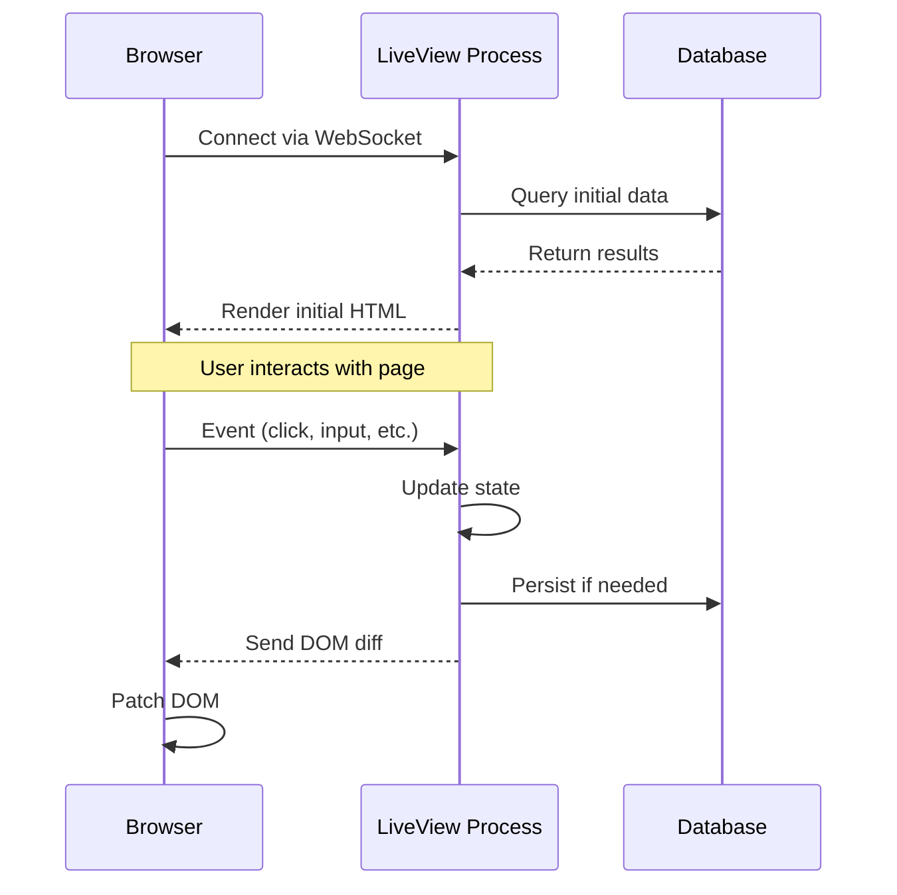

# How to Use Phoenix LiveView for Real-Time UIs

Author: [nawazdhandala](https://github.com/nawazdhandala)

Tags: Phoenix, Elixir, LiveView, Real-Time, WebSockets, Functional Programming

Description: Learn how to build real-time user interfaces with Phoenix LiveView. This guide covers setup, state management, real-time updates, forms, PubSub integration, and production deployment patterns.

---

Building real-time web applications usually means juggling JavaScript frameworks, WebSocket libraries, and complex state synchronization. Phoenix LiveView changes this completely. It lets you build rich, real-time UIs entirely in Elixir, with the server managing state and pushing updates to the browser over WebSockets.

This guide walks through building production-ready real-time interfaces with LiveView, from basic setup to scaling patterns.

## Why Phoenix LiveView?

Traditional approaches to real-time UIs require maintaining state in two places - the server and the client. You write API endpoints, then duplicate logic in JavaScript to handle updates. LiveView eliminates this by keeping all state on the server and efficiently syncing only the changed parts of the DOM to the client.

The result is dramatically simpler code. No JSON APIs, no client-side state management, no JavaScript build pipelines for basic interactivity. The server remains the single source of truth.



## Setting Up LiveView

If you are starting a new Phoenix project, LiveView is included by default in Phoenix 1.6 and later.

```bash
# Create a new Phoenix project with LiveView
mix phx.new my_app

# Or add to existing project - add to mix.exs
{:phoenix_live_view, "~> 0.20"}
```

After adding the dependency, run the installer to set up the necessary files.

```bash
mix deps.get
```

## Your First LiveView

LiveView modules have three core callbacks: `mount/3` initializes state, `render/1` produces HTML, and `handle_event/3` responds to user interactions.

```elixir
# lib/my_app_web/live/counter_live.ex
defmodule MyAppWeb.CounterLive do
  use MyAppWeb, :live_view

  # mount/3 is called when a client connects
  # socket contains the connection state
  def mount(_params, _session, socket) do
    # assign/2 sets values in the socket's assigns
    # These become available as @count in the template
    {:ok, assign(socket, count: 0)}
  end

  # render/1 returns the HTML to display
  # HEEx templates compile to efficient code
  def render(assigns) do
    ~H"""
    <div class="counter">
      <h1>Count: <%= @count %></h1>

      <!-- phx-click sends events to handle_event/3 -->
      <button phx-click="increment">+</button>
      <button phx-click="decrement">-</button>
      <button phx-click="reset">Reset</button>
    </div>
    """
  end

  # handle_event/3 receives events from the browser
  # The first argument is the event name from phx-click
  def handle_event("increment", _params, socket) do
    # Return updated socket - LiveView diffs and patches the DOM
    {:noreply, assign(socket, count: socket.assigns.count + 1)}
  end

  def handle_event("decrement", _params, socket) do
    {:noreply, assign(socket, count: socket.assigns.count - 1)}
  end

  def handle_event("reset", _params, socket) do
    {:noreply, assign(socket, count: 0)}
  end
end
```

Add a route to access your LiveView.

```elixir
# lib/my_app_web/router.ex
scope "/", MyAppWeb do
  pipe_through :browser

  # live/3 routes requests to LiveView modules
  live "/counter", CounterLive
end
```

When you visit `/counter`, Phoenix establishes a WebSocket connection. All subsequent interactions happen over that connection without full page reloads.

## Real-Time Data with PubSub

The real power of LiveView emerges when combining it with Phoenix PubSub. Multiple users can see updates in real-time without any additional JavaScript.

```elixir
# lib/my_app_web/live/dashboard_live.ex
defmodule MyAppWeb.DashboardLive do
  use MyAppWeb, :live_view
  alias MyApp.Metrics

  @topic "metrics:updates"

  def mount(_params, _session, socket) do
    # Subscribe to PubSub topic when LiveView mounts
    # connected?/1 returns true only for WebSocket connections
    # This prevents subscribing during initial static render
    if connected?(socket) do
      Phoenix.PubSub.subscribe(MyApp.PubSub, @topic)
      # Start periodic refresh every 5 seconds
      :timer.send_interval(5000, self(), :refresh)
    end

    {:ok, assign(socket, metrics: Metrics.get_current())}
  end

  def render(assigns) do
    ~H"""
    <div class="dashboard">
      <h1>System Metrics</h1>

      <div class="metrics-grid">
        <div class="metric-card">
          <span class="label">CPU Usage</span>
          <span class="value"><%= @metrics.cpu %>%</span>
        </div>

        <div class="metric-card">
          <span class="label">Memory</span>
          <span class="value"><%= @metrics.memory_mb %> MB</span>
        </div>

        <div class="metric-card">
          <span class="label">Active Users</span>
          <span class="value"><%= @metrics.active_users %></span>
        </div>

        <div class="metric-card">
          <span class="label">Requests/sec</span>
          <span class="value"><%= @metrics.requests_per_sec %></span>
        </div>
      </div>

      <p class="updated-at">
        Last updated: <%= Calendar.strftime(@metrics.updated_at, "%H:%M:%S") %>
      </p>
    </div>
    """
  end

  # handle_info/2 receives messages from PubSub and timers
  # Pattern match on the message to route to correct handler
  def handle_info(:refresh, socket) do
    {:noreply, assign(socket, metrics: Metrics.get_current())}
  end

  def handle_info({:metrics_updated, metrics}, socket) do
    # When another process broadcasts updated metrics, update our state
    {:noreply, assign(socket, metrics: metrics)}
  end
end
```

Now any process can broadcast updates to all connected dashboards.

```elixir
# lib/my_app/metrics.ex
defmodule MyApp.Metrics do
  @topic "metrics:updates"

  def broadcast_update(metrics) do
    # All LiveViews subscribed to this topic receive the message
    Phoenix.PubSub.broadcast(MyApp.PubSub, @topic, {:metrics_updated, metrics})
  end
end
```

## Forms and Validation

LiveView provides real-time form validation without page reloads. As users type, validation errors appear instantly.

```elixir
# lib/my_app_web/live/user_registration_live.ex
defmodule MyAppWeb.UserRegistrationLive do
  use MyAppWeb, :live_view
  alias MyApp.Accounts
  alias MyApp.Accounts.User

  def mount(_params, _session, socket) do
    # Create an empty changeset for the form
    changeset = Accounts.change_user(%User{})
    {:ok, assign(socket, form: to_form(changeset))}
  end

  def render(assigns) do
    ~H"""
    <div class="registration-form">
      <h1>Create Account</h1>

      <!-- phx-change fires on every input change for live validation -->
      <!-- phx-submit fires when the form is submitted -->
      <.form for={@form} phx-change="validate" phx-submit="save">
        <div class="field">
          <label for="email">Email</label>
          <.input field={@form[:email]} type="email" />
        </div>

        <div class="field">
          <label for="username">Username</label>
          <.input field={@form[:username]} type="text" />
        </div>

        <div class="field">
          <label for="password">Password</label>
          <.input field={@form[:password]} type="password" />
        </div>

        <button type="submit" phx-disable-with="Creating...">
          Create Account
        </button>
      </.form>
    </div>
    """
  end

  # Validate on every keystroke
  def handle_event("validate", %{"user" => user_params}, socket) do
    changeset =
      %User{}
      |> Accounts.change_user(user_params)
      # Mark as :validate action to show errors without saving
      |> Map.put(:action, :validate)

    {:noreply, assign(socket, form: to_form(changeset))}
  end

  # Handle form submission
  def handle_event("save", %{"user" => user_params}, socket) do
    case Accounts.create_user(user_params) do
      {:ok, user} ->
        # Redirect on success
        {:noreply,
         socket
         |> put_flash(:info, "Account created successfully!")
         |> redirect(to: ~p"/users/#{user}")}

      {:error, changeset} ->
        # Show validation errors
        {:noreply, assign(socket, form: to_form(changeset))}
    end
  end
end
```

## Live Components for Reusability

For complex UIs, break functionality into LiveComponents. Each component manages its own state and events.

```elixir
# lib/my_app_web/live/components/notification_component.ex
defmodule MyAppWeb.NotificationComponent do
  use MyAppWeb, :live_component

  # update/2 is called when the parent passes new assigns
  def update(assigns, socket) do
    {:ok,
     socket
     |> assign(assigns)
     |> assign_new(:expanded, fn -> false end)}
  end

  def render(assigns) do
    ~H"""
    <div class={"notification #{@notification.type}"} id={@id}>
      <div class="notification-header" phx-click="toggle" phx-target={@myself}>
        <span class="icon"><%= icon_for(@notification.type) %></span>
        <span class="title"><%= @notification.title %></span>
        <span class="time"><%= relative_time(@notification.inserted_at) %></span>
      </div>

      <%= if @expanded do %>
        <div class="notification-body">
          <p><%= @notification.message %></p>
          <button phx-click="dismiss" phx-target={@myself}>
            Dismiss
          </button>
        </div>
      <% end %>
    </div>
    """
  end

  # phx-target={@myself} routes events to this component
  def handle_event("toggle", _params, socket) do
    {:noreply, assign(socket, expanded: !socket.assigns.expanded)}
  end

  def handle_event("dismiss", _params, socket) do
    # Notify parent to remove this notification
    send(self(), {:dismiss_notification, socket.assigns.notification.id})
    {:noreply, socket}
  end

  defp icon_for(:info), do: "info-icon"
  defp icon_for(:warning), do: "warning-icon"
  defp icon_for(:error), do: "error-icon"

  defp relative_time(datetime) do
    # Simple relative time formatting
    diff = DateTime.diff(DateTime.utc_now(), datetime, :minute)
    cond do
      diff < 1 -> "just now"
      diff < 60 -> "#{diff}m ago"
      diff < 1440 -> "#{div(diff, 60)}h ago"
      true -> "#{div(diff, 1440)}d ago"
    end
  end
end
```

Use the component in a parent LiveView.

```elixir
# In parent LiveView render/1
def render(assigns) do
  ~H"""
  <div class="notifications-panel">
    <h2>Notifications</h2>

    <%= for notification <- @notifications do %>
      <.live_component
        module={MyAppWeb.NotificationComponent}
        id={"notification-#{notification.id}"}
        notification={notification}
      />
    <% end %>
  </div>
  """
end

# Handle dismiss message from component
def handle_info({:dismiss_notification, id}, socket) do
  notifications = Enum.reject(socket.assigns.notifications, &(&1.id == id))
  {:noreply, assign(socket, notifications: notifications)}
end
```

## Handling Expensive Operations

Long-running operations should not block the LiveView process. Use `assign_async/3` to load data without freezing the UI.

```elixir
defmodule MyAppWeb.ReportLive do
  use MyAppWeb, :live_view

  def mount(_params, _session, socket) do
    {:ok,
     socket
     |> assign(report_params: %{})
     |> assign_async(:report, fn -> {:ok, %{report: nil}} end)}
  end

  def render(assigns) do
    ~H"""
    <div class="report-generator">
      <h1>Generate Report</h1>

      <form phx-submit="generate">
        <select name="report_type">
          <option value="daily">Daily</option>
          <option value="weekly">Weekly</option>
          <option value="monthly">Monthly</option>
        </select>
        <button type="submit">Generate</button>
      </form>

      <!-- Handle async loading states -->
      <div class="report-output">
        <.async_result :let={data} assign={@report}>
          <:loading>
            <div class="loading-spinner">Generating report...</div>
          </:loading>

          <:failed :let={reason}>
            <div class="error">
              Failed to generate report: <%= inspect(reason) %>
            </div>
          </:failed>

          <%= if data.report do %>
            <div class="report-content">
              <h2><%= data.report.title %></h2>
              <pre><%= data.report.content %></pre>
            </div>
          <% else %>
            <p>Click generate to create a report.</p>
          <% end %>
        </.async_result>
      </div>
    </div>
    """
  end

  def handle_event("generate", %{"report_type" => type}, socket) do
    # assign_async runs the function in a separate process
    # The UI remains responsive while the report generates
    {:noreply,
     assign_async(socket, :report, fn ->
       # This runs in a spawned task, not blocking the LiveView
       report = MyApp.Reports.generate(type)
       {:ok, %{report: report}}
     end)}
  end
end
```

## JavaScript Interoperability with Hooks

Sometimes you need client-side JavaScript for features like charts, maps, or third-party widgets. LiveView hooks provide the bridge.

```elixir
# In your LiveView
def render(assigns) do
  ~H"""
  <div class="chart-container">
    <!-- phx-hook connects this element to JavaScript -->
    <!-- phx-update="ignore" prevents LiveView from touching the contents -->
    <canvas
      id="metrics-chart"
      phx-hook="MetricsChart"
      phx-update="ignore"
      data-metrics={Jason.encode!(@chart_data)}
    >
    </canvas>
  </div>
  """
end

def handle_info({:new_datapoint, point}, socket) do
  # Push event to JavaScript hook
  {:noreply, push_event(socket, "new-datapoint", point)}
end
```

```javascript
// assets/js/hooks.js
let Hooks = {};

Hooks.MetricsChart = {
  mounted() {
    // Initialize chart when element mounts
    const data = JSON.parse(this.el.dataset.metrics);
    this.chart = new Chart(this.el, {
      type: 'line',
      data: data,
      options: { responsive: true }
    });

    // Listen for events pushed from server
    this.handleEvent("new-datapoint", (point) => {
      this.chart.data.datasets[0].data.push(point);
      this.chart.update();
    });
  },

  destroyed() {
    // Clean up when element is removed
    this.chart.destroy();
  }
};

export default Hooks;
```

```javascript
// assets/js/app.js
import Hooks from "./hooks";

let liveSocket = new LiveSocket("/live", Socket, {
  hooks: Hooks,
  params: { _csrf_token: csrfToken }
});
```

## Optimizing Performance

LiveView is efficient by default, but large applications benefit from these patterns.

### Temporary Assigns

For lists that grow unbounded, use temporary assigns to clear data after rendering.

```elixir
def mount(_params, _session, socket) do
  # temporary_assigns clears these after each render
  # Reduces memory usage for streaming data
  {:ok,
   socket
   |> assign(messages: [])
   |> assign(page_title: "Chat"),
   temporary_assigns: [messages: []]}
end

def render(assigns) do
  ~H"""
  <div id="messages" phx-update="append">
    <%= for message <- @messages do %>
      <div id={"message-#{message.id}"}>
        <%= message.content %>
      </div>
    <% end %>
  </div>
  """
end

def handle_info({:new_message, message}, socket) do
  # Message is rendered then cleared from memory
  {:noreply, assign(socket, messages: [message])}
end
```

### Stream for Large Collections

For very large lists, streams provide efficient updates without holding all data in memory.

```elixir
def mount(_params, _session, socket) do
  {:ok,
   socket
   |> stream(:products, Products.list_products())}
end

def render(assigns) do
  ~H"""
  <div id="products" phx-update="stream">
    <div :for={{dom_id, product} <- @streams.products} id={dom_id}>
      <%= product.name %> - $<%= product.price %>
    </div>
  </div>
  """
end

def handle_info({:product_updated, product}, socket) do
  # Efficiently update just the changed item
  {:noreply, stream_insert(socket, :products, product)}
end
```

## Production Deployment

LiveView uses WebSockets, which require sticky sessions when running multiple server instances. Configure your load balancer to route all connections from a client to the same server.

```elixir
# config/runtime.exs
config :my_app, MyAppWeb.Endpoint,
  url: [host: System.get_env("PHX_HOST"), port: 443, scheme: "https"],
  http: [
    ip: {0, 0, 0, 0, 0, 0, 0, 0},
    port: String.to_integer(System.get_env("PORT") || "4000")
  ],
  secret_key_base: System.get_env("SECRET_KEY_BASE")

# Configure PubSub for distributed nodes
config :my_app, MyApp.PubSub,
  adapter: Phoenix.PubSub.PG2
```

For Kubernetes, use session affinity.

```yaml
# kubernetes service configuration
apiVersion: v1
kind: Service
metadata:
  name: my-app
spec:
  selector:
    app: my-app
  ports:
    - port: 80
      targetPort: 4000
  sessionAffinity: ClientIP
  sessionAffinityConfig:
    clientIP:
      timeoutSeconds: 3600
```

## Summary

Phoenix LiveView fundamentally simplifies real-time web development. By keeping state on the server and pushing minimal DOM diffs over WebSockets, you get the responsiveness of a single-page application without the complexity.

Key patterns to remember:

| Pattern | Use Case |
|---------|----------|
| `mount/3` | Initialize state when client connects |
| `handle_event/3` | Respond to user interactions |
| `handle_info/2` | Receive PubSub messages and timer events |
| `assign_async/3` | Non-blocking data loading |
| `stream/3` | Efficient large list handling |
| Hooks | JavaScript interop for charts, maps, etc. |

The Elixir ecosystem's focus on fault tolerance means LiveView processes crash gracefully and reconnect automatically. Combined with Phoenix PubSub for real-time updates across nodes, you can build dashboards, collaborative tools, and interactive applications with remarkably little code.

Start with simple use cases - a live counter, a real-time form - and expand from there. The patterns scale naturally from prototype to production.
