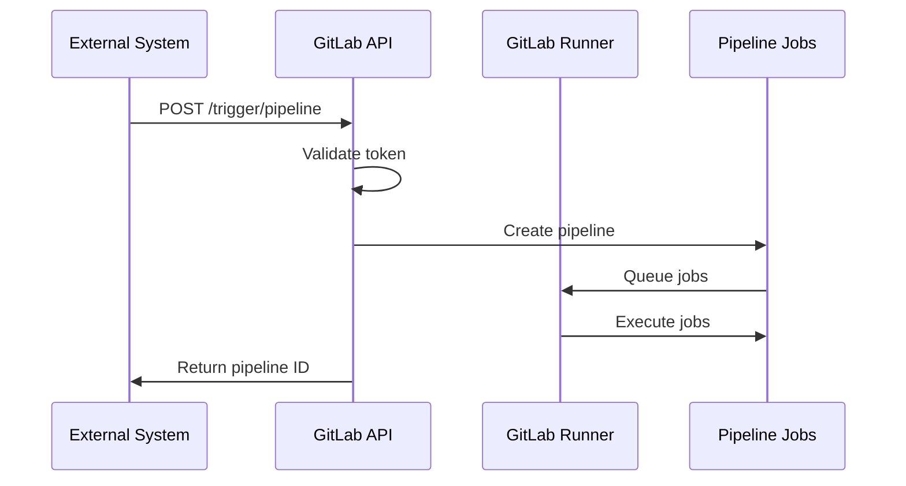

# How to Implement Pipeline Triggers in GitLab CI

Author: [nawazdhandala](https://www.github.com/nawazdhandala)

Tags: GitLab CI, Pipeline Triggers, Automation, CI/CD, API, Webhooks

Description: Learn how to trigger GitLab CI pipelines programmatically using triggers, webhooks, and the API for cross-project automation, scheduled builds, and external integrations.

---

Sometimes pipelines need to start without a direct code push. Maybe an external system needs to trigger a deployment, or one project needs to kick off builds in another. GitLab CI pipeline triggers provide this capability. This guide covers trigger tokens, the API, webhooks, and cross-project pipelines.

## Understanding Pipeline Triggers

GitLab supports several ways to start pipelines programmatically:

- **Trigger tokens**: Simple API endpoint with a secret token
- **Pipeline API**: Full control with personal or project access tokens
- **Webhooks**: React to external events
- **Scheduled pipelines**: Time-based triggers
- **Multi-project triggers**: One pipeline starts another

## Creating a Pipeline Trigger Token

Create a trigger token in Settings, then CI/CD, then Pipeline trigger tokens.

```bash
# Trigger a pipeline using the token
curl --request POST \
  --form "token=YOUR_TRIGGER_TOKEN" \
  --form "ref=main" \
  "https://gitlab.example.com/api/v4/projects/123/trigger/pipeline"
```

You can pass variables to the triggered pipeline:

```bash
# Trigger with variables
curl --request POST \
  --form "token=YOUR_TRIGGER_TOKEN" \
  --form "ref=main" \
  --form "variables[DEPLOY_ENV]=production" \
  --form "variables[VERSION]=1.2.3" \
  "https://gitlab.example.com/api/v4/projects/123/trigger/pipeline"
```

## Receiving Trigger Variables

Access trigger variables in your pipeline like any other variable.

```yaml
deploy:
  stage: deploy
  script:
    # Use variables passed from the trigger
    - echo "Deploying version ${VERSION} to ${DEPLOY_ENV}"
    - ./deploy.sh ${DEPLOY_ENV}
  rules:
    # Only run when triggered externally
    - if: $CI_PIPELINE_SOURCE == "trigger"
    # Or run on normal pushes
    - if: $CI_COMMIT_BRANCH == "main"
```

The `$CI_PIPELINE_SOURCE` variable tells you how the pipeline started:
- `push`: Git push
- `trigger`: Trigger token
- `pipeline`: Multi-project pipeline
- `api`: Pipeline API
- `schedule`: Scheduled pipeline
- `web`: Manual trigger from UI

## Pipeline Trigger Flow

Here's how external triggers work:



## Using the Pipeline API

For more control, use the pipeline API with access tokens.

```bash
# Create pipeline with API
curl --request POST \
  --header "PRIVATE-TOKEN: glpat-xxxxxxxxxxxx" \
  --header "Content-Type: application/json" \
  --data '{
    "ref": "main",
    "variables": [
      {"key": "DEPLOY_ENV", "value": "production"},
      {"key": "RUN_TESTS", "value": "false"}
    ]
  }' \
  "https://gitlab.example.com/api/v4/projects/123/pipeline"
```

This returns detailed pipeline information:

```json
{
  "id": 456,
  "status": "pending",
  "ref": "main",
  "sha": "abc123...",
  "web_url": "https://gitlab.example.com/group/project/-/pipelines/456"
}
```

## Triggering from Another Pipeline

Use the `trigger` keyword to start pipelines in other projects.

```yaml
# In the triggering project
stages:
  - build
  - trigger-downstream

build:
  stage: build
  script:
    - npm run build

trigger-deploy:
  stage: trigger-downstream
  trigger:
    project: ops/deployment
    branch: main
  variables:
    ARTIFACT_URL: "${CI_JOB_URL}/artifacts/download"
    SOURCE_COMMIT: "${CI_COMMIT_SHA}"
```

The downstream project receives these variables and runs its pipeline:

```yaml
# In ops/deployment project
deploy:
  stage: deploy
  script:
    # Download artifacts from upstream
    - 'curl --header "JOB-TOKEN: $CI_JOB_TOKEN" -o artifacts.zip "${ARTIFACT_URL}"'
    - unzip artifacts.zip
    - ./deploy.sh
  only:
    - pipelines  # Only run when triggered by another pipeline
```

## Webhook-Based Triggers

Set up webhooks to trigger pipelines from external events.

```yaml
# Pipeline that responds to webhook triggers
webhook-handler:
  stage: deploy
  script:
    - echo "Webhook payload: ${WEBHOOK_PAYLOAD}"
    - ./process-webhook.sh
  rules:
    - if: $CI_PIPELINE_SOURCE == "trigger" && $WEBHOOK_TYPE == "deployment"
```

From your external service:

```bash
# External service triggers pipeline
curl --request POST \
  --form "token=${GITLAB_TRIGGER_TOKEN}" \
  --form "ref=main" \
  --form "variables[WEBHOOK_TYPE]=deployment" \
  --form "variables[WEBHOOK_PAYLOAD]=${PAYLOAD}" \
  "https://gitlab.example.com/api/v4/projects/${PROJECT_ID}/trigger/pipeline"
```

## Waiting for Pipeline Completion

Poll the API to wait for a triggered pipeline to finish.

```bash
#!/bin/bash
# trigger-and-wait.sh

# Trigger the pipeline
RESPONSE=$(curl --silent --request POST \
  --form "token=${TRIGGER_TOKEN}" \
  --form "ref=main" \
  "${GITLAB_URL}/api/v4/projects/${PROJECT_ID}/trigger/pipeline")

PIPELINE_ID=$(echo $RESPONSE | jq -r '.id')
echo "Started pipeline: ${PIPELINE_ID}"

# Poll until complete
while true; do
  STATUS=$(curl --silent --header "PRIVATE-TOKEN: ${ACCESS_TOKEN}" \
    "${GITLAB_URL}/api/v4/projects/${PROJECT_ID}/pipelines/${PIPELINE_ID}" \
    | jq -r '.status')

  echo "Pipeline status: ${STATUS}"

  case $STATUS in
    "success")
      echo "Pipeline completed successfully"
      exit 0
      ;;
    "failed"|"canceled")
      echo "Pipeline failed or was canceled"
      exit 1
      ;;
    "pending"|"running")
      sleep 30
      ;;
    *)
      echo "Unknown status: ${STATUS}"
      exit 1
      ;;
  esac
done
```

## Conditional Trigger Jobs

Control when triggers fire based on conditions.

```yaml
trigger-staging:
  stage: trigger
  trigger:
    project: ops/deployment
    branch: staging
  rules:
    - if: $CI_COMMIT_BRANCH == "develop"
    - if: $CI_COMMIT_TAG

trigger-production:
  stage: trigger
  trigger:
    project: ops/deployment
    branch: production
  rules:
    - if: $CI_COMMIT_TAG =~ /^v\d+\.\d+\.\d+$/
  when: manual  # Require manual approval for production
```

## Scheduled Pipeline Triggers

Create scheduled pipelines in CI/CD, then Schedules.

```yaml
# Jobs that only run on schedule
nightly-tests:
  stage: test
  script:
    - npm run test:e2e
  rules:
    - if: $CI_PIPELINE_SOURCE == "schedule" && $SCHEDULE_TYPE == "nightly"

weekly-report:
  stage: report
  script:
    - ./generate-report.sh
  rules:
    - if: $CI_PIPELINE_SOURCE == "schedule" && $SCHEDULE_TYPE == "weekly"
```

Set the `SCHEDULE_TYPE` variable when creating the schedule to differentiate between different scheduled runs.

## Trigger Chaining

Chain multiple projects together for complex workflows.

```yaml
# Project A: Library
stages:
  - build
  - test
  - publish
  - notify

build:
  stage: build
  script:
    - npm run build

publish:
  stage: publish
  script:
    - npm publish
  only:
    - tags

# Trigger dependent projects after publishing
notify-dependents:
  stage: notify
  parallel:
    matrix:
      - PROJECT: ["group/app-one", "group/app-two", "group/app-three"]
  trigger:
    project: $PROJECT
    branch: main
  variables:
    LIBRARY_VERSION: $CI_COMMIT_TAG
    UPDATE_DEPENDENCIES: "true"
  only:
    - tags
```

Each downstream project can then update its dependencies:

```yaml
# In dependent projects
update-library:
  stage: update
  script:
    - npm install library@${LIBRARY_VERSION}
    - npm test
  rules:
    - if: $UPDATE_DEPENDENCIES == "true"
```

## Security Considerations

Protect your trigger tokens:

```yaml
# Only accept triggers from known sources
secure-deploy:
  stage: deploy
  script:
    # Validate the trigger source
    - |
      if [ -z "${ALLOWED_TRIGGER_SOURCE}" ]; then
        echo "Direct triggers not allowed"
        exit 1
      fi
    - ./deploy.sh
  rules:
    - if: $CI_PIPELINE_SOURCE == "trigger"
```

Store trigger tokens as protected CI variables in external systems. Rotate tokens periodically and revoke them when they're no longer needed.

## Debugging Triggers

When triggers don't work as expected:

```yaml
debug-trigger:
  stage: test
  script:
    # Print all CI variables (except secrets)
    - env | grep CI_ | sort
    # Check pipeline source
    - echo "Pipeline source: ${CI_PIPELINE_SOURCE}"
    # Print passed variables
    - echo "Custom vars: DEPLOY_ENV=${DEPLOY_ENV:-not set}"
  rules:
    - if: $CI_PIPELINE_SOURCE == "trigger"
```

Check the pipeline's trigger information in the GitLab UI under the pipeline details page.

---

Pipeline triggers unlock automation possibilities beyond simple git-push workflows. Start with basic trigger tokens for external integrations, then explore multi-project pipelines for complex CI/CD architectures. The key is designing clear interfaces between systems and handling failures gracefully.
