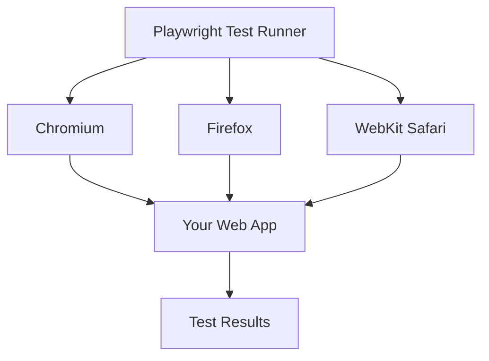
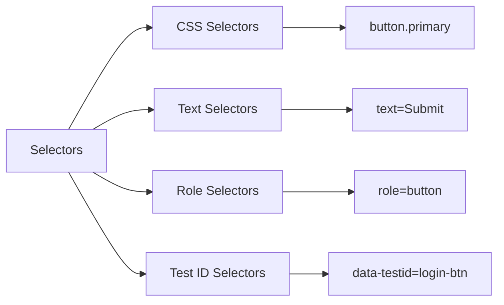
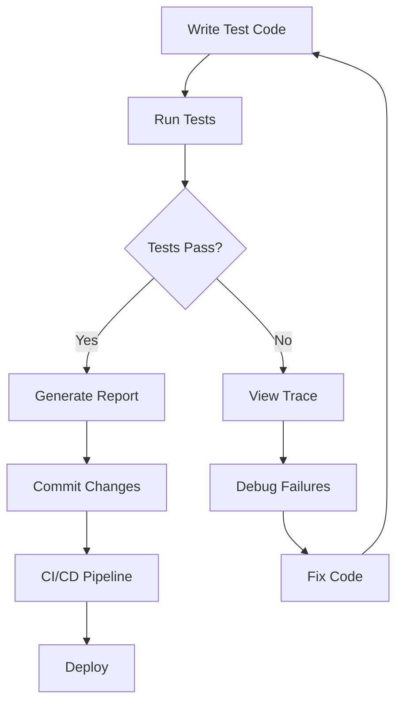
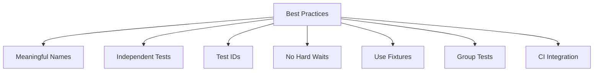

# How to Get Started with Playwright for E2E Testing

Author: [nawazdhandala](https://www.github.com/nawazdhandala)

Tags: Playwright, E2E Testing, Testing, Automation, Web Development

Description: A beginner's guide to Playwright for end-to-end testing, covering installation, writing tests, selectors, and running tests across browsers.

---

End-to-end (E2E) testing ensures your web application works correctly from a user's perspective. Playwright is a modern testing framework developed by Microsoft that lets you automate browser interactions across Chromium, Firefox, and WebKit with a single API.

In this guide, you will learn how to set up Playwright, write your first tests, use selectors effectively, and run tests across multiple browsers.

## What is Playwright?

Playwright is an open-source testing and automation library that supports all modern browsers. Unlike older tools like Selenium, Playwright was built from the ground up for modern web applications and handles complex scenarios like single-page apps, iframes, and shadow DOM elements with ease.



### Key Features

- Cross-browser support out of the box
- Auto-wait for elements before performing actions
- Built-in test runner with parallel execution
- Network interception and mocking
- Screenshot and video recording
- Mobile device emulation

## Installing Playwright

Let's start by setting up a new Playwright project. You will need Node.js 16 or higher installed on your machine.

```bash
# Create a new directory for your project
mkdir playwright-demo
cd playwright-demo

# Initialize a new Node.js project
npm init -y

# Install Playwright with its test runner
npm init playwright@latest
```

During installation, Playwright will ask you a few questions:

- Where to put your tests (default: `tests`)
- Whether to add a GitHub Actions workflow
- Whether to install browsers (select yes)

After installation, your project structure will look like this:

```
playwright-demo/
├── node_modules/
├── tests/
│   └── example.spec.ts
├── playwright.config.ts
├── package.json
└── package-lock.json
```

## Understanding the Test Structure

Playwright tests follow a simple structure. Let's examine the basic anatomy of a test file.

```typescript
// tests/homepage.spec.ts

// Import the test and expect functions from Playwright
import { test, expect } from '@playwright/test';

// Define a test suite using test.describe
test.describe('Homepage Tests', () => {

    // Each test case starts with test()
    test('should display the correct title', async ({ page }) => {
        // Navigate to the page
        await page.goto('https://example.com');

        // Assert that the page title matches our expectation
        await expect(page).toHaveTitle(/Example Domain/);
    });

    test('should have a visible heading', async ({ page }) => {
        await page.goto('https://example.com');

        // Find the h1 element and check if it's visible
        const heading = page.locator('h1');
        await expect(heading).toBeVisible();
    });
});
```

The test file imports `test` and `expect` from Playwright. Each test receives a `page` object that represents a browser tab where you can navigate and interact with elements.

## Writing Your First Test

Let's write a practical test for a login form. This example demonstrates navigation, form filling, and assertions.

```typescript
// tests/login.spec.ts

import { test, expect } from '@playwright/test';

test.describe('Login Functionality', () => {

    // beforeEach runs before every test in this describe block
    test.beforeEach(async ({ page }) => {
        // Navigate to the login page before each test
        await page.goto('https://your-app.com/login');
    });

    test('should login with valid credentials', async ({ page }) => {
        // Fill in the email input field
        // Playwright auto-waits for the element to be ready
        await page.fill('input[name="email"]', 'user@example.com');

        // Fill in the password field
        await page.fill('input[name="password"]', 'securepassword123');

        // Click the login button
        await page.click('button[type="submit"]');

        // Wait for navigation to complete and verify we landed on the dashboard
        await expect(page).toHaveURL(/.*dashboard/);

        // Verify a welcome message is displayed
        const welcomeMessage = page.locator('.welcome-message');
        await expect(welcomeMessage).toContainText('Welcome');
    });

    test('should show error for invalid credentials', async ({ page }) => {
        // Enter invalid credentials
        await page.fill('input[name="email"]', 'wrong@example.com');
        await page.fill('input[name="password"]', 'wrongpassword');

        // Submit the form
        await page.click('button[type="submit"]');

        // Check that an error message appears
        const errorMessage = page.locator('.error-message');
        await expect(errorMessage).toBeVisible();
        await expect(errorMessage).toContainText('Invalid credentials');
    });
});
```

## Understanding Selectors

Playwright supports multiple selector strategies. Choosing the right selector makes your tests more reliable and maintainable.



### CSS Selectors

Standard CSS selectors work just like in your stylesheets.

```typescript
// Select by class
await page.click('.submit-button');

// Select by ID
await page.fill('#username', 'john');

// Select by attribute
await page.click('button[type="submit"]');

// Combine selectors for specificity
await page.click('form.login-form button.primary');
```

### Text Selectors

Text selectors find elements by their visible text content.

```typescript
// Exact text match
await page.click('text=Sign In');

// Partial text match (case insensitive)
await page.click('text=sign in');

// Using the getByText method (recommended)
await page.getByText('Sign In').click();
```

### Role Selectors

Role selectors use ARIA roles and are great for accessible applications.

```typescript
// Select button by its role and name
await page.getByRole('button', { name: 'Submit' }).click();

// Select a link
await page.getByRole('link', { name: 'Learn More' }).click();

// Select a textbox (input)
await page.getByRole('textbox', { name: 'Email' }).fill('user@example.com');

// Select a heading
const title = page.getByRole('heading', { level: 1 });
await expect(title).toBeVisible();
```

### Test ID Selectors

Test IDs are the most reliable selector strategy for automated testing.

```typescript
// In your HTML: <button data-testid="login-button">Login</button>

// Select using getByTestId
await page.getByTestId('login-button').click();

// You can configure the test ID attribute in playwright.config.ts
// to use a different attribute name like data-test or data-qa
```

## Running Tests

Playwright provides several ways to run your tests.

```bash
# Run all tests
npx playwright test

# Run tests in a specific file
npx playwright test tests/login.spec.ts

# Run tests with a specific title
npx playwright test -g "should login with valid credentials"

# Run tests in headed mode (see the browser)
npx playwright test --headed

# Run tests in a specific browser
npx playwright test --project=chromium
npx playwright test --project=firefox
npx playwright test --project=webkit

# Run tests in debug mode
npx playwright test --debug

# Run tests and generate HTML report
npx playwright test --reporter=html
```

After running tests, you can view the HTML report:

```bash
npx playwright show-report
```

## Test Configuration

The `playwright.config.ts` file controls how tests run. Here is a basic configuration with comments explaining each option.

```typescript
// playwright.config.ts

import { defineConfig, devices } from '@playwright/test';

export default defineConfig({
    // Directory containing test files
    testDir: './tests',

    // Run tests in parallel for faster execution
    fullyParallel: true,

    // Fail the build if you accidentally left test.only in the code
    forbidOnly: !!process.env.CI,

    // Retry failed tests on CI only
    retries: process.env.CI ? 2 : 0,

    // Limit parallel workers on CI to avoid resource issues
    workers: process.env.CI ? 1 : undefined,

    // Reporter to use for test results
    reporter: 'html',

    // Shared settings for all projects
    use: {
        // Base URL for page.goto() calls
        baseURL: 'http://localhost:3000',

        // Capture screenshot on failure
        screenshot: 'only-on-failure',

        // Record video on failure
        video: 'on-first-retry',

        // Collect trace on failure for debugging
        trace: 'on-first-retry',
    },

    // Configure browsers to test against
    projects: [
        {
            name: 'chromium',
            use: { ...devices['Desktop Chrome'] },
        },
        {
            name: 'firefox',
            use: { ...devices['Desktop Firefox'] },
        },
        {
            name: 'webkit',
            use: { ...devices['Desktop Safari'] },
        },
        // Test on mobile viewports
        {
            name: 'Mobile Chrome',
            use: { ...devices['Pixel 5'] },
        },
        {
            name: 'Mobile Safari',
            use: { ...devices['iPhone 12'] },
        },
    ],

    // Run a local dev server before starting tests
    webServer: {
        command: 'npm run dev',
        url: 'http://localhost:3000',
        reuseExistingServer: !process.env.CI,
    },
});
```

## Test Workflow Overview

Here is a visual representation of the typical Playwright testing workflow:



## Using Page Object Model

For larger test suites, the Page Object Model (POM) pattern helps organize your code and reduce duplication.

```typescript
// pages/LoginPage.ts

import { Page, Locator } from '@playwright/test';

export class LoginPage {
    // Store the page instance
    readonly page: Page;

    // Define locators as class properties
    readonly emailInput: Locator;
    readonly passwordInput: Locator;
    readonly submitButton: Locator;
    readonly errorMessage: Locator;

    constructor(page: Page) {
        this.page = page;

        // Initialize locators in the constructor
        this.emailInput = page.getByRole('textbox', { name: 'Email' });
        this.passwordInput = page.getByRole('textbox', { name: 'Password' });
        this.submitButton = page.getByRole('button', { name: 'Sign In' });
        this.errorMessage = page.locator('.error-message');
    }

    // Navigate to the login page
    async goto() {
        await this.page.goto('/login');
    }

    // Perform login action
    async login(email: string, password: string) {
        await this.emailInput.fill(email);
        await this.passwordInput.fill(password);
        await this.submitButton.click();
    }

    // Get the error message text
    async getErrorMessage(): Promise<string> {
        return await this.errorMessage.textContent() ?? '';
    }
}
```

Now use the page object in your tests:

```typescript
// tests/login-pom.spec.ts

import { test, expect } from '@playwright/test';
import { LoginPage } from '../pages/LoginPage';

test.describe('Login with Page Object Model', () => {
    let loginPage: LoginPage;

    test.beforeEach(async ({ page }) => {
        // Create a new LoginPage instance for each test
        loginPage = new LoginPage(page);
        await loginPage.goto();
    });

    test('should login successfully', async ({ page }) => {
        await loginPage.login('user@example.com', 'password123');

        // Verify redirect to dashboard
        await expect(page).toHaveURL(/.*dashboard/);
    });

    test('should display error for invalid login', async () => {
        await loginPage.login('invalid@example.com', 'wrong');

        // Use the page object method to check the error
        const errorText = await loginPage.getErrorMessage();
        expect(errorText).toContain('Invalid credentials');
    });
});
```

## Debugging Tests

When tests fail, Playwright offers several debugging tools.

### Using the Playwright Inspector

Run tests in debug mode to step through each action:

```bash
npx playwright test --debug
```

### Using Trace Viewer

Traces capture a complete record of your test execution including screenshots, DOM snapshots, and network requests.

```bash
# After a test failure, open the trace
npx playwright show-trace trace.zip
```

### Adding Pause Statements

You can pause test execution at any point:

```typescript
test('debugging example', async ({ page }) => {
    await page.goto('https://example.com');

    // Pause execution here and open inspector
    await page.pause();

    // Continue with your test
    await page.click('button');
});
```

## Best Practices

Follow these guidelines to write maintainable and reliable tests:

1. **Use meaningful test names** that describe the expected behavior
2. **Keep tests independent** so they can run in any order
3. **Use test IDs** for elements that are critical to test
4. **Avoid hard-coded waits** and rely on Playwright's auto-waiting
5. **Use fixtures** for common setup and teardown logic
6. **Group related tests** using `test.describe`
7. **Run tests in CI** to catch regressions early



## Conclusion

Playwright is a powerful tool for E2E testing that works across all major browsers. In this guide, you learned how to:

- Install and set up Playwright in a new project
- Write tests using the Playwright test runner
- Use different selector strategies to find elements
- Run tests in various modes and browsers
- Organize tests using the Page Object Model
- Debug failing tests with built-in tools

Start by writing a few simple tests for your application's critical paths. As you get comfortable, expand your test suite to cover more scenarios. The investment in E2E testing pays off through fewer bugs reaching production and greater confidence when deploying changes.

For more advanced topics like API testing, authentication handling, and component testing, check out the official Playwright documentation at https://playwright.dev.
