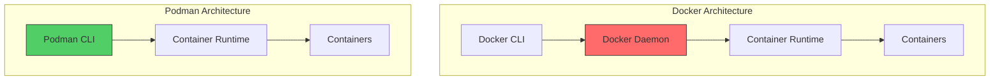
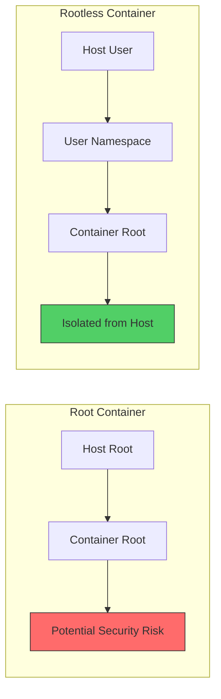
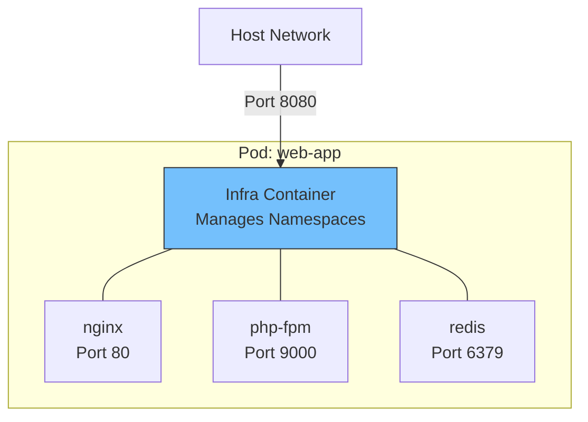
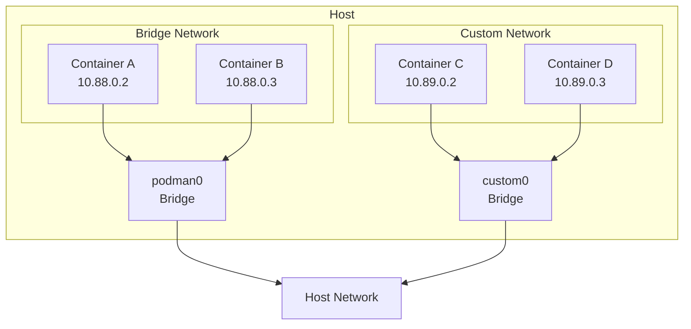

# How to Use Podman as Docker Alternative

Author: [nawazdhandala](https://www.github.com/nawazdhandala)

Tags: Podman, Docker, Containers, DevOps, Linux

Description: Learn how to use Podman as a drop-in replacement for Docker with rootless containers, pods, and seamless migration from Docker workflows.

---

Podman has emerged as a powerful container engine that offers a Docker-compatible CLI while providing additional security features like rootless containers by default. This guide walks you through practical usage patterns for running Podman as your primary container tool.

## Why Choose Podman Over Docker?

Podman offers several advantages that make it worth considering:

- **Rootless by default**: Run containers without root privileges, reducing security risks
- **Daemonless architecture**: No background daemon required, reducing resource usage
- **Pod support**: Native support for grouping containers into pods (similar to Kubernetes pods)
- **Docker CLI compatibility**: Most Docker commands work with Podman unchanged
- **OCI compliant**: Works with standard container images from any registry



## Setting Up the Docker Alias

The simplest way to start using Podman is to create an alias that maps Docker commands to Podman.

```bash
# Add this to your ~/.bashrc or ~/.zshrc
# This allows you to use 'docker' command which runs podman
alias docker=podman

# Reload your shell configuration
source ~/.bashrc
```

For a more permanent solution, you can install the podman-docker package:

```bash
# On Fedora/RHEL/CentOS
# This package provides a docker symlink pointing to podman
sudo dnf install podman-docker

# On Ubuntu/Debian
# Same functionality for Debian-based systems
sudo apt install podman-docker
```

## Running Your First Container

Podman commands mirror Docker almost exactly. Here are common operations:

```bash
# Pull an image from Docker Hub
# Podman uses the same image format as Docker
podman pull nginx:alpine

# Run a container in detached mode
# -d: run in background
# -p: map port 8080 on host to port 80 in container
# --name: give the container a friendly name
podman run -d -p 8080:80 --name webserver nginx:alpine

# List running containers
# Shows container ID, image, command, status, ports, and names
podman ps

# View container logs
# -f: follow log output in real-time
podman logs -f webserver

# Stop and remove the container
# stop: sends SIGTERM, then SIGKILL after timeout
# rm: removes the stopped container
podman stop webserver
podman rm webserver
```

## Working with Rootless Containers

One of Podman's standout features is rootless container support. This runs containers entirely in user space without requiring root privileges.



```bash
# Check your current user namespaces configuration
# This shows how many subordinate UIDs your user can use
cat /etc/subuid

# Check subordinate GIDs
# Similar to subuid but for group IDs
cat /etc/subgid

# Run a rootless container
# No sudo required - runs entirely as your user
podman run -d --name rootless-nginx -p 8080:80 nginx:alpine

# Verify the container is running rootless
# The process owner should be your username, not root
podman top rootless-nginx user

# Check the container's user namespace mapping
# Shows how UIDs inside container map to UIDs on host
podman unshare cat /proc/self/uid_map
```

### Configuring Rootless Storage

Rootless containers store data in your home directory by default:

```bash
# View current storage configuration
# Shows where images and containers are stored
podman info --format '{{.Store.GraphRoot}}'

# Default location is typically ~/.local/share/containers/storage
# You can change this by editing the storage configuration file

# View the storage configuration file location
podman info --format '{{.Store.ConfigFile}}'
```

## Creating and Managing Pods

Pods group multiple containers that share network and storage namespaces, similar to Kubernetes pods.



```bash
# Create a new pod with port mapping
# The pod acts as a wrapper for multiple containers
# -p: publish port 8080 on host to port 80 inside the pod
podman pod create --name web-app -p 8080:80

# Add an nginx container to the pod
# --pod: attach this container to the web-app pod
# The container shares the pod's network namespace
podman run -d --pod web-app --name nginx nginx:alpine

# Add a Redis container to the same pod
# Both containers can communicate via localhost
podman run -d --pod web-app --name redis redis:alpine

# List all pods
# Shows pod ID, name, status, and number of containers
podman pod ps

# List containers in the pod
# --pod flag filters by pod name
podman ps --pod --filter "pod=web-app"

# Containers in the same pod can reach each other via localhost
# Test connectivity from nginx to redis
podman exec nginx sh -c "nc -zv localhost 6379"

# Stop all containers in the pod
podman pod stop web-app

# Remove the pod and all its containers
# -f: force removal even if containers are running
podman pod rm -f web-app
```

## Using Podman Compose

Podman works with Docker Compose files through podman-compose or the built-in compose support.

```bash
# Install podman-compose
# Python-based tool that reads docker-compose.yml files
pip install podman-compose

# Or use Podman's built-in compose support (Podman 3.0+)
# This provides native compose functionality
podman compose --help
```

Create a `docker-compose.yml` file:

```yaml
# docker-compose.yml
# Standard Docker Compose format - works with Podman
version: '3.8'

services:
  # Web application service
  web:
    image: nginx:alpine
    ports:
      - "8080:80"
    volumes:
      # Mount local html directory into the container
      - ./html:/usr/share/nginx/html:ro
    depends_on:
      - api
    networks:
      - frontend

  # API backend service
  api:
    image: python:3.11-slim
    working_dir: /app
    volumes:
      - ./api:/app
    command: python -m http.server 5000
    networks:
      - frontend
      - backend

  # Database service
  db:
    image: postgres:15-alpine
    environment:
      # Database configuration via environment variables
      POSTGRES_USER: myapp
      POSTGRES_PASSWORD: secret
      POSTGRES_DB: myapp_db
    volumes:
      # Named volume for persistent data
      - db_data:/var/lib/postgresql/data
    networks:
      - backend

networks:
  frontend:
  backend:

volumes:
  db_data:
```

```bash
# Start services defined in docker-compose.yml
# -d: run in detached mode
podman-compose up -d

# Or with native podman compose
podman compose up -d

# View running services
podman-compose ps

# View logs from all services
# -f: follow log output
podman-compose logs -f

# Stop and remove all services
# --volumes: also remove named volumes
podman-compose down --volumes
```

## Building Images with Podman

Podman uses the same Dockerfile format as Docker:

```dockerfile
# Dockerfile
# Use official Python image as base
FROM python:3.11-slim

# Set working directory inside container
WORKDIR /app

# Copy requirements file first (for better layer caching)
# This layer only rebuilds when requirements change
COPY requirements.txt .

# Install Python dependencies
# --no-cache-dir: don't store pip cache (smaller image)
RUN pip install --no-cache-dir -r requirements.txt

# Copy application code
# This layer rebuilds when any source file changes
COPY . .

# Document the port the app listens on
EXPOSE 5000

# Set the default command to run the application
# Using exec form for proper signal handling
CMD ["python", "app.py"]
```

```bash
# Build an image from Dockerfile
# -t: tag the image with a name
# .: use current directory as build context
podman build -t myapp:latest .

# Build with specific Dockerfile
# -f: specify path to Dockerfile
podman build -t myapp:dev -f Dockerfile.dev .

# List local images
# Shows repository, tag, image ID, created date, and size
podman images

# Tag image for a registry
# Format: registry/repository:tag
podman tag myapp:latest quay.io/myuser/myapp:latest

# Push image to registry
# Requires prior authentication with podman login
podman push quay.io/myuser/myapp:latest
```

## Managing Volumes and Bind Mounts

```bash
# Create a named volume
# Named volumes are managed by Podman and persist data
podman volume create mydata

# List all volumes
podman volume ls

# Inspect volume details
# Shows mount point, driver, and labels
podman volume inspect mydata

# Run container with named volume
# -v volume_name:container_path
# Data persists even after container removal
podman run -d \
    --name db \
    -v mydata:/var/lib/postgresql/data \
    postgres:15-alpine

# Run container with bind mount
# -v host_path:container_path:options
# :Z applies SELinux label for container access
podman run -d \
    --name web \
    -v /home/user/website:/usr/share/nginx/html:Z \
    nginx:alpine

# Remove unused volumes
# Cleans up volumes not attached to any container
podman volume prune
```

## Container Networking

Podman provides flexible networking options:



```bash
# List available networks
podman network ls

# Create a custom bridge network
# --subnet: define the IP range for containers
podman network create --subnet 10.89.0.0/24 mynetwork

# Run container on custom network
# Containers on same network can communicate by name
podman run -d \
    --name web \
    --network mynetwork \
    nginx:alpine

# Connect running container to additional network
# Container can now reach both networks
podman network connect mynetwork existing-container

# Inspect network to see connected containers
podman network inspect mynetwork

# Run container with host networking
# Container shares host's network namespace directly
# Useful for performance but reduces isolation
podman run -d --network host nginx:alpine
```

## Generating Systemd Services

Podman can generate systemd unit files to manage containers as system services:

```bash
# Generate systemd unit file for existing container
# --name: service name
# --files: output to files instead of stdout
# --new: create new container on service start (recommended)
podman generate systemd --name webserver --files --new

# The generated file looks like webserver.service
# Move it to systemd user directory for rootless
mkdir -p ~/.config/systemd/user
mv container-webserver.service ~/.config/systemd/user/

# Reload systemd to recognize new service
systemctl --user daemon-reload

# Enable service to start on boot
# --now: also start it immediately
systemctl --user enable --now container-webserver

# Check service status
systemctl --user status container-webserver

# View service logs
journalctl --user -u container-webserver
```

For system-wide services (requires root):

```bash
# Generate for root/system service
sudo podman generate systemd --name webserver --files --new

# Move to system directory
sudo mv container-webserver.service /etc/systemd/system/

# Enable and start
sudo systemctl daemon-reload
sudo systemctl enable --now container-webserver
```

## Inspecting and Debugging Containers

```bash
# Get detailed container information
# Returns JSON with all container configuration
podman inspect webserver

# Get specific field using Go template
# Useful for scripting
podman inspect --format '{{.NetworkSettings.IPAddress}}' webserver

# Execute command in running container
# -it: interactive terminal
podman exec -it webserver /bin/sh

# View container resource usage
# Shows CPU, memory, network, and block I/O
podman stats webserver

# View container processes
# Shows processes running inside the container
podman top webserver

# Export container filesystem to tar archive
# Useful for debugging or transferring container state
podman export webserver > webserver-filesystem.tar

# View container changes from base image
# Shows added, changed, and deleted files
podman diff webserver
```

## Image Management Best Practices

```bash
# Remove unused images
# Only removes images not used by any container
podman image prune

# Remove all unused images, containers, and volumes
# -a: remove all unused images, not just dangling ones
# -f: force without confirmation prompt
podman system prune -a -f

# Check disk usage by Podman
# Shows space used by images, containers, and volumes
podman system df

# Save image to tar archive
# Useful for transferring images without a registry
podman save -o nginx-alpine.tar nginx:alpine

# Load image from tar archive
podman load -i nginx-alpine.tar

# View image layer history
# Shows each layer, its size, and the command that created it
podman history nginx:alpine
```

## Migrating Docker Commands to Podman

Here's a quick reference for common Docker commands and their Podman equivalents:

| Docker Command | Podman Command | Notes |
|---------------|----------------|-------|
| `docker run` | `podman run` | Identical syntax |
| `docker build` | `podman build` | Identical syntax |
| `docker-compose` | `podman-compose` or `podman compose` | Requires podman-compose or Podman 3.0+ |
| `docker swarm` | N/A | Use Kubernetes or Podman pods |
| `docker system prune` | `podman system prune` | Identical syntax |
| `docker login` | `podman login` | Identical syntax |

## Troubleshooting Common Issues

### Permission Denied Errors

```bash
# If you see permission errors with rootless containers
# Check subuid/subgid configuration
grep $(whoami) /etc/subuid /etc/subgid

# If not configured, add entries (requires root)
sudo usermod --add-subuids 100000-165535 --add-subgids 100000-165535 $(whoami)

# Reset Podman storage after changing configuration
podman system migrate
```

### Port Binding Issues

```bash
# Rootless containers cannot bind to ports below 1024 by default
# Either use higher ports or adjust the system setting

# Check current unprivileged port start
cat /proc/sys/net/ipv4/ip_unprivileged_port_start

# Allow binding to port 80 (requires root)
sudo sysctl net.ipv4.ip_unprivileged_port_start=80

# Make it permanent
echo "net.ipv4.ip_unprivileged_port_start=80" | sudo tee -a /etc/sysctl.conf
```

### SELinux Issues

```bash
# If containers cannot access bind-mounted files
# Use the :Z or :z option for volume mounts

# :Z - private unshared label (single container access)
podman run -v /path:/container/path:Z image

# :z - shared label (multiple containers can access)
podman run -v /path:/container/path:z image
```

## Summary

Podman provides a secure, daemonless alternative to Docker while maintaining command compatibility. Its rootless capabilities and pod support make it particularly suitable for development environments and production workloads where security is a priority. The ability to generate systemd services makes it easy to manage containers as traditional system services.

Start by aliasing Docker to Podman, and gradually explore features like pods and rootless containers to take full advantage of what Podman offers.
