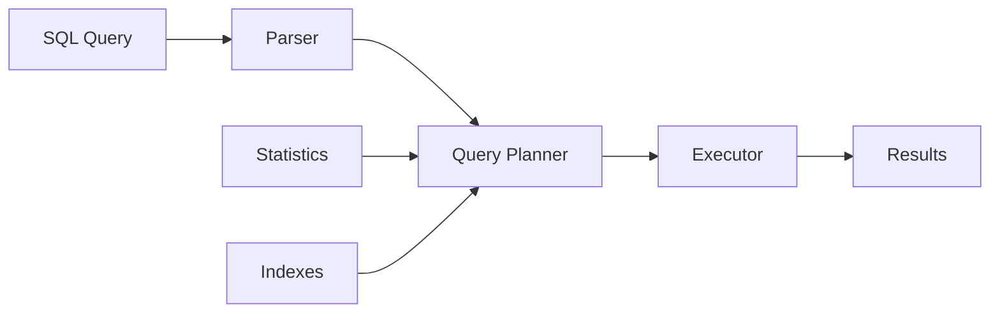
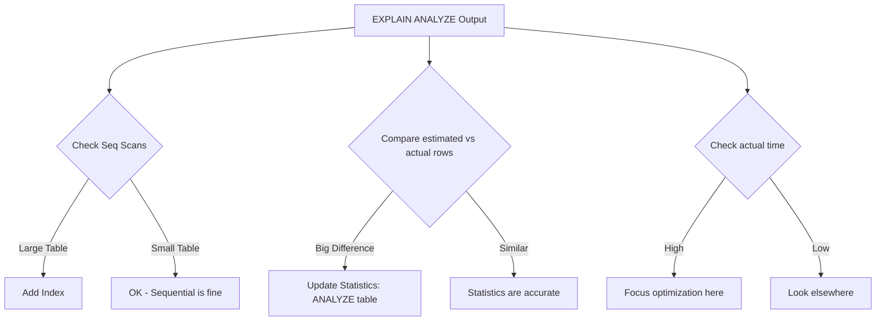
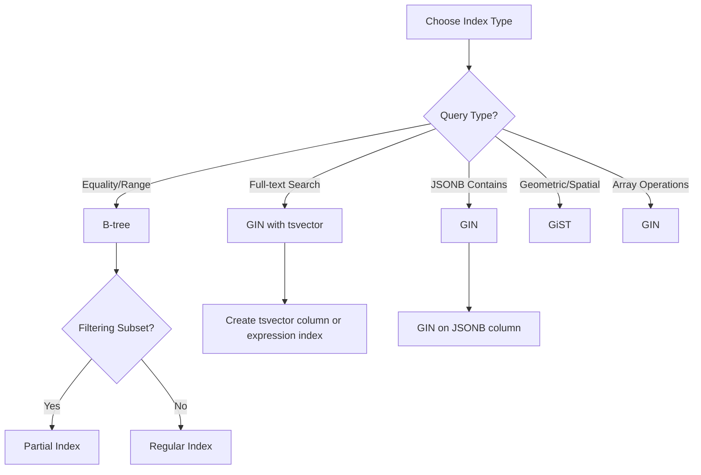
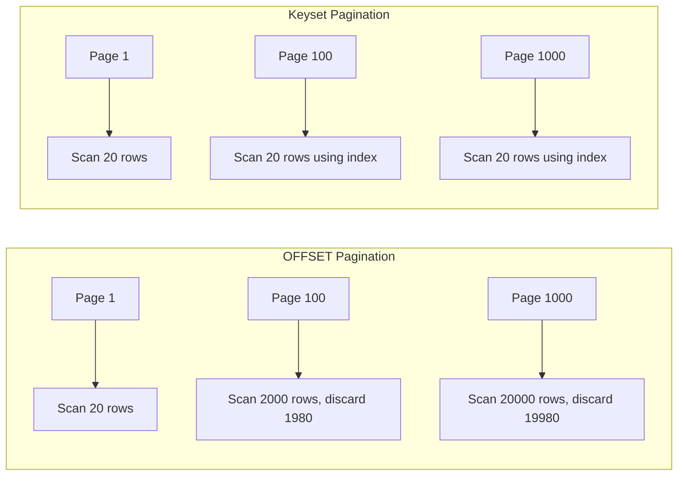
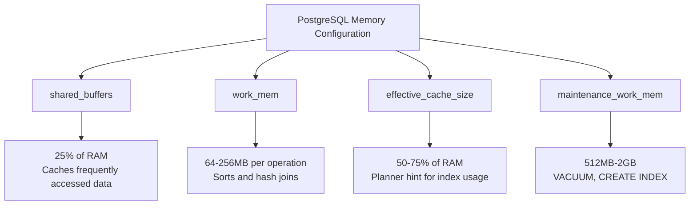
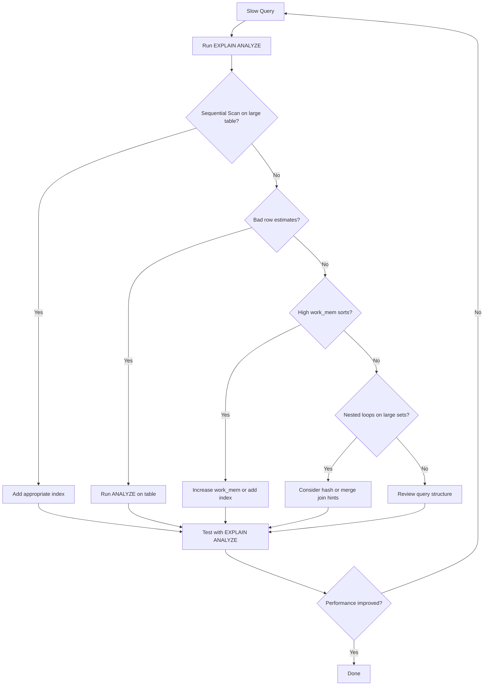

# How to Optimize PostgreSQL Query Performance

Author: [nawazdhandala](https://www.github.com/nawazdhandala)

Tags: PostgreSQL, Database, Performance, Query Optimization, Backend Development

Description: Learn how to optimize PostgreSQL query performance with indexing strategies, EXPLAIN ANALYZE, query rewriting, and configuration tuning.

---

PostgreSQL is a powerful database, but even the best database can slow down with poorly optimized queries. This guide walks you through practical techniques to identify bottlenecks and optimize your queries for better performance.

## Understanding Query Execution

Before optimizing, you need to understand how PostgreSQL executes queries. Every query goes through several stages: parsing, planning, and execution. The query planner chooses the most efficient execution plan based on table statistics and available indexes.



## Using EXPLAIN ANALYZE

The first step in query optimization is understanding what your query actually does. EXPLAIN ANALYZE runs your query and shows the execution plan with actual timings.

```sql
-- Basic EXPLAIN ANALYZE usage
-- This shows the query plan with actual execution times
EXPLAIN ANALYZE
SELECT u.name, COUNT(o.id) as order_count
FROM users u
LEFT JOIN orders o ON u.id = o.user_id
WHERE u.created_at > '2024-01-01'
GROUP BY u.id, u.name;

-- Example output breakdown:
-- HashAggregate  (cost=1234.56..1234.78 rows=100 width=40) (actual time=45.123..45.456 rows=95 loops=1)
--   Group Key: u.id, u.name
--   -> Hash Left Join  (cost=100.00..1200.00 rows=5000 width=36) (actual time=5.123..40.789 rows=4850 loops=1)
--         Hash Cond: (u.id = o.user_id)
--         -> Seq Scan on users u  (cost=0.00..50.00 rows=500 width=32) (actual time=0.015..1.234 rows=487 loops=1)
--               Filter: (created_at > '2024-01-01'::date)
--               Rows Removed by Filter: 13
--         -> Hash  (cost=80.00..80.00 rows=2000 width=8) (actual time=4.567..4.567 rows=1950 loops=1)
--               -> Seq Scan on orders o  (cost=0.00..80.00 rows=2000 width=8) (actual time=0.010..2.345 rows=1950 loops=1)
-- Planning Time: 0.234 ms
-- Execution Time: 45.678 ms
```

Key metrics to watch:

- **actual time**: Real execution time in milliseconds
- **rows**: Number of rows processed vs estimated
- **loops**: How many times the operation ran
- **Seq Scan**: Table scan without index (often a red flag for large tables)



## Indexing Strategies

Indexes are the most common way to speed up queries. However, adding indexes without thought can hurt write performance and waste disk space.

### B-tree Indexes (Default)

B-tree indexes work well for equality and range queries:

```sql
-- Create an index on a column used in WHERE clauses
-- B-tree is the default index type in PostgreSQL
CREATE INDEX idx_users_email ON users(email);

-- For queries filtering on email:
-- SELECT * FROM users WHERE email = 'user@example.com';
-- This query will now use idx_users_email instead of scanning the entire table

-- Composite index for queries that filter on multiple columns
-- Column order matters: put the most selective column first
CREATE INDEX idx_orders_user_status ON orders(user_id, status);

-- This index helps these queries:
-- SELECT * FROM orders WHERE user_id = 123;
-- SELECT * FROM orders WHERE user_id = 123 AND status = 'pending';

-- But NOT this query (leading column not in WHERE):
-- SELECT * FROM orders WHERE status = 'pending';
```

### Partial Indexes

Partial indexes only index rows that match a condition, saving space and improving performance:

```sql
-- Only index active users
-- Useful when you frequently query active users but rarely query inactive ones
CREATE INDEX idx_active_users ON users(email)
WHERE status = 'active';

-- This index is smaller and faster because it excludes inactive users
-- Perfect for: SELECT * FROM users WHERE status = 'active' AND email LIKE 'john%';

-- Index only recent orders (last 90 days)
-- Great for tables where you mostly query recent data
CREATE INDEX idx_recent_orders ON orders(created_at, user_id)
WHERE created_at > CURRENT_DATE - INTERVAL '90 days';
```

### GIN Indexes for Full-Text and JSONB

```sql
-- Full-text search index
-- GIN (Generalized Inverted Index) is optimized for values that contain multiple elements
CREATE INDEX idx_articles_search ON articles
USING GIN(to_tsvector('english', title || ' ' || body));

-- Query using the full-text index:
-- SELECT * FROM articles
-- WHERE to_tsvector('english', title || ' ' || body) @@ to_tsquery('postgresql & performance');

-- JSONB index for querying JSON data
-- Indexes all keys and values in the JSONB column
CREATE INDEX idx_events_data ON events USING GIN(data);

-- Now these JSONB queries are fast:
-- SELECT * FROM events WHERE data @> '{"type": "click"}';
-- SELECT * FROM events WHERE data ? 'user_id';

-- Index specific JSONB path for frequent queries
CREATE INDEX idx_events_user ON events((data->>'user_id'));
```



## Query Rewriting Techniques

Sometimes the best optimization is rewriting the query itself.

### Avoid SELECT *

```sql
-- Bad: Fetches all columns even if you only need a few
SELECT * FROM orders WHERE user_id = 123;

-- Good: Only fetch columns you need
-- This reduces I/O and can use covering indexes
SELECT id, status, total, created_at
FROM orders
WHERE user_id = 123;
```

### Use EXISTS Instead of IN for Subqueries

```sql
-- Slower: IN with subquery scans all results
SELECT * FROM users
WHERE id IN (SELECT user_id FROM orders WHERE total > 1000);

-- Faster: EXISTS stops at first match
-- PostgreSQL can optimize this to a semi-join
SELECT * FROM users u
WHERE EXISTS (
    SELECT 1 FROM orders o
    WHERE o.user_id = u.id AND o.total > 1000
);
```

### Optimize JOINs

```sql
-- Make sure join columns are indexed
CREATE INDEX idx_orders_user_id ON orders(user_id);

-- Use explicit JOIN syntax for clarity
-- The query planner can rearrange joins, but explicit syntax helps readability
SELECT
    u.name,
    COUNT(o.id) as order_count,
    SUM(o.total) as total_spent
FROM users u
INNER JOIN orders o ON u.id = o.user_id
WHERE o.created_at > '2024-01-01'
GROUP BY u.id, u.name
HAVING COUNT(o.id) > 5;

-- For large tables, consider breaking into CTEs for readability
-- Note: CTEs are optimization fences in older PostgreSQL versions
WITH recent_orders AS (
    SELECT user_id, COUNT(*) as cnt, SUM(total) as total
    FROM orders
    WHERE created_at > '2024-01-01'
    GROUP BY user_id
    HAVING COUNT(*) > 5
)
SELECT u.name, ro.cnt, ro.total
FROM users u
INNER JOIN recent_orders ro ON u.id = ro.user_id;
```

### Pagination Done Right

```sql
-- Bad: OFFSET scans and discards rows
-- Gets slower as OFFSET increases
SELECT * FROM orders ORDER BY created_at DESC LIMIT 20 OFFSET 10000;

-- Good: Keyset pagination using a cursor
-- Consistent performance regardless of page number
SELECT * FROM orders
WHERE created_at < '2024-06-15 10:30:00'  -- last seen timestamp
ORDER BY created_at DESC
LIMIT 20;

-- For unique ordering, include ID as tiebreaker
SELECT * FROM orders
WHERE (created_at, id) < ('2024-06-15 10:30:00', 12345)
ORDER BY created_at DESC, id DESC
LIMIT 20;
```



## Configuration Tuning

PostgreSQL's default configuration is conservative. Tuning these settings can significantly improve performance.

### Memory Settings

```sql
-- Check current settings
SHOW shared_buffers;
SHOW work_mem;
SHOW effective_cache_size;

-- Recommended settings (adjust based on your server RAM):

-- shared_buffers: Memory for caching data
-- Set to 25% of total RAM (e.g., 4GB for a 16GB server)
-- ALTER SYSTEM SET shared_buffers = '4GB';

-- work_mem: Memory per operation (sort, hash)
-- Start with 64MB-256MB, increase for complex queries
-- Be careful: this is per-operation, not per-query
-- ALTER SYSTEM SET work_mem = '128MB';

-- effective_cache_size: Hint to planner about OS cache
-- Set to 50-75% of total RAM
-- ALTER SYSTEM SET effective_cache_size = '12GB';

-- maintenance_work_mem: Memory for maintenance operations
-- Set higher for faster VACUUM and index creation
-- ALTER SYSTEM SET maintenance_work_mem = '1GB';
```

### Connection and Parallelism

```sql
-- Enable parallel query execution for large tables
-- max_parallel_workers_per_gather: workers per query
-- ALTER SYSTEM SET max_parallel_workers_per_gather = 4;

-- Parallel query threshold
-- Smaller value = more parallel execution
-- ALTER SYSTEM SET min_parallel_table_scan_size = '8MB';

-- Check if your query uses parallel execution
EXPLAIN ANALYZE
SELECT COUNT(*) FROM large_table WHERE category = 'electronics';
-- Look for "Workers Planned" and "Workers Launched" in output
```



## Maintaining Statistics

PostgreSQL relies on table statistics to make good query plans. Outdated statistics lead to poor plans.

```sql
-- Update statistics for a specific table
-- Run after bulk inserts or significant data changes
ANALYZE users;

-- Update statistics for all tables in the database
ANALYZE;

-- Check when statistics were last updated
SELECT
    schemaname,
    relname,
    last_analyze,
    last_autoanalyze,
    n_live_tup,
    n_dead_tup
FROM pg_stat_user_tables
ORDER BY last_analyze DESC NULLS LAST;

-- Increase statistics sampling for better estimates on skewed data
-- Default is 100, higher values = more accurate but slower ANALYZE
ALTER TABLE orders ALTER COLUMN status SET STATISTICS 500;
ANALYZE orders;
```

## Monitoring Slow Queries

Set up logging to catch slow queries in production:

```sql
-- Enable slow query logging (in postgresql.conf or via ALTER SYSTEM)
-- ALTER SYSTEM SET log_min_duration_statement = '1000';  -- Log queries over 1 second

-- Use pg_stat_statements extension for query statistics
CREATE EXTENSION IF NOT EXISTS pg_stat_statements;

-- Find the slowest queries
SELECT
    substring(query, 1, 100) as query_preview,
    calls,
    round(total_exec_time::numeric, 2) as total_ms,
    round(mean_exec_time::numeric, 2) as avg_ms,
    rows
FROM pg_stat_statements
ORDER BY total_exec_time DESC
LIMIT 10;

-- Find queries with the most calls (potential optimization targets)
SELECT
    substring(query, 1, 100) as query_preview,
    calls,
    round(mean_exec_time::numeric, 2) as avg_ms
FROM pg_stat_statements
ORDER BY calls DESC
LIMIT 10;
```

## Quick Reference Checklist

Use this checklist when optimizing a slow query:



## Summary

Optimizing PostgreSQL queries follows a systematic approach:

1. **Measure first** with EXPLAIN ANALYZE to find the actual bottleneck
2. **Add indexes** strategically for columns in WHERE, JOIN, and ORDER BY clauses
3. **Rewrite queries** to avoid common anti-patterns like SELECT *, inefficient subqueries, and OFFSET pagination
4. **Tune configuration** based on your server resources and workload
5. **Keep statistics fresh** with regular ANALYZE runs
6. **Monitor continuously** with pg_stat_statements to catch regressions

Start with the biggest bottlenecks and measure after each change. Small improvements compound into significant performance gains over time.
