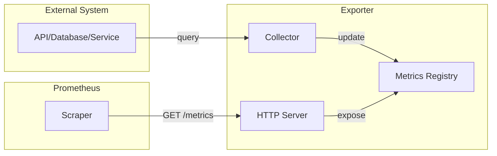

# How to Build Custom Exporters for Prometheus

Author: [nawazdhandala](https://www.github.com/nawazdhandala)

Tags: Prometheus, Exporters, Custom Metrics, Go, Python, Monitoring, Instrumentation

Description: Learn how to build custom Prometheus exporters to expose metrics from applications and systems that do not natively support Prometheus format, with examples in Go and Python.

---

Exporters bridge the gap between systems that do not natively expose Prometheus metrics and your monitoring infrastructure. This guide shows you how to build custom exporters that follow Prometheus conventions and best practices.

## Exporter Architecture



## Exporter Types

| Type | Description | Example |
|------|-------------|---------|
| Direct instrumentation | App exposes its own metrics | Web server with /metrics endpoint |
| Sidecar exporter | Runs alongside application | Database exporter |
| Standalone exporter | Queries external system | Cloud API exporter |

## Building an Exporter in Python

### Basic Structure

```python
#!/usr/bin/env python3
"""Custom Prometheus exporter for a hypothetical queue system."""

import time
import random
from prometheus_client import start_http_server, Gauge, Counter, Histogram, Info

# Define metrics
queue_depth = Gauge(
    'queue_depth',
    'Current number of items in the queue',
    ['queue_name']
)

messages_processed = Counter(
    'messages_processed_total',
    'Total messages processed',
    ['queue_name', 'status']
)

processing_time = Histogram(
    'message_processing_seconds',
    'Time spent processing messages',
    ['queue_name'],
    buckets=[0.01, 0.05, 0.1, 0.25, 0.5, 1.0, 2.5, 5.0]
)

exporter_info = Info(
    'queue_exporter',
    'Information about the queue exporter'
)

def collect_metrics():
    """Collect metrics from the queue system."""
    # In a real exporter, this would query your system
    # For demo, we simulate data

    queues = ['orders', 'notifications', 'analytics']

    for queue in queues:
        # Simulate queue depth
        depth = random.randint(0, 100)
        queue_depth.labels(queue_name=queue).set(depth)

        # Simulate message processing
        processed = random.randint(1, 10)
        messages_processed.labels(queue_name=queue, status='success').inc(processed)

        if random.random() < 0.1:  # 10% failure rate
            messages_processed.labels(queue_name=queue, status='failure').inc(1)

        # Simulate processing time
        for _ in range(processed):
            duration = random.uniform(0.01, 0.5)
            processing_time.labels(queue_name=queue).observe(duration)

def main():
    # Set exporter info
    exporter_info.info({
        'version': '1.0.0',
        'queue_system': 'custom-queue',
    })

    # Start HTTP server
    start_http_server(9100)
    print('Exporter started on port 9100')

    # Collect metrics periodically
    while True:
        collect_metrics()
        time.sleep(15)  # Collect every 15 seconds

if __name__ == '__main__':
    main()
```

### Using Collectors for On-Demand Metrics

```python
#!/usr/bin/env python3
"""Exporter using custom collector for on-demand metric collection."""

from prometheus_client import start_http_server, REGISTRY
from prometheus_client.core import GaugeMetricFamily, CounterMetricFamily
import time


class QueueCollector:
    """Collector that fetches metrics on each scrape."""

    def __init__(self, queue_client):
        self.queue_client = queue_client

    def collect(self):
        """Collect metrics from the queue system."""
        # Gauge for queue depth
        queue_depth = GaugeMetricFamily(
            'queue_depth',
            'Current number of items in the queue',
            labels=['queue_name']
        )

        # Counter for processed messages
        messages_total = CounterMetricFamily(
            'messages_processed_total',
            'Total messages processed',
            labels=['queue_name', 'status']
        )

        # Fetch data from queue system
        for queue_name in self.queue_client.list_queues():
            stats = self.queue_client.get_queue_stats(queue_name)

            queue_depth.add_metric([queue_name], stats['depth'])
            messages_total.add_metric([queue_name, 'success'], stats['processed'])
            messages_total.add_metric([queue_name, 'failure'], stats['failed'])

        yield queue_depth
        yield messages_total


class MockQueueClient:
    """Mock queue client for demonstration."""

    def list_queues(self):
        return ['orders', 'notifications', 'analytics']

    def get_queue_stats(self, queue_name):
        import random
        return {
            'depth': random.randint(0, 100),
            'processed': random.randint(1000, 10000),
            'failed': random.randint(0, 100),
        }


def main():
    # Create queue client
    queue_client = MockQueueClient()

    # Register custom collector
    REGISTRY.register(QueueCollector(queue_client))

    # Start HTTP server
    start_http_server(9100)
    print('Exporter started on port 9100')

    # Keep the process running
    while True:
        time.sleep(1)


if __name__ == '__main__':
    main()
```

## Building an Exporter in Go

### Basic Structure

```go
package main

import (
    "log"
    "math/rand"
    "net/http"
    "time"

    "github.com/prometheus/client_golang/prometheus"
    "github.com/prometheus/client_golang/prometheus/promauto"
    "github.com/prometheus/client_golang/prometheus/promhttp"
)

var (
    queueDepth = promauto.NewGaugeVec(
        prometheus.GaugeOpts{
            Name: "queue_depth",
            Help: "Current number of items in the queue",
        },
        []string{"queue_name"},
    )

    messagesProcessed = promauto.NewCounterVec(
        prometheus.CounterOpts{
            Name: "messages_processed_total",
            Help: "Total messages processed",
        },
        []string{"queue_name", "status"},
    )

    processingTime = promauto.NewHistogramVec(
        prometheus.HistogramOpts{
            Name:    "message_processing_seconds",
            Help:    "Time spent processing messages",
            Buckets: []float64{0.01, 0.05, 0.1, 0.25, 0.5, 1.0, 2.5, 5.0},
        },
        []string{"queue_name"},
    )
)

func collectMetrics() {
    queues := []string{"orders", "notifications", "analytics"}

    for _, queue := range queues {
        // Simulate queue depth
        queueDepth.WithLabelValues(queue).Set(float64(rand.Intn(100)))

        // Simulate message processing
        processed := rand.Intn(10) + 1
        messagesProcessed.WithLabelValues(queue, "success").Add(float64(processed))

        if rand.Float64() < 0.1 {
            messagesProcessed.WithLabelValues(queue, "failure").Inc()
        }

        // Simulate processing time
        for i := 0; i < processed; i++ {
            duration := rand.Float64() * 0.5
            processingTime.WithLabelValues(queue).Observe(duration)
        }
    }
}

func main() {
    // Start background collection
    go func() {
        for {
            collectMetrics()
            time.Sleep(15 * time.Second)
        }
    }()

    // Expose metrics endpoint
    http.Handle("/metrics", promhttp.Handler())
    log.Println("Exporter started on :9100")
    log.Fatal(http.ListenAndServe(":9100", nil))
}
```

### Using Custom Collector

```go
package main

import (
    "log"
    "net/http"
    "sync"

    "github.com/prometheus/client_golang/prometheus"
    "github.com/prometheus/client_golang/prometheus/promhttp"
)

// QueueCollector implements prometheus.Collector
type QueueCollector struct {
    queueClient *QueueClient

    queueDepth *prometheus.Desc
    messagesTotal *prometheus.Desc
}

func NewQueueCollector(client *QueueClient) *QueueCollector {
    return &QueueCollector{
        queueClient: client,
        queueDepth: prometheus.NewDesc(
            "queue_depth",
            "Current number of items in the queue",
            []string{"queue_name"},
            nil,
        ),
        messagesTotal: prometheus.NewDesc(
            "messages_processed_total",
            "Total messages processed",
            []string{"queue_name", "status"},
            nil,
        ),
    }
}

// Describe sends metric descriptions to the channel
func (c *QueueCollector) Describe(ch chan<- *prometheus.Desc) {
    ch <- c.queueDepth
    ch <- c.messagesTotal
}

// Collect fetches metrics from the queue system
func (c *QueueCollector) Collect(ch chan<- prometheus.Metric) {
    queues := c.queueClient.ListQueues()

    var wg sync.WaitGroup
    for _, queue := range queues {
        wg.Add(1)
        go func(queueName string) {
            defer wg.Done()

            stats, err := c.queueClient.GetStats(queueName)
            if err != nil {
                log.Printf("Error collecting stats for %s: %v", queueName, err)
                return
            }

            ch <- prometheus.MustNewConstMetric(
                c.queueDepth,
                prometheus.GaugeValue,
                float64(stats.Depth),
                queueName,
            )

            ch <- prometheus.MustNewConstMetric(
                c.messagesTotal,
                prometheus.CounterValue,
                float64(stats.Processed),
                queueName, "success",
            )

            ch <- prometheus.MustNewConstMetric(
                c.messagesTotal,
                prometheus.CounterValue,
                float64(stats.Failed),
                queueName, "failure",
            )
        }(queue)
    }
    wg.Wait()
}

// QueueClient represents your queue system client
type QueueClient struct{}

type QueueStats struct {
    Depth     int
    Processed int
    Failed    int
}

func (c *QueueClient) ListQueues() []string {
    return []string{"orders", "notifications", "analytics"}
}

func (c *QueueClient) GetStats(queueName string) (*QueueStats, error) {
    // Fetch real stats from your queue system
    return &QueueStats{
        Depth:     42,
        Processed: 10000,
        Failed:    50,
    }, nil
}

func main() {
    client := &QueueClient{}
    collector := NewQueueCollector(client)

    // Create new registry to avoid default metrics
    registry := prometheus.NewRegistry()
    registry.MustRegister(collector)

    // Or use default registry
    // prometheus.MustRegister(collector)

    http.Handle("/metrics", promhttp.HandlerFor(registry, promhttp.HandlerOpts{}))
    log.Println("Exporter started on :9100")
    log.Fatal(http.ListenAndServe(":9100", nil))
}
```

## Exporter Best Practices

### Naming Conventions

```python
# Use snake_case for metric names
queue_depth = Gauge('queue_depth', '...')

# Include unit in name
processing_seconds = Histogram('message_processing_seconds', '...')
queue_size_bytes = Gauge('queue_size_bytes', '...')

# Use _total suffix for counters
messages_total = Counter('messages_processed_total', '...')

# Use _info suffix for info metrics
exporter_info = Info('queue_exporter', '...')
```

### Error Handling

```go
func (c *Collector) Collect(ch chan<- prometheus.Metric) {
    // Track scrape success
    scrapeSuccess := 1.0

    stats, err := c.client.GetStats()
    if err != nil {
        log.Printf("Error collecting metrics: %v", err)
        scrapeSuccess = 0.0
    } else {
        // Export metrics
        ch <- prometheus.MustNewConstMetric(
            c.queueDepth,
            prometheus.GaugeValue,
            float64(stats.Depth),
        )
    }

    // Always report scrape success
    ch <- prometheus.MustNewConstMetric(
        prometheus.NewDesc("queue_exporter_scrape_success", "Whether the scrape was successful", nil, nil),
        prometheus.GaugeValue,
        scrapeSuccess,
    )
}
```

### Timeout Handling

```python
import requests
from prometheus_client import Gauge

scrape_duration = Gauge('exporter_scrape_duration_seconds', 'Time spent scraping')
scrape_success = Gauge('exporter_scrape_success', 'Whether the last scrape succeeded')

def collect_metrics():
    start_time = time.time()

    try:
        # Set timeout for external calls
        response = requests.get('http://queue-api/stats', timeout=10)
        response.raise_for_status()
        stats = response.json()

        # Update metrics
        queue_depth.labels(queue_name='main').set(stats['depth'])
        scrape_success.set(1)

    except Exception as e:
        print(f'Error collecting metrics: {e}')
        scrape_success.set(0)

    finally:
        duration = time.time() - start_time
        scrape_duration.set(duration)
```

### Caching

For expensive operations, cache results:

```python
import time
from threading import Lock

class CachedCollector:
    def __init__(self, cache_ttl=60):
        self.cache_ttl = cache_ttl
        self.cache = {}
        self.cache_time = 0
        self.lock = Lock()

    def get_stats(self):
        with self.lock:
            now = time.time()
            if now - self.cache_time > self.cache_ttl:
                # Refresh cache
                self.cache = self._fetch_stats()
                self.cache_time = now
            return self.cache

    def _fetch_stats(self):
        # Expensive operation
        return {'depth': 42, 'processed': 1000}
```

## Dockerfile for Exporter

```dockerfile
# Build stage
FROM golang:1.21-alpine AS builder
WORKDIR /app
COPY go.mod go.sum ./
RUN go mod download
COPY . .
RUN CGO_ENABLED=0 go build -o exporter .

# Runtime stage
FROM alpine:3.18
RUN apk add --no-cache ca-certificates
COPY --from=builder /app/exporter /usr/local/bin/
EXPOSE 9100
USER nobody
ENTRYPOINT ["exporter"]
```

## Kubernetes Deployment

```yaml
apiVersion: apps/v1
kind: Deployment
metadata:
  name: queue-exporter
  namespace: monitoring
spec:
  replicas: 1
  selector:
    matchLabels:
      app: queue-exporter
  template:
    metadata:
      labels:
        app: queue-exporter
      annotations:
        prometheus.io/scrape: "true"
        prometheus.io/port: "9100"
    spec:
      containers:
        - name: exporter
          image: myregistry/queue-exporter:v1.0.0
          ports:
            - containerPort: 9100
              name: metrics
          resources:
            limits:
              memory: 128Mi
              cpu: 100m
            requests:
              memory: 64Mi
              cpu: 50m
          livenessProbe:
            httpGet:
              path: /metrics
              port: 9100
            initialDelaySeconds: 5
            periodSeconds: 10
---
apiVersion: v1
kind: Service
metadata:
  name: queue-exporter
  namespace: monitoring
  labels:
    app: queue-exporter
spec:
  ports:
    - port: 9100
      targetPort: 9100
      name: metrics
  selector:
    app: queue-exporter
```

## Testing Your Exporter

```bash
# Run exporter locally
python exporter.py &

# Check metrics endpoint
curl http://localhost:9100/metrics

# Verify metric format
curl -s http://localhost:9100/metrics | promtool check metrics

# Test with Prometheus
docker run -p 9090:9090 -v $(pwd)/prometheus.yml:/etc/prometheus/prometheus.yml prom/prometheus
```

---

Custom exporters unlock observability for any system. Follow naming conventions, handle errors gracefully, and use collectors for on-demand metric collection. Start simple, add caching and timeouts as needed, and always include scrape health metrics.
