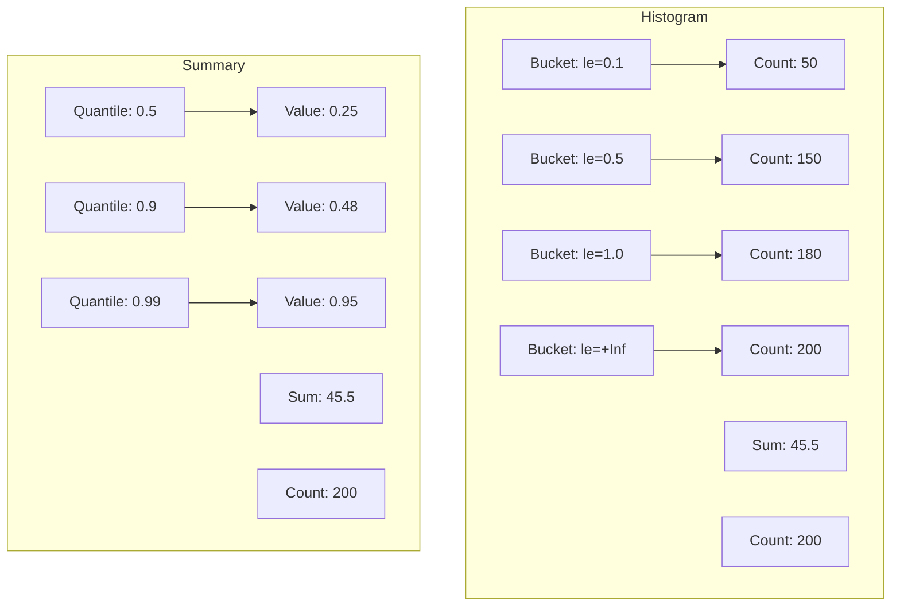

# How to Use Histograms and Summaries in Prometheus

Author: [nawazdhandala](https://www.github.com/nawazdhandala)

Tags: Prometheus, Histograms, Summaries, Metrics, Latency, Monitoring, Observability

Description: Learn the differences between Prometheus histograms and summaries, when to use each metric type, and how to query percentiles effectively with practical code examples.

---

Histograms and summaries both track distributions of values like request latencies or response sizes. Choosing the right one depends on your query patterns, aggregation needs, and accuracy requirements. This guide explains both types and helps you decide which to use.

## Understanding the Difference



| Feature | Histogram | Summary |
|---------|-----------|---------|
| Calculation | Server-side (query time) | Client-side (observation time) |
| Aggregation | Yes (across instances) | No |
| Accuracy | Depends on bucket config | Configurable |
| Memory | Fixed (buckets) | Variable (time window) |
| Best for | SLO tracking, aggregated views | Per-instance percentiles |

## Histograms

Histograms count observations into configurable buckets and track the total sum.

### Creating Histograms

Python example:

```python
from prometheus_client import Histogram, start_http_server
import time
import random

# Define histogram with custom buckets
request_latency = Histogram(
    'http_request_duration_seconds',
    'HTTP request latency in seconds',
    ['method', 'endpoint'],
    buckets=[0.01, 0.025, 0.05, 0.1, 0.25, 0.5, 1.0, 2.5, 5.0, 10.0]
)

# Use as decorator
@request_latency.labels(method='GET', endpoint='/api/users').time()
def get_users():
    # Simulate work
    time.sleep(random.uniform(0.01, 0.5))
    return []

# Use as context manager
def process_request():
    with request_latency.labels(method='POST', endpoint='/api/orders').time():
        time.sleep(random.uniform(0.05, 1.0))

# Observe directly
def manual_observation():
    start = time.time()
    # Do work
    time.sleep(random.uniform(0.01, 0.3))
    duration = time.time() - start
    request_latency.labels(method='GET', endpoint='/api/items').observe(duration)

if __name__ == '__main__':
    start_http_server(8000)
    while True:
        get_users()
        process_request()
        manual_observation()
```

Go example:

```go
package main

import (
    "math/rand"
    "net/http"
    "time"

    "github.com/prometheus/client_golang/prometheus"
    "github.com/prometheus/client_golang/prometheus/promauto"
    "github.com/prometheus/client_golang/prometheus/promhttp"
)

var requestDuration = promauto.NewHistogramVec(
    prometheus.HistogramOpts{
        Name:    "http_request_duration_seconds",
        Help:    "HTTP request latency in seconds",
        // Custom buckets for latency
        Buckets: []float64{0.01, 0.025, 0.05, 0.1, 0.25, 0.5, 1.0, 2.5, 5.0},
    },
    []string{"method", "endpoint", "status"},
)

func handler(w http.ResponseWriter, r *http.Request) {
    start := time.Now()

    // Simulate work
    time.Sleep(time.Duration(rand.Intn(500)) * time.Millisecond)

    // Record duration
    duration := time.Since(start).Seconds()
    requestDuration.WithLabelValues(r.Method, r.URL.Path, "200").Observe(duration)

    w.WriteHeader(http.StatusOK)
}

func main() {
    http.HandleFunc("/api/", handler)
    http.Handle("/metrics", promhttp.Handler())
    http.ListenAndServe(":8080", nil)
}
```

### Histogram Buckets

The histogram produces multiple time series:

```
# Bucket counts (cumulative)
http_request_duration_seconds_bucket{le="0.01"} 5
http_request_duration_seconds_bucket{le="0.025"} 15
http_request_duration_seconds_bucket{le="0.05"} 45
http_request_duration_seconds_bucket{le="0.1"} 120
http_request_duration_seconds_bucket{le="0.25"} 350
http_request_duration_seconds_bucket{le="0.5"} 480
http_request_duration_seconds_bucket{le="1.0"} 495
http_request_duration_seconds_bucket{le="+Inf"} 500

# Total sum of all observations
http_request_duration_seconds_sum 125.5

# Total count of observations
http_request_duration_seconds_count 500
```

### Choosing Bucket Boundaries

Good bucket boundaries depend on your SLOs and expected latency distribution:

```python
# For API latency (targeting sub-second responses)
api_buckets = [0.005, 0.01, 0.025, 0.05, 0.1, 0.25, 0.5, 1.0, 2.5, 5.0, 10.0]

# For batch job duration (minutes to hours)
batch_buckets = [60, 120, 300, 600, 1800, 3600, 7200, 14400]

# For response sizes (bytes)
size_buckets = [100, 1000, 10000, 100000, 1000000, 10000000]

# Linear buckets (start, width, count)
from prometheus_client import Histogram
linear_histogram = Histogram(
    'request_size_bytes',
    'Request size',
    buckets=[i * 1000 for i in range(1, 11)]  # 1KB to 10KB
)

# Exponential buckets
import math
exp_buckets = [math.pow(2, i) / 1000 for i in range(10)]  # 0.001 to 0.512 seconds
```

### Querying Histograms

Calculate percentiles with `histogram_quantile()`:

```promql
# 95th percentile latency
histogram_quantile(0.95,
  sum by (le) (rate(http_request_duration_seconds_bucket[5m]))
)

# 95th percentile by endpoint
histogram_quantile(0.95,
  sum by (endpoint, le) (rate(http_request_duration_seconds_bucket[5m]))
)

# Multiple percentiles
histogram_quantile(0.50, sum by (le) (rate(http_request_duration_seconds_bucket[5m])))
histogram_quantile(0.90, sum by (le) (rate(http_request_duration_seconds_bucket[5m])))
histogram_quantile(0.99, sum by (le) (rate(http_request_duration_seconds_bucket[5m])))

# Average latency
sum(rate(http_request_duration_seconds_sum[5m]))
/
sum(rate(http_request_duration_seconds_count[5m]))
```

## Summaries

Summaries calculate percentiles on the client side with configurable accuracy.

### Creating Summaries

Python example:

```python
from prometheus_client import Summary, start_http_server
import time
import random

# Define summary with quantiles
request_latency = Summary(
    'http_request_duration_seconds',
    'HTTP request latency in seconds',
    ['method', 'endpoint'],
)

# With custom quantiles (not supported in Python client by default)
# Use histogram for custom percentiles in Python

# Observe values
def process_request():
    start = time.time()
    time.sleep(random.uniform(0.01, 0.5))
    duration = time.time() - start
    request_latency.labels(method='GET', endpoint='/api/users').observe(duration)
```

Go example with quantile configuration:

```go
package main

import (
    "math/rand"
    "time"

    "github.com/prometheus/client_golang/prometheus"
    "github.com/prometheus/client_golang/prometheus/promauto"
)

var requestDuration = promauto.NewSummaryVec(
    prometheus.SummaryOpts{
        Name: "http_request_duration_seconds",
        Help: "HTTP request latency in seconds",
        // Define quantiles with acceptable error
        Objectives: map[float64]float64{
            0.5:  0.05,  // 50th percentile with 5% error
            0.9:  0.01,  // 90th percentile with 1% error
            0.99: 0.001, // 99th percentile with 0.1% error
        },
        // Time window for calculation
        MaxAge: 10 * time.Minute,
        // Number of buckets in the time window
        AgeBuckets: 5,
    },
    []string{"method", "endpoint"},
)

func recordLatency(method, endpoint string, duration float64) {
    requestDuration.WithLabelValues(method, endpoint).Observe(duration)
}

func main() {
    for {
        duration := rand.Float64() * 0.5
        recordLatency("GET", "/api/users", duration)
        time.Sleep(100 * time.Millisecond)
    }
}
```

### Summary Output

```
# Pre-calculated quantiles
http_request_duration_seconds{method="GET",endpoint="/api/users",quantile="0.5"} 0.123
http_request_duration_seconds{method="GET",endpoint="/api/users",quantile="0.9"} 0.345
http_request_duration_seconds{method="GET",endpoint="/api/users",quantile="0.99"} 0.678

# Sum and count (same as histogram)
http_request_duration_seconds_sum{method="GET",endpoint="/api/users"} 125.5
http_request_duration_seconds_count{method="GET",endpoint="/api/users"} 500
```

### Querying Summaries

Summaries expose quantiles directly:

```promql
# Direct percentile access
http_request_duration_seconds{quantile="0.99"}

# Average latency
http_request_duration_seconds_sum / http_request_duration_seconds_count

# Rate of requests
rate(http_request_duration_seconds_count[5m])
```

## When to Use Each

### Use Histograms When

1. **Aggregating across instances** - Histograms can be summed

```promql
# Aggregate latency across all instances
histogram_quantile(0.95,
  sum by (le) (rate(http_request_duration_seconds_bucket[5m]))
)
```

2. **SLO calculations** - Calculate error budgets from bucket boundaries

```promql
# Percentage of requests under 500ms
sum(rate(http_request_duration_seconds_bucket{le="0.5"}[5m]))
/
sum(rate(http_request_duration_seconds_count[5m]))
```

3. **Unknown percentile needs** - Any percentile can be calculated later

4. **Apdex scores** - Calculate satisfaction ratios

```promql
# Apdex score (satisfied < 0.5s, tolerating < 2s)
(
  sum(rate(http_request_duration_seconds_bucket{le="0.5"}[5m]))
  +
  sum(rate(http_request_duration_seconds_bucket{le="2.0"}[5m]))
  -
  sum(rate(http_request_duration_seconds_bucket{le="0.5"}[5m]))
) / 2
/
sum(rate(http_request_duration_seconds_count[5m]))
```

### Use Summaries When

1. **Per-instance percentiles** - No aggregation needed
2. **Precise percentiles** - Need exact values, not approximations
3. **Known percentiles** - You know which percentiles you need at instrumentation time
4. **Memory constraints** - Summaries use less memory than high-cardinality histograms

## Recording Rules for Both

Pre-compute expensive calculations:

```yaml
groups:
  - name: latency-rules
    rules:
      # Histogram percentiles
      - record: job:http_request_duration_seconds:p50
        expr: |
          histogram_quantile(0.50,
            sum by (job, le) (rate(http_request_duration_seconds_bucket[5m]))
          )

      - record: job:http_request_duration_seconds:p95
        expr: |
          histogram_quantile(0.95,
            sum by (job, le) (rate(http_request_duration_seconds_bucket[5m]))
          )

      - record: job:http_request_duration_seconds:p99
        expr: |
          histogram_quantile(0.99,
            sum by (job, le) (rate(http_request_duration_seconds_bucket[5m]))
          )

      # Average latency
      - record: job:http_request_duration_seconds:avg
        expr: |
          sum by (job) (rate(http_request_duration_seconds_sum[5m]))
          /
          sum by (job) (rate(http_request_duration_seconds_count[5m]))
```

## Common Pitfalls

### Histogram Bucket Selection

Bad bucket configuration leads to inaccurate percentiles:

```python
# Bad: buckets too coarse for API latency
bad_buckets = [1.0, 5.0, 10.0]  # Miss details under 1 second

# Good: appropriate granularity
good_buckets = [0.01, 0.05, 0.1, 0.25, 0.5, 1.0, 2.5, 5.0]
```

### Summary Aggregation Trap

Summaries cannot be aggregated meaningfully:

```promql
# WRONG: This does not give you the 95th percentile across instances
avg(http_request_duration_seconds{quantile="0.95"})

# The average of 95th percentiles is not the 95th percentile of all requests
```

### High Cardinality

Both types can cause cardinality issues with too many labels:

```python
# Bad: user_id creates unbounded cardinality
histogram.labels(user_id=user.id, endpoint=endpoint).observe(duration)

# Good: use bounded labels
histogram.labels(user_type=user.type, endpoint=endpoint).observe(duration)
```

## Best Practices

1. **Default to histograms** - They are more flexible for most use cases
2. **Configure appropriate buckets** - Match your SLO boundaries
3. **Use recording rules** - Pre-compute percentiles for dashboards
4. **Monitor cardinality** - Track series count per metric
5. **Include sum and count** - Enable average calculations

---

Both histograms and summaries serve important roles in observability. Histograms offer flexibility and aggregation at the cost of approximation. Summaries provide precision for specific percentiles but cannot be combined across instances. For most production use cases, histograms are the safer choice.
