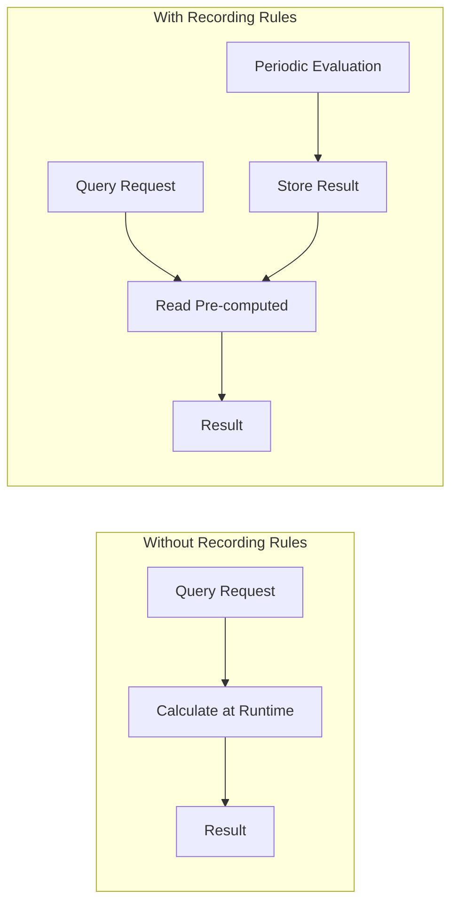

# How to Implement Recording Rules in Prometheus

Author: [nawazdhandala](https://www.github.com/nawazdhandala)

Tags: Prometheus, Recording Rules, Performance, PromQL, Monitoring, Optimization, Observability

Description: Learn how to use Prometheus recording rules to pre-compute expensive queries, reduce query latency, and improve dashboard performance with practical examples and naming conventions.

---

Recording rules let you pre-compute frequently used or computationally expensive expressions. Instead of calculating complex queries at request time, Prometheus evaluates them periodically and stores the results as new time series. This guide shows you how to implement recording rules effectively.

## Why Recording Rules Matter



Benefits of recording rules:
- **Faster queries** - Pre-computed results return immediately
- **Reduced load** - Complex calculations run once, not per query
- **Federation support** - Aggregated metrics are smaller to transfer
- **Dashboard performance** - Heavy dashboards load quickly

## Recording Rule Syntax

Recording rules are defined in the same rule files as alerts:

```yaml
# rules.yml
groups:
  - name: recording-rules
    interval: 30s  # Evaluation interval (optional, defaults to global)
    rules:
      # Basic recording rule
      - record: job:http_requests_total:rate5m
        expr: sum by (job) (rate(http_requests_total[5m]))

      # With additional labels
      - record: instance:node_cpu:avg_rate5m
        expr: avg by (instance) (rate(node_cpu_seconds_total{mode!="idle"}[5m]))
        labels:
          aggregation: "instance"
```

## Naming Convention

Prometheus recommends a specific naming pattern for recording rules:

```
level:metric:operations
```

| Component | Description | Examples |
|-----------|-------------|----------|
| level | Aggregation level | job, instance, namespace, cluster |
| metric | Base metric name | http_requests, node_cpu, container_memory |
| operations | Applied operations | rate5m, sum, avg, quantile95 |

### Examples

```yaml
rules:
  # Sum of requests by job, 5m rate
  - record: job:http_requests_total:rate5m
    expr: sum by (job) (rate(http_requests_total[5m]))

  # Average CPU by instance, 5m rate
  - record: instance:node_cpu_seconds:avg_rate5m
    expr: avg by (instance) (rate(node_cpu_seconds_total[5m]))

  # 95th percentile latency by service
  - record: service:http_request_duration_seconds:p95
    expr: histogram_quantile(0.95, sum by (service, le) (rate(http_request_duration_seconds_bucket[5m])))

  # Memory usage ratio by namespace
  - record: namespace:container_memory_usage_bytes:ratio
    expr: |
      sum by (namespace) (container_memory_usage_bytes)
      /
      sum by (namespace) (container_spec_memory_limit_bytes)
```

## Common Recording Rule Patterns

### Request Rate and Error Rate

```yaml
groups:
  - name: http-rules
    rules:
      # Total request rate by job
      - record: job:http_requests_total:rate5m
        expr: sum by (job) (rate(http_requests_total[5m]))

      # Error request rate by job
      - record: job:http_requests_errors:rate5m
        expr: sum by (job) (rate(http_requests_total{status=~"5.."}[5m]))

      # Error ratio by job
      - record: job:http_requests:error_ratio
        expr: |
          job:http_requests_errors:rate5m
          /
          job:http_requests_total:rate5m

      # Request rate by service and status code
      - record: service_status:http_requests_total:rate5m
        expr: sum by (service, status) (rate(http_requests_total[5m]))
```

### Latency Percentiles

```yaml
groups:
  - name: latency-rules
    rules:
      # 50th percentile (median)
      - record: job:http_request_duration_seconds:p50
        expr: |
          histogram_quantile(0.50,
            sum by (job, le) (rate(http_request_duration_seconds_bucket[5m]))
          )

      # 95th percentile
      - record: job:http_request_duration_seconds:p95
        expr: |
          histogram_quantile(0.95,
            sum by (job, le) (rate(http_request_duration_seconds_bucket[5m]))
          )

      # 99th percentile
      - record: job:http_request_duration_seconds:p99
        expr: |
          histogram_quantile(0.99,
            sum by (job, le) (rate(http_request_duration_seconds_bucket[5m]))
          )

      # Average latency
      - record: job:http_request_duration_seconds:avg
        expr: |
          sum by (job) (rate(http_request_duration_seconds_sum[5m]))
          /
          sum by (job) (rate(http_request_duration_seconds_count[5m]))
```

### Resource Utilization

```yaml
groups:
  - name: resource-rules
    rules:
      # CPU usage by namespace
      - record: namespace:container_cpu_usage_seconds:sum_rate5m
        expr: |
          sum by (namespace) (
            rate(container_cpu_usage_seconds_total{container!=""}[5m])
          )

      # Memory usage by namespace
      - record: namespace:container_memory_usage_bytes:sum
        expr: |
          sum by (namespace) (
            container_memory_usage_bytes{container!=""}
          )

      # CPU limit by namespace
      - record: namespace:kube_pod_container_resource_limits_cpu:sum
        expr: |
          sum by (namespace) (
            kube_pod_container_resource_limits{resource="cpu"}
          )

      # CPU utilization percentage by namespace
      - record: namespace:container_cpu:utilization
        expr: |
          namespace:container_cpu_usage_seconds:sum_rate5m
          /
          namespace:kube_pod_container_resource_limits_cpu:sum
```

### Node Metrics

```yaml
groups:
  - name: node-rules
    rules:
      # CPU utilization by node
      - record: instance:node_cpu:utilization
        expr: |
          1 - avg by (instance) (
            rate(node_cpu_seconds_total{mode="idle"}[5m])
          )

      # Memory utilization by node
      - record: instance:node_memory:utilization
        expr: |
          1 - (
            node_memory_MemAvailable_bytes
            /
            node_memory_MemTotal_bytes
          )

      # Disk utilization by node and device
      - record: instance_device:node_filesystem:utilization
        expr: |
          1 - (
            node_filesystem_avail_bytes
            /
            node_filesystem_size_bytes
          )

      # Network receive rate by node
      - record: instance:node_network_receive_bytes:rate5m
        expr: |
          sum by (instance) (
            rate(node_network_receive_bytes_total[5m])
          )
```

## Multi-Level Aggregation

Build hierarchical aggregations for different views:

```yaml
groups:
  - name: multi-level-rules
    rules:
      # Level 1: Per-pod metrics
      - record: pod:http_requests_total:rate5m
        expr: sum by (namespace, pod) (rate(http_requests_total[5m]))

      # Level 2: Per-service metrics (uses Level 1)
      - record: service:http_requests_total:rate5m
        expr: |
          sum by (namespace, service) (
            pod:http_requests_total:rate5m
            * on (namespace, pod) group_left(service)
            kube_pod_labels
          )

      # Level 3: Per-namespace metrics
      - record: namespace:http_requests_total:rate5m
        expr: sum by (namespace) (service:http_requests_total:rate5m)

      # Level 4: Cluster-wide metrics
      - record: cluster:http_requests_total:rate5m
        expr: sum(namespace:http_requests_total:rate5m)
```

## Recording Rules for Federation

Create aggregated metrics specifically for federation:

```yaml
groups:
  - name: federation-rules
    interval: 60s  # Match federation scrape interval
    rules:
      # Cluster-level CPU
      - record: cluster:node_cpu:sum_rate5m
        expr: sum(instance:node_cpu:utilization)
        labels:
          cluster: "production-east"

      # Cluster-level memory
      - record: cluster:node_memory_usage_bytes:sum
        expr: sum(node_memory_MemTotal_bytes - node_memory_MemAvailable_bytes)
        labels:
          cluster: "production-east"

      # Cluster-level request rate
      - record: cluster:http_requests_total:rate5m
        expr: sum(job:http_requests_total:rate5m)
        labels:
          cluster: "production-east"

      # Cluster-level error rate
      - record: cluster:http_requests:error_ratio
        expr: |
          sum(job:http_requests_errors:rate5m)
          /
          sum(job:http_requests_total:rate5m)
        labels:
          cluster: "production-east"
```

## Using Recording Rules in Alerts

Reference recording rules in alert expressions for better performance:

```yaml
groups:
  - name: recording-rules
    rules:
      - record: job:http_requests:error_ratio
        expr: |
          sum by (job) (rate(http_requests_total{status=~"5.."}[5m]))
          /
          sum by (job) (rate(http_requests_total[5m]))

  - name: alerts
    rules:
      # Use the recording rule instead of raw expression
      - alert: HighErrorRate
        expr: job:http_requests:error_ratio > 0.05
        for: 5m
        labels:
          severity: critical
        annotations:
          summary: "High error rate on {{ $labels.job }}"
```

## Kubernetes with Prometheus Operator

Use PrometheusRule CRD for recording rules:

```yaml
apiVersion: monitoring.coreos.com/v1
kind: PrometheusRule
metadata:
  name: recording-rules
  namespace: monitoring
  labels:
    release: prometheus
spec:
  groups:
    - name: http-recording-rules
      interval: 30s
      rules:
        - record: job:http_requests_total:rate5m
          expr: sum by (job) (rate(http_requests_total[5m]))

        - record: job:http_requests:error_ratio
          expr: |
            sum by (job) (rate(http_requests_total{status=~"5.."}[5m]))
            /
            sum by (job) (rate(http_requests_total[5m]))

    - name: resource-recording-rules
      rules:
        - record: namespace:container_cpu_usage_seconds:sum_rate5m
          expr: sum by (namespace) (rate(container_cpu_usage_seconds_total[5m]))
```

## Validating Recording Rules

### Syntax Check

```bash
# Check rule file syntax
promtool check rules rules.yml

# Output on success
# Checking rules.yml
#   SUCCESS: 15 rules found
```

### Unit Testing

```yaml
# rules_test.yml
rule_files:
  - rules.yml

evaluation_interval: 1m

tests:
  - interval: 1m
    input_series:
      - series: 'http_requests_total{job="api", status="200"}'
        values: '0+100x10'
      - series: 'http_requests_total{job="api", status="500"}'
        values: '0+5x10'

    promql_expr_test:
      - expr: job:http_requests_total:rate5m{job="api"}
        eval_time: 5m
        exp_samples:
          - labels: 'job:http_requests_total:rate5m{job="api"}'
            value: 1.75  # (100+5)/60

      - expr: job:http_requests:error_ratio{job="api"}
        eval_time: 5m
        exp_samples:
          - labels: 'job:http_requests:error_ratio{job="api"}'
            value: 0.0476  # 5/105
```

Run tests:

```bash
promtool test rules rules_test.yml
```

## Monitoring Recording Rules

Track recording rule performance:

```promql
# Evaluation duration
prometheus_rule_group_duration_seconds{rule_group="recording-rules"}

# Rules per group
prometheus_rule_group_rules{rule_group="recording-rules"}

# Last evaluation timestamp
prometheus_rule_group_last_evaluation_timestamp_seconds

# Samples produced
prometheus_rule_group_last_evaluation_samples
```

Create alerts for slow rule evaluation:

```yaml
- alert: SlowRecordingRuleEvaluation
  expr: |
    prometheus_rule_group_duration_seconds > 10
  for: 5m
  labels:
    severity: warning
  annotations:
    summary: "Rule group {{ $labels.rule_group }} taking too long"
```

## Best Practices

1. **Follow naming conventions** - Use level:metric:operations format
2. **Match evaluation interval to use case** - Faster for alerts, slower for dashboards
3. **Build hierarchies** - Aggregate from fine to coarse grain
4. **Test thoroughly** - Validate with promtool before deploying
5. **Monitor rule performance** - Track evaluation duration
6. **Document rules** - Add comments explaining purpose

### When to Use Recording Rules

| Scenario | Use Recording Rule? |
|----------|---------------------|
| Dashboard query runs slowly | Yes |
| Query used by multiple alerts | Yes |
| Federation target metric | Yes |
| One-off ad-hoc query | No |
| Simple metric lookup | No |

---

Recording rules transform Prometheus from a query engine into a metric processing pipeline. Start with your slowest queries, identify common patterns, and build a library of pre-computed metrics that make dashboards and alerts responsive.
