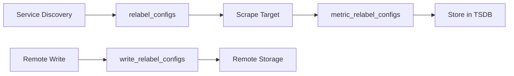

# How to Configure Relabeling in Prometheus

Author: [nawazdhandala](https://www.github.com/nawazdhandala)

Tags: Prometheus, Relabeling, Service Discovery, Configuration, Metrics, Labels, DevOps

Description: Master Prometheus relabeling to filter targets, transform labels, and control metric collection with practical examples for common scenarios and advanced patterns.

---

Relabeling is one of Prometheus's most powerful features. It transforms labels during scraping and metric processing, enabling dynamic target filtering, label manipulation, and metric routing. This guide covers relabeling from basic patterns to advanced use cases.

## Relabeling Stages

Prometheus applies relabeling at different stages:



| Stage | Config | Purpose |
|-------|--------|---------|
| Target | `relabel_configs` | Filter targets, modify scrape params |
| Metric | `metric_relabel_configs` | Filter/modify metrics after scrape |
| Write | `write_relabel_configs` | Filter metrics before remote write |

## Relabeling Actions

```yaml
relabel_configs:
  - source_labels: [label1, label2]  # Labels to read from
    separator: ";"                    # Join separator (default: ;)
    target_label: new_label           # Label to write to
    regex: "(.+)"                     # Regex to match (default: .*)
    replacement: "$1"                 # Replacement value (default: $1)
    action: replace                   # Action to perform
```

### Available Actions

| Action | Description |
|--------|-------------|
| `replace` | Replace target_label with replacement |
| `keep` | Keep targets where regex matches |
| `drop` | Drop targets where regex matches |
| `labelmap` | Copy labels matching regex to new names |
| `labeldrop` | Drop labels matching regex |
| `labelkeep` | Keep only labels matching regex |
| `hashmod` | Set target_label to hash modulo |
| `lowercase` | Lowercase the source label value |
| `uppercase` | Uppercase the source label value |

## Basic Patterns

### Filtering Targets

Keep only targets with specific labels:

```yaml
scrape_configs:
  - job_name: 'kubernetes-pods'
    kubernetes_sd_configs:
      - role: pod

    relabel_configs:
      # Only scrape pods with prometheus.io/scrape annotation
      - source_labels: [__meta_kubernetes_pod_annotation_prometheus_io_scrape]
        action: keep
        regex: true

      # Drop pods in kube-system namespace
      - source_labels: [__meta_kubernetes_namespace]
        action: drop
        regex: kube-system
```

### Renaming Labels

```yaml
relabel_configs:
  # Rename label
  - source_labels: [__meta_kubernetes_namespace]
    target_label: namespace

  # Copy with transformation
  - source_labels: [__meta_kubernetes_pod_name]
    target_label: pod
    regex: "(.+)"
    replacement: "${1}"
```

### Setting Scrape Parameters

```yaml
relabel_configs:
  # Set custom metrics path
  - source_labels: [__meta_kubernetes_pod_annotation_prometheus_io_path]
    action: replace
    target_label: __metrics_path__
    regex: (.+)

  # Set custom port
  - source_labels: [__address__, __meta_kubernetes_pod_annotation_prometheus_io_port]
    action: replace
    regex: ([^:]+)(?::\d+)?;(\d+)
    replacement: $1:$2
    target_label: __address__

  # Set scheme (http/https)
  - source_labels: [__meta_kubernetes_pod_annotation_prometheus_io_scheme]
    action: replace
    target_label: __scheme__
    regex: (https?)
```

## Kubernetes Relabeling Patterns

### Complete Pod Scraping Config

```yaml
scrape_configs:
  - job_name: 'kubernetes-pods'
    kubernetes_sd_configs:
      - role: pod

    relabel_configs:
      # Only keep pods with scrape annotation
      - source_labels: [__meta_kubernetes_pod_annotation_prometheus_io_scrape]
        action: keep
        regex: true

      # Use custom path if specified
      - source_labels: [__meta_kubernetes_pod_annotation_prometheus_io_path]
        action: replace
        target_label: __metrics_path__
        regex: (.+)

      # Use custom port if specified
      - source_labels: [__address__, __meta_kubernetes_pod_annotation_prometheus_io_port]
        action: replace
        regex: ([^:]+)(?::\d+)?;(\d+)
        replacement: $1:$2
        target_label: __address__

      # Copy namespace label
      - source_labels: [__meta_kubernetes_namespace]
        action: replace
        target_label: namespace

      # Copy pod name
      - source_labels: [__meta_kubernetes_pod_name]
        action: replace
        target_label: pod

      # Copy pod labels to metric labels
      - action: labelmap
        regex: __meta_kubernetes_pod_label_(.+)

      # Copy container name
      - source_labels: [__meta_kubernetes_pod_container_name]
        action: replace
        target_label: container
```

### Service Discovery Relabeling

```yaml
scrape_configs:
  - job_name: 'kubernetes-services'
    kubernetes_sd_configs:
      - role: endpoints

    relabel_configs:
      # Keep endpoints where service has scrape annotation
      - source_labels: [__meta_kubernetes_service_annotation_prometheus_io_scrape]
        action: keep
        regex: true

      # Use service name as job
      - source_labels: [__meta_kubernetes_service_name]
        action: replace
        target_label: job

      # Add service label
      - source_labels: [__meta_kubernetes_service_name]
        action: replace
        target_label: service

      # Add namespace label
      - source_labels: [__meta_kubernetes_namespace]
        action: replace
        target_label: namespace

      # Add pod name
      - source_labels: [__meta_kubernetes_pod_name]
        action: replace
        target_label: pod
```

## Metric Relabeling

Filter and modify metrics after scraping:

```yaml
scrape_configs:
  - job_name: 'application'
    static_configs:
      - targets: ['app:8080']

    metric_relabel_configs:
      # Drop debug metrics
      - source_labels: [__name__]
        action: drop
        regex: "debug_.*"

      # Drop high-cardinality labels
      - action: labeldrop
        regex: "request_id|trace_id"

      # Rename metric
      - source_labels: [__name__]
        action: replace
        regex: "old_metric_name"
        replacement: "new_metric_name"
        target_label: __name__

      # Keep only specific metrics
      - source_labels: [__name__]
        action: keep
        regex: "(http_requests_total|http_request_duration_seconds_.*|up)"
```

### Reducing Cardinality

```yaml
metric_relabel_configs:
  # Drop specific label values
  - source_labels: [status_code]
    action: drop
    regex: "4.."  # Drop 4xx status codes

  # Aggregate similar paths
  - source_labels: [path]
    action: replace
    regex: "/users/[0-9]+"
    replacement: "/users/:id"
    target_label: path

  # Drop unused labels
  - action: labeldrop
    regex: "(instance_id|pod_ip|host)"
```

## Advanced Patterns

### Hashmod for Sampling

Distribute targets across Prometheus instances:

```yaml
# Prometheus instance 0 of 3
scrape_configs:
  - job_name: 'distributed-scrape'
    relabel_configs:
      # Hash the instance label and keep if hash mod 3 == 0
      - source_labels: [__address__]
        modulus: 3
        target_label: __tmp_hash
        action: hashmod

      - source_labels: [__tmp_hash]
        regex: "0"
        action: keep
```

### Conditional Label Setting

```yaml
relabel_configs:
  # Set environment based on namespace
  - source_labels: [__meta_kubernetes_namespace]
    action: replace
    regex: "prod-.*"
    replacement: "production"
    target_label: environment

  - source_labels: [__meta_kubernetes_namespace]
    action: replace
    regex: "staging-.*"
    replacement: "staging"
    target_label: environment

  - source_labels: [__meta_kubernetes_namespace]
    action: replace
    regex: "dev-.*"
    replacement: "development"
    target_label: environment
```

### Label Composition

Combine multiple labels:

```yaml
relabel_configs:
  # Create composite label
  - source_labels: [__meta_kubernetes_namespace, __meta_kubernetes_pod_name]
    separator: "/"
    target_label: namespace_pod

  # Create FQDN-style identifier
  - source_labels: [__meta_kubernetes_pod_name, __meta_kubernetes_namespace, __meta_kubernetes_pod_host_ip]
    separator: "."
    target_label: fqdn
```

### Case Transformation

```yaml
relabel_configs:
  # Lowercase namespace
  - source_labels: [__meta_kubernetes_namespace]
    action: lowercase
    target_label: namespace

  # Uppercase environment
  - source_labels: [environment]
    action: uppercase
    target_label: ENVIRONMENT
```

## Write Relabeling for Remote Write

Control what gets sent to remote storage:

```yaml
remote_write:
  - url: "http://remote-storage:9090/api/v1/write"
    write_relabel_configs:
      # Only send production metrics
      - source_labels: [environment]
        action: keep
        regex: "production"

      # Drop temporary metrics
      - source_labels: [__name__]
        action: drop
        regex: "tmp_.*"

      # Remove internal labels before sending
      - action: labeldrop
        regex: "__.*"

      # Keep only aggregated recording rules
      - source_labels: [__name__]
        action: keep
        regex: "(job|instance|namespace):.*"
```

## Debugging Relabeling

### Check Service Discovery

View discovered targets before relabeling:

```bash
# Access Prometheus service discovery page
http://localhost:9090/service-discovery

# Or via API
curl 'http://localhost:9090/api/v1/targets?state=any' | jq
```

### Check Targets After Relabeling

```bash
# View active targets
curl 'http://localhost:9090/api/v1/targets?state=active' | jq '.data.activeTargets[] | {instance: .labels.instance, job: .labels.job}'

# View dropped targets
curl 'http://localhost:9090/api/v1/targets?state=dropped' | jq '.data.droppedTargets[] | .discoveredLabels'
```

### Common Mistakes

```yaml
# WRONG: Missing regex, matches nothing
- source_labels: [namespace]
  action: keep
  # regex defaults to .* but won't match specific value

# CORRECT: Explicit regex
- source_labels: [namespace]
  action: keep
  regex: "production"

# WRONG: Regex special characters not escaped
- source_labels: [path]
  regex: "/api/v1/users"  # The / and . are regex special chars

# CORRECT: Escaped or use .* for wildcards
- source_labels: [path]
  regex: "/api/v1/users"  # Slashes are actually fine in Prometheus
  # But dots should be escaped: "api\\.example\\.com"
```

## Best Practices

1. **Use relabel_configs for target filtering** - Filter before scraping
2. **Use metric_relabel_configs sparingly** - Filtering after scrape still consumes resources
3. **Drop high-cardinality labels early** - Reduce storage and memory usage
4. **Test relabeling rules** - Check service discovery page
5. **Document complex rules** - Add comments explaining purpose
6. **Order matters** - Rules are applied in sequence

### Recommended Order

```yaml
relabel_configs:
  # 1. Filter targets first (keep/drop)
  - action: keep
    source_labels: [__meta_kubernetes_pod_annotation_prometheus_io_scrape]
    regex: true

  # 2. Set scrape parameters
  - source_labels: [__meta_kubernetes_pod_annotation_prometheus_io_path]
    target_label: __metrics_path__

  # 3. Transform labels
  - source_labels: [__meta_kubernetes_namespace]
    target_label: namespace

  # 4. Map multiple labels
  - action: labelmap
    regex: __meta_kubernetes_pod_label_(.+)

  # 5. Clean up temporary labels
  - action: labeldrop
    regex: __meta_.*
```

---

Relabeling transforms Prometheus from a simple scraper into a flexible metric processing pipeline. Start with basic filtering and label extraction, then add complexity as needed. Always test changes on the service discovery page before deploying to production.
