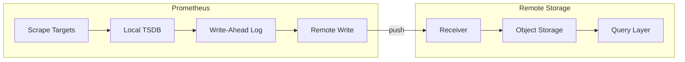

# How to Configure Remote Write in Prometheus

Author: [nawazdhandala](https://www.github.com/nawazdhandala)

Tags: Prometheus, Remote Write, Long-term Storage, Thanos, Cortex, Mimir, Monitoring

Description: A practical guide to configuring Prometheus remote write for long-term metric storage, covering configuration options, performance tuning, and integration with popular backends like Thanos, Cortex, and Mimir.

---

Prometheus stores metrics locally with limited retention. Remote write sends metrics to external storage systems for long-term retention, global querying, and high availability. This guide covers remote write configuration, performance tuning, and backend integration.

## Remote Write Architecture



## Basic Remote Write Configuration

```yaml
# prometheus.yml
global:
  scrape_interval: 15s
  evaluation_interval: 15s

remote_write:
  - url: "http://remote-storage:9090/api/v1/write"
```

### Multiple Remote Write Endpoints

Send metrics to multiple destinations:

```yaml
remote_write:
  # Primary storage
  - url: "http://thanos-receive:19291/api/v1/receive"
    name: thanos-primary

  # Backup storage
  - url: "http://mimir:9090/api/v1/push"
    name: mimir-backup

  # Analytics platform
  - url: "https://analytics.example.com/api/v1/write"
    name: analytics
    bearer_token_file: /etc/prometheus/analytics-token
```

## Authentication Configuration

### Basic Authentication

```yaml
remote_write:
  - url: "https://remote-storage.example.com/api/v1/write"
    basic_auth:
      username: "prometheus"
      password_file: "/etc/prometheus/remote-write-password"
```

### Bearer Token

```yaml
remote_write:
  - url: "https://remote-storage.example.com/api/v1/write"
    bearer_token_file: "/etc/prometheus/bearer-token"
```

### TLS Configuration

```yaml
remote_write:
  - url: "https://secure-storage.example.com/api/v1/write"
    tls_config:
      ca_file: "/etc/prometheus/ca.crt"
      cert_file: "/etc/prometheus/client.crt"
      key_file: "/etc/prometheus/client.key"
      # Skip verification (not recommended for production)
      # insecure_skip_verify: true
```

### OAuth2

```yaml
remote_write:
  - url: "https://oauth-storage.example.com/api/v1/write"
    oauth2:
      client_id: "prometheus-client"
      client_secret_file: "/etc/prometheus/oauth-secret"
      token_url: "https://auth.example.com/oauth/token"
      scopes:
        - "write:metrics"
```

## Queue Configuration

Tune the write queue for performance:

```yaml
remote_write:
  - url: "http://remote-storage:9090/api/v1/write"
    queue_config:
      # Number of samples per send
      capacity: 10000

      # Maximum shards (parallel senders)
      max_shards: 200

      # Minimum shards
      min_shards: 1

      # Maximum samples per send
      max_samples_per_send: 2000

      # Batch send deadline
      batch_send_deadline: 5s

      # Minimum backoff on retry
      min_backoff: 30ms

      # Maximum backoff on retry
      max_backoff: 5s

      # Retry on HTTP 429 status
      retry_on_http_429: true
```

### High-Volume Configuration

For high-throughput environments:

```yaml
remote_write:
  - url: "http://remote-storage:9090/api/v1/write"
    queue_config:
      capacity: 100000
      max_shards: 1000
      min_shards: 10
      max_samples_per_send: 5000
      batch_send_deadline: 10s
```

## Write Relabeling

Filter and modify metrics before sending:

```yaml
remote_write:
  - url: "http://remote-storage:9090/api/v1/write"
    write_relabel_configs:
      # Only send production metrics
      - source_labels: [environment]
        regex: "production"
        action: keep

      # Drop debug metrics
      - source_labels: [__name__]
        regex: "debug_.*"
        action: drop

      # Drop high-cardinality labels
      - regex: "request_id"
        action: labeldrop

      # Rename metrics
      - source_labels: [__name__]
        regex: "old_metric_name"
        replacement: "new_metric_name"
        target_label: __name__
```

### Filtering Patterns

```yaml
write_relabel_configs:
  # Keep only specific metric names
  - source_labels: [__name__]
    regex: "(http_requests_total|http_request_duration_seconds_.*|up)"
    action: keep

  # Drop metrics from test namespace
  - source_labels: [namespace]
    regex: "test-.*"
    action: drop

  # Keep only aggregated recording rules
  - source_labels: [__name__]
    regex: "(job|instance|namespace|cluster):.*"
    action: keep

  # Sample 10% of low-priority metrics
  - source_labels: [__name__]
    regex: "debug_.*"
    action: keep
    modulus: 10
    source_labels: [__name__]
    target_label: __tmp_hash
    hashmod: 10
```

## Backend-Specific Configurations

### Thanos Receive

```yaml
remote_write:
  - url: "http://thanos-receive:19291/api/v1/receive"
    queue_config:
      capacity: 10000
      max_shards: 200
      max_samples_per_send: 2000

    # Add external labels for Thanos
    # These are usually configured in global section
```

Configure external labels for Thanos:

```yaml
global:
  external_labels:
    cluster: "production-east"
    region: "us-east-1"
    replica: "prometheus-0"

remote_write:
  - url: "http://thanos-receive:19291/api/v1/receive"
```

### Cortex / Mimir

```yaml
remote_write:
  - url: "http://mimir-distributor:8080/api/v1/push"
    headers:
      X-Scope-OrgID: "tenant-1"

    queue_config:
      capacity: 50000
      max_shards: 500
      max_samples_per_send: 5000
```

### Grafana Cloud

```yaml
remote_write:
  - url: "https://prometheus-prod-01-prod-us-central-0.grafana.net/api/prom/push"
    basic_auth:
      username: "123456"  # Your Grafana Cloud instance ID
      password_file: "/etc/prometheus/grafana-cloud-api-key"

    queue_config:
      capacity: 10000
      max_samples_per_send: 1500
```

### AWS Managed Prometheus

```yaml
remote_write:
  - url: "https://aps-workspaces.us-east-1.amazonaws.com/workspaces/ws-xxxxx/api/v1/remote_write"
    sigv4:
      region: "us-east-1"
    queue_config:
      capacity: 10000
      max_shards: 200
```

## Kubernetes Deployment

### Prometheus Operator Configuration

```yaml
apiVersion: monitoring.coreos.com/v1
kind: Prometheus
metadata:
  name: prometheus
  namespace: monitoring
spec:
  replicas: 2
  retention: 24h

  externalLabels:
    cluster: production
    region: us-east-1

  remoteWrite:
    - url: "http://thanos-receive:19291/api/v1/receive"
      queueConfig:
        capacity: 10000
        maxShards: 200
        maxSamplesPerSend: 2000

  # Secret containing remote write credentials
  remoteWriteAuth:
    - name: remote-write-basic-auth
      key: password
```

### Credentials Secret

```yaml
apiVersion: v1
kind: Secret
metadata:
  name: remote-write-credentials
  namespace: monitoring
type: Opaque
stringData:
  password: "your-remote-write-password"
  bearer-token: "your-bearer-token"
```

Reference in Prometheus:

```yaml
remoteWrite:
  - url: "https://remote-storage.example.com/api/v1/write"
    basicAuth:
      username:
        name: remote-write-credentials
        key: username
      password:
        name: remote-write-credentials
        key: password
```

## Monitoring Remote Write

Track remote write health with these metrics:

```promql
# Samples pending in queue
prometheus_remote_storage_pending_samples

# Samples sent successfully
rate(prometheus_remote_storage_succeeded_samples_total[5m])

# Samples failed
rate(prometheus_remote_storage_failed_samples_total[5m])

# Samples dropped
rate(prometheus_remote_storage_dropped_samples_total[5m])

# Queue shards
prometheus_remote_storage_shards

# Bytes sent
rate(prometheus_remote_storage_bytes_total[5m])

# Send latency
prometheus_remote_storage_sent_batch_duration_seconds
```

### Alert on Remote Write Issues

```yaml
groups:
  - name: remote-write-alerts
    rules:
      - alert: RemoteWriteFailing
        expr: |
          rate(prometheus_remote_storage_failed_samples_total[5m]) > 0
        for: 5m
        labels:
          severity: warning
        annotations:
          summary: "Remote write is failing"
          description: "{{ $value }} samples/s failing to send"

      - alert: RemoteWriteQueueFull
        expr: |
          prometheus_remote_storage_pending_samples > 90000
        for: 5m
        labels:
          severity: critical
        annotations:
          summary: "Remote write queue nearly full"
          description: "{{ $value }} samples pending"

      - alert: RemoteWriteHighLatency
        expr: |
          histogram_quantile(0.99,
            rate(prometheus_remote_storage_sent_batch_duration_seconds_bucket[5m])
          ) > 5
        for: 10m
        labels:
          severity: warning
        annotations:
          summary: "Remote write latency high"
          description: "99th percentile latency is {{ $value }}s"
```

## Performance Tuning

### Optimize for Throughput

```yaml
remote_write:
  - url: "http://remote-storage:9090/api/v1/write"
    queue_config:
      # Large capacity for burst handling
      capacity: 100000

      # Many parallel senders
      max_shards: 1000
      min_shards: 50

      # Large batches
      max_samples_per_send: 10000

      # Fast retry
      min_backoff: 10ms
      max_backoff: 1s
```

### Optimize for Reliability

```yaml
remote_write:
  - url: "http://remote-storage:9090/api/v1/write"
    queue_config:
      # Moderate capacity
      capacity: 50000

      # Fewer shards, more stable
      max_shards: 100
      min_shards: 10

      # Smaller batches, less data loss on failure
      max_samples_per_send: 1000

      # Patient retry
      min_backoff: 100ms
      max_backoff: 30s
      retry_on_http_429: true
```

### Reduce Network Usage

```yaml
remote_write:
  - url: "http://remote-storage:9090/api/v1/write"
    # Filter to essential metrics only
    write_relabel_configs:
      - source_labels: [__name__]
        regex: "(http_requests_total|http_request_duration_seconds_bucket|up|node_.*)"
        action: keep
```

## Troubleshooting

### Check Remote Write Status

```bash
# View remote write metrics
curl -s http://localhost:9090/api/v1/query?query=prometheus_remote_storage_pending_samples | jq

# Check target health
curl -s http://localhost:9090/api/v1/status/runtimeinfo | jq '.data.storageRetention'
```

### Common Issues

| Problem | Cause | Solution |
|---------|-------|----------|
| Queue growing | Remote too slow | Increase shards, reduce cardinality |
| Samples dropped | Queue full | Increase capacity, filter metrics |
| Connection refused | Network issue | Check firewall, DNS |
| 429 errors | Rate limited | Reduce send rate, contact provider |
| High latency | Network or backend | Check network, optimize backend |

## Best Practices

1. **Use write relabeling** - Send only necessary metrics
2. **Monitor queue depth** - Alert before queue fills
3. **Set external labels** - Identify data source in remote storage
4. **Test failover** - Verify behavior when remote is unavailable
5. **Size queue appropriately** - Balance memory usage and buffer capacity
6. **Use multiple remotes** - Redundancy for critical metrics

---

Remote write extends Prometheus beyond local retention limits. Configure authentication and TLS for security, tune queue settings for your throughput requirements, and use write relabeling to control what gets sent. Monitor remote write health to catch issues before data loss occurs.
