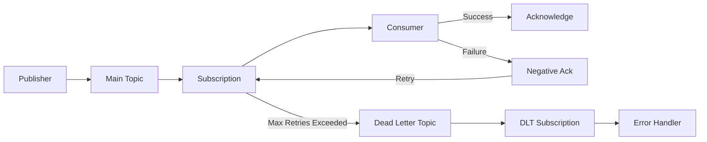
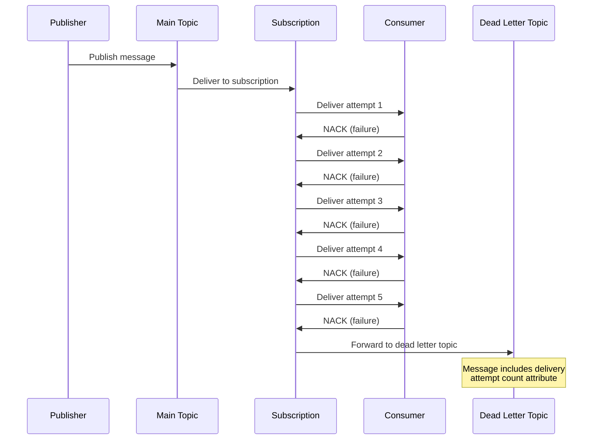
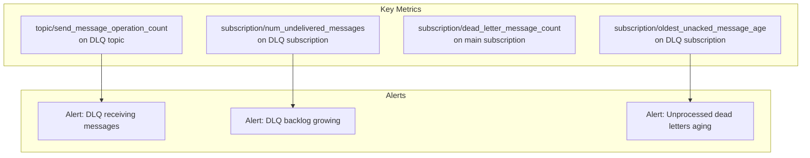
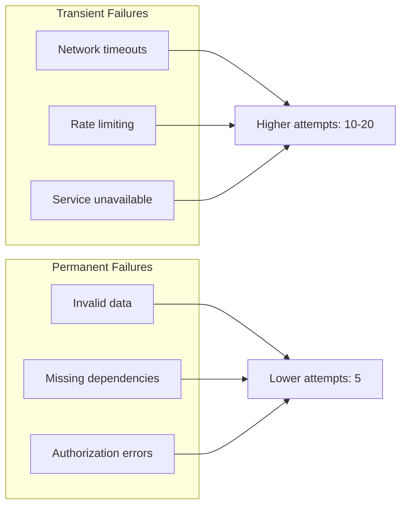

# How to Implement Pub/Sub Dead Letter Topics

Author: [nawazdhandala](https://www.github.com/nawazdhandala)

Tags: GCP, Google Cloud Pub/Sub, Dead Letter Topic, Message Processing, Error Handling, Reliability, Event-Driven Architecture

Description: Learn how to implement dead letter topics in Google Cloud Pub/Sub for handling failed messages, including configuration, retry strategies, and monitoring.

---

When messages fail to process in Google Cloud Pub/Sub, they can clog up your subscription, cause processing delays, and waste compute resources. Dead letter topics provide a way to capture these problematic messages separately, so your main consumers can keep processing healthy messages while you investigate and fix the failures.

## What Is a Dead Letter Topic?

A dead letter topic (DLT) is a secondary topic where Pub/Sub automatically routes messages that cannot be successfully delivered to a subscription after a specified number of attempts.



## When to Use Dead Letter Topics

Dead letter topics are useful when:

- **Poison messages**: Some messages are malformed or contain invalid data that will never process successfully
- **Transient failures**: External services are temporarily unavailable, but you want to limit retries
- **Version mismatches**: Consumer code cannot handle certain message formats
- **Resource constraints**: Processing certain messages requires more resources than available

## Setting Up a Dead Letter Topic

### Step 1: Create the Dead Letter Topic

First, create a topic to hold the failed messages:

```bash
# Create the dead letter topic
gcloud pubsub topics create orders-dlq

# Create a subscription to process dead letters
gcloud pubsub subscriptions create orders-dlq-sub \
    --topic=orders-dlq
```

### Step 2: Grant Permissions

Pub/Sub needs permission to publish messages to your dead letter topic. Grant the publisher role to the Pub/Sub service account:

```bash
# Get your project number
PROJECT_NUMBER=$(gcloud projects describe $(gcloud config get-value project) \
    --format="value(projectNumber)")

# Grant publish permission to the dead letter topic
gcloud pubsub topics add-iam-policy-binding orders-dlq \
    --member="serviceAccount:service-${PROJECT_NUMBER}@gcp-sa-pubsub.iam.gserviceaccount.com" \
    --role="roles/pubsub.publisher"

# Grant subscribe permission to acknowledge forwarded messages
gcloud pubsub subscriptions add-iam-policy-binding orders-subscription \
    --member="serviceAccount:service-${PROJECT_NUMBER}@gcp-sa-pubsub.iam.gserviceaccount.com" \
    --role="roles/pubsub.subscriber"
```

### Step 3: Configure the Subscription with Dead Letter Policy

Create or update your subscription with a dead letter policy:

```bash
# Create new subscription with dead letter policy
gcloud pubsub subscriptions create orders-subscription \
    --topic=orders \
    --dead-letter-topic=orders-dlq \
    --max-delivery-attempts=5 \
    --ack-deadline=60

# Or update existing subscription
gcloud pubsub subscriptions update orders-subscription \
    --dead-letter-topic=orders-dlq \
    --max-delivery-attempts=5
```

The `max-delivery-attempts` parameter controls how many times Pub/Sub will try to deliver a message before sending it to the dead letter topic. Valid values range from 5 to 100.

## Message Flow with Dead Letter Topics



## Implementing Dead Letter Topics in Code

### Python Consumer with Proper Error Handling

```python
from google.cloud import pubsub_v1
from google.api_core import retry
import json
import logging

logging.basicConfig(level=logging.INFO)
logger = logging.getLogger(__name__)

project_id = "your-project-id"
subscription_id = "orders-subscription"


def process_order(data: dict) -> None:
    """
    Process an order. Raises exception on failure.

    In a real application, this might:
    - Validate order data
    - Update database
    - Call external payment service
    - Send confirmation email
    """
    if "order_id" not in data:
        raise ValueError("Missing required field: order_id")

    if data.get("amount", 0) < 0:
        raise ValueError(f"Invalid amount: {data['amount']}")

    # Process the order
    logger.info(f"Processing order {data['order_id']}")
    # ... actual processing logic


def callback(message: pubsub_v1.subscriber.message.Message) -> None:
    """
    Handle incoming messages.

    Key principle: Only ACK messages that were successfully processed.
    NACK messages that failed, so Pub/Sub can retry or eventually
    send them to the dead letter topic.
    """
    # Check delivery attempt count (available when dead letter is configured)
    delivery_attempt = message.delivery_attempt
    logger.info(
        f"Received message {message.message_id}, "
        f"delivery attempt: {delivery_attempt}"
    )

    try:
        # Parse the message data
        data = json.loads(message.data.decode("utf-8"))

        # Process the message
        process_order(data)

        # Success - acknowledge the message
        message.ack()
        logger.info(f"Successfully processed message {message.message_id}")

    except json.JSONDecodeError as e:
        # Invalid JSON - will never succeed, let it go to DLT
        logger.error(f"Invalid JSON in message {message.message_id}: {e}")
        message.nack()

    except ValueError as e:
        # Invalid data - will never succeed, let it go to DLT
        logger.error(f"Invalid data in message {message.message_id}: {e}")
        message.nack()

    except Exception as e:
        # Unexpected error - might be transient, let Pub/Sub retry
        logger.error(f"Error processing message {message.message_id}: {e}")
        message.nack()


def main():
    subscriber = pubsub_v1.SubscriberClient()
    subscription_path = subscriber.subscription_path(project_id, subscription_id)

    # Configure flow control to prevent overwhelming the consumer
    flow_control = pubsub_v1.types.FlowControl(
        max_messages=100,
        max_bytes=10 * 1024 * 1024,  # 10 MB
    )

    streaming_pull_future = subscriber.subscribe(
        subscription_path,
        callback=callback,
        flow_control=flow_control,
    )

    logger.info(f"Listening for messages on {subscription_path}")

    try:
        streaming_pull_future.result()
    except KeyboardInterrupt:
        streaming_pull_future.cancel()
        streaming_pull_future.result()


if __name__ == "__main__":
    main()
```

### Node.js Consumer Implementation

```javascript
const { PubSub } = require("@google-cloud/pubsub");

const projectId = "your-project-id";
const subscriptionId = "orders-subscription";

const pubsub = new PubSub({ projectId });

/**
 * Process an order. Throws on failure.
 * @param {Object} data - The order data
 */
async function processOrder(data) {
  if (!data.order_id) {
    throw new Error("Missing required field: order_id");
  }

  if (data.amount < 0) {
    throw new Error(`Invalid amount: ${data.amount}`);
  }

  // Simulate processing
  console.log(`Processing order ${data.order_id}`);

  // In reality: database updates, API calls, etc.
}

/**
 * Handle incoming messages from Pub/Sub.
 * @param {Object} message - The Pub/Sub message
 */
async function messageHandler(message) {
  // Get delivery attempt count (only available with dead letter configured)
  const deliveryAttempt = message.deliveryAttempt || "unknown";
  console.log(
    `Received message ${message.id}, delivery attempt: ${deliveryAttempt}`
  );

  try {
    // Parse message data
    const data = JSON.parse(message.data.toString());

    // Process the message
    await processOrder(data);

    // Success - acknowledge
    message.ack();
    console.log(`Successfully processed message ${message.id}`);
  } catch (error) {
    console.error(`Error processing message ${message.id}:`, error.message);

    // Negative acknowledge - Pub/Sub will retry
    // After max attempts, message goes to dead letter topic
    message.nack();
  }
}

async function main() {
  const subscription = pubsub.subscription(subscriptionId, {
    flowControl: {
      maxMessages: 100,
      allowExcessMessages: false,
    },
  });

  subscription.on("message", messageHandler);

  subscription.on("error", (error) => {
    console.error("Subscription error:", error);
  });

  console.log(`Listening for messages on ${subscriptionId}`);
}

main().catch(console.error);
```

### Go Consumer Implementation

```go
package main

import (
	"context"
	"encoding/json"
	"errors"
	"fmt"
	"log"
	"os"
	"os/signal"
	"syscall"

	"cloud.google.com/go/pubsub"
)

// Order represents the message payload
type Order struct {
	OrderID string  `json:"order_id"`
	Amount  float64 `json:"amount"`
	Items   []Item  `json:"items"`
}

type Item struct {
	SKU      string `json:"sku"`
	Quantity int    `json:"quantity"`
}

// processOrder handles the business logic for an order
func processOrder(order *Order) error {
	if order.OrderID == "" {
		return errors.New("missing required field: order_id")
	}

	if order.Amount < 0 {
		return fmt.Errorf("invalid amount: %f", order.Amount)
	}

	// Process the order
	log.Printf("Processing order %s with amount %.2f", order.OrderID, order.Amount)

	// In reality: database operations, API calls, etc.
	return nil
}

func main() {
	ctx := context.Background()

	projectID := os.Getenv("GOOGLE_CLOUD_PROJECT")
	subscriptionID := "orders-subscription"

	client, err := pubsub.NewClient(ctx, projectID)
	if err != nil {
		log.Fatalf("Failed to create client: %v", err)
	}
	defer client.Close()

	sub := client.Subscription(subscriptionID)

	// Configure subscription settings
	sub.ReceiveSettings.MaxOutstandingMessages = 100
	sub.ReceiveSettings.NumGoroutines = 10

	// Handle graceful shutdown
	ctx, cancel := context.WithCancel(ctx)
	defer cancel()

	sigChan := make(chan os.Signal, 1)
	signal.Notify(sigChan, syscall.SIGINT, syscall.SIGTERM)
	go func() {
		<-sigChan
		log.Println("Shutting down...")
		cancel()
	}()

	log.Printf("Listening for messages on %s", subscriptionID)

	err = sub.Receive(ctx, func(ctx context.Context, msg *pubsub.Message) {
		// Get delivery attempt count
		deliveryAttempt := msg.DeliveryAttempt
		log.Printf("Received message %s, delivery attempt: %d", msg.ID, *deliveryAttempt)

		// Parse the message
		var order Order
		if err := json.Unmarshal(msg.Data, &order); err != nil {
			log.Printf("Failed to parse message %s: %v", msg.ID, err)
			// Invalid JSON will never succeed, let it go to DLT
			msg.Nack()
			return
		}

		// Process the order
		if err := processOrder(&order); err != nil {
			log.Printf("Failed to process order in message %s: %v", msg.ID, err)
			// NACK so Pub/Sub can retry or send to DLT
			msg.Nack()
			return
		}

		// Success
		msg.Ack()
		log.Printf("Successfully processed message %s", msg.ID)
	})

	if err != nil && err != context.Canceled {
		log.Fatalf("Receive error: %v", err)
	}
}
```

## Processing Dead Letter Messages

Messages in the dead letter topic include additional attributes that help you diagnose the failure:

| Attribute | Description |
|-----------|-------------|
| `CloudPubSubDeadLetterSourceDeliveryCount` | Number of delivery attempts before the message was dead-lettered |
| `CloudPubSubDeadLetterSourceSubscription` | The subscription that forwarded the message |
| `CloudPubSubDeadLetterSourceSubscriptionProject` | Project containing the source subscription |

### Dead Letter Consumer for Investigation

```python
from google.cloud import pubsub_v1
from google.cloud import bigquery
import json
import logging
from datetime import datetime

logging.basicConfig(level=logging.INFO)
logger = logging.getLogger(__name__)

project_id = "your-project-id"
dlq_subscription_id = "orders-dlq-sub"
bigquery_dataset = "monitoring"
bigquery_table = "dead_letters"


def log_to_bigquery(bq_client, message_data: dict, attributes: dict) -> None:
    """
    Store dead letter information in BigQuery for analysis.

    This lets you:
    - Track failure patterns over time
    - Identify problematic message types
    - Generate alerts on failure spikes
    """
    table_ref = f"{project_id}.{bigquery_dataset}.{bigquery_table}"

    row = {
        "timestamp": datetime.utcnow().isoformat(),
        "message_id": attributes.get("message_id", ""),
        "source_subscription": attributes.get(
            "CloudPubSubDeadLetterSourceSubscription", ""
        ),
        "delivery_count": int(
            attributes.get("CloudPubSubDeadLetterSourceDeliveryCount", 0)
        ),
        "message_data": json.dumps(message_data),
        "attributes": json.dumps(attributes),
    }

    errors = bq_client.insert_rows_json(table_ref, [row])
    if errors:
        logger.error(f"BigQuery insert errors: {errors}")


def handle_dead_letter(message: pubsub_v1.subscriber.message.Message) -> None:
    """
    Process messages from the dead letter topic.

    Options for handling dead letters:
    1. Log for manual investigation
    2. Store in database for later reprocessing
    3. Send alert to on-call team
    4. Attempt automatic remediation
    """
    # Extract dead letter metadata
    attributes = dict(message.attributes)
    source_sub = attributes.get("CloudPubSubDeadLetterSourceSubscription", "unknown")
    delivery_count = attributes.get("CloudPubSubDeadLetterSourceDeliveryCount", "0")

    logger.warning(
        f"Dead letter received - "
        f"Message ID: {message.message_id}, "
        f"Source: {source_sub}, "
        f"Delivery attempts: {delivery_count}"
    )

    try:
        # Parse the message to understand what failed
        data = json.loads(message.data.decode("utf-8"))
        logger.info(f"Dead letter content: {json.dumps(data, indent=2)}")

        # Store in BigQuery for analysis
        bq_client = bigquery.Client()
        log_to_bigquery(bq_client, data, attributes)

        # Acknowledge - we have stored the message for investigation
        message.ack()

    except Exception as e:
        logger.error(f"Error handling dead letter: {e}")
        # Still acknowledge to prevent infinite loop
        # The original message data is logged above
        message.ack()


def main():
    subscriber = pubsub_v1.SubscriberClient()
    subscription_path = subscriber.subscription_path(project_id, dlq_subscription_id)

    streaming_pull_future = subscriber.subscribe(
        subscription_path,
        callback=handle_dead_letter,
    )

    logger.info(f"Listening for dead letters on {subscription_path}")

    try:
        streaming_pull_future.result()
    except KeyboardInterrupt:
        streaming_pull_future.cancel()
        streaming_pull_future.result()


if __name__ == "__main__":
    main()
```

## Reprocessing Dead Letters

Once you have fixed the underlying issue, you may want to reprocess the failed messages. Here is a utility to republish dead letters back to the main topic:

```python
from google.cloud import pubsub_v1
import json
import logging
from typing import Optional

logging.basicConfig(level=logging.INFO)
logger = logging.getLogger(__name__)


class DeadLetterReprocessor:
    """
    Utility to reprocess messages from a dead letter topic.

    Use this after you have:
    1. Identified the root cause of failures
    2. Fixed the consumer code or data issues
    3. Tested the fix with sample messages
    """

    def __init__(self, project_id: str):
        self.project_id = project_id
        self.subscriber = pubsub_v1.SubscriberClient()
        self.publisher = pubsub_v1.PublisherClient()

    def reprocess_messages(
        self,
        dlq_subscription_id: str,
        target_topic_id: str,
        max_messages: int = 100,
        filter_fn: Optional[callable] = None,
    ) -> dict:
        """
        Pull messages from DLQ and republish to target topic.

        Args:
            dlq_subscription_id: Subscription to pull dead letters from
            target_topic_id: Topic to republish messages to
            max_messages: Maximum messages to process in this batch
            filter_fn: Optional function to filter which messages to reprocess

        Returns:
            dict with counts of processed, skipped, and failed messages
        """
        subscription_path = self.subscriber.subscription_path(
            self.project_id, dlq_subscription_id
        )
        topic_path = self.publisher.topic_path(self.project_id, target_topic_id)

        stats = {"processed": 0, "skipped": 0, "failed": 0}

        # Pull messages synchronously for controlled reprocessing
        response = self.subscriber.pull(
            request={
                "subscription": subscription_path,
                "max_messages": max_messages,
            }
        )

        ack_ids = []

        for received_message in response.received_messages:
            message = received_message.message

            try:
                data = json.loads(message.data.decode("utf-8"))

                # Apply filter if provided
                if filter_fn and not filter_fn(data, message.attributes):
                    logger.info(f"Skipping message {message.message_id} (filtered)")
                    stats["skipped"] += 1
                    ack_ids.append(received_message.ack_id)
                    continue

                # Republish to target topic
                # Remove dead letter attributes, keep original attributes
                attributes = {
                    k: v for k, v in message.attributes.items()
                    if not k.startswith("CloudPubSubDeadLetter")
                }

                # Add reprocessing metadata
                attributes["reprocessed_from_dlq"] = "true"
                attributes["original_message_id"] = message.message_id

                future = self.publisher.publish(
                    topic_path,
                    data=message.data,
                    **attributes,
                )
                future.result()  # Wait for publish to complete

                logger.info(f"Republished message {message.message_id}")
                stats["processed"] += 1
                ack_ids.append(received_message.ack_id)

            except Exception as e:
                logger.error(f"Failed to reprocess {message.message_id}: {e}")
                stats["failed"] += 1
                # Don't ack - leave in DLQ for retry

        # Acknowledge processed messages
        if ack_ids:
            self.subscriber.acknowledge(
                request={
                    "subscription": subscription_path,
                    "ack_ids": ack_ids,
                }
            )

        return stats


# Example usage
def main():
    reprocessor = DeadLetterReprocessor("your-project-id")

    # Reprocess all dead letters
    stats = reprocessor.reprocess_messages(
        dlq_subscription_id="orders-dlq-sub",
        target_topic_id="orders",
        max_messages=50,
    )

    print(f"Reprocessing complete: {stats}")

    # Or reprocess with a filter (only orders above $100)
    def high_value_orders(data, attributes):
        return data.get("amount", 0) > 100

    stats = reprocessor.reprocess_messages(
        dlq_subscription_id="orders-dlq-sub",
        target_topic_id="orders",
        max_messages=50,
        filter_fn=high_value_orders,
    )

    print(f"Reprocessing (filtered) complete: {stats}")


if __name__ == "__main__":
    main()
```

## Terraform Configuration

For infrastructure as code, here is a complete Terraform configuration:

```hcl
# variables.tf
variable "project_id" {
  description = "GCP project ID"
  type        = string
}

variable "region" {
  description = "GCP region"
  type        = string
  default     = "us-central1"
}

# main.tf
terraform {
  required_providers {
    google = {
      source  = "hashicorp/google"
      version = "~> 5.0"
    }
  }
}

provider "google" {
  project = var.project_id
  region  = var.region
}

# Get project information for service account
data "google_project" "current" {}

# Main topic for orders
resource "google_pubsub_topic" "orders" {
  name = "orders"

  message_retention_duration = "86400s"  # 1 day

  labels = {
    environment = "production"
    service     = "order-processing"
  }
}

# Dead letter topic
resource "google_pubsub_topic" "orders_dlq" {
  name = "orders-dlq"

  message_retention_duration = "604800s"  # 7 days for investigation

  labels = {
    environment = "production"
    service     = "order-processing"
    type        = "dead-letter"
  }
}

# Grant Pub/Sub service account permission to publish to DLQ
resource "google_pubsub_topic_iam_member" "dlq_publisher" {
  topic  = google_pubsub_topic.orders_dlq.name
  role   = "roles/pubsub.publisher"
  member = "serviceAccount:service-${data.google_project.current.number}@gcp-sa-pubsub.iam.gserviceaccount.com"
}

# Main subscription with dead letter policy
resource "google_pubsub_subscription" "orders" {
  name  = "orders-subscription"
  topic = google_pubsub_topic.orders.name

  ack_deadline_seconds = 60

  # Retry policy for transient failures
  retry_policy {
    minimum_backoff = "10s"
    maximum_backoff = "600s"
  }

  # Dead letter policy
  dead_letter_policy {
    dead_letter_topic     = google_pubsub_topic.orders_dlq.id
    max_delivery_attempts = 5
  }

  # Message retention for replay
  message_retention_duration = "604800s"  # 7 days
  retain_acked_messages      = false

  # Expiration policy (never expire)
  expiration_policy {
    ttl = ""
  }

  labels = {
    environment = "production"
    service     = "order-processing"
  }

  depends_on = [google_pubsub_topic_iam_member.dlq_publisher]
}

# Grant Pub/Sub service account permission to acknowledge messages
resource "google_pubsub_subscription_iam_member" "dlq_subscriber" {
  subscription = google_pubsub_subscription.orders.name
  role         = "roles/pubsub.subscriber"
  member       = "serviceAccount:service-${data.google_project.current.number}@gcp-sa-pubsub.iam.gserviceaccount.com"
}

# Subscription for processing dead letters
resource "google_pubsub_subscription" "orders_dlq" {
  name  = "orders-dlq-sub"
  topic = google_pubsub_topic.orders_dlq.name

  ack_deadline_seconds = 120  # More time to investigate

  # Longer retention for dead letters
  message_retention_duration = "604800s"  # 7 days
  retain_acked_messages      = true       # Keep for audit

  expiration_policy {
    ttl = ""
  }

  labels = {
    environment = "production"
    service     = "order-processing"
    type        = "dead-letter"
  }
}

# Outputs
output "main_topic" {
  value = google_pubsub_topic.orders.name
}

output "main_subscription" {
  value = google_pubsub_subscription.orders.name
}

output "dlq_topic" {
  value = google_pubsub_topic.orders_dlq.name
}

output "dlq_subscription" {
  value = google_pubsub_subscription.orders_dlq.name
}
```

## Monitoring Dead Letter Topics

### Cloud Monitoring Alerts

Set up alerts to notify your team when messages are landing in the dead letter topic:

```yaml
# alert-policy.yaml (for gcloud deployment)
displayName: "Pub/Sub Dead Letter Messages"
combiner: OR
conditions:
  - displayName: "DLQ messages published"
    conditionThreshold:
      filter: >
        resource.type="pubsub_topic"
        AND resource.labels.topic_id="orders-dlq"
        AND metric.type="pubsub.googleapis.com/topic/send_message_operation_count"
      comparison: COMPARISON_GT
      thresholdValue: 0
      duration: 60s
      aggregations:
        - alignmentPeriod: 60s
          perSeriesAligner: ALIGN_RATE
notificationChannels:
  - projects/your-project/notificationChannels/your-channel-id
```

Create the alert with:

```bash
gcloud alpha monitoring policies create --policy-from-file=alert-policy.yaml
```

### Metrics to Monitor



### Dashboard Query Examples

Use these queries in Cloud Monitoring dashboards:

```
# Dead letters per minute
fetch pubsub_topic
| metric 'pubsub.googleapis.com/topic/send_message_operation_count'
| filter resource.topic_id == 'orders-dlq'
| align rate(1m)
| group_by [], [value_send_message_operation_count_aggregate: aggregate(value.send_message_operation_count)]

# DLQ backlog size
fetch pubsub_subscription
| metric 'pubsub.googleapis.com/subscription/num_undelivered_messages'
| filter resource.subscription_id == 'orders-dlq-sub'
| group_by 1m, [value_num_undelivered_messages_mean: mean(value.num_undelivered_messages)]

# Main subscription delivery attempts
fetch pubsub_subscription
| metric 'pubsub.googleapis.com/subscription/dead_letter_message_count'
| filter resource.subscription_id == 'orders-subscription'
| align rate(1m)
```

## Best Practices

### 1. Set Appropriate Max Delivery Attempts



- For transient failures (network issues, rate limits): Use 10-20 attempts with exponential backoff
- For likely permanent failures (validation errors): Use 5 attempts to move to DLQ quickly

### 2. Design Idempotent Consumers

Since messages may be delivered multiple times before succeeding or going to DLQ, design your consumers to be idempotent:

```python
def process_order_idempotent(data: dict) -> None:
    """
    Idempotent order processing.

    Uses order_id as idempotency key to prevent
    duplicate processing.
    """
    order_id = data["order_id"]

    # Check if already processed
    if order_already_processed(order_id):
        logger.info(f"Order {order_id} already processed, skipping")
        return

    # Use database transaction with unique constraint
    with database.transaction():
        # This will fail if order_id already exists
        create_order_record(order_id, data)
        process_payment(data)
        send_confirmation(data)
```

### 3. Preserve Original Message Context

When reprocessing dead letters, preserve the original context:

```python
# When republishing from DLQ
attributes = {
    "original_publish_time": original_message.publish_time.isoformat(),
    "original_message_id": original_message.message_id,
    "reprocessed_at": datetime.utcnow().isoformat(),
    "reprocess_reason": "consumer_bug_fixed",
}
```

### 4. Implement Alerting Thresholds

Set up tiered alerting based on dead letter volume:

| Threshold | Severity | Action |
|-----------|----------|--------|
| > 0 messages in 5 minutes | Info | Log for review |
| > 10 messages in 5 minutes | Warning | Notify on-call |
| > 100 messages in 5 minutes | Critical | Page on-call |

### 5. Regularly Review Dead Letters

Schedule periodic reviews of dead letter content:

```python
def weekly_dlq_report():
    """
    Generate weekly dead letter analysis report.
    """
    query = """
    SELECT
        DATE(timestamp) as date,
        source_subscription,
        COUNT(*) as count,
        AVG(delivery_count) as avg_attempts,
        ARRAY_AGG(DISTINCT JSON_EXTRACT_SCALAR(message_data, '$.error_type') IGNORE NULLS) as error_types
    FROM monitoring.dead_letters
    WHERE timestamp > TIMESTAMP_SUB(CURRENT_TIMESTAMP(), INTERVAL 7 DAY)
    GROUP BY date, source_subscription
    ORDER BY date DESC, count DESC
    """
    # Execute and send report
```

## Common Pitfalls to Avoid

1. **Not setting up DLQ permissions**: Messages silently fail to dead letter without proper IAM permissions

2. **Acknowledging failed messages**: If you ACK a message that failed processing, it will not retry or go to DLQ

3. **Infinite reprocessing loops**: When reprocessing dead letters, add metadata to detect and break loops

4. **No monitoring on DLQ**: Dead letters accumulate unnoticed until storage costs spike

5. **Too few delivery attempts**: Messages end up in DLQ due to transient issues that would resolve with more retries

---

Dead letter topics are essential for building reliable Pub/Sub consumers. They let you separate problematic messages from the main flow, investigate failures at your own pace, and reprocess messages after fixes are deployed. Start with a simple setup of main topic, subscription with dead letter policy, and DLQ subscription, then add monitoring and reprocessing capabilities as your needs grow.
