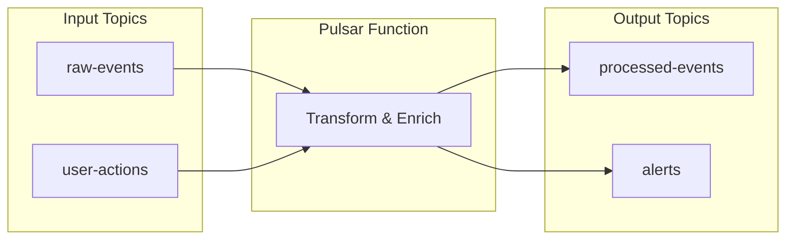
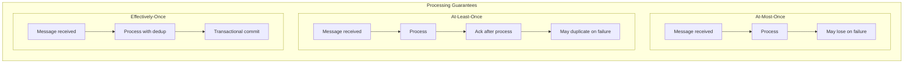
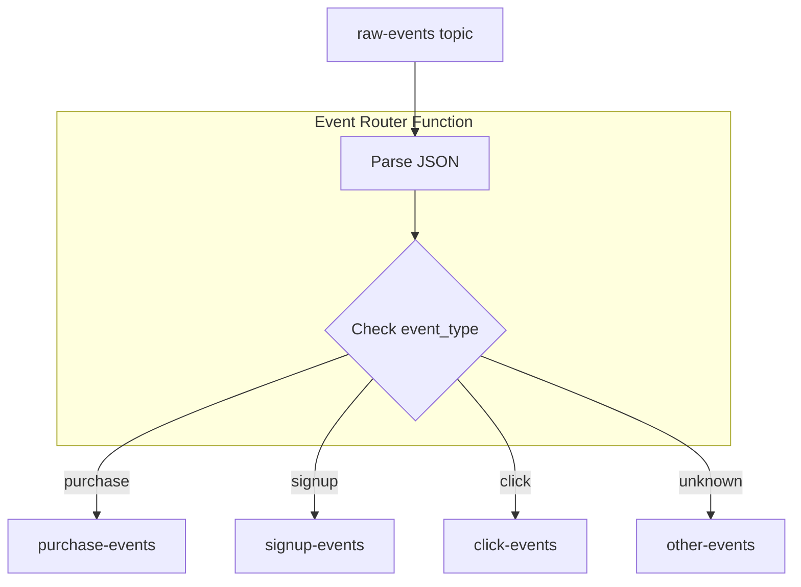
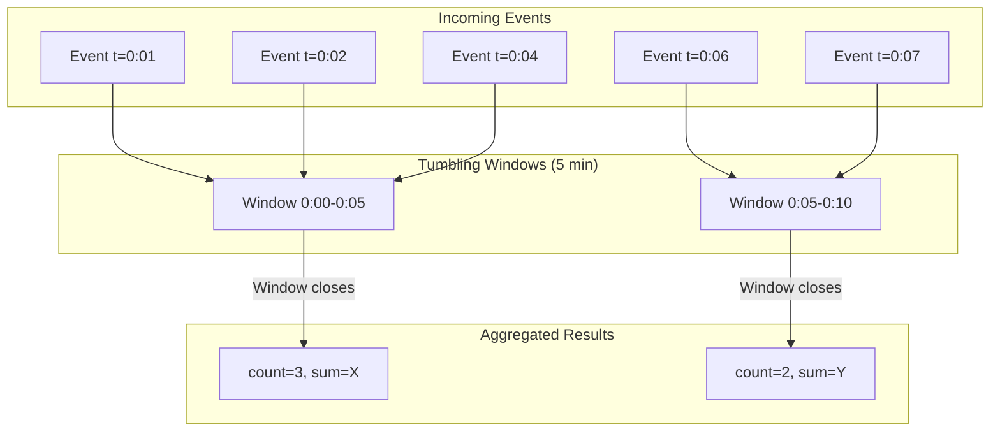
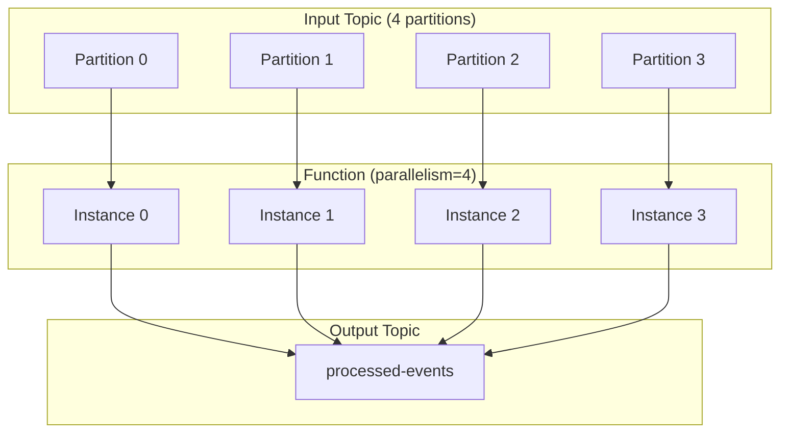
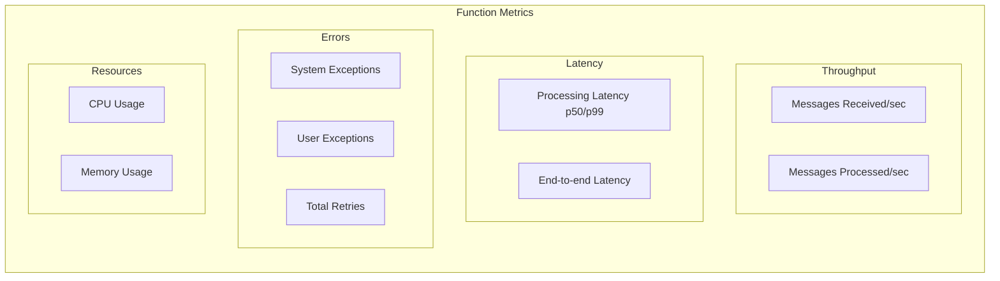

# How to Use Pulsar Functions for Stream Processing

Author: [nawazdhandala](https://www.github.com/nawazdhandala)

Tags: Apache Pulsar, Pulsar Functions, Stream Processing, Serverless, Event-Driven Architecture, Real-Time Data

Description: A practical guide to building serverless stream processing pipelines with Apache Pulsar Functions, covering stateless transformations, stateful processing, and deployment patterns.

---

Apache Pulsar Functions provide a lightweight compute framework that runs directly within your Pulsar cluster. Instead of deploying separate stream processing frameworks like Flink or Spark, you can write simple functions that process messages as they flow through topics. This approach reduces operational complexity while giving you the flexibility to transform, filter, route, and aggregate data in real time.

This guide walks through building and deploying Pulsar Functions for common stream processing scenarios, from simple transformations to stateful aggregations.

## What Are Pulsar Functions

Pulsar Functions are serverless compute units that consume messages from one or more input topics, apply user-defined logic, and optionally publish results to output topics. They run within the Pulsar broker or as separate worker processes, eliminating the need for external stream processing infrastructure.



The key benefits of Pulsar Functions include:

- **No separate cluster**: Functions run within Pulsar, reducing operational overhead
- **Automatic scaling**: Functions scale based on topic partitions
- **Built-in fault tolerance**: State is persisted and recovered automatically
- **Language flexibility**: Write functions in Java, Python, or Go

## Function Processing Guarantees

Pulsar Functions support three processing semantics that determine how messages are handled during failures:



- **At-most-once**: Messages are acknowledged before processing. Fast but may lose data on failures.
- **At-least-once**: Messages are acknowledged after processing. Safe but may produce duplicates.
- **Effectively-once**: Uses transactions and deduplication for exactly-once semantics. Most reliable but highest latency.

## Setting Up the Development Environment

Before writing functions, set up a local Pulsar instance with function support enabled.

```bash
# Pull the Pulsar image
docker pull apachepulsar/pulsar:3.3.0

# Run Pulsar standalone with function worker enabled
docker run -d \
  --name pulsar-functions \
  -p 6650:6650 \
  -p 8080:8080 \
  apachepulsar/pulsar:3.3.0 \
  bin/pulsar standalone

# Verify the function worker is running
curl http://localhost:8080/admin/v2/worker/cluster
```

For Python functions, you also need the Pulsar client library:

```bash
pip install pulsar-client
```

## Building Your First Pulsar Function

Let us start with a simple function that transforms incoming JSON messages. This function reads raw event data, extracts relevant fields, and publishes enriched events.

### Python Function Example

```python
# transform_function.py
# A Pulsar Function that transforms and enriches incoming events

from pulsar import Function
import json
from datetime import datetime

class EventTransformer(Function):
    """
    Transforms raw event data into a standardized format.

    Input: Raw JSON events with varying structures
    Output: Normalized events with consistent schema
    """

    def __init__(self):
        # Initialize any resources needed by the function
        # This runs once when the function instance starts
        self.processed_count = 0

    def process(self, input_bytes, context):
        """
        Process a single message.

        Args:
            input_bytes: The message payload as bytes
            context: Provides access to function metadata and utilities

        Returns:
            The output message (published to output topic if configured)
        """
        # Get the logger from context for structured logging
        logger = context.get_logger()

        try:
            # Parse the incoming message
            raw_event = json.loads(input_bytes.decode('utf-8'))

            # Extract and normalize fields
            # Handle different field names that might exist in source data
            user_id = raw_event.get('user_id') or raw_event.get('userId') or 'unknown'
            event_type = raw_event.get('type') or raw_event.get('event_type') or 'unknown'
            timestamp = raw_event.get('timestamp') or raw_event.get('ts')

            # Build the normalized event structure
            normalized_event = {
                'event_id': context.get_message_id(),
                'user_id': user_id,
                'event_type': event_type,
                'original_timestamp': timestamp,
                'processed_at': datetime.utcnow().isoformat(),
                'source_topic': context.get_current_message_topic_name(),
                'payload': raw_event.get('data', {})
            }

            # Add metadata from message properties if available
            properties = context.get_message_properties()
            if properties:
                normalized_event['source_properties'] = dict(properties)

            self.processed_count += 1

            # Log every 100 messages for monitoring
            if self.processed_count % 100 == 0:
                logger.info(f"Processed {self.processed_count} events")

            # Return the transformed message
            # Pulsar will publish this to the configured output topic
            return json.dumps(normalized_event).encode('utf-8')

        except json.JSONDecodeError as e:
            # Log parsing errors but do not fail the function
            logger.error(f"Failed to parse message: {e}")
            # Return None to skip publishing for invalid messages
            return None

        except Exception as e:
            # Log unexpected errors
            logger.error(f"Error processing message: {e}")
            raise  # Re-raise to trigger retry based on processing guarantee
```

### Deploying the Function

Deploy the function using the Pulsar admin CLI:

```bash
# Deploy the Python function
docker exec -it pulsar-functions bin/pulsar-admin functions create \
  --name event-transformer \
  --tenant public \
  --namespace default \
  --py /path/to/transform_function.py \
  --classname transform_function.EventTransformer \
  --inputs persistent://public/default/raw-events \
  --output persistent://public/default/processed-events \
  --processing-guarantees ATLEAST_ONCE \
  --log-topic persistent://public/default/function-logs
```

Let us break down the deployment options:

- `--name`: Unique identifier for the function
- `--inputs`: Source topic(s) to consume from
- `--output`: Destination topic for results
- `--processing-guarantees`: ATMOST_ONCE, ATLEAST_ONCE, or EFFECTIVELY_ONCE
- `--log-topic`: Where function logs are published for monitoring

### Verifying Function Deployment

```bash
# Check function status
docker exec -it pulsar-functions bin/pulsar-admin functions status \
  --name event-transformer \
  --tenant public \
  --namespace default

# List all deployed functions
docker exec -it pulsar-functions bin/pulsar-admin functions list \
  --tenant public \
  --namespace default
```

## Filtering and Routing Messages

A common stream processing pattern is filtering messages and routing them to different topics based on content. Here is a function that routes events by type:

```python
# router_function.py
# Routes messages to different topics based on event type

from pulsar import Function
import json

class EventRouter(Function):
    """
    Routes events to topic-specific destinations based on event type.
    Uses the context to publish to multiple output topics.
    """

    # Define routing rules: event_type -> output_topic
    ROUTING_TABLE = {
        'purchase': 'persistent://public/default/purchase-events',
        'signup': 'persistent://public/default/signup-events',
        'click': 'persistent://public/default/click-events',
        'view': 'persistent://public/default/view-events'
    }

    # Default topic for unrecognized event types
    DEFAULT_TOPIC = 'persistent://public/default/other-events'

    def process(self, input_bytes, context):
        """
        Route each message to the appropriate topic based on event_type.
        """
        logger = context.get_logger()

        try:
            event = json.loads(input_bytes.decode('utf-8'))
            event_type = event.get('event_type', 'unknown')

            # Determine the destination topic
            destination = self.ROUTING_TABLE.get(event_type, self.DEFAULT_TOPIC)

            # Publish to the specific topic using context
            # This bypasses the default output topic
            context.publish(
                topic_name=destination,
                message=input_bytes,
                # Preserve the partition key for ordering
                partition_key=event.get('user_id', '')
            )

            logger.debug(f"Routed {event_type} event to {destination}")

            # Return None since we manually published
            return None

        except Exception as e:
            logger.error(f"Routing failed: {e}")
            # Publish to dead letter topic for failed messages
            context.publish(
                topic_name='persistent://public/default/routing-failures',
                message=input_bytes
            )
            return None
```

The flow looks like this:



Deploy the router function:

```bash
docker exec -it pulsar-functions bin/pulsar-admin functions create \
  --name event-router \
  --tenant public \
  --namespace default \
  --py /path/to/router_function.py \
  --classname router_function.EventRouter \
  --inputs persistent://public/default/raw-events \
  --processing-guarantees ATLEAST_ONCE
```

Note that we omit `--output` since the function publishes to multiple topics dynamically.

## Stateful Stream Processing

Pulsar Functions support stateful processing through a built-in state store. This enables aggregations, counting, and maintaining context across messages.

### Counter Function with State

```python
# counter_function.py
# Maintains running counts of events per user using Pulsar state store

from pulsar import Function
import json

class UserEventCounter(Function):
    """
    Counts events per user using Pulsar's stateful API.
    State is automatically persisted and recovered on failures.
    """

    def process(self, input_bytes, context):
        """
        Increment the counter for the user and emit updated counts.
        """
        logger = context.get_logger()

        try:
            event = json.loads(input_bytes.decode('utf-8'))
            user_id = event.get('user_id')

            if not user_id:
                logger.warning("Event missing user_id, skipping")
                return None

            # Build the state key
            # State is scoped to this function instance
            state_key = f"count_{user_id}"

            # Get current count from state store
            # Returns None if key does not exist
            current_count = context.get_state(state_key)

            if current_count is None:
                new_count = 1
            else:
                # State values are stored as bytes
                new_count = int(current_count.decode('utf-8')) + 1

            # Update the state
            context.put_state(state_key, str(new_count).encode('utf-8'))

            # Emit the updated count
            result = {
                'user_id': user_id,
                'event_count': new_count,
                'last_event_type': event.get('event_type'),
                'last_event_time': event.get('timestamp')
            }

            return json.dumps(result).encode('utf-8')

        except Exception as e:
            logger.error(f"Counter error: {e}")
            raise
```

Deploy with state enabled:

```bash
docker exec -it pulsar-functions bin/pulsar-admin functions create \
  --name user-counter \
  --tenant public \
  --namespace default \
  --py /path/to/counter_function.py \
  --classname counter_function.UserEventCounter \
  --inputs persistent://public/default/user-events \
  --output persistent://public/default/user-counts \
  --processing-guarantees EFFECTIVELY_ONCE \
  --state-storage-service-url bk://localhost:4181
```

The `--state-storage-service-url` points to BookKeeper, where state is durably stored.

### Windowed Aggregations

For time-based aggregations, combine state with timestamp checking:

```python
# window_aggregator.py
# Performs tumbling window aggregations on event streams

from pulsar import Function
import json
import time

class WindowedAggregator(Function):
    """
    Aggregates events into fixed time windows (tumbling windows).
    Emits window results when the window closes.
    """

    # Window size in seconds (5-minute windows)
    WINDOW_SIZE_SECONDS = 300

    def get_window_key(self, timestamp_ms):
        """
        Calculate the window identifier for a given timestamp.
        Windows are aligned to clock time.
        """
        timestamp_seconds = timestamp_ms / 1000
        window_start = int(timestamp_seconds / self.WINDOW_SIZE_SECONDS) * self.WINDOW_SIZE_SECONDS
        return window_start

    def process(self, input_bytes, context):
        """
        Add event to the appropriate window and emit results when windows close.
        """
        logger = context.get_logger()

        try:
            event = json.loads(input_bytes.decode('utf-8'))

            # Get event timestamp or use current time
            event_time = event.get('timestamp')
            if event_time is None:
                event_time = int(time.time() * 1000)

            # Determine which window this event belongs to
            window_key = self.get_window_key(event_time)
            event_type = event.get('event_type', 'unknown')

            # Build state key for this window and event type
            state_key = f"window_{window_key}_{event_type}"

            # Get current window state
            current_state = context.get_state(state_key)

            if current_state is None:
                window_data = {
                    'window_start': window_key,
                    'window_end': window_key + self.WINDOW_SIZE_SECONDS,
                    'event_type': event_type,
                    'count': 0,
                    'sum_value': 0.0,
                    'min_value': float('inf'),
                    'max_value': float('-inf')
                }
            else:
                window_data = json.loads(current_state.decode('utf-8'))

            # Update aggregations
            value = event.get('value', 0)
            window_data['count'] += 1
            window_data['sum_value'] += value
            window_data['min_value'] = min(window_data['min_value'], value)
            window_data['max_value'] = max(window_data['max_value'], value)

            # Save updated state
            context.put_state(state_key, json.dumps(window_data).encode('utf-8'))

            # Check if we should emit results for closed windows
            current_window = self.get_window_key(int(time.time() * 1000))

            # If we are processing old data, the window may already be closed
            if window_key < current_window - self.WINDOW_SIZE_SECONDS:
                # Window is closed, emit final result
                if window_data['min_value'] == float('inf'):
                    window_data['min_value'] = 0
                if window_data['max_value'] == float('-inf'):
                    window_data['max_value'] = 0

                window_data['avg_value'] = (
                    window_data['sum_value'] / window_data['count']
                    if window_data['count'] > 0 else 0
                )

                # Clear the state for this window
                context.put_state(state_key, None)

                logger.info(f"Emitting window result: {window_data}")
                return json.dumps(window_data).encode('utf-8')

            # Window still open, no output yet
            return None

        except Exception as e:
            logger.error(f"Aggregation error: {e}")
            raise
```

The windowing pattern:



## Java Functions for Performance

For high-throughput scenarios, Java functions offer better performance. Here is the same transformation in Java:

```java
// EventTransformerFunction.java
// High-performance event transformer using Java SDK

package com.example.functions;

import org.apache.pulsar.functions.api.Context;
import org.apache.pulsar.functions.api.Function;
import com.google.gson.Gson;
import com.google.gson.JsonObject;
import java.time.Instant;
import java.util.Optional;

public class EventTransformerFunction implements Function<byte[], byte[]> {

    // Reuse Gson instance for better performance
    private transient Gson gson;
    private transient long processedCount;

    @Override
    public byte[] process(byte[] input, Context context) throws Exception {
        // Lazy initialization of Gson
        if (gson == null) {
            gson = new Gson();
            processedCount = 0;
        }

        try {
            // Parse input JSON
            String inputJson = new String(input, "UTF-8");
            JsonObject rawEvent = gson.fromJson(inputJson, JsonObject.class);

            // Extract fields with fallbacks
            String userId = getStringField(rawEvent, "user_id", "userId", "unknown");
            String eventType = getStringField(rawEvent, "event_type", "type", "unknown");
            String timestamp = getStringField(rawEvent, "timestamp", "ts", null);

            // Build normalized event
            JsonObject normalized = new JsonObject();
            normalized.addProperty("event_id", context.getMessageId().toString());
            normalized.addProperty("user_id", userId);
            normalized.addProperty("event_type", eventType);
            normalized.addProperty("original_timestamp", timestamp);
            normalized.addProperty("processed_at", Instant.now().toString());
            normalized.addProperty("source_topic", context.getCurrentRecord().getTopicName().orElse("unknown"));

            // Include original payload
            if (rawEvent.has("data")) {
                normalized.add("payload", rawEvent.get("data"));
            }

            processedCount++;

            // Log progress periodically
            if (processedCount % 1000 == 0) {
                context.getLogger().info("Processed " + processedCount + " events");
            }

            return gson.toJson(normalized).getBytes("UTF-8");

        } catch (Exception e) {
            context.getLogger().error("Failed to process message: " + e.getMessage());
            return null;  // Skip invalid messages
        }
    }

    /**
     * Helper to get a string field with fallback field names.
     */
    private String getStringField(JsonObject obj, String primary, String fallback, String defaultValue) {
        if (obj.has(primary) && !obj.get(primary).isJsonNull()) {
            return obj.get(primary).getAsString();
        }
        if (fallback != null && obj.has(fallback) && !obj.get(fallback).isJsonNull()) {
            return obj.get(fallback).getAsString();
        }
        return defaultValue;
    }
}
```

Build and deploy the Java function:

```bash
# Build with Maven (assuming pom.xml is configured)
mvn clean package

# Deploy the JAR
docker exec -it pulsar-functions bin/pulsar-admin functions create \
  --name event-transformer-java \
  --tenant public \
  --namespace default \
  --jar /path/to/target/functions-1.0.jar \
  --classname com.example.functions.EventTransformerFunction \
  --inputs persistent://public/default/raw-events \
  --output persistent://public/default/processed-events \
  --processing-guarantees ATLEAST_ONCE
```

## Function Configuration and Resources

Configure function resources based on workload requirements:

```bash
# Deploy with custom resource allocation
docker exec -it pulsar-functions bin/pulsar-admin functions create \
  --name heavy-processor \
  --tenant public \
  --namespace default \
  --py /path/to/function.py \
  --classname function.HeavyProcessor \
  --inputs persistent://public/default/large-events \
  --output persistent://public/default/processed-large \
  --cpu 2.0 \
  --ram 4096 \
  --disk 10000 \
  --parallelism 4 \
  --processing-guarantees ATLEAST_ONCE
```

Resource options:

- `--cpu`: Number of CPU cores (can be fractional)
- `--ram`: Memory in megabytes
- `--disk`: Disk space in megabytes
- `--parallelism`: Number of function instances to run

The parallelism setting determines how many instances process messages in parallel:



## Connecting to External Systems

Functions often need to interact with databases, APIs, or other services. Here is a pattern for external connectivity:

```python
# enrichment_function.py
# Enriches events with data from an external API

from pulsar import Function
import json
import urllib.request
import urllib.error

class EventEnricher(Function):
    """
    Enriches incoming events with user profile data from an external API.
    Includes caching to reduce API calls.
    """

    # Simple in-memory cache
    # In production, consider Redis or the state store for persistence
    _user_cache = {}
    _cache_ttl_seconds = 300

    def __init__(self):
        self.api_base_url = None

    def process(self, input_bytes, context):
        """
        Enrich event with user profile data.
        """
        logger = context.get_logger()

        # Get API URL from function config
        if self.api_base_url is None:
            user_config = context.get_user_config_value('api_base_url')
            self.api_base_url = user_config or 'http://user-service:8080'

        try:
            event = json.loads(input_bytes.decode('utf-8'))
            user_id = event.get('user_id')

            if not user_id:
                return input_bytes  # Return unchanged if no user_id

            # Try to get user profile from cache or API
            user_profile = self._get_user_profile(user_id, logger)

            # Enrich the event
            if user_profile:
                event['user_profile'] = {
                    'name': user_profile.get('name'),
                    'email': user_profile.get('email'),
                    'tier': user_profile.get('subscription_tier', 'free'),
                    'country': user_profile.get('country')
                }

            return json.dumps(event).encode('utf-8')

        except Exception as e:
            logger.error(f"Enrichment failed: {e}")
            # Return original event on failure
            return input_bytes

    def _get_user_profile(self, user_id, logger):
        """
        Fetch user profile from cache or API.
        """
        import time

        # Check cache first
        cached = self._user_cache.get(user_id)
        if cached:
            cache_time, profile = cached
            if time.time() - cache_time < self._cache_ttl_seconds:
                return profile

        # Fetch from API
        try:
            url = f"{self.api_base_url}/users/{user_id}"
            request = urllib.request.Request(url)
            request.add_header('Accept', 'application/json')

            with urllib.request.urlopen(request, timeout=5) as response:
                profile = json.loads(response.read().decode('utf-8'))

            # Update cache
            self._user_cache[user_id] = (time.time(), profile)
            return profile

        except urllib.error.HTTPError as e:
            if e.code == 404:
                logger.debug(f"User {user_id} not found")
            else:
                logger.warning(f"API error for user {user_id}: {e}")
            return None

        except Exception as e:
            logger.warning(f"Failed to fetch user {user_id}: {e}")
            return None
```

Deploy with configuration:

```bash
docker exec -it pulsar-functions bin/pulsar-admin functions create \
  --name event-enricher \
  --tenant public \
  --namespace default \
  --py /path/to/enrichment_function.py \
  --classname enrichment_function.EventEnricher \
  --inputs persistent://public/default/raw-events \
  --output persistent://public/default/enriched-events \
  --user-config '{"api_base_url": "http://user-service:8080"}' \
  --processing-guarantees ATLEAST_ONCE
```

## Error Handling and Dead Letter Topics

Production functions need robust error handling. Configure automatic dead letter routing for failed messages:

```python
# robust_function.py
# Production-ready function with comprehensive error handling

from pulsar import Function
import json
import traceback

class RobustProcessor(Function):
    """
    A production-ready function with error handling,
    metrics, and dead letter topic support.
    """

    def __init__(self):
        self.success_count = 0
        self.error_count = 0

    def process(self, input_bytes, context):
        """
        Process with comprehensive error handling.
        """
        logger = context.get_logger()

        try:
            # Attempt to process the message
            result = self._process_internal(input_bytes, context)
            self.success_count += 1

            # Record success metric
            context.record_metric("messages_processed", 1)

            return result

        except json.JSONDecodeError as e:
            # Permanent failure - message format is invalid
            self._handle_permanent_failure(
                input_bytes, context, "invalid_json", str(e)
            )
            return None

        except ValueError as e:
            # Permanent failure - business logic rejection
            self._handle_permanent_failure(
                input_bytes, context, "validation_failed", str(e)
            )
            return None

        except ConnectionError as e:
            # Transient failure - retry by raising
            logger.warning(f"Connection error, will retry: {e}")
            context.record_metric("transient_errors", 1)
            raise  # Pulsar will retry based on processing guarantees

        except Exception as e:
            # Unknown error - log full traceback and send to DLT
            logger.error(f"Unexpected error: {traceback.format_exc()}")
            self._handle_permanent_failure(
                input_bytes, context, "unexpected_error", str(e)
            )
            return None

    def _process_internal(self, input_bytes, context):
        """
        Actual processing logic separated for cleaner error handling.
        """
        event = json.loads(input_bytes.decode('utf-8'))

        # Validate required fields
        if not event.get('event_type'):
            raise ValueError("Missing required field: event_type")

        if not event.get('timestamp'):
            raise ValueError("Missing required field: timestamp")

        # Transform the event
        processed = {
            'original': event,
            'processed_by': 'robust-processor',
            'processing_timestamp': context.get_message_id()
        }

        return json.dumps(processed).encode('utf-8')

    def _handle_permanent_failure(self, input_bytes, context, error_type, error_message):
        """
        Send failed messages to dead letter topic with error context.
        """
        logger = context.get_logger()
        self.error_count += 1

        # Build dead letter message with error context
        dead_letter = {
            'original_message': input_bytes.decode('utf-8', errors='replace'),
            'error_type': error_type,
            'error_message': error_message,
            'source_topic': context.get_current_message_topic_name(),
            'message_id': str(context.get_message_id()),
            'function_name': context.get_function_name()
        }

        # Publish to dead letter topic
        context.publish(
            topic_name='persistent://public/default/processing-dlq',
            message=json.dumps(dead_letter).encode('utf-8')
        )

        # Record error metrics
        context.record_metric("permanent_errors", 1)
        context.record_metric(f"error_{error_type}", 1)

        logger.warning(f"Sent to DLQ: {error_type} - {error_message}")
```

## Monitoring Functions

Monitor function health and performance using the admin API:

```bash
# Get function status including running instances
docker exec -it pulsar-functions bin/pulsar-admin functions status \
  --name event-transformer \
  --tenant public \
  --namespace default

# Get detailed stats
docker exec -it pulsar-functions bin/pulsar-admin functions stats \
  --name event-transformer \
  --tenant public \
  --namespace default

# View function logs
docker exec -it pulsar-functions bin/pulsar-admin functions trigger \
  --name event-transformer \
  --tenant public \
  --namespace default \
  --trigger-value '{"user_id": "test", "event_type": "test"}'
```

Key metrics to monitor:



## Updating Functions Without Downtime

Update running functions without losing messages:

```bash
# Update function code
docker exec -it pulsar-functions bin/pulsar-admin functions update \
  --name event-transformer \
  --tenant public \
  --namespace default \
  --py /path/to/updated_function.py

# Update configuration only
docker exec -it pulsar-functions bin/pulsar-admin functions update \
  --name event-enricher \
  --tenant public \
  --namespace default \
  --user-config '{"api_base_url": "http://new-user-service:8080"}'

# Scale up parallelism
docker exec -it pulsar-functions bin/pulsar-admin functions update \
  --name event-transformer \
  --tenant public \
  --namespace default \
  --parallelism 8
```

Pulsar performs rolling updates, replacing instances one at a time to maintain availability.

## Best Practices for Production

When deploying Pulsar Functions in production, follow these guidelines:

**Keep functions focused.** Each function should do one thing well. Chain multiple functions for complex pipelines rather than building monolithic processors.

**Use appropriate processing guarantees.** At-least-once is the right choice for most cases. Only use effectively-once when you need exactly-once semantics, as it adds latency.

**Implement idempotent processing.** Even with effectively-once guarantees, design functions to handle duplicate messages safely. Use message IDs or business keys to detect duplicates.

**Monitor function lag.** Watch the backlog (unprocessed messages) on input topics. Growing backlog indicates functions cannot keep up with input rate.

**Test with production-like data.** Functions behave differently with real data volumes and patterns. Test with representative datasets before deployment.

**Set appropriate timeouts.** Configure reasonable timeouts for external service calls. Failing fast is better than blocking the function.

**Version your functions.** Include version information in function names or metadata. This helps track deployments and rollbacks.

## Comparing Pulsar Functions with Alternatives

Pulsar Functions are best for:

- Simple transformations and routing
- Workloads that benefit from tight Pulsar integration
- Teams that want to minimize operational overhead
- Use cases where sub-second latency is sufficient

Consider alternatives when you need:

- Complex event processing with SQL-like queries (use Flink SQL)
- Machine learning model serving at scale (use dedicated ML platforms)
- Extremely low latency requirements (use custom consumers)
- Multi-source joins across different systems (use Flink or Spark)

---

Stream processing with Pulsar Functions gives you a lightweight path to real-time data transformation without the operational burden of separate processing clusters. As your processing needs grow, monitoring becomes essential for maintaining reliability. [OneUptime](https://oneuptime.com) provides comprehensive observability for stream processing systems, helping you track function performance, detect anomalies, and ensure your real-time pipelines deliver data when your applications need it.
