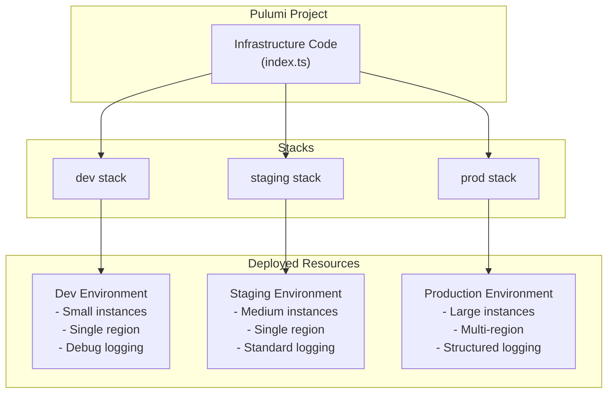
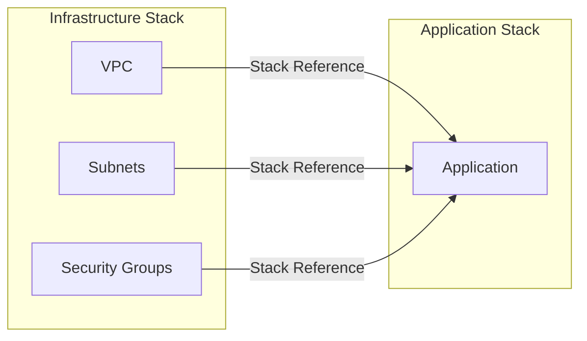
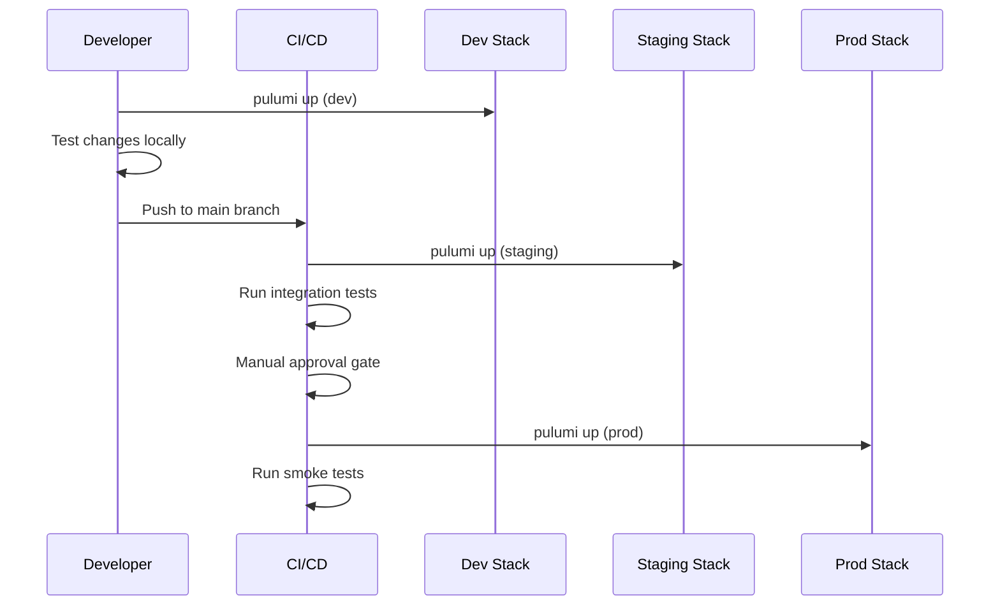

# How to Implement Pulumi Stacks for Environments

Author: [nawazdhandala](https://www.github.com/nawazdhandala)

Tags: Pulumi, Infrastructure as Code, DevOps, Multi-Environment, Cloud Infrastructure, Stack Management, Configuration Management

Description: Learn how to use Pulumi stacks to manage multiple deployment environments like development, staging, and production with isolated configurations and shared code.

---

Managing multiple environments is one of the most common challenges in infrastructure as code. Whether you need separate development, staging, and production environments, or you want to deploy the same infrastructure across multiple regions, Pulumi stacks provide an elegant solution. This guide walks you through implementing Pulumi stacks for environment management with practical, real-world examples.

## What Are Pulumi Stacks?

A Pulumi stack is an isolated, independently configurable instance of a Pulumi program. Each stack has its own state file and configuration values, allowing you to deploy the same infrastructure code to different environments with different settings.



## Setting Up Your First Multi-Environment Project

Let's create a project that deploys a web application to AWS with different configurations per environment.

### Project Structure

```
my-app-infra/
├── Pulumi.yaml           # Project definition
├── Pulumi.dev.yaml       # Dev stack configuration
├── Pulumi.staging.yaml   # Staging stack configuration
├── Pulumi.prod.yaml      # Production stack configuration
├── index.ts              # Main infrastructure code
├── config.ts             # Configuration loading logic
└── components/
    ├── networking.ts     # VPC and networking resources
    ├── compute.ts        # EC2/ECS resources
    └── database.ts       # RDS resources
```

### Initialize the Project

```bash
# Create a new Pulumi project
pulumi new aws-typescript --name my-app-infra

# Create additional stacks for each environment
pulumi stack init dev
pulumi stack init staging
pulumi stack init prod
```

### Define Stack Configurations

Each environment needs its own configuration file. Here's how to set them up:

**Pulumi.dev.yaml**
```yaml
# Development environment configuration
# Uses smaller, cost-effective resources for local testing
config:
  aws:region: us-west-2
  my-app-infra:environment: dev
  my-app-infra:instanceType: t3.small
  my-app-infra:instanceCount: 1
  my-app-infra:dbInstanceClass: db.t3.micro
  my-app-infra:enableMultiAz: false
  my-app-infra:logLevel: debug
  my-app-infra:domain: dev.myapp.example.com
```

**Pulumi.staging.yaml**
```yaml
# Staging environment configuration
# Mirrors production architecture at reduced scale
config:
  aws:region: us-west-2
  my-app-infra:environment: staging
  my-app-infra:instanceType: t3.medium
  my-app-infra:instanceCount: 2
  my-app-infra:dbInstanceClass: db.t3.small
  my-app-infra:enableMultiAz: false
  my-app-infra:logLevel: info
  my-app-infra:domain: staging.myapp.example.com
```

**Pulumi.prod.yaml**
```yaml
# Production environment configuration
# Full-scale deployment with high availability
config:
  aws:region: us-east-1
  my-app-infra:environment: prod
  my-app-infra:instanceType: t3.large
  my-app-infra:instanceCount: 4
  my-app-infra:dbInstanceClass: db.r5.large
  my-app-infra:enableMultiAz: true
  my-app-infra:logLevel: warn
  my-app-infra:domain: myapp.example.com
```

## Loading Configuration in Your Code

Create a type-safe configuration loader that reads stack-specific values:

**config.ts**
```typescript
import * as pulumi from "@pulumi/pulumi";

// Define the shape of our environment configuration
// This provides type safety and documentation for all config values
export interface EnvironmentConfig {
    environment: string;
    instanceType: string;
    instanceCount: number;
    dbInstanceClass: string;
    enableMultiAz: boolean;
    logLevel: string;
    domain: string;
}

// Load configuration from the current stack
// Pulumi automatically reads from the correct Pulumi.<stack>.yaml file
export function loadConfig(): EnvironmentConfig {
    const config = new pulumi.Config();

    return {
        // requireString throws an error if the value is missing
        // This catches configuration errors early in the deployment
        environment: config.require("environment"),
        instanceType: config.require("instanceType"),

        // requireNumber parses the string value as a number
        instanceCount: config.requireNumber("instanceCount"),

        dbInstanceClass: config.require("dbInstanceClass"),

        // requireBoolean parses "true"/"false" strings
        enableMultiAz: config.requireBoolean("enableMultiAz"),

        logLevel: config.require("logLevel"),
        domain: config.require("domain"),
    };
}

// Helper to get environment-specific resource naming
// Ensures consistent naming across all resources in a stack
export function getResourceName(baseName: string, env: string): string {
    return `${baseName}-${env}`;
}
```

## Building Environment-Aware Components

### Networking Component

**components/networking.ts**
```typescript
import * as pulumi from "@pulumi/pulumi";
import * as aws from "@pulumi/aws";
import { EnvironmentConfig, getResourceName } from "../config";

export interface NetworkingArgs {
    config: EnvironmentConfig;
}

export interface NetworkingOutputs {
    vpcId: pulumi.Output<string>;
    publicSubnetIds: pulumi.Output<string>[];
    privateSubnetIds: pulumi.Output<string>[];
    securityGroupId: pulumi.Output<string>;
}

export function createNetworking(args: NetworkingArgs): NetworkingOutputs {
    const { config } = args;
    const env = config.environment;

    // VPC CIDR varies by environment to allow VPC peering without conflicts
    // Dev: 10.0.x.x, Staging: 10.1.x.x, Prod: 10.2.x.x
    const vpcCidrs: Record<string, string> = {
        dev: "10.0.0.0/16",
        staging: "10.1.0.0/16",
        prod: "10.2.0.0/16",
    };

    // Create VPC with environment-specific CIDR
    const vpc = new aws.ec2.Vpc(getResourceName("vpc", env), {
        cidrBlock: vpcCidrs[env] || "10.0.0.0/16",
        enableDnsHostnames: true,
        enableDnsSupport: true,
        tags: {
            Name: getResourceName("vpc", env),
            Environment: env,
            // ManagedBy tag helps identify Pulumi-managed resources
            ManagedBy: "pulumi",
        },
    });

    // Get available AZs in the current region
    const availabilityZones = aws.getAvailabilityZones({
        state: "available",
    });

    // Create public subnets - one per AZ for high availability
    // Production gets 3 AZs, other environments get 2
    const azCount = env === "prod" ? 3 : 2;

    const publicSubnets: aws.ec2.Subnet[] = [];
    const privateSubnets: aws.ec2.Subnet[] = [];

    // Create subnets in each availability zone
    for (let i = 0; i < azCount; i++) {
        // Public subnet for load balancers and bastion hosts
        const publicSubnet = new aws.ec2.Subnet(
            getResourceName(`public-subnet-${i}`, env),
            {
                vpcId: vpc.id,
                // Calculate CIDR: x.x.0.0/24, x.x.1.0/24, etc.
                cidrBlock: pulumi.interpolate`${vpc.cidrBlock.apply(
                    cidr => cidr.replace("/16", "")
                ).apply(base => {
                    const parts = base.split(".");
                    return `${parts[0]}.${parts[1]}.${i}.0/24`;
                })}`,
                availabilityZone: availabilityZones.then(azs => azs.names[i]),
                mapPublicIpOnLaunch: true,
                tags: {
                    Name: getResourceName(`public-subnet-${i}`, env),
                    Environment: env,
                    Type: "public",
                },
            }
        );
        publicSubnets.push(publicSubnet);

        // Private subnet for application servers and databases
        const privateSubnet = new aws.ec2.Subnet(
            getResourceName(`private-subnet-${i}`, env),
            {
                vpcId: vpc.id,
                // Private subnets use higher range: x.x.10.0/24, x.x.11.0/24, etc.
                cidrBlock: pulumi.interpolate`${vpc.cidrBlock.apply(
                    cidr => cidr.replace("/16", "")
                ).apply(base => {
                    const parts = base.split(".");
                    return `${parts[0]}.${parts[1]}.${10 + i}.0/24`;
                })}`,
                availabilityZone: availabilityZones.then(azs => azs.names[i]),
                tags: {
                    Name: getResourceName(`private-subnet-${i}`, env),
                    Environment: env,
                    Type: "private",
                },
            }
        );
        privateSubnets.push(privateSubnet);
    }

    // Internet Gateway for public subnet internet access
    const igw = new aws.ec2.InternetGateway(getResourceName("igw", env), {
        vpcId: vpc.id,
        tags: {
            Name: getResourceName("igw", env),
            Environment: env,
        },
    });

    // Public route table with route to internet
    const publicRouteTable = new aws.ec2.RouteTable(
        getResourceName("public-rt", env),
        {
            vpcId: vpc.id,
            routes: [
                {
                    cidrBlock: "0.0.0.0/0",
                    gatewayId: igw.id,
                },
            ],
            tags: {
                Name: getResourceName("public-rt", env),
                Environment: env,
            },
        }
    );

    // Associate public subnets with the public route table
    publicSubnets.forEach((subnet, i) => {
        new aws.ec2.RouteTableAssociation(
            getResourceName(`public-rta-${i}`, env),
            {
                subnetId: subnet.id,
                routeTableId: publicRouteTable.id,
            }
        );
    });

    // Security group for web traffic
    const webSg = new aws.ec2.SecurityGroup(getResourceName("web-sg", env), {
        vpcId: vpc.id,
        description: `Web security group for ${env} environment`,
        ingress: [
            {
                description: "HTTPS from anywhere",
                fromPort: 443,
                toPort: 443,
                protocol: "tcp",
                cidrBlocks: ["0.0.0.0/0"],
            },
            {
                description: "HTTP from anywhere (redirects to HTTPS)",
                fromPort: 80,
                toPort: 80,
                protocol: "tcp",
                cidrBlocks: ["0.0.0.0/0"],
            },
        ],
        egress: [
            {
                description: "Allow all outbound traffic",
                fromPort: 0,
                toPort: 0,
                protocol: "-1",
                cidrBlocks: ["0.0.0.0/0"],
            },
        ],
        tags: {
            Name: getResourceName("web-sg", env),
            Environment: env,
        },
    });

    return {
        vpcId: vpc.id,
        publicSubnetIds: publicSubnets.map(s => s.id),
        privateSubnetIds: privateSubnets.map(s => s.id),
        securityGroupId: webSg.id,
    };
}
```

### Database Component

**components/database.ts**
```typescript
import * as pulumi from "@pulumi/pulumi";
import * as aws from "@pulumi/aws";
import * as random from "@pulumi/random";
import { EnvironmentConfig, getResourceName } from "../config";

export interface DatabaseArgs {
    config: EnvironmentConfig;
    vpcId: pulumi.Output<string>;
    subnetIds: pulumi.Output<string>[];
    allowedSecurityGroupId: pulumi.Output<string>;
}

export interface DatabaseOutputs {
    endpoint: pulumi.Output<string>;
    port: pulumi.Output<number>;
    databaseName: pulumi.Output<string>;
}

export function createDatabase(args: DatabaseArgs): DatabaseOutputs {
    const { config, vpcId, subnetIds, allowedSecurityGroupId } = args;
    const env = config.environment;

    // Generate a random password for the database
    // Store the actual password in AWS Secrets Manager for production use
    const dbPassword = new random.RandomPassword(
        getResourceName("db-password", env),
        {
            length: 24,
            special: true,
            // Exclude characters that cause issues in connection strings
            overrideSpecial: "!#$%&*()-_=+[]{}<>:?",
        }
    );

    // Subnet group defines which subnets RDS can use
    const subnetGroup = new aws.rds.SubnetGroup(
        getResourceName("db-subnet-group", env),
        {
            // Convert Output<string>[] to a single Output<string[]>
            subnetIds: pulumi.all(subnetIds),
            tags: {
                Name: getResourceName("db-subnet-group", env),
                Environment: env,
            },
        }
    );

    // Security group for database - only allows traffic from web servers
    const dbSecurityGroup = new aws.ec2.SecurityGroup(
        getResourceName("db-sg", env),
        {
            vpcId: vpcId,
            description: `Database security group for ${env} environment`,
            ingress: [
                {
                    description: "PostgreSQL from web servers",
                    fromPort: 5432,
                    toPort: 5432,
                    protocol: "tcp",
                    // Only allow connections from the web security group
                    securityGroups: [allowedSecurityGroupId],
                },
            ],
            tags: {
                Name: getResourceName("db-sg", env),
                Environment: env,
            },
        }
    );

    // Parameter group allows customizing database configuration
    const parameterGroup = new aws.rds.ParameterGroup(
        getResourceName("db-params", env),
        {
            family: "postgres15",
            description: `PostgreSQL parameters for ${env}`,
            parameters: [
                // Log slow queries (threshold varies by environment)
                {
                    name: "log_min_duration_statement",
                    // Dev: log queries > 100ms, Prod: log queries > 1000ms
                    value: env === "prod" ? "1000" : "100",
                },
                // Enable query statistics extension
                {
                    name: "shared_preload_libraries",
                    value: "pg_stat_statements",
                },
            ],
            tags: {
                Environment: env,
            },
        }
    );

    // Create the RDS instance with environment-specific settings
    const database = new aws.rds.Instance(getResourceName("db", env), {
        // Instance sizing from configuration
        instanceClass: config.dbInstanceClass,

        // Storage configuration
        allocatedStorage: env === "prod" ? 100 : 20,
        maxAllocatedStorage: env === "prod" ? 500 : 50,
        storageType: "gp3",
        storageEncrypted: true,

        // Database engine
        engine: "postgres",
        engineVersion: "15.4",

        // Database details
        dbName: "myapp",
        username: "myapp_admin",
        password: dbPassword.result,

        // Networking
        dbSubnetGroupName: subnetGroup.name,
        vpcSecurityGroupIds: [dbSecurityGroup.id],
        publiclyAccessible: false,

        // High availability - only in production
        multiAz: config.enableMultiAz,

        // Backup configuration - longer retention in production
        backupRetentionPeriod: env === "prod" ? 30 : 7,
        backupWindow: "03:00-04:00",

        // Maintenance window - different times per environment
        maintenanceWindow: env === "prod"
            ? "sun:04:00-sun:05:00"
            : "sat:04:00-sat:05:00",

        // Use custom parameter group
        parameterGroupName: parameterGroup.name,

        // Deletion protection - enabled in production
        deletionProtection: env === "prod",

        // Skip final snapshot in dev (faster iteration)
        skipFinalSnapshot: env === "dev",
        finalSnapshotIdentifier: env !== "dev"
            ? getResourceName("db-final-snapshot", env)
            : undefined,

        tags: {
            Name: getResourceName("db", env),
            Environment: env,
        },
    });

    return {
        endpoint: database.endpoint,
        port: database.port,
        databaseName: database.dbName,
    };
}
```

## Main Infrastructure Entry Point

**index.ts**
```typescript
import * as pulumi from "@pulumi/pulumi";
import { loadConfig, getResourceName } from "./config";
import { createNetworking } from "./components/networking";
import { createDatabase } from "./components/database";

// Load the configuration for the current stack
// This reads from Pulumi.<stack-name>.yaml automatically
const config = loadConfig();

// Log the current environment for visibility
pulumi.log.info(`Deploying to ${config.environment} environment`);

// Create networking infrastructure
const networking = createNetworking({ config });

// Create database with appropriate sizing
const database = createDatabase({
    config,
    vpcId: networking.vpcId,
    subnetIds: networking.privateSubnetIds,
    allowedSecurityGroupId: networking.securityGroupId,
});

// Export important values for use by other stacks or external systems
export const environment = config.environment;
export const vpcId = networking.vpcId;
export const databaseEndpoint = database.endpoint;
export const domain = config.domain;

// Export a summary object for easy reference
export const summary = pulumi.all([
    networking.vpcId,
    database.endpoint,
]).apply(([vpc, dbEndpoint]) => ({
    environment: config.environment,
    vpc,
    database: dbEndpoint,
    domain: config.domain,
}));
```

## Managing Secrets Across Environments

Pulumi encrypts secrets automatically. Here's how to handle sensitive configuration:

```bash
# Set a secret value for the dev stack
pulumi stack select dev
pulumi config set --secret dbPassword "dev-secure-password-123"

# Set different secrets for production
pulumi stack select prod
pulumi config set --secret dbPassword "prod-super-secure-password-456"
pulumi config set --secret apiKey "sk-prod-api-key-789"
```

Access secrets in your code:

```typescript
import * as pulumi from "@pulumi/pulumi";

const config = new pulumi.Config();

// requireSecret returns an Output<string> that is marked as secret
// Pulumi will never display this value in logs or state
const dbPassword = config.requireSecret("dbPassword");

// Use the secret in resources
const database = new aws.rds.Instance("db", {
    // password is automatically treated as secret
    password: dbPassword,
    // ... other configuration
});
```

## Stack References: Sharing Data Between Stacks

Sometimes you need to reference outputs from one stack in another. This is common when you have separate stacks for networking and applications.



**Create a stack reference:**

```typescript
import * as pulumi from "@pulumi/pulumi";

// Reference the networking stack for the current environment
const env = pulumi.getStack(); // Returns "dev", "staging", or "prod"
const networkingStack = new pulumi.StackReference(`myorg/networking-infra/${env}`);

// Get outputs from the referenced stack
const vpcId = networkingStack.getOutput("vpcId");
const privateSubnetIds = networkingStack.getOutput("privateSubnetIds");

// Use these values in your resources
const service = new aws.ecs.Service("app", {
    // ... configuration
    networkConfiguration: {
        subnets: privateSubnetIds,
        // ... other network config
    },
});
```

## Deployment Workflow

Here's a typical workflow for deploying across environments:



### Deployment Commands

```bash
# Preview changes without applying (always do this first)
pulumi stack select dev
pulumi preview

# Deploy to development
pulumi up

# Deploy to staging after dev verification
pulumi stack select staging
pulumi preview
pulumi up

# Deploy to production with extra caution
pulumi stack select prod
pulumi preview --diff  # Show detailed diff
pulumi up --yes  # Skip confirmation (use in CI/CD only)
```

## CI/CD Integration Example

Here's a GitHub Actions workflow for multi-environment deployments:

**.github/workflows/deploy.yml**
```yaml
name: Deploy Infrastructure

on:
  push:
    branches: [main]
  pull_request:
    branches: [main]

jobs:
  preview:
    name: Preview Changes
    runs-on: ubuntu-latest
    steps:
      - uses: actions/checkout@v4

      - uses: actions/setup-node@v4
        with:
          node-version: '20'

      - name: Install dependencies
        run: npm ci

      - uses: pulumi/actions@v5
        with:
          command: preview
          stack-name: myorg/my-app-infra/staging
        env:
          PULUMI_ACCESS_TOKEN: ${{ secrets.PULUMI_ACCESS_TOKEN }}
          AWS_ACCESS_KEY_ID: ${{ secrets.AWS_ACCESS_KEY_ID }}
          AWS_SECRET_ACCESS_KEY: ${{ secrets.AWS_SECRET_ACCESS_KEY }}

  deploy-staging:
    name: Deploy to Staging
    needs: preview
    if: github.ref == 'refs/heads/main'
    runs-on: ubuntu-latest
    environment: staging
    steps:
      - uses: actions/checkout@v4

      - uses: actions/setup-node@v4
        with:
          node-version: '20'

      - name: Install dependencies
        run: npm ci

      - uses: pulumi/actions@v5
        with:
          command: up
          stack-name: myorg/my-app-infra/staging
        env:
          PULUMI_ACCESS_TOKEN: ${{ secrets.PULUMI_ACCESS_TOKEN }}
          AWS_ACCESS_KEY_ID: ${{ secrets.AWS_ACCESS_KEY_ID }}
          AWS_SECRET_ACCESS_KEY: ${{ secrets.AWS_SECRET_ACCESS_KEY }}

  deploy-production:
    name: Deploy to Production
    needs: deploy-staging
    if: github.ref == 'refs/heads/main'
    runs-on: ubuntu-latest
    environment: production  # Requires manual approval
    steps:
      - uses: actions/checkout@v4

      - uses: actions/setup-node@v4
        with:
          node-version: '20'

      - name: Install dependencies
        run: npm ci

      - uses: pulumi/actions@v5
        with:
          command: up
          stack-name: myorg/my-app-infra/prod
        env:
          PULUMI_ACCESS_TOKEN: ${{ secrets.PULUMI_ACCESS_TOKEN }}
          AWS_ACCESS_KEY_ID: ${{ secrets.AWS_ACCESS_KEY_ID }}
          AWS_SECRET_ACCESS_KEY: ${{ secrets.AWS_SECRET_ACCESS_KEY }}
```

## Best Practices for Stack Management

### 1. Use Consistent Naming Conventions

```typescript
// Create a naming helper that includes environment and region
function resourceName(baseName: string): string {
    const stack = pulumi.getStack();
    const region = aws.config.region;
    return `${baseName}-${stack}-${region}`;
}

// Usage
const bucket = new aws.s3.Bucket(resourceName("logs"), {
    // ...
});
```

### 2. Implement Stack Policies

Prevent accidental destruction of critical resources:

```typescript
// Protect production resources from accidental deletion
const isProduction = pulumi.getStack() === "prod";

const database = new aws.rds.Instance("db", {
    // ... configuration
}, {
    // Prevent replacement in production
    protect: isProduction,
});
```

### 3. Use Component Resources for Reusability

```typescript
import * as pulumi from "@pulumi/pulumi";
import * as aws from "@pulumi/aws";

// Component resource that encapsulates related resources
class WebApplication extends pulumi.ComponentResource {
    public readonly url: pulumi.Output<string>;

    constructor(
        name: string,
        args: WebApplicationArgs,
        opts?: pulumi.ComponentResourceOptions
    ) {
        super("custom:app:WebApplication", name, {}, opts);

        // Create child resources with the component as parent
        const bucket = new aws.s3.Bucket(`${name}-assets`, {
            // ... configuration
        }, { parent: this });

        // ... more resources

        this.url = bucket.websiteEndpoint;

        // Register outputs
        this.registerOutputs({
            url: this.url,
        });
    }
}
```

### 4. Implement Drift Detection

Add drift detection to your CI/CD pipeline:

```bash
# Check for drift without making changes
pulumi refresh --expect-no-changes

# If drift is detected, the command exits with non-zero status
# This can trigger alerts in your monitoring system
```

## Troubleshooting Common Issues

### Stack State Conflicts

If multiple deployments occur simultaneously:

```bash
# Cancel a stuck update
pulumi cancel

# If state is corrupted, export and re-import
pulumi stack export > backup.json
# Fix issues in backup.json
pulumi stack import < backup.json
```

### Configuration Mismatches

Verify configuration values:

```bash
# Show all configuration for current stack
pulumi config

# Show configuration including secrets (be careful!)
pulumi config --show-secrets

# Compare configurations between stacks
diff <(pulumi config -s dev) <(pulumi config -s prod)
```

## Conclusion

Pulumi stacks provide a powerful mechanism for managing multiple environments with shared infrastructure code. By using stack-specific configuration files, you can maintain consistent infrastructure patterns while allowing environment-appropriate customization. The key principles to remember are:

- Keep your infrastructure code DRY by using configuration to vary behavior
- Use type-safe configuration loading to catch errors early
- Protect production resources with appropriate safeguards
- Implement proper CI/CD pipelines with environment-specific approval gates
- Use stack references when you need to share data between stacks

With these patterns in place, you can confidently manage development, staging, and production environments using the same codebase while maintaining the isolation and security each environment requires.
