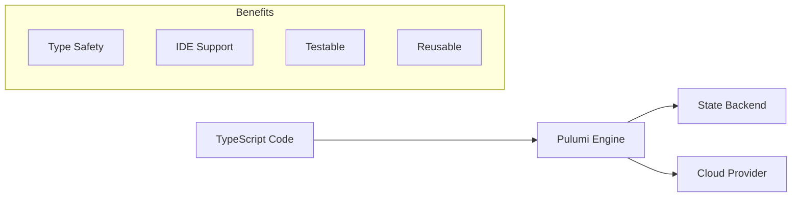
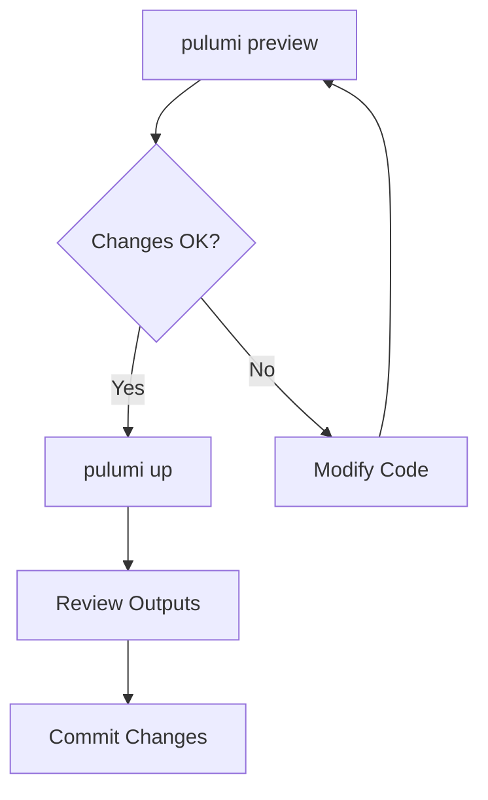

# How to Use Pulumi with TypeScript

Author: [nawazdhandala](https://www.github.com/nawazdhandala)

Tags: Pulumi, TypeScript, IaC, Infrastructure as Code, DevOps, AWS, Cloud, Automation

Description: A practical guide to building and managing cloud infrastructure using Pulumi with TypeScript. Learn how to set up projects, create resources, manage state, and implement best practices for type-safe infrastructure as code.

---

Infrastructure as code (IaC) has become essential for managing cloud resources, but writing YAML or HCL can feel limiting when you come from a programming background. Pulumi lets you define infrastructure using real programming languages like TypeScript, giving you loops, conditionals, type checking, and your favorite IDE features.

## Why Pulumi with TypeScript?



TypeScript brings several advantages to infrastructure:

1. **Type safety** - Catch configuration errors before deployment
2. **IDE support** - Autocomplete, inline docs, refactoring tools
3. **Familiar patterns** - Use classes, functions, and modules you already know
4. **Testing** - Unit test your infrastructure with standard testing frameworks
5. **Package ecosystem** - Share and reuse infrastructure components via npm

## Getting Started

### Install Pulumi CLI

```bash
# macOS
brew install pulumi/tap/pulumi

# Linux
curl -fsSL https://get.pulumi.com | sh

# Windows (PowerShell)
choco install pulumi

# Verify installation
pulumi version
```

### Create Your First Project

```bash
# Create a new directory and initialize
mkdir my-infrastructure && cd my-infrastructure

# Create a new Pulumi project with TypeScript
pulumi new aws-typescript

# This creates:
# - Pulumi.yaml (project configuration)
# - Pulumi.dev.yaml (stack configuration)
# - index.ts (main infrastructure code)
# - package.json (npm dependencies)
# - tsconfig.json (TypeScript configuration)
```

### Project Structure

```
my-infrastructure/
├── Pulumi.yaml           # Project name and runtime
├── Pulumi.dev.yaml       # Stack-specific config (dev environment)
├── Pulumi.prod.yaml      # Stack-specific config (prod environment)
├── index.ts              # Entry point
├── package.json
└── tsconfig.json
```

## Core Concepts

### Resources

Resources are the building blocks of your infrastructure. Each resource represents a cloud object like an S3 bucket, EC2 instance, or Lambda function.

```typescript
import * as pulumi from "@pulumi/pulumi";
import * as aws from "@pulumi/aws";

// Create an S3 bucket - the simplest resource
const bucket = new aws.s3.Bucket("my-bucket", {
    // Configuration options
    versioning: {
        enabled: true,
    },
    tags: {
        Environment: "dev",
        ManagedBy: "pulumi",
    },
});

// Export the bucket name so we can see it after deployment
export const bucketName = bucket.id;
```

### Outputs and Inputs

Pulumi uses a concept called "outputs" to handle values that are not known until deployment time (like generated IDs or ARNs).

```typescript
import * as pulumi from "@pulumi/pulumi";
import * as aws from "@pulumi/aws";

// Create a bucket
const bucket = new aws.s3.Bucket("data-bucket");

// bucket.arn is an Output<string>, not a plain string
// Use pulumi.interpolate to work with outputs in strings
const bucketPolicy = new aws.s3.BucketPolicy("bucket-policy", {
    bucket: bucket.id,
    policy: pulumi.interpolate`{
        "Version": "2012-10-17",
        "Statement": [{
            "Effect": "Allow",
            "Principal": "*",
            "Action": "s3:GetObject",
            "Resource": "${bucket.arn}/*"
        }]
    }`,
});

// Use apply() for complex transformations
const bucketInfo = bucket.arn.apply(arn => {
    return `Bucket ARN: ${arn}`;
});
```

### Stacks and Configuration

Stacks represent different environments (dev, staging, prod) of the same infrastructure.

```typescript
import * as pulumi from "@pulumi/pulumi";
import * as aws from "@pulumi/aws";

// Get stack-specific configuration
const config = new pulumi.Config();

// Retrieve values from Pulumi.dev.yaml or Pulumi.prod.yaml
const instanceType = config.get("instanceType") || "t3.micro";
const minSize = config.getNumber("minSize") || 1;
const maxSize = config.getNumber("maxSize") || 3;

// Use configuration in resources
const asg = new aws.autoscaling.Group("app-asg", {
    minSize: minSize,
    maxSize: maxSize,
    launchConfiguration: launchConfig.id,
    vpcZoneIdentifiers: subnetIds,
});
```

Set stack configuration:

```bash
# Set config for current stack
pulumi config set instanceType t3.large

# Set secret config (encrypted)
pulumi config set --secret databasePassword "super-secret-123"

# View config
pulumi config
```

## Building Real Infrastructure

Let me walk through a practical example - deploying a web application with a load balancer, auto-scaling group, and database.

### VPC and Networking

```typescript
import * as pulumi from "@pulumi/pulumi";
import * as aws from "@pulumi/aws";
import * as awsx from "@pulumi/awsx";

// Create a VPC with public and private subnets
// awsx provides higher-level components that simplify common patterns
const vpc = new awsx.ec2.Vpc("app-vpc", {
    cidrBlock: "10.0.0.0/16",
    numberOfAvailabilityZones: 2,
    subnetSpecs: [
        {
            type: awsx.ec2.SubnetType.Public,
            cidrMask: 24,
        },
        {
            type: awsx.ec2.SubnetType.Private,
            cidrMask: 24,
        },
    ],
    tags: {
        Name: "app-vpc",
    },
});

// Export VPC ID and subnet IDs for use in other stacks or verification
export const vpcId = vpc.vpcId;
export const publicSubnetIds = vpc.publicSubnetIds;
export const privateSubnetIds = vpc.privateSubnetIds;
```

### Security Groups

```typescript
// Security group for the load balancer - allows HTTP/HTTPS from anywhere
const albSecurityGroup = new aws.ec2.SecurityGroup("alb-sg", {
    vpcId: vpc.vpcId,
    description: "Allow inbound HTTP and HTTPS traffic",
    ingress: [
        {
            protocol: "tcp",
            fromPort: 80,
            toPort: 80,
            cidrBlocks: ["0.0.0.0/0"],
            description: "HTTP from anywhere",
        },
        {
            protocol: "tcp",
            fromPort: 443,
            toPort: 443,
            cidrBlocks: ["0.0.0.0/0"],
            description: "HTTPS from anywhere",
        },
    ],
    egress: [
        {
            protocol: "-1",
            fromPort: 0,
            toPort: 0,
            cidrBlocks: ["0.0.0.0/0"],
            description: "Allow all outbound",
        },
    ],
});

// Security group for app servers - only allows traffic from the ALB
const appSecurityGroup = new aws.ec2.SecurityGroup("app-sg", {
    vpcId: vpc.vpcId,
    description: "Allow inbound traffic from ALB only",
    ingress: [
        {
            protocol: "tcp",
            fromPort: 8080,
            toPort: 8080,
            securityGroups: [albSecurityGroup.id],
            description: "App port from ALB",
        },
    ],
    egress: [
        {
            protocol: "-1",
            fromPort: 0,
            toPort: 0,
            cidrBlocks: ["0.0.0.0/0"],
            description: "Allow all outbound",
        },
    ],
});
```

### Application Load Balancer

```typescript
// Create the Application Load Balancer
const alb = new aws.lb.LoadBalancer("app-alb", {
    loadBalancerType: "application",
    securityGroups: [albSecurityGroup.id],
    subnets: vpc.publicSubnetIds,
    tags: {
        Name: "app-alb",
    },
});

// Target group for our application
const targetGroup = new aws.lb.TargetGroup("app-tg", {
    port: 8080,
    protocol: "HTTP",
    vpcId: vpc.vpcId,
    targetType: "instance",
    healthCheck: {
        enabled: true,
        path: "/health",
        port: "8080",
        protocol: "HTTP",
        healthyThreshold: 2,
        unhealthyThreshold: 3,
        interval: 30,
        timeout: 5,
    },
});

// Listener for HTTP traffic
const httpListener = new aws.lb.Listener("http-listener", {
    loadBalancerArn: alb.arn,
    port: 80,
    protocol: "HTTP",
    defaultActions: [
        {
            type: "forward",
            targetGroupArn: targetGroup.arn,
        },
    ],
});

export const albDnsName = alb.dnsName;
```

### Auto Scaling Group

```typescript
const config = new pulumi.Config();
const instanceType = config.get("instanceType") || "t3.micro";

// Look up the latest Amazon Linux 2 AMI
const ami = aws.ec2.getAmi({
    mostRecent: true,
    owners: ["amazon"],
    filters: [
        {
            name: "name",
            values: ["amzn2-ami-hvm-*-x86_64-gp2"],
        },
    ],
});

// Launch template defines how instances are created
const launchTemplate = new aws.ec2.LaunchTemplate("app-lt", {
    imageId: ami.then(a => a.id),
    instanceType: instanceType,
    vpcSecurityGroupIds: [appSecurityGroup.id],
    userData: Buffer.from(`#!/bin/bash
        yum update -y
        yum install -y docker
        systemctl start docker
        systemctl enable docker
        docker run -d -p 8080:8080 my-app:latest
    `).toString("base64"),
    tagSpecifications: [
        {
            resourceType: "instance",
            tags: {
                Name: "app-instance",
            },
        },
    ],
});

// Auto Scaling Group manages the fleet of instances
const asg = new aws.autoscaling.Group("app-asg", {
    vpcZoneIdentifiers: vpc.privateSubnetIds,
    desiredCapacity: 2,
    minSize: 1,
    maxSize: 4,
    launchTemplate: {
        id: launchTemplate.id,
        version: "$Latest",
    },
    targetGroupArns: [targetGroup.arn],
    healthCheckType: "ELB",
    healthCheckGracePeriod: 300,
    tags: [
        {
            key: "Name",
            value: "app-instance",
            propagateAtLaunch: true,
        },
    ],
});

// Auto scaling policy based on CPU utilization
const scalingPolicy = new aws.autoscaling.Policy("cpu-scaling", {
    autoscalingGroupName: asg.name,
    policyType: "TargetTrackingScaling",
    targetTrackingConfiguration: {
        predefinedMetricSpecification: {
            predefinedMetricType: "ASGAverageCPUUtilization",
        },
        targetValue: 70.0,
    },
});
```

### RDS Database

```typescript
// Security group for the database
const dbSecurityGroup = new aws.ec2.SecurityGroup("db-sg", {
    vpcId: vpc.vpcId,
    description: "Allow PostgreSQL from app servers",
    ingress: [
        {
            protocol: "tcp",
            fromPort: 5432,
            toPort: 5432,
            securityGroups: [appSecurityGroup.id],
            description: "PostgreSQL from app",
        },
    ],
});

// Subnet group for RDS
const dbSubnetGroup = new aws.rds.SubnetGroup("db-subnet-group", {
    subnetIds: vpc.privateSubnetIds,
});

// Get database password from config (set with: pulumi config set --secret dbPassword xxx)
const dbPassword = config.requireSecret("dbPassword");

// Create the RDS instance
const database = new aws.rds.Instance("app-db", {
    engine: "postgres",
    engineVersion: "15.4",
    instanceClass: "db.t3.micro",
    allocatedStorage: 20,
    dbName: "appdb",
    username: "appuser",
    password: dbPassword,
    vpcSecurityGroupIds: [dbSecurityGroup.id],
    dbSubnetGroupName: dbSubnetGroup.name,
    skipFinalSnapshot: true, // Set to false in production
    multiAz: false, // Set to true in production
    tags: {
        Name: "app-db",
    },
});

export const dbEndpoint = database.endpoint;
```

## Component Resources

One of Pulumi's strengths is the ability to create reusable components. Here is how to build a custom component:

```typescript
import * as pulumi from "@pulumi/pulumi";
import * as aws from "@pulumi/aws";

// Define the args interface for type safety
interface StaticWebsiteArgs {
    indexDocument?: string;
    errorDocument?: string;
    domain?: string;
}

// Create a reusable component for static websites
class StaticWebsite extends pulumi.ComponentResource {
    public readonly bucketName: pulumi.Output<string>;
    public readonly websiteUrl: pulumi.Output<string>;

    constructor(
        name: string,
        args: StaticWebsiteArgs,
        opts?: pulumi.ComponentResourceOptions
    ) {
        // Register this component with Pulumi
        super("custom:resource:StaticWebsite", name, {}, opts);

        const indexDoc = args.indexDocument || "index.html";
        const errorDoc = args.errorDocument || "error.html";

        // Create S3 bucket for hosting
        const bucket = new aws.s3.Bucket(
            `${name}-bucket`,
            {
                website: {
                    indexDocument: indexDoc,
                    errorDocument: errorDoc,
                },
            },
            { parent: this } // Important: set parent for proper resource hierarchy
        );

        // Configure bucket for public access
        const publicAccessBlock = new aws.s3.BucketPublicAccessBlock(
            `${name}-public-access`,
            {
                bucket: bucket.id,
                blockPublicAcls: false,
                blockPublicPolicy: false,
                ignorePublicAcls: false,
                restrictPublicBuckets: false,
            },
            { parent: this }
        );

        // Bucket policy for public read access
        const bucketPolicy = new aws.s3.BucketPolicy(
            `${name}-policy`,
            {
                bucket: bucket.id,
                policy: pulumi.interpolate`{
                    "Version": "2012-10-17",
                    "Statement": [{
                        "Sid": "PublicReadGetObject",
                        "Effect": "Allow",
                        "Principal": "*",
                        "Action": "s3:GetObject",
                        "Resource": "${bucket.arn}/*"
                    }]
                }`,
            },
            { parent: this, dependsOn: [publicAccessBlock] }
        );

        // Set outputs
        this.bucketName = bucket.id;
        this.websiteUrl = bucket.websiteEndpoint;

        // Register outputs
        this.registerOutputs({
            bucketName: this.bucketName,
            websiteUrl: this.websiteUrl,
        });
    }
}

// Use the component
const website = new StaticWebsite("my-site", {
    indexDocument: "index.html",
    errorDocument: "404.html",
});

export const siteUrl = website.websiteUrl;
```

## Testing Infrastructure

You can test Pulumi programs using standard testing frameworks like Mocha or Jest.

```typescript
// infra.test.ts
import * as pulumi from "@pulumi/pulumi";
import "mocha";
import * as assert from "assert";

// Mock Pulumi runtime for unit tests
pulumi.runtime.setMocks({
    newResource: function (args: pulumi.runtime.MockResourceArgs): {
        id: string;
        state: Record<string, any>;
    } {
        // Return mock values for each resource type
        return {
            id: `${args.name}-id`,
            state: {
                ...args.inputs,
                arn: `arn:aws:s3:::${args.name}`,
            },
        };
    },
    call: function (args: pulumi.runtime.MockCallArgs) {
        // Mock provider calls
        return args.inputs;
    },
});

describe("Infrastructure", function () {
    let infra: typeof import("./index");

    before(async function () {
        // Import the infrastructure code
        infra = await import("./index");
    });

    describe("S3 Bucket", function () {
        it("should have versioning enabled", function (done) {
            pulumi.all([infra.bucket.versioning]).apply(([versioning]) => {
                assert.strictEqual(versioning?.enabled, true);
                done();
            });
        });

        it("should have correct tags", function (done) {
            pulumi.all([infra.bucket.tags]).apply(([tags]) => {
                assert.strictEqual(tags?.Environment, "dev");
                assert.strictEqual(tags?.ManagedBy, "pulumi");
                done();
            });
        });
    });
});
```

Run tests:

```bash
# Install test dependencies
npm install --save-dev mocha @types/mocha ts-node

# Run tests
npx mocha --require ts-node/register "**/*.test.ts"
```

## State Management

Pulumi tracks state to know what resources exist and their current configuration.

### Backend Options

```bash
# Use Pulumi Cloud (default) - easiest to get started
pulumi login

# Use local file backend
pulumi login --local

# Use S3 backend
pulumi login s3://my-pulumi-state-bucket

# Use Azure Blob Storage
pulumi login azblob://my-container

# Use Google Cloud Storage
pulumi login gs://my-bucket
```

### State Commands

```bash
# View current state
pulumi stack export

# Import existing resources
pulumi import aws:s3/bucket:Bucket my-bucket my-existing-bucket-name

# Refresh state from actual cloud resources
pulumi refresh

# Delete a resource from state without destroying it
pulumi state delete urn:pulumi:dev::my-project::aws:s3/bucket:Bucket::my-bucket
```

## Deployment Workflow



### Common Commands

```bash
# Preview changes without applying
pulumi preview

# Apply changes
pulumi up

# Apply without confirmation prompt (for CI/CD)
pulumi up --yes

# Destroy all resources
pulumi destroy

# View outputs from the last deployment
pulumi stack output

# Switch between stacks
pulumi stack select prod

# List all stacks
pulumi stack ls
```

## Best Practices

### 1. Organize Code by Concern

```
infrastructure/
├── index.ts           # Entry point - composes modules
├── networking/
│   ├── vpc.ts
│   └── security-groups.ts
├── compute/
│   ├── asg.ts
│   └── launch-template.ts
├── database/
│   └── rds.ts
└── components/
    └── static-website.ts
```

### 2. Use Strict TypeScript Configuration

```json
{
    "compilerOptions": {
        "strict": true,
        "noImplicitAny": true,
        "noImplicitReturns": true,
        "noFallthroughCasesInSwitch": true,
        "forceConsistentCasingInFileNames": true
    }
}
```

### 3. Tag Everything

```typescript
const defaultTags = {
    Project: pulumi.getProject(),
    Stack: pulumi.getStack(),
    ManagedBy: "pulumi",
};

// Apply to resources
const bucket = new aws.s3.Bucket("data", {
    tags: {
        ...defaultTags,
        Name: "data-bucket",
    },
});
```

### 4. Use Stack References for Multi-Stack Projects

```typescript
// In the networking stack - export values
export const vpcId = vpc.vpcId;
export const privateSubnetIds = vpc.privateSubnetIds;

// In the application stack - import values
const networkStack = new pulumi.StackReference("org/networking/prod");
const vpcId = networkStack.getOutput("vpcId");
const subnetIds = networkStack.getOutput("privateSubnetIds");
```

### 5. Handle Secrets Properly

```typescript
// Never hardcode secrets
// Bad:
const password = "super-secret";

// Good - use config
const config = new pulumi.Config();
const password = config.requireSecret("dbPassword");

// The secret is encrypted in Pulumi.dev.yaml and decrypted only during deployment
```

## CI/CD Integration

Here is an example GitHub Actions workflow:

```yaml
name: Pulumi Deploy

on:
  push:
    branches:
      - main

jobs:
  deploy:
    runs-on: ubuntu-latest
    steps:
      - uses: actions/checkout@v4

      - name: Setup Node.js
        uses: actions/setup-node@v4
        with:
          node-version: '20'

      - name: Install dependencies
        run: npm ci

      - name: Configure AWS credentials
        uses: aws-actions/configure-aws-credentials@v4
        with:
          aws-access-key-id: ${{ secrets.AWS_ACCESS_KEY_ID }}
          aws-secret-access-key: ${{ secrets.AWS_SECRET_ACCESS_KEY }}
          aws-region: us-east-1

      - name: Pulumi preview
        uses: pulumi/actions@v5
        with:
          command: preview
          stack-name: prod
        env:
          PULUMI_ACCESS_TOKEN: ${{ secrets.PULUMI_ACCESS_TOKEN }}

      - name: Pulumi deploy
        uses: pulumi/actions@v5
        with:
          command: up
          stack-name: prod
        env:
          PULUMI_ACCESS_TOKEN: ${{ secrets.PULUMI_ACCESS_TOKEN }}
```

---

Pulumi with TypeScript gives you the full power of a programming language for infrastructure. You get compile-time checks, IDE support, and the ability to create abstractions that match your organization's needs. Start with simple resources, build up to components, and use stacks to manage multiple environments. The investment in learning Pulumi pays off in maintainable, testable infrastructure code.
