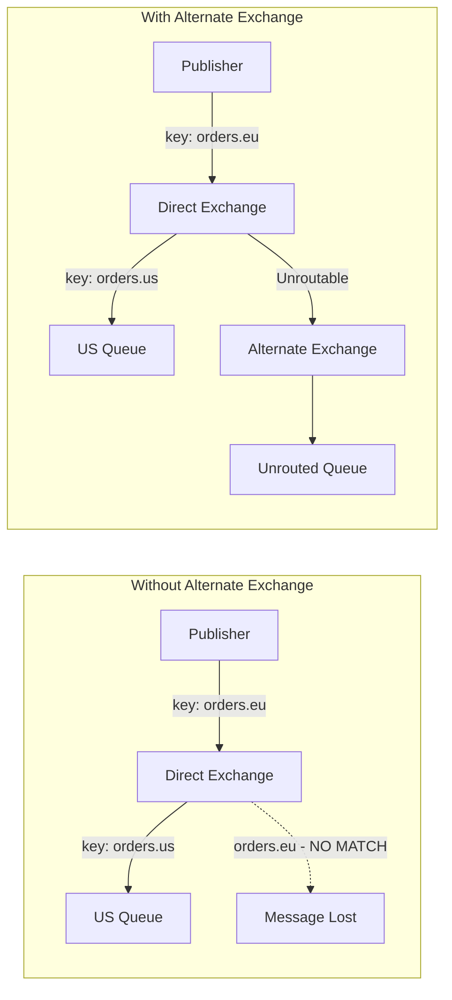

# How to Implement Alternate Exchanges in RabbitMQ

Author: [nawazdhandala](https://www.github.com/nawazdhandala)

Tags: RabbitMQ, Alternate Exchange, Message Routing, Error Handling, Message Queues, DevOps

Description: Learn how to implement alternate exchanges in RabbitMQ to capture unroutable messages and prevent message loss in complex routing scenarios.

---

When a message cannot be routed to any queue, it disappears by default. No error, no log, just gone. Alternate exchanges catch these unroutable messages, giving you visibility into routing failures and preventing silent data loss.

## The Unroutable Message Problem

Messages become unroutable when:

- No queue is bound to the exchange with a matching routing key
- The exchange exists but has no bindings
- A direct exchange receives a routing key that does not match any binding



## Setting Up an Alternate Exchange

### Declare Exchange with Alternate Exchange

```python
import pika
import json

def setup_with_alternate_exchange():
    connection = pika.BlockingConnection(
        pika.ConnectionParameters('localhost')
    )
    channel = connection.channel()

    # Step 1: Create the alternate exchange (usually fanout)
    channel.exchange_declare(
        exchange='unrouted',
        exchange_type='fanout',
        durable=True
    )

    # Step 2: Create queue for unrouted messages
    channel.queue_declare(queue='unrouted_messages', durable=True)
    channel.queue_bind(exchange='unrouted', queue='unrouted_messages')

    # Step 3: Create main exchange with alternate-exchange argument
    channel.exchange_declare(
        exchange='orders',
        exchange_type='direct',
        durable=True,
        arguments={
            'alternate-exchange': 'unrouted'
        }
    )

    # Step 4: Create and bind a queue
    channel.queue_declare(queue='orders_us', durable=True)
    channel.queue_bind(exchange='orders', queue='orders_us', routing_key='orders.us')

    print("Exchange with alternate exchange configured")
    connection.close()

setup_with_alternate_exchange()
```

### Node.js Implementation

```javascript
const amqp = require('amqplib');

async function setupAlternateExchange() {
    const connection = await amqp.connect('amqp://localhost');
    const channel = await connection.createChannel();

    // Create alternate exchange
    await channel.assertExchange('unrouted', 'fanout', { durable: true });

    // Create unrouted messages queue
    await channel.assertQueue('unrouted_messages', { durable: true });
    await channel.bindQueue('unrouted_messages', 'unrouted', '');

    // Create main exchange with alternate-exchange
    await channel.assertExchange('orders', 'direct', {
        durable: true,
        arguments: {
            'alternate-exchange': 'unrouted'
        }
    });

    // Create and bind queue
    await channel.assertQueue('orders_us', { durable: true });
    await channel.bindQueue('orders_us', 'orders', 'orders.us');

    console.log('Alternate exchange configured');
    await connection.close();
}

setupAlternateExchange();
```

## Testing Unroutable Message Capture

```python
def test_alternate_exchange():
    connection = pika.BlockingConnection(
        pika.ConnectionParameters('localhost')
    )
    channel = connection.channel()

    # This message WILL be routed (key matches binding)
    channel.basic_publish(
        exchange='orders',
        routing_key='orders.us',
        body=json.dumps({'order_id': '123', 'region': 'us'})
    )
    print("Published to orders.us - should be routed")

    # This message will NOT be routed (no matching binding)
    # Without alternate exchange, it would be lost
    channel.basic_publish(
        exchange='orders',
        routing_key='orders.eu',  # No queue bound with this key
        body=json.dumps({'order_id': '456', 'region': 'eu'})
    )
    print("Published to orders.eu - should go to alternate exchange")

    connection.close()

test_alternate_exchange()
```

## Processing Unrouted Messages

Monitor and analyze messages that failed to route:

```python
import pika
import json
from datetime import datetime

def process_unrouted_messages():
    connection = pika.BlockingConnection(
        pika.ConnectionParameters('localhost')
    )
    channel = connection.channel()

    def callback(ch, method, properties, body):
        message = json.loads(body)

        # Log the unrouted message
        print(f"Unrouted message detected!")
        print(f"  Original routing key: {method.routing_key}")
        print(f"  Exchange: {method.exchange}")
        print(f"  Message: {message}")

        # You could:
        # 1. Log to monitoring system
        # 2. Alert operators
        # 3. Retry with correct routing
        # 4. Store for later analysis

        # Example: Log to file
        log_entry = {
            'timestamp': datetime.utcnow().isoformat(),
            'routing_key': method.routing_key,
            'exchange': method.exchange,
            'message': message
        }

        with open('unrouted_messages.log', 'a') as f:
            f.write(json.dumps(log_entry) + '\n')

        ch.basic_ack(delivery_tag=method.delivery_tag)

    channel.basic_consume(
        queue='unrouted_messages',
        on_message_callback=callback
    )

    print("Monitoring unrouted messages...")
    channel.start_consuming()

process_unrouted_messages()
```

## Alternate Exchange Patterns

### Pattern 1: Catch-All for Direct Exchange

```python
def setup_catchall_direct():
    """Direct exchange with catch-all for unknown routing keys"""
    channel.exchange_declare(
        exchange='notifications',
        exchange_type='direct',
        arguments={'alternate-exchange': 'notifications.unrouted'}
    )

    # Known routes
    channel.queue_bind(exchange='notifications', queue='email', routing_key='email')
    channel.queue_bind(exchange='notifications', queue='sms', routing_key='sms')
    channel.queue_bind(exchange='notifications', queue='push', routing_key='push')

    # Unknown notification types go to alternate exchange
```

### Pattern 2: Topic Exchange Fallback

```python
def setup_topic_with_fallback():
    """Topic exchange with fallback for unmatched patterns"""

    # Alternate exchange catches messages that don't match any topic
    channel.exchange_declare(exchange='events.unmatched', exchange_type='fanout')
    channel.queue_declare(queue='unmatched_events')
    channel.queue_bind(exchange='events.unmatched', queue='unmatched_events')

    # Main topic exchange
    channel.exchange_declare(
        exchange='events',
        exchange_type='topic',
        arguments={'alternate-exchange': 'events.unmatched'}
    )

    # Specific topic bindings
    channel.queue_bind(exchange='events', queue='order_events', routing_key='order.#')
    channel.queue_bind(exchange='events', queue='user_events', routing_key='user.#')

    # Messages with other topics (e.g., 'payment.created') go to unmatched
```

### Pattern 3: Multi-Tenant Fallback

```python
def setup_multi_tenant_fallback():
    """Each tenant has their own queue, unknown tenants caught by fallback"""

    # Fallback for unknown tenants
    channel.exchange_declare(exchange='tenant.unknown', exchange_type='fanout')
    channel.queue_declare(queue='unknown_tenant_messages')
    channel.queue_bind(exchange='tenant.unknown', queue='unknown_tenant_messages')

    # Main routing exchange
    channel.exchange_declare(
        exchange='tenant.router',
        exchange_type='direct',
        arguments={'alternate-exchange': 'tenant.unknown'}
    )

    # Known tenants
    tenants = ['acme', 'globex', 'initech']
    for tenant in tenants:
        channel.queue_declare(queue=f'tenant.{tenant}')
        channel.queue_bind(
            exchange='tenant.router',
            queue=f'tenant.{tenant}',
            routing_key=tenant
        )

    # Messages for unknown tenants go to fallback
```

### Pattern 4: Retry with Alternate Exchange

```python
def setup_retry_with_ae():
    """Use alternate exchange for messages that exceed retry attempts"""

    # Dead letter exchange for exhausted retries
    channel.exchange_declare(exchange='dlx.exhausted', exchange_type='fanout')
    channel.queue_declare(queue='failed_permanently')
    channel.queue_bind(exchange='dlx.exhausted', queue='failed_permanently')

    # Main processing exchange
    channel.exchange_declare(
        exchange='processing',
        exchange_type='direct',
        arguments={'alternate-exchange': 'dlx.exhausted'}
    )

    # Create queues for different retry attempts
    for attempt in range(1, 4):  # retry_1, retry_2, retry_3
        channel.queue_bind(
            exchange='processing',
            queue=f'retry_{attempt}',
            routing_key=f'retry.{attempt}'
        )

    # After retry.3, there's no binding, so messages go to dlx.exhausted
```

## Using Policy for Alternate Exchange

Apply alternate exchange to existing exchanges via policy:

```bash
# Set alternate exchange for all exchanges matching pattern
rabbitmqctl set_policy AE "^orders\\." \
  '{"alternate-exchange": "unrouted"}' \
  --apply-to exchanges

# List policies
rabbitmqctl list_policies
```

### Python Policy Management

```python
def set_alternate_exchange_policy(admin, pattern, alternate_exchange):
    """Set alternate exchange via policy"""
    url = f"{admin.base_url}/policies/%2F/ae-{pattern.replace('.', '-')}"

    policy = {
        "pattern": pattern,
        "definition": {
            "alternate-exchange": alternate_exchange
        },
        "apply-to": "exchanges",
        "priority": 0
    }

    response = requests.put(url, json=policy, auth=admin.auth)
    return response.status_code in [201, 204]
```

## Monitoring Unrouted Messages

### Alert on High Unrouted Rate

```python
import time

def monitor_unrouted_rate(host, user, password, threshold=10, interval=60):
    """Alert if too many messages are being unrouted"""

    last_count = 0

    while True:
        # Get current queue depth
        response = requests.get(
            f'http://{host}:15672/api/queues/%2F/unrouted_messages',
            auth=(user, password)
        )
        data = response.json()
        current_count = data.get('messages', 0)

        # Calculate rate
        messages_per_minute = current_count - last_count

        if messages_per_minute > threshold:
            print(f"ALERT: {messages_per_minute} unrouted messages in last minute!")
            # Send alert to monitoring system

        last_count = current_count
        time.sleep(interval)
```

### Prometheus Metrics

```yaml
# Alert rule for unrouted messages
- alert: HighUnroutedMessageRate
  expr: rate(rabbitmq_queue_messages_published_total{queue="unrouted_messages"}[5m]) > 1
  for: 5m
  labels:
    severity: warning
  annotations:
    summary: "High rate of unrouted messages"
    description: "{{ $value }} unrouted messages per second"
```

## Alternate Exchange vs Mandatory Flag

Two approaches to handle unroutable messages:

| Feature | Alternate Exchange | Mandatory Flag |
|---------|-------------------|----------------|
| Where handled | Server-side | Client-side |
| Message destination | Another exchange | Returned to publisher |
| Requires client code | No | Yes |
| Works with confirms | Yes | Yes |
| Persistence | Can be persistent | Must republish |

### When to Use Each

**Alternate Exchange:**
- Central handling of routing failures
- No client changes needed
- Store-and-forward pattern

**Mandatory Flag:**
- Publisher needs immediate feedback
- Dynamic routing decisions
- Retry with different routing key

## Best Practices

1. **Always set up alternate exchanges**: Prevents silent message loss
2. **Use fanout for alternate exchange**: Captures all unrouted messages
3. **Monitor unrouted queue**: High volume indicates routing issues
4. **Analyze unrouted messages**: Find patterns, fix bindings
5. **Set TTL on unrouted queue**: Prevent unbounded growth
6. **Document expected routes**: Know what should route where

## Troubleshooting

### Check Alternate Exchange Configuration

```bash
# View exchange details including alternate-exchange
rabbitmqctl list_exchanges name type arguments | grep orders
```

### Verify Bindings

```bash
# List bindings for an exchange
rabbitmqctl list_bindings source destination_name routing_key | grep orders
```

### Test Routing

```python
def test_routing(exchange, routing_key):
    """Test if a routing key will match any binding"""
    # Use the tracing plugin or publish with mandatory=true
    pass
```

## Conclusion

Alternate exchanges are a simple but powerful way to prevent message loss. Configure them for all your exchanges, monitor the unrouted queue, and investigate when messages show up there. The visibility into routing failures helps you catch configuration errors before they cause data loss in production.
