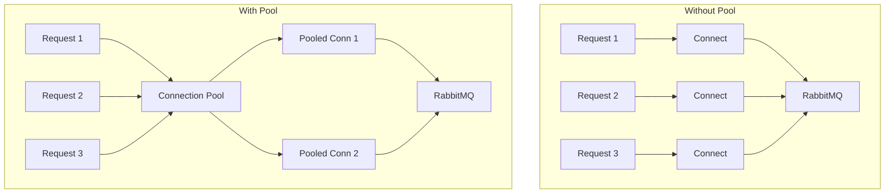

# How to Configure Connection Pooling for RabbitMQ

Author: [nawazdhandala](https://www.github.com/nawazdhandala)

Tags: RabbitMQ, Connection Pooling, Performance, Resource Management, Message Queues, DevOps

Description: Learn how to implement connection pooling for RabbitMQ to improve performance, reduce resource usage, and build resilient messaging applications.

---

Opening a new connection to RabbitMQ for every operation is expensive. Each connection involves TCP handshake, TLS negotiation (if enabled), and AMQP protocol handshake. Connection pooling reuses connections across operations, dramatically improving performance and reducing load on the broker.

## Why Connection Pooling Matters

Without pooling:
- Each publish/consume creates a new connection
- Connection overhead adds latency (50-200ms)
- Too many connections exhaust broker resources
- File descriptor limits reached quickly

With pooling:
- Connections are reused across operations
- Near-zero connection overhead
- Predictable resource usage
- Better throughput and lower latency



## Python Connection Pool Implementation

### Basic Connection Pool

```python
import pika
from queue import Queue, Empty
from threading import Lock
import time

class RabbitMQConnectionPool:
    def __init__(self, host='localhost', port=5672, username='guest',
                 password='guest', vhost='/', pool_size=10, timeout=30):
        self.host = host
        self.port = port
        self.username = username
        self.password = password
        self.vhost = vhost
        self.pool_size = pool_size
        self.timeout = timeout

        self._pool = Queue(maxsize=pool_size)
        self._lock = Lock()
        self._created = 0

    def _create_connection(self):
        """Create a new RabbitMQ connection"""
        credentials = pika.PlainCredentials(self.username, self.password)
        parameters = pika.ConnectionParameters(
            host=self.host,
            port=self.port,
            virtual_host=self.vhost,
            credentials=credentials,
            heartbeat=600,
            blocked_connection_timeout=300
        )
        return pika.BlockingConnection(parameters)

    def get_connection(self):
        """Get a connection from the pool or create a new one"""
        try:
            # Try to get from pool
            connection = self._pool.get_nowait()

            # Verify connection is still valid
            if connection.is_open:
                return connection
            else:
                # Connection died, don't count it
                with self._lock:
                    self._created -= 1

        except Empty:
            pass

        # Create new connection if pool not at capacity
        with self._lock:
            if self._created < self.pool_size:
                self._created += 1
                return self._create_connection()

        # Pool at capacity, wait for available connection
        try:
            connection = self._pool.get(timeout=self.timeout)
            if connection.is_open:
                return connection
            else:
                with self._lock:
                    self._created -= 1
                return self._create_connection()
        except Empty:
            raise Exception("Connection pool timeout")

    def release_connection(self, connection):
        """Return a connection to the pool"""
        if connection.is_open:
            try:
                self._pool.put_nowait(connection)
            except:
                # Pool full, close connection
                connection.close()
                with self._lock:
                    self._created -= 1
        else:
            with self._lock:
                self._created -= 1

    def close_all(self):
        """Close all connections in the pool"""
        while not self._pool.empty():
            try:
                connection = self._pool.get_nowait()
                if connection.is_open:
                    connection.close()
            except Empty:
                break

        with self._lock:
            self._created = 0


# Context manager for automatic release
class PooledConnection:
    def __init__(self, pool):
        self.pool = pool
        self.connection = None

    def __enter__(self):
        self.connection = self.pool.get_connection()
        return self.connection

    def __exit__(self, exc_type, exc_val, exc_tb):
        if self.connection:
            self.pool.release_connection(self.connection)


# Usage
pool = RabbitMQConnectionPool(host='localhost', pool_size=10)

def publish_message(message):
    with PooledConnection(pool) as connection:
        channel = connection.channel()
        channel.basic_publish(
            exchange='',
            routing_key='my_queue',
            body=message
        )

# Publish many messages reusing connections
for i in range(1000):
    publish_message(f"Message {i}")

pool.close_all()
```

### Thread-Safe Channel Pool

For higher performance, pool channels instead of connections:

```python
import pika
from queue import Queue, Empty
from threading import Lock, Thread
import time

class RabbitMQChannelPool:
    def __init__(self, host='localhost', pool_size=10, channels_per_connection=10):
        self.host = host
        self.pool_size = pool_size
        self.channels_per_connection = channels_per_connection

        self._connections = []
        self._channel_pool = Queue()
        self._lock = Lock()

        # Pre-create connections and channels
        self._initialize_pool()

    def _create_connection(self):
        """Create a connection with heartbeat"""
        parameters = pika.ConnectionParameters(
            host=self.host,
            heartbeat=600,
            blocked_connection_timeout=300
        )
        return pika.BlockingConnection(parameters)

    def _initialize_pool(self):
        """Pre-create connections and channels"""
        for _ in range(self.pool_size):
            connection = self._create_connection()
            self._connections.append(connection)

            for _ in range(self.channels_per_connection):
                channel = connection.channel()
                self._channel_pool.put((connection, channel))

    def get_channel(self, timeout=30):
        """Get a channel from the pool"""
        try:
            connection, channel = self._channel_pool.get(timeout=timeout)

            # Verify channel is usable
            if connection.is_open and channel.is_open:
                return connection, channel

            # Channel or connection died, create new one
            return self._create_new_channel()

        except Empty:
            raise Exception("Channel pool exhausted")

    def _create_new_channel(self):
        """Create a new channel on an existing connection"""
        with self._lock:
            for connection in self._connections:
                if connection.is_open:
                    try:
                        channel = connection.channel()
                        return connection, channel
                    except:
                        continue

            # All connections dead, create new one
            connection = self._create_connection()
            self._connections.append(connection)
            channel = connection.channel()
            return connection, channel

    def release_channel(self, connection, channel):
        """Return a channel to the pool"""
        if connection.is_open and channel.is_open:
            try:
                self._channel_pool.put_nowait((connection, channel))
            except:
                pass  # Pool full, let it be garbage collected

    def close_all(self):
        """Close all connections"""
        for connection in self._connections:
            try:
                connection.close()
            except:
                pass
        self._connections.clear()


# Usage with context manager
class PooledChannel:
    def __init__(self, pool):
        self.pool = pool
        self.connection = None
        self.channel = None

    def __enter__(self):
        self.connection, self.channel = self.pool.get_channel()
        return self.channel

    def __exit__(self, exc_type, exc_val, exc_tb):
        if self.connection and self.channel:
            self.pool.release_channel(self.connection, self.channel)


# Example usage
pool = RabbitMQChannelPool(host='localhost', pool_size=5, channels_per_connection=20)

def publish(message):
    with PooledChannel(pool) as channel:
        channel.basic_publish(exchange='', routing_key='tasks', body=message)

# Thread-safe publishing
threads = []
for i in range(100):
    t = Thread(target=publish, args=(f"Message {i}",))
    threads.append(t)
    t.start()

for t in threads:
    t.join()

pool.close_all()
```

## Node.js Connection Pool

### Using amqp-connection-manager

```javascript
const amqp = require('amqp-connection-manager');

// Create connection manager (handles reconnection automatically)
const connection = amqp.connect(['amqp://localhost'], {
    heartbeatIntervalInSeconds: 60,
    reconnectTimeInSeconds: 5
});

connection.on('connect', () => console.log('Connected to RabbitMQ'));
connection.on('disconnect', (err) => console.log('Disconnected:', err.message));

// Create channel wrapper (pooled automatically)
const channelWrapper = connection.createChannel({
    json: true,
    setup: async (channel) => {
        // Setup runs each time channel is created/recreated
        await channel.assertQueue('tasks', { durable: true });
        await channel.prefetch(10);
    }
});

// Publish with automatic retry
async function publish(message) {
    await channelWrapper.sendToQueue('tasks', message, {
        persistent: true
    });
}

// Consume
async function startConsumer() {
    await channelWrapper.consume('tasks', (msg) => {
        console.log('Received:', msg.content.toString());
        channelWrapper.ack(msg);
    });
}

// Usage
async function main() {
    await startConsumer();

    for (let i = 0; i < 1000; i++) {
        await publish({ id: i, data: 'test' });
    }
}

main().catch(console.error);
```

### Custom Pool Implementation

```javascript
const amqp = require('amqplib');

class RabbitMQPool {
    constructor(url, poolSize = 10) {
        this.url = url;
        this.poolSize = poolSize;
        this.connections = [];
        this.available = [];
        this.waiting = [];
        this.initialized = false;
    }

    async initialize() {
        for (let i = 0; i < this.poolSize; i++) {
            const connection = await amqp.connect(this.url);
            this.connections.push(connection);
            this.available.push(connection);
        }
        this.initialized = true;
    }

    async getConnection() {
        if (!this.initialized) {
            await this.initialize();
        }

        if (this.available.length > 0) {
            return this.available.pop();
        }

        // Wait for available connection
        return new Promise((resolve) => {
            this.waiting.push(resolve);
        });
    }

    releaseConnection(connection) {
        if (this.waiting.length > 0) {
            const resolve = this.waiting.shift();
            resolve(connection);
        } else {
            this.available.push(connection);
        }
    }

    async withConnection(callback) {
        const connection = await this.getConnection();
        try {
            return await callback(connection);
        } finally {
            this.releaseConnection(connection);
        }
    }

    async closeAll() {
        for (const connection of this.connections) {
            await connection.close();
        }
        this.connections = [];
        this.available = [];
    }
}

// Usage
const pool = new RabbitMQPool('amqp://localhost', 10);

async function publishMessage(message) {
    await pool.withConnection(async (connection) => {
        const channel = await connection.createChannel();
        await channel.assertQueue('tasks', { durable: true });
        channel.sendToQueue('tasks', Buffer.from(JSON.stringify(message)));
        await channel.close();
    });
}

// Concurrent publishing
async function main() {
    const promises = [];
    for (let i = 0; i < 1000; i++) {
        promises.push(publishMessage({ id: i }));
    }
    await Promise.all(promises);
    await pool.closeAll();
}

main();
```

## Connection Pool Best Practices

### 1. Size the Pool Appropriately

```python
# Factors to consider:
# - Concurrent operations
# - Message throughput
# - Broker connection limits

# Rule of thumb: Start with 10, adjust based on metrics
pool = RabbitMQConnectionPool(pool_size=10)

# For high throughput: More connections, more channels
pool = RabbitMQConnectionPool(pool_size=20)
```

### 2. Handle Connection Failures

```python
class ResilientConnectionPool(RabbitMQConnectionPool):
    def get_connection(self, max_retries=3):
        for attempt in range(max_retries):
            try:
                connection = super().get_connection()
                if connection.is_open:
                    return connection
            except Exception as e:
                print(f"Connection attempt {attempt + 1} failed: {e}")
                time.sleep(1 * (attempt + 1))  # Backoff

        raise Exception("Failed to get connection after retries")
```

### 3. Implement Health Checks

```python
def health_check(pool):
    """Check pool health"""
    try:
        with PooledConnection(pool) as connection:
            channel = connection.channel()
            # Simple operation to verify connectivity
            channel.queue_declare(queue='health_check', passive=True)
            return True
    except Exception as e:
        print(f"Health check failed: {e}")
        return False
```

### 4. Monitor Pool Metrics

```python
class MonitoredConnectionPool(RabbitMQConnectionPool):
    def __init__(self, *args, **kwargs):
        super().__init__(*args, **kwargs)
        self.checkout_count = 0
        self.checkin_count = 0
        self.timeout_count = 0

    def get_connection(self):
        self.checkout_count += 1
        try:
            return super().get_connection()
        except Exception:
            self.timeout_count += 1
            raise

    def release_connection(self, connection):
        self.checkin_count += 1
        super().release_connection(connection)

    def get_stats(self):
        return {
            'pool_size': self.pool_size,
            'created': self._created,
            'available': self._pool.qsize(),
            'checkouts': self.checkout_count,
            'checkins': self.checkin_count,
            'timeouts': self.timeout_count
        }
```

### 5. Graceful Shutdown

```python
import atexit
import signal

pool = RabbitMQConnectionPool(pool_size=10)

def shutdown():
    print("Shutting down connection pool...")
    pool.close_all()

atexit.register(shutdown)
signal.signal(signal.SIGTERM, lambda *args: shutdown())
signal.signal(signal.SIGINT, lambda *args: shutdown())
```

## Connection vs Channel Pooling

| Aspect | Connection Pool | Channel Pool |
|--------|----------------|--------------|
| Overhead | Higher (TCP, TLS) | Lower (AMQP frame) |
| Isolation | Full isolation | Share connection resources |
| Max count | Limited by file descriptors | Many per connection |
| Use case | Multi-threaded apps | High-throughput single process |

Recommendation: Use channel pooling within connection pooling for best results.

## Broker-Side Configuration

Optimize RabbitMQ for pooled connections:

```ini
# /etc/rabbitmq/rabbitmq.conf

# Increase connection limit
# Default is 65535, adjust based on expected pool size * instances
listeners.tcp.default = 5672

# Tune TCP settings
tcp_listen_options.backlog = 128
tcp_listen_options.nodelay = true
tcp_listen_options.linger.on = true
tcp_listen_options.linger.timeout = 0

# Heartbeat interval (match client setting)
heartbeat = 60
```

## Conclusion

Connection pooling is essential for RabbitMQ applications with significant message throughput. Implement a pool that handles connection failures gracefully, monitor pool utilization, and size it appropriately for your workload. The investment in proper connection management pays off in lower latency, better throughput, and more reliable messaging.
