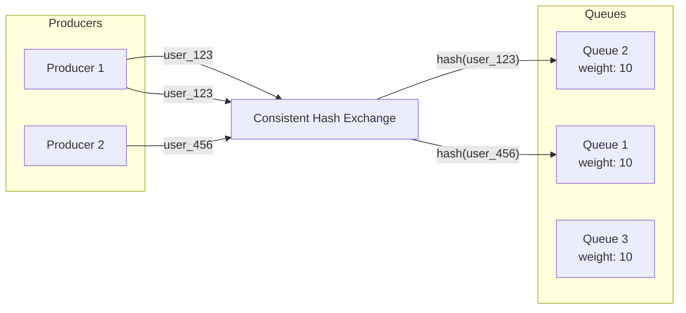

# How to Implement Consistent Hash Exchange in RabbitMQ

Author: [nawazdhandala](https://www.github.com/nawazdhandala)

Tags: RabbitMQ, Consistent Hash Exchange, Message Distribution, Load Balancing, Sharding, Message Queues

Description: Learn how to implement consistent hash exchange in RabbitMQ for deterministic message routing, ensuring related messages always go to the same queue for ordered processing.

---

When you need messages with the same key to always go to the same queue, consistent hash exchange is your solution. It uses a hash ring to deterministically route messages based on routing key or message header, ensuring that related messages (like all orders from the same customer) end up at the same consumer for ordered processing.

## Why Consistent Hash Exchange?

Standard exchanges distribute messages round-robin or based on exact routing key matches. But sometimes you need:

- All messages for a user processed by the same consumer (for ordering)
- Sharding across multiple queues for parallel processing
- Sticky routing that survives queue additions/removals



## Enabling the Plugin

The consistent hash exchange is a plugin that ships with RabbitMQ:

```bash
# Enable the plugin
rabbitmq-plugins enable rabbitmq_consistent_hash_exchange

# Verify it's enabled
rabbitmq-plugins list | grep consistent_hash

# Restart not required, but verify
rabbitmqctl status | grep consistent_hash
```

## Basic Setup

### Creating a Consistent Hash Exchange

```python
import pika

def setup_consistent_hash_exchange():
    connection = pika.BlockingConnection(
        pika.ConnectionParameters('localhost')
    )
    channel = connection.channel()

    # Declare the consistent hash exchange
    channel.exchange_declare(
        exchange='user_events',
        exchange_type='x-consistent-hash',  # Special type for this plugin
        durable=True
    )

    # Create multiple queues for sharding
    for i in range(4):
        queue_name = f'user_events_shard_{i}'
        channel.queue_declare(queue=queue_name, durable=True)

        # Bind with a weight (as routing key)
        # Higher weight = more messages routed to this queue
        channel.queue_bind(
            exchange='user_events',
            queue=queue_name,
            routing_key='10'  # Weight of 10
        )

    print("Consistent hash exchange configured with 4 shards")
    connection.close()

setup_consistent_hash_exchange()
```

### Node.js Setup

```javascript
const amqp = require('amqplib');

async function setupConsistentHashExchange() {
    const connection = await amqp.connect('amqp://localhost');
    const channel = await connection.createChannel();

    // Declare consistent hash exchange
    await channel.assertExchange('user_events', 'x-consistent-hash', {
        durable: true
    });

    // Create sharded queues
    for (let i = 0; i < 4; i++) {
        const queueName = `user_events_shard_${i}`;
        await channel.assertQueue(queueName, { durable: true });

        // Bind with weight as routing key
        await channel.bindQueue(queueName, 'user_events', '10');
    }

    console.log('Consistent hash exchange configured');
    await connection.close();
}

setupConsistentHashExchange();
```

## Publishing Messages

The routing key becomes the hash key. Messages with the same routing key always go to the same queue.

### Python Publisher

```python
import pika
import json

def publish_user_event(user_id, event_type, event_data):
    connection = pika.BlockingConnection(
        pika.ConnectionParameters('localhost')
    )
    channel = connection.channel()

    message = {
        'user_id': user_id,
        'event_type': event_type,
        'data': event_data
    }

    # Use user_id as routing key
    # All events for this user go to the same queue
    channel.basic_publish(
        exchange='user_events',
        routing_key=user_id,  # This is hashed to determine the queue
        body=json.dumps(message),
        properties=pika.BasicProperties(delivery_mode=2)
    )

    print(f"Published {event_type} for user {user_id}")
    connection.close()

# All these go to the same shard (same user_id)
publish_user_event('user_123', 'login', {'ip': '1.2.3.4'})
publish_user_event('user_123', 'purchase', {'amount': 99.99})
publish_user_event('user_123', 'logout', {})

# This goes to potentially different shard (different user_id)
publish_user_event('user_456', 'login', {'ip': '5.6.7.8'})
```

### Node.js Publisher

```javascript
const amqp = require('amqplib');

async function publishUserEvent(userId, eventType, eventData) {
    const connection = await amqp.connect('amqp://localhost');
    const channel = await connection.createChannel();

    const message = {
        userId: userId,
        eventType: eventType,
        data: eventData
    };

    // Use userId as routing key for consistent hashing
    channel.publish(
        'user_events',
        userId,  // Hash key
        Buffer.from(JSON.stringify(message)),
        { persistent: true }
    );

    console.log(`Published ${eventType} for user ${userId}`);
    await connection.close();
}

// All events for user_123 go to the same queue
await publishUserEvent('user_123', 'login', { ip: '1.2.3.4' });
await publishUserEvent('user_123', 'purchase', { amount: 99.99 });
```

## Hash on Message Header

Instead of routing key, you can hash on a message header:

```python
def setup_header_hash_exchange():
    connection = pika.BlockingConnection(
        pika.ConnectionParameters('localhost')
    )
    channel = connection.channel()

    # Create exchange with hash-header argument
    channel.exchange_declare(
        exchange='orders',
        exchange_type='x-consistent-hash',
        durable=True,
        arguments={
            'hash-header': 'customer_id'  # Hash on this header
        }
    )

    # Bind queues
    for i in range(4):
        channel.queue_bind(
            exchange='orders',
            queue=f'orders_shard_{i}',
            routing_key='10'
        )

    connection.close()

def publish_order(order_id, customer_id, amount):
    connection = pika.BlockingConnection(
        pika.ConnectionParameters('localhost')
    )
    channel = connection.channel()

    channel.basic_publish(
        exchange='orders',
        routing_key='',  # Ignored when using hash-header
        body=json.dumps({'order_id': order_id, 'amount': amount}),
        properties=pika.BasicProperties(
            delivery_mode=2,
            headers={
                'customer_id': customer_id  # This is hashed
            }
        )
    )

    connection.close()
```

## Hash on Message Property

Hash on standard message properties like message_id or correlation_id:

```python
# Hash on correlation_id
channel.exchange_declare(
    exchange='requests',
    exchange_type='x-consistent-hash',
    durable=True,
    arguments={
        'hash-property': 'correlation_id'
    }
)

# Publish with correlation_id
channel.basic_publish(
    exchange='requests',
    routing_key='',
    body='request data',
    properties=pika.BasicProperties(
        correlation_id='session_abc123'  # Hashed for routing
    )
)
```

## Weight-Based Distribution

Binding weights control the proportion of messages each queue receives:

```python
def setup_weighted_distribution():
    connection = pika.BlockingConnection(
        pika.ConnectionParameters('localhost')
    )
    channel = connection.channel()

    channel.exchange_declare(
        exchange='weighted',
        exchange_type='x-consistent-hash',
        durable=True
    )

    # High capacity queue gets more messages
    channel.queue_bind(
        exchange='weighted',
        queue='high_capacity',
        routing_key='30'  # Weight 30
    )

    # Low capacity queue gets fewer messages
    channel.queue_bind(
        exchange='weighted',
        queue='low_capacity',
        routing_key='10'  # Weight 10
    )

    # high_capacity will receive ~75% of messages
    # low_capacity will receive ~25% of messages

    connection.close()
```

## Adding/Removing Queues

When you add or remove queues, consistent hashing minimizes message redistribution:

```python
def add_shard(exchange_name, queue_name, weight='10'):
    """Add a new shard to the consistent hash exchange"""
    connection = pika.BlockingConnection(
        pika.ConnectionParameters('localhost')
    )
    channel = connection.channel()

    # Create new queue
    channel.queue_declare(queue=queue_name, durable=True)

    # Bind to exchange
    channel.queue_bind(
        exchange=exchange_name,
        queue=queue_name,
        routing_key=weight
    )

    print(f"Added shard {queue_name} with weight {weight}")
    # Only ~1/N of existing keys will be redistributed
    # where N is the new number of queues

    connection.close()

def remove_shard(exchange_name, queue_name):
    """Remove a shard from the consistent hash exchange"""
    connection = pika.BlockingConnection(
        pika.ConnectionParameters('localhost')
    )
    channel = connection.channel()

    # Unbind from exchange
    channel.queue_unbind(
        exchange=exchange_name,
        queue=queue_name
    )

    # Optionally delete the queue
    # channel.queue_delete(queue=queue_name)

    print(f"Removed shard {queue_name}")
    # Messages that were going to this queue will redistribute
    # to remaining queues

    connection.close()
```

## Consumer Implementation

Each consumer processes messages from one shard:

```python
import pika
import json
from threading import Thread

class ShardConsumer:
    def __init__(self, queue_name):
        self.queue_name = queue_name
        self.connection = None
        self.channel = None

    def connect(self):
        self.connection = pika.BlockingConnection(
            pika.ConnectionParameters('localhost')
        )
        self.channel = self.connection.channel()
        self.channel.basic_qos(prefetch_count=10)

    def process_message(self, ch, method, properties, body):
        message = json.loads(body)
        user_id = message.get('user_id')

        print(f"[{self.queue_name}] Processing event for user {user_id}")

        # Process the message
        # Messages for the same user always come to this consumer
        # So you can maintain per-user state safely

        ch.basic_ack(delivery_tag=method.delivery_tag)

    def start(self):
        self.connect()
        self.channel.basic_consume(
            queue=self.queue_name,
            on_message_callback=self.process_message
        )
        print(f"Consumer started for {self.queue_name}")
        self.channel.start_consuming()

# Start consumers for each shard
consumers = []
for i in range(4):
    consumer = ShardConsumer(f'user_events_shard_{i}')
    thread = Thread(target=consumer.start)
    thread.daemon = True
    thread.start()
    consumers.append(consumer)

# Keep main thread alive
import time
while True:
    time.sleep(1)
```

## Use Cases

### 1. User Event Ordering

Ensure all events for a user are processed in order:

```python
# Hash on user_id ensures ordering per user
channel.basic_publish(
    exchange='user_events',
    routing_key=user_id,
    body=json.dumps(event)
)
```

### 2. Session Affinity

Keep all requests for a session on the same worker:

```python
# Hash on session_id
channel.exchange_declare(
    exchange='session_requests',
    exchange_type='x-consistent-hash',
    arguments={'hash-header': 'session_id'}
)
```

### 3. Database Sharding

Route writes to the correct database shard:

```python
# Hash on entity_id to determine shard
channel.basic_publish(
    exchange='db_writes',
    routing_key=entity_id,
    body=json.dumps(write_operation)
)
```

### 4. Aggregation by Key

Aggregate data for the same key on the same worker:

```python
# Hash on aggregation_key
channel.basic_publish(
    exchange='aggregations',
    routing_key=aggregation_key,
    body=json.dumps({'value': 42})
)
```

## Monitoring Distribution

Check how messages are distributed across shards:

```python
import requests
from requests.auth import HTTPBasicAuth

def check_distribution(exchange_name, shard_prefix):
    """Check message distribution across shards"""

    response = requests.get(
        'http://localhost:15672/api/queues',
        auth=HTTPBasicAuth('admin', 'password')
    )
    queues = response.json()

    shards = [q for q in queues if q['name'].startswith(shard_prefix)]

    total_messages = sum(q.get('messages', 0) for q in shards)

    print(f"Distribution for {exchange_name}:")
    for shard in shards:
        messages = shard.get('messages', 0)
        rate = shard.get('messages_details', {}).get('rate', 0)
        percent = (messages / total_messages * 100) if total_messages > 0 else 0
        print(f"  {shard['name']}: {messages} ({percent:.1f}%) @ {rate:.1f}/s")

check_distribution('user_events', 'user_events_shard_')
```

## Best Practices

1. **Use meaningful hash keys**: User ID, session ID, or entity ID
2. **Start with equal weights**: Adjust based on observed distribution
3. **Monitor shard balance**: Alert on significant imbalance
4. **Plan for growth**: Adding shards is easy, data redistribution is minimal
5. **Test hash distribution**: Verify keys distribute evenly
6. **Consider hash key cardinality**: Low cardinality leads to hotspots

## Troubleshooting

### Uneven Distribution

If distribution is skewed:

```python
# Check if keys have low cardinality
# Few unique keys = uneven distribution
# Solution: Use higher cardinality keys or combine keys

routing_key = f"{user_id}:{action_type}"  # More unique keys
```

### Messages Not Routing

Verify exchange type and bindings:

```bash
# Check exchange type
rabbitmqctl list_exchanges name type | grep user_events

# Check bindings
rabbitmqctl list_bindings source_name destination_name routing_key | grep user_events
```

## Conclusion

Consistent hash exchange provides deterministic message routing based on hash keys. It ensures related messages always reach the same consumer, enabling ordered processing and stateful aggregation. Use it when message affinity matters, and monitor distribution to ensure balanced load across your shards.
