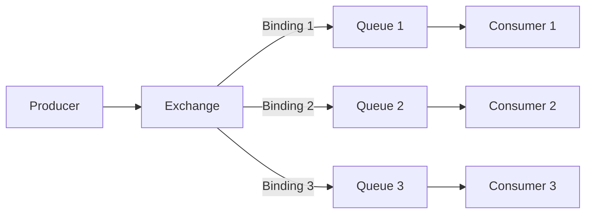
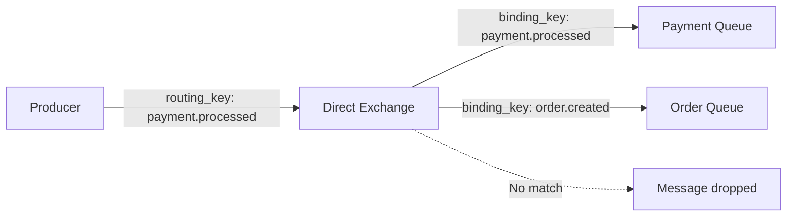
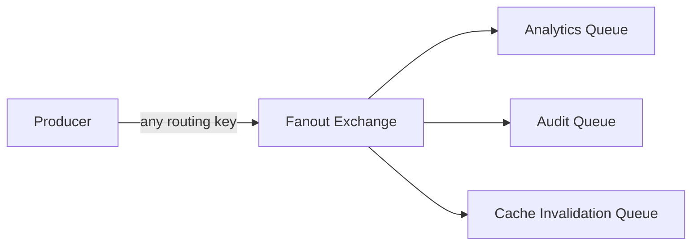
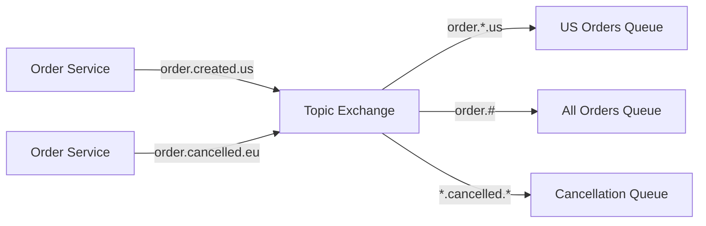
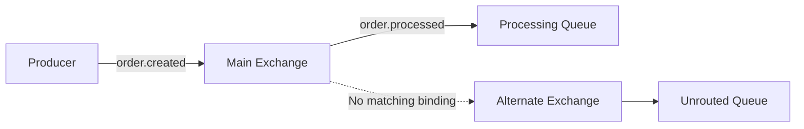
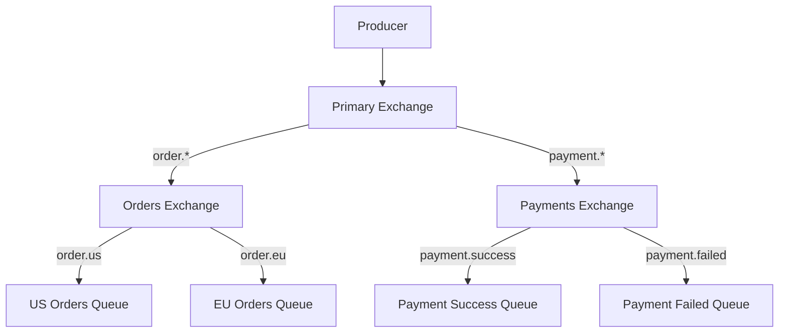
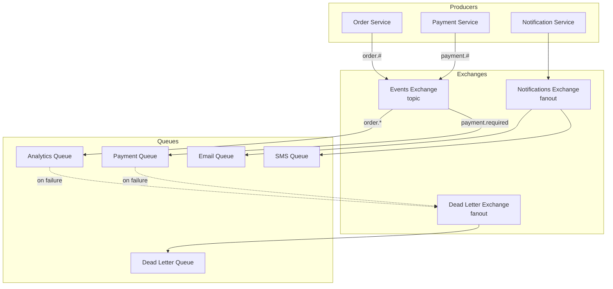

# How to Use RabbitMQ Exchanges Effectively

Author: [nawazdhandala](https://www.github.com/nawazdhandala)

Tags: RabbitMQ, Message Queues, Exchanges, Microservices, Distributed Systems, Messaging Patterns, Event-Driven

Description: A comprehensive guide to understanding and using RabbitMQ exchanges for efficient message routing in distributed systems.

---

RabbitMQ exchanges are the routing backbone of your messaging system. They receive messages from producers and determine which queues should receive those messages based on routing rules. Understanding how to use exchanges effectively can make the difference between a well-architected system and a tangled mess of message flows.

## Understanding the Exchange Model

Before diving into exchange types, let's understand how messages flow through RabbitMQ.



The exchange sits between producers and queues. Producers never send messages directly to queues. Instead, they send messages to exchanges, which then route messages to zero or more queues based on bindings and routing keys.

## The Four Exchange Types

RabbitMQ provides four built-in exchange types, each serving different routing needs.

### 1. Direct Exchange

Direct exchanges route messages to queues where the binding key exactly matches the routing key. This is the simplest and most commonly used exchange type.



Here's a practical example using Node.js with the amqplib library:

```javascript
// direct-exchange-example.js
const amqp = require('amqplib');

async function setupDirectExchange() {
    // Establish connection to RabbitMQ server
    const connection = await amqp.connect('amqp://localhost');
    const channel = await connection.createChannel();

    // Declare a direct exchange named 'notifications'
    // durable: true ensures the exchange survives broker restarts
    const exchangeName = 'notifications';
    await channel.assertExchange(exchangeName, 'direct', { durable: true });

    // Declare queues for different notification types
    // Each queue handles a specific category of notifications
    const emailQueue = await channel.assertQueue('email_notifications', { durable: true });
    const smsQueue = await channel.assertQueue('sms_notifications', { durable: true });
    const pushQueue = await channel.assertQueue('push_notifications', { durable: true });

    // Bind queues to the exchange with specific routing keys
    // Messages with routing key 'email' go to email_notifications queue
    await channel.bindQueue(emailQueue.queue, exchangeName, 'email');
    await channel.bindQueue(smsQueue.queue, exchangeName, 'sms');
    await channel.bindQueue(pushQueue.queue, exchangeName, 'push');

    // Publish a notification that should go to the email queue
    const notification = {
        userId: 'user_123',
        subject: 'Order Confirmation',
        body: 'Your order #456 has been confirmed'
    };

    // The routing key 'email' ensures this message reaches email_notifications queue
    channel.publish(
        exchangeName,
        'email',  // routing key matches the binding key exactly
        Buffer.from(JSON.stringify(notification)),
        { persistent: true }  // message survives broker restarts
    );

    console.log('Email notification sent');

    // Clean up
    await channel.close();
    await connection.close();
}

setupDirectExchange().catch(console.error);
```

**When to use direct exchanges:**
- Task queues where specific workers handle specific task types
- Notification routing based on channel (email, SMS, push)
- Log level routing (error logs to one queue, info logs to another)

### 2. Fanout Exchange

Fanout exchanges broadcast messages to all bound queues, ignoring routing keys entirely. Every queue bound to a fanout exchange receives every message.



```javascript
// fanout-exchange-example.js
const amqp = require('amqplib');

async function setupFanoutExchange() {
    const connection = await amqp.connect('amqp://localhost');
    const channel = await connection.createChannel();

    // Fanout exchanges are perfect for broadcasting events
    // that multiple services need to react to
    const exchangeName = 'user.events';
    await channel.assertExchange(exchangeName, 'fanout', { durable: true });

    // Multiple services subscribe to user events
    // Each service has its own queue but receives all events
    const analyticsQueue = await channel.assertQueue('analytics_user_events', { durable: true });
    const auditQueue = await channel.assertQueue('audit_user_events', { durable: true });
    const cacheQueue = await channel.assertQueue('cache_invalidation', { durable: true });

    // With fanout exchanges, the binding key is ignored
    // so we can use an empty string
    await channel.bindQueue(analyticsQueue.queue, exchangeName, '');
    await channel.bindQueue(auditQueue.queue, exchangeName, '');
    await channel.bindQueue(cacheQueue.queue, exchangeName, '');

    // When a user updates their profile, all services need to know
    const userEvent = {
        eventType: 'profile.updated',
        userId: 'user_789',
        changes: {
            email: 'new@email.com',
            displayName: 'New Name'
        },
        timestamp: new Date().toISOString()
    };

    // Routing key is ignored for fanout exchanges
    // but we include it for documentation purposes
    channel.publish(
        exchangeName,
        '',  // routing key doesn't matter for fanout
        Buffer.from(JSON.stringify(userEvent)),
        { persistent: true }
    );

    console.log('User event broadcast to all subscribers');

    await channel.close();
    await connection.close();
}

setupFanoutExchange().catch(console.error);
```

**When to use fanout exchanges:**
- Broadcasting events to multiple services (microservices architecture)
- Real-time notifications to all connected clients
- Cache invalidation across multiple cache servers
- Audit logging where every action needs to be recorded

### 3. Topic Exchange

Topic exchanges provide flexible routing based on pattern matching. Routing keys are dot-separated words, and bindings can use wildcards:
- `*` matches exactly one word
- `#` matches zero or more words



```javascript
// topic-exchange-example.js
const amqp = require('amqplib');

async function setupTopicExchange() {
    const connection = await amqp.connect('amqp://localhost');
    const channel = await connection.createChannel();

    // Topic exchanges are ideal for complex routing scenarios
    // where messages need to reach different queues based on patterns
    const exchangeName = 'orders';
    await channel.assertExchange(exchangeName, 'topic', { durable: true });

    // Queue for processing orders from US region only
    const usOrdersQueue = await channel.assertQueue('us_orders', { durable: true });
    // Queue that receives all order events for analytics
    const allOrdersQueue = await channel.assertQueue('all_orders_analytics', { durable: true });
    // Queue specifically for handling cancellations
    const cancellationsQueue = await channel.assertQueue('cancellations', { durable: true });
    // Queue for high-value orders that need priority handling
    const priorityQueue = await channel.assertQueue('priority_orders', { durable: true });

    // Binding patterns:
    // order.*.us - matches order.created.us, order.shipped.us, etc.
    await channel.bindQueue(usOrdersQueue.queue, exchangeName, 'order.*.us');

    // order.# - matches anything starting with 'order.'
    // This includes order.created, order.created.us, order.shipped.eu.premium
    await channel.bindQueue(allOrdersQueue.queue, exchangeName, 'order.#');

    // *.cancelled.* - matches any.cancelled.any
    await channel.bindQueue(cancellationsQueue.queue, exchangeName, '*.cancelled.*');

    // order.*.*.premium - matches orders with premium flag in any region
    await channel.bindQueue(priorityQueue.queue, exchangeName, 'order.*.*.premium');

    // Publish different order events
    const orderCreatedUS = {
        orderId: 'ord_001',
        amount: 150.00,
        region: 'us',
        status: 'created'
    };

    // This message goes to: us_orders, all_orders_analytics
    channel.publish(
        exchangeName,
        'order.created.us',  // matches order.*.us and order.#
        Buffer.from(JSON.stringify(orderCreatedUS)),
        { persistent: true }
    );

    const orderCancelledEU = {
        orderId: 'ord_002',
        reason: 'customer_request',
        region: 'eu'
    };

    // This message goes to: all_orders_analytics, cancellations
    channel.publish(
        exchangeName,
        'order.cancelled.eu',  // matches order.# and *.cancelled.*
        Buffer.from(JSON.stringify(orderCancelledEU)),
        { persistent: true }
    );

    const premiumOrderUS = {
        orderId: 'ord_003',
        amount: 5000.00,
        region: 'us',
        tier: 'premium'
    };

    // This message goes to: us_orders, all_orders_analytics, priority_orders
    channel.publish(
        exchangeName,
        'order.created.us.premium',  // matches multiple patterns
        Buffer.from(JSON.stringify(premiumOrderUS)),
        { persistent: true }
    );

    console.log('Order events published with topic routing');

    await channel.close();
    await connection.close();
}

setupTopicExchange().catch(console.error);
```

**When to use topic exchanges:**
- Multi-tenant applications where messages are routed by tenant ID
- Geographic routing (messages routed by region)
- Log aggregation with multiple severity levels and sources
- Event-driven architectures with hierarchical event types

### 4. Headers Exchange

Headers exchanges route messages based on message header attributes rather than routing keys. This provides the most flexible routing but at a performance cost.

```javascript
// headers-exchange-example.js
const amqp = require('amqplib');

async function setupHeadersExchange() {
    const connection = await amqp.connect('amqp://localhost');
    const channel = await connection.createChannel();

    // Headers exchanges route based on message attributes
    // useful when routing logic is too complex for routing keys
    const exchangeName = 'document.processing';
    await channel.assertExchange(exchangeName, 'headers', { durable: true });

    // Queue for PDF documents requiring OCR
    const ocrQueue = await channel.assertQueue('ocr_processing', { durable: true });
    // Queue for image resizing
    const imageQueue = await channel.assertQueue('image_processing', { durable: true });
    // Queue for virus scanning (all documents)
    const scanQueue = await channel.assertQueue('virus_scanning', { durable: true });

    // Bind with header matching criteria
    // 'x-match': 'all' means ALL specified headers must match
    // 'x-match': 'any' means ANY of the specified headers must match

    // Match documents that are PDFs AND need OCR
    await channel.bindQueue(ocrQueue.queue, exchangeName, '', {
        'x-match': 'all',
        'content-type': 'application/pdf',
        'requires-ocr': 'true'
    });

    // Match any image format
    await channel.bindQueue(imageQueue.queue, exchangeName, '', {
        'x-match': 'any',
        'content-type': 'image/jpeg',
        'content-type': 'image/png',  // Note: only last value is used
        'format': 'image'  // Use this pattern for multiple values
    });

    // Match all documents for virus scanning
    await channel.bindQueue(scanQueue.queue, exchangeName, '', {
        'x-match': 'any',
        'scan-required': 'true'
    });

    // Publish a PDF document that needs OCR
    const pdfDocument = {
        documentId: 'doc_123',
        filename: 'invoice.pdf',
        uploadedBy: 'user_456'
    };

    channel.publish(
        exchangeName,
        '',  // routing key ignored for headers exchange
        Buffer.from(JSON.stringify(pdfDocument)),
        {
            persistent: true,
            headers: {
                'content-type': 'application/pdf',
                'requires-ocr': 'true',
                'scan-required': 'true'
            }
        }
    );

    console.log('Document published with header-based routing');

    await channel.close();
    await connection.close();
}

setupHeadersExchange().catch(console.error);
```

**When to use headers exchanges:**
- Routing based on multiple message attributes
- Complex routing logic that cannot be expressed with routing keys
- When routing criteria might change frequently (headers are more flexible)

## Exchange Configuration Best Practices

### Durability Settings

```javascript
// exchange-durability.js
const amqp = require('amqplib');

async function configureExchangeDurability() {
    const connection = await amqp.connect('amqp://localhost');
    const channel = await connection.createChannel();

    // DURABLE EXCHANGE: Survives broker restarts
    // Use for production workloads where message delivery is critical
    await channel.assertExchange('orders.production', 'direct', {
        durable: true,      // Exchange definition survives restart
        autoDelete: false   // Don't delete when last queue unbinds
    });

    // TRANSIENT EXCHANGE: Lost on broker restart
    // Use for temporary or development purposes
    await channel.assertExchange('temp.notifications', 'fanout', {
        durable: false,     // Exchange lost on restart
        autoDelete: true    // Delete when no queues are bound
    });

    // INTERNAL EXCHANGE: Can only receive messages from other exchanges
    // Used for exchange-to-exchange bindings (covered later)
    await channel.assertExchange('internal.routing', 'topic', {
        durable: true,
        internal: true      // Cannot publish directly, only via other exchanges
    });

    await channel.close();
    await connection.close();
}
```

### Setting Up Alternate Exchanges

Alternate exchanges catch messages that would otherwise be unroutable. This prevents message loss when no queue bindings match.



```javascript
// alternate-exchange-setup.js
const amqp = require('amqplib');

async function setupAlternateExchange() {
    const connection = await amqp.connect('amqp://localhost');
    const channel = await connection.createChannel();

    // First, create the alternate exchange
    // This will catch any messages that can't be routed
    const alternateExchangeName = 'unrouted.messages';
    await channel.assertExchange(alternateExchangeName, 'fanout', {
        durable: true
    });

    // Create a queue to collect unrouted messages
    const unroutedQueue = await channel.assertQueue('unrouted_queue', {
        durable: true
    });
    await channel.bindQueue(unroutedQueue.queue, alternateExchangeName, '');

    // Now create the main exchange with the alternate exchange configured
    const mainExchangeName = 'orders.main';
    await channel.assertExchange(mainExchangeName, 'direct', {
        durable: true,
        alternateExchange: alternateExchangeName  // Specify alternate exchange
    });

    // Bind only specific routing keys
    const orderQueue = await channel.assertQueue('order_processing', { durable: true });
    await channel.bindQueue(orderQueue.queue, mainExchangeName, 'order.new');
    await channel.bindQueue(orderQueue.queue, mainExchangeName, 'order.update');

    // This message will be routed to order_processing queue
    channel.publish(mainExchangeName, 'order.new', Buffer.from('{"orderId": "123"}'));

    // This message has no matching binding, so it goes to unrouted_queue
    // Without an alternate exchange, this message would be silently dropped
    channel.publish(mainExchangeName, 'order.unknown', Buffer.from('{"orderId": "456"}'));

    console.log('Messages published - check unrouted_queue for unroutable messages');

    await channel.close();
    await connection.close();
}

setupAlternateExchange().catch(console.error);
```

## Exchange-to-Exchange Bindings

RabbitMQ allows you to bind exchanges to other exchanges, enabling complex routing topologies.



```javascript
// exchange-to-exchange-binding.js
const amqp = require('amqplib');

async function setupExchangeToExchangeBindings() {
    const connection = await amqp.connect('amqp://localhost');
    const channel = await connection.createChannel();

    // Create a primary exchange that receives all events
    const primaryExchange = 'events.primary';
    await channel.assertExchange(primaryExchange, 'topic', { durable: true });

    // Create specialized exchanges for different domains
    const ordersExchange = 'events.orders';
    const paymentsExchange = 'events.payments';

    await channel.assertExchange(ordersExchange, 'direct', { durable: true });
    await channel.assertExchange(paymentsExchange, 'direct', { durable: true });

    // Bind specialized exchanges to the primary exchange
    // This creates a hierarchical routing structure
    await channel.bindExchange(ordersExchange, primaryExchange, 'order.#');
    await channel.bindExchange(paymentsExchange, primaryExchange, 'payment.#');

    // Create queues and bind to specialized exchanges
    const usOrdersQueue = await channel.assertQueue('us_orders', { durable: true });
    const euOrdersQueue = await channel.assertQueue('eu_orders', { durable: true });

    // These bindings use direct exchange semantics
    await channel.bindQueue(usOrdersQueue.queue, ordersExchange, 'order.us');
    await channel.bindQueue(euOrdersQueue.queue, ordersExchange, 'order.eu');

    // Publish to primary exchange - message flows through the hierarchy
    // Primary (topic) -> Orders (direct) -> US Orders Queue
    channel.publish(
        primaryExchange,
        'order.us',  // Matches 'order.#' binding to orders exchange
        Buffer.from('{"orderId": "us_123"}')
    );

    console.log('Message routed through exchange hierarchy');

    await channel.close();
    await connection.close();
}

setupExchangeToExchangeBindings().catch(console.error);
```

## Handling Publisher Confirms

When message delivery is critical, use publisher confirms to ensure messages reach the exchange.

```javascript
// publisher-confirms.js
const amqp = require('amqplib');

async function publishWithConfirms() {
    const connection = await amqp.connect('amqp://localhost');

    // Create a confirm channel instead of a regular channel
    const channel = await connection.createConfirmChannel();

    const exchangeName = 'critical.events';
    await channel.assertExchange(exchangeName, 'direct', { durable: true });

    const criticalQueue = await channel.assertQueue('critical_processing', { durable: true });
    await channel.bindQueue(criticalQueue.queue, exchangeName, 'critical');

    // Method 1: Using callbacks for individual message confirmation
    const message1 = { eventId: 'evt_001', data: 'critical data' };

    channel.publish(
        exchangeName,
        'critical',
        Buffer.from(JSON.stringify(message1)),
        { persistent: true },
        (err) => {
            if (err) {
                console.error('Message was not confirmed:', err);
                // Implement retry logic here
            } else {
                console.log('Message confirmed by broker');
            }
        }
    );

    // Method 2: Using waitForConfirms for batch confirmation
    const messages = [
        { eventId: 'evt_002', data: 'batch item 1' },
        { eventId: 'evt_003', data: 'batch item 2' },
        { eventId: 'evt_004', data: 'batch item 3' }
    ];

    // Publish all messages
    for (const msg of messages) {
        channel.publish(
            exchangeName,
            'critical',
            Buffer.from(JSON.stringify(msg)),
            { persistent: true }
        );
    }

    // Wait for all messages to be confirmed
    try {
        await channel.waitForConfirms();
        console.log('All messages in batch confirmed');
    } catch (err) {
        console.error('Some messages were not confirmed:', err);
        // Implement batch retry logic here
    }

    await channel.close();
    await connection.close();
}

publishWithConfirms().catch(console.error);
```

## Performance Considerations

### Exchange Type Performance Comparison

| Exchange Type | Routing Speed | Memory Usage | Use Case |
|---------------|---------------|--------------|----------|
| Direct | Fastest | Low | Simple key-based routing |
| Fanout | Very Fast | Low | Broadcasting to all queues |
| Topic | Moderate | Medium | Pattern-based routing |
| Headers | Slowest | Higher | Attribute-based routing |

### Optimizing Exchange Usage

```javascript
// exchange-optimization.js
const amqp = require('amqplib');

async function optimizedExchangeSetup() {
    const connection = await amqp.connect('amqp://localhost');
    const channel = await connection.createChannel();

    // TIP 1: Use direct exchanges when exact matching is sufficient
    // Avoid topic exchanges if you don't need wildcards
    await channel.assertExchange('simple.routing', 'direct', { durable: true });

    // TIP 2: Limit the number of bindings per exchange
    // Too many bindings slow down routing
    // Consider using exchange-to-exchange bindings to distribute load

    // TIP 3: Use lazy queues for queues that may accumulate messages
    const lazyQueue = await channel.assertQueue('high_volume_queue', {
        durable: true,
        arguments: {
            'x-queue-mode': 'lazy'  // Store messages on disk to reduce memory
        }
    });

    // TIP 4: Set appropriate prefetch counts for consumers
    // This prevents slow consumers from being overwhelmed
    await channel.prefetch(10);  // Process 10 messages at a time

    // TIP 5: Use message TTL to prevent queue buildup
    const ttlQueue = await channel.assertQueue('time_sensitive_queue', {
        durable: true,
        arguments: {
            'x-message-ttl': 60000  // Messages expire after 60 seconds
        }
    });

    console.log('Optimized exchange setup complete');

    await channel.close();
    await connection.close();
}

optimizedExchangeSetup().catch(console.error);
```

## Real-World Architecture Example

Here's a complete example of a microservices event system using multiple exchange types:



```javascript
// microservices-event-system.js
const amqp = require('amqplib');

async function setupMicroservicesEventSystem() {
    const connection = await amqp.connect('amqp://localhost');
    const channel = await connection.createChannel();

    // ========== DEAD LETTER EXCHANGE ==========
    // Set up dead letter infrastructure first
    const dlExchange = 'dead.letter';
    await channel.assertExchange(dlExchange, 'fanout', { durable: true });

    const dlQueue = await channel.assertQueue('dead_letter_queue', {
        durable: true,
        arguments: {
            'x-message-ttl': 86400000  // Keep failed messages for 24 hours
        }
    });
    await channel.bindQueue(dlQueue.queue, dlExchange, '');

    // ========== MAIN EVENTS EXCHANGE ==========
    // Topic exchange for all domain events
    const eventsExchange = 'domain.events';
    await channel.assertExchange(eventsExchange, 'topic', {
        durable: true,
        alternateExchange: dlExchange  // Catch unroutable messages
    });

    // Analytics queue - receives all events
    const analyticsQueue = await channel.assertQueue('analytics_events', {
        durable: true,
        arguments: {
            'x-dead-letter-exchange': dlExchange,
            'x-queue-mode': 'lazy'  // High volume, store on disk
        }
    });
    await channel.bindQueue(analyticsQueue.queue, eventsExchange, '#');

    // Order processing queue
    const orderQueue = await channel.assertQueue('order_processing', {
        durable: true,
        arguments: {
            'x-dead-letter-exchange': dlExchange
        }
    });
    await channel.bindQueue(orderQueue.queue, eventsExchange, 'order.*');

    // Payment processing queue
    const paymentQueue = await channel.assertQueue('payment_processing', {
        durable: true,
        arguments: {
            'x-dead-letter-exchange': dlExchange
        }
    });
    await channel.bindQueue(paymentQueue.queue, eventsExchange, 'payment.*');

    // ========== NOTIFICATIONS EXCHANGE ==========
    // Fanout exchange for broadcasting notifications
    const notificationsExchange = 'notifications.broadcast';
    await channel.assertExchange(notificationsExchange, 'fanout', { durable: true });

    const emailQueue = await channel.assertQueue('email_notifications', { durable: true });
    const smsQueue = await channel.assertQueue('sms_notifications', { durable: true });
    const pushQueue = await channel.assertQueue('push_notifications', { durable: true });

    await channel.bindQueue(emailQueue.queue, notificationsExchange, '');
    await channel.bindQueue(smsQueue.queue, notificationsExchange, '');
    await channel.bindQueue(pushQueue.queue, notificationsExchange, '');

    // ========== PUBLISH EXAMPLE EVENTS ==========

    // Order created event
    const orderCreated = {
        eventType: 'order.created',
        orderId: 'ord_789',
        customerId: 'cust_123',
        amount: 299.99,
        timestamp: new Date().toISOString()
    };

    channel.publish(
        eventsExchange,
        'order.created',
        Buffer.from(JSON.stringify(orderCreated)),
        {
            persistent: true,
            messageId: 'msg_' + Date.now(),
            timestamp: Date.now()
        }
    );

    // Payment completed event
    const paymentCompleted = {
        eventType: 'payment.completed',
        paymentId: 'pay_456',
        orderId: 'ord_789',
        amount: 299.99,
        timestamp: new Date().toISOString()
    };

    channel.publish(
        eventsExchange,
        'payment.completed',
        Buffer.from(JSON.stringify(paymentCompleted)),
        { persistent: true }
    );

    // Broadcast notification to all channels
    const notification = {
        type: 'order_confirmation',
        userId: 'cust_123',
        message: 'Your order #ord_789 has been confirmed!',
        timestamp: new Date().toISOString()
    };

    channel.publish(
        notificationsExchange,
        '',  // Routing key ignored for fanout
        Buffer.from(JSON.stringify(notification)),
        { persistent: true }
    );

    console.log('Microservices event system configured and test events published');

    await channel.close();
    await connection.close();
}

setupMicroservicesEventSystem().catch(console.error);
```

## Monitoring and Troubleshooting

Use the RabbitMQ management API to monitor exchange health:

```bash
# List all exchanges with their message rates
curl -u guest:guest http://localhost:15672/api/exchanges

# Get details for a specific exchange
curl -u guest:guest http://localhost:15672/api/exchanges/%2F/domain.events

# List bindings for an exchange
curl -u guest:guest http://localhost:15672/api/exchanges/%2F/domain.events/bindings/source
```

## Summary

Choosing the right exchange type and configuration is essential for building reliable message-driven systems:

1. **Direct exchanges** - Use for simple, exact-match routing scenarios
2. **Fanout exchanges** - Use for broadcasting to multiple consumers
3. **Topic exchanges** - Use for flexible pattern-based routing
4. **Headers exchanges** - Use when routing logic depends on message attributes

Always configure alternate exchanges to catch unroutable messages, use publisher confirms for critical messages, and leverage exchange-to-exchange bindings to build scalable routing topologies. Monitor your exchanges through the management API to catch routing issues before they impact your system.
