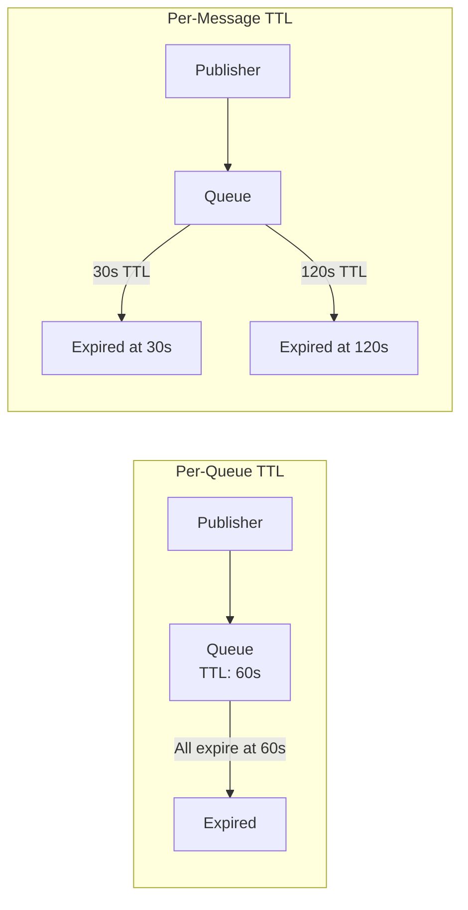

# How to Implement Message TTL in RabbitMQ

Author: [nawazdhandala](https://www.github.com/nawazdhandala)

Tags: RabbitMQ, Message TTL, Time-To-Live, Message Expiration, Message Queues, DevOps

Description: Learn how to implement message TTL in RabbitMQ to automatically expire messages, prevent queue buildup, and implement time-sensitive messaging patterns.

---

Messages do not live forever. A flash sale notification from last week is useless. A monitoring alert from an hour ago might be stale. Message TTL (Time-To-Live) lets you automatically expire messages that outlive their usefulness, preventing queue buildup and ensuring consumers only process relevant data.

## Two Types of TTL

RabbitMQ supports TTL at two levels:

1. **Per-queue TTL**: All messages in the queue expire after the same duration
2. **Per-message TTL**: Each message has its own expiration time



## Per-Queue TTL

Set a default TTL for all messages in a queue.

### Declaring Queue with TTL

```python
import pika

connection = pika.BlockingConnection(
    pika.ConnectionParameters('localhost')
)
channel = connection.channel()

# Create queue with 60-second TTL for all messages
channel.queue_declare(
    queue='notifications',
    durable=True,
    arguments={
        'x-message-ttl': 60000  # TTL in milliseconds
    }
)

print("Queue with 60s TTL created")
connection.close()
```

### Node.js Queue TTL

```javascript
const amqp = require('amqplib');

async function createQueueWithTTL() {
    const connection = await amqp.connect('amqp://localhost');
    const channel = await connection.createChannel();

    // Queue where messages expire after 60 seconds
    await channel.assertQueue('notifications', {
        durable: true,
        arguments: {
            'x-message-ttl': 60000  // 60 seconds
        }
    });

    console.log('Queue with TTL created');
    await connection.close();
}

createQueueWithTTL();
```

### Using Policy for TTL

Apply TTL to existing queues without recreating them:

```bash
# Set 5-minute TTL for all queues starting with "temp."
rabbitmqctl set_policy ttl-temp "^temp\\..*" \
  '{"message-ttl": 300000}' \
  --apply-to queues
```

## Per-Message TTL

Set TTL individually for each message.

### Python Per-Message TTL

```python
import pika
import json

def publish_with_ttl(message, ttl_ms):
    """Publish a message with a specific TTL"""

    connection = pika.BlockingConnection(
        pika.ConnectionParameters('localhost')
    )
    channel = connection.channel()

    channel.queue_declare(queue='tasks', durable=True)

    channel.basic_publish(
        exchange='',
        routing_key='tasks',
        body=json.dumps(message),
        properties=pika.BasicProperties(
            delivery_mode=2,  # Persistent
            expiration=str(ttl_ms)  # TTL as string in milliseconds
        )
    )

    print(f"Published message with {ttl_ms}ms TTL")
    connection.close()

# Different TTLs for different message types
publish_with_ttl({'type': 'urgent', 'data': 'act now'}, 30000)  # 30 seconds
publish_with_ttl({'type': 'normal', 'data': 'whenever'}, 3600000)  # 1 hour
publish_with_ttl({'type': 'batch', 'data': 'end of day'}, 86400000)  # 24 hours
```

### Node.js Per-Message TTL

```javascript
const amqp = require('amqplib');

async function publishWithTTL(message, ttlMs) {
    const connection = await amqp.connect('amqp://localhost');
    const channel = await connection.createChannel();

    await channel.assertQueue('tasks', { durable: true });

    channel.sendToQueue(
        'tasks',
        Buffer.from(JSON.stringify(message)),
        {
            persistent: true,
            expiration: ttlMs.toString()  // TTL as string
        }
    );

    console.log(`Published message with ${ttlMs}ms TTL`);
    await connection.close();
}

// Usage
publishWithTTL({ type: 'alert', message: 'Check system' }, 60000);
```

## TTL and Dead Letter Exchanges

Expired messages can be routed to a dead letter exchange instead of being discarded:

```python
import pika

connection = pika.BlockingConnection(
    pika.ConnectionParameters('localhost')
)
channel = connection.channel()

# Create dead letter exchange and queue
channel.exchange_declare(exchange='dlx', exchange_type='direct', durable=True)
channel.queue_declare(queue='expired_messages', durable=True)
channel.queue_bind(exchange='dlx', queue='expired_messages', routing_key='expired')

# Create main queue with TTL and dead lettering
channel.queue_declare(
    queue='time_sensitive',
    durable=True,
    arguments={
        'x-message-ttl': 60000,  # Messages expire after 60s
        'x-dead-letter-exchange': 'dlx',
        'x-dead-letter-routing-key': 'expired'
    }
)

print("Queue with TTL and DLX configured")
connection.close()
```

## Implementing Delayed Messages with TTL

Use TTL and dead lettering to create delayed delivery:

```python
def setup_delayed_delivery(channel, delay_ms):
    """Create a delay queue using TTL"""

    delay_queue = f'delay_{delay_ms}ms'

    # Target queue where messages arrive after delay
    channel.queue_declare(queue='delayed_tasks', durable=True)

    # Delay queue that dead-letters to target after TTL
    channel.queue_declare(
        queue=delay_queue,
        durable=True,
        arguments={
            'x-message-ttl': delay_ms,
            'x-dead-letter-exchange': '',  # Default exchange
            'x-dead-letter-routing-key': 'delayed_tasks'
        }
    )

    return delay_queue

def publish_delayed(channel, message, delay_ms):
    """Publish a message to be delivered after a delay"""

    delay_queue = f'delay_{delay_ms}ms'

    channel.basic_publish(
        exchange='',
        routing_key=delay_queue,
        body=json.dumps(message),
        properties=pika.BasicProperties(delivery_mode=2)
    )

    print(f"Message scheduled for delivery in {delay_ms}ms")

# Usage
channel = connection.channel()
setup_delayed_delivery(channel, 30000)  # 30-second delay queue
publish_delayed(channel, {'action': 'send_reminder'}, 30000)
```

## TTL Behavior and Gotchas

### Queue vs Message TTL Interaction

When both queue and message TTL are set, the lower value wins:

```python
# Queue has 60s TTL
channel.queue_declare(
    queue='mixed_ttl',
    arguments={'x-message-ttl': 60000}
)

# Message has 30s TTL - this message expires at 30s
channel.basic_publish(
    exchange='',
    routing_key='mixed_ttl',
    body='expires in 30s',
    properties=pika.BasicProperties(expiration='30000')
)

# Message has 120s TTL - but queue TTL wins, expires at 60s
channel.basic_publish(
    exchange='',
    routing_key='mixed_ttl',
    body='expires in 60s not 120s',
    properties=pika.BasicProperties(expiration='120000')
)
```

### Per-Message TTL Expiration Order

Messages with per-message TTL only expire when they reach the head of the queue:

```python
# Message A: 30s TTL, published first
# Message B: 5s TTL, published second

# Even though B's TTL is shorter, it won't expire until A is consumed or expires
# This is because expiration is checked only at queue head

# Solution: Use separate queues for different TTL ranges
# Or use queue-level TTL for predictable expiration
```

### Zero TTL

A TTL of 0 means the message expires immediately if not consumed:

```python
# Message will be dead-lettered or discarded immediately if queue is empty
channel.basic_publish(
    exchange='',
    routing_key='queue',
    body='instant expiration',
    properties=pika.BasicProperties(expiration='0')
)
```

## Real-World Patterns

### Pattern 1: Session Timeout

```python
class SessionManager:
    def __init__(self, channel, session_timeout_ms=1800000):  # 30 minutes
        self.channel = channel
        self.timeout = session_timeout_ms

        # Create session queue with TTL
        channel.queue_declare(
            queue='active_sessions',
            durable=True,
            arguments={
                'x-message-ttl': session_timeout_ms,
                'x-dead-letter-exchange': 'dlx',
                'x-dead-letter-routing-key': 'session.expired'
            }
        )

    def create_session(self, user_id, session_data):
        """Create a session that auto-expires"""
        self.channel.basic_publish(
            exchange='',
            routing_key='active_sessions',
            body=json.dumps({
                'user_id': user_id,
                'session_data': session_data,
                'created_at': datetime.utcnow().isoformat()
            }),
            properties=pika.BasicProperties(delivery_mode=2)
        )

    def extend_session(self, user_id, session_data):
        """Republish to reset TTL timer"""
        # Note: Original message still exists until consumed
        # For proper session extension, use external state store
        self.create_session(user_id, session_data)
```

### Pattern 2: Time-Limited Offers

```python
def publish_limited_offer(channel, offer, valid_duration_ms):
    """Publish an offer that expires after a duration"""

    channel.basic_publish(
        exchange='offers',
        routing_key='flash_sale',
        body=json.dumps({
            'offer': offer,
            'published_at': datetime.utcnow().isoformat(),
            'valid_for_ms': valid_duration_ms
        }),
        properties=pika.BasicProperties(
            delivery_mode=2,
            expiration=str(valid_duration_ms)
        )
    )

# Flash sale valid for 1 hour
publish_limited_offer(channel, {'discount': '50%', 'product': 'Widget'}, 3600000)
```

### Pattern 3: Retry with Backoff

```python
class RetryQueue:
    BACKOFF_DELAYS = [1000, 5000, 30000, 300000]  # 1s, 5s, 30s, 5m

    def __init__(self, channel, target_queue):
        self.channel = channel
        self.target_queue = target_queue

        # Create retry queues with different TTLs
        for delay in self.BACKOFF_DELAYS:
            queue_name = f'{target_queue}_retry_{delay}'
            channel.queue_declare(
                queue=queue_name,
                durable=True,
                arguments={
                    'x-message-ttl': delay,
                    'x-dead-letter-exchange': '',
                    'x-dead-letter-routing-key': target_queue
                }
            )

    def schedule_retry(self, message, attempt):
        """Schedule a retry with exponential backoff"""
        if attempt >= len(self.BACKOFF_DELAYS):
            print("Max retries exceeded")
            return False

        delay = self.BACKOFF_DELAYS[attempt]
        retry_queue = f'{self.target_queue}_retry_{delay}'

        self.channel.basic_publish(
            exchange='',
            routing_key=retry_queue,
            body=json.dumps({
                'original_message': message,
                'attempt': attempt + 1
            }),
            properties=pika.BasicProperties(delivery_mode=2)
        )

        print(f"Retry scheduled in {delay}ms (attempt {attempt + 1})")
        return True
```

## Monitoring TTL

### Check Queue TTL Settings

```bash
# View queue arguments including TTL
rabbitmqctl list_queues name arguments | grep message-ttl
```

### Track Expired Messages

```python
def monitor_expirations(host, user, password):
    """Monitor messages being dead-lettered due to TTL"""

    # Consume from dead letter queue
    connection = pika.BlockingConnection(pika.ConnectionParameters(host))
    channel = connection.channel()

    def on_expired(ch, method, properties, body):
        headers = properties.headers or {}
        x_death = headers.get('x-death', [])

        if x_death:
            death = x_death[0]
            if death.get('reason') == 'expired':
                original_queue = death.get('queue')
                print(f"Message expired from {original_queue}")
                # Log metrics, alert if necessary

        ch.basic_ack(delivery_tag=method.delivery_tag)

    channel.basic_consume(
        queue='expired_messages',
        on_message_callback=on_expired
    )

    channel.start_consuming()
```

### Prometheus Metrics

Track message expirations:

```yaml
# Alert on high expiration rate
- alert: HighMessageExpirationRate
  expr: rate(rabbitmq_queue_messages_expired_total[5m]) > 100
  for: 5m
  labels:
    severity: warning
  annotations:
    summary: "High message expiration rate"
```

## Best Practices

1. **Use queue TTL for uniform expiration**: Simpler and more predictable
2. **Use message TTL for varying requirements**: When messages have different urgency
3. **Always configure dead letter exchanges**: Capture expired messages for analysis
4. **Monitor expiration rates**: High rates may indicate consumer issues
5. **Consider message ordering**: Per-message TTL can cause out-of-order expiration
6. **Document TTL decisions**: Make it clear why specific values were chosen

## Conclusion

Message TTL prevents queues from growing unbounded and ensures consumers process timely data. Use queue-level TTL for consistent expiration, per-message TTL for varying requirements, and always pair TTL with dead letter exchanges to capture expired messages. Monitor expiration rates to catch issues before they impact your application.
