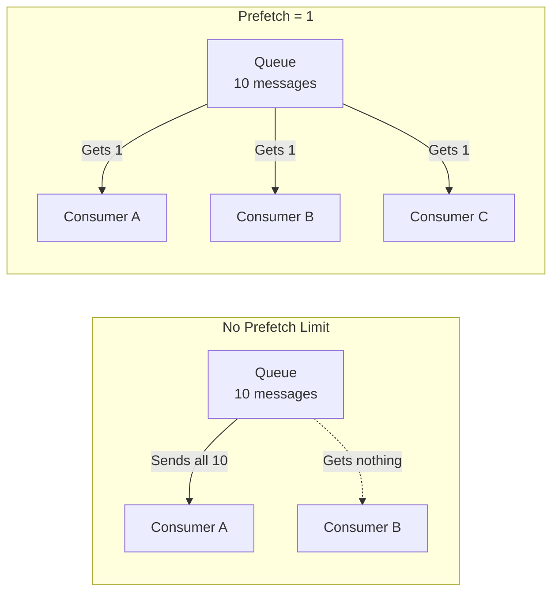

# How to Implement Prefetch for Flow Control in RabbitMQ

Author: [nawazdhandala](https://www.github.com/nawazdhandala)

Tags: RabbitMQ, Prefetch, Flow Control, QoS, Performance Tuning, Message Queues

Description: Learn how to configure prefetch count in RabbitMQ for optimal flow control, balancing throughput and fair message distribution across consumers.

---

Prefetch count controls how many unacknowledged messages a consumer can have at once. Set it too low, and you waste time waiting for messages. Set it too high, and one slow consumer hogs all the work while others sit idle. Getting prefetch right is essential for both performance and fair distribution.

## Understanding Prefetch

Without prefetch limits, RabbitMQ pushes messages to consumers as fast as possible. This can cause problems:

- One fast consumer grabs all messages before slow consumers get any
- A crashed consumer loses all prefetched messages
- Memory fills up with buffered messages on the consumer side



## Setting Prefetch Count

### Python with Pika

```python
import pika

connection = pika.BlockingConnection(
    pika.ConnectionParameters('localhost')
)
channel = connection.channel()

# Set prefetch count to 1 - process one message at a time
channel.basic_qos(prefetch_count=1)

def callback(ch, method, properties, body):
    print(f"Processing: {body}")
    # Do work...
    ch.basic_ack(delivery_tag=method.delivery_tag)

channel.basic_consume(queue='tasks', on_message_callback=callback)
channel.start_consuming()
```

### Node.js with amqplib

```javascript
const amqp = require('amqplib');

async function consume() {
    const connection = await amqp.connect('amqp://localhost');
    const channel = await connection.createChannel();

    // Set prefetch count
    await channel.prefetch(1);

    await channel.assertQueue('tasks', { durable: true });

    channel.consume('tasks', (msg) => {
        console.log('Processing:', msg.content.toString());
        // Do work...
        channel.ack(msg);
    });
}

consume();
```

### Global vs Per-Consumer Prefetch

```python
# Per-consumer prefetch (default behavior)
# Each consumer on this channel gets up to 10 unacked messages
channel.basic_qos(prefetch_count=10, global_qos=False)

# Global prefetch
# All consumers on this channel share a pool of 10 unacked messages
channel.basic_qos(prefetch_count=10, global_qos=True)
```

Global prefetch is rarely useful. Stick with per-consumer (the default).

## Choosing the Right Prefetch Value

### Prefetch = 1: Fair Distribution

```python
channel.basic_qos(prefetch_count=1)
```

**Best for:**
- Long-running tasks with varying processing times
- When fair distribution matters more than throughput
- Tasks that might fail and need redelivery

**Trade-off:** Lower throughput due to round-trip latency between acks

### Prefetch = 10-50: Balanced Performance

```python
channel.basic_qos(prefetch_count=25)
```

**Best for:**
- Mixed workloads
- Moderate message processing times
- Most production use cases

### Prefetch = 100-1000: High Throughput

```python
channel.basic_qos(prefetch_count=250)
```

**Best for:**
- Fast message processing (< 10ms per message)
- When throughput is the primary concern
- Homogeneous consumer capacity

**Risk:** Slow consumers may hold many messages, causing uneven distribution

### Unlimited Prefetch (0)

```python
channel.basic_qos(prefetch_count=0)  # No limit
```

**Almost never use this.** Messages pile up on consumers, risking memory issues and lost work on crashes.

## Calculating Optimal Prefetch

Consider these factors:

1. **Message processing time**: Longer processing = lower prefetch
2. **Network latency**: Higher latency = higher prefetch (to hide round-trip time)
3. **Consumer count**: More consumers = can use lower prefetch
4. **Failure tolerance**: Higher risk = lower prefetch

A rough formula:

```
prefetch = target_throughput * avg_processing_time * safety_factor

Example:
- Target: 1000 msg/sec per consumer
- Processing time: 10ms (0.01s)
- Safety factor: 2x

prefetch = 1000 * 0.01 * 2 = 20
```

## Adaptive Prefetch

Dynamically adjust prefetch based on conditions:

```python
import pika
import time
from threading import Thread

class AdaptivePrefetchConsumer:
    def __init__(self, initial_prefetch=10, min_prefetch=1, max_prefetch=100):
        self.prefetch = initial_prefetch
        self.min_prefetch = min_prefetch
        self.max_prefetch = max_prefetch
        self.processing_times = []
        self.connection = None
        self.channel = None

    def connect(self):
        self.connection = pika.BlockingConnection(
            pika.ConnectionParameters('localhost')
        )
        self.channel = self.connection.channel()
        self.channel.basic_qos(prefetch_count=self.prefetch)

    def adjust_prefetch(self):
        """Adjust prefetch based on processing performance"""
        if len(self.processing_times) < 10:
            return

        avg_time = sum(self.processing_times[-100:]) / len(self.processing_times[-100:])

        # If processing is fast, increase prefetch
        if avg_time < 0.01 and self.prefetch < self.max_prefetch:  # < 10ms
            self.prefetch = min(self.prefetch * 2, self.max_prefetch)
            print(f"Increasing prefetch to {self.prefetch}")

        # If processing is slow, decrease prefetch
        elif avg_time > 0.1 and self.prefetch > self.min_prefetch:  # > 100ms
            self.prefetch = max(self.prefetch // 2, self.min_prefetch)
            print(f"Decreasing prefetch to {self.prefetch}")

        # Apply new prefetch
        self.channel.basic_qos(prefetch_count=self.prefetch)

    def process_message(self, ch, method, properties, body):
        start = time.time()

        # Process message
        do_work(body)

        elapsed = time.time() - start
        self.processing_times.append(elapsed)

        ch.basic_ack(delivery_tag=method.delivery_tag)

        # Periodically adjust prefetch
        if len(self.processing_times) % 100 == 0:
            self.adjust_prefetch()

    def start(self):
        self.connect()
        self.channel.basic_consume(
            queue='tasks',
            on_message_callback=self.process_message
        )
        self.channel.start_consuming()

def do_work(body):
    # Simulate variable processing time
    time.sleep(0.05)

consumer = AdaptivePrefetchConsumer()
consumer.start()
```

## Prefetch with Async Consumers

For async processing, prefetch determines concurrency:

```python
import asyncio
import aio_pika

async def consume_async():
    connection = await aio_pika.connect_robust('amqp://localhost')

    async with connection:
        channel = await connection.channel()

        # Prefetch determines max concurrent processing
        await channel.set_qos(prefetch_count=10)

        queue = await channel.declare_queue('tasks', durable=True)

        async def process_message(message: aio_pika.IncomingMessage):
            async with message.process():
                # Process concurrently (up to prefetch count)
                await asyncio.sleep(0.1)  # Simulate async work
                print(f"Processed: {message.body}")

        await queue.consume(process_message)

        # Keep running
        await asyncio.Future()

asyncio.run(consume_async())
```

### Node.js Concurrent Processing

```javascript
const amqp = require('amqplib');

async function consumeWithConcurrency(concurrency) {
    const connection = await amqp.connect('amqp://localhost');
    const channel = await connection.createChannel();

    // Prefetch matches desired concurrency
    await channel.prefetch(concurrency);

    let activeCount = 0;

    channel.consume('tasks', async (msg) => {
        activeCount++;
        console.log(`Processing (${activeCount}/${concurrency} active)`);

        try {
            // Simulate async work
            await new Promise(resolve => setTimeout(resolve, 100));
            channel.ack(msg);
        } catch (error) {
            channel.nack(msg, false, true);  // Requeue on error
        } finally {
            activeCount--;
        }
    });

    console.log(`Consumer started with concurrency: ${concurrency}`);
}

consumeWithConcurrency(10);
```

## Monitoring Prefetch Effectiveness

Track metrics to know if your prefetch is optimal:

```python
import time
from collections import deque

class MonitoredConsumer:
    def __init__(self, channel, queue_name, prefetch):
        self.channel = channel
        self.queue_name = queue_name
        self.prefetch = prefetch

        # Metrics
        self.processing_times = deque(maxlen=1000)
        self.idle_time = 0
        self.last_message_time = time.time()

        channel.basic_qos(prefetch_count=prefetch)

    def callback(self, ch, method, properties, body):
        # Track idle time (time between messages)
        now = time.time()
        self.idle_time += now - self.last_message_time

        # Process
        start = time.time()
        process(body)
        elapsed = time.time() - start

        self.processing_times.append(elapsed)
        ch.basic_ack(delivery_tag=method.delivery_tag)

        self.last_message_time = time.time()

    def get_stats(self):
        if not self.processing_times:
            return {}

        times = list(self.processing_times)
        total_processing = sum(times)
        total_time = total_processing + self.idle_time

        return {
            'prefetch': self.prefetch,
            'messages_processed': len(times),
            'avg_processing_ms': (sum(times) / len(times)) * 1000,
            'utilization': total_processing / total_time if total_time > 0 else 0,
            'idle_ratio': self.idle_time / total_time if total_time > 0 else 0
        }

# High idle ratio = prefetch too low
# Uneven distribution across consumers = prefetch too high
```

## Common Patterns

### Pattern 1: Work Queue with Fair Dispatch

```python
# Classic work queue pattern - fair distribution
channel.basic_qos(prefetch_count=1)

# Each worker gets one task at a time
# Ensures slow workers don't get overwhelmed
```

### Pattern 2: Batch Processing

```python
# Prefetch a batch, process together
BATCH_SIZE = 100
channel.basic_qos(prefetch_count=BATCH_SIZE)

batch = []

def callback(ch, method, properties, body):
    batch.append((method.delivery_tag, body))

    if len(batch) >= BATCH_SIZE:
        # Process batch
        process_batch([b[1] for b in batch])

        # Ack all
        for tag, _ in batch:
            ch.basic_ack(delivery_tag=tag)

        batch.clear()
```

### Pattern 3: Priority-Based Prefetch

```python
# Different prefetch for different priority consumers
def create_consumer(priority):
    connection = pika.BlockingConnection(pika.ConnectionParameters('localhost'))
    channel = connection.channel()

    if priority == 'high':
        channel.basic_qos(prefetch_count=1)  # Process one at a time
    elif priority == 'normal':
        channel.basic_qos(prefetch_count=10)
    else:
        channel.basic_qos(prefetch_count=50)  # Background processing

    return channel
```

## Troubleshooting

### Symptoms of Wrong Prefetch

**Prefetch too low:**
- High idle time between messages
- Lower throughput than expected
- All consumers processing but queue not draining fast enough

**Prefetch too high:**
- Uneven message distribution
- Some consumers overloaded while others idle
- Large message loss on consumer crash
- Memory pressure on consumer side

### Checking Current Prefetch

```bash
# Via rabbitmqctl
rabbitmqctl list_consumers queue name prefetch_count

# Via Management API
curl -u admin:password http://localhost:15672/api/consumers | \
    jq '.[] | {queue: .queue.name, prefetch: .prefetch_count}'
```

## Best Practices

1. **Start low, increase based on metrics**: Begin with prefetch=1, measure, adjust
2. **Match prefetch to processing time**: Faster processing = higher prefetch
3. **Use per-consumer prefetch**: Global prefetch rarely makes sense
4. **Monitor utilization**: High idle time means prefetch is too low
5. **Consider failure impact**: Lower prefetch = fewer lost messages on crash
6. **Test under load**: Behavior differs between idle and loaded queues

## Conclusion

Prefetch count is a critical tuning parameter for RabbitMQ consumers. Start with a conservative value like 1-10, measure your consumer utilization and message distribution, then adjust based on data. The goal is to keep consumers busy without causing unfair distribution or risking message loss. Monitor continuously and be prepared to adjust as your workload characteristics change.
