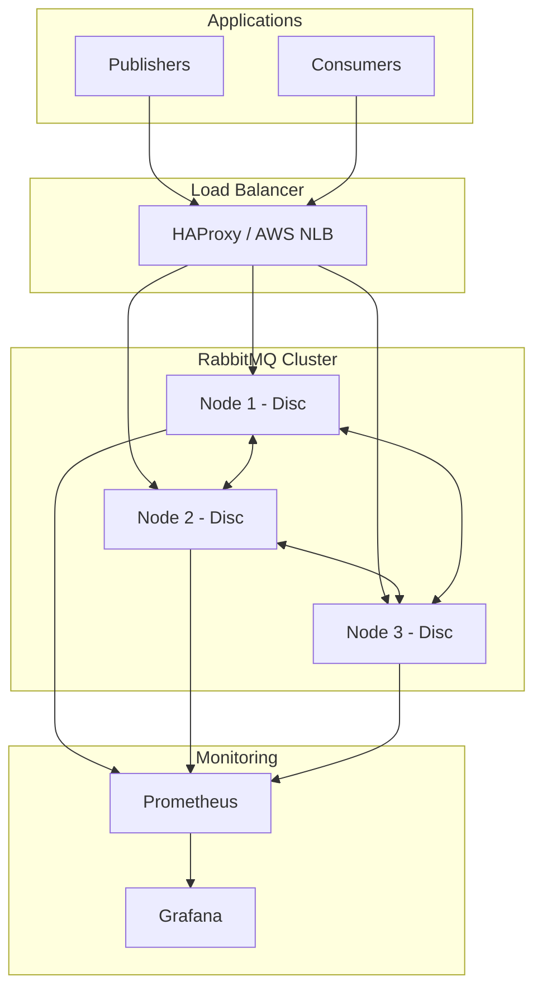

# How to Set Up RabbitMQ for Production

Author: [nawazdhandala](https://www.github.com/nawazdhandala)

Tags: RabbitMQ, Message Queue, DevOps, Production, Infrastructure, High Availability, Monitoring

Description: A comprehensive guide to setting up RabbitMQ for production environments, covering installation, security hardening, performance tuning, clustering, monitoring, and operational best practices.

---

Running RabbitMQ in development is straightforward. Running it in production is a different story. You need to think about security, high availability, performance tuning, monitoring, and disaster recovery. This guide walks you through setting up a production-ready RabbitMQ deployment that can handle real workloads.

---

## Production Architecture Overview

Before diving into configuration, let's look at what a production RabbitMQ setup typically includes:



A production setup includes multiple RabbitMQ nodes for high availability, a load balancer to distribute connections, and monitoring to track the health of your cluster.

---

## Installing RabbitMQ

Start with a clean Ubuntu 22.04 server. First, add the official RabbitMQ repository to get the latest stable version:

```bash
# Install prerequisites
sudo apt-get update
sudo apt-get install -y curl gnupg apt-transport-https

# Add RabbitMQ signing keys
curl -1sLf "https://keys.openpgp.org/vks/v1/by-fingerprint/0A9AF2115F4687BD29803A206B73A36E6026DFCA" | sudo gpg --dearmor | sudo tee /usr/share/keyrings/com.rabbitmq.team.gpg > /dev/null
curl -1sLf "https://github.com/rabbitmq/signing-keys/releases/download/3.0/cloudsmith.rabbitmq-erlang.E495BB49CC4BBE5B.key" | sudo gpg --dearmor | sudo tee /usr/share/keyrings/rabbitmq.E495BB49CC4BBE5B.gpg > /dev/null
curl -1sLf "https://github.com/rabbitmq/signing-keys/releases/download/3.0/cloudsmith.rabbitmq-server.9F4587F226208342.key" | sudo gpg --dearmor | sudo tee /usr/share/keyrings/rabbitmq.9F4587F226208342.gpg > /dev/null

# Add repository
sudo tee /etc/apt/sources.list.d/rabbitmq.list <<EOF
deb [signed-by=/usr/share/keyrings/rabbitmq.E495BB49CC4BBE5B.gpg] https://ppa1.novemberain.com/rabbitmq/rabbitmq-erlang/deb/ubuntu jammy main
deb [signed-by=/usr/share/keyrings/rabbitmq.9F4587F226208342.gpg] https://ppa1.novemberain.com/rabbitmq/rabbitmq-server/deb/ubuntu jammy main
EOF

# Install Erlang and RabbitMQ
sudo apt-get update
sudo apt-get install -y erlang-base erlang-asn1 erlang-crypto erlang-eldap erlang-ftp erlang-inets \
    erlang-mnesia erlang-os-mon erlang-parsetools erlang-public-key erlang-runtime-tools erlang-snmp \
    erlang-ssl erlang-syntax-tools erlang-tftp erlang-tools erlang-xmerl rabbitmq-server

# Enable and start RabbitMQ
sudo systemctl enable rabbitmq-server
sudo systemctl start rabbitmq-server
```

Verify the installation:

```bash
# Check RabbitMQ status
sudo rabbitmqctl status

# Check Erlang version (should be 25.x or higher)
erl -eval 'erlang:display(erlang:system_info(otp_release)), halt().' -noshell
```

---

## Security Configuration

Production systems require proper security. Start by removing the default guest user and creating administrative accounts:

```bash
# Delete the default guest user (only works from localhost anyway, but remove it)
sudo rabbitmqctl delete_user guest

# Create an admin user with a strong password
sudo rabbitmqctl add_user admin 'YourStrongPassword123!'
sudo rabbitmqctl set_user_tags admin administrator
sudo rabbitmqctl set_permissions -p / admin ".*" ".*" ".*"

# Create application-specific users with limited permissions
sudo rabbitmqctl add_user order_service 'OrderServicePass456!'
sudo rabbitmqctl set_permissions -p / order_service "^order\." "^order\." "^order\."

# Create a monitoring user (read-only)
sudo rabbitmqctl add_user monitoring 'MonitoringPass789!'
sudo rabbitmqctl set_user_tags monitoring monitoring
sudo rabbitmqctl set_permissions -p / monitoring "" "" ".*"
```

### Virtual Hosts for Isolation

Use virtual hosts to isolate different applications or environments:

```bash
# Create virtual hosts for different environments or applications
sudo rabbitmqctl add_vhost production
sudo rabbitmqctl add_vhost staging

# Set permissions for users on specific vhosts
sudo rabbitmqctl set_permissions -p production order_service "^order\." "^order\." "^order\."
```

### Enable TLS Encryption

Never run RabbitMQ without TLS in production. First, generate or obtain certificates, then configure TLS:

```bash
# Create directory for certificates
sudo mkdir -p /etc/rabbitmq/ssl
sudo chown rabbitmq:rabbitmq /etc/rabbitmq/ssl
sudo chmod 750 /etc/rabbitmq/ssl

# Copy your certificates (from Let's Encrypt or your CA)
sudo cp /path/to/ca_certificate.pem /etc/rabbitmq/ssl/
sudo cp /path/to/server_certificate.pem /etc/rabbitmq/ssl/
sudo cp /path/to/server_key.pem /etc/rabbitmq/ssl/

# Set proper permissions
sudo chown rabbitmq:rabbitmq /etc/rabbitmq/ssl/*
sudo chmod 640 /etc/rabbitmq/ssl/*
```

Configure RabbitMQ to use TLS by creating `/etc/rabbitmq/rabbitmq.conf`:

```ini
# /etc/rabbitmq/rabbitmq.conf
# RabbitMQ production configuration

# Disable non-TLS listeners
listeners.tcp = none

# TLS listener configuration
listeners.ssl.default = 5671

# TLS certificate paths
ssl_options.cacertfile = /etc/rabbitmq/ssl/ca_certificate.pem
ssl_options.certfile = /etc/rabbitmq/ssl/server_certificate.pem
ssl_options.keyfile = /etc/rabbitmq/ssl/server_key.pem

# Require client certificate verification (optional but recommended)
ssl_options.verify = verify_peer
ssl_options.fail_if_no_peer_cert = false

# Use strong TLS versions only
ssl_options.versions.1 = tlsv1.3
ssl_options.versions.2 = tlsv1.2

# Management UI - also with TLS
management.ssl.port = 15671
management.ssl.cacertfile = /etc/rabbitmq/ssl/ca_certificate.pem
management.ssl.certfile = /etc/rabbitmq/ssl/server_certificate.pem
management.ssl.keyfile = /etc/rabbitmq/ssl/server_key.pem
```

---

## Performance Tuning

RabbitMQ performance depends on proper resource allocation and configuration. Here are the key settings:

### Memory Configuration

RabbitMQ uses memory watermarks to prevent running out of memory. Configure these in `/etc/rabbitmq/rabbitmq.conf`:

```ini
# Memory watermark - when to start blocking publishers
# Default is 0.4 (40% of RAM). Adjust based on your server
vm_memory_high_watermark.relative = 0.6

# Alternatively, set an absolute limit
# vm_memory_high_watermark.absolute = 8GB

# Paging threshold - start paging messages to disk at this percentage of the high watermark
vm_memory_high_watermark_paging_ratio = 0.75
```

### Disk Configuration

Set disk free space limits to prevent disk exhaustion:

```ini
# Minimum free disk space (default is 50MB - too low for production)
disk_free_limit.absolute = 5GB

# Or use relative limit (recommended)
disk_free_limit.relative = 2.0
```

### File Descriptor Limits

RabbitMQ needs many file descriptors for connections and queues. Update system limits:

```bash
# Create systemd override for RabbitMQ
sudo mkdir -p /etc/systemd/system/rabbitmq-server.service.d/
sudo tee /etc/systemd/system/rabbitmq-server.service.d/limits.conf <<EOF
[Service]
LimitNOFILE=65536
EOF

# Reload systemd and restart RabbitMQ
sudo systemctl daemon-reload
sudo systemctl restart rabbitmq-server
```

Also set system-wide limits in `/etc/security/limits.conf`:

```
rabbitmq soft nofile 65536
rabbitmq hard nofile 65536
```

### Network Tuning

Add these kernel parameters to `/etc/sysctl.conf`:

```ini
# Increase max connections
net.core.somaxconn = 65535

# Increase TCP buffer sizes
net.core.rmem_max = 16777216
net.core.wmem_max = 16777216
net.ipv4.tcp_rmem = 4096 87380 16777216
net.ipv4.tcp_wmem = 4096 65536 16777216

# Enable TCP keepalives
net.ipv4.tcp_keepalive_time = 600
net.ipv4.tcp_keepalive_intvl = 60
net.ipv4.tcp_keepalive_probes = 3
```

Apply the settings:

```bash
sudo sysctl -p
```

---

## Clustering for High Availability

A single RabbitMQ node is a single point of failure. Set up a cluster with at least three nodes for production:

### Prepare Nodes

On each node, ensure they share the same Erlang cookie:

```bash
# On node 1, get the cookie
sudo cat /var/lib/rabbitmq/.erlang.cookie

# Copy this cookie to nodes 2 and 3
sudo systemctl stop rabbitmq-server
echo "SHARED_ERLANG_COOKIE_VALUE" | sudo tee /var/lib/rabbitmq/.erlang.cookie
sudo chown rabbitmq:rabbitmq /var/lib/rabbitmq/.erlang.cookie
sudo chmod 400 /var/lib/rabbitmq/.erlang.cookie
sudo systemctl start rabbitmq-server
```

Configure hostnames in `/etc/hosts` on all nodes:

```
192.168.1.10 rabbit1
192.168.1.11 rabbit2
192.168.1.12 rabbit3
```

### Join Nodes to Cluster

On nodes 2 and 3, join the cluster:

```bash
# Stop the RabbitMQ application (not the Erlang VM)
sudo rabbitmqctl stop_app

# Reset the node (removes all data)
sudo rabbitmqctl reset

# Join the cluster
sudo rabbitmqctl join_cluster rabbit@rabbit1

# Start the application
sudo rabbitmqctl start_app
```

Verify the cluster:

```bash
sudo rabbitmqctl cluster_status
```

### Configure Quorum Queues

Classic mirrored queues are deprecated. Use quorum queues for high availability:

```bash
# Set a policy to use quorum queues for all queues
sudo rabbitmqctl set_policy ha-all "^" \
    '{"queue-mode":"lazy","ha-mode":"all"}' \
    --priority 0 \
    --apply-to queues
```

Or declare quorum queues in your application code:

```python
# Python example using pika
import pika

connection = pika.BlockingConnection(
    pika.ConnectionParameters('rabbit1')
)
channel = connection.channel()

# Declare a quorum queue
channel.queue_declare(
    queue='order_queue',
    durable=True,
    arguments={
        'x-queue-type': 'quorum',  # Makes this a quorum queue
        'x-delivery-limit': 5       # Max delivery attempts before dead-lettering
    }
)
```

---

## Monitoring and Alerting

Enable the management plugin and Prometheus metrics:

```bash
# Enable management and Prometheus plugins
sudo rabbitmq-plugins enable rabbitmq_management
sudo rabbitmq-plugins enable rabbitmq_prometheus
```

Configure Prometheus to scrape RabbitMQ metrics in `prometheus.yml`:

```yaml
# prometheus.yml
scrape_configs:
  - job_name: 'rabbitmq'
    static_configs:
      - targets:
        - 'rabbit1:15692'
        - 'rabbit2:15692'
        - 'rabbit3:15692'
    metrics_path: /metrics
```

### Key Metrics to Monitor

Create alerts for these critical metrics:

```yaml
# prometheus_rules.yml
# Alert rules for RabbitMQ monitoring
groups:
  - name: rabbitmq
    rules:
      # High memory usage
      - alert: RabbitMQMemoryHigh
        expr: rabbitmq_process_resident_memory_bytes / rabbitmq_resident_memory_limit_bytes > 0.8
        for: 5m
        labels:
          severity: warning
        annotations:
          summary: "RabbitMQ memory usage is high"
          description: "Memory usage is above 80% on {{ $labels.instance }}"

      # Disk space low
      - alert: RabbitMQDiskSpaceLow
        expr: rabbitmq_disk_space_available_bytes < 5000000000
        for: 5m
        labels:
          severity: critical
        annotations:
          summary: "RabbitMQ disk space is low"
          description: "Less than 5GB disk space on {{ $labels.instance }}"

      # Queue messages growing
      - alert: RabbitMQQueueGrowing
        expr: increase(rabbitmq_queue_messages[5m]) > 1000
        for: 10m
        labels:
          severity: warning
        annotations:
          summary: "Queue is growing rapidly"
          description: "Queue {{ $labels.queue }} is accumulating messages"

      # No consumers
      - alert: RabbitMQNoConsumers
        expr: rabbitmq_queue_consumers == 0 and rabbitmq_queue_messages > 0
        for: 5m
        labels:
          severity: critical
        annotations:
          summary: "Queue has no consumers"
          description: "Queue {{ $labels.queue }} has messages but no consumers"

      # Node down
      - alert: RabbitMQNodeDown
        expr: up{job="rabbitmq"} == 0
        for: 1m
        labels:
          severity: critical
        annotations:
          summary: "RabbitMQ node is down"
          description: "Node {{ $labels.instance }} is not responding"
```

### Management UI Access

Restrict management UI access to specific IPs or use a VPN:

```ini
# /etc/rabbitmq/rabbitmq.conf
# Bind management to internal interface only
management.tcp.ip = 10.0.0.10
management.tcp.port = 15672

# Or disable and use SSH tunneling
# management.tcp.port = 0
```

---

## Load Balancing

Use HAProxy or your cloud provider's load balancer for distributing connections:

```
# /etc/haproxy/haproxy.cfg
# HAProxy configuration for RabbitMQ
frontend rabbitmq_frontend
    bind *:5672
    mode tcp
    default_backend rabbitmq_backend

backend rabbitmq_backend
    mode tcp
    balance roundrobin
    option tcp-check

    # Health check using AMQP protocol
    server rabbit1 192.168.1.10:5672 check inter 5s rise 2 fall 3
    server rabbit2 192.168.1.11:5672 check inter 5s rise 2 fall 3
    server rabbit3 192.168.1.12:5672 check inter 5s rise 2 fall 3

# Management UI frontend (optional)
frontend rabbitmq_management
    bind *:15672
    mode tcp
    default_backend rabbitmq_management_backend

backend rabbitmq_management_backend
    mode tcp
    balance roundrobin
    server rabbit1 192.168.1.10:15672 check
    server rabbit2 192.168.1.11:15672 check backup
    server rabbit3 192.168.1.12:15672 check backup
```

---

## Backup and Recovery

Regular backups protect against data loss. RabbitMQ definitions include exchanges, queues, bindings, users, and policies:

```bash
# Export definitions (does not include messages)
sudo rabbitmqctl export_definitions /backup/rabbitmq-definitions-$(date +%Y%m%d).json

# Import definitions (on a new or recovered cluster)
sudo rabbitmqctl import_definitions /backup/rabbitmq-definitions-20260126.json
```

Create a backup script that runs daily:

```bash
#!/bin/bash
# /opt/scripts/backup-rabbitmq.sh
# Backup RabbitMQ definitions daily

BACKUP_DIR="/backup/rabbitmq"
DATE=$(date +%Y%m%d)
RETENTION_DAYS=30

mkdir -p "$BACKUP_DIR"

# Export definitions
rabbitmqctl export_definitions "$BACKUP_DIR/definitions-$DATE.json"

# Compress the backup
gzip "$BACKUP_DIR/definitions-$DATE.json"

# Remove old backups
find "$BACKUP_DIR" -name "definitions-*.json.gz" -mtime +$RETENTION_DAYS -delete

echo "Backup completed: $BACKUP_DIR/definitions-$DATE.json.gz"
```

Add to cron:

```bash
# Run backup daily at 2 AM
0 2 * * * /opt/scripts/backup-rabbitmq.sh >> /var/log/rabbitmq-backup.log 2>&1
```

---

## Operational Checklist

Before going to production, verify these items:

| Category | Item | Status |
|----------|------|--------|
| Security | Default guest user removed | Required |
| Security | TLS enabled for all connections | Required |
| Security | Strong passwords for all users | Required |
| Security | Firewall rules configured | Required |
| Performance | File descriptor limits increased | Required |
| Performance | Memory watermarks configured | Required |
| Performance | Disk free limits set | Required |
| HA | Cluster with 3+ nodes | Recommended |
| HA | Quorum queues enabled | Recommended |
| HA | Load balancer configured | Recommended |
| Monitoring | Prometheus metrics enabled | Required |
| Monitoring | Alerting rules configured | Required |
| Backup | Automated definition backups | Required |
| Backup | Recovery procedure tested | Required |

---

## Troubleshooting Common Issues

### Connection Refused

Check that RabbitMQ is running and listening:

```bash
# Check service status
sudo systemctl status rabbitmq-server

# Check listening ports
sudo ss -tlnp | grep beam

# Check logs
sudo journalctl -u rabbitmq-server -f
```

### Memory Alarms

When memory usage hits the watermark, publishers are blocked:

```bash
# Check current memory usage
sudo rabbitmqctl status | grep -A 5 "Memory"

# List queues sorted by memory usage
sudo rabbitmqctl list_queues name messages memory --sort memory
```

### Cluster Partition

Network partitions can cause split-brain. Check and resolve:

```bash
# Check for partitions
sudo rabbitmqctl cluster_status

# If partitioned, you may need to restart nodes
# The partition handling mode determines behavior
```

Configure partition handling in `rabbitmq.conf`:

```ini
# Partition handling strategy
# pause_minority - recommended for most cases
cluster_partition_handling = pause_minority
```

---

## Conclusion

Setting up RabbitMQ for production requires attention to security, performance, and reliability. Start with a properly secured single node, tune performance based on your workload, then add clustering when you need high availability. Monitor everything and test your recovery procedures before you need them.

The configuration shown here provides a solid foundation. Adjust memory limits, disk thresholds, and cluster size based on your specific message volumes and latency requirements.

---

*Message queues are critical infrastructure. [OneUptime](https://oneuptime.com) provides comprehensive monitoring for RabbitMQ and other message brokers, helping you catch issues before they impact your applications.*

**Related Reading:**
- [How to Set Up RabbitMQ Message Broker on Ubuntu](https://oneuptime.com/blog/post/2026-01-15-setup-rabbitmq-ubuntu/view)
- [How to Configure RabbitMQ Clustering](https://oneuptime.com/blog/post/2026-01-24-rabbitmq-clustering/view)
- [How to Monitor RabbitMQ with Prometheus](https://oneuptime.com/blog/post/2026-01-24-monitor-rabbitmq-prometheus/view)
