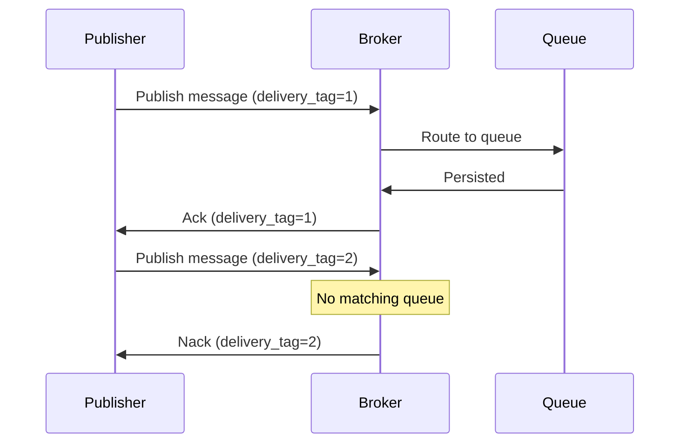

# How to Implement Publisher Confirms in RabbitMQ

Author: [nawazdhandala](https://www.github.com/nawazdhandala)

Tags: RabbitMQ, Publisher Confirms, Message Reliability, At-Least-Once Delivery, Message Queues, DevOps

Description: Learn how to implement publisher confirms in RabbitMQ to guarantee message delivery from publishers to brokers with practical examples in Python and Node.js.

---

Publishing a message without confirmation is like sending a letter without tracking. You hope it arrives, but you have no proof. Publisher confirms give you acknowledgment from RabbitMQ that your message was received and persisted. This is essential for applications where losing a message is not acceptable.

## The Problem Without Confirms

Without publisher confirms, this code might lose messages:

```python
# Dangerous - no delivery guarantee
channel.basic_publish(exchange='', routing_key='orders', body=message)
# Message might be lost if:
# - Network fails
# - Broker crashes before persisting
# - No route to queue exists
```

## How Publisher Confirms Work

When you enable confirms, RabbitMQ acknowledges each published message:



## Enabling Publisher Confirms

### Python with Pika - Synchronous Confirms

```python
import pika
import json

def publish_with_confirm(message):
    """Publish a message with synchronous confirmation"""

    connection = pika.BlockingConnection(
        pika.ConnectionParameters('localhost')
    )
    channel = connection.channel()

    # Enable publisher confirms on this channel
    channel.confirm_delivery()

    # Declare queue
    channel.queue_declare(queue='orders', durable=True)

    try:
        # basic_publish returns True if confirmed, raises exception if nacked
        channel.basic_publish(
            exchange='',
            routing_key='orders',
            body=json.dumps(message),
            properties=pika.BasicProperties(
                delivery_mode=2,  # Persistent
                content_type='application/json'
            ),
            mandatory=True  # Return message if unroutable
        )
        print(f"Message confirmed: {message}")
        return True

    except pika.exceptions.UnroutableError:
        print(f"Message was returned (unroutable): {message}")
        return False

    except pika.exceptions.NackError:
        print(f"Message was nacked: {message}")
        return False

    finally:
        connection.close()

# Usage
publish_with_confirm({'order_id': '12345', 'total': 99.99})
```

### Python - Asynchronous Confirms

For higher throughput, use asynchronous confirms:

```python
import pika
import json
import threading
from collections import defaultdict

class AsyncPublisher:
    def __init__(self, host='localhost'):
        self.connection = pika.BlockingConnection(
            pika.ConnectionParameters(host)
        )
        self.channel = self.connection.channel()

        # Enable confirms
        self.channel.confirm_delivery()

        # Track pending confirms
        self.pending = {}
        self.lock = threading.Lock()
        self.delivery_tag = 0

    def publish(self, routing_key, message, on_confirm=None):
        """Publish with async confirmation tracking"""

        with self.lock:
            self.delivery_tag += 1
            tag = self.delivery_tag

            if on_confirm:
                self.pending[tag] = {
                    'message': message,
                    'callback': on_confirm
                }

        try:
            self.channel.basic_publish(
                exchange='',
                routing_key=routing_key,
                body=json.dumps(message),
                properties=pika.BasicProperties(delivery_mode=2),
                mandatory=True
            )

            # For synchronous confirmation in blocking mode
            if on_confirm:
                on_confirm(True, message)

        except Exception as e:
            if on_confirm:
                on_confirm(False, message)
            raise

    def close(self):
        self.connection.close()

# Usage
def handle_confirm(success, message):
    if success:
        print(f"Confirmed: {message}")
    else:
        print(f"Failed: {message}")

publisher = AsyncPublisher()

for i in range(100):
    publisher.publish(
        'orders',
        {'order_id': str(i), 'total': 99.99},
        on_confirm=handle_confirm
    )

publisher.close()
```

### Node.js with amqplib - Confirms

```javascript
const amqp = require('amqplib');

async function publishWithConfirm(message) {
    const connection = await amqp.connect('amqp://localhost');

    // Create a confirm channel instead of regular channel
    const channel = await connection.createConfirmChannel();

    await channel.assertQueue('orders', { durable: true });

    return new Promise((resolve, reject) => {
        channel.sendToQueue(
            'orders',
            Buffer.from(JSON.stringify(message)),
            { persistent: true },
            (err, ok) => {
                if (err) {
                    console.error('Message nacked:', err);
                    reject(err);
                } else {
                    console.log('Message confirmed:', message);
                    resolve(ok);
                }
                connection.close();
            }
        );
    });
}

// Usage
async function main() {
    try {
        await publishWithConfirm({ orderId: '12345', total: 99.99 });
    } catch (error) {
        console.error('Publish failed:', error);
    }
}

main();
```

### Node.js - Batch Confirms

```javascript
const amqp = require('amqplib');

async function publishBatch(messages) {
    const connection = await amqp.connect('amqp://localhost');
    const channel = await connection.createConfirmChannel();

    await channel.assertQueue('orders', { durable: true });

    const publishPromises = messages.map((message, index) => {
        return new Promise((resolve, reject) => {
            channel.sendToQueue(
                'orders',
                Buffer.from(JSON.stringify(message)),
                { persistent: true },
                (err) => {
                    if (err) {
                        console.error(`Message ${index} nacked`);
                        reject(err);
                    } else {
                        resolve(index);
                    }
                }
            );
        });
    });

    try {
        // Wait for all confirms
        const results = await Promise.all(publishPromises);
        console.log(`All ${results.length} messages confirmed`);
    } catch (error) {
        console.error('Some messages failed:', error);
    } finally {
        await connection.close();
    }
}

// Publish batch of messages
const messages = Array.from({ length: 100 }, (_, i) => ({
    orderId: `order-${i}`,
    total: Math.random() * 100
}));

publishBatch(messages);
```

## Handling Unroutable Messages

Messages without a matching queue can be returned to the publisher.

### Python - Mandatory Flag with Returns

```python
import pika
import json

class ReliablePublisher:
    def __init__(self, host='localhost'):
        self.connection = pika.BlockingConnection(
            pika.ConnectionParameters(host)
        )
        self.channel = self.connection.channel()
        self.channel.confirm_delivery()

        # Track returned messages
        self.returns = []

        # Register return callback
        self.channel.add_on_return_callback(self.on_return)

    def on_return(self, channel, method, properties, body):
        """Called when a message is returned (unroutable)"""
        print(f"Message returned: {method.routing_key}")
        print(f"  Reply code: {method.reply_code}")
        print(f"  Reply text: {method.reply_text}")

        self.returns.append({
            'routing_key': method.routing_key,
            'body': body,
            'reply_code': method.reply_code,
            'reply_text': method.reply_text
        })

    def publish(self, routing_key, message):
        """Publish with mandatory flag"""
        try:
            self.channel.basic_publish(
                exchange='',
                routing_key=routing_key,
                body=json.dumps(message),
                properties=pika.BasicProperties(delivery_mode=2),
                mandatory=True  # Return if unroutable
            )

            # Process events to receive any returns
            self.connection.process_data_events(time_limit=0.1)

            if self.returns:
                returned = self.returns.pop()
                print(f"Message was unroutable!")
                return False

            return True

        except Exception as e:
            print(f"Publish error: {e}")
            return False

    def close(self):
        self.connection.close()

# Usage
publisher = ReliablePublisher()

# This will be returned (queue doesn't exist)
success = publisher.publish('nonexistent_queue', {'test': 'data'})
print(f"Publish success: {success}")

publisher.close()
```

## Confirm Strategies

### Strategy 1: Publish and Wait

Simple but slow. Wait for each confirm before publishing the next message:

```python
def publish_one_at_a_time(messages):
    connection = pika.BlockingConnection(pika.ConnectionParameters('localhost'))
    channel = connection.channel()
    channel.confirm_delivery()

    for message in messages:
        # Blocks until confirmed
        channel.basic_publish(
            exchange='',
            routing_key='orders',
            body=json.dumps(message),
            properties=pika.BasicProperties(delivery_mode=2)
        )
        # Each message confirmed before next publish

    connection.close()
```

**Best for**: Low volume, simplicity
**Throughput**: ~500 msg/sec

### Strategy 2: Batch Confirms

Publish multiple messages, then wait for all confirms:

```python
def publish_batch(messages, batch_size=100):
    connection = pika.BlockingConnection(pika.ConnectionParameters('localhost'))
    channel = connection.channel()
    channel.confirm_delivery()

    for i in range(0, len(messages), batch_size):
        batch = messages[i:i + batch_size]

        for message in batch:
            channel.basic_publish(
                exchange='',
                routing_key='orders',
                body=json.dumps(message),
                properties=pika.BasicProperties(delivery_mode=2)
            )

        # Wait for batch confirmation
        # In pika, confirms are synchronous with confirm_delivery()
        print(f"Batch {i // batch_size + 1} confirmed")

    connection.close()
```

**Best for**: Moderate volume, balanced performance
**Throughput**: ~5,000 msg/sec

### Strategy 3: Async Confirms with Callbacks

Highest throughput using async I/O:

```python
import asyncio
import aio_pika

async def publish_async(messages):
    connection = await aio_pika.connect_robust('amqp://localhost')

    async with connection:
        channel = await connection.channel()

        # Enable publisher confirms
        await channel.set_qos(prefetch_count=0)

        tasks = []
        for message in messages:
            msg = aio_pika.Message(
                body=json.dumps(message).encode(),
                delivery_mode=aio_pika.DeliveryMode.PERSISTENT
            )

            # Publish returns awaitable confirmation
            task = channel.default_exchange.publish(
                msg,
                routing_key='orders'
            )
            tasks.append(task)

        # Wait for all confirms
        await asyncio.gather(*tasks)
        print(f"All {len(messages)} messages confirmed")

# Run async publisher
asyncio.run(publish_async(messages))
```

**Best for**: High volume, latency-tolerant
**Throughput**: ~50,000 msg/sec

## Retry Logic for Failed Publishes

```python
import time
import random

class RetryPublisher:
    def __init__(self, host='localhost', max_retries=3, base_delay=1.0):
        self.host = host
        self.max_retries = max_retries
        self.base_delay = base_delay
        self.connection = None
        self.channel = None
        self.connect()

    def connect(self):
        self.connection = pika.BlockingConnection(
            pika.ConnectionParameters(self.host)
        )
        self.channel = self.connection.channel()
        self.channel.confirm_delivery()

    def publish_with_retry(self, routing_key, message):
        """Publish with exponential backoff retry"""

        for attempt in range(self.max_retries + 1):
            try:
                self.channel.basic_publish(
                    exchange='',
                    routing_key=routing_key,
                    body=json.dumps(message),
                    properties=pika.BasicProperties(delivery_mode=2),
                    mandatory=True
                )
                return True  # Success

            except pika.exceptions.AMQPConnectionError:
                print(f"Connection error on attempt {attempt + 1}")
                self.connect()  # Reconnect

            except (pika.exceptions.NackError, pika.exceptions.UnroutableError) as e:
                print(f"Publish failed on attempt {attempt + 1}: {e}")

            if attempt < self.max_retries:
                # Exponential backoff with jitter
                delay = self.base_delay * (2 ** attempt) + random.uniform(0, 1)
                print(f"Retrying in {delay:.2f}s...")
                time.sleep(delay)

        print(f"Message failed after {self.max_retries + 1} attempts")
        return False

    def close(self):
        if self.connection:
            self.connection.close()

# Usage
publisher = RetryPublisher(max_retries=3)
success = publisher.publish_with_retry('orders', {'order_id': '123'})
publisher.close()
```

## Monitoring Confirm Performance

Track confirm latency and success rates:

```python
import time
from collections import deque
import statistics

class MonitoredPublisher:
    def __init__(self, host='localhost'):
        self.connection = pika.BlockingConnection(
            pika.ConnectionParameters(host)
        )
        self.channel = self.connection.channel()
        self.channel.confirm_delivery()

        # Metrics
        self.confirm_times = deque(maxlen=1000)
        self.success_count = 0
        self.fail_count = 0

    def publish(self, routing_key, message):
        start = time.time()

        try:
            self.channel.basic_publish(
                exchange='',
                routing_key=routing_key,
                body=json.dumps(message),
                properties=pika.BasicProperties(delivery_mode=2)
            )

            elapsed = time.time() - start
            self.confirm_times.append(elapsed)
            self.success_count += 1
            return True

        except Exception:
            self.fail_count += 1
            return False

    def get_metrics(self):
        times = list(self.confirm_times)
        return {
            'total_published': self.success_count + self.fail_count,
            'success_count': self.success_count,
            'fail_count': self.fail_count,
            'success_rate': self.success_count / max(1, self.success_count + self.fail_count),
            'avg_confirm_time_ms': statistics.mean(times) * 1000 if times else 0,
            'p99_confirm_time_ms': (
                sorted(times)[int(len(times) * 0.99)] * 1000 if times else 0
            )
        }

# Usage
publisher = MonitoredPublisher()

for i in range(1000):
    publisher.publish('orders', {'id': i})

metrics = publisher.get_metrics()
print(f"Success rate: {metrics['success_rate']:.2%}")
print(f"Avg confirm time: {metrics['avg_confirm_time_ms']:.2f}ms")
print(f"P99 confirm time: {metrics['p99_confirm_time_ms']:.2f}ms")
```

## Best Practices

1. **Always use confirms in production**: Fire-and-forget is never acceptable for important data
2. **Enable mandatory flag**: Catch unroutable messages before they are silently dropped
3. **Implement retry logic**: Handle temporary failures gracefully
4. **Use batch confirms for throughput**: Balance between reliability and performance
5. **Monitor confirm latency**: Alert when confirms slow down significantly
6. **Persistent messages with confirms**: Combine `delivery_mode=2` with confirms for durability

## Conclusion

Publisher confirms are essential for reliable messaging. They give you proof that RabbitMQ received and persisted your messages. Choose the right confirm strategy based on your throughput requirements, implement proper retry logic, and always handle unroutable messages. The small performance cost is worth the guarantee that your messages will not silently disappear.
