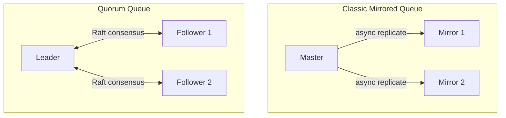

# How to Configure Queue Mirroring in RabbitMQ

Author: [nawazdhandala](https://www.github.com/nawazdhandala)

Tags: RabbitMQ, Queue Mirroring, High Availability, Replication, Message Queues, Clustering

Description: Learn how to configure queue mirroring in RabbitMQ for high availability, including classic mirrored queues, quorum queues, and best practices for production deployments.

---

A single queue on a single node is a single point of failure. When that node goes down, your messages are unavailable until it comes back. Queue mirroring replicates queue contents across multiple nodes, ensuring messages survive node failures. RabbitMQ offers two approaches: classic mirrored queues and the newer quorum queues.

## Classic Mirrored Queues vs Quorum Queues

RabbitMQ 3.8+ introduced quorum queues as the recommended replacement for classic mirrored queues:

| Feature | Classic Mirrored | Quorum Queues |
|---------|------------------|---------------|
| Consensus | None (eventual) | Raft |
| Data Safety | Can lose acks | No lost acks |
| Performance | Higher throughput | More consistent |
| Memory | All in memory | Disk-based |
| Status | Deprecated | Recommended |



## Configuring Quorum Queues (Recommended)

Quorum queues use the Raft consensus algorithm for strong consistency.

### Declaring a Quorum Queue

```python
import pika

connection = pika.BlockingConnection(
    pika.ConnectionParameters('localhost')
)
channel = connection.channel()

# Declare a quorum queue
# x-queue-type: quorum makes it a quorum queue
channel.queue_declare(
    queue='orders',
    durable=True,  # Quorum queues are always durable
    arguments={
        'x-queue-type': 'quorum',
        'x-quorum-initial-group-size': 3  # Number of replicas
    }
)

print("Quorum queue created")
connection.close()
```

### Node.js Quorum Queue Declaration

```javascript
const amqp = require('amqplib');

async function createQuorumQueue() {
    const connection = await amqp.connect('amqp://localhost');
    const channel = await connection.createChannel();

    await channel.assertQueue('orders', {
        durable: true,
        arguments: {
            'x-queue-type': 'quorum',
            'x-quorum-initial-group-size': 3
        }
    });

    console.log('Quorum queue created');
    await connection.close();
}

createQuorumQueue().catch(console.error);
```

### Setting Quorum Queue Defaults via Policy

Apply quorum queue type to all matching queues:

```bash
# Make all queues starting with "critical" quorum queues
rabbitmqctl set_policy quorum-critical "^critical\\." \
  '{"queue-mode": "lazy", "x-queue-type": "quorum"}' \
  --apply-to queues
```

## Configuring Classic Mirrored Queues

While deprecated, you may encounter classic mirrored queues in existing systems.

### Mirror to All Nodes

```bash
# Mirror all queues to all nodes in the cluster
rabbitmqctl set_policy ha-all ".*" \
  '{"ha-mode": "all", "ha-sync-mode": "automatic"}' \
  --apply-to queues
```

### Mirror to Specific Number of Nodes

```bash
# Mirror to exactly 2 nodes (1 master + 1 mirror)
rabbitmqctl set_policy ha-two ".*" \
  '{"ha-mode": "exactly", "ha-params": 2, "ha-sync-mode": "automatic"}' \
  --apply-to queues
```

### Mirror to Specific Nodes

```bash
# Mirror only to nodes named "rabbit@node1" and "rabbit@node2"
rabbitmqctl set_policy ha-specific "^important\\." \
  '{"ha-mode": "nodes", "ha-params": ["rabbit@node1", "rabbit@node2"]}' \
  --apply-to queues
```

### Synchronization Modes

```bash
# Automatic sync - new mirrors sync immediately (blocks queue)
rabbitmqctl set_policy ha-auto-sync ".*" \
  '{"ha-mode": "all", "ha-sync-mode": "automatic"}' \
  --apply-to queues

# Manual sync - new mirrors don't sync existing messages
rabbitmqctl set_policy ha-manual-sync ".*" \
  '{"ha-mode": "all", "ha-sync-mode": "manual"}' \
  --apply-to queues
```

## Quorum Queue Configuration Options

### Delivery Limit

Set maximum delivery attempts before dead-lettering:

```python
channel.queue_declare(
    queue='orders',
    durable=True,
    arguments={
        'x-queue-type': 'quorum',
        'x-delivery-limit': 5,  # Max 5 delivery attempts
        'x-dead-letter-exchange': 'dlx',
        'x-dead-letter-routing-key': 'failed'
    }
)
```

### Memory Limit

Control memory usage per queue:

```python
channel.queue_declare(
    queue='large_messages',
    durable=True,
    arguments={
        'x-queue-type': 'quorum',
        'x-max-in-memory-length': 1000,  # Keep max 1000 msgs in memory
        'x-max-in-memory-bytes': 104857600  # Or max 100MB in memory
    }
)
```

### Dead Lettering

Configure dead letter handling:

```python
channel.queue_declare(
    queue='orders',
    durable=True,
    arguments={
        'x-queue-type': 'quorum',
        'x-dead-letter-exchange': 'dlx',
        'x-dead-letter-routing-key': 'orders.failed',
        'x-dead-letter-strategy': 'at-least-once'  # or 'at-most-once'
    }
)
```

## Monitoring Queue Replication

### Check Quorum Queue Status

```bash
# List quorum queues with member info
rabbitmqctl list_queues name type leader members online

# Detailed quorum queue info
rabbitmqctl quorum_status <queue_name>
```

### Python Monitoring Script

```python
import requests
from requests.auth import HTTPBasicAuth

def check_queue_replication(host, user, password):
    """Check replication status of all queues"""

    url = f"http://{host}:15672/api/queues"
    response = requests.get(url, auth=HTTPBasicAuth(user, password))
    queues = response.json()

    for queue in queues:
        name = queue.get('name')
        queue_type = queue.get('type', 'classic')

        if queue_type == 'quorum':
            # Quorum queue checks
            leader = queue.get('leader')
            members = queue.get('members', [])
            online = queue.get('online', [])

            status = 'OK' if len(online) == len(members) else 'DEGRADED'
            print(f"[{status}] {name} (quorum)")
            print(f"  Leader: {leader}")
            print(f"  Members: {len(online)}/{len(members)} online")

        else:
            # Classic mirrored queue checks
            policy = queue.get('policy')
            slave_nodes = queue.get('slave_nodes', [])
            sync_slave_nodes = queue.get('synchronised_slave_nodes', [])

            if slave_nodes:
                status = 'OK' if slave_nodes == sync_slave_nodes else 'SYNCING'
                print(f"[{status}] {name} (mirrored)")
                print(f"  Mirrors: {len(sync_slave_nodes)}/{len(slave_nodes)} synced")
            else:
                print(f"[WARN] {name} (not replicated)")

check_queue_replication('localhost', 'admin', 'password')
```

### Management API for Quorum Queues

```python
def get_quorum_queue_info(host, vhost, queue_name, user, password):
    """Get detailed quorum queue information"""

    vhost_encoded = vhost.replace('/', '%2f')
    url = f"http://{host}:15672/api/queues/{vhost_encoded}/{queue_name}"

    response = requests.get(url, auth=HTTPBasicAuth(user, password))
    queue = response.json()

    if queue.get('type') != 'quorum':
        print(f"{queue_name} is not a quorum queue")
        return

    print(f"Queue: {queue_name}")
    print(f"Type: {queue.get('type')}")
    print(f"Leader: {queue.get('leader')}")
    print(f"Members: {queue.get('members')}")
    print(f"Online: {queue.get('online')}")
    print(f"Messages: {queue.get('messages')}")
    print(f"Open files: {queue.get('open_files', {}).get('total', 0)}")

get_quorum_queue_info('localhost', '/', 'orders', 'admin', 'password')
```

## Handling Failures

### Quorum Queue Leader Election

When a quorum queue leader fails, a new leader is elected automatically:

```python
def monitor_leader_changes(host, queue_name, user, password, callback):
    """Monitor for leader changes in a quorum queue"""
    import time

    current_leader = None

    while True:
        queue_info = get_queue_info(host, queue_name, user, password)

        if queue_info:
            leader = queue_info.get('leader')

            if leader != current_leader:
                if current_leader is not None:
                    callback(f"Leader changed: {current_leader} -> {leader}")
                current_leader = leader

        time.sleep(5)

def alert_leader_change(message):
    print(f"ALERT: {message}")

# monitor_leader_changes('localhost', 'orders', 'admin', 'password', alert_leader_change)
```

### Classic Queue Failover

For classic mirrored queues, promote a mirror when master fails:

```bash
# Force sync before maintenance
rabbitmqctl sync_queue <queue_name>

# Check sync status
rabbitmqctl list_queues name slave_nodes synchronised_slave_nodes
```

## Migration from Classic to Quorum Queues

### Step-by-Step Migration

```python
import pika
import json

def migrate_to_quorum_queue(host, old_queue, new_queue):
    """Migrate messages from classic to quorum queue"""

    connection = pika.BlockingConnection(
        pika.ConnectionParameters(host)
    )
    channel = connection.channel()

    # Create new quorum queue
    channel.queue_declare(
        queue=new_queue,
        durable=True,
        arguments={'x-queue-type': 'quorum'}
    )

    # Consume from old queue and publish to new
    migrated = 0

    while True:
        method, properties, body = channel.basic_get(old_queue, auto_ack=False)

        if method is None:
            break  # Queue empty

        # Publish to new queue
        channel.basic_publish(
            exchange='',
            routing_key=new_queue,
            body=body,
            properties=properties
        )

        # Ack from old queue
        channel.basic_ack(delivery_tag=method.delivery_tag)
        migrated += 1

        if migrated % 1000 == 0:
            print(f"Migrated {migrated} messages...")

    print(f"Migration complete: {migrated} messages moved")

    # Delete old queue after verification
    # channel.queue_delete(old_queue)

    connection.close()

migrate_to_quorum_queue('localhost', 'orders_classic', 'orders_quorum')
```

## Performance Considerations

### Quorum Queue Tuning

```ini
# /etc/rabbitmq/rabbitmq.conf

# Raft settings for quorum queues
quorum_commands_soft_limit = 32
quorum_cluster_size = 5

# WAL settings
raft.wal_max_size_bytes = 536870912
```

### Benchmarking

```python
import pika
import time

def benchmark_queue(queue_name, message_count=10000):
    """Benchmark publish and consume performance"""

    connection = pika.BlockingConnection(
        pika.ConnectionParameters('localhost')
    )
    channel = connection.channel()

    message = b'x' * 1000  # 1KB message

    # Publish benchmark
    start = time.time()
    for i in range(message_count):
        channel.basic_publish(
            exchange='',
            routing_key=queue_name,
            body=message,
            properties=pika.BasicProperties(delivery_mode=2)
        )
    publish_time = time.time() - start

    print(f"Publish: {message_count} messages in {publish_time:.2f}s")
    print(f"  Rate: {message_count/publish_time:.0f} msg/s")

    # Consume benchmark
    consumed = 0
    start = time.time()

    def callback(ch, method, props, body):
        nonlocal consumed
        ch.basic_ack(delivery_tag=method.delivery_tag)
        consumed += 1

    channel.basic_qos(prefetch_count=100)
    channel.basic_consume(queue=queue_name, on_message_callback=callback)

    while consumed < message_count:
        connection.process_data_events(time_limit=1)

    consume_time = time.time() - start

    print(f"Consume: {message_count} messages in {consume_time:.2f}s")
    print(f"  Rate: {message_count/consume_time:.0f} msg/s")

    connection.close()

# Benchmark different queue types
benchmark_queue('classic_queue')
benchmark_queue('quorum_queue')
```

## Best Practices

### Use Quorum Queues for New Applications

```python
# Always prefer quorum queues for reliability
channel.queue_declare(
    queue='critical_data',
    durable=True,
    arguments={
        'x-queue-type': 'quorum',
        'x-quorum-initial-group-size': 3
    }
)
```

### Set Delivery Limits

```python
# Prevent poison messages from infinite redelivery
arguments={
    'x-queue-type': 'quorum',
    'x-delivery-limit': 5,
    'x-dead-letter-exchange': 'dlx'
}
```

### Use Odd Number of Replicas

Three or five replicas ensure clear majority for consensus:
- 3 replicas: Survives 1 node failure
- 5 replicas: Survives 2 node failures

### Monitor Replication Lag

Alert when followers fall behind:

```python
def check_replication_health(host, user, password):
    queues = get_all_queues(host, user, password)

    for queue in queues:
        if queue.get('type') == 'quorum':
            members = set(queue.get('members', []))
            online = set(queue.get('online', []))

            offline = members - online
            if offline:
                print(f"WARN: {queue['name']} has offline members: {offline}")
```

## Conclusion

Queue mirroring is essential for RabbitMQ high availability. Quorum queues provide stronger consistency guarantees and are the recommended choice for new deployments. If you have classic mirrored queues, plan a migration to quorum queues to benefit from Raft-based consensus and better failure handling. Always use an odd number of replicas and monitor replication status to catch issues before they cause data loss.
