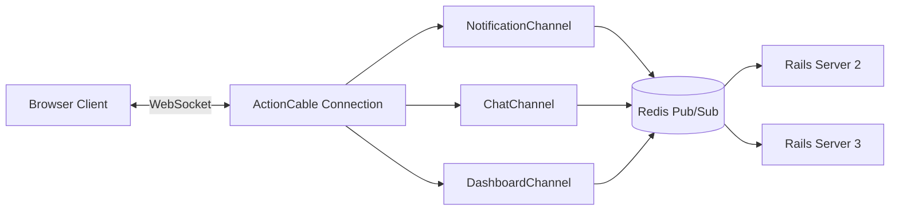
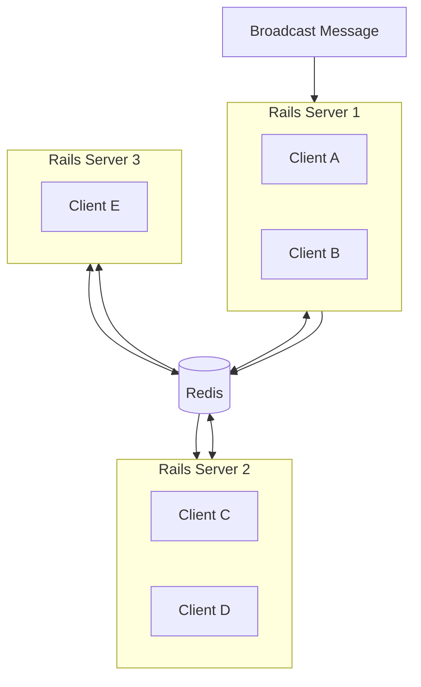

# How to Build Real-Time Features with ActionCable

Author: [nawazdhandala](https://github.com/nawazdhandala)

Tags: Ruby on Rails, ActionCable, WebSockets, Real-Time, Backend Development

Description: Learn how to build real-time features in Ruby on Rails applications using ActionCable. This guide covers channels, broadcasting, authentication, scaling with Redis, and production deployment patterns.

---

Real-time features have become table stakes for modern web applications. Users expect live notifications, instant chat messages, collaborative editing, and dashboards that update without refreshing the page. Ruby on Rails ships with ActionCable, a WebSocket framework built right into the framework. If you are already running a Rails application, you can add real-time features without introducing a separate service or learning a new technology stack.

This guide walks through building production-ready real-time features with ActionCable, from basic setup to scaling across multiple servers.

## How ActionCable Works

ActionCable integrates WebSocket communication with the rest of your Rails application. It uses the same concepts you already know - models, controllers, and helpers - applied to persistent connections.

The architecture consists of three main components:



- **Connection**: Handles authentication and establishes the WebSocket connection
- **Channels**: Handle specific features (like chat or notifications)
- **Subscriptions**: Client-side objects that subscribe to channels

## Basic Setup

ActionCable comes bundled with Rails 5+. You need to configure a few things to get started.

### Configure the Cable Server

First, set up your cable configuration in `config/cable.yml`:

```yaml
# config/cable.yml
development:
  adapter: async  # In-memory adapter for development

test:
  adapter: test

production:
  adapter: redis
  url: <%= ENV.fetch("REDIS_URL") { "redis://localhost:6379/1" } %>
  channel_prefix: myapp_production  # Namespace to avoid conflicts
```

### Mount ActionCable

ActionCable is mounted automatically in Rails 6+, but you can customize the mount point in your routes:

```ruby
# config/routes.rb
Rails.application.routes.draw do
  # Mount ActionCable at /cable (default)
  mount ActionCable.server => '/cable'

  # Your other routes
  root 'home#index'
end
```

### Configure CORS for Production

If your frontend runs on a different domain, configure allowed origins:

```ruby
# config/environments/production.rb
Rails.application.configure do
  config.action_cable.allowed_request_origins = [
    "https://myapp.com",
    "https://www.myapp.com"
  ]

  # Or use a regex for flexibility
  config.action_cable.allowed_request_origins = [
    /https:\/\/.*\.myapp\.com/
  ]
end
```

## Connection Authentication

The connection class handles authentication. Every WebSocket connection goes through this class first.

```ruby
# app/channels/application_cable/connection.rb
module ApplicationCable
  class Connection < ActionCable::Connection::Base
    # This identified_by creates a connection-level variable
    # accessible in all channels
    identified_by :current_user

    def connect
      self.current_user = find_verified_user
    end

    private

    def find_verified_user
      # Option 1: Cookie-based auth (works with Devise/session auth)
      if verified_user = User.find_by(id: cookies.encrypted[:user_id])
        verified_user
      # Option 2: Token-based auth (for API/mobile clients)
      elsif verified_user = User.find_by(auth_token: request.params[:token])
        verified_user
      else
        # Reject the connection - raises ActionCable::Connection::Authorization::UnauthorizedError
        reject_unauthorized_connection
      end
    end
  end
end
```

For applications using Devise, you can extract the user from the warden session:

```ruby
# app/channels/application_cable/connection.rb
def find_verified_user
  # Access Devise session through warden
  if verified_user = env['warden'].user
    verified_user
  else
    reject_unauthorized_connection
  end
end
```

## Building Your First Channel

Channels handle specific real-time features. Let's build a notification channel.

### Server-Side Channel

```ruby
# app/channels/notification_channel.rb
class NotificationChannel < ApplicationCable::Channel
  def subscribed
    # Stream notifications for the current user only
    # The stream name must be unique per user
    stream_from "notifications:#{current_user.id}"

    # Log for debugging - remove in production
    Rails.logger.info "User #{current_user.id} subscribed to notifications"
  end

  def unsubscribed
    # Clean up when the user disconnects
    Rails.logger.info "User #{current_user.id} unsubscribed from notifications"
  end

  # Custom action - clients can call this method
  def mark_as_read(data)
    notification = current_user.notifications.find(data['notification_id'])
    notification.update(read_at: Time.current)

    # Broadcast the updated count back to the user
    broadcast_unread_count
  end

  private

  def broadcast_unread_count
    ActionCable.server.broadcast(
      "notifications:#{current_user.id}",
      {
        type: 'unread_count',
        count: current_user.notifications.unread.count
      }
    )
  end
end
```

### Client-Side Subscription

```javascript
// app/javascript/channels/notification_channel.js
import consumer from "./consumer"

// Create subscription when the page loads
const notificationChannel = consumer.subscriptions.create("NotificationChannel", {
  // Called when successfully connected
  connected() {
    console.log("Connected to notifications")
  },

  // Called when disconnected
  disconnected() {
    console.log("Disconnected from notifications")
  },

  // Called when server broadcasts data to this channel
  received(data) {
    switch(data.type) {
      case 'new_notification':
        // Display the notification to the user
        this.displayNotification(data.notification)
        break
      case 'unread_count':
        // Update the badge counter
        this.updateBadge(data.count)
        break
    }
  },

  // Call server-side mark_as_read method
  markAsRead(notificationId) {
    this.perform('mark_as_read', { notification_id: notificationId })
  },

  displayNotification(notification) {
    const container = document.getElementById('notifications')
    const element = document.createElement('div')
    element.className = 'notification'
    element.innerHTML = `
      <p>${notification.message}</p>
      <small>${notification.created_at}</small>
    `
    container.prepend(element)
  },

  updateBadge(count) {
    const badge = document.getElementById('notification-badge')
    badge.textContent = count > 0 ? count : ''
    badge.style.display = count > 0 ? 'block' : 'none'
  }
})

// Export for use in other parts of the app
export default notificationChannel
```

### Broadcasting from Your Application

You can broadcast from anywhere in your Rails app - models, controllers, background jobs:

```ruby
# From a controller after creating a notification
class NotificationsController < ApplicationController
  def create
    @notification = current_user.notifications.create(notification_params)

    # Broadcast to the user's notification channel
    ActionCable.server.broadcast(
      "notifications:#{@notification.user_id}",
      {
        type: 'new_notification',
        notification: {
          id: @notification.id,
          message: @notification.message,
          created_at: @notification.created_at.strftime('%B %d at %l:%M %p')
        }
      }
    )

    head :created
  end
end

# From a background job
class NotificationBroadcastJob < ApplicationJob
  queue_as :default

  def perform(notification)
    ActionCable.server.broadcast(
      "notifications:#{notification.user_id}",
      {
        type: 'new_notification',
        notification: notification.as_json
      }
    )
  end
end

# From a model callback
class Comment < ApplicationRecord
  after_create_commit :notify_post_author

  private

  def notify_post_author
    return if user_id == post.user_id  # Don't notify yourself

    notification = post.user.notifications.create(
      message: "#{user.name} commented on your post"
    )

    NotificationBroadcastJob.perform_later(notification)
  end
end
```

## Building a Chat Room

Chat rooms require multiple users subscribing to the same stream. Here is a complete implementation.

### Server-Side Channel

```ruby
# app/channels/chat_channel.rb
class ChatChannel < ApplicationCable::Channel
  def subscribed
    @room = ChatRoom.find(params[:room_id])

    # Verify user has access to this room
    unless @room.users.include?(current_user)
      reject
      return
    end

    # Subscribe to the room's stream
    stream_from "chat_room:#{@room.id}"

    # Notify others that user joined
    broadcast_presence('joined')

    # Send list of online users to the new subscriber
    transmit({
      type: 'online_users',
      users: online_users_in_room
    })
  end

  def unsubscribed
    broadcast_presence('left') if @room
  end

  def speak(data)
    # Create the message in the database
    message = @room.messages.create!(
      user: current_user,
      body: data['message']
    )

    # Broadcast to all subscribers
    ActionCable.server.broadcast(
      "chat_room:#{@room.id}",
      {
        type: 'message',
        message: {
          id: message.id,
          body: message.body,
          user_id: current_user.id,
          user_name: current_user.name,
          created_at: message.created_at.iso8601
        }
      }
    )
  end

  def typing
    # Broadcast typing indicator to others (not self)
    ActionCable.server.broadcast(
      "chat_room:#{@room.id}",
      {
        type: 'typing',
        user_id: current_user.id,
        user_name: current_user.name
      }
    )
  end

  private

  def broadcast_presence(action)
    ActionCable.server.broadcast(
      "chat_room:#{@room.id}",
      {
        type: 'presence',
        action: action,
        user_id: current_user.id,
        user_name: current_user.name
      }
    )
  end

  def online_users_in_room
    # Get all connections subscribed to this room
    ActionCable.server.connections.map do |connection|
      connection.current_user
    end.compact.uniq.select do |user|
      @room.users.include?(user)
    end.map do |user|
      { id: user.id, name: user.name }
    end
  end
end
```

### Client-Side Chat Subscription

```javascript
// app/javascript/channels/chat_channel.js
import consumer from "./consumer"

class ChatRoom {
  constructor(roomId) {
    this.roomId = roomId
    this.typingTimeout = null
    this.onlineUsers = new Set()

    // Create the subscription
    this.subscription = consumer.subscriptions.create(
      { channel: "ChatChannel", room_id: roomId },
      {
        connected: () => this.handleConnected(),
        disconnected: () => this.handleDisconnected(),
        received: (data) => this.handleReceived(data)
      }
    )
  }

  handleConnected() {
    console.log(`Connected to chat room ${this.roomId}`)
    document.getElementById('chat-status').textContent = 'Connected'
  }

  handleDisconnected() {
    console.log('Disconnected from chat')
    document.getElementById('chat-status').textContent = 'Reconnecting...'
  }

  handleReceived(data) {
    switch(data.type) {
      case 'message':
        this.appendMessage(data.message)
        break
      case 'presence':
        this.handlePresence(data)
        break
      case 'typing':
        this.showTypingIndicator(data)
        break
      case 'online_users':
        this.updateOnlineUsers(data.users)
        break
    }
  }

  // Send a message
  sendMessage(message) {
    this.subscription.perform('speak', { message: message })
  }

  // Send typing indicator
  sendTyping() {
    // Debounce typing events
    if (!this.typingTimeout) {
      this.subscription.perform('typing')
    }

    clearTimeout(this.typingTimeout)
    this.typingTimeout = setTimeout(() => {
      this.typingTimeout = null
    }, 2000)
  }

  appendMessage(message) {
    const container = document.getElementById('messages')
    const element = document.createElement('div')
    element.className = 'message'
    element.dataset.messageId = message.id
    element.innerHTML = `
      <strong>${message.user_name}:</strong>
      <span>${message.body}</span>
      <time>${new Date(message.created_at).toLocaleTimeString()}</time>
    `
    container.appendChild(element)
    container.scrollTop = container.scrollHeight
  }

  handlePresence(data) {
    if (data.action === 'joined') {
      this.onlineUsers.add(data.user_id)
      this.showSystemMessage(`${data.user_name} joined the chat`)
    } else {
      this.onlineUsers.delete(data.user_id)
      this.showSystemMessage(`${data.user_name} left the chat`)
    }
    this.updateOnlineCount()
  }

  showTypingIndicator(data) {
    const indicator = document.getElementById('typing-indicator')
    indicator.textContent = `${data.user_name} is typing...`
    indicator.style.display = 'block'

    // Hide after 3 seconds
    setTimeout(() => {
      indicator.style.display = 'none'
    }, 3000)
  }

  updateOnlineUsers(users) {
    this.onlineUsers = new Set(users.map(u => u.id))
    this.updateOnlineCount()
  }

  updateOnlineCount() {
    document.getElementById('online-count').textContent = this.onlineUsers.size
  }

  showSystemMessage(text) {
    const container = document.getElementById('messages')
    const element = document.createElement('div')
    element.className = 'system-message'
    element.textContent = text
    container.appendChild(element)
  }

  // Clean up when leaving the page
  disconnect() {
    this.subscription.unsubscribe()
  }
}

export default ChatRoom
```

## Scaling with Redis

When you run multiple Rails servers (which you should in production), ActionCable needs a shared pub/sub backend. Redis is the standard choice.

### Why Redis is Required

Without Redis, each Rails server maintains its own set of WebSocket connections. A broadcast from Server A only reaches clients connected to Server A. Redis acts as a message bus that relays broadcasts to all servers.



### Redis Configuration

```yaml
# config/cable.yml
production:
  adapter: redis
  url: <%= ENV.fetch("REDIS_URL") %>
  channel_prefix: myapp_production

  # Connection pool settings
  pool_size: <%= ENV.fetch("RAILS_MAX_THREADS") { 5 } %>
```

For high-availability setups with Redis Sentinel:

```yaml
# config/cable.yml
production:
  adapter: redis
  url: redis://mymaster/1
  sentinels:
    - host: sentinel1.example.com
      port: 26379
    - host: sentinel2.example.com
      port: 26379
    - host: sentinel3.example.com
      port: 26379
```

## Connection Management

### Handling Reconnection

ActionCable automatically reconnects when the connection drops, but you should handle the reconnection state in your UI:

```javascript
// app/javascript/channels/consumer.js
import { createConsumer } from "@rails/actioncable"

const consumer = createConsumer()

// Monitor connection state
consumer.connection.monitor.start()

// Add custom reconnection handling
const originalReopen = consumer.connection.reopen.bind(consumer.connection)
consumer.connection.reopen = function() {
  console.log('Attempting to reconnect...')
  document.body.classList.add('websocket-reconnecting')
  return originalReopen()
}

export default consumer
```

### Graceful Degradation

If WebSocket connections fail, you can fall back to polling:

```javascript
// app/javascript/channels/notification_channel.js
let pollingInterval = null

const notificationChannel = consumer.subscriptions.create("NotificationChannel", {
  connected() {
    // Stop polling when WebSocket connects
    if (pollingInterval) {
      clearInterval(pollingInterval)
      pollingInterval = null
    }
  },

  disconnected() {
    // Start polling as fallback
    pollingInterval = setInterval(() => {
      fetch('/notifications/poll.json')
        .then(response => response.json())
        .then(data => this.received(data))
    }, 5000)
  },

  received(data) {
    // Handle data from either WebSocket or polling
  }
})
```

## Performance Tips

### Use Background Jobs for Broadcasts

Heavy processing should happen in background jobs, not during the broadcast:

```ruby
# Bad - blocks the request
def create
  @message = Message.create!(message_params)

  # This runs synchronously
  ActionCable.server.broadcast(
    "chat_room:#{@message.room_id}",
    render_message(@message)  # Slow rendering
  )
end

# Good - non-blocking
def create
  @message = Message.create!(message_params)
  MessageBroadcastJob.perform_later(@message)
end
```

### Batch Broadcasts

When sending multiple updates, batch them to reduce network overhead:

```ruby
# Instead of multiple broadcasts
items.each do |item|
  ActionCable.server.broadcast("dashboard:#{user_id}", item.to_json)
end

# Send one broadcast with all items
ActionCable.server.broadcast(
  "dashboard:#{user_id}",
  { type: 'bulk_update', items: items.map(&:to_json) }
)
```

### Monitor Connection Count

Track WebSocket connections to understand your capacity needs:

```ruby
# config/initializers/action_cable_metrics.rb
ActiveSupport::Notifications.subscribe('action_cable.connection_established') do |*args|
  StatsD.increment('actioncable.connections')
end

ActiveSupport::Notifications.subscribe('action_cable.connection_rejected') do |*args|
  StatsD.increment('actioncable.rejections')
end
```

## Production Deployment

### NGINX Configuration

NGINX needs specific settings to proxy WebSocket connections:

```nginx
upstream rails_app {
    server unix:///var/run/puma.sock fail_timeout=0;
}

server {
    listen 80;
    server_name myapp.com;

    # WebSocket endpoint
    location /cable {
        proxy_pass http://rails_app;
        proxy_http_version 1.1;

        # Required for WebSocket upgrade
        proxy_set_header Upgrade $http_upgrade;
        proxy_set_header Connection "upgrade";

        # Forward headers
        proxy_set_header Host $host;
        proxy_set_header X-Real-IP $remote_addr;
        proxy_set_header X-Forwarded-For $proxy_add_x_forwarded_for;
        proxy_set_header X-Forwarded-Proto $scheme;

        # Increase timeout for long-lived connections
        proxy_read_timeout 86400;
        proxy_send_timeout 86400;
    }

    # Regular HTTP traffic
    location / {
        proxy_pass http://rails_app;
        proxy_set_header Host $host;
        proxy_set_header X-Real-IP $remote_addr;
    }
}
```

### Puma Configuration

Configure Puma to handle WebSocket connections:

```ruby
# config/puma.rb
workers ENV.fetch("WEB_CONCURRENCY") { 2 }
threads_count = ENV.fetch("RAILS_MAX_THREADS") { 5 }
threads threads_count, threads_count

# Bind to socket for NGINX
bind "unix:///var/run/puma.sock"

# ActionCable requires a minimum thread pool
# Each WebSocket connection uses one thread while active
```

## Testing ActionCable

### Channel Tests

```ruby
# test/channels/notification_channel_test.rb
require 'test_helper'

class NotificationChannelTest < ActionCable::Channel::TestCase
  test "subscribes to user notifications" do
    user = users(:one)
    stub_connection current_user: user

    subscribe

    assert subscription.confirmed?
    assert_has_stream "notifications:#{user.id}"
  end

  test "rejects subscription without user" do
    stub_connection current_user: nil

    subscribe

    assert subscription.rejected?
  end

  test "marks notification as read" do
    user = users(:one)
    notification = user.notifications.create(message: "Test")
    stub_connection current_user: user

    subscribe
    perform :mark_as_read, notification_id: notification.id

    assert notification.reload.read_at.present?
  end
end
```

### Integration Tests with Capybara

```ruby
# test/system/chat_test.rb
require "application_system_test_case"

class ChatTest < ApplicationSystemTestCase
  test "sending a message" do
    user = users(:one)
    room = chat_rooms(:general)

    sign_in user
    visit chat_room_path(room)

    fill_in "message", with: "Hello everyone!"
    click_button "Send"

    # Message should appear in the chat
    assert_selector ".message", text: "Hello everyone!"
  end
end
```

## Summary

ActionCable provides a straightforward path to adding real-time features to Rails applications. The key points to remember:

| Component | Purpose |
|-----------|---------|
| Connection | Authenticates and identifies users |
| Channels | Handle specific features (chat, notifications) |
| Streams | Pub/sub channels for broadcasting |
| Redis | Required for multi-server deployments |

Start with simple features like notifications, then expand to more complex use cases like chat or collaborative editing. The same patterns apply regardless of the feature complexity.

For production deployments, always use Redis as your adapter, configure NGINX properly for WebSocket connections, and monitor your connection counts to ensure you have adequate capacity. With these fundamentals in place, ActionCable can handle thousands of concurrent connections reliably.
