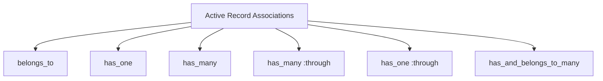
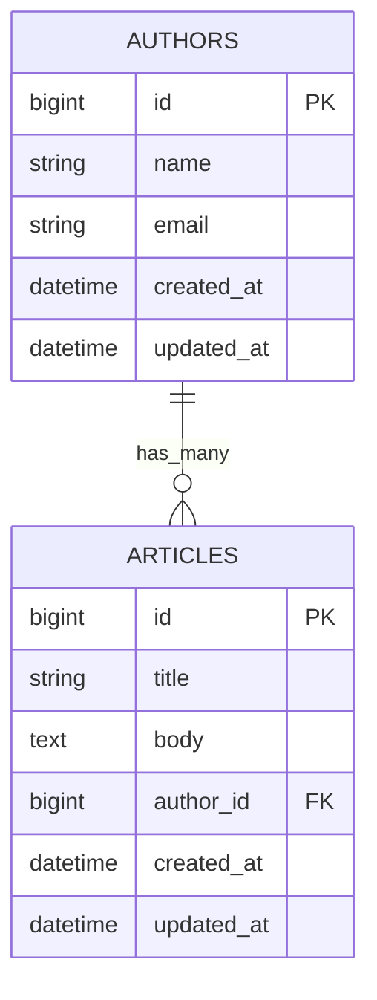
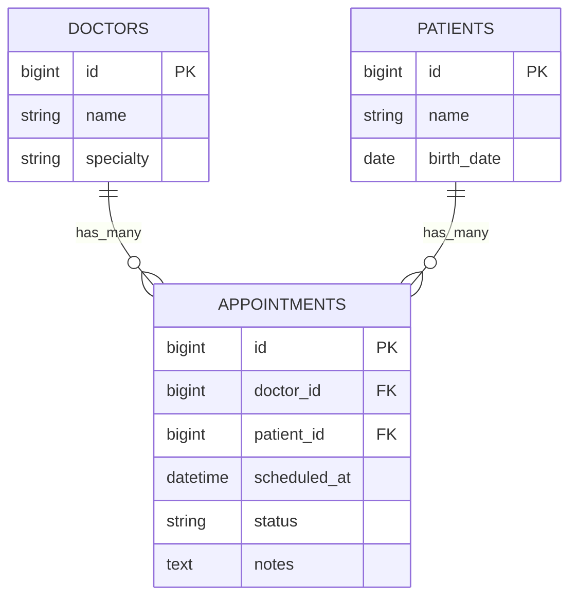
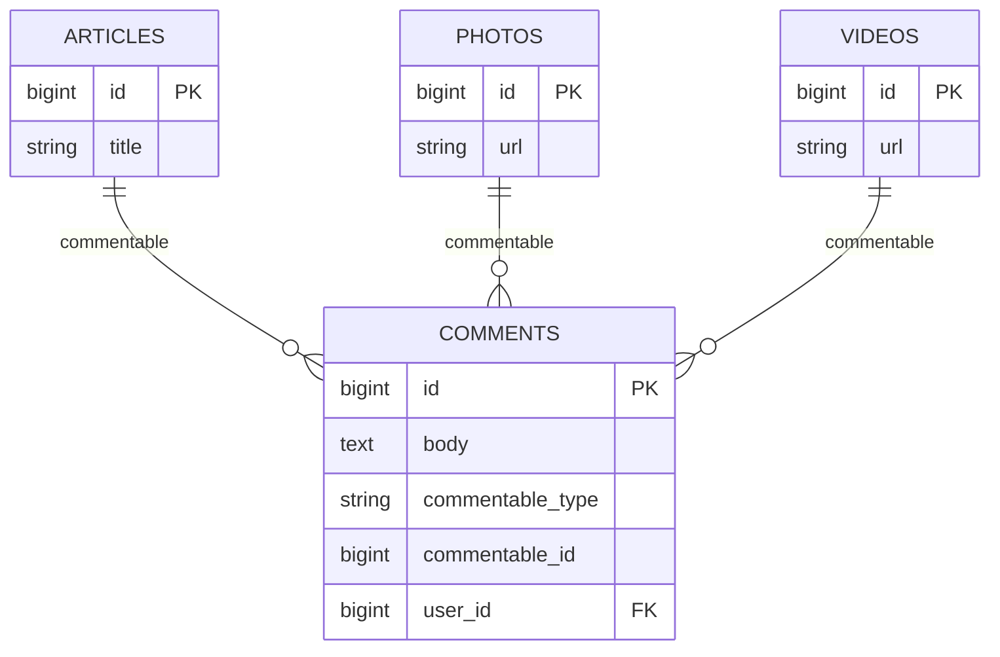
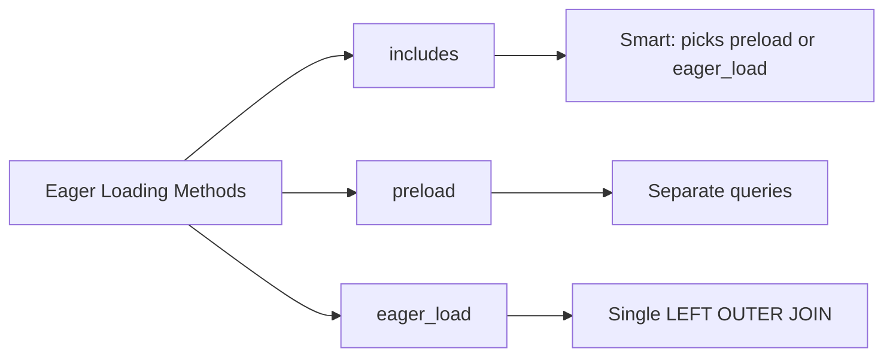

# How to Use Active Record Associations Effectively

Author: [nawazdhandala](https://www.github.com/nawazdhandala)

Tags: Ruby on Rails, Active Record, Associations, Database, ORM

Description: Learn how to use Active Record associations effectively with belongs_to, has_many, has_many through, polymorphic associations, and eager loading.

---

Active Record associations define relationships between models, allowing you to query and manipulate related data with minimal code. Getting associations right means fewer database queries, cleaner models, and faster applications. This guide walks through each association type with practical examples and shows how to avoid common performance pitfalls.

## Understanding the Core Association Types

Active Record provides six association types that cover most relationship patterns you will encounter:



Each association type handles a specific relationship pattern. Choosing the right one determines how Rails generates SQL and manages foreign keys.

## belongs_to and has_many: The Foundation

The `belongs_to` and `has_many` pair forms the backbone of most Rails applications. The model with `belongs_to` holds the foreign key.

```ruby
# app/models/author.rb
class Author < ApplicationRecord
  # An author can write many articles
  # No foreign key in this table
  has_many :articles, dependent: :destroy
end

# app/models/article.rb
class Article < ApplicationRecord
  # Each article belongs to one author
  # This table has the author_id foreign key
  belongs_to :author
end
```

The database schema reflects this relationship:

```ruby
# db/migrate/20260126000001_create_authors.rb
class CreateAuthors < ActiveRecord::Migration[7.1]
  def change
    create_table :authors do |t|
      t.string :name, null: false
      t.string :email
      t.timestamps
    end
  end
end

# db/migrate/20260126000002_create_articles.rb
class CreateArticles < ActiveRecord::Migration[7.1]
  def change
    create_table :articles do |t|
      t.string :title, null: false
      t.text :body
      # The foreign key goes on the belongs_to side
      t.references :author, null: false, foreign_key: true
      t.timestamps
    end

    # Add an index for faster lookups
    add_index :articles, [:author_id, :created_at]
  end
end
```

Here is how the relationship looks in the database:



With these associations in place, you can traverse relationships in both directions:

```ruby
# Find all articles by an author
author = Author.find(1)
author.articles
# SELECT * FROM articles WHERE author_id = 1

# Find the author of an article
article = Article.find(1)
article.author
# SELECT * FROM authors WHERE id = 1 LIMIT 1

# Create an article for an author
author.articles.create(title: "Getting Started", body: "...")
# INSERT INTO articles (title, body, author_id, ...) VALUES (...)
```

## has_one: Single Child Relationships

Use `has_one` when a parent has exactly one child record. The foreign key still lives on the child table.

```ruby
# app/models/user.rb
class User < ApplicationRecord
  # Each user has one profile
  has_one :profile, dependent: :destroy
end

# app/models/profile.rb
class Profile < ApplicationRecord
  # The profile belongs to a user
  # This table holds user_id
  belongs_to :user
end
```

Building the child record works slightly differently than with `has_many`:

```ruby
user = User.find(1)

# Build without saving
profile = user.build_profile(bio: "Software engineer", location: "NYC")

# Create and save in one step
profile = user.create_profile(bio: "Software engineer", location: "NYC")

# Replace existing profile (destroys old one if dependent: :destroy)
user.profile = Profile.new(bio: "Updated bio")
```

## has_many :through: Join Models with Attributes

When a many-to-many relationship needs additional data, use `has_many :through` with an explicit join model. This approach gives you a place to store relationship-specific attributes.



The models express this three-way relationship:

```ruby
# app/models/doctor.rb
class Doctor < ApplicationRecord
  has_many :appointments, dependent: :destroy
  # Access patients through the appointments join model
  has_many :patients, through: :appointments
end

# app/models/patient.rb
class Patient < ApplicationRecord
  has_many :appointments, dependent: :destroy
  # Access doctors through the appointments join model
  has_many :doctors, through: :appointments
end

# app/models/appointment.rb
class Appointment < ApplicationRecord
  belongs_to :doctor
  belongs_to :patient

  # The join model can have its own validations
  validates :scheduled_at, presence: true
  validates :status, inclusion: { in: %w[scheduled confirmed cancelled completed] }

  # And scopes
  scope :upcoming, -> { where("scheduled_at > ?", Time.current).order(:scheduled_at) }
  scope :for_date, ->(date) { where(scheduled_at: date.all_day) }
end
```

Working with through associations:

```ruby
doctor = Doctor.find(1)
patient = Patient.find(1)

# Create an appointment (the proper way)
appointment = Appointment.create!(
  doctor: doctor,
  patient: patient,
  scheduled_at: 1.week.from_now,
  status: "scheduled"
)

# Access related records
doctor.patients          # All patients who have appointments with this doctor
patient.doctors          # All doctors this patient has seen
doctor.appointments.upcoming  # Upcoming appointments for this doctor

# You can also use the << operator, but you lose control over join attributes
# This creates an appointment with nil scheduled_at (probably not what you want)
doctor.patients << patient
```

## Polymorphic Associations: One Model, Multiple Parents

Polymorphic associations let a model belong to multiple other models using a single association. This works well for features like comments, tags, or attachments that apply to different resource types.



The implementation uses two columns to track the parent:

```ruby
# db/migrate/20260126000003_create_comments.rb
class CreateComments < ActiveRecord::Migration[7.1]
  def change
    create_table :comments do |t|
      t.text :body, null: false
      t.references :user, null: false, foreign_key: true
      # Polymorphic reference creates both commentable_type and commentable_id
      t.references :commentable, polymorphic: true, null: false
      t.timestamps
    end

    # Composite index for polymorphic lookups
    add_index :comments, [:commentable_type, :commentable_id]
  end
end
```

```ruby
# app/models/comment.rb
class Comment < ApplicationRecord
  belongs_to :user
  # Polymorphic association - can belong to any commentable model
  belongs_to :commentable, polymorphic: true
end

# app/models/article.rb
class Article < ApplicationRecord
  has_many :comments, as: :commentable, dependent: :destroy
end

# app/models/photo.rb
class Photo < ApplicationRecord
  has_many :comments, as: :commentable, dependent: :destroy
end

# app/models/video.rb
class Video < ApplicationRecord
  has_many :comments, as: :commentable, dependent: :destroy
end
```

Using polymorphic associations:

```ruby
article = Article.find(1)
photo = Photo.find(1)

# Add comments to different types
article.comments.create!(body: "Great article!", user: current_user)
photo.comments.create!(body: "Beautiful shot!", user: current_user)

# Access works the same way regardless of parent type
article.comments
photo.comments

# Access the parent from a comment
comment = Comment.find(1)
comment.commentable  # Returns either an Article, Photo, or Video
comment.commentable_type  # "Article", "Photo", or "Video"
comment.commentable_id    # The ID of the parent record
```

## Eager Loading: Solving N+1 Queries

The N+1 query problem occurs when you load a collection and then access an association on each item. Without eager loading, Rails issues a separate query for each record.

```ruby
# N+1 problem: 1 query for articles + N queries for authors
articles = Article.limit(10)
articles.each do |article|
  puts article.author.name  # Each iteration hits the database
end
# SELECT * FROM articles LIMIT 10
# SELECT * FROM authors WHERE id = 1 LIMIT 1
# SELECT * FROM authors WHERE id = 2 LIMIT 1
# ... 8 more queries
```

Rails provides three methods to eager load associations:



### includes: The Smart Default

Use `includes` as your default choice. Rails decides whether to use separate queries or a join based on your query conditions.

```ruby
# Eager load authors with articles
articles = Article.includes(:author).limit(10)
articles.each do |article|
  puts article.author.name  # No additional queries
end
# SELECT * FROM articles LIMIT 10
# SELECT * FROM authors WHERE id IN (1, 2, 3, ...)

# When you filter on the association, Rails uses a JOIN
articles = Article.includes(:author).where(authors: { active: true })
# SELECT articles.*, authors.* FROM articles
#   LEFT OUTER JOIN authors ON authors.id = articles.author_id
#   WHERE authors.active = true
```

### preload: Always Separate Queries

Use `preload` when you want predictable separate queries, especially for large result sets where a join would be inefficient.

```ruby
# Always uses separate queries
articles = Article.preload(:author, :comments).limit(100)
# SELECT * FROM articles LIMIT 100
# SELECT * FROM authors WHERE id IN (...)
# SELECT * FROM comments WHERE article_id IN (...)
```

### eager_load: Always a Single JOIN

Use `eager_load` when you need to filter or sort by association columns.

```ruby
# Always uses LEFT OUTER JOIN
articles = Article.eager_load(:author)
                  .where("authors.created_at > ?", 1.year.ago)
                  .order("authors.name")
# SELECT articles.*, authors.* FROM articles
#   LEFT OUTER JOIN authors ON authors.id = articles.author_id
#   WHERE authors.created_at > '2025-01-26'
#   ORDER BY authors.name
```

### Nested Eager Loading

Load multiple levels of associations at once:

```ruby
# Load articles with authors and each author's profile
Article.includes(author: :profile)

# Load articles with authors, comments, and each comment's user
Article.includes(:author, comments: :user)

# Complex nested loading
Doctor.includes(
  appointments: [:patient, :clinic],
  specializations: :department
)
```

## Association Options Worth Knowing

### dependent: Control Deletion Behavior

The `dependent` option determines what happens to associated records when the parent is destroyed.

```ruby
class Author < ApplicationRecord
  # Delete associated articles when author is destroyed
  has_many :articles, dependent: :destroy

  # Other options:
  # dependent: :delete_all   - Delete without callbacks (faster)
  # dependent: :nullify      - Set foreign key to NULL
  # dependent: :restrict_with_error  - Prevent deletion if children exist
  # dependent: :restrict_with_exception  - Raise exception if children exist
end
```

### counter_cache: Avoid COUNT Queries

When you frequently need counts of associated records, use counter caching to avoid repeated COUNT queries.

```ruby
# Migration to add the counter cache column
class AddArticlesCountToAuthors < ActiveRecord::Migration[7.1]
  def change
    add_column :authors, :articles_count, :integer, default: 0, null: false

    # Populate existing counts
    Author.find_each do |author|
      Author.reset_counters(author.id, :articles)
    end
  end
end

# app/models/article.rb
class Article < ApplicationRecord
  belongs_to :author, counter_cache: true
end

# Now author.articles_count returns the cached value
# No COUNT query needed
author.articles_count
```

### inverse_of: Optimize Memory Usage

The `inverse_of` option tells Rails about bidirectional associations, preventing duplicate object instantiation.

```ruby
class Author < ApplicationRecord
  has_many :articles, inverse_of: :author
end

class Article < ApplicationRecord
  belongs_to :author, inverse_of: :articles
end

# With inverse_of, these return the same object
author = Author.first
article = author.articles.first
article.author.object_id == author.object_id  # true

# Without inverse_of, Rails might create separate objects
# leading to inconsistencies when modifying attributes
```

### scope: Filter Associated Records

Add default conditions to associations:

```ruby
class Author < ApplicationRecord
  has_many :articles
  has_many :published_articles, -> { where(published: true) }, class_name: "Article"
  has_many :recent_articles, -> { where("created_at > ?", 1.month.ago).order(created_at: :desc) }, class_name: "Article"
end

# Use the scoped associations
author.published_articles
author.recent_articles.limit(5)
```

## Best Practices Summary

1. **Always specify dependent options** on has_many and has_one associations. Orphaned records cause data integrity issues.

2. **Use counter_cache for frequently accessed counts**. Displaying "Author has 42 articles" should not require a COUNT query.

3. **Prefer has_many :through over has_and_belongs_to_many**. You will almost always need attributes on the join model eventually.

4. **Index foreign keys**. Rails migrations do this automatically with `references`, but verify your indexes exist.

5. **Use includes by default for eager loading**. Switch to preload or eager_load only when you need specific behavior.

6. **Set inverse_of explicitly** when association names do not follow conventions or when you need consistent in-memory objects.

7. **Keep polymorphic associations simple**. If you find yourself adding complex conditions, consider separate associations instead.

8. **Monitor your queries in development**. Use tools like bullet gem or rack-mini-profiler to catch N+1 queries before they reach production.

---

Active Record associations give you a declarative way to express relationships between models. The key to using them effectively is understanding how each option translates to SQL and affects memory usage. Start with the simplest association that meets your needs, add eager loading when you see N+1 patterns, and use options like counter_cache and inverse_of to optimize specific bottlenecks.
