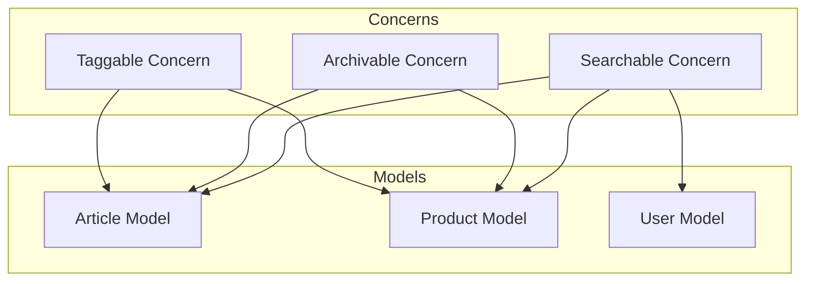
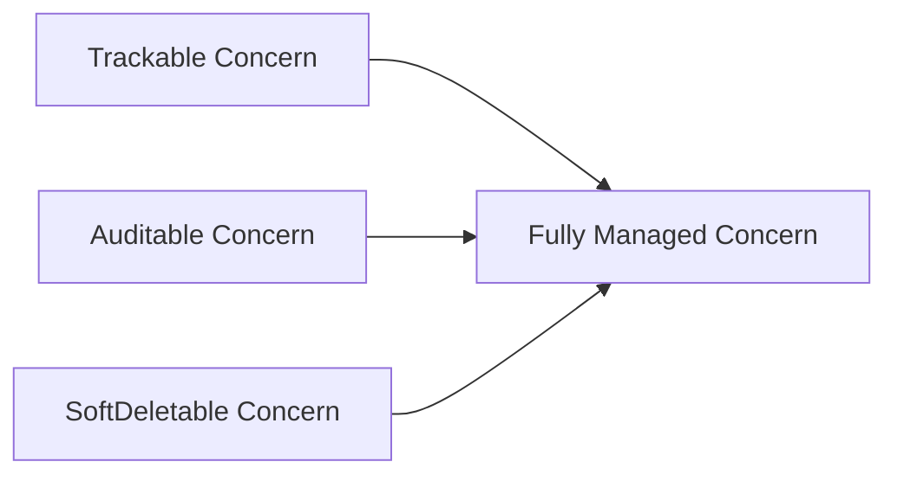
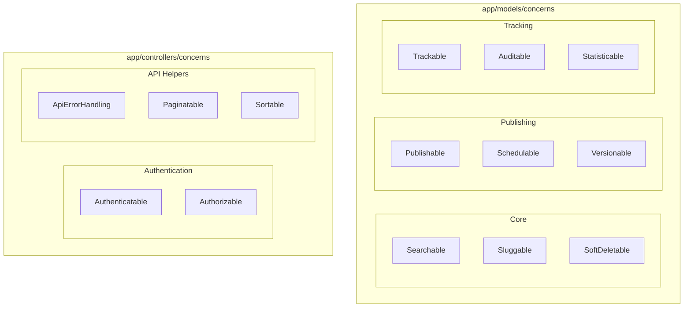

# How to Use Rails Concerns for Code Reuse

Author: [nawazdhandala](https://www.github.com/nawazdhandala)

Tags: Ruby on Rails, Concerns, Code Reuse, DRY, ActiveSupport, Mixins, Best Practices

Description: Learn how to use Rails Concerns to extract shared behavior into reusable modules, keeping your models and controllers DRY and maintainable.

---

As Rails applications grow, you often find yourself repeating similar code across multiple models or controllers. Maybe several models need soft-delete functionality, or multiple controllers share authentication logic. Rails Concerns provide an elegant solution for extracting this shared behavior into reusable modules.

## What Are Rails Concerns?

Concerns are modules that extend `ActiveSupport::Concern`, giving you a clean way to add shared functionality to classes. They live in `app/models/concerns/` for model-related code and `app/controllers/concerns/` for controller-related code.



Unlike plain Ruby modules, concerns provide three key features:
- Class methods via `class_methods` block
- Code execution at include time via `included` block
- Dependency management between concerns

## Creating Your First Concern

Let's start with a practical example: a `Searchable` concern that adds full-text search capabilities to any model.

```ruby
# app/models/concerns/searchable.rb

module Searchable
  # ActiveSupport::Concern provides the special blocks
  # we use below: included and class_methods
  extend ActiveSupport::Concern

  # Code inside 'included' runs when the concern is included
  # in a class. This is where you put scopes, validations,
  # callbacks, and associations.
  included do
    # Define a scope that searches across multiple columns
    # The columns to search are defined by each model
    scope :search, ->(query) {
      return all if query.blank?

      # Build a WHERE clause that checks each searchable column
      columns = searchable_columns.map { |col| "#{col} ILIKE :query" }
      where(columns.join(' OR '), query: "%#{query}%")
    }
  end

  # Methods defined in class_methods become class methods
  # on the including class (e.g., Article.search_by)
  class_methods do
    # Each model defines which columns are searchable
    # Default to an empty array if not specified
    def searchable_columns
      @searchable_columns ||= []
    end

    # DSL method for models to declare searchable columns
    # Usage: searchable :title, :body, :author_name
    def searchable(*columns)
      @searchable_columns = columns.map(&:to_s)
    end
  end

  # Instance methods defined at the module level become
  # instance methods on the including class
  def matches_search?(query)
    return true if query.blank?

    # Check if any searchable column contains the query
    self.class.searchable_columns.any? do |column|
      value = send(column)
      value.to_s.downcase.include?(query.downcase)
    end
  end
end
```

Now any model can become searchable:

```ruby
# app/models/article.rb

class Article < ApplicationRecord
  # Include the concern to add search functionality
  include Searchable

  # Declare which columns should be searchable
  searchable :title, :body, :summary

  belongs_to :author
  has_many :comments
end
```

```ruby
# app/models/product.rb

class Product < ApplicationRecord
  include Searchable

  # Products have different searchable columns
  searchable :name, :description, :sku

  belongs_to :category
  has_many :reviews
end
```

Using the search functionality:

```ruby
# Search articles by title, body, or summary
Article.search('rails concerns')

# Search products by name, description, or SKU
Product.search('wireless keyboard')

# Chain with other scopes
Article.published.search('tutorial').order(created_at: :desc)
```

## A Real-World Example: Soft Delete Concern

Soft delete is a common pattern where records are marked as deleted instead of being removed from the database. This is perfect for a concern.

```ruby
# app/models/concerns/soft_deletable.rb

module SoftDeletable
  extend ActiveSupport::Concern

  included do
    # Default scope excludes soft-deleted records
    # This means Article.all only returns non-deleted articles
    default_scope { where(deleted_at: nil) }

    # Scope to find only deleted records
    scope :deleted, -> { unscope(where: :deleted_at).where.not(deleted_at: nil) }

    # Scope to include deleted records in queries
    scope :with_deleted, -> { unscope(where: :deleted_at) }

    # Scope to find records deleted within a time range
    scope :deleted_between, ->(start_date, end_date) {
      unscope(where: :deleted_at)
        .where(deleted_at: start_date..end_date)
    }
  end

  # Soft delete the record by setting deleted_at timestamp
  # Returns true if successful, false otherwise
  def soft_delete
    update(deleted_at: Time.current)
  end

  # Soft delete with a bang - raises exception on failure
  def soft_delete!
    update!(deleted_at: Time.current)
  end

  # Restore a soft-deleted record
  def restore
    update(deleted_at: nil)
  end

  # Check if record is soft-deleted
  def deleted?
    deleted_at.present?
  end

  # Override destroy to perform soft delete instead
  # Call really_destroy! if you need actual deletion
  def destroy
    soft_delete
  end

  # Actually remove the record from the database
  def really_destroy!
    # Use unscoped to bypass the default scope
    self.class.unscoped { super }
  end

  class_methods do
    # Soft delete multiple records at once
    def soft_delete_all
      update_all(deleted_at: Time.current)
    end

    # Restore all soft-deleted records
    def restore_all
      unscope(where: :deleted_at)
        .where.not(deleted_at: nil)
        .update_all(deleted_at: nil)
    end
  end
end
```

The migration to support soft delete:

```ruby
# db/migrate/20260126000000_add_deleted_at_to_articles.rb

class AddDeletedAtToArticles < ActiveRecord::Migration[7.1]
  def change
    # Add deleted_at column with an index for performance
    # The index helps the default scope query efficiently
    add_column :articles, :deleted_at, :datetime
    add_index :articles, :deleted_at
  end
end
```

Using soft delete in your models:

```ruby
# app/models/article.rb

class Article < ApplicationRecord
  include SoftDeletable

  belongs_to :author
  has_many :comments, dependent: :destroy
end
```

```ruby
# Usage examples

article = Article.find(1)

# Soft delete the article
article.soft_delete
# => true

# The article is now excluded from normal queries
Article.find_by(id: 1)
# => nil

# But you can still find it with the right scope
Article.with_deleted.find(1)
# => #<Article id: 1, deleted_at: "2026-01-26 10:30:00">

# Restore the article
article.restore
# => true

# Find all articles deleted last month
Article.deleted_between(1.month.ago, Time.current)
```

## Controller Concerns for Authentication

Concerns are not limited to models. Controller concerns help you share behavior across controllers.

```ruby
# app/controllers/concerns/authenticatable.rb

module Authenticatable
  extend ActiveSupport::Concern

  included do
    # Run authentication before every action
    before_action :authenticate_user!

    # Store the current user in an instance variable accessible
    # to all controller actions and views
    helper_method :current_user, :user_signed_in?
  end

  private

  # Find the current user from the session or token
  def current_user
    @current_user ||= find_current_user
  end

  # Check if a user is currently signed in
  def user_signed_in?
    current_user.present?
  end

  # Redirect to login if no valid user session exists
  def authenticate_user!
    unless user_signed_in?
      respond_to do |format|
        format.html { redirect_to login_path, alert: 'Please sign in to continue.' }
        format.json { render json: { error: 'Unauthorized' }, status: :unauthorized }
      end
    end
  end

  # Find user from session (web) or token (API)
  def find_current_user
    if session[:user_id]
      User.find_by(id: session[:user_id])
    elsif request.headers['Authorization'].present?
      authenticate_with_token
    end
  end

  # Extract and verify JWT token from Authorization header
  def authenticate_with_token
    token = request.headers['Authorization']&.split(' ')&.last
    return nil unless token

    begin
      # Decode the JWT token and find the user
      payload = JWT.decode(token, Rails.application.secret_key_base, true, algorithm: 'HS256')
      User.find_by(id: payload.first['user_id'])
    rescue JWT::DecodeError
      nil
    end
  end
end
```

```ruby
# app/controllers/concerns/api_error_handling.rb

module ApiErrorHandling
  extend ActiveSupport::Concern

  included do
    # Rescue common exceptions and return appropriate JSON responses
    rescue_from ActiveRecord::RecordNotFound, with: :record_not_found
    rescue_from ActiveRecord::RecordInvalid, with: :record_invalid
    rescue_from ActionController::ParameterMissing, with: :parameter_missing
  end

  private

  def record_not_found(exception)
    render json: {
      error: 'Record not found',
      message: exception.message,
      status: 404
    }, status: :not_found
  end

  def record_invalid(exception)
    render json: {
      error: 'Validation failed',
      messages: exception.record.errors.full_messages,
      status: 422
    }, status: :unprocessable_entity
  end

  def parameter_missing(exception)
    render json: {
      error: 'Missing parameter',
      message: exception.message,
      status: 400
    }, status: :bad_request
  end

  # Helper method for consistent success responses
  def render_success(data, status: :ok)
    render json: { data: data, status: status }, status: status
  end

  # Helper method for consistent error responses
  def render_error(message, status: :bad_request)
    render json: { error: message, status: status }, status: status
  end
end
```

Using controller concerns:

```ruby
# app/controllers/api/v1/base_controller.rb

module Api
  module V1
    class BaseController < ActionController::API
      # Include shared functionality for all API controllers
      include Authenticatable
      include ApiErrorHandling
    end
  end
end
```

```ruby
# app/controllers/api/v1/articles_controller.rb

module Api
  module V1
    class ArticlesController < BaseController
      # Skip authentication for public endpoints
      skip_before_action :authenticate_user!, only: [:index, :show]

      def index
        articles = Article.published.search(params[:q])
        render_success(articles)
      end

      def show
        article = Article.find(params[:id])
        render_success(article)
      end

      def create
        # current_user is available from Authenticatable concern
        article = current_user.articles.create!(article_params)
        render_success(article, status: :created)
      end

      private

      def article_params
        params.require(:article).permit(:title, :body, :summary)
      end
    end
  end
end
```

## Concern Dependencies and Load Order

Sometimes concerns depend on other concerns. Rails handles this with the `included` block and proper module design.



```ruby
# app/models/concerns/trackable.rb

module Trackable
  extend ActiveSupport::Concern

  included do
    # Track who created and updated the record
    belongs_to :created_by, class_name: 'User', optional: true
    belongs_to :updated_by, class_name: 'User', optional: true

    before_create :set_created_by
    before_update :set_updated_by
  end

  private

  def set_created_by
    self.created_by ||= Current.user
  end

  def set_updated_by
    self.updated_by = Current.user if Current.user
  end
end
```

```ruby
# app/models/concerns/auditable.rb

module Auditable
  extend ActiveSupport::Concern

  included do
    # Create audit log entries after changes
    after_create { create_audit_log('create') }
    after_update { create_audit_log('update') }
    after_destroy { create_audit_log('destroy') }
  end

  private

  def create_audit_log(action)
    AuditLog.create!(
      auditable: self,
      action: action,
      user: Current.user,
      changes: saved_changes.except('updated_at'),
      ip_address: Current.ip_address
    )
  end
end
```

```ruby
# app/models/concerns/fully_managed.rb

module FullyManaged
  extend ActiveSupport::Concern

  # Include dependent concerns
  # Order matters - Trackable should run before Auditable
  # so the created_by/updated_by fields are set before audit
  included do
    include Trackable
    include Auditable
    include SoftDeletable
  end
end
```

Now a model can include all behaviors with one line:

```ruby
# app/models/document.rb

class Document < ApplicationRecord
  # Gets tracking, auditing, and soft delete functionality
  include FullyManaged

  belongs_to :folder
  has_many_attached :files
end
```

## Testing Concerns

Testing concerns separately ensures they work correctly before including them in models.

```ruby
# spec/models/concerns/searchable_spec.rb

require 'rails_helper'

RSpec.describe Searchable do
  # Create a temporary class to test the concern
  # This isolates the test from any specific model
  let(:searchable_class) do
    Class.new(ApplicationRecord) do
      self.table_name = 'articles'

      include Searchable
      searchable :title, :body
    end
  end

  describe '.search' do
    before do
      # Create test records
      searchable_class.create!(title: 'Ruby Tutorial', body: 'Learn Ruby basics')
      searchable_class.create!(title: 'Rails Guide', body: 'Building web apps')
      searchable_class.create!(title: 'JavaScript Intro', body: 'Frontend development')
    end

    it 'finds records matching the query in title' do
      results = searchable_class.search('Ruby')
      expect(results.count).to eq(1)
      expect(results.first.title).to eq('Ruby Tutorial')
    end

    it 'finds records matching the query in body' do
      results = searchable_class.search('web apps')
      expect(results.count).to eq(1)
      expect(results.first.title).to eq('Rails Guide')
    end

    it 'returns all records when query is blank' do
      results = searchable_class.search('')
      expect(results.count).to eq(3)
    end

    it 'is case insensitive' do
      results = searchable_class.search('RUBY')
      expect(results.count).to eq(1)
    end
  end

  describe '#matches_search?' do
    let(:record) { searchable_class.new(title: 'Test Article', body: 'Some content') }

    it 'returns true when query matches' do
      expect(record.matches_search?('Test')).to be true
    end

    it 'returns false when query does not match' do
      expect(record.matches_search?('nonexistent')).to be false
    end

    it 'returns true for blank query' do
      expect(record.matches_search?('')).to be true
    end
  end
end
```

```ruby
# spec/models/concerns/soft_deletable_spec.rb

require 'rails_helper'

RSpec.describe SoftDeletable do
  let(:article) { create(:article) }

  describe '#soft_delete' do
    it 'sets deleted_at timestamp' do
      freeze_time do
        article.soft_delete
        expect(article.deleted_at).to eq(Time.current)
      end
    end

    it 'excludes record from default scope' do
      article.soft_delete
      expect(Article.find_by(id: article.id)).to be_nil
    end
  end

  describe '#restore' do
    before { article.soft_delete }

    it 'clears deleted_at timestamp' do
      article.restore
      expect(article.deleted_at).to be_nil
    end

    it 'makes record visible in default scope' do
      article.restore
      expect(Article.find_by(id: article.id)).to eq(article)
    end
  end

  describe '.with_deleted' do
    before { article.soft_delete }

    it 'includes soft-deleted records' do
      expect(Article.with_deleted).to include(article)
    end
  end

  describe '.deleted' do
    let!(:active_article) { create(:article) }
    let!(:deleted_article) { create(:article, deleted_at: 1.day.ago) }

    it 'returns only soft-deleted records' do
      results = Article.deleted
      expect(results).to include(deleted_article)
      expect(results).not_to include(active_article)
    end
  end
end
```

## Best Practices for Concerns

### 1. Keep Concerns Focused

Each concern should handle one responsibility.

```ruby
# Good: Single responsibility
module Publishable
  extend ActiveSupport::Concern

  included do
    scope :published, -> { where(published: true) }
    scope :draft, -> { where(published: false) }
  end

  def publish!
    update!(published: true, published_at: Time.current)
  end

  def unpublish!
    update!(published: false, published_at: nil)
  end
end
```

```ruby
# Bad: Multiple unrelated responsibilities
module ArticleHelpers
  extend ActiveSupport::Concern

  included do
    # Publishing logic
    scope :published, -> { where(published: true) }

    # Tagging logic
    has_many :taggings

    # Search logic
    scope :search, ->(q) { where('title LIKE ?', "%#{q}%") }

    # Caching logic
    after_save :clear_cache
  end
end
```

### 2. Name Concerns After What They Do

Use adjectives or capability names that describe the behavior.

```ruby
# Good naming - describes the capability
module Searchable    # Makes something searchable
module Commentable   # Makes something commentable
module Publishable   # Makes something publishable
module Auditable     # Makes something auditable

# Avoid generic or unclear names
module ArticleMethods  # Too vague
module Helpers         # Not descriptive
module Utils           # Could mean anything
```

### 3. Document Dependencies

Make required columns and associations clear.

```ruby
# app/models/concerns/sluggable.rb

module Sluggable
  extend ActiveSupport::Concern

  # REQUIREMENTS:
  # - Including model must have a 'slug' string column
  # - Including model must have a 'title' or 'name' column for slug generation
  #
  # Usage:
  #   class Article < ApplicationRecord
  #     include Sluggable
  #     sluggable_source :title  # Optional, defaults to :title
  #   end

  included do
    before_validation :generate_slug, if: :slug_source_changed?
    validates :slug, presence: true, uniqueness: true
  end

  class_methods do
    def sluggable_source(column = :title)
      @slug_source_column = column
    end

    def slug_source_column
      @slug_source_column || :title
    end
  end

  private

  def generate_slug
    source_value = send(self.class.slug_source_column)
    self.slug = source_value.to_s.parameterize if source_value.present?
  end

  def slug_source_changed?
    column = self.class.slug_source_column
    new_record? || send("#{column}_changed?")
  end
end
```

### 4. Avoid Overriding Core Methods Without Calling Super

```ruby
# Good: Call super when overriding
module Cacheable
  extend ActiveSupport::Concern

  def save(*args)
    result = super
    clear_cache if result
    result
  end
end

# Bad: Completely overriding without super
module Cacheable
  extend ActiveSupport::Concern

  def save(*args)
    # Missing super - original save logic is lost!
    clear_cache
  end
end
```

## When Not to Use Concerns

Concerns are not always the right solution. Consider alternatives when:

### Use Service Objects for Complex Business Logic

```ruby
# Instead of a complex concern, use a service object
class ArticlePublisher
  def initialize(article, publisher:)
    @article = article
    @publisher = publisher
  end

  def call
    return failure('Article already published') if @article.published?
    return failure('Publisher not authorized') unless @publisher.can_publish?

    ActiveRecord::Base.transaction do
      @article.update!(published: true, published_at: Time.current, published_by: @publisher)
      notify_subscribers
      update_search_index
    end

    success(@article)
  rescue ActiveRecord::RecordInvalid => e
    failure(e.message)
  end

  private

  def notify_subscribers
    NotificationJob.perform_later(@article.id)
  end

  def update_search_index
    SearchIndexJob.perform_later(@article.id)
  end

  def success(data)
    OpenStruct.new(success?: true, data: data)
  end

  def failure(error)
    OpenStruct.new(success?: false, error: error)
  end
end
```

### Use Composition for Complex Relationships

```ruby
# Instead of concerns for complex features, use composition
class Article < ApplicationRecord
  has_one :publishing_info, class_name: 'ArticlePublishing'
  has_one :seo_metadata, class_name: 'ArticleSeo'
  has_one :analytics_data, class_name: 'ArticleAnalytics'

  delegate :published?, :publish!, to: :publishing_info
  delegate :meta_title, :meta_description, to: :seo_metadata
  delegate :view_count, :share_count, to: :analytics_data
end
```

## Concern Organization in Large Applications



For large applications, organize concerns by domain:

```
app/
  models/
    concerns/
      core/
        searchable.rb
        sluggable.rb
        soft_deletable.rb
      publishing/
        publishable.rb
        schedulable.rb
        versionable.rb
      tracking/
        trackable.rb
        auditable.rb
  controllers/
    concerns/
      authentication/
        authenticatable.rb
        authorizable.rb
      api/
        error_handling.rb
        pagination.rb
```

## Conclusion

Rails Concerns provide a structured way to share behavior across models and controllers. They help you follow the DRY principle while keeping your code organized and testable.

Key takeaways:

- Use concerns to extract shared behavior that multiple classes need
- Keep each concern focused on a single responsibility
- Name concerns after the capability they provide
- Test concerns in isolation before including them in models
- Consider service objects or composition for complex business logic
- Organize concerns by domain in large applications

Start by identifying duplicated code in your models and controllers. Extract that code into a well-named concern, write tests for it, and include it where needed. Your codebase will become more maintainable and easier to understand.
