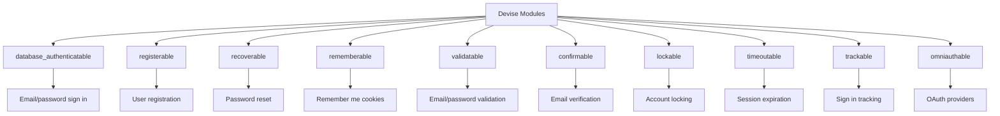

# How to Implement Authentication with Devise in Rails

Author: [nawazdhandala](https://www.github.com/nawazdhandala)

Tags: Ruby on Rails, Devise, Authentication, Security, User Management, Web Development

Description: Learn how to implement robust user authentication in Rails using Devise. This guide covers installation, configuration, customization, and security best practices with practical code examples.

---

> Authentication is one of those features every web application needs but nobody wants to build from scratch. Devise handles the heavy lifting so you can focus on building your actual product.

Devise is the most popular authentication solution for Ruby on Rails applications. It provides a complete, modular authentication system out of the box while remaining flexible enough to customize for your specific needs.

---

## Why Devise?

Before diving into implementation, let's understand why Devise has become the go-to solution:

| Feature | DIY Auth | Devise |
|---------|----------|--------|
| **Setup Time** | Days | Minutes |
| **Password Reset** | Build it | Included |
| **Email Confirmation** | Build it | Included |
| **Session Management** | Build it | Included |
| **Remember Me** | Build it | Included |
| **Security Updates** | Your problem | Community maintained |

---

## Getting Started

### Installation

Add Devise to your Gemfile:

```ruby
# Gemfile
gem 'devise'
```

Run bundle install and the Devise generator:

```bash
bundle install
rails generate devise:install
```

Devise will print out several manual steps. The key ones are:

```ruby
# config/environments/development.rb
config.action_mailer.default_url_options = { host: 'localhost', port: 3000 }
```

### Generating the User Model

Generate a User model with Devise:

```bash
rails generate devise User
rails db:migrate
```

This creates a User model with the following default modules:

```ruby
# app/models/user.rb
class User < ApplicationRecord
  # Default Devise modules
  devise :database_authenticatable, :registerable,
         :recoverable, :rememberable, :validatable
end
```

---

## Understanding Devise Modules

Devise is modular by design. Each module adds specific functionality:



### Enabling Additional Modules

To add email confirmation, modify your User model and create a migration:

```ruby
# app/models/user.rb
class User < ApplicationRecord
  devise :database_authenticatable, :registerable,
         :recoverable, :rememberable, :validatable,
         :confirmable, :lockable, :trackable
end
```

```bash
rails generate migration AddDeviseColumnsToUsers
```

```ruby
# db/migrate/xxx_add_devise_columns_to_users.rb
class AddDeviseColumnsToUsers < ActiveRecord::Migration[7.0]
  def change
    # Confirmable
    add_column :users, :confirmation_token, :string
    add_column :users, :confirmed_at, :datetime
    add_column :users, :confirmation_sent_at, :datetime
    add_column :users, :unconfirmed_email, :string

    # Lockable
    add_column :users, :failed_attempts, :integer, default: 0, null: false
    add_column :users, :unlock_token, :string
    add_column :users, :locked_at, :datetime

    # Trackable
    add_column :users, :sign_in_count, :integer, default: 0, null: false
    add_column :users, :current_sign_in_at, :datetime
    add_column :users, :last_sign_in_at, :datetime
    add_column :users, :current_sign_in_ip, :string
    add_column :users, :last_sign_in_ip, :string

    # Indexes for faster lookups
    add_index :users, :confirmation_token, unique: true
    add_index :users, :unlock_token, unique: true
  end
end
```

---

## Setting Up Routes

Devise adds routes automatically, but you can customize them:

```ruby
# config/routes.rb
Rails.application.routes.draw do
  # Basic Devise routes
  devise_for :users

  # Custom paths
  devise_for :users, path: 'auth', path_names: {
    sign_in: 'login',
    sign_out: 'logout',
    sign_up: 'register',
    password: 'forgot-password'
  }

  # Scoped controllers for customization
  devise_for :users, controllers: {
    sessions: 'users/sessions',
    registrations: 'users/registrations',
    passwords: 'users/passwords',
    confirmations: 'users/confirmations'
  }

  root 'home#index'
end
```

Check your routes with:

```bash
rails routes | grep devise
```

---

## Protecting Controllers

### Basic Authentication Requirement

Require authentication for all actions in a controller:

```ruby
# app/controllers/dashboard_controller.rb
class DashboardController < ApplicationController
  # Require sign in for all actions
  before_action :authenticate_user!

  def index
    # current_user is available here
    @stats = current_user.calculate_stats
  end

  def settings
    @preferences = current_user.preferences
  end
end
```

### Selective Protection

Protect only specific actions:

```ruby
# app/controllers/articles_controller.rb
class ArticlesController < ApplicationController
  # Only require auth for create, update, destroy
  before_action :authenticate_user!, only: [:create, :update, :destroy]

  # Skip auth for public pages
  skip_before_action :authenticate_user!, only: [:index, :show]

  def index
    @articles = Article.published
  end

  def show
    @article = Article.find(params[:id])
  end

  def create
    # current_user is guaranteed to exist here
    @article = current_user.articles.build(article_params)

    if @article.save
      redirect_to @article, notice: 'Article created successfully.'
    else
      render :new, status: :unprocessable_entity
    end
  end
end
```

---

## Customizing Views

Generate Devise views for customization:

```bash
rails generate devise:views
```

This creates views in `app/views/devise/`. Here is a customized sign-in form:

```erb
<!-- app/views/devise/sessions/new.html.erb -->
<div class="auth-container">
  <h2>Sign In</h2>

  <%= form_for(resource, as: resource_name, url: session_path(resource_name),
               html: { class: 'auth-form' }) do |f| %>

    <div class="form-group">
      <%= f.label :email %>
      <%= f.email_field :email,
                        autofocus: true,
                        autocomplete: 'email',
                        class: 'form-control',
                        placeholder: 'you@example.com' %>
    </div>

    <div class="form-group">
      <%= f.label :password %>
      <%= f.password_field :password,
                           autocomplete: 'current-password',
                           class: 'form-control' %>
    </div>

    <% if devise_mapping.rememberable? %>
      <div class="form-check">
        <%= f.check_box :remember_me, class: 'form-check-input' %>
        <%= f.label :remember_me, class: 'form-check-label' %>
      </div>
    <% end %>

    <div class="form-actions">
      <%= f.submit 'Sign In', class: 'btn btn-primary' %>
    </div>
  <% end %>

  <div class="auth-links">
    <%= link_to 'Forgot your password?', new_password_path(resource_name) %>
    <br/>
    <%= link_to 'Create an account', new_registration_path(resource_name) %>
  </div>
</div>
```

---

## Adding Custom Fields

Add fields like username or profile info to the User model:

```bash
rails generate migration AddUsernameToUsers username:string:uniq
rails generate migration AddProfileFieldsToUsers first_name:string last_name:string bio:text
rails db:migrate
```

### Permitting Custom Parameters

Create a custom controller to handle additional fields:

```ruby
# app/controllers/application_controller.rb
class ApplicationController < ActionController::Base
  before_action :configure_permitted_parameters, if: :devise_controller?

  protected

  def configure_permitted_parameters
    # Allow username on sign up
    devise_parameter_sanitizer.permit(:sign_up, keys: [:username, :first_name, :last_name])

    # Allow profile fields on account update
    devise_parameter_sanitizer.permit(:account_update, keys: [
      :username, :first_name, :last_name, :bio, :avatar
    ])
  end
end
```

Update the registration form:

```erb
<!-- app/views/devise/registrations/new.html.erb -->
<div class="auth-container">
  <h2>Create Account</h2>

  <%= form_for(resource, as: resource_name, url: registration_path(resource_name),
               html: { class: 'auth-form' }) do |f| %>

    <%= render 'devise/shared/error_messages', resource: resource %>

    <div class="form-group">
      <%= f.label :username %>
      <%= f.text_field :username,
                       autofocus: true,
                       class: 'form-control',
                       placeholder: 'Choose a username' %>
    </div>

    <div class="form-row">
      <div class="form-group col-md-6">
        <%= f.label :first_name %>
        <%= f.text_field :first_name, class: 'form-control' %>
      </div>

      <div class="form-group col-md-6">
        <%= f.label :last_name %>
        <%= f.text_field :last_name, class: 'form-control' %>
      </div>
    </div>

    <div class="form-group">
      <%= f.label :email %>
      <%= f.email_field :email,
                        autocomplete: 'email',
                        class: 'form-control' %>
    </div>

    <div class="form-group">
      <%= f.label :password %>
      <% if @minimum_password_length %>
        <small>(<%= @minimum_password_length %> characters minimum)</small>
      <% end %>
      <%= f.password_field :password,
                           autocomplete: 'new-password',
                           class: 'form-control' %>
    </div>

    <div class="form-group">
      <%= f.label :password_confirmation %>
      <%= f.password_field :password_confirmation,
                           autocomplete: 'new-password',
                           class: 'form-control' %>
    </div>

    <div class="form-actions">
      <%= f.submit 'Create Account', class: 'btn btn-primary btn-block' %>
    </div>
  <% end %>

  <div class="auth-links">
    Already have an account? <%= link_to 'Sign in', new_session_path(resource_name) %>
  </div>
</div>
```

---

## Custom Validations

Add validations to your User model:

```ruby
# app/models/user.rb
class User < ApplicationRecord
  devise :database_authenticatable, :registerable,
         :recoverable, :rememberable, :validatable,
         :confirmable, :lockable, :trackable

  # Username validations
  validates :username,
            presence: true,
            uniqueness: { case_sensitive: false },
            length: { minimum: 3, maximum: 30 },
            format: {
              with: /\A[a-zA-Z0-9_]+\z/,
              message: 'can only contain letters, numbers, and underscores'
            }

  # Name validations
  validates :first_name, :last_name, length: { maximum: 50 }

  # Bio validation
  validates :bio, length: { maximum: 500 }

  # Custom password requirements - override Devise default
  def password_required?
    # Password required if new record or password is being changed
    new_record? || password.present?
  end

  # Stronger password validation
  validate :password_complexity

  private

  def password_complexity
    return if password.blank?

    # Require at least one uppercase, one lowercase, one digit
    unless password.match?(/^(?=.*[a-z])(?=.*[A-Z])(?=.*\d)/)
      errors.add(:password, 'must include at least one lowercase letter, one uppercase letter, and one digit')
    end
  end
end
```

---

## Handling Authentication in APIs

For API-only Rails apps or mixed apps, use token-based authentication:

### Option 1: Simple Token Authentication

```ruby
# app/models/user.rb
class User < ApplicationRecord
  devise :database_authenticatable, :registerable,
         :recoverable, :rememberable, :validatable

  # Generate token before creation
  before_create :generate_authentication_token

  private

  def generate_authentication_token
    loop do
      self.authentication_token = SecureRandom.hex(32)
      break unless User.exists?(authentication_token: authentication_token)
    end
  end
end
```

```ruby
# app/controllers/api/base_controller.rb
module Api
  class BaseController < ActionController::API
    before_action :authenticate_api_user!

    private

    def authenticate_api_user!
      # Check for token in header
      token = request.headers['Authorization']&.gsub('Bearer ', '')

      @current_user = User.find_by(authentication_token: token)

      unless @current_user
        render json: { error: 'Unauthorized' }, status: :unauthorized
      end
    end

    def current_user
      @current_user
    end
  end
end
```

### Option 2: JWT with devise-jwt Gem

```ruby
# Gemfile
gem 'devise-jwt'
```

```ruby
# config/initializers/devise.rb
Devise.setup do |config|
  # JWT configuration
  config.jwt do |jwt|
    jwt.secret = Rails.application.credentials.devise_jwt_secret_key!
    jwt.dispatch_requests = [
      ['POST', %r{^/api/login$}]
    ]
    jwt.revocation_requests = [
      ['DELETE', %r{^/api/logout$}]
    ]
    jwt.expiration_time = 1.day.to_i
  end
end
```

```ruby
# app/models/user.rb
class User < ApplicationRecord
  include Devise::JWT::RevocationStrategies::JTIMatcher

  devise :database_authenticatable, :registerable,
         :jwt_authenticatable, jwt_revocation_strategy: self
end
```

---

## Customizing Controllers

Generate custom controllers:

```bash
rails generate devise:controllers users
```

Customize the sessions controller:

```ruby
# app/controllers/users/sessions_controller.rb
class Users::SessionsController < Devise::SessionsController
  # POST /users/sign_in
  def create
    # Log sign in attempts for security monitoring
    Rails.logger.info "Sign in attempt for: #{sign_in_params[:email]}"

    super do |resource|
      # Custom logic after successful sign in
      resource.update(last_sign_in_at: Time.current)

      # Track sign in for analytics
      Analytics.track_event('user_signed_in', user_id: resource.id)
    end
  end

  # DELETE /users/sign_out
  def destroy
    # Custom logic before sign out
    current_user&.update(last_activity_at: Time.current)

    super
  end

  protected

  # Customize redirect after sign in
  def after_sign_in_path_for(resource)
    stored_location_for(resource) || dashboard_path
  end

  # Customize redirect after sign out
  def after_sign_out_path_for(resource_or_scope)
    root_path
  end
end
```

Customize the registrations controller:

```ruby
# app/controllers/users/registrations_controller.rb
class Users::RegistrationsController < Devise::RegistrationsController
  # POST /users
  def create
    super do |resource|
      if resource.persisted?
        # Send welcome email
        UserMailer.welcome_email(resource).deliver_later

        # Track signup for analytics
        Analytics.track_event('user_registered', {
          user_id: resource.id,
          signup_source: params[:source]
        })
      end
    end
  end

  protected

  # Require current password for account updates
  def update_resource(resource, params)
    # Allow update without password for OAuth users
    if resource.provider.present?
      resource.update_without_password(params)
    else
      resource.update_with_password(params)
    end
  end

  def after_sign_up_path_for(resource)
    onboarding_path
  end
end
```

---

## Security Configuration

Configure Devise for production security:

```ruby
# config/initializers/devise.rb
Devise.setup do |config|
  # Secret key for signing tokens
  config.secret_key = Rails.application.credentials.secret_key_base

  # Email sender
  config.mailer_sender = 'noreply@yourapp.com'

  # Password requirements
  config.password_length = 8..128
  config.email_regexp = /\A[^@\s]+@[^@\s]+\z/

  # Session timeout (with timeoutable module)
  config.timeout_in = 30.minutes

  # Lockable configuration
  config.lock_strategy = :failed_attempts
  config.unlock_strategy = :both  # Email and time
  config.maximum_attempts = 5
  config.unlock_in = 1.hour

  # Confirmable
  config.confirm_within = 3.days
  config.reconfirmable = true

  # Remember me
  config.remember_for = 2.weeks
  config.extend_remember_period = false
  config.rememberable_options = { secure: Rails.env.production? }

  # Paranoid mode - don't reveal if email exists
  config.paranoid = true

  # Sign out behavior
  config.sign_out_via = :delete
  config.sign_out_all_scopes = true

  # Stretches for bcrypt - higher is more secure but slower
  config.stretches = Rails.env.test? ? 1 : 12
end
```

---

## Testing Devise

### Request Specs with Devise

```ruby
# spec/support/devise.rb
RSpec.configure do |config|
  config.include Devise::Test::IntegrationHelpers, type: :request
  config.include Devise::Test::ControllerHelpers, type: :controller
end
```

```ruby
# spec/requests/dashboard_spec.rb
require 'rails_helper'

RSpec.describe 'Dashboard', type: :request do
  let(:user) { create(:user) }

  describe 'GET /dashboard' do
    context 'when not signed in' do
      it 'redirects to sign in page' do
        get '/dashboard'
        expect(response).to redirect_to(new_user_session_path)
      end
    end

    context 'when signed in' do
      before { sign_in user }

      it 'returns success' do
        get '/dashboard'
        expect(response).to have_http_status(:success)
      end

      it 'displays user data' do
        get '/dashboard'
        expect(response.body).to include(user.email)
      end
    end
  end
end
```

### Factory for Users

```ruby
# spec/factories/users.rb
FactoryBot.define do
  factory :user do
    sequence(:email) { |n| "user#{n}@example.com" }
    sequence(:username) { |n| "user#{n}" }
    password { 'Password123' }
    password_confirmation { 'Password123' }
    confirmed_at { Time.current }

    trait :unconfirmed do
      confirmed_at { nil }
    end

    trait :locked do
      locked_at { Time.current }
      failed_attempts { 5 }
    end
  end
end
```

---

## Common Issues and Solutions

### Flash Messages Not Showing

Add flash message rendering to your layout:

```erb
<!-- app/views/layouts/application.html.erb -->
<body>
  <% flash.each do |type, message| %>
    <div class="alert alert-<%= type == 'notice' ? 'success' : 'danger' %>">
      <%= message %>
    </div>
  <% end %>

  <%= yield %>
</body>
```

### Turbo/Hotwire Compatibility

For Rails 7 with Turbo, add this configuration:

```ruby
# config/initializers/devise.rb
Devise.setup do |config|
  # Turbo requires 303 redirects for non-GET requests
  config.navigational_formats = ['*/*', :html, :turbo_stream]
end
```

```ruby
# app/controllers/turbo_devise_controller.rb
class TurboDeviseController < ApplicationController
  class Responder < ActionController::Responder
    def to_turbo_stream
      controller.render(options.merge(formats: :html))
    rescue ActionView::MissingTemplate => e
      if get?
        raise e
      elsif has_errors? && default_action
        render rendering_options.merge(formats: :html, status: :unprocessable_entity)
      else
        redirect_to navigation_location
      end
    end
  end

  self.responder = Responder
  respond_to :html, :turbo_stream
end
```

---

## Conclusion

Devise provides everything you need for robust authentication in Rails applications. The key points to remember:

- Start with the default modules and add more as needed
- Always enable `confirmable` and `lockable` for production apps
- Customize views to match your design
- Use strong password requirements
- Enable paranoid mode to prevent user enumeration
- Test authentication flows thoroughly

With Devise handling authentication, you can focus on building the features that make your application unique.

---

*Need to monitor your Rails application in production? [OneUptime](https://oneuptime.com) provides comprehensive monitoring with alerting, uptime tracking, and incident management to keep your authentication system running smoothly.*

**Related Reading:**
- [Rails Security Best Practices](https://guides.rubyonrails.org/security.html)
- [Devise Wiki](https://github.com/heartcombo/devise/wiki)
