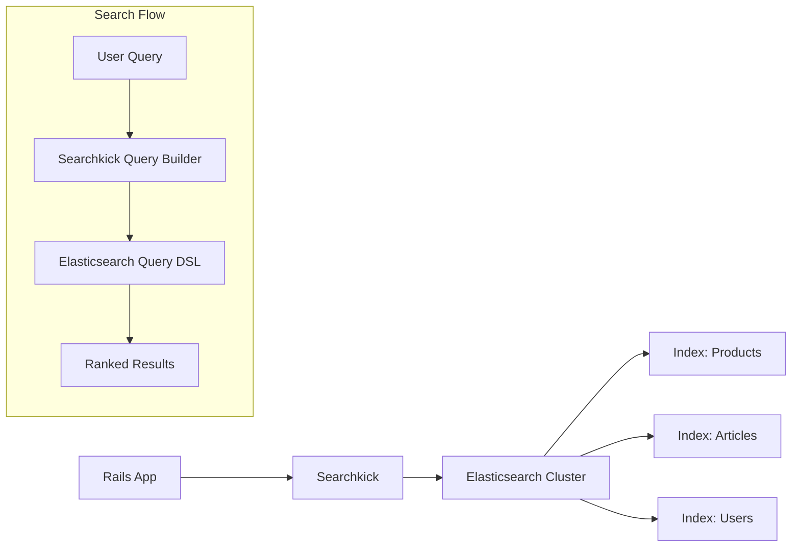
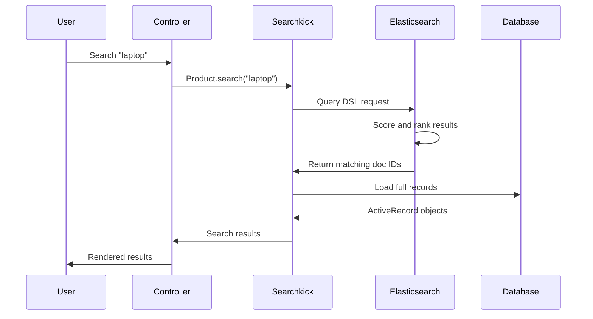
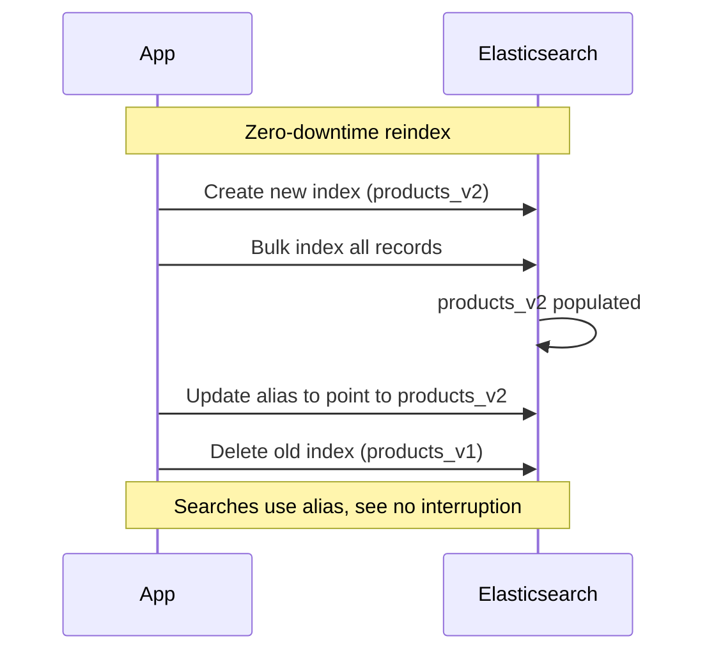

# How to Use Rails with Elasticsearch

Author: [nawazdhandala](https://www.github.com/nawazdhandala)

Tags: Ruby on Rails, Elasticsearch, Search, Full-Text Search, Searchkick

Description: Learn how to integrate Rails with Elasticsearch using Searchkick for full-text search with indexing, querying, facets, and autocomplete.

---

> Full-text search is a critical feature for most production applications. Whether you are building an e-commerce site, a documentation platform, or a content management system, users expect fast and relevant search results. Elasticsearch paired with Rails through Searchkick provides a powerful, developer-friendly solution.

Searchkick abstracts the complexity of Elasticsearch while giving you access to its full power when needed. It handles indexing, querying, and relevance tuning with minimal configuration.

---

## Architecture Overview



---

## Getting Started

### Prerequisites

First, install Elasticsearch. On macOS with Homebrew:

```bash
# Install Elasticsearch
brew install elasticsearch

# Start Elasticsearch service
brew services start elasticsearch

# Verify it is running
curl http://localhost:9200
```

For Docker users:

```bash
docker run -d \
  --name elasticsearch \
  -p 9200:9200 \
  -e "discovery.type=single-node" \
  -e "xpack.security.enabled=false" \
  elasticsearch:8.11.0
```

### Installation

Add the gems to your Gemfile:

```ruby
# Gemfile

# Searchkick provides a high-level interface to Elasticsearch
gem 'searchkick'

# Optional: For background reindexing (recommended for production)
gem 'sidekiq'
```

Run bundle install:

```bash
bundle install
```

---

## Basic Setup

### Making Models Searchable

Add the `searchkick` declaration to any model you want to search:

```ruby
# app/models/product.rb
class Product < ApplicationRecord
  # Enable Elasticsearch indexing for this model
  # By default, it indexes all attributes
  searchkick

  belongs_to :category
  has_many :reviews

  # Define which attributes to index
  # This method controls what data goes into Elasticsearch
  def search_data
    {
      name: name,
      description: description,
      category_name: category.name,
      price: price,
      in_stock: quantity > 0,
      rating: reviews.average(:score) || 0,
      created_at: created_at
    }
  end
end
```

### Creating the Index

After setting up your model, create the Elasticsearch index:

```bash
# Create and populate the index with all records
rails searchkick:reindex CLASS=Product

# Or from Rails console
Product.reindex
```

---

## Search Flow



---

## Querying

### Basic Search

```ruby
# app/controllers/products_controller.rb
class ProductsController < ApplicationController
  def index
    # Simple search - Searchkick handles tokenization and relevance
    @products = Product.search(params[:query])
  end

  def search
    # Search with options
    @products = Product.search(
      params[:query],
      page: params[:page],          # Pagination support
      per_page: 20,                  # Results per page
      fields: [:name, :description], # Which fields to search
      match: :word_start            # Match words starting with query
    )
  end
end
```

### Field Boosting

Prioritize matches in certain fields:

```ruby
# app/models/article.rb
class Article < ApplicationRecord
  searchkick

  def search_data
    {
      title: title,
      body: body,
      author_name: author.name,
      tags: tags.pluck(:name)
    }
  end
end

# In controller or service
# Matches in title are weighted 10x more than body
@articles = Article.search(
  query,
  fields: [
    { title: :word_start, boost: 10 },  # Highest priority
    { tags: :exact, boost: 5 },         # Medium priority
    { body: :word, boost: 1 }           # Base priority
  ]
)
```

### Filtering Results

```ruby
# Filter without affecting relevance score
@products = Product.search(
  query,
  where: {
    in_stock: true,                    # Exact match
    price: { gte: 10, lte: 100 },     # Range filter
    category_name: ["Electronics", "Computers"], # In array
    created_at: { gte: 1.week.ago }   # Date range
  }
)

# Combine with OR conditions
@products = Product.search(
  query,
  where: {
    or: [
      { category_name: "Electronics" },
      { price: { lt: 50 } }
    ]
  }
)
```

---

## Advanced Search Features

### Faceted Search

Facets let users filter results by categories, price ranges, and other attributes:

```mermaid
graph TD
    A[Search: "laptop"] --> B[Results: 150 products]
    B --> C[Facets]
    C --> D[Category]
    C --> E[Price Range]
    C --> F[Brand]

    D --> D1[Electronics: 120]
    D --> D2[Accessories: 30]

    E --> E1[$0-$500: 45]
    E --> E2[$500-$1000: 65]
    E --> E3[$1000+: 40]

    F --> F1[Apple: 35]
    F --> F2[Dell: 28]
    F --> F3[HP: 22]
```

```ruby
# app/controllers/products_controller.rb
def search
  @products = Product.search(
    params[:query],
    where: build_filters,
    aggs: {
      # Count products by category
      category_name: { limit: 10 },

      # Count products by brand
      brand: { limit: 20 },

      # Price ranges for faceted navigation
      price: {
        ranges: [
          { to: 50, key: "under_50" },
          { from: 50, to: 100, key: "50_to_100" },
          { from: 100, to: 500, key: "100_to_500" },
          { from: 500, key: "over_500" }
        ]
      },

      # Boolean facet for stock status
      in_stock: {}
    }
  )

  # Access aggregation results in view
  @category_counts = @products.aggs["category_name"]["buckets"]
  @price_ranges = @products.aggs["price"]["buckets"]
end

private

def build_filters
  filters = {}
  filters[:category_name] = params[:category] if params[:category].present?
  filters[:brand] = params[:brand] if params[:brand].present?
  filters[:in_stock] = true if params[:in_stock] == "true"
  filters
end
```

### Autocomplete

Implement fast, typo-tolerant autocomplete:

```ruby
# app/models/product.rb
class Product < ApplicationRecord
  # Enable autocomplete with word_start matching
  searchkick word_start: [:name, :brand]

  def search_data
    {
      name: name,
      brand: brand,
      category: category.name
    }
  end
end

# app/controllers/autocomplete_controller.rb
class AutocompleteController < ApplicationController
  def products
    # Fast autocomplete query
    # match: :word_start finds "laptop" from "lap"
    results = Product.search(
      params[:query],
      match: :word_start,
      limit: 10,
      load: false,  # Skip loading from DB for speed
      fields: [:name]
    )

    # Return just the names for the autocomplete dropdown
    render json: results.map { |r| { name: r.name, id: r.id } }
  end
end
```

Frontend integration with a simple JavaScript example:

```javascript
// app/javascript/controllers/autocomplete_controller.js
import { Controller } from "@hotwired/stimulus"

export default class extends Controller {
  static targets = ["input", "results"]

  async search() {
    const query = this.inputTarget.value

    // Skip short queries to reduce server load
    if (query.length < 2) {
      this.resultsTarget.innerHTML = ""
      return
    }

    // Fetch autocomplete suggestions
    const response = await fetch(`/autocomplete/products?query=${encodeURIComponent(query)}`)
    const products = await response.json()

    // Render suggestions
    this.resultsTarget.innerHTML = products
      .map(p => `<div class="suggestion" data-id="${p.id}">${p.name}</div>`)
      .join("")
  }
}
```

### Highlighting

Show users where their query matched:

```ruby
# Search with highlighting enabled
@products = Product.search(
  params[:query],
  highlight: {
    tag: "<mark>",     # HTML tag to wrap matches
    fields: {
      name: {},
      description: { fragment_size: 150 }  # Limit snippet length
    }
  }
)

# In view
<% @products.with_highlights.each do |product, highlights| %>
  <div class="result">
    <h3><%= highlights[:name]&.html_safe || product.name %></h3>
    <p><%= highlights[:description]&.html_safe || truncate(product.description, length: 150) %></p>
  </div>
<% end %>
```

---

## Indexing Strategies

### Automatic Indexing

Searchkick automatically updates the index when records change:

```ruby
# These operations trigger automatic reindexing
product = Product.create!(name: "New Laptop", price: 999)
product.update!(price: 899)
product.destroy
```

### Background Reindexing

For production, use background jobs to avoid blocking web requests:

```ruby
# config/initializers/searchkick.rb
Searchkick.redis = Redis.new  # For job queue coordination

# app/models/product.rb
class Product < ApplicationRecord
  # Queue index updates in background
  searchkick callbacks: :async
end
```

### Bulk Reindexing

For large datasets, use zero-downtime reindexing:

```ruby
# This creates a new index, populates it, then swaps the alias
# Users see no interruption
Product.reindex(async: true)

# Monitor progress
Searchkick.reindex_status("products_production_20240126")
```



---

## Performance Optimization

### Eager Loading

Avoid N+1 queries when displaying results:

```ruby
# Load associations needed for display
@products = Product.search(
  query,
  includes: [:category, :brand, :reviews]
)
```

### Caching

Cache expensive aggregations:

```ruby
def category_facets
  Rails.cache.fetch("category_facets", expires_in: 5.minutes) do
    Product.search(
      "*",
      aggs: { category_name: { limit: 50 } },
      load: false
    ).aggs["category_name"]["buckets"]
  end
end
```

### Index Settings

Configure index settings for better performance:

```ruby
# app/models/product.rb
class Product < ApplicationRecord
  searchkick(
    settings: {
      number_of_shards: 2,      # Distribute data across shards
      number_of_replicas: 1     # Redundancy for availability
    },
    merge_mappings: true,
    mappings: {
      properties: {
        name: { type: "text", analyzer: "english" },
        description: { type: "text", analyzer: "english" },
        price: { type: "float" },
        created_at: { type: "date" }
      }
    }
  )
end
```

---

## Testing

### Test Configuration

```ruby
# spec/rails_helper.rb or test/test_helper.rb
Searchkick.disable_callbacks  # Disable auto-indexing in tests

# spec/support/searchkick.rb
RSpec.configure do |config|
  config.before(:each, search: true) do
    # Reindex models needed for this test
    Product.reindex
    Product.searchkick_index.refresh  # Make changes visible immediately
  end
end
```

### Writing Search Tests

```ruby
# spec/models/product_spec.rb
RSpec.describe Product, search: true do
  describe ".search" do
    let!(:laptop) { create(:product, name: "Gaming Laptop", category_name: "Electronics") }
    let!(:phone) { create(:product, name: "Smartphone", category_name: "Electronics") }
    let!(:shirt) { create(:product, name: "Cotton Shirt", category_name: "Clothing") }

    before do
      Product.reindex
      Product.searchkick_index.refresh
    end

    it "finds products by name" do
      results = Product.search("laptop")
      expect(results).to include(laptop)
      expect(results).not_to include(phone, shirt)
    end

    it "filters by category" do
      results = Product.search("*", where: { category_name: "Electronics" })
      expect(results).to include(laptop, phone)
      expect(results).not_to include(shirt)
    end

    it "returns facet counts" do
      results = Product.search("*", aggs: [:category_name])
      buckets = results.aggs["category_name"]["buckets"]

      expect(buckets).to include(
        hash_including("key" => "Electronics", "doc_count" => 2)
      )
    end
  end
end
```

---

## Production Checklist

Before deploying to production, verify these configurations:

```ruby
# config/initializers/searchkick.rb

# Set Elasticsearch URL from environment
ENV["ELASTICSEARCH_URL"] ||= "http://localhost:9200"

# Configure connection pooling for production
Searchkick.client_options = {
  retry_on_failure: 3,
  request_timeout: 15,
  adapter: :typhoeus  # Faster HTTP client (add typhoeus gem)
}

# Enable background jobs for index updates
Searchkick.redis = Redis.new(url: ENV["REDIS_URL"])
```

### Monitoring

Track search performance and errors:

```ruby
# config/initializers/searchkick.rb
Searchkick.search_timeout = 5  # Seconds

# Log slow searches
ActiveSupport::Notifications.subscribe("search.searchkick") do |name, start, finish, id, payload|
  duration = (finish - start) * 1000

  if duration > 100  # Log searches over 100ms
    Rails.logger.warn(
      "Slow search: #{payload[:query]} took #{duration.round}ms"
    )
  end
end
```

---

## Common Issues and Solutions

### Index Not Updating

```ruby
# Force reindex a single record
product.reindex

# Check if record is in index
Product.searchkick_index.exists?(product)

# Refresh index to make changes visible immediately
Product.searchkick_index.refresh
```

### Memory Issues During Bulk Reindex

```ruby
# Reindex in batches to control memory usage
Product.reindex(batch_size: 500)

# Use async reindexing with Sidekiq
Product.reindex(async: true)
```

### Search Returning No Results

```ruby
# Debug by checking what is actually indexed
Product.search_index.refresh
results = Product.search("*", load: false)
puts results.map(&:search_data)

# Verify the query Searchkick generates
Product.search("laptop", debug: true)
```

---

## Conclusion

Elasticsearch with Searchkick gives Rails applications powerful search capabilities with minimal setup. Key points to remember:

- **Define search_data** to control what gets indexed
- **Use facets** for filtered navigation
- **Enable async callbacks** in production for performance
- **Test with refreshed indexes** to ensure reliability

Start simple with basic search, then add features like autocomplete and facets as your application grows.

---

*Need to monitor your Elasticsearch cluster? [OneUptime](https://oneuptime.com) provides comprehensive monitoring for search infrastructure with query latency tracking and cluster health alerts.*
