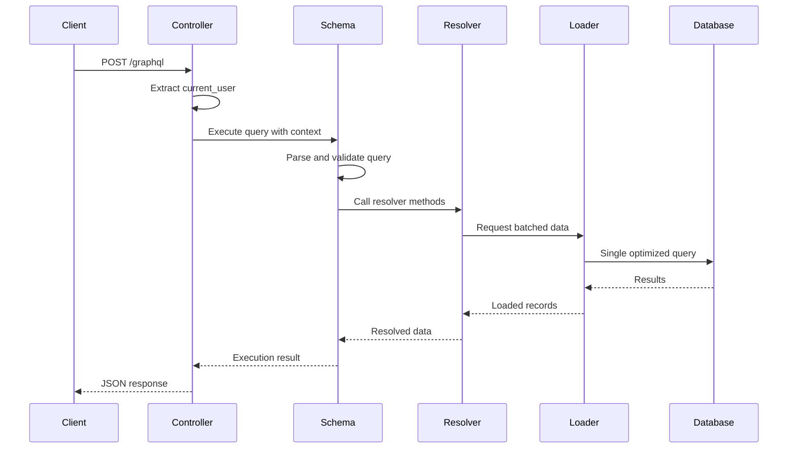

# How to Build GraphQL APIs with Rails and GraphQL-Ruby

Author: [nawazdhandala](https://www.github.com/nawazdhandala)

Tags: Rails, GraphQL, GraphQL-Ruby, Ruby, API, Backend

Description: Learn how to build GraphQL APIs in Ruby on Rails using the graphql-ruby gem. This guide covers schema design, types, queries, mutations, subscriptions, authentication, and performance optimization with practical examples.

---

> Ruby on Rails has long been a favorite for building REST APIs, but GraphQL offers a more flexible approach that lets clients request exactly the data they need. The graphql-ruby gem provides a mature, well-documented implementation that integrates seamlessly with Rails conventions.

GraphQL-Ruby gives you full control over your schema while leveraging Ruby's expressive syntax. You define types as classes, write resolvers as methods, and let the framework handle the query execution, validation, and error handling.

---

## Prerequisites

Before getting started, make sure you have:
- Ruby 3.0 or higher
- Rails 7.0 or higher
- Basic familiarity with GraphQL concepts (queries, mutations, types)
- A Rails application ready to extend

---

## Project Setup

Add the graphql-ruby gem to your Gemfile and run the generator to scaffold the basic structure.

```bash
# Add to Gemfile
bundle add graphql

# Generate the GraphQL scaffold
rails generate graphql:install
```

The generator creates several files:

```
app/graphql/
  types/
    base_argument.rb
    base_enum.rb
    base_field.rb
    base_input_object.rb
    base_interface.rb
    base_object.rb
    base_scalar.rb
    base_union.rb
    mutation_type.rb
    query_type.rb
  mutations/
    base_mutation.rb
  your_app_schema.rb
```

It also adds a GraphQL controller and route. Let me walk you through the key pieces.

---

## Understanding the Schema

The schema is the entry point for all GraphQL operations. GraphQL-Ruby uses a class-based approach where the schema inherits from `GraphQL::Schema`.

```ruby
# app/graphql/my_app_schema.rb
class MyAppSchema < GraphQL::Schema
  # Entry points for queries and mutations
  query(Types::QueryType)
  mutation(Types::MutationType)

  # Enable subscriptions if needed
  # subscription(Types::SubscriptionType)

  # Configure max query depth to prevent abuse
  max_depth 15

  # Configure max complexity to limit expensive queries
  max_complexity 300

  # Handle errors gracefully in production
  rescue_from(ActiveRecord::RecordNotFound) do |err, obj, args, ctx, field|
    raise GraphQL::ExecutionError, "#{field.type.unwrap.graphql_name} not found"
  end
end
```

---

## Defining Object Types

Object types define the shape of data returned from your API. Each type maps to a Ruby class with fields.

```ruby
# app/graphql/types/user_type.rb
module Types
  class UserType < Types::BaseObject
    # Add a description for documentation
    description "A user account in the system"

    # The ID field uses GraphQL's built-in ID type
    field :id, ID, null: false, description: "Unique identifier"

    # String fields for basic attributes
    field :email, String, null: false
    field :name, String, null: false

    # Optional fields can be null
    field :bio, String, null: true

    # DateTime fields for timestamps
    field :created_at, GraphQL::Types::ISO8601DateTime, null: false
    field :updated_at, GraphQL::Types::ISO8601DateTime, null: false

    # Computed field with custom resolver method
    field :full_name, String, null: false

    def full_name
      "#{object.first_name} #{object.last_name}"
    end

    # Association field - returns array of PostType
    field :posts, [Types::PostType], null: false

    # Resolver method for controlling data access
    def posts
      # object refers to the User instance
      object.posts.published
    end

    # Field with arguments for filtering
    field :recent_posts, [Types::PostType], null: false do
      argument :limit, Integer, required: false, default_value: 5
    end

    def recent_posts(limit:)
      object.posts.order(created_at: :desc).limit(limit)
    end
  end
end
```

For related types, create separate files that reference each other.

```ruby
# app/graphql/types/post_type.rb
module Types
  class PostType < Types::BaseObject
    description "A blog post"

    field :id, ID, null: false
    field :title, String, null: false
    field :content, String, null: false
    field :published, Boolean, null: false
    field :view_count, Integer, null: false
    field :created_at, GraphQL::Types::ISO8601DateTime, null: false

    # Reference back to the author
    field :author, Types::UserType, null: false

    # Array of strings for tags
    field :tags, [String], null: false

    # Enum field for status
    field :status, Types::PostStatusEnum, null: false
  end
end
```

---

## Creating Enum Types

Enums define a fixed set of allowed values. They map nicely to Rails enums.

```ruby
# app/graphql/types/post_status_enum.rb
module Types
  class PostStatusEnum < Types::BaseEnum
    description "Publication status of a post"

    value "DRAFT", "Post is not published", value: "draft"
    value "PUBLISHED", "Post is publicly visible", value: "published"
    value "ARCHIVED", "Post is no longer active", value: "archived"
  end
end
```

---

## Building Queries

The QueryType defines all available read operations. Add fields for fetching single records and collections.

```ruby
# app/graphql/types/query_type.rb
module Types
  class QueryType < Types::BaseObject
    description "The query root of this schema"

    # Fetch a single user by ID
    field :user, Types::UserType, null: true do
      description "Find a user by ID"
      argument :id, ID, required: true
    end

    def user(id:)
      User.find_by(id: id)
    end

    # Fetch all users with optional filtering
    field :users, [Types::UserType], null: false do
      description "List all users"
      argument :role, String, required: false
      argument :limit, Integer, required: false, default_value: 20
      argument :offset, Integer, required: false, default_value: 0
    end

    def users(role: nil, limit:, offset:)
      scope = User.all
      scope = scope.where(role: role) if role.present?
      scope.limit(limit).offset(offset)
    end

    # Fetch posts with pagination
    field :posts, Types::PostConnectionType, null: false do
      description "List posts with cursor-based pagination"
    end

    def posts
      Post.published.order(created_at: :desc)
    end

    # Search across multiple types
    field :search, [Types::SearchResultType], null: false do
      description "Search users and posts"
      argument :query, String, required: true
    end

    def search(query:)
      users = User.where("name ILIKE ?", "%#{query}%")
      posts = Post.where("title ILIKE ?", "%#{query}%")
      users + posts
    end
  end
end
```

---

## Implementing Mutations

Mutations handle create, update, and delete operations. GraphQL-Ruby provides a base mutation class with conventions for input arguments and return fields.

```ruby
# app/graphql/mutations/create_user.rb
module Mutations
  class CreateUser < BaseMutation
    description "Create a new user account"

    # Define input arguments
    argument :email, String, required: true
    argument :name, String, required: true
    argument :password, String, required: true
    argument :bio, String, required: false

    # Define return fields
    field :user, Types::UserType, null: true
    field :errors, [String], null: false

    def resolve(email:, name:, password:, bio: nil)
      user = User.new(
        email: email,
        name: name,
        password: password,
        bio: bio
      )

      if user.save
        {
          user: user,
          errors: []
        }
      else
        {
          user: nil,
          errors: user.errors.full_messages
        }
      end
    end
  end
end
```

For update mutations, accept an ID and optional fields.

```ruby
# app/graphql/mutations/update_user.rb
module Mutations
  class UpdateUser < BaseMutation
    description "Update an existing user"

    argument :id, ID, required: true
    argument :name, String, required: false
    argument :bio, String, required: false

    field :user, Types::UserType, null: true
    field :errors, [String], null: false

    def resolve(id:, **attributes)
      user = User.find_by(id: id)

      unless user
        return {
          user: nil,
          errors: ["User not found"]
        }
      end

      # Only update provided attributes
      update_params = attributes.compact

      if user.update(update_params)
        {
          user: user,
          errors: []
        }
      else
        {
          user: nil,
          errors: user.errors.full_messages
        }
      end
    end
  end
end
```

Register mutations in the MutationType.

```ruby
# app/graphql/types/mutation_type.rb
module Types
  class MutationType < Types::BaseObject
    field :create_user, mutation: Mutations::CreateUser
    field :update_user, mutation: Mutations::UpdateUser
    field :delete_user, mutation: Mutations::DeleteUser
    field :create_post, mutation: Mutations::CreatePost
  end
end
```

---

## Adding Authentication

Protect your GraphQL API by passing authentication context from the controller to your resolvers.

```ruby
# app/controllers/graphql_controller.rb
class GraphqlController < ApplicationController
  # Skip CSRF for API requests
  skip_before_action :verify_authenticity_token

  def execute
    variables = prepare_variables(params[:variables])
    query = params[:query]
    operation_name = params[:operationName]

    context = {
      # Pass the current user to resolvers
      current_user: current_user,
      # Pass the request for IP logging
      request: request
    }

    result = MyAppSchema.execute(
      query,
      variables: variables,
      context: context,
      operation_name: operation_name
    )

    render json: result
  rescue StandardError => e
    handle_error(e)
  end

  private

  def current_user
    # Extract token from Authorization header
    token = request.headers["Authorization"]&.split(" ")&.last
    return nil unless token

    # Decode JWT and find user
    payload = JWT.decode(token, Rails.application.secret_key_base).first
    User.find_by(id: payload["user_id"])
  rescue JWT::DecodeError
    nil
  end

  def prepare_variables(variables_param)
    case variables_param
    when String
      variables_param.present? ? JSON.parse(variables_param) : {}
    when Hash
      variables_param
    else
      {}
    end
  end

  def handle_error(error)
    Rails.logger.error(error.message)
    Rails.logger.error(error.backtrace.join("\n"))

    render json: {
      errors: [{ message: "Internal server error" }],
      data: {}
    }, status: :internal_server_error
  end
end
```

Use the context in resolvers to authorize operations.

```ruby
# app/graphql/mutations/create_post.rb
module Mutations
  class CreatePost < BaseMutation
    argument :title, String, required: true
    argument :content, String, required: true
    argument :tags, [String], required: false, default_value: []

    field :post, Types::PostType, null: true
    field :errors, [String], null: false

    def resolve(title:, content:, tags:)
      # Access current_user from context
      unless context[:current_user]
        return {
          post: nil,
          errors: ["You must be logged in to create a post"]
        }
      end

      post = context[:current_user].posts.build(
        title: title,
        content: content,
        tags: tags,
        status: :draft
      )

      if post.save
        { post: post, errors: [] }
      else
        { post: nil, errors: post.errors.full_messages }
      end
    end
  end
end
```

---

## Input Objects for Complex Arguments

When mutations require many arguments, use input objects to group them.

```ruby
# app/graphql/types/inputs/post_input_type.rb
module Types
  module Inputs
    class PostInputType < Types::BaseInputObject
      description "Input for creating or updating a post"

      argument :title, String, required: true
      argument :content, String, required: true
      argument :tags, [String], required: false, default_value: []
      argument :status, Types::PostStatusEnum, required: false
      argument :publish_at, GraphQL::Types::ISO8601DateTime, required: false
    end
  end
end

# Use it in a mutation
module Mutations
  class CreatePost < BaseMutation
    argument :input, Types::Inputs::PostInputType, required: true

    field :post, Types::PostType, null: true
    field :errors, [String], null: false

    def resolve(input:)
      post = context[:current_user].posts.build(input.to_h)

      if post.save
        { post: post, errors: [] }
      else
        { post: nil, errors: post.errors.full_messages }
      end
    end
  end
end
```

---

## Solving the N+1 Problem with GraphQL Batch

GraphQL queries can easily cause N+1 database queries when fetching associations. Use graphql-batch to solve this.

```bash
bundle add graphql-batch
```

Configure batching in your schema.

```ruby
# app/graphql/my_app_schema.rb
class MyAppSchema < GraphQL::Schema
  query(Types::QueryType)
  mutation(Types::MutationType)

  # Enable batch loading
  use GraphQL::Batch
end
```

Create a record loader for efficient batch loading.

```ruby
# app/graphql/loaders/record_loader.rb
module Loaders
  class RecordLoader < GraphQL::Batch::Loader
    def initialize(model, column: :id)
      @model = model
      @column = column
    end

    def perform(ids)
      # Load all records in a single query
      records = @model.where(@column => ids).index_by(&@column)
      ids.each { |id| fulfill(id, records[id]) }
    end
  end
end
```

Use the loader in your types.

```ruby
# app/graphql/types/post_type.rb
module Types
  class PostType < Types::BaseObject
    field :author, Types::UserType, null: false

    def author
      # Batch load authors instead of N+1 queries
      Loaders::RecordLoader.for(User).load(object.user_id)
    end
  end
end
```

Create an association loader for has-many relationships.

```ruby
# app/graphql/loaders/association_loader.rb
module Loaders
  class AssociationLoader < GraphQL::Batch::Loader
    def initialize(model, association_name)
      @model = model
      @association_name = association_name
    end

    def perform(records)
      # Preload the association for all records at once
      ActiveRecord::Associations::Preloader.new(
        records: records,
        associations: @association_name
      ).call

      records.each do |record|
        fulfill(record, record.public_send(@association_name))
      end
    end
  end
end

# Use in types
class UserType < Types::BaseObject
  field :posts, [Types::PostType], null: false

  def posts
    Loaders::AssociationLoader.for(User, :posts).load(object)
  end
end
```

---

## Implementing Subscriptions

Subscriptions enable real-time updates using WebSockets. Configure Action Cable as the transport.

```ruby
# app/graphql/my_app_schema.rb
class MyAppSchema < GraphQL::Schema
  query(Types::QueryType)
  mutation(Types::MutationType)
  subscription(Types::SubscriptionType)

  use GraphQL::Batch
  use GraphQL::Subscriptions::ActionCableSubscriptions
end
```

Define subscription types.

```ruby
# app/graphql/types/subscription_type.rb
module Types
  class SubscriptionType < Types::BaseObject
    # Subscribe to new posts
    field :post_created, Types::PostType, null: false do
      description "Triggered when a new post is published"
    end

    def post_created
      # Return the post that triggered the subscription
      object
    end

    # Subscribe to updates on a specific post
    field :post_updated, Types::PostType, null: false do
      description "Triggered when a post is updated"
      argument :id, ID, required: true
    end

    def post_updated(id:)
      object if object.id.to_s == id.to_s
    end
  end
end
```

Trigger subscriptions from your mutations or models.

```ruby
# app/graphql/mutations/create_post.rb
module Mutations
  class CreatePost < BaseMutation
    # ... arguments and fields ...

    def resolve(input:)
      post = context[:current_user].posts.build(input.to_h)

      if post.save
        # Trigger the subscription
        MyAppSchema.subscriptions.trigger(:post_created, {}, post)

        { post: post, errors: [] }
      else
        { post: nil, errors: post.errors.full_messages }
      end
    end
  end
end
```

---

## Error Handling

Create structured errors that provide useful information to clients.

```ruby
# app/graphql/types/base_object.rb
module Types
  class BaseObject < GraphQL::Schema::Object
    # Add a helper method for raising errors
    def raise_not_found(type_name)
      raise GraphQL::ExecutionError, "#{type_name} not found"
    end

    def raise_unauthorized
      raise GraphQL::ExecutionError, "You are not authorized to perform this action"
    end
  end
end
```

Use custom error classes for domain-specific errors.

```ruby
# app/graphql/errors/authentication_error.rb
module Errors
  class AuthenticationError < GraphQL::ExecutionError
    def initialize(message = "Authentication required")
      super(message, extensions: { code: "AUTHENTICATION_REQUIRED" })
    end
  end
end

# Use in resolvers
def resolve(id:)
  raise Errors::AuthenticationError unless context[:current_user]

  # ... rest of the resolver
end
```

---

## Testing Your GraphQL API

Write integration tests for your GraphQL queries and mutations.

```ruby
# spec/requests/graphql_spec.rb
require "rails_helper"

RSpec.describe "GraphQL API", type: :request do
  let(:user) { create(:user) }

  describe "queries" do
    it "fetches a user by ID" do
      query = <<~GRAPHQL
        query GetUser($id: ID!) {
          user(id: $id) {
            id
            name
            email
          }
        }
      GRAPHQL

      post "/graphql", params: {
        query: query,
        variables: { id: user.id }
      }

      json = JSON.parse(response.body)

      expect(json["data"]["user"]["id"]).to eq(user.id.to_s)
      expect(json["data"]["user"]["name"]).to eq(user.name)
    end
  end

  describe "mutations" do
    it "creates a post when authenticated" do
      mutation = <<~GRAPHQL
        mutation CreatePost($input: PostInputType!) {
          createPost(input: $input) {
            post {
              id
              title
            }
            errors
          }
        }
      GRAPHQL

      post "/graphql",
        params: {
          query: mutation,
          variables: {
            input: { title: "Test Post", content: "Content here" }
          }
        },
        headers: { "Authorization" => "Bearer #{jwt_token(user)}" }

      json = JSON.parse(response.body)

      expect(json["data"]["createPost"]["post"]["title"]).to eq("Test Post")
      expect(json["data"]["createPost"]["errors"]).to be_empty
    end
  end
end
```

---

## Query Execution Flow

Here is how a GraphQL query flows through your Rails application:



---

## Best Practices

When building GraphQL APIs with Rails, keep these guidelines in mind:

1. **Use batch loading** - Always use graphql-batch or dataloader to prevent N+1 queries
2. **Keep resolvers thin** - Move business logic to service objects or models
3. **Validate at the edge** - Use input object validations and custom validators
4. **Set complexity limits** - Configure max_depth and max_complexity to prevent abuse
5. **Version carefully** - GraphQL schemas evolve through field deprecation, not versioned endpoints
6. **Document everything** - Add descriptions to types, fields, and arguments

---

## Conclusion

GraphQL-Ruby provides a powerful, Ruby-like way to build GraphQL APIs in Rails. The class-based approach feels natural to Rails developers, and the extensive ecosystem handles everything from batch loading to subscriptions.

Start with simple queries and mutations, add authentication through context, and implement batch loading early to avoid performance issues. The gem's documentation is excellent and covers advanced topics like custom scalars, interfaces, and federation.

GraphQL gives your API clients the flexibility to request exactly what they need, reducing over-fetching and making your API easier to evolve over time.

---

*Running GraphQL APIs in production? [OneUptime](https://oneuptime.com) provides comprehensive monitoring for your Rails applications, including request tracing, query performance tracking, and real-time alerting.*
