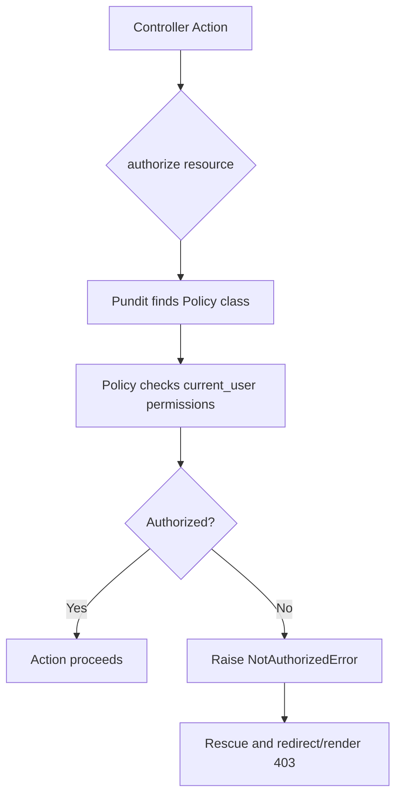
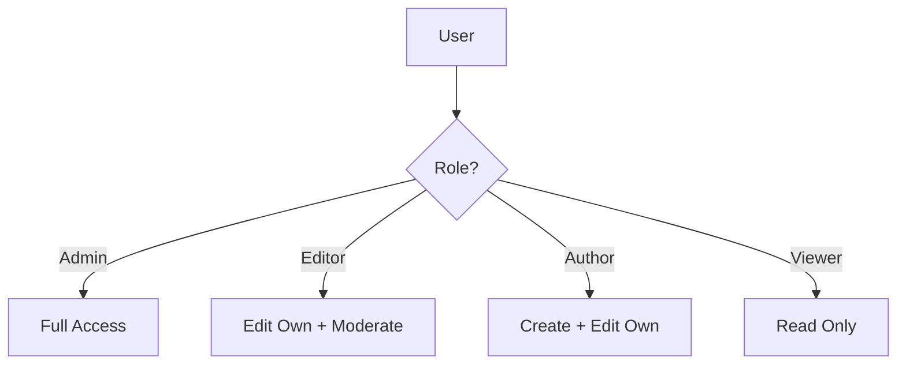

# How to Implement Authorization with Pundit

Author: [nawazdhandala](https://www.github.com/nawazdhandala)

Tags: Ruby on Rails, Pundit, Authorization, Security, Policy Objects, RBAC, Backend Development

Description: Learn how to implement clean, maintainable authorization in Ruby on Rails applications using Pundit policies with practical examples and best practices.

---

> Authorization determines what authenticated users can do. While authentication answers "who are you?", authorization answers "what can you do?". Pundit provides a simple, scalable way to handle authorization in Rails through plain Ruby objects called policies.

Authorization is one of those features that starts simple but grows complex quickly. Pundit keeps it manageable by organizing rules into policy classes that mirror your models.

---

## Why Pundit?

Pundit stands out for several reasons:

| Feature | Benefit |
|---------|---------|
| **Plain Ruby Objects** | No DSL to learn, just regular Ruby classes |
| **Convention Over Configuration** | Automatic policy lookup based on model names |
| **Explicit** | You see exactly what's happening, no magic |
| **Testable** | Policies are regular Ruby classes, easy to unit test |
| **Minimal Dependencies** | Single gem with no transitive dependencies |

---

## How Pundit Works



Pundit follows a simple convention: for a `Post` model, it looks for a `PostPolicy` class. The policy receives the current user and the record being authorized.

---

## Installation

Add Pundit to your Gemfile:

```ruby
# Gemfile
gem 'pundit'
```

Then install and set up:

```bash
# Install the gem
bundle install

# Generate the application policy
rails g pundit:install
```

This creates `app/policies/application_policy.rb`, the base class for all policies.

Include Pundit in your application controller:

```ruby
# app/controllers/application_controller.rb
class ApplicationController < ActionController::Base
  include Pundit::Authorization

  # Rescue from authorization failures
  rescue_from Pundit::NotAuthorizedError, with: :user_not_authorized

  private

  def user_not_authorized
    flash[:alert] = "You are not authorized to perform this action."
    redirect_back(fallback_location: root_path)
  end
end
```

---

## Your First Policy

Let's create a policy for a blog post:

```ruby
# app/policies/post_policy.rb
class PostPolicy < ApplicationPolicy
  # Can the user view this post?
  def show?
    # Published posts are visible to everyone
    # Draft posts are only visible to the author
    record.published? || record.author == user
  end

  # Can the user create posts?
  def create?
    # Any logged-in user can create posts
    user.present?
  end

  # Can the user update this post?
  def update?
    # Only the author can edit their posts
    record.author == user
  end

  # Can the user delete this post?
  def destroy?
    # Author can delete their own posts
    # Admins can delete any post
    record.author == user || user&.admin?
  end

  # Scope: which posts can this user see in a listing?
  class Scope < ApplicationPolicy::Scope
    def resolve
      if user&.admin?
        # Admins see all posts
        scope.all
      elsif user.present?
        # Logged-in users see published posts and their own drafts
        scope.where(published: true)
             .or(scope.where(author: user))
      else
        # Anonymous users only see published posts
        scope.where(published: true)
      end
    end
  end
end
```

---

## Using Policies in Controllers

Here's how to use the policy in your controller:

```ruby
# app/controllers/posts_controller.rb
class PostsController < ApplicationController
  before_action :set_post, only: [:show, :edit, :update, :destroy]

  def index
    # policy_scope automatically applies the Scope class
    @posts = policy_scope(Post).order(created_at: :desc)
  end

  def show
    # authorize checks if current_user can perform show? on @post
    authorize @post
  end

  def new
    @post = Post.new
    # authorize with the class checks create? permission
    authorize @post
  end

  def create
    @post = current_user.posts.build(post_params)
    authorize @post

    if @post.save
      redirect_to @post, notice: 'Post created successfully.'
    else
      render :new, status: :unprocessable_entity
    end
  end

  def edit
    authorize @post
  end

  def update
    authorize @post

    if @post.update(post_params)
      redirect_to @post, notice: 'Post updated successfully.'
    else
      render :edit, status: :unprocessable_entity
    end
  end

  def destroy
    authorize @post
    @post.destroy
    redirect_to posts_path, notice: 'Post deleted.'
  end

  private

  def set_post
    @post = Post.find(params[:id])
  end

  def post_params
    params.require(:post).permit(:title, :content, :published)
  end
end
```

---

## The Application Policy

The base `ApplicationPolicy` provides defaults and shared behavior:

```ruby
# app/policies/application_policy.rb
class ApplicationPolicy
  attr_reader :user, :record

  def initialize(user, record)
    @user = user
    @record = record
  end

  # Default: deny everything
  # Override in specific policies as needed
  def index?
    false
  end

  def show?
    false
  end

  def create?
    false
  end

  def new?
    create?
  end

  def update?
    false
  end

  def edit?
    update?
  end

  def destroy?
    false
  end

  # Base scope class
  class Scope
    attr_reader :user, :scope

    def initialize(user, scope)
      @user = user
      @scope = scope
    end

    def resolve
      raise NotImplementedError, "You must define #resolve in #{self.class}"
    end
  end
end
```

---

## Role-Based Authorization

Most applications have roles. Here's how to implement role-based access control (RBAC):



First, set up roles on your User model:

```ruby
# app/models/user.rb
class User < ApplicationRecord
  # Using an enum for roles
  enum role: {
    viewer: 0,
    author: 1,
    editor: 2,
    admin: 3
  }

  # Helper methods for role checking
  def at_least?(role_name)
    User.roles[role] >= User.roles[role_name]
  end
end
```

Then use roles in your policy:

```ruby
# app/policies/article_policy.rb
class ArticlePolicy < ApplicationPolicy
  def index?
    # Everyone can see the article list
    true
  end

  def show?
    # Published articles are public
    # Draft articles require at least author role
    record.published? || user&.at_least?(:author)
  end

  def create?
    # Authors and above can create articles
    user&.at_least?(:author)
  end

  def update?
    return false unless user

    # Admins can edit anything
    return true if user.admin?

    # Editors can edit any article
    return true if user.editor?

    # Authors can only edit their own articles
    user.author? && record.author == user
  end

  def destroy?
    # Only admins can delete articles
    user&.admin?
  end

  def publish?
    # Editors and admins can publish
    user&.at_least?(:editor)
  end

  def feature?
    # Only admins can feature articles
    user&.admin?
  end

  class Scope < ApplicationPolicy::Scope
    def resolve
      if user&.at_least?(:editor)
        scope.all
      elsif user&.author?
        scope.where(published: true).or(scope.where(author: user))
      else
        scope.where(published: true)
      end
    end
  end
end
```

---

## Permission-Based Authorization

For finer control, use permissions:

```ruby
# app/models/user.rb
class User < ApplicationRecord
  has_many :role_assignments
  has_many :roles, through: :role_assignments
  has_many :permissions, through: :roles

  def has_permission?(permission_name)
    permissions.exists?(name: permission_name)
  end

  def has_any_permission?(*permission_names)
    permissions.where(name: permission_names).exists?
  end

  def has_all_permissions?(*permission_names)
    permissions.where(name: permission_names).count == permission_names.size
  end
end

# app/models/role.rb
class Role < ApplicationRecord
  has_many :role_assignments
  has_many :users, through: :role_assignments
  has_many :role_permissions
  has_many :permissions, through: :role_permissions
end

# app/models/permission.rb
class Permission < ApplicationRecord
  has_many :role_permissions
  has_many :roles, through: :role_permissions
end
```

Use permissions in policies:

```ruby
# app/policies/report_policy.rb
class ReportPolicy < ApplicationPolicy
  def index?
    user&.has_permission?('reports.view')
  end

  def show?
    user&.has_permission?('reports.view')
  end

  def create?
    user&.has_permission?('reports.create')
  end

  def export?
    user&.has_permission?('reports.export')
  end

  def destroy?
    user&.has_permission?('reports.delete')
  end
end
```

---

## Scopes for Collections

Scopes determine which records a user can access in a collection:

```ruby
# app/policies/project_policy.rb
class ProjectPolicy < ApplicationPolicy
  class Scope < ApplicationPolicy::Scope
    def resolve
      if user.nil?
        # Anonymous users see nothing
        scope.none
      elsif user.admin?
        # Admins see all projects
        scope.all
      else
        # Regular users see projects they're members of
        scope.joins(:memberships)
             .where(memberships: { user_id: user.id })
      end
    end
  end
end

# In the controller
class ProjectsController < ApplicationController
  def index
    @projects = policy_scope(Project).includes(:owner)
  end
end
```

---

## Conditional Attributes

Control which attributes users can modify:

```ruby
# app/policies/user_policy.rb
class UserPolicy < ApplicationPolicy
  def update?
    # Users can update themselves, admins can update anyone
    record == user || user&.admin?
  end

  # Define permitted attributes based on context
  def permitted_attributes
    if user&.admin?
      # Admins can change everything including role
      [:name, :email, :password, :password_confirmation, :role, :active]
    elsif record == user
      # Users can only change their own profile info
      [:name, :email, :password, :password_confirmation]
    else
      []
    end
  end
end

# In the controller
class UsersController < ApplicationController
  def update
    @user = User.find(params[:id])
    authorize @user

    # Use policy to determine permitted params
    permitted = params.require(:user).permit(policy(@user).permitted_attributes)

    if @user.update(permitted)
      redirect_to @user, notice: 'Profile updated.'
    else
      render :edit, status: :unprocessable_entity
    end
  end
end
```

---

## View Helpers

Pundit provides helpers for conditional UI:

```erb
<%# app/views/posts/show.html.erb %>

<article>
  <h1><%= @post.title %></h1>
  <p><%= @post.content %></p>

  <%# Only show edit button if user can edit %>
  <% if policy(@post).update? %>
    <%= link_to 'Edit', edit_post_path(@post), class: 'btn' %>
  <% end %>

  <%# Only show delete button if user can destroy %>
  <% if policy(@post).destroy? %>
    <%= button_to 'Delete', @post, method: :delete,
        data: { confirm: 'Are you sure?' }, class: 'btn btn-danger' %>
  <% end %>

  <%# Only show publish button if user can publish %>
  <% if policy(@post).publish? && !@post.published? %>
    <%= button_to 'Publish', publish_post_path(@post),
        method: :patch, class: 'btn btn-success' %>
  <% end %>
</article>
```

Create a helper for cleaner views:

```ruby
# app/helpers/authorization_helper.rb
module AuthorizationHelper
  def can?(action, record)
    policy(record).public_send("#{action}?")
  end

  def cannot?(action, record)
    !can?(action, record)
  end
end
```

Now use it in views:

```erb
<% if can?(:update, @post) %>
  <%= link_to 'Edit', edit_post_path(@post) %>
<% end %>
```

---

## Testing Policies

Policies are easy to test because they're plain Ruby:

```ruby
# spec/policies/post_policy_spec.rb
require 'rails_helper'

RSpec.describe PostPolicy do
  subject { described_class }

  let(:admin) { create(:user, role: :admin) }
  let(:author) { create(:user, role: :author) }
  let(:viewer) { create(:user, role: :viewer) }
  let(:guest) { nil }

  let(:published_post) { create(:post, published: true, author: author) }
  let(:draft_post) { create(:post, published: false, author: author) }

  permissions :show? do
    it "grants access to everyone for published posts" do
      expect(subject).to permit(guest, published_post)
      expect(subject).to permit(viewer, published_post)
      expect(subject).to permit(author, published_post)
      expect(subject).to permit(admin, published_post)
    end

    it "denies access to guests for draft posts" do
      expect(subject).not_to permit(guest, draft_post)
    end

    it "grants access to author for their own draft" do
      expect(subject).to permit(author, draft_post)
    end
  end

  permissions :create? do
    it "denies access to guests" do
      expect(subject).not_to permit(guest, Post)
    end

    it "grants access to any logged-in user" do
      expect(subject).to permit(viewer, Post)
      expect(subject).to permit(author, Post)
    end
  end

  permissions :update? do
    it "denies access to non-authors" do
      other_user = create(:user)
      expect(subject).not_to permit(other_user, published_post)
    end

    it "grants access to the author" do
      expect(subject).to permit(author, published_post)
    end

    it "grants access to admins" do
      expect(subject).to permit(admin, published_post)
    end
  end

  permissions :destroy? do
    it "denies access to viewers" do
      expect(subject).not_to permit(viewer, published_post)
    end

    it "grants access to the author" do
      expect(subject).to permit(author, published_post)
    end

    it "grants access to admins" do
      expect(subject).to permit(admin, published_post)
    end
  end

  describe PostPolicy::Scope do
    let!(:published) { create(:post, published: true) }
    let!(:draft) { create(:post, published: false, author: author) }
    let!(:other_draft) { create(:post, published: false) }

    subject { described_class.new(user, Post.all).resolve }

    context "as a guest" do
      let(:user) { nil }

      it "returns only published posts" do
        expect(subject).to include(published)
        expect(subject).not_to include(draft)
        expect(subject).not_to include(other_draft)
      end
    end

    context "as an author" do
      let(:user) { author }

      it "returns published posts and own drafts" do
        expect(subject).to include(published)
        expect(subject).to include(draft)
        expect(subject).not_to include(other_draft)
      end
    end

    context "as an admin" do
      let(:user) { admin }

      it "returns all posts" do
        expect(subject).to include(published)
        expect(subject).to include(draft)
        expect(subject).to include(other_draft)
      end
    end
  end
end
```

---

## Ensuring Authorization

Force authorization checks in all controllers:

```ruby
# app/controllers/application_controller.rb
class ApplicationController < ActionController::Base
  include Pundit::Authorization

  # Ensure every action authorizes
  after_action :verify_authorized, except: :index
  after_action :verify_policy_scoped, only: :index

  rescue_from Pundit::NotAuthorizedError, with: :user_not_authorized

  private

  def user_not_authorized(exception)
    policy_name = exception.policy.class.to_s.underscore

    flash[:alert] = t("#{policy_name}.#{exception.query}",
                      scope: "pundit",
                      default: :default)

    redirect_back(fallback_location: root_path)
  end
end
```

Skip verification for specific actions:

```ruby
class PagesController < ApplicationController
  skip_after_action :verify_authorized, only: [:home, :about]

  def home
    # Public page, no authorization needed
  end

  def about
    # Public page, no authorization needed
  end
end
```

---

## Headless Policies

For actions not tied to a model:

```ruby
# app/policies/dashboard_policy.rb
class DashboardPolicy < ApplicationPolicy
  def initialize(user, _record = nil)
    @user = user
  end

  def show?
    user.present?
  end

  def admin_section?
    user&.admin?
  end

  def analytics?
    user&.at_least?(:editor)
  end
end

# In the controller
class DashboardController < ApplicationController
  def show
    # Pass a symbol for headless policies
    authorize :dashboard, :show?
  end

  def analytics
    authorize :dashboard, :analytics?
    @stats = AnalyticsService.generate_report
  end
end
```

---

## Handling Complex Authorization

For complex scenarios, extract logic into methods:

```ruby
# app/policies/document_policy.rb
class DocumentPolicy < ApplicationPolicy
  def show?
    public_document? || owner? || shared_with_user? || admin?
  end

  def update?
    owner? || editor_access? || admin?
  end

  def share?
    owner? || admin?
  end

  def download?
    show? && record.downloadable?
  end

  private

  def public_document?
    record.visibility == 'public'
  end

  def owner?
    record.owner == user
  end

  def admin?
    user&.admin?
  end

  def shared_with_user?
    return false unless user
    record.shares.exists?(user: user)
  end

  def editor_access?
    return false unless user
    record.shares.exists?(user: user, permission: 'edit')
  end
end
```

---

## Multi-Tenancy Support

For multi-tenant applications:

```ruby
# app/policies/application_policy.rb
class ApplicationPolicy
  attr_reader :user, :record

  def initialize(user, record)
    @user = user
    @record = record
  end

  private

  def same_organization?
    return false unless user && record.respond_to?(:organization_id)
    user.organization_id == record.organization_id
  end

  def organization_admin?
    user&.organization_admin?
  end
end

# app/policies/team_policy.rb
class TeamPolicy < ApplicationPolicy
  def index?
    user.present?
  end

  def show?
    same_organization?
  end

  def create?
    organization_admin?
  end

  def update?
    same_organization? && (team_lead? || organization_admin?)
  end

  def destroy?
    organization_admin?
  end

  private

  def team_lead?
    record.lead == user
  end

  class Scope < ApplicationPolicy::Scope
    def resolve
      # Users only see teams in their organization
      scope.where(organization_id: user.organization_id)
    end
  end
end
```

---

## Best Practices

### 1. Keep Policies Focused

Each policy should handle one model or resource:

```ruby
# Good: focused policy
class CommentPolicy < ApplicationPolicy
  def create?
    user.present? && parent_accessible?
  end

  private

  def parent_accessible?
    PostPolicy.new(user, record.post).show?
  end
end
```

### 2. Use Descriptive Method Names

```ruby
# Good: clear intent
def publish?
  user&.editor? && record.ready_for_publication?
end

def archive?
  owner? || admin?
end

def restore?
  admin? && record.archived?
end
```

### 3. Handle nil Users Gracefully

```ruby
# Always use safe navigation
def update?
  user&.admin? || (user && record.author == user)
end
```

### 4. Document Complex Logic

```ruby
def show?
  # Public documents are visible to everyone
  return true if record.public?

  # Private documents require authentication
  return false unless user

  # Check document-level permissions
  owner? || shared_with_user? || organization_access?
end
```

---

## Conclusion

Pundit makes authorization in Rails straightforward and maintainable:

- **Simple mental model**: One policy class per model
- **Plain Ruby**: No DSL to learn
- **Testable**: Easy to unit test policies
- **Flexible**: Works with any authentication system
- **Explicit**: Clear about what's happening

Start simple with basic policies, then add complexity as your application grows. The pattern scales well from simple blogs to complex enterprise applications.

---

*Need to monitor your Rails application's performance? [OneUptime](https://oneuptime.com) provides comprehensive application monitoring with support for Ruby on Rails applications.*

**Related Reading:**
- [What is Site Reliability Engineering](https://oneuptime.com/blog/post/2025-11-28-what-is-site-reliability-engineering/view)
- [SRE Best Practices](https://oneuptime.com/blog/post/2025-11-28-sre-best-practices/view)
