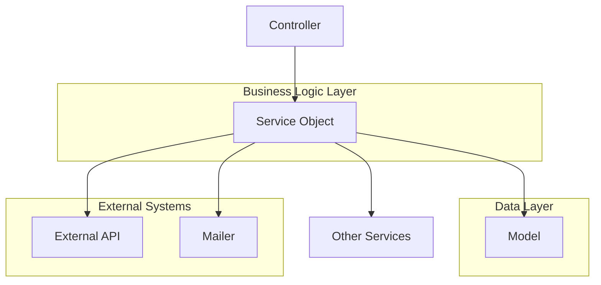
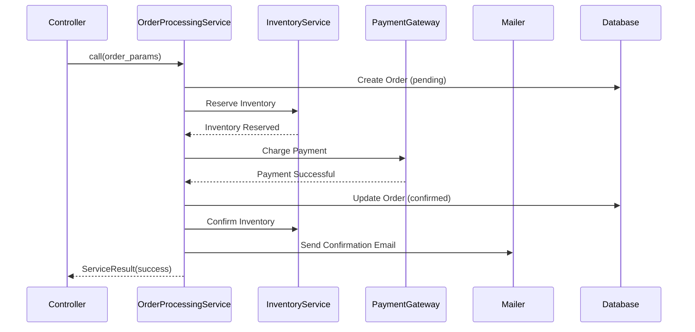
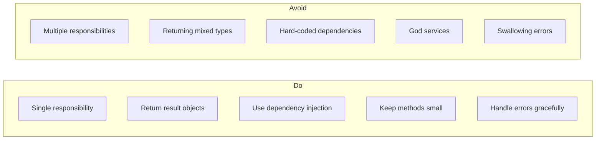

# How to Use Service Objects in Rails

Author: [nawazdhandala](https://www.github.com/nawazdhandala)

Tags: Ruby on Rails, Service Objects, Design Patterns, Ruby, Refactoring, Clean Code, Software Architecture

Description: Learn how to implement service objects in Rails to keep your controllers thin, models focused, and business logic organized.

---

As Rails applications grow, controllers become bloated with business logic, and models turn into "god objects" with hundreds of methods. Service objects provide a clean solution by encapsulating complex business operations into dedicated classes. This guide walks you through implementing service objects effectively in your Rails applications.

## What Are Service Objects?

Service objects are plain Ruby classes that encapsulate a single business operation. They extract complex logic from controllers and models, making your codebase easier to test, maintain, and understand.

Here is how service objects fit into your Rails architecture:



## When to Use Service Objects

Service objects work best when you have:

- **Complex business operations** that involve multiple steps
- **Cross-model transactions** that touch several database tables
- **External API integrations** that need error handling and retries
- **Business rules** that do not belong in a single model
- **Controller actions** that have grown beyond simple CRUD operations

## Basic Service Object Structure

Let us start with a simple service object pattern. Create a directory for your services:

```bash
mkdir app/services
```

Here is a basic service object template:

```ruby
# app/services/application_service.rb
#
# Base class for all service objects. Provides a clean interface
# for calling services and standardizes the pattern across your app.
class ApplicationService
  # Allows calling the service with Service.call(args) syntax
  # instead of Service.new(args).call
  def self.call(...)
    new(...).call
  end
end
```

Now let us build a real-world example. Imagine you have a user registration flow that needs to:

1. Create the user record
2. Send a welcome email
3. Create a default workspace
4. Track the signup event in analytics

```ruby
# app/services/users/registration_service.rb
#
# Handles the complete user registration flow including account creation,
# welcome email, default workspace setup, and analytics tracking.
module Users
  class RegistrationService < ApplicationService
    # Initialize with user parameters
    # @param params [Hash] User attributes from the registration form
    def initialize(params)
      @params = params
      @user = nil
      @errors = []
    end

    # Execute the registration flow
    # @return [ServiceResult] Result object containing user and any errors
    def call
      ActiveRecord::Base.transaction do
        create_user
        create_default_workspace if @user.persisted?
        send_welcome_email if @user.persisted?
        track_signup_event if @user.persisted?
      end

      ServiceResult.new(
        success: @errors.empty?,
        data: @user,
        errors: @errors
      )
    rescue StandardError => e
      # Log the error for debugging
      Rails.logger.error("Registration failed: #{e.message}")

      ServiceResult.new(
        success: false,
        data: nil,
        errors: ["Registration failed. Please try again."]
      )
    end

    private

    # Create the user record with provided parameters
    def create_user
      @user = User.new(@params)

      unless @user.save
        @errors.concat(@user.errors.full_messages)
        # Raise to trigger transaction rollback
        raise ActiveRecord::Rollback
      end
    end

    # Set up a default workspace for the new user
    def create_default_workspace
      workspace = Workspace.create(
        name: "#{@user.name}'s Workspace",
        owner: @user
      )

      unless workspace.persisted?
        @errors << "Failed to create default workspace"
        raise ActiveRecord::Rollback
      end
    end

    # Send welcome email asynchronously
    def send_welcome_email
      UserMailer.welcome_email(@user).deliver_later
    end

    # Track signup in analytics system
    def track_signup_event
      Analytics.track(
        user_id: @user.id,
        event: "user_signed_up",
        properties: {
          signup_source: @params[:signup_source],
          plan: "free"
        }
      )
    end
  end
end
```

## Creating a Result Object

Service objects should return consistent result objects. This makes error handling predictable:

```ruby
# app/services/service_result.rb
#
# Standardized result object returned by all service objects.
# Provides a consistent interface for checking success/failure
# and accessing returned data or errors.
class ServiceResult
  attr_reader :data, :errors

  # @param success [Boolean] Whether the operation succeeded
  # @param data [Object] The primary data returned by the service
  # @param errors [Array<String>] List of error messages if failed
  def initialize(success:, data: nil, errors: [])
    @success = success
    @data = data
    @errors = errors
  end

  # Check if the operation was successful
  # @return [Boolean]
  def success?
    @success
  end

  # Check if the operation failed
  # @return [Boolean]
  def failure?
    !@success
  end

  # Get the first error message
  # @return [String, nil]
  def error_message
    errors.first
  end
end
```

## Using Service Objects in Controllers

With service objects, your controllers stay focused on HTTP concerns:

```ruby
# app/controllers/registrations_controller.rb
#
# Handles user registration requests. Delegates business logic
# to the RegistrationService and handles the HTTP response.
class RegistrationsController < ApplicationController
  # POST /register
  def create
    # Call the service with form parameters
    result = Users::RegistrationService.call(registration_params)

    if result.success?
      # Sign in the user and redirect to dashboard
      sign_in(result.data)
      redirect_to dashboard_path, notice: "Welcome! Your account has been created."
    else
      # Re-render the form with errors
      @user = User.new(registration_params)
      @errors = result.errors
      render :new, status: :unprocessable_entity
    end
  end

  private

  def registration_params
    params.require(:user).permit(:name, :email, :password, :signup_source)
  end
end
```

## Complex Example: Order Processing

Let us look at a more complex example. Processing an e-commerce order involves multiple steps and external services:



```ruby
# app/services/orders/processing_service.rb
#
# Handles the complete order processing workflow including
# inventory reservation, payment processing, and confirmation.
module Orders
  class ProcessingService < ApplicationService
    # @param order [Order] The order to process
    # @param payment_token [String] Token from payment form
    def initialize(order:, payment_token:)
      @order = order
      @payment_token = payment_token
      @errors = []
    end

    def call
      return failure("Order is not in pending state") unless @order.pending?

      ActiveRecord::Base.transaction do
        reserve_inventory
        process_payment
        confirm_order
        send_confirmation
      end

      success(@order.reload)
    rescue InventoryError => e
      failure("Some items are no longer available: #{e.message}")
    rescue PaymentError => e
      release_inventory
      failure("Payment failed: #{e.message}")
    rescue StandardError => e
      Rails.logger.error("Order processing failed: #{e.message}\n#{e.backtrace.first(5).join("\n")}")
      release_inventory
      failure("Order processing failed. Please try again.")
    end

    private

    # Reserve inventory for all order items
    # Raises InventoryError if any item is unavailable
    def reserve_inventory
      @order.line_items.each do |item|
        reservation = Inventory::ReservationService.call(
          product_id: item.product_id,
          quantity: item.quantity,
          order_id: @order.id
        )

        unless reservation.success?
          raise InventoryError, "#{item.product.name} - #{reservation.error_message}"
        end
      end
    end

    # Release previously reserved inventory on failure
    def release_inventory
      Inventory::ReleaseService.call(order_id: @order.id)
    rescue StandardError => e
      # Log but do not raise - this is cleanup
      Rails.logger.error("Failed to release inventory for order #{@order.id}: #{e.message}")
    end

    # Process payment through the payment gateway
    def process_payment
      payment_result = Payments::ChargeService.call(
        amount: @order.total_cents,
        currency: @order.currency,
        token: @payment_token,
        description: "Order ##{@order.number}",
        metadata: { order_id: @order.id }
      )

      unless payment_result.success?
        raise PaymentError, payment_result.error_message
      end

      # Store payment reference on the order
      @order.update!(
        payment_id: payment_result.data[:payment_id],
        paid_at: Time.current
      )
    end

    # Mark the order as confirmed
    def confirm_order
      @order.confirm!

      # Confirm inventory reservations
      Inventory::ConfirmService.call(order_id: @order.id)
    end

    # Send order confirmation email
    def send_confirmation
      OrderMailer.confirmation(@order).deliver_later
    end

    # Build a successful result
    def success(data)
      ServiceResult.new(success: true, data: data)
    end

    # Build a failure result
    def failure(message)
      ServiceResult.new(success: false, errors: [message])
    end
  end

  # Custom error for inventory issues
  class InventoryError < StandardError; end

  # Custom error for payment issues
  class PaymentError < StandardError; end
end
```

## Service Objects with Callbacks

Sometimes you need hooks for logging, metrics, or notifications. Here is a pattern that supports callbacks:

```ruby
# app/services/concerns/service_callbacks.rb
#
# Mixin that adds before/after callback support to service objects.
# Useful for logging, metrics, and cross-cutting concerns.
module ServiceCallbacks
  extend ActiveSupport::Concern

  included do
    # Store callback blocks at the class level
    class_attribute :before_callbacks, default: []
    class_attribute :after_callbacks, default: []
  end

  class_methods do
    # Register a before callback
    # @param method_name [Symbol] Method to call before execution
    def before_call(method_name)
      self.before_callbacks = before_callbacks + [method_name]
    end

    # Register an after callback
    # @param method_name [Symbol] Method to call after execution
    def after_call(method_name)
      self.after_callbacks = after_callbacks + [method_name]
    end
  end

  # Override call to run callbacks
  def call
    run_callbacks(:before)
    result = super
    run_callbacks(:after, result)
    result
  end

  private

  def run_callbacks(type, result = nil)
    callbacks = type == :before ? before_callbacks : after_callbacks

    callbacks.each do |callback|
      if result
        send(callback, result)
      else
        send(callback)
      end
    end
  end
end
```

Using callbacks in a service:

```ruby
# app/services/reports/generation_service.rb
#
# Generates reports with timing metrics and notification callbacks.
module Reports
  class GenerationService < ApplicationService
    include ServiceCallbacks

    before_call :log_start
    before_call :record_start_time
    after_call :log_completion
    after_call :record_metrics

    def initialize(report_type:, date_range:, user:)
      @report_type = report_type
      @date_range = date_range
      @user = user
      @start_time = nil
    end

    def call
      report = Report.create!(
        report_type: @report_type,
        user: @user,
        status: "processing"
      )

      # Generate report data based on type
      data = generate_report_data

      # Store the report
      report.update!(
        data: data,
        status: "completed",
        completed_at: Time.current
      )

      ServiceResult.new(success: true, data: report)
    rescue StandardError => e
      Rails.logger.error("Report generation failed: #{e.message}")
      ServiceResult.new(success: false, errors: [e.message])
    end

    private

    def generate_report_data
      case @report_type
      when "sales"
        SalesReportGenerator.new(@date_range).generate
      when "inventory"
        InventoryReportGenerator.new(@date_range).generate
      when "users"
        UsersReportGenerator.new(@date_range).generate
      else
        raise ArgumentError, "Unknown report type: #{@report_type}"
      end
    end

    def log_start
      Rails.logger.info("Starting #{@report_type} report generation for user #{@user.id}")
    end

    def record_start_time
      @start_time = Time.current
    end

    def log_completion(result)
      status = result.success? ? "completed" : "failed"
      Rails.logger.info("Report generation #{status} for user #{@user.id}")
    end

    def record_metrics(result)
      duration = Time.current - @start_time

      StatsD.measure("reports.generation.duration", duration, tags: [
        "report_type:#{@report_type}",
        "success:#{result.success?}"
      ])
    end
  end
end
```

## Testing Service Objects

Service objects are straightforward to test because they are plain Ruby classes:

```ruby
# spec/services/users/registration_service_spec.rb
#
# Tests for the user registration service covering success
# and failure scenarios.
require "rails_helper"

RSpec.describe Users::RegistrationService do
  describe ".call" do
    let(:valid_params) do
      {
        name: "John Doe",
        email: "john@example.com",
        password: "securepassword123",
        signup_source: "homepage"
      }
    end

    context "with valid parameters" do
      it "creates a user" do
        expect {
          described_class.call(valid_params)
        }.to change(User, :count).by(1)
      end

      it "returns a successful result" do
        result = described_class.call(valid_params)

        expect(result).to be_success
        expect(result.data).to be_a(User)
        expect(result.data.email).to eq("john@example.com")
      end

      it "creates a default workspace" do
        expect {
          described_class.call(valid_params)
        }.to change(Workspace, :count).by(1)
      end

      it "sends a welcome email" do
        expect {
          described_class.call(valid_params)
        }.to have_enqueued_mail(UserMailer, :welcome_email)
      end

      it "tracks the signup event" do
        expect(Analytics).to receive(:track).with(
          hash_including(event: "user_signed_up")
        )

        described_class.call(valid_params)
      end
    end

    context "with invalid parameters" do
      let(:invalid_params) { valid_params.merge(email: "") }

      it "does not create a user" do
        expect {
          described_class.call(invalid_params)
        }.not_to change(User, :count)
      end

      it "returns a failure result with errors" do
        result = described_class.call(invalid_params)

        expect(result).to be_failure
        expect(result.errors).to include("Email can't be blank")
      end

      it "does not create a workspace" do
        expect {
          described_class.call(invalid_params)
        }.not_to change(Workspace, :count)
      end

      it "does not send a welcome email" do
        expect {
          described_class.call(invalid_params)
        }.not_to have_enqueued_mail(UserMailer, :welcome_email)
      end
    end

    context "when an unexpected error occurs" do
      before do
        allow(User).to receive(:new).and_raise(StandardError, "Database connection lost")
      end

      it "returns a failure result" do
        result = described_class.call(valid_params)

        expect(result).to be_failure
        expect(result.errors).to include("Registration failed. Please try again.")
      end

      it "logs the error" do
        expect(Rails.logger).to receive(:error).with(/Registration failed/)

        described_class.call(valid_params)
      end
    end
  end
end
```

## Organizing Service Objects

As your application grows, organize services by domain:

```
app/services/
├── application_service.rb
├── service_result.rb
├── concerns/
│   └── service_callbacks.rb
├── users/
│   ├── registration_service.rb
│   ├── password_reset_service.rb
│   └── account_deletion_service.rb
├── orders/
│   ├── processing_service.rb
│   ├── cancellation_service.rb
│   └── refund_service.rb
├── inventory/
│   ├── reservation_service.rb
│   ├── release_service.rb
│   └── confirm_service.rb
├── payments/
│   ├── charge_service.rb
│   └── refund_service.rb
└── reports/
    └── generation_service.rb
```

This structure maps to your business domains, making it easy to find related code.

## Best Practices

Here are guidelines for writing effective service objects:



**1. Single Responsibility**

Each service should do one thing well. If your service has multiple public methods or does unrelated things, split it up.

```ruby
# Good: Single focused service
class Users::PasswordResetService < ApplicationService
  def call
    generate_token
    send_reset_email
    success
  end
end

# Bad: Service doing too many unrelated things
class UserService < ApplicationService
  def reset_password; end
  def update_profile; end
  def delete_account; end
  def generate_report; end
end
```

**2. Dependency Injection**

Pass dependencies into your services to make them testable:

```ruby
# app/services/orders/notification_service.rb
#
# Sends order notifications. Dependencies are injectable for testing.
class Orders::NotificationService < ApplicationService
  # @param order [Order] The order to notify about
  # @param mailer [Class] The mailer class to use (defaults to OrderMailer)
  # @param sms_client [Object] SMS client for text notifications
  def initialize(order:, mailer: OrderMailer, sms_client: TwilioClient)
    @order = order
    @mailer = mailer
    @sms_client = sms_client
  end

  def call
    send_email_notification
    send_sms_notification if @order.user.sms_notifications_enabled?

    success
  end

  private

  def send_email_notification
    @mailer.order_confirmation(@order).deliver_later
  end

  def send_sms_notification
    @sms_client.send_message(
      to: @order.user.phone_number,
      body: "Your order ##{@order.number} has been confirmed!"
    )
  end
end
```

**3. Meaningful Error Messages**

Return specific error messages that help users and developers:

```ruby
# Good: Specific error messages
def validate_order
  if @order.line_items.empty?
    return failure("Cannot process an empty order")
  end

  if @order.total_cents <= 0
    return failure("Order total must be greater than zero")
  end

  expired_items = @order.line_items.select { |i| i.product.discontinued? }
  if expired_items.any?
    names = expired_items.map { |i| i.product.name }.join(", ")
    return failure("These products are no longer available: #{names}")
  end

  nil
end
```

## Conclusion

Service objects bring structure to your Rails application's business logic. They keep controllers thin, models focused, and make your code easier to test and maintain.

Start by identifying complex operations in your controllers and models. Extract them into service objects one at a time. As you get comfortable with the pattern, you will naturally reach for service objects when building new features.

The key principles to remember:

- One service, one responsibility
- Always return result objects
- Handle errors at the service boundary
- Inject dependencies for testability
- Organize by business domain

Service objects are not a silver bullet, but they are a practical tool for managing complexity in growing Rails applications.
